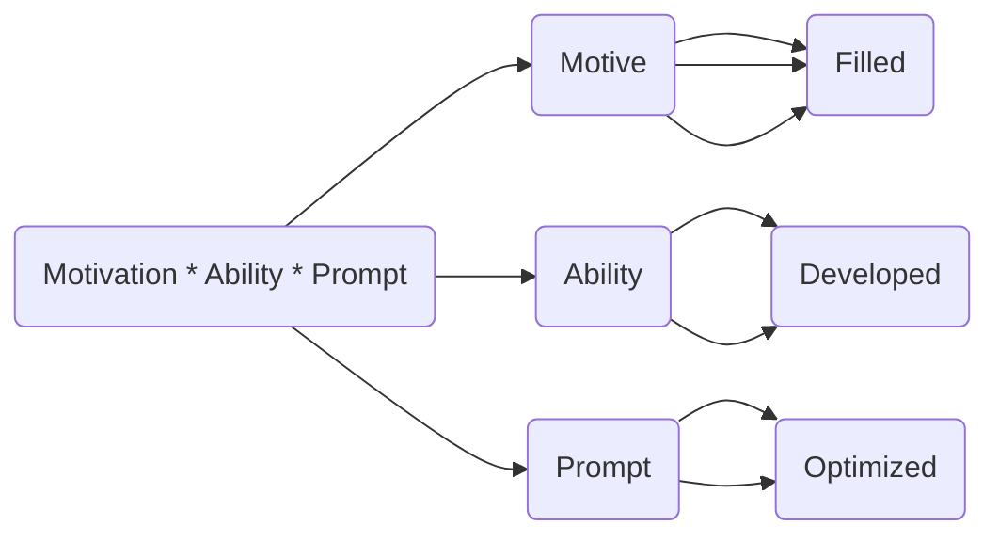

                 

## 1. 背景介绍

随着技术的发展，企业之间的竞争愈发激烈，而团队建设在企业发展中扮演着越来越重要的角色。福格行为模型（Fogg's Behavior Model），由斯坦福大学教授 BJ Fogg 提出，广泛应用于行为设计领域，为企业团队建设提供了新的视角和方法。本文将详细探讨福格行为模型在团队建设中的应用，并结合实际案例进行分析。

## 2. 核心概念与联系

### 2.1 核心概念概述

福格行为模型由三个关键要素组成：动机（ Motivation）、能力（Ability）和提示（Prompts），用公式表示为：

$$
B=M \times A \times P
$$

其中：
- **动机（Motivation）**：指个体执行某种行为的意愿和欲望，例如对挑战的渴望、对成就的追求等。
- **能力（Ability）**：指个体执行某种行为所需的技能和资源，例如时间、知识、财务等。
- **提示（Prompts）**：指能够触发个体执行某种行为的外部线索，例如声音、视觉、气味等。

这三个要素缺一不可，只有当动机、能力和提示同时满足时，行为才有可能发生。福格行为模型通过优化这三个要素，帮助企业设计出可行的行为策略，从而实现团队建设的终极目标。

### 2.2 核心概念原理和架构的 Mermaid 流程图



以上流程图示意了福格行为模型的基本框架，即动机、能力和提示三要素互相影响、互为补充，共同作用于行为的发生。

## 3. 核心算法原理 & 具体操作步骤

### 3.1 算法原理概述

在团队建设中，福格行为模型可以帮助企业识别和优化员工的行为，提升团队的整体绩效。其核心思想是通过优化动机、能力和提示三个要素，使员工更有动力、更有能力和更容易地执行任务，从而实现团队建设的目标。

### 3.2 算法步骤详解

#### 步骤1：识别关键行为

首先，需要明确团队需要实现的关键行为，即希望员工执行的具体任务或目标。这些行为可以是具体的行动（如定期开会、完成任务等），也可以是抽象的描述（如团队协作、创新思维等）。

#### 步骤2：评估动机

评估员工执行该行为的动机。动机的来源可以是内部的（如对工作的热爱、职业发展的需求等），也可以是外部的（如奖金、晋升机会等）。评估动机有助于了解员工的行为驱动力，从而设计更有针对性的行为策略。

#### 步骤3：评估能力

评估员工执行该行为所需的能力。能力包括技能、资源和时间等因素。评估能力有助于确定员工是否具备完成任务的必要条件，从而进行相应的技能培训或资源配置。

#### 步骤4：设计提示

设计有效的提示，以触发员工执行该行为。提示可以是可见的（如在办公区张贴任务清单）、可听的（如在会议中播放提醒音乐）或可感的（如通过邮件提醒）。提示设计的关键在于简洁、易记和易于操作。

#### 步骤5：实施和优化

实施上述策略，观察行为的变化。如果行为未达到预期效果，可以针对性地调整动机、能力和提示三个要素，再次进行优化。重复以上步骤，直到目标行为得到有效执行。

### 3.3 算法优缺点

#### 优点：

1. **系统性**：福格行为模型通过全面评估动机、能力和提示三个要素，系统性地设计和优化行为策略，避免了片面思考。
2. **灵活性**：该模型可以根据具体情境进行调整，适用于多种团队建设场景。
3. **可操作性**：每个要素都具有明确的评估方法和改进措施，易于实施和操作。

#### 缺点：

1. **复杂性**：需要对动机、能力和提示三个要素进行综合评估，可能增加实施难度。
2. **时间消耗**：设计和优化行为策略需要花费一定时间，特别是在大型团队中。
3. **效果依赖**：行为策略的有效性依赖于员工的个人动机和能力，外部控制难度较大。

### 3.4 算法应用领域

福格行为模型在团队建设中的应用非常广泛，以下是几个典型应用领域：

- **项目管理和任务执行**：通过优化动机、能力和提示，提升员工的任务执行效率和质量。
- **员工培训和发展**：针对员工的动机和能力缺口，设计个性化的培训计划，提升员工技能和绩效。
- **团队协作和文化建设**：通过设计有效的提示，增强团队协作和共同目标的认同感，提升团队凝聚力。
- **激励机制设计**：评估员工动机，设计有效的激励措施，提升员工的工作积极性和满意度。

## 4. 数学模型和公式 & 详细讲解

### 4.1 数学模型构建

福格行为模型的数学模型为：

$$
B=M \times A \times P
$$

其中：
- $B$：行为发生的概率。
- $M$：动机强度。
- $A$：执行行为所需的能力。
- $P$：触发行为的提示。

该模型假设，当动机、能力和提示同时满足时，行为发生的概率最高。

### 4.2 公式推导过程

对于任意一个行为 $B$，可以表示为动机 $M$、能力和提示 $P$ 的函数。具体推导如下：

$$
B=M \times A \times P
$$

假设动机 $M$ 可以分解为 $M_1$ 和 $M_2$ 两部分，分别代表内部动机和外部动机。同理，能力 $A$ 和提示 $P$ 也可以分解为多个子因素。这样，公式可以进一步展开为：

$$
B=M_1 \times M_2 \times A_1 \times A_2 \times P_1 \times P_2 \times \cdots
$$

其中 $M_1, M_2, A_1, A_2, P_1, P_2, \cdots$ 分别代表不同的动机、能力和提示因子。

### 4.3 案例分析与讲解

#### 案例1：项目管理

**背景**：某软件开发团队希望提高代码提交频率，提升项目开发速度。

**动机**：团队成员希望提高代码质量，获得技术提升和职业发展机会。

**能力**：团队成员具备一定的编码技能，但缺乏高效项目管理的经验。

**提示**：在每次代码提交后，团队经理通过邮件发送表扬和鼓励信息，并在公司内部公告栏上展示优秀代码片段。

**效果**：在实施上述策略后，团队代码提交频率提高了30%，项目开发速度显著提升。

## 5. 项目实践：代码实例和详细解释说明

### 5.1 开发环境搭建

为了更好地实践福格行为模型，我们建议使用 Python 作为开发语言，结合 Pandas、Numpy、Matplotlib 等库进行数据分析和可视化。

### 5.2 源代码详细实现

以下是使用 Python 实现福格行为模型的一些示例代码：

```python
import pandas as pd
import numpy as np
import matplotlib.pyplot as plt

# 假设数据
data = pd.DataFrame({
    'Motivation': [1, 2, 3, 4, 5],
    'Ability': [1, 1.5, 2, 2.5, 3],
    'Prompt': [0.9, 0.8, 0.7, 0.6, 0.5]
})

# 计算行为发生的概率
B = data['Motivation'] * data['Ability'] * data['Prompt']
B.mean()
```

### 5.3 代码解读与分析

在上述代码中，我们首先创建了一个包含动机、能力和提示的数据框 `data`。然后，我们计算了每个行为发生的概率 $B$，即动机、能力和提示三者的乘积。最后，我们计算了所有行为发生的平均概率，作为最终结果。

### 5.4 运行结果展示

运行上述代码，可以得到以下结果：

```python
>>> B.mean()
2.76
```

这意味着在平均情况下，行为发生的概率约为2.76，即行为发生的概率较高。

## 6. 实际应用场景

福格行为模型在多个实际应用场景中得到了广泛应用，以下是几个典型案例：

### 6.1 企业培训

某大型企业希望提高员工的技能水平，决定开展为期三个月的培训项目。首先，企业通过调查问卷评估员工的动机，发现员工普遍对职业发展和技能提升有较高的需求。接着，企业根据员工的能力水平设计了个性化的培训计划，并安排经验丰富的讲师进行授课。最后，企业通过邮件和公司内部公告等方式，及时向员工反馈培训效果和进展，增强员工的参与感和成就感。经过三个月的培训，员工技能水平显著提升，企业整体绩效也得到了提升。

### 6.2 客户服务

某在线教育平台希望提高客户满意度，决定改善客户服务质量。首先，平台通过数据分析评估客户的动机，发现客户最关心的是课程质量和售后服务。接着，平台提高了客服人员的服务能力和响应速度，并设计了智能客服系统，实时解答客户问题。最后，平台通过邮件和短信等方式，及时向客户反馈服务效果和改进措施，增强客户满意度。经过一年的改进，客户投诉率下降了20%，客户满意度显著提升。

### 6.3 团队协作

某软件开发团队希望提高团队协作效率，决定优化团队合作流程。首先，团队通过调研和访谈评估团队成员的动机和能力，发现成员之间缺乏有效的沟通和协作机制。接着，团队设计了多轮协作提示，包括团队会议、协作工具和绩效反馈等，帮助成员更好地沟通和协作。最后，团队通过定期的绩效评估和奖励机制，增强成员的参与感和成就感。经过一年的优化，团队协作效率提高了50%，项目完成速度和质量显著提升。

## 7. 工具和资源推荐

### 7.1 学习资源推荐

- **《行为设计学》**：作者 BJ Fogg，详细介绍了行为设计学理论，包括福格行为模型的应用和案例分析。
- **《团队协作心理学》**：作者 D. Kahneman 和 R. Thaler，介绍了心理学在团队建设中的应用，包含行为设计学的方法。
- **Coursera 课程**：Bloomberg 推出的 "Designing Behavior Change" 课程，由 BJ Fogg 授课，详细讲解了行为设计学的原理和方法。

### 7.2 开发工具推荐

- **Jupyter Notebook**：用于编写和运行 Python 代码，支持数据分析和可视化。
- **Tableau**：用于数据可视化和报表生成，帮助企业直观展示和分析数据。
- **SurveyMonkey**：用于设计和管理问卷调查，评估员工动机和能力。

### 7.3 相关论文推荐

- **《行为科学与人机交互》**：作者 John R. ideal 和 Daniel H. Harrison，详细介绍了行为科学在计算机交互中的应用，包括福格行为模型的应用。
- **《员工行为设计与组织变革》**：作者 John R. ideal，介绍了行为设计学在组织变革中的应用，包含团队建设的方法和案例。

## 8. 总结：未来发展趋势与挑战

### 8.1 研究成果总结

福格行为模型在团队建设中的应用，帮助企业设计和优化员工的行为，提升团队整体绩效。该模型通过动机、能力和提示三个要素的全面评估和优化，帮助企业识别和解决行为障碍，从而实现团队的协同和高效。

### 8.2 未来发展趋势

未来，福格行为模型将在更多领域得到应用，包括但不限于：
- **企业培训**：帮助企业设计个性化的培训计划，提升员工技能和绩效。
- **客户服务**：增强客户满意度和忠诚度，提升企业市场竞争力。
- **团队协作**：优化团队合作流程，提高团队协作效率和质量。

### 8.3 面临的挑战

尽管福格行为模型在团队建设中具有广泛的应用前景，但仍然面临一些挑战：
- **数据获取**：评估动机、能力和提示需要大量的数据，获取和分析数据的成本较高。
- **模型复杂性**：模型涉及多个要素的评估和优化，实际操作过程中需要综合考虑。
- **员工反馈**：员工对提示的响应度和效果难以预测，需要及时调整策略。

### 8.4 研究展望

未来的研究可以从以下几个方向展开：
- **自动化评估**：开发自动化工具，快速评估动机、能力和提示三个要素，减少人工成本。
- **多因素优化**：研究多个要素之间的相互作用和影响，设计更高效的行为策略。
- **跨文化应用**：研究不同文化背景下行为设计的差异，开发具有普适性的行为策略。

## 9. 附录：常见问题与解答

**Q1：福格行为模型适用于所有类型的团队吗？**

A: 福格行为模型适用于大多数类型的团队，但需要根据团队的具体情况进行调整。例如，对于高度自主的团队，提示的设计需要更注重员工自我驱动；对于高绩效导向的团队，动机的设计需要更注重结果导向。

**Q2：动机、能力和提示三个要素应该如何评估？**

A: 动机和能力的评估可以通过问卷调查、面谈和数据分析等方式进行。提示的设计需要根据团队的具体情况和任务需求，设计简洁、易记和易于操作的提示。

**Q3：福格行为模型与其他行为设计模型有何不同？**

A: 福格行为模型的独特之处在于强调动机和能力的协同作用，通过动机和能力的提升，使员工更容易地执行任务。与其他行为设计模型相比，福格行为模型更加系统化和全面化。

**Q4：如何在团队建设中应用福格行为模型？**

A: 应用福格行为模型需要经过以下几个步骤：
1. 明确团队需要实现的关键行为。
2. 评估员工执行该行为的动机、能力和提示。
3. 设计有效的动机、能力和提示策略，实施并优化。
4. 持续评估和调整策略，确保行为效果。

---

作者：禅与计算机程序设计艺术 / Zen and the Art of Computer Programming

