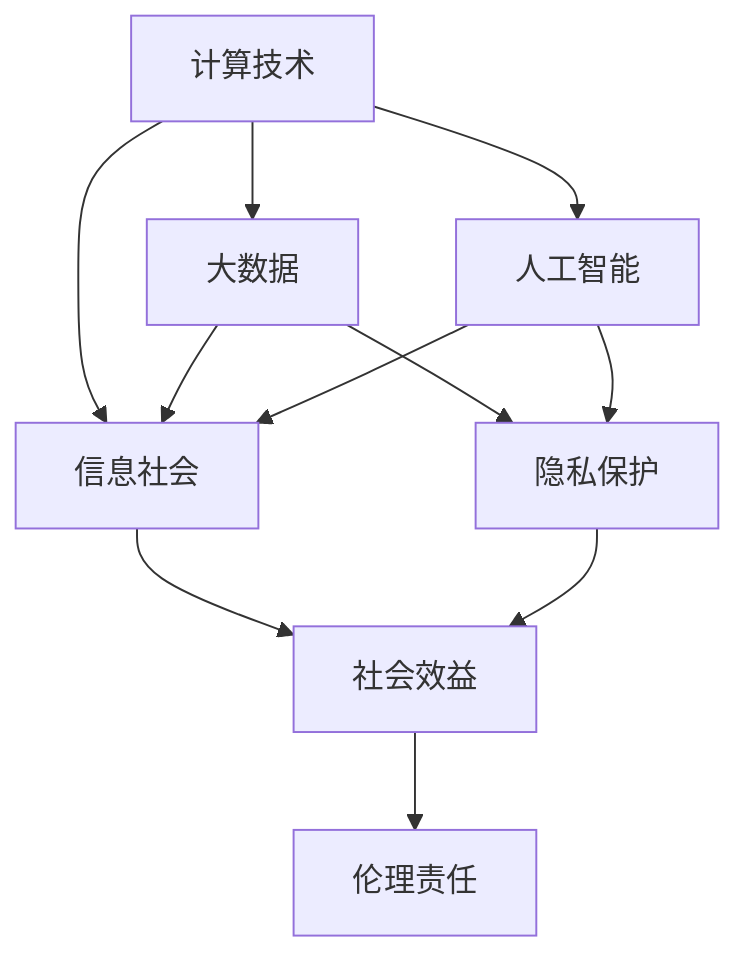

                 

# 科技与社会：人类计算的双重影响

> 关键词：计算技术, 社会变革, 信息社会, 大数据, 人工智能, 隐私保护, 伦理责任

## 1. 背景介绍

### 1.1 问题由来
随着科技的迅猛发展，计算技术在社会各领域的应用越来越广泛，从医疗、教育到金融、政府，无处不在。与此同时，计算技术也带来了诸多新的挑战和伦理问题。如何在享受科技进步的同时，保护社会福祉，构建公平、透明、可控的数字社会，成为当下亟待解决的重要课题。本文旨在探讨计算技术在推动社会进步的同时，对个体和整体社会可能产生的影响，以及如何在技术和伦理之间找到平衡。

### 1.2 问题核心关键点
科技与社会的关系，尤其是计算技术对社会的影响，是本节的核心讨论点。我们将从以下几个方面深入剖析：
- 计算技术如何改变个人生活方式和社会结构？
- 计算技术的普及带来了哪些社会效益和风险？
- 如何制定政策和法规，以确保计算技术的应用符合社会伦理和道德标准？

## 2. 核心概念与联系

### 2.1 核心概念概述

计算技术作为一种重要的生产力工具，对社会的影响是多层次、多维度的。本文将介绍几个核心概念，并探讨它们之间的内在联系。

- **计算技术**：指使用计算机和相关软硬件工具进行信息处理、分析、计算的技术。涵盖了从高性能计算、云计算、大数据分析到人工智能、物联网等众多领域。

- **信息社会**：以信息技术为核心的社会形态，信息成为社会生产力新的重要组成部分，极大地推动了经济社会发展。

- **大数据**：指规模大、类型多、价值密度低的复杂数据集合，通过大数据分析，可以揭示出数据背后的深层模式和规律。

- **人工智能**：利用计算机算法模拟人类智能行为的技术，包括机器学习、深度学习、自然语言处理等。

- **隐私保护**：在计算技术应用中，保护个人数据隐私，防止数据滥用和泄露，是保障社会公平正义的重要方面。

- **伦理责任**：计算技术的开发和应用过程中，必须遵守社会伦理和道德标准，确保技术利用的正当性。

这些概念之间的内在联系可以通过以下Mermaid流程图来展示：



这个流程图展示了计算技术通过大数据和人工智能，对信息社会产生重大影响。同时，隐私保护和伦理责任也是确保技术应用公平、正义的关键因素。

## 3. 核心算法原理 & 具体操作步骤

### 3.1 算法原理概述

计算技术在社会中的应用，往往涉及复杂的算法和模型。本节将介绍几种核心算法原理，并结合具体操作步骤，探讨它们如何影响社会。

- **高性能计算**：指通过并行计算、分布式计算等技术，大幅提升计算速度和处理能力，推动科学研究和工程应用。

- **云计算**：利用网络基础设施提供按需、可扩展的计算资源，支持大数据处理和应用开发。

- **大数据分析**：通过数据挖掘、机器学习等方法，从海量数据中提取有用信息，辅助决策和预测。

- **人工智能**：通过训练复杂的模型，让机器能够执行复杂的任务，如自然语言处理、计算机视觉等。

### 3.2 算法步骤详解

以下以人工智能为例，介绍其核心算法步骤：

1. **数据准备**：收集、清洗、标注数据，准备训练模型。
2. **模型训练**：使用训练数据集对模型进行迭代训练，优化模型参数。
3. **模型评估**：在测试数据集上评估模型性能，如准确率、召回率等指标。
4. **模型部署**：将训练好的模型部署到实际应用场景，进行预测和推理。
5. **模型优化**：根据应用反馈，调整模型参数和架构，持续优化模型性能。

### 3.3 算法优缺点

- **优点**：
  - 自动化和高效性：通过算法可以自动完成复杂任务，提高生产效率。
  - 精度和预测性：通过训练数据，模型可以提供高精度的预测结果。
  - 可扩展性：云计算和大数据技术支持模型的快速扩展和部署。

- **缺点**：
  - 数据依赖：模型依赖于训练数据的质量和数量，数据偏差可能导致错误结果。
  - 黑盒性：模型的决策过程复杂，难以解释，导致信任度低。
  - 资源消耗：高性能计算和大数据处理需要大量的硬件资源和时间成本。

### 3.4 算法应用领域

计算技术在众多领域都有广泛应用，包括：

- **医疗健康**：利用大数据和人工智能进行疾病预测、个性化医疗等。
- **教育培训**：通过在线教育平台和智能辅导系统，提高教学效果和个性化学习。
- **金融服务**：通过量化交易和风险管理，提升金融服务的效率和准确性。
- **政府治理**：利用电子政务和大数据，优化公共服务，提升治理效率。
- **企业运营**：通过云计算和企业大数据平台，支持业务流程优化和决策支持。

## 4. 数学模型和公式 & 详细讲解 & 举例说明

### 4.1 数学模型构建

计算技术在应用中，常常需要构建数学模型来描述问题。以下以机器学习为例，介绍数学模型的构建过程。

- **线性回归模型**：用于预测连续型变量，模型公式为 $y = \theta_0 + \theta_1x_1 + ... + \theta_nx_n$，其中 $y$ 为预测值，$x_i$ 为输入变量，$\theta_i$ 为模型参数。

- **决策树模型**：通过树形结构对数据进行分类，模型公式为 $T_i = \begin{cases} \text{root node} \;\; & \text{if no split} \\ \text{child node based on feature} \;\; & \text{if split} \end{cases}$，其中 $T_i$ 为节点，$\text{root node}$ 为根节点，$\text{child node based on feature}$ 为基于特征的子节点。

### 4.2 公式推导过程

以线性回归为例，推导模型的最小二乘法优化公式。

- **目标函数**：最小化预测误差平方和，公式为 $\sum_{i=1}^n(y_i - \hat{y}_i)^2$。
- **梯度下降法**：通过梯度计算模型参数的更新，公式为 $\theta_j \leftarrow \theta_j - \eta \frac{\partial \mathcal{L}(\theta)}{\partial \theta_j}$，其中 $\eta$ 为学习率，$\mathcal{L}(\theta)$ 为损失函数。
- **求解优化问题**：通过求解 $\mathcal{L}(\theta)$ 的极小值，得到模型参数 $\theta$。

### 4.3 案例分析与讲解

以医疗影像分析为例，介绍如何利用机器学习模型进行疾病诊断。

- **数据准备**：收集大量医疗影像数据，标注影像中的病变区域。
- **模型训练**：使用深度学习模型（如卷积神经网络）对影像数据进行训练，学习病变区域的特征。
- **模型评估**：在测试集上评估模型性能，如精确率、召回率等指标。
- **模型部署**：将训练好的模型应用于新影像的诊断，提供实时预测结果。
- **模型优化**：根据医生反馈，调整模型参数和架构，持续优化诊断效果。

## 5. 项目实践：代码实例和详细解释说明

### 5.1 开发环境搭建

在进行项目实践前，我们需要准备好开发环境。以下是使用Python进行TensorFlow开发的环境配置流程：

1. 安装Anaconda：从官网下载并安装Anaconda，用于创建独立的Python环境。

2. 创建并激活虚拟环境：
```bash
conda create -n tf-env python=3.8 
conda activate tf-env
```

3. 安装TensorFlow：根据CUDA版本，从官网获取对应的安装命令。例如：
```bash
conda install tensorflow -c tf
```

4. 安装各类工具包：
```bash
pip install numpy pandas scikit-learn matplotlib tqdm jupyter notebook ipython
```

完成上述步骤后，即可在`tf-env`环境中开始项目实践。

### 5.2 源代码详细实现

以下是使用TensorFlow实现线性回归模型的代码示例：

```python
import tensorflow as tf
import numpy as np
from sklearn.datasets import load_boston
from sklearn.model_selection import train_test_split
from sklearn.metrics import mean_squared_error

# 加载数据集
boston = load_boston()
X = boston.data
y = boston.target

# 划分数据集
X_train, X_test, y_train, y_test = train_test_split(X, y, test_size=0.2, random_state=42)

# 定义模型
X_placeholder = tf.placeholder(tf.float32, [None, X.shape[1]], name='X')
y_placeholder = tf.placeholder(tf.float32, [None], name='y')
theta = tf.Variable(tf.zeros([X.shape[1]+1]), name='theta')
y_hat = tf.add(tf.matmul(X_placeholder, theta), tf.constant([[1.0]], name='ones'))
loss = tf.reduce_mean(tf.square(y_placeholder - y_hat))
optimizer = tf.train.GradientDescentOptimizer(0.01)
train_op = optimizer.minimize(loss)

# 训练模型
with tf.Session() as sess:
    sess.run(tf.global_variables_initializer())
    for i in range(1000):
        _, loss_val = sess.run([train_op, loss], feed_dict={X_placeholder: X_train, y_placeholder: y_train})
        if i % 100 == 0:
            mse = mean_squared_error(y_test, sess.run(y_hat, feed_dict={X_placeholder: X_test}))
            print(f'Epoch {i+1}, Loss: {loss_val:.4f}, MSE: {mse:.4f}')

# 预测新数据
new_X = np.array([[18.0, 2.0, 0.0, 0.0, 5.0, 6.0, 4.0, 1.0, 90.0, 15.0]], dtype=float)
pred_y = sess.run(y_hat, feed_dict={X_placeholder: new_X})
print(f'Prediction: {pred_y:.2f}')
```

### 5.3 代码解读与分析

这段代码实现了基于TensorFlow的线性回归模型训练和预测。具体分析如下：

- **数据准备**：使用`load_boston`函数加载波士顿房价数据集，将其划分为训练集和测试集。
- **模型定义**：定义线性回归模型，包括输入占位符`X_placeholder`、输出占位符`y_placeholder`和模型参数`theta`，以及预测值`y_hat`和损失函数`loss`。
- **优化器选择**：使用梯度下降优化器进行模型训练。
- **训练过程**：通过`Session`对象运行训练操作，每次迭代计算损失并更新模型参数。
- **模型预测**：使用训练好的模型对新数据进行预测。

## 6. 实际应用场景

### 6.1 智能城市交通管理

计算技术在智能城市交通管理中的应用，可以极大地提升城市交通的效率和安全性。例如，通过大数据分析，可以实时监测交通流量、路况信息，预测交通拥堵，辅助交通管理决策。

具体而言，可以收集各种交通数据，如车流量、道路状况、气象条件等，构建交通预测模型。模型通过预测未来的交通流量和拥堵情况，实时调整交通信号灯和路线，实现智能调度和导航。这不仅降低了交通事故和拥堵风险，还提高了交通资源的使用效率。

### 6.2 精准农业

计算技术在精准农业中的应用，可以实现对农业生产过程的精细化管理，提升农业生产效率和产品质量。例如，通过遥感技术和大数据分析，可以实时监测农田状况，精准施肥、灌溉和病虫害防治。

具体而言，可以收集农田图像、气象数据、土壤湿度等数据，构建农业分析模型。模型通过分析农田状况，实时生成种植建议，调整施肥、灌溉策略，优化农作物生长。这不仅提高了农作物的产量和质量，还减少了资源浪费和环境污染。

### 6.3 金融风险管理

计算技术在金融风险管理中的应用，可以大幅提升金融机构的决策效率和风险控制能力。例如，通过大数据分析和机器学习模型，可以实时监测金融市场动向，预测金融风险，辅助投资决策。

具体而言，可以收集各类金融数据，如股票价格、交易量、市场情绪等，构建风险评估模型。模型通过分析金融数据，预测市场趋势和风险，实时调整投资组合和交易策略。这不仅降低了投资风险，还提高了投资回报率。

### 6.4 未来应用展望

随着计算技术的不断进步，其在社会中的应用将更加广泛和深入。未来，我们可以期待以下几个发展方向：

1. **物联网**：通过连接各类设备和传感器，实时采集海量数据，支持更智能、更高效的城市管理和精准农业。
2. **量子计算**：利用量子计算机的强大计算能力，解决传统计算机无法处理的问题，如优化问题、搜索问题等。
3. **脑机接口**：通过脑机接口技术，实现人与计算机的直接交互，提升人机交互的自然性和智能性。
4. **全息显示**：通过全息技术，实现三维图像和信息的高效展示，提升人机交互的沉浸感和真实感。

## 7. 工具和资源推荐

### 7.1 学习资源推荐

为了帮助开发者系统掌握计算技术的应用，这里推荐一些优质的学习资源：

1. Coursera《机器学习》课程：由斯坦福大学Andrew Ng教授主讲，深入浅出地介绍了机器学习的基本概念和核心算法。

2. TensorFlow官方文档：TensorFlow官方文档，提供了完整的API文档和代码示例，适合初学者和进阶开发者。

3. Kaggle：全球最大的数据科学竞赛平台，提供大量实际问题数据集和比赛，帮助开发者实践和提高。

4. GitHub：开发者社区，汇集了大量开源项目和代码，可以借鉴和学习。

5. ACM Transactions on Modeling and Computer Simulation：ACM的计算模拟期刊，涵盖计算技术在各个领域的最新研究成果和应用进展。

通过对这些资源的学习实践，相信你一定能够掌握计算技术的基本原理和应用方法，并用于解决实际问题。

### 7.2 开发工具推荐

高效的开发离不开优秀的工具支持。以下是几款用于计算技术应用开发的常用工具：

1. Jupyter Notebook：免费的交互式编程环境，支持多种编程语言和库，适合数据科学和机器学习开发。

2. Anaconda：Python和R环境的集成管理工具，提供虚拟环境和依赖管理功能，方便科学计算和数据处理。

3. PyTorch：开源深度学习框架，灵活的动态计算图和丰富的模型库，支持高效计算和模型部署。

4. TensorBoard：TensorFlow配套的可视化工具，支持实时监测模型训练状态，提供丰富的图表和报表。

5. Weights & Biases：模型训练的实验跟踪工具，记录和可视化模型训练过程中的各项指标，方便对比和调优。

6. Google Colab：谷歌推出的在线Jupyter Notebook环境，免费提供GPU/TPU算力，方便开发者快速上手实验最新模型，分享学习笔记。

合理利用这些工具，可以显著提升计算技术应用开发的效率和效果，加速技术创新的步伐。

### 7.3 相关论文推荐

计算技术的发展离不开学界的持续研究。以下是几篇奠基性的相关论文，推荐阅读：

1. "Deep Learning" by Ian Goodfellow：深度学习领域的经典著作，详细介绍了深度学习的核心概念和算法。

2. "Big Data: Principles and Best Practices of Scalable Realtime Data Systems" by Nathan Marz & James Warren：大数据技术的权威指南，涵盖大数据处理和分析的最佳实践。

3. "Human-Computer Interaction" by Dan B_prime：人机交互领域的经典教材，介绍了人机交互的基本原理和技术。

4. "Artificial Intelligence: A Modern Approach" by Stuart Russell & Peter Norvig：人工智能领域的权威教材，详细介绍了AI的核心技术和应用。

这些论文代表了大计算技术的发展脉络。通过学习这些前沿成果，可以帮助研究者把握学科前进方向，激发更多的创新灵感。

## 8. 总结：未来发展趋势与挑战

### 8.1 总结

本文对计算技术在社会中的应用进行了全面系统的介绍。首先探讨了计算技术对个人和社会的影响，明确了技术进步对社会进步的双重作用。其次，从原理到实践，详细讲解了计算技术的核心算法和操作步骤，提供了完整的代码实例。同时，本文还探讨了计算技术在各个领域的实际应用，展示了技术的巨大潜力。最后，推荐了相关的学习资源和开发工具，帮助读者系统掌握计算技术的应用。

通过本文的系统梳理，可以看到，计算技术在推动社会进步的同时，也带来了新的挑战和伦理问题。如何在技术和伦理之间找到平衡，构建公平、透明、可控的数字社会，是我们面临的重要课题。

### 8.2 未来发展趋势

计算技术在未来将呈现以下几个发展趋势：

1. **自动化和智能化**：随着AI技术的进步，计算技术将更加自动化和智能化，支持更多复杂的任务和应用。
2. **数据驱动决策**：大数据和机器学习将广泛应用于各个领域，支持更科学、更精确的决策制定。
3. **跨领域融合**：计算技术与物联网、量子计算等技术融合，将推动更多创新应用的出现。
4. **社会责任**：计算技术的应用将更多地关注社会责任和伦理问题，确保技术利用的正当性。
5. **人机协同**：通过脑机接口和全息技术，实现人与计算技术的深度融合，提升人机交互的自然性和智能性。

这些趋势凸显了计算技术在社会中的重要地位，也指明了未来的发展方向。

### 8.3 面临的挑战

尽管计算技术在社会中的应用取得了显著进展，但仍面临诸多挑战：

1. **数据隐私和安全**：数据采集和处理过程中，如何保护个人隐私和数据安全，防止数据滥用和泄露，是亟待解决的问题。
2. **算法公平性**：机器学习模型可能存在算法偏见，导致对某些群体的歧视和不公平，如何确保算法的公平性，是重要课题。
3. **资源消耗**：高性能计算和大数据处理需要大量硬件资源，如何降低资源消耗，提高计算效率，是计算技术应用面临的重要挑战。
4. **伦理和法律**：计算技术的快速普及和应用，带来了新的伦理和法律问题，如何制定相关政策和法规，规范技术应用，是重要任务。
5. **人机交互**：计算技术与人类交互过程中，如何提高自然性、智能性，减少人机交互的障碍，是亟待解决的问题。

这些挑战需要我们在技术、伦理、法律等多个层面协同努力，才能确保计算技术的应用符合社会正义和公平。

### 8.4 研究展望

未来，计算技术的研究需要在以下几个方面寻求新的突破：

1. **算法优化**：开发更高效、更精确的算法，提升计算效率和精度。
2. **跨领域融合**：探索更多跨领域融合的应用，推动计算技术与更多学科的结合。
3. **伦理和安全**：研究计算技术的伦理和社会责任问题，制定相关政策和法规。
4. **人机交互**：研究人机交互技术，提高人机交互的自然性和智能性。
5. **社会应用**：开发更多面向社会的应用，提升计算技术对社会的贡献。

这些研究方向将引领计算技术的发展，推动社会进步和人类福祉的提升。

## 9. 附录：常见问题与解答

**Q1：计算技术在社会中的应用是否会导致隐私泄露？**

A: 计算技术在应用中确实存在隐私泄露的风险。数据采集和处理过程中，如何保护个人隐私和数据安全，防止数据滥用和泄露，是亟待解决的问题。例如，通过数据匿名化、加密等技术，可以有效降低隐私泄露的风险。同时，制定相关政策和法规，规范数据使用和处理，也是保护隐私的重要手段。

**Q2：计算技术的应用是否存在算法偏见？**

A: 计算技术的应用确实存在算法偏见的问题。机器学习模型可能基于训练数据的特征，对某些群体产生歧视和不公平。如何确保算法的公平性，是一个重要课题。例如，通过多样化训练数据、调整算法设计、引入公平性评估指标等方法，可以减小算法偏见的影响。

**Q3：如何降低计算技术的资源消耗？**

A: 降低计算技术的资源消耗需要从多个方面入手：
1. 算法优化：开发更高效、更精确的算法，提升计算效率和精度。
2. 硬件优化：使用更高效、更节能的硬件设备，降低计算成本。
3. 数据压缩：对数据进行压缩和存储优化，减少存储和传输的开销。
4. 分布式计算：通过分布式计算技术，实现计算任务的并行处理，提高计算效率。

**Q4：如何确保计算技术的伦理和社会责任？**

A: 确保计算技术的伦理和社会责任，需要从多个方面入手：
1. 制定相关政策和法规，规范计算技术的应用。
2. 引入伦理和社会责任的评估指标，评估计算技术对社会的贡献和影响。
3. 加强技术应用的监督和管理，确保技术应用符合伦理标准。
4. 增强公众对计算技术的认知和理解，提高公众对技术应用的信任度。

这些措施可以共同构建公平、透明、可控的数字社会，确保计算技术的应用符合社会正义和公平。

**Q5：如何提高人机交互的自然性和智能性？**

A: 提高人机交互的自然性和智能性需要从多个方面入手：
1. 研究人机交互技术，开发更自然、更智能的交互界面。
2. 增强计算技术的理解和生成能力，提升人机交互的自然性。
3. 研究脑机接口技术，实现人与计算机的深度融合，提升人机交互的智能性。
4. 开发多模态交互系统，支持视觉、听觉、触觉等多感官交互，提高人机交互的沉浸感和真实感。

这些措施可以共同提升人机交互的自然性和智能性，推动计算技术的发展和应用。

---

作者：禅与计算机程序设计艺术 / Zen and the Art of Computer Programming

