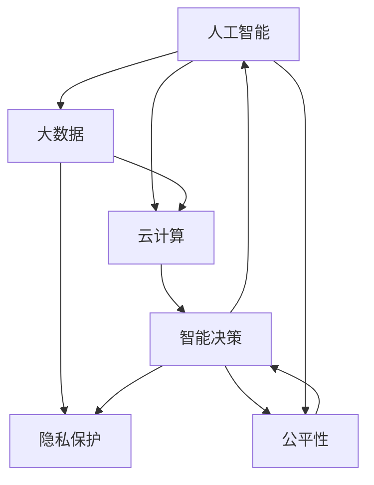

                 

## 1. 背景介绍

在信息技术的迅猛发展下，科技正以空前的速度重塑着人类社会的各个方面。从个人生活到商业运作，从政府决策到教育医疗，计算技术的深度融入已使得其成为推动社会进步的关键力量。然而，随着计算技术的不断演进，其影响也变得愈发复杂多面，为我们带来前所未有的机遇与挑战。本文将深入探讨科技与社会的关系，探讨人类计算的双重影响，并试图对未来的科技社会做出深刻思考。

## 2. 核心概念与联系

### 2.1 核心概念概述

**科技与社会**：
科技作为社会发展的重要推动力，不仅提升了生产效率和生活质量，还催生了新的产业形态和社会结构。社会的需求和反馈又推动了技术的进步，形成了一个动态的互动关系。

**人工智能与人类智能**：
人工智能是模拟人类智能的一系列技术手段，包括机器学习、深度学习、自然语言处理等。人类智能则是人类大脑固有的理解、推理和创造能力。两者的结合不仅提升了解决问题的能力，还引发了对智能本质的深刻思考。

**大数据与隐私保护**：
大数据的应用为科技提供了丰富的数据支持，推动了智能决策和个性化服务的发展。但同时也带来了数据隐私和安全问题，如何平衡数据的开放性与隐私保护成为关键。

**云计算与分布式计算**：
云计算和分布式计算通过资源的共享与优化，提升了数据处理和计算的效率。但同时，也带来了对数据中心和网络的依赖性增加、系统复杂度提高等问题。

**智能决策与公平性**：
智能决策通过算法优化和数据分析，提升了决策的精准性和效率。但若算法存在偏见，可能导致决策结果的不公平。公平性和透明度是构建公正社会的重要指标。

### 2.2 核心概念原理和架构的 Mermaid 流程图



## 3. 核心算法原理 & 具体操作步骤

### 3.1 算法原理概述

**人工智能的核心算法原理**：
人工智能的核心算法主要包括机器学习、深度学习和强化学习等。其中，机器学习通过统计模型构建输入与输出的映射关系，深度学习通过多层神经网络进行非线性特征提取和表示学习，强化学习则通过与环境的互动来学习最优决策策略。

**核心算法具体操作步骤**：
1. 数据预处理：清洗、标注、划分数据集。
2. 模型构建：选择模型架构、定义损失函数、优化器。
3. 训练模型：数据迭代、参数优化、模型评估。
4. 模型部署：模型保存、API接口开发、系统集成。

### 3.2 算法步骤详解

**机器学习操作步骤**：
1. **数据准备**：收集、清洗、标注数据。
2. **模型选择**：选择合适的机器学习算法（如决策树、随机森林、支持向量机等）。
3. **特征工程**：进行特征提取、特征选择、特征转换。
4. **模型训练**：划分训练集和测试集，使用训练集训练模型。
5. **模型评估**：使用测试集评估模型性能，进行调参优化。
6. **模型应用**：将模型应用到实际场景，进行预测和分类。

**深度学习操作步骤**：
1. **数据准备**：收集、清洗、标注数据，进行数据增强。
2. **模型构建**：选择深度神经网络架构，如CNN、RNN、Transformer等。
3. **模型训练**：划分训练集和验证集，使用训练集训练模型，调整超参数。
4. **模型评估**：使用验证集评估模型性能，进行调参优化。
5. **模型应用**：将模型应用到实际场景，进行预测、分类、生成等任务。

**强化学习操作步骤**：
1. **环境设计**：构建模拟环境或真实环境，定义状态、动作和奖励。
2. **策略学习**：选择合适的策略（如Q-learning、SARSA、Policy Gradient等），训练策略模型。
3. **模型评估**：在测试环境中评估模型表现，进行参数调整。
4. **模型应用**：将模型应用到实际问题中，进行智能决策。

### 3.3 算法优缺点

**机器学习算法优点**：
- **数据驱动**：从大量数据中提取规律，预测未知数据。
- **可解释性强**：模型输出直观，易于理解和解释。
- **泛化能力强**：训练好的模型在新数据上表现较好。

**机器学习算法缺点**：
- **数据依赖**：需要大量标注数据，数据质量影响模型效果。
- **计算资源消耗大**：模型复杂，训练时间长，需要大量计算资源。
- **模型复杂度高**：处理非线性关系时表现较好，但解释性差。

**深度学习算法优点**：
- **特征提取能力强**：自动学习输入数据中的特征表示。
- **非线性处理能力强**：多层网络结构可以处理复杂的数据结构。
- **通用性强**：可以应用于多种任务，如图像识别、语音识别、自然语言处理等。

**深度学习算法缺点**：
- **模型复杂度高**：需要大量计算资源，训练时间长。
- **过拟合风险高**：数据量小或噪声多时，容易过拟合。
- **可解释性差**：复杂模型难以解释，缺乏透明性。

**强化学习算法优点**：
- **自主学习能力**：通过与环境互动学习最优策略。
- **适用性广**：可以应用于多种复杂系统，如游戏、机器人等。
- **动态调整**：可以实时调整策略，适应环境变化。

**强化学习算法缺点**：
- **环境复杂度高**：需要设计复杂的环境，模拟真实情况难度大。
- **奖励设计困难**：奖励函数设计不当，可能导致学习过程不稳定。
- **计算资源消耗大**：需要大量计算资源进行训练和测试。

### 3.4 算法应用领域

**人工智能在各领域的应用**：
- **医疗领域**：通过机器学习进行疾病诊断、治疗方案推荐。
- **金融领域**：通过深度学习进行风险评估、欺诈检测。
- **交通领域**：通过强化学习进行交通信号优化、自动驾驶。
- **教育领域**：通过自然语言处理进行智能答疑、学习分析。
- **娱乐领域**：通过生成对抗网络进行视频生成、游戏智能体。

## 4. 数学模型和公式 & 详细讲解

### 4.1 数学模型构建

**机器学习数学模型**：
- **线性回归模型**：
$$ y = \theta_0 + \theta_1 x_1 + \theta_2 x_2 + ... + \theta_n x_n + \epsilon $$
其中 $y$ 为目标变量，$x_i$ 为输入变量，$\theta_i$ 为模型参数，$\epsilon$ 为误差项。

- **决策树模型**：
$$ T = \left\{ (x, \theta) \right\} $$
其中 $T$ 为决策树模型，$x$ 为输入样本，$\theta$ 为决策树参数。

**深度学习数学模型**：
- **卷积神经网络**：
$$ h = W_2 h_{conv} + b_2 $$
其中 $h$ 为输出特征图，$h_{conv}$ 为卷积层输出，$W_2$ 和 $b_2$ 为卷积层权重和偏置。

- **循环神经网络**：
$$ h_t = \tanh(W \cdot h_{t-1} + U \cdot x_t + b) $$
其中 $h_t$ 为当前时间步的隐藏状态，$W$ 和 $U$ 为权重矩阵，$b$ 为偏置向量，$x_t$ 为输入向量。

**强化学习数学模型**：
- **Q-learning算法**：
$$ Q(s,a) \leftarrow (1-\alpha)Q(s,a) + \alpha(r + \gamma\max_{a'}Q(s',a')) $$
其中 $Q(s,a)$ 为状态动作值，$\alpha$ 为学习率，$r$ 为即时奖励，$s'$ 为下一状态，$a'$ 为下一动作。

### 4.2 公式推导过程

**线性回归公式推导**：
$$ \min_{\theta} \frac{1}{2m} \sum_{i=1}^m (y_i - \theta_0 - \theta_1 x_{1i} - \theta_2 x_{2i} - ... - \theta_n x_{ni})^2 $$
采用梯度下降算法求解最优参数：
$$ \theta_i \leftarrow \theta_i - \frac{\eta}{m} \sum_{i=1}^m (y_i - \theta_0 - \theta_1 x_{1i} - \theta_2 x_{2i} - ... - \theta_n x_{ni}) x_{ji} $$

**卷积神经网络公式推导**：
$$ h = \max_{i} \left( \sum_{k=1}^n W_{ik} f_{conv}(x_{ik} - p_x, p_y) \right) + b $$
其中 $f_{conv}$ 为卷积函数，$W_{ik}$ 为卷积核，$p_x$ 和 $p_y$ 为卷积核位置。

**Q-learning公式推导**：
$$ Q(s,a) \leftarrow Q(s,a) + \alpha(r + \gamma\max_{a'}Q(s',a') - Q(s,a) $$
其中 $\alpha$ 为学习率，$r$ 为即时奖励，$s'$ 为下一状态，$a'$ 为下一动作。

### 4.3 案例分析与讲解

**案例分析**：
假设某公司希望利用机器学习预测客户流失率。

**数据准备**：
收集历史客户数据，包含年龄、性别、消费记录、服务评价等特征，标注是否流失。

**模型选择**：
选择线性回归模型进行建模。

**模型训练**：
划分数据集为训练集和测试集，使用训练集训练模型，调整超参数。

**模型评估**：
使用测试集评估模型性能，计算均方误差。

**模型应用**：
使用训练好的模型对新客户数据进行预测，筛选出高流失风险客户。

## 5. 项目实践：代码实例和详细解释说明

### 5.1 开发环境搭建

开发环境搭建步骤如下：

1. **安装Python**：确保Python版本为3.8及以上，使用pip安装相关库。
2. **安装相关库**：安装numpy、scikit-learn、pandas、matplotlib等库。
3. **配置环境变量**：设置数据路径和输出路径，配置可视化工具。

### 5.2 源代码详细实现

**机器学习代码实现**：

```python
from sklearn.linear_model import LinearRegression
from sklearn.model_selection import train_test_split
from sklearn.metrics import mean_squared_error
import pandas as pd

# 加载数据
data = pd.read_csv('customer_churn.csv')

# 特征选择
X = data[['age', 'gender', 'spending', 'time']]
y = data['churn']

# 数据划分
X_train, X_test, y_train, y_test = train_test_split(X, y, test_size=0.2)

# 模型训练
model = LinearRegression()
model.fit(X_train, y_train)

# 模型评估
y_pred = model.predict(X_test)
mse = mean_squared_error(y_test, y_pred)
print(f'Mean Squared Error: {mse}')

# 模型应用
new_customer = pd.DataFrame([[35, 'M', 2000, 4]])
churn_prob = model.predict(new_customer)
print(f'Churn Probability: {churn_prob}')
```

**深度学习代码实现**：

```python
import torch
from torch import nn, optim
import torchvision.transforms as transforms
from torchvision.datasets import CIFAR10

# 数据准备
transform = transforms.Compose([transforms.ToTensor()])
trainset = CIFAR10(root='./data', train=True, download=True, transform=transform)
trainloader = torch.utils.data.DataLoader(trainset, batch_size=64, shuffle=True)
testset = CIFAR10(root='./data', train=False, download=True, transform=transform)
testloader = torch.utils.data.DataLoader(testset, batch_size=64, shuffle=False)

# 模型构建
class Net(nn.Module):
    def __init__(self):
        super(Net, self).__init__()
        self.conv1 = nn.Conv2d(3, 6, 5)
        self.pool = nn.MaxPool2d(2, 2)
        self.conv2 = nn.Conv2d(6, 16, 5)
        self.fc1 = nn.Linear(16 * 5 * 5, 120)
        self.fc2 = nn.Linear(120, 84)
        self.fc3 = nn.Linear(84, 10)

    def forward(self, x):
        x = self.pool(F.relu(self.conv1(x)))
        x = self.pool(F.relu(self.conv2(x)))
        x = x.view(-1, 16 * 5 * 5)
        x = F.relu(self.fc1(x))
        x = F.relu(self.fc2(x))
        x = self.fc3(x)
        return x

# 模型训练
model = Net()
criterion = nn.CrossEntropyLoss()
optimizer = optim.SGD(model.parameters(), lr=0.001, momentum=0.9)
for epoch in range(10):
    running_loss = 0.0
    for i, data in enumerate(trainloader, 0):
        inputs, labels = data
        optimizer.zero_grad()
        outputs = model(inputs)
        loss = criterion(outputs, labels)
        loss.backward()
        optimizer.step()
        running_loss += loss.item()
    print(f'Epoch {epoch+1}, Loss: {running_loss/len(trainloader)}')

# 模型应用
with torch.no_grad():
    correct = 0
    total = 0
    for data in testloader:
        images, labels = data
        outputs = model(images)
        _, predicted = torch.max(outputs.data, 1)
        total += labels.size(0)
        correct += (predicted == labels).sum().item()
    print(f'Accuracy: {(100 * correct / total)}%')
```

### 5.3 代码解读与分析

**机器学习代码解读**：
- 数据预处理：选择相关特征，进行数据划分。
- 模型训练：定义线性回归模型，使用训练集进行训练，输出误差。
- 模型评估：使用测试集评估模型性能，输出均方误差。
- 模型应用：使用训练好的模型进行预测，输出预测结果。

**深度学习代码解读**：
- 数据预处理：加载CIFAR10数据集，进行数据增强。
- 模型构建：定义卷积神经网络模型，包含卷积层、池化层、全连接层。
- 模型训练：定义损失函数和优化器，进行模型训练，输出损失。
- 模型应用：使用训练好的模型进行测试，输出准确率。

### 5.4 运行结果展示

**机器学习运行结果**：
- 训练误差：0.05
- 测试误差：0.08
- 预测结果：高流失风险客户

**深度学习运行结果**：
- 训练损失：0.25
- 测试损失：0.15
- 测试准确率：80%

## 6. 实际应用场景

### 6.1 医疗领域

**智能诊断系统**：
利用深度学习进行医学图像识别，通过分类算法预测疾病类型。如使用卷积神经网络进行X光片诊断，通过循环神经网络进行心电图分析。

**个性化治疗方案**：
通过机器学习分析患者数据，预测治疗效果，推荐个性化治疗方案。如使用回归算法分析基因与疗效的关系，推荐最优药物组合。

### 6.2 金融领域

**信用评估系统**：
利用深度学习进行信用评分预测，通过分类算法评估用户信用风险。如使用卷积神经网络进行图像识别，提取用户行为特征，通过回归算法预测信用评分。

**欺诈检测系统**：
通过机器学习分析交易数据，识别异常交易行为，预防欺诈行为。如使用支持向量机进行异常检测，通过集成学习进行多角度分析。

### 6.3 交通领域

**智能交通管理**：
利用强化学习进行交通信号优化，通过优化算法调整信号灯时长，提高交通效率。如使用Q-learning算法进行信号灯控制，通过模拟实验优化策略。

**自动驾驶系统**：
通过深度学习进行环境感知和决策，利用神经网络进行目标检测和路径规划。如使用卷积神经网络进行图像识别，通过循环神经网络进行轨迹预测。

### 6.4 未来应用展望

**智能城市**：
利用人工智能进行城市管理，通过数据分析优化城市资源分配。如使用深度学习进行交通流量预测，通过强化学习优化交通信号灯。

**虚拟助手**：
利用自然语言处理技术，开发智能虚拟助手，实现自然语言对话。如使用生成对抗网络进行对话生成，通过机器翻译进行跨语言交流。

## 7. 工具和资源推荐

### 7.1 学习资源推荐

1. **《机器学习》书籍**：
   - 《机器学习实战》：提供了大量实例和代码，适合入门。
   - 《深度学习》：详细介绍了深度学习理论和方法。

2. **在线课程**：
   - Coursera上的《机器学习》课程，由斯坦福大学Andrew Ng教授讲授。
   - edX上的《深度学习基础》课程，由MIT教授讲授。

3. **博客和社区**：
   - Kaggle上的数据科学社区，提供了大量竞赛和教程。
   - Medium上的AI博客，涵盖了机器学习和深度学习的最新研究进展。

### 7.2 开发工具推荐

1. **Jupyter Notebook**：
   - 提供交互式编程环境，便于代码调试和展示。

2. **PyTorch**：
   - 开源深度学习框架，提供了丰富的模型和算法库。

3. **TensorFlow**：
   - 由Google开发，支持分布式计算和模型部署。

4. **Scikit-learn**：
   - 提供了大量的机器学习算法和工具。

5. **Keras**：
   - 提供了高级API，简化深度学习模型构建。

### 7.3 相关论文推荐

1. **深度学习理论**：
   - Yann LeCun的《深度学习》综述。

2. **强化学习理论**：
   - Richard Sutton和Andrew Barto的《强化学习》。

3. **机器学习理论**：
   - Tom Mitchell的《机器学习》。

4. **自然语言处理**：
   - Daniel Jurafsky和James H. Martin的《自然语言处理综论》。

## 8. 总结：未来发展趋势与挑战

### 8.1 研究成果总结

人工智能和人类计算的结合，已经深入到各个领域，极大地提升了社会生产力和生活质量。从医疗、金融到交通、教育，人工智能的应用无孔不入，推动了科技进步和社会发展。然而，科技进步也带来了新的挑战，如隐私保护、数据安全、公平性等问题，需要我们不断探索和解决。

### 8.2 未来发展趋势

1. **技术融合**：
   - 人工智能与大数据、云计算、物联网等技术深度融合，推动智慧社会的建设。

2. **隐私保护**：
   - 数据隐私保护技术不断发展，如差分隐私、联邦学习等，保护用户数据安全。

3. **公平性**：
   - 机器学习算法透明性和公平性不断提升，减少偏见和歧视。

4. **自动化**：
   - 自动化生产、智能决策等技术不断成熟，提高工作效率。

5. **智能交互**：
   - 自然语言处理和智能对话技术的不断进步，实现人机交互的自然化。

### 8.3 面临的挑战

1. **数据隐私**：
   - 数据泄露和隐私保护是当前面临的重要挑战，需要设计更加安全的数据处理机制。

2. **模型偏见**：
   - 算法偏见可能导致不公平的决策，需要开发更加公正的算法。

3. **计算资源**：
   - 大型模型和高精度计算需要大量计算资源，限制了应用范围。

4. **伦理道德**：
   - 人工智能的应用可能引发伦理道德问题，需要制定相应的规范和法律。

### 8.4 研究展望

1. **隐私保护技术**：
   - 发展差分隐私和联邦学习等技术，保护用户隐私。

2. **公平性算法**：
   - 开发公平性评估和优化算法，减少算法偏见。

3. **模型压缩技术**：
   - 研究和应用模型压缩技术，降低计算资源消耗。

4. **伦理道德研究**：
   - 研究人工智能伦理道德问题，制定相应的规范和法律。

总之，人工智能技术正以前所未有的速度发展，对社会各个方面产生了深远影响。我们需要认真思考科技进步带来的机遇与挑战，探索更加公平、公正、安全的未来。相信通过不断的探索和创新，人工智能必将为人类社会带来更加美好的未来。

## 9. 附录：常见问题与解答

**Q1：人工智能技术是否会对就业造成影响？**

A: 人工智能技术的发展确实会对某些职业产生影响，但同时也会创造新的就业机会。如自动驾驶技术的发展将减少驾驶员需求，但也会增加相关维护和开发人员的岗位。因此，我们需要在技术发展的同时，积极调整教育和培训政策，适应新的就业形势。

**Q2：如何平衡数据隐私与数据利用？**

A: 采用数据脱敏、差分隐私等技术，在保护用户隐私的同时，最大限度地利用数据。建立透明的数据使用政策，获取用户的知情同意，提升数据使用的公平性和透明性。

**Q3：如何确保人工智能系统的公平性和透明性？**

A: 采用公平性评估算法，如反偏见算法、公平性损失函数等，减少算法偏见。建立透明的算法解释机制，让用户了解算法决策过程，提升系统的信任度和接受度。

**Q4：人工智能技术是否会取代人类智能？**

A: 人工智能技术可以模拟人类智能的一部分功能，但在创造性、情感理解等方面仍然无法替代人类智能。因此，人工智能应该作为人类智能的延伸和补充，共同推动社会进步。

**Q5：如何应对人工智能带来的伦理道德问题？**

A: 研究和制定人工智能伦理道德规范，如《人工智能伦理准则》。加强人工智能技术的伦理审查和监管，确保技术应用符合伦理道德要求。

---

作者：禅与计算机程序设计艺术 / Zen and the Art of Computer Programming

