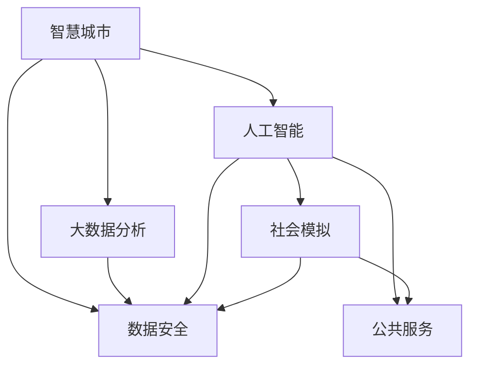

                 

# 科技创新：社会治理的新思路

> 关键词：科技创新，社会治理，智能化，智慧城市，数据驱动，人工智能，社会问题，公共安全，政策模拟，模型构建，治理平台，未来展望

## 1. 背景介绍

### 1.1 问题由来

在现代社会中，传统的人文管理、行政管控手段已无法适应复杂多变的社会环境。随着科技的迅猛发展，特别是信息技术、互联网技术、大数据技术、人工智能技术的深入应用，社会治理模式正在发生深刻变革。新的科技手段为社会治理带来了新的思路和可能性，如何有效运用这些技术，成为当前社会管理的重要课题。

### 1.2 问题核心关键点

现代科技创新如何帮助政府和社会更好地解决治理问题，提高治理效率，增进社会福祉，构建和谐社会。科技创新在社会治理中的应用，需要关注以下几个关键点：

1. **数据驱动**：利用大数据技术，实现对社会运行规律的精确分析和预测。
2. **智能决策**：借助人工智能算法，提升决策的科学性和智能化水平。
3. **社会互动**：通过互联网技术，增加公民参与度，实现双向互动。
4. **公共安全**：运用物联网、监控系统等技术，提高公共安全保障水平。
5. **服务创新**：推动智慧城市建设，提供个性化、高效化的公共服务。
6. **政策模拟**：利用仿真模型，模拟政策效果，优化政策设计。

### 1.3 问题研究意义

科技创新对社会治理的影响深远，主要体现在：

1. **提升治理效率**：通过数据分析和智能算法，快速响应社会事件，提高治理效率。
2. **优化资源配置**：利用大数据技术，精准配置公共资源，提高公共服务的效能。
3. **促进公平正义**：借助科技手段，破解社会不平等问题，实现更加公正的社会治理。
4. **增强安全保障**：通过智慧化监控、预测预警，提高公共安全水平。
5. **推动社会创新**：激发社会创新活力，促进社会治理的现代化转型。
6. **提升公共服务**：通过智能化手段，提供更加个性化、精准的公共服务，提高公民满意度。

科技创新成为社会治理的新路径，为构建智慧城市、智慧政府、智慧社会提供了坚实的技术支撑。

## 2. 核心概念与联系

### 2.1 核心概念概述

社会治理的科技创新，涉及多个关键概念，包括但不限于：

- **智慧城市**：通过互联网、物联网、大数据、云计算等技术，实现城市运行的智能化和高效化。
- **大数据分析**：运用数据挖掘、统计分析等技术，对海量社会数据进行解析和应用。
- **人工智能**：应用机器学习、深度学习、自然语言处理等算法，提高社会治理的智能化水平。
- **社会模拟**：利用仿真模型，模拟社会运行和政策效果，进行预测和评估。
- **公共服务**：通过智能平台，提供个性化、定制化的公共服务，提升公民满意度。
- **数据安全**：在应用数据驱动技术时，确保数据的安全和隐私。

这些概念彼此关联，共同构成了社会治理的科技创新框架。

### 2.2 核心概念原理和架构的 Mermaid 流程图



这个流程图展示了智慧城市、大数据分析、人工智能、社会模拟、公共服务和数据安全之间的关系。其中，智慧城市和人工智能是科技创新应用的核心，大数据分析是技术基础，社会模拟和公共服务是具体应用，数据安全是保障机制。

## 3. 核心算法原理 & 具体操作步骤

### 3.1 算法原理概述

社会治理的科技创新，核心在于构建基于数据驱动、智能决策的社会治理平台。其原理主要包括：

1. **数据采集与处理**：利用传感器、监控系统、移动互联网等技术，采集社会运行数据。
2. **数据分析与挖掘**：通过大数据分析技术，挖掘数据中的规律和趋势。
3. **智能决策支持**：利用人工智能算法，建立预测模型，辅助决策。
4. **仿真模拟与优化**：运用社会模拟技术，评估政策效果，优化决策方案。
5. **公共服务优化**：通过智能化手段，提供个性化、定制化的公共服务。

### 3.2 算法步骤详解

以下是社会治理科技创新的具体操作步骤：

1. **数据采集**：建立数据采集网络，收集交通、环境、公共服务等方面的实时数据。

2. **数据清洗与处理**：对采集的数据进行清洗、去重、标注等处理，确保数据质量。

3. **数据分析与建模**：利用统计分析、机器学习等技术，建立数据模型，分析社会运行规律。

4. **智能决策支持**：通过自然语言处理、机器学习等算法，辅助政府进行决策，提供预测和预警。

5. **公共服务优化**：开发智能化公共服务平台，提供个性化、精准的公共服务。

6. **仿真模拟与评估**：建立社会运行仿真模型，模拟政策效果，评估决策的可行性。

### 3.3 算法优缺点

社会治理科技创新的优点包括：

1. **高效性**：通过智能化手段，提高决策和服务的效率。
2. **精确性**：利用数据分析，提高决策的准确性和科学性。
3. **覆盖广**：能覆盖社会运行的多方面，实现全方位治理。
4. **互动性强**：通过互联网技术，增强公民参与度。

缺点包括：

1. **数据隐私问题**：数据采集和处理可能侵犯个人隐私。
2. **技术门槛高**：需要较高的技术水平和数据处理能力。
3. **数据质量问题**：数据采集不全面、不及时会影响分析结果。
4. **算法偏见**：人工智能算法可能存在偏见，影响公平性。
5. **资源投入大**：技术应用需要大量的资金和人力资源。

### 3.4 算法应用领域

社会治理科技创新，涉及以下主要应用领域：

- **智慧城市**：交通管理、环境监控、公共安全等领域。
- **公共服务**：医疗、教育、就业、养老等领域。
- **社会治理**：城市规划、社区管理、公共卫生等领域。
- **政策模拟**：公共政策设计、政策效果评估、治理效果预测等领域。
- **社会互动**：在线政务服务、社区互动平台、公共参与平台等领域。

## 4. 数学模型和公式 & 详细讲解 & 举例说明

### 4.1 数学模型构建

社会治理科技创新，可以构建如下数学模型：

1. **数据模型**：利用统计分析技术，建立社会运行数据模型，如时间序列模型、空间分布模型等。
2. **预测模型**：通过机器学习算法，建立预测模型，如回归模型、分类模型、神经网络模型等。
3. **优化模型**：运用线性规划、非线性规划等数学方法，优化资源配置和政策设计。

### 4.2 公式推导过程

以交通流量预测为例，假设城市交通流量可以表示为一个时间序列 $y_t$，其中 $t$ 表示时间点，$y_t$ 表示交通流量。利用线性回归模型进行预测，公式为：

$$ y_t = \alpha + \beta t + \gamma y_{t-1} + \delta y_{t-2} + \epsilon_t $$

其中，$\alpha$ 为常数项，$\beta$ 为时间项系数，$\gamma$ 和 $\delta$ 为滞后项系数，$\epsilon_t$ 为随机误差项。

### 4.3 案例分析与讲解

假设城市交通流量数据如下表所示：

| 时间点 | 交通流量 | 时间项 |
|-------|-------|------|
| 1     | 2000  | 1    |
| 2     | 2200  | 2    |
| 3     | 2500  | 3    |
| ...   | ...   | ...  |
| 50    | 3500  | 50   |

利用上述公式进行预测，可以求出每个时间点的预测值。通过对比实际值和预测值，评估模型的准确性，并进行参数优化。

## 5. 项目实践：代码实例和详细解释说明

### 5.1 开发环境搭建

1. **安装Python**：在目标计算机上安装Python，建议版本为3.6以上。
2. **安装Pandas、NumPy、Matplotlib等工具**：用于数据处理和可视化。
3. **安装Scikit-learn、TensorFlow等工具**：用于机器学习模型训练和优化。
4. **安装Flask等Web框架**：用于开发Web服务。

### 5.2 源代码详细实现

以下是一个简单的社会治理科技创新项目代码实现，以交通流量预测为例：

```python
import pandas as pd
from sklearn.linear_model import LinearRegression
from sklearn.metrics import mean_squared_error

# 加载交通流量数据
data = pd.read_csv('traffic_flow.csv', header=None)

# 拆分数据集
train_data = data.iloc[:30, :]
test_data = data.iloc[30:, :]

# 拟合线性回归模型
model = LinearRegression()
model.fit(train_data[0], train_data[1])

# 预测
predictions = model.predict(test_data[0])

# 计算误差
mse = mean_squared_error(test_data[1], predictions)
print(f"Mean Squared Error: {mse}")
```

### 5.3 代码解读与分析

上述代码实现了利用线性回归模型对交通流量进行预测，步骤如下：

1. 加载数据，并拆分为训练集和测试集。
2. 拟合线性回归模型，并进行训练。
3. 利用训练好的模型对测试集进行预测，并计算均方误差。

## 6. 实际应用场景

### 6.1 智慧城市建设

智慧城市建设是社会治理科技创新的重要应用场景，涵盖了城市管理的多个方面。

**案例：智能交通系统**

通过部署智能交通信号灯、智能监控系统、实时交通数据分析，可以实现交通流量预测、交通拥堵预警、智能信号灯调控等功能。

**案例：智能环境监测**

利用传感器和物联网技术，监测空气质量、水质、噪音等环境参数，并实时发布监测数据，指导公共决策。

### 6.2 公共服务优化

公共服务是社会治理的核心，科技创新可以提供更加高效、精准的服务。

**案例：智慧医疗**

利用大数据和人工智能技术，提供医疗影像分析、疾病预测、个性化诊疗等服务，提升医疗服务质量。

**案例：智慧教育**

通过在线教育平台，提供个性化学习计划、智能辅助教学、作业自动批改等服务，提高教育效率。

### 6.3 社会治理与政策模拟

科技创新在社会治理中的应用，还体现在政策模拟和优化上。

**案例：公共政策评估**

利用仿真模型和数据分析，评估公共政策的效果，优化政策设计，提高政策执行力。

**案例：社会问题预测**

通过大数据分析和社会模拟，预测社会问题的发生趋势，提前预警和干预，减少社会冲突。

### 6.4 未来应用展望

未来，社会治理科技创新将走向更加智能化、高效化。主要趋势包括：

1. **数据融合**：实现多源数据融合，提供更全面、准确的社会运行视图。
2. **智能协同**：实现不同部门、不同系统之间的协同工作，提高治理效率。
3. **公共参与**：通过互联网平台，增加公民参与度，提升社会治理的透明度和公正性。
4. **社会公平**：通过数据分析和智能决策，破解社会不平等问题，促进公平正义。
5. **安全保障**：利用智慧化监控和预测预警，提高公共安全保障水平。
6. **绿色发展**：通过大数据分析，优化资源配置，促进可持续发展。

## 7. 工具和资源推荐

### 7.1 学习资源推荐

1. **《智慧城市：数据驱动的社会治理》**：介绍智慧城市建设的方法和技术，涵盖大数据、物联网、人工智能等方面。
2. **《社会模拟与政策评估》**：讲解社会模拟技术的应用，如政策评估、社会问题预测等。
3. **《人工智能与公共服务》**：介绍人工智能在公共服务中的应用，如医疗、教育、就业等。
4. **《大数据与社会治理》**：分析大数据技术在社会治理中的应用，提升治理效率。
5. **《公共安全与智慧监控》**：探讨智慧监控技术在公共安全中的应用，提高安全保障水平。

### 7.2 开发工具推荐

1. **Python**：作为数据处理、机器学习的主流语言，Python的Pandas、NumPy、Scikit-learn等工具，非常适合数据处理和模型开发。
2. **TensorFlow**：作为深度学习的主流框架，TensorFlow提供丰富的算法库和模型库，适用于复杂的数据处理和建模需求。
3. **Flask**：一个轻量级的Web框架，适合快速开发智能决策支持系统。
4. **Keras**：一个高级神经网络API，易于使用，适合初学者和高级用户。
5. **Jupyter Notebook**：一个交互式编程环境，方便进行数据处理和模型调试。

### 7.3 相关论文推荐

1. **《大数据驱动的社会治理研究》**：介绍了大数据技术在社会治理中的应用，分析了其优势和挑战。
2. **《智慧城市与可持续发展》**：探讨了智慧城市建设对可持续发展的推动作用，提出了具体的建设方案。
3. **《人工智能在公共服务中的应用》**：分析了人工智能技术在公共服务中的具体应用，如医疗、教育、环保等。
4. **《社会模拟与政策优化》**：探讨了社会模拟技术在政策评估中的应用，提供了具体的实现方法和案例。
5. **《公共安全与智能监控》**：介绍了智能监控技术在公共安全中的应用，分析了其效果和挑战。

## 8. 总结：未来发展趋势与挑战

### 8.1 总结

本文对社会治理的科技创新进行了系统介绍。通过大数据、人工智能、物联网等技术的综合应用，社会治理正在走向智能化、高效化、透明化。科技创新不仅提升了社会治理的效率，还优化了资源配置，提高了公共服务的质量，破解了社会不平等问题，增强了社会公平正义。未来，科技创新将成为社会治理的重要驱动力，推动构建智慧城市、智慧政府、智慧社会。

### 8.2 未来发展趋势

1. **智能化升级**：通过智能化手段，提高社会治理的效率和效果。
2. **数据融合与协同**：实现多源数据融合和跨部门协同，提高治理系统的统一性。
3. **公共参与与透明**：通过互联网平台，增加公民参与度，提升治理的透明度和公正性。
4. **公平正义**：通过数据分析和智能决策，破解社会不平等问题，促进公平正义。
5. **安全保障**：利用智慧化监控和预测预警，提高公共安全保障水平。
6. **绿色发展**：通过大数据分析，优化资源配置，促进可持续发展。

### 8.3 面临的挑战

科技创新在社会治理中的应用，还面临以下挑战：

1. **数据隐私和安全**：数据采集和处理可能侵犯个人隐私，需要采取数据保护措施。
2. **技术门槛高**：需要较高的技术水平和数据处理能力，提高技术普及度。
3. **数据质量问题**：数据采集不全面、不及时会影响分析结果，需要提高数据质量。
4. **算法偏见**：人工智能算法可能存在偏见，需要避免偏见影响决策。
5. **资源投入大**：技术应用需要大量的资金和人力资源，提高技术应用的经济效益。

### 8.4 研究展望

未来的研究需要关注以下几个方面：

1. **数据隐私保护**：开发数据隐私保护技术，确保数据的安全和隐私。
2. **技术普及**：降低技术应用的门槛，提高技术的普及度和应用效果。
3. **数据质量提升**：提高数据采集和处理的质量，确保数据的全面性和准确性。
4. **算法优化**：开发更加公平、鲁棒的算法，减少算法偏见。
5. **经济效益提升**：提高技术应用的经济效益，降低技术应用成本。

## 9. 附录：常见问题与解答

### 9.1 Q1：社会治理的科技创新有哪些主要方法？

A：社会治理的科技创新主要包括以下方法：

1. **数据驱动**：利用大数据技术，分析社会运行规律。
2. **智能决策**：借助人工智能算法，辅助政府决策。
3. **仿真模拟**：运用仿真模型，模拟社会运行和政策效果。
4. **公共服务优化**：通过智能化手段，提供个性化、定制化的公共服务。
5. **数据安全**：在应用数据驱动技术时，确保数据的安全和隐私。

### 9.2 Q2：社会治理的科技创新需要哪些技术和工具？

A：社会治理的科技创新需要以下技术和工具：

1. **大数据技术**：利用统计分析、机器学习等技术，处理和分析数据。
2. **人工智能技术**：运用深度学习、自然语言处理等算法，提高决策的科学性和智能化水平。
3. **物联网技术**：通过传感器和监控系统，采集社会运行数据。
4. **云计算技术**：利用云平台，实现数据存储和计算资源的优化配置。
5. **Web开发技术**：通过Web平台，提供智能决策支持和服务。

### 9.3 Q3：社会治理的科技创新面临哪些挑战？

A：社会治理的科技创新面临以下挑战：

1. **数据隐私问题**：数据采集和处理可能侵犯个人隐私。
2. **技术门槛高**：需要较高的技术水平和数据处理能力。
3. **数据质量问题**：数据采集不全面、不及时会影响分析结果。
4. **算法偏见**：人工智能算法可能存在偏见，影响公平性。
5. **资源投入大**：技术应用需要大量的资金和人力资源。

### 9.4 Q4：社会治理的科技创新有哪些实际应用场景？

A：社会治理的科技创新有以下实际应用场景：

1. **智慧城市**：智能交通系统、智能环境监测、智能监控等。
2. **公共服务**：智慧医疗、智慧教育、智慧就业、智慧养老等。
3. **社会治理**：公共政策评估、社会问题预测等。
4. **政策模拟**：社会运行仿真、政策效果评估等。
5. **社会互动**：在线政务服务、社区互动平台、公共参与平台等。

### 9.5 Q5：社会治理的科技创新未来发展趋势是什么？

A：社会治理的科技创新未来发展趋势如下：

1. **智能化升级**：通过智能化手段，提高社会治理的效率和效果。
2. **数据融合与协同**：实现多源数据融合和跨部门协同，提高治理系统的统一性。
3. **公共参与与透明**：通过互联网平台，增加公民参与度，提升治理的透明度和公正性。
4. **公平正义**：通过数据分析和智能决策，破解社会不平等问题，促进公平正义。
5. **安全保障**：利用智慧化监控和预测预警，提高公共安全保障水平。
6. **绿色发展**：通过大数据分析，优化资源配置，促进可持续发展。

---

作者：禅与计算机程序设计艺术 / Zen and the Art of Computer Programming

