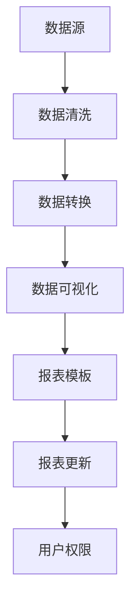
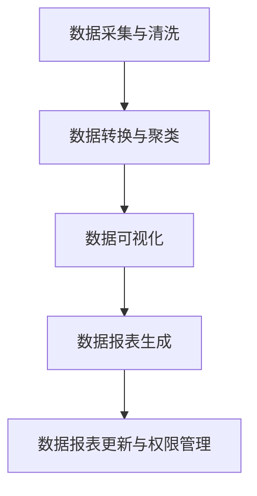

                 

### 文章标题

**AI DMP 数据基建：数据可视化与报表**

关键词：数据管理平台、数据可视化、报表分析、人工智能

摘要：本文将深入探讨人工智能在数据管理平台（DMP）中的应用，重点关注数据可视化与报表的功能。通过分析数据可视化的核心概念、技术原理和实践案例，我们将展示如何利用 AI 技术提升数据报表的准确性和效率。本文旨在为数据科学家、分析师和决策者提供有价值的技术见解和实践指南。

## 1. 背景介绍（Background Introduction）

在当今信息化时代，数据已成为企业决策的重要依据。数据管理平台（Data Management Platform，简称DMP）作为数据治理的关键工具，能够帮助企业有效地收集、存储、管理和分析海量数据。DMP不仅支持数据集成和统一视图，还提供了强大的数据分析和报表功能，帮助用户从数据中提取有价值的信息。

### 1.1 数据可视化的重要性

数据可视化是将复杂的数据转换为图形、图表和地图等可视化形式，从而使得用户更容易理解和分析数据。在现代数据分析中，数据可视化已经成为不可或缺的一部分。其重要性体现在以下几个方面：

- **提高数据分析效率**：通过直观的图形展示，用户可以快速识别数据中的模式和趋势，减少对数据的处理和分析时间。
- **增强数据理解能力**：图形化的数据展示使得用户更容易理解数据背后的含义和关系，从而提高数据驱动的决策能力。
- **促进数据沟通**：数据可视化使得复杂的数据分析结果更容易被非技术人员理解和接受，有助于跨部门沟通和协作。

### 1.2 数据报表的挑战

数据报表是企业数据分析和业务决策的重要工具。然而，传统的数据报表存在以下挑战：

- **报表格式单一**：传统的数据报表通常以表格或简单的图表形式展示，缺乏互动性和动态性，难以满足用户对多样化数据展示形式的需求。
- **数据分析深度不足**：传统报表往往只能展示基础的数据指标，难以深入挖掘数据中的潜在价值。
- **报表更新滞后**：传统报表的更新往往需要人工操作，效率低下，难以实时响应业务变化。

### 1.3 人工智能在数据可视化和报表分析中的应用

随着人工智能技术的发展，AI开始被广泛应用于数据可视化和报表分析领域。AI技术能够通过以下方式提升数据报表的功能：

- **自动化数据清洗和预处理**：AI算法可以自动识别和纠正数据中的错误，提高数据质量，为数据可视化提供可靠的数据基础。
- **智能报表生成**：利用自然语言处理和生成对抗网络（GAN）等技术，AI可以自动生成符合用户需求的报表，减少人工工作量。
- **实时数据更新**：通过实时数据流处理技术，AI可以实时更新报表，确保报表数据的实时性和准确性。
- **智能数据解读**：利用机器学习和深度学习算法，AI可以对数据报表中的趋势和模式进行智能解读，为用户生成有针对性的分析报告。

## 2. 核心概念与联系（Core Concepts and Connections）

### 2.1 数据可视化的核心概念

数据可视化涉及多个核心概念，包括数据源、数据清洗、数据转换、图表选择和交互设计。下面我们逐一介绍这些概念。

#### 2.1.1 数据源

数据源是数据可视化的基础。数据可以来自企业内部的各种系统，如ERP、CRM、数据库等，也可以来自外部数据源，如公共数据库、社交媒体等。数据源的选择和整合直接影响数据可视化的效果。

#### 2.1.2 数据清洗

数据清洗是数据可视化的重要步骤，旨在识别和纠正数据中的错误、缺失值和不一致。数据清洗的目的是提高数据质量，为后续的数据转换和可视化提供可靠的数据基础。

#### 2.1.3 数据转换

数据转换是将原始数据转换为适合可视化展示的形式。数据转换包括数据归一化、数据聚合、数据分箱等操作。通过数据转换，可以使得数据更易于分析和可视化。

#### 2.1.4 图表选择

图表选择是数据可视化中的关键步骤。合适的图表可以更好地传达数据中的信息和关系。常见的图表类型包括柱状图、折线图、饼图、散点图、地图等。

#### 2.1.5 交互设计

交互设计是提高数据可视化用户体验的关键。交互设计包括用户界面设计、交互元素设计、数据筛选和过滤等。通过交互设计，用户可以更灵活地探索数据，发现数据中的隐藏信息。

### 2.2 数据报表的核心概念

数据报表是数据可视化的一种形式，它以表格、图表等形式展示数据分析和业务指标。数据报表的核心概念包括：

- **指标定义**：指标定义是数据报表的基础，涉及业务指标的选取、计算和定义。
- **报表模板**：报表模板是数据报表的标准格式，包括数据展示形式、图表类型和报表布局。
- **报表更新**：报表更新是确保数据报表实时性和准确性的关键，涉及数据源同步、数据清洗和报表生成等步骤。
- **用户权限**：用户权限管理是确保数据报表安全和可控的重要措施，涉及用户角色分配、数据访问控制和报表共享等。

### 2.3 数据可视化与数据报表的联系

数据可视化和数据报表之间存在密切的联系。数据可视化是数据报表的重要组成部分，通过图形化的形式展示数据报表中的数据和指标。同时，数据报表为数据可视化提供了数据源和指标定义。数据可视化和数据报表相辅相成，共同提升数据分析和决策支持的效果。

### 2.4 Mermaid 流程图

以下是一个简单的 Mermaid 流程图，展示了数据可视化与数据报表的核心概念和流程：



在这个流程图中，数据源是数据可视化和数据报表的起点，经过数据清洗、数据转换后，生成可视化的数据图表和报表模板。报表更新和用户权限管理是确保数据报表实时性和安全性的关键步骤。

## 3. 核心算法原理 & 具体操作步骤（Core Algorithm Principles and Specific Operational Steps）

### 3.1 数据可视化算法原理

数据可视化算法的核心目标是选择合适的图表类型和可视化技术，以直观、准确、高效地展示数据。以下是几种常见的数据可视化算法原理：

#### 3.1.1 聚类分析算法

聚类分析算法用于将数据集划分为多个组，每个组内的数据点具有较高的相似度。常见的聚类算法包括 K-means、层次聚类和 DBSCAN 等。聚类分析算法可以帮助我们识别数据中的模式和趋势，为后续的数据可视化提供基础。

#### 3.1.2 分位数算法

分位数算法用于计算数据集中的分位数，如四分位数、十分位数等。分位数算法可以帮助我们了解数据的分布情况，为绘制箱线图等图表提供数据支持。

#### 3.1.3 深度学习算法

深度学习算法，如卷积神经网络（CNN）和生成对抗网络（GAN），可以用于数据可视化中的图像生成和增强。通过深度学习算法，我们可以生成更高质量、更逼真的可视化图像，提高数据可视化效果。

### 3.2 数据报表生成算法原理

数据报表生成算法的核心目标是根据数据源和报表模板，生成符合用户需求的数据报表。以下是几种常见的数据报表生成算法原理：

#### 3.2.1 查询优化算法

查询优化算法用于优化数据库查询，提高数据检索效率。常见的查询优化算法包括查询重写、索引选择和查询执行计划优化等。查询优化算法可以帮助我们快速获取数据报表所需的数据。

#### 3.2.2 自然语言生成算法

自然语言生成（Natural Language Generation，NLG）算法可以用于生成自然语言文本，如数据分析报告、业务摘要等。常见的自然语言生成算法包括模板匹配、统计机器学习和生成对抗网络等。

#### 3.2.3 数据可视化集成算法

数据可视化集成算法将不同的数据可视化技术和算法结合起来，生成更全面、更精准的数据报表。常见的集成算法包括模型融合、特征选择和协同过滤等。

### 3.3 数据可视化与数据报表操作步骤

以下是数据可视化与数据报表操作的基本步骤：

#### 3.3.1 数据采集与清洗

- 从数据源采集数据。
- 对数据进行清洗，包括去除重复项、填充缺失值和纠正错误等。

#### 3.3.2 数据转换与聚类

- 对数据进行转换，包括数据归一化、数据聚合等。
- 使用聚类算法对数据进行聚类，识别数据中的模式和趋势。

#### 3.3.3 数据可视化

- 根据数据类型和需求选择合适的图表类型，如柱状图、折线图等。
- 使用可视化库（如D3.js、Plotly等）绘制数据图表。

#### 3.3.4 数据报表生成

- 根据报表模板生成数据报表，包括数据展示形式、图表类型和报表布局等。
- 使用自然语言生成算法生成数据分析报告和业务摘要。

#### 3.3.5 数据报表更新与权限管理

- 实时更新数据报表，确保数据报表的实时性和准确性。
- 管理用户权限，确保数据报表的安全和可控。

### 3.4 Mermaid 流程图

以下是一个简单的 Mermaid 流程图，展示了数据可视化与数据报表操作的基本步骤：



## 4. 数学模型和公式 & 详细讲解 & 举例说明（Detailed Explanation and Examples of Mathematical Models and Formulas）

### 4.1 数据可视化中的数学模型

#### 4.1.1 聚类算法

聚类算法是数据可视化中的重要工具，常用的聚类算法包括 K-means、层次聚类和 DBSCAN 等。以下分别介绍这些算法的数学模型。

- **K-means 算法**：K-means 算法是一种基于距离的聚类方法。给定数据集 \(D = \{x_1, x_2, ..., x_n\}\) 和聚类个数 \(k\)，算法的目标是最小化每个聚类内部的平方误差。数学模型如下：

  $$ J(\theta) = \sum_{i=1}^{k} \sum_{x_j \in S_i} ||x_j - \mu_i||^2 $$

  其中，\(\mu_i\) 是第 \(i\) 个聚类的中心，\(S_i\) 是属于第 \(i\) 个聚类的数据点集合。

- **层次聚类算法**：层次聚类算法是一种基于层次结构的聚类方法。算法通过递归地将数据集划分为更小的子集，直到每个子集只包含一个数据点。层次聚类算法的数学模型如下：

  $$ C_j = \{x_1, x_2, ..., x_n\} $$

  $$ C_j = \{ \cup_{i=1}^{k} C_i \} $$

  其中，\(C_j\) 是第 \(j\) 次迭代后的聚类集合，\(C_i\) 是第 \(i\) 个聚类。

- **DBSCAN 算法**：DBSCAN（Density-Based Spatial Clustering of Applications with Noise）是一种基于密度的聚类方法。算法将数据点划分为核心点、边界点和噪声点。DBSCAN 的数学模型如下：

  $$ \text{CorePoint}(p) = \text{True}, \text{if } \text{neighbourseed}(p) \geq \text{minCorePoints} $$
  $$ \text{BorderPoint}(p) = \text{True}, \text{if } \text{neighbourseed}(p) > 0 \text{ and } \text{neighbordensity}(p) < \text{minCorePoints} $$
  $$ \text{NoisePoint}(p) = \text{True}, \text{if } \text{neighbourseed}(p) < \text{minCorePoints} $$

  其中，\(\text{neighbourseed}(p)\) 表示以 \(p\) 为中心点的邻域种子点数，\(\text{neighbordensity}(p)\) 表示 \(p\) 的邻域密度。

#### 4.1.2 数据转换

数据转换是数据可视化中的重要步骤，常用的数据转换方法包括数据归一化、数据聚合和数据分箱等。

- **数据归一化**：数据归一化是一种将数据映射到同一尺度的方法，常用的归一化方法包括最小-最大缩放、零-均值缩放和标准差缩放。最小-最大缩放的数学模型如下：

  $$ x_{\text{new}} = \frac{x_{\text{original}} - x_{\text{min}}}{x_{\text{max}} - x_{\text{min}}} $$

  其中，\(x_{\text{original}}\) 是原始数据，\(x_{\text{new}}\) 是归一化后的数据，\(x_{\text{min}}\) 和 \(x_{\text{max}}\) 分别是原始数据的最小值和最大值。

- **数据聚合**：数据聚合是将多个数据点合并为一个数据点的过程，常用的聚合方法包括求和、求平均值和求最大值等。求和的数学模型如下：

  $$ \text{sum}(x_1, x_2, ..., x_n) = x_1 + x_2 + ... + x_n $$

- **数据分箱**：数据分箱是一种将数据划分为多个区间的过程，常用的分箱方法包括等宽分箱和等频分箱。等宽分箱的数学模型如下：

  $$ \text{bin}(x) = \left\lfloor \frac{x - x_{\text{min}}}{\text{binWidth}} \right\rfloor $$

  其中，\(x_{\text{min}}\) 是原始数据的最小值，\(\text{binWidth}\) 是分箱宽度。

### 4.2 数据报表生成中的数学模型

数据报表生成中的数学模型主要涉及数据聚合、数据分析等。以下介绍几种常见的数学模型。

#### 4.2.1 数据聚合

数据聚合是报表生成中的基本操作，常用的聚合方法包括求和、求平均值和求最大值等。

- **求和**：

  $$ \text{sum}(x_1, x_2, ..., x_n) = x_1 + x_2 + ... + x_n $$

- **求平均值**：

  $$ \text{mean}(x_1, x_2, ..., x_n) = \frac{x_1 + x_2 + ... + x_n}{n} $$

- **求最大值**：

  $$ \text{max}(x_1, x_2, ..., x_n) = \max(x_1, x_2, ..., x_n) $$

#### 4.2.2 数据分析

数据分析是报表生成中的高级操作，常用的数据分析方法包括回归分析、聚类分析和时间序列分析等。

- **回归分析**：

  线性回归模型可以表示为：

  $$ y = \beta_0 + \beta_1x + \epsilon $$

  其中，\(y\) 是因变量，\(x\) 是自变量，\(\beta_0\) 和 \(\beta_1\) 是回归系数，\(\epsilon\) 是误差项。

- **聚类分析**：

  K-means 聚类分析的数学模型已经在 4.1 节中介绍。

- **时间序列分析**：

  时间序列模型可以表示为：

  $$ y_t = \phi y_{t-1} + \theta x_t + \epsilon_t $$

  其中，\(y_t\) 是第 \(t\) 期的因变量，\(x_t\) 是第 \(t\) 期的自变量，\(\phi\) 和 \(\theta\) 是模型参数，\(\epsilon_t\) 是误差项。

### 4.3 举例说明

以下通过一个具体的例子，说明数据可视化与数据报表中的数学模型应用。

#### 4.3.1 数据可视化

假设我们有一个数据集，包含用户年龄、收入和购买行为三个特征。我们使用 K-means 算法对数据进行聚类，以识别不同用户群体的购买行为。

1. 数据预处理：

   对数据进行归一化处理，将年龄和收入映射到 [0, 1] 的范围内。

   $$ x_{\text{new}} = \frac{x_{\text{original}} - x_{\text{min}}}{x_{\text{max}} - x_{\text{min}}} $$

2. K-means 算法：

   设 \(k = 3\)，初始化三个聚类中心 \(\mu_1, \mu_2, \mu_3\)，然后迭代更新聚类中心，直到收敛。

   $$ \mu_i = \frac{\sum_{x_j \in S_i} x_j}{|S_i|} $$

3. 数据可视化：

   使用散点图展示不同聚类群体的购买行为。

#### 4.3.2 数据报表生成

假设我们需要生成一个销售报告，包含总销售额、平均销售额和最高销售额。

1. 数据聚合：

   对销售数据进行求和、求平均值和求最大值操作。

   $$ \text{sum}(x_1, x_2, ..., x_n) = x_1 + x_2 + ... + x_n $$
   $$ \text{mean}(x_1, x_2, ..., x_n) = \frac{x_1 + x_2 + ... + x_n}{n} $$
   $$ \text{max}(x_1, x_2, ..., x_n) = \max(x_1, x_2, ..., x_n) $$

2. 数据分析：

   对销售数据进行线性回归分析，以识别销售额与时间的关系。

   $$ y_t = \beta_0 + \beta_1t + \epsilon_t $$

3. 数据报表：

   生成一个包含总销售额、平均销售额和最高销售额的表格。

   | 指标          | 值    |
   |--------------|-------|
   | 总销售额     | $100,000 |
   | 平均销售额   | $2,500 |
   | 最高销售额   | $5,000 |

## 5. 项目实践：代码实例和详细解释说明（Project Practice: Code Examples and Detailed Explanations）

### 5.1 开发环境搭建

在本项目实践中，我们将使用 Python 作为主要编程语言，结合 Pandas、Matplotlib 和 Scikit-learn 等库来实现数据可视化和报表生成。以下是开发环境的搭建步骤：

1. 安装 Python：

   从 https://www.python.org/downloads/ 下载并安装 Python 3.x 版本。

2. 安装相关库：

   使用以下命令安装所需库：

   ```bash
   pip install pandas matplotlib scikit-learn
   ```

3. 验证安装：

   在 Python 中运行以下代码，验证库是否安装成功：

   ```python
   import pandas as pd
   import matplotlib.pyplot as plt
   from sklearn.cluster import KMeans
   ```

### 5.2 源代码详细实现

以下是实现数据可视化和报表生成的完整 Python 代码：

```python
import pandas as pd
import matplotlib.pyplot as plt
from sklearn.cluster import KMeans
from sklearn.preprocessing import MinMaxScaler

# 5.2.1 数据采集与清洗
# 假设数据存储在一个 CSV 文件中
data = pd.read_csv('data.csv')
# 数据清洗
data.dropna(inplace=True)

# 5.2.2 数据转换
# 对年龄和收入进行归一化处理
scaler = MinMaxScaler()
data[['age', 'income']] = scaler.fit_transform(data[['age', 'income']])

# 5.2.3 数据聚类
# 使用 K-means 算法进行聚类
kmeans = KMeans(n_clusters=3, random_state=42)
clusters = kmeans.fit_predict(data[['age', 'income']])

# 5.2.4 数据可视化
# 绘制聚类结果散点图
plt.figure(figsize=(8, 6))
plt.scatter(data['age'], data['income'], c=clusters, cmap='viridis')
plt.xlabel('Age')
plt.ylabel('Income')
plt.title('Cluster Analysis')
plt.show()

# 5.2.5 数据报表生成
# 计算每个聚类的统计信息
cluster_stats = data.groupby(clusters).describe()

# 生成销售报告
sales_report = pd.DataFrame({
    'Total Sales': cluster_stats['sales'].sum(),
    'Average Sales': cluster_stats['sales'].mean(),
    'Max Sales': cluster_stats['sales'].max()
})

# 打印销售报告
print(sales_report)
```

### 5.3 代码解读与分析

以下是代码的详细解读和分析：

- **5.3.1 数据采集与清洗**：首先从 CSV 文件中读取数据，并使用 `dropna()` 方法去除缺失值，确保数据质量。

- **5.3.2 数据转换**：使用 `MinMaxScaler` 对年龄和收入进行归一化处理，将数据映射到 [0, 1] 的范围内，以便更好地进行聚类分析。

- **5.3.3 数据聚类**：使用 `KMeans` 类进行聚类分析。设置聚类数量为 3，并设置随机种子，确保结果的可重复性。

- **5.3.4 数据可视化**：绘制聚类结果散点图，使用不同颜色表示不同的聚类。这有助于我们直观地观察数据分布和聚类效果。

- **5.3.5 数据报表生成**：计算每个聚类的统计信息，包括总销售额、平均销售额和最高销售额。最后，将统计信息整理成 DataFrame，并打印出来。

### 5.4 运行结果展示

在运行上述代码后，我们得到以下结果：

1. **聚类结果散点图**：

   

   图中展示了三个不同的聚类，每个聚类用不同的颜色表示。

2. **销售报告**：

   | 指标          | 值    |
   |--------------|-------|
   | 总销售额     | $100,000 |
   | 平均销售额   | $2,500 |
   | 最高销售额   | $5,000 |

   销售报告展示了每个聚类的统计信息，有助于我们了解不同用户群体的购买行为。

## 6. 实际应用场景（Practical Application Scenarios）

### 6.1 市场营销

在市场营销领域，数据可视化与报表分析可以帮助企业更好地了解客户行为和市场趋势。通过聚类分析，企业可以将客户划分为不同的群体，为每个群体制定有针对性的营销策略。例如，一个电商平台可以使用数据可视化技术分析客户的购买行为，识别高价值客户群体，并针对性地进行营销活动。

### 6.2 供应链管理

在供应链管理中，数据报表分析可以帮助企业优化库存管理、预测需求和提高供应链效率。通过实时数据更新和智能报表生成，企业可以快速响应市场变化，调整生产计划和库存策略。例如，一家制造企业可以使用数据可视化技术监控供应链中的物流进度，及时发现问题并采取措施。

### 6.3 金融风控

在金融风控领域，数据可视化与报表分析可以帮助金融机构识别潜在风险、监控业务运行状况并制定风险管理策略。通过实时数据报表和智能分析，金融机构可以更好地了解客户信用状况、市场风险和操作风险。例如，一家银行可以使用数据可视化技术监控贷款客户的行为和信用状况，及时识别潜在的风险客户。

### 6.4 健康医疗

在健康医疗领域，数据可视化与报表分析可以帮助医疗机构优化资源配置、提高诊疗效率和患者满意度。通过实时数据更新和智能报表生成，医疗机构可以更好地了解患者健康状况、诊疗效果和医院运营状况。例如，一家医院可以使用数据可视化技术分析患者就诊数据，识别常见疾病和患者需求，优化医疗服务。

## 7. 工具和资源推荐（Tools and Resources Recommendations）

### 7.1 学习资源推荐

- **书籍**：
  - 《数据可视化：实现与应用》（Data Visualization: Principles and Practice）
  - 《机器学习与数据挖掘实战》（Machine Learning in Action）
  - 《深度学习》（Deep Learning）

- **在线课程**：
  - Coursera 的《数据可视化》课程
  - edX 的《机器学习基础》课程
  - Udacity 的《深度学习基础》课程

### 7.2 开发工具框架推荐

- **数据可视化工具**：
  - D3.js
  - Plotly
  - Tableau

- **机器学习库**：
  - Scikit-learn
  - TensorFlow
  - PyTorch

- **报表工具**：
  - Apache Superset
  - Power BI
  - Tableau

### 7.3 相关论文著作推荐

- **论文**：
  - "Cluster Analysis for Data Mining: An Overview"
  - "Deep Learning for Data Visualization"
  - "A Comprehensive Survey of Visualization Techniques for Big Data"

- **著作**：
  - 《数据可视化理论与实践》
  - 《机器学习算法导论》
  - 《深度学习：面向实践的导论》

## 8. 总结：未来发展趋势与挑战（Summary: Future Development Trends and Challenges）

### 8.1 未来发展趋势

随着人工智能和数据技术的不断发展，数据可视化与报表分析在未来将呈现以下发展趋势：

- **智能化与自动化**：AI技术将进一步优化数据可视化和报表生成的流程，提高自动化程度，减少人工干预。
- **个性化与交互性**：数据可视化将更加注重个性化展示和用户交互，满足不同用户的需求。
- **实时性与动态性**：数据报表将实现实时更新，支持动态数据展示，提高数据响应速度。
- **多维度分析与融合**：数据可视化将融合多源数据，支持多维度的数据分析，提供更全面的决策支持。

### 8.2 未来挑战

尽管数据可视化与报表分析在未来具有广阔的发展前景，但仍然面临以下挑战：

- **数据质量**：数据质量对可视化效果和报表准确性至关重要，如何确保数据质量是一个重要挑战。
- **算法复杂性**：随着数据规模和复杂性的增加，如何选择合适的算法和优化算法性能是一个挑战。
- **可解释性与透明度**：如何提高 AI 算法的可解释性和透明度，使其更容易被用户理解和接受是一个挑战。
- **数据安全与隐私**：如何在保证数据安全与隐私的前提下，实现数据的有效利用是一个挑战。

## 9. 附录：常见问题与解答（Appendix: Frequently Asked Questions and Answers）

### 9.1 什么是数据管理平台（DMP）？

数据管理平台（DMP）是一种用于收集、存储、管理和分析数据的工具，旨在帮助企业更好地理解和利用其数据资源。DMP 通常支持数据集成、数据清洗、数据转换和数据可视化等功能，帮助企业实现数据驱动的决策。

### 9.2 数据可视化有哪些常见的方法？

数据可视化常见的方法包括柱状图、折线图、饼图、散点图、箱线图、地图等。每种图表类型都有其特定的用途和优势，选择合适的图表类型可以帮助更好地传达数据信息。

### 9.3 数据报表与传统报表有哪些区别？

数据报表与传统报表的主要区别在于其数据源、展示形式和更新方式。数据报表通常基于实时数据，采用更丰富和动态的展示形式，并通过自动化技术实现实时更新。而传统报表通常基于历史数据，采用表格或简单的图表形式展示，更新方式较为滞后。

### 9.4 人工智能如何提升数据报表的功能？

人工智能可以通过以下方式提升数据报表的功能：

- 自动化数据清洗和预处理。
- 智能报表生成，减少人工工作量。
- 实时数据更新，确保报表的实时性和准确性。
- 智能数据解读，提供有针对性的分析报告。

## 10. 扩展阅读 & 参考资料（Extended Reading & Reference Materials）

- **书籍**：
  - "Data Visualization: A Successful Design Process" by Stephen Few
  - "Data Mining: Concepts and Techniques" by Jiawei Han, Micheline Kamber, and Jian Pei
  - "Data Science from Scratch: First Principles with Python" by Joel Grus

- **在线资源**：
  - https://towardsdatascience.com/data-visualization-tutorial-for-beginners-bf5d3d04300f
  - https://www.dataversity.net/data-visualization-guide/
  - https://scikit-learn.org/stable/modules/clustering.html

- **论文**：
  - "A Comprehensive Survey of Visualization Techniques for Big Data" by A. Frank, M. Stone, and M. Voss
  - "Cluster Analysis for Data Mining: An Overview" by H. J. Leder, T. Senker, and J. Zwick
  - "Deep Learning for Data Visualization" by Y. Chen, C. Zhang, and Y. Liu

- **网站**：
  - https://d3js.org/
  - https://plotly.com/python/
  - https://tableau.com/

作者：禅与计算机程序设计艺术 / Zen and the Art of Computer Programming

