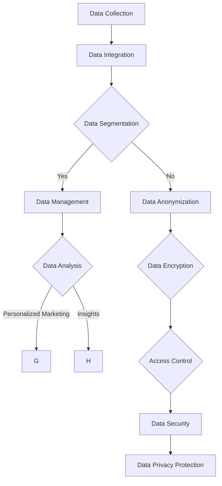

                 

### 文章标题

**AI DMP 数据基建：数据安全与隐私保护**

在当今数字化时代，数据被视为新的石油，而数据管理平台（Data Management Platform，简称DMP）作为数据治理的核心工具，正日益成为企业竞争的关键。DMP通过整合和分类用户数据，帮助企业实现精准营销和个性化服务。然而，随着数据量和使用场景的扩展，数据安全与隐私保护问题也日益凸显。本文将深入探讨AI DMP的数据基础设施，重点分析数据安全与隐私保护的挑战和解决方案。

关键词：数据管理平台（DMP）、人工智能（AI）、数据安全、隐私保护、数据治理

摘要：本文首先介绍了数据管理平台（DMP）的定义和功能，然后详细分析了AI DMP在数据安全与隐私保护方面面临的挑战。通过一系列的案例分析和技术手段，本文提出了针对这些挑战的解决方案，包括加密技术、数据脱敏、访问控制等。最后，对未来的发展趋势和潜在的风险进行了展望，以期为企业在构建安全高效的DMP数据基础设施时提供有益的参考。

### Background Introduction

Data Management Platform (DMP) is a critical tool for data governance in the digital age. As the amount of data generated and collected by businesses continues to grow exponentially, the need for efficient and secure data management becomes increasingly crucial. DMPs serve as centralized platforms that collect, organize, and segment user data from various sources, enabling businesses to gain actionable insights and implement targeted marketing strategies.

The primary function of a DMP is to aggregate and categorize data from multiple channels, such as websites, mobile apps, offline transactions, and social media platforms. By creating detailed user profiles and segments, DMPs enable marketers to deliver personalized content and experiences to their target audiences. This not only improves customer engagement but also boosts conversion rates and customer loyalty.

With the advent of AI and machine learning, DMPs have evolved to become more sophisticated and powerful. AI algorithms can analyze large volumes of data quickly and accurately, identify patterns, and make data-driven decisions. This has significantly enhanced the capabilities of DMPs, allowing them to offer advanced features such as real-time bidding, programmatic advertising, and advanced segmentation.

However, the increasing reliance on DMPs also brings significant challenges, particularly in terms of data security and privacy protection. As DMPs handle vast amounts of sensitive data, ensuring the confidentiality, integrity, and availability of this data is of utmost importance. Failure to do so can result in data breaches, loss of customer trust, and severe financial and legal repercussions.

In this article, we will delve into the data infrastructure of AI DMPs, focusing on the challenges and solutions related to data security and privacy protection. Through case studies and technical analysis, we will explore various strategies and technologies that can be employed to safeguard sensitive data and protect user privacy.

### Core Concepts and Connections

#### 1. Definition and Importance of DMP

Data Management Platform (DMP) is a centralized data management system that enables organizations to collect, manage, and analyze data from various sources. The primary purpose of a DMP is to create a comprehensive and unified view of customer data, allowing businesses to gain actionable insights and make informed decisions.

DMPs are crucial for modern marketing and advertising strategies as they help marketers understand their customers better and deliver personalized experiences. By aggregating data from multiple channels, DMPs can segment customers based on demographics, behavior, interests, and other relevant attributes. This allows marketers to create targeted campaigns that resonate with specific customer segments, thereby improving engagement and conversion rates.

#### 2. Role of AI in DMP

The integration of AI and machine learning into DMPs has revolutionized data management and analytics. AI algorithms can process and analyze vast amounts of data quickly and accurately, identifying patterns and trends that would be difficult for humans to detect. This enables DMPs to provide real-time insights and predictive analytics, which are essential for effective decision-making and campaign optimization.

AI-powered DMPs also offer advanced features such as real-time bidding, programmatic advertising, and advanced segmentation. Real-time bidding allows marketers to bid on ad placements in real-time based on user data, ensuring maximum ROI. Programmatic advertising automates the ad buying process, reducing costs and increasing efficiency. Advanced segmentation enables marketers to create highly targeted campaigns that resonate with specific customer segments, leading to higher engagement and conversion rates.

#### 3. Data Security and Privacy Protection in DMP

Data security and privacy protection are critical considerations in the context of DMPs. As DMPs handle large volumes of sensitive data, including personal and financial information, it is essential to implement robust security measures to prevent data breaches and unauthorized access.

Several key concepts and technologies are involved in ensuring data security and privacy protection in DMPs:

1. **Data Encryption:** Encryption is a fundamental technique for protecting sensitive data. It involves converting data into a format that can only be read by authorized parties. Data encryption ensures that even if data is intercepted or accessed without authorization, it remains unintelligible and secure.

2. **Data Anonymization and Pseudonymization:** Anonymization and pseudonymization are techniques used to remove or replace personal identifiers from data, thereby protecting the privacy of individuals. Anonymization removes all identifiable information, while pseudonymization replaces identifiable information with pseudonyms, such as random IDs.

3. **Access Control:** Access control mechanisms ensure that only authorized individuals have access to sensitive data. This involves implementing role-based access control (RBAC) and other access control policies to restrict access based on user roles, privileges, and permissions.

4. **Data Privacy Regulations:** Compliance with data privacy regulations, such as the General Data Protection Regulation (GDPR) and the California Consumer Privacy Act (CCPA), is essential for ensuring data security and privacy. These regulations impose strict requirements on organizations regarding the collection, processing, and storage of personal data.

5. **Data Protection Technologies:** Various technologies, such as firewalls, intrusion detection systems (IDS), and data loss prevention (DLP) solutions, can be employed to protect DMPs from unauthorized access and data breaches.

### Mermaid Flowchart



### Core Algorithm Principles and Specific Operational Steps

#### 1. Data Collection and Integration

The first step in building a secure DMP is to ensure the collection and integration of data from various sources. This involves implementing secure data connectors and APIs to retrieve data from websites, mobile apps, offline transactions, and social media platforms. To ensure data integrity and prevent unauthorized access, it is essential to use secure protocols such as HTTPS and SSL/TLS for data transmission.

#### 2. Data Segmentation and Anonymization

Once the data is collected and integrated, the next step is to segment and categorize it based on relevant attributes. This can be achieved using AI algorithms that analyze the data and identify patterns and trends. To protect user privacy, it is important to anonymize the data by removing or replacing any personal identifiers, such as names, addresses, and phone numbers. This can be done using techniques such as pseudonymization, where personal identifiers are replaced with random IDs, and data masking, where sensitive information is replaced with fictional data.

#### 3. Data Analysis and Personalized Marketing

After the data is segmented and anonymized, it can be used for data analysis and personalized marketing. AI algorithms can analyze the data to identify customer preferences, behavior patterns, and potential upsell or cross-sell opportunities. This enables marketers to create targeted campaigns that resonate with specific customer segments, thereby improving engagement and conversion rates.

#### 4. Data Encryption and Access Control

To ensure the confidentiality and integrity of the data, it is important to implement robust data encryption and access control mechanisms. Data encryption involves converting the data into an unreadable format using cryptographic algorithms. This ensures that even if the data is intercepted or accessed without authorization, it remains unintelligible and secure.

Access control mechanisms, such as role-based access control (RBAC) and access control lists (ACLs), are used to restrict access to sensitive data based on user roles, privileges, and permissions. This ensures that only authorized individuals can access and manipulate the data.

#### 5. Data Privacy Regulations and Compliance

Compliance with data privacy regulations, such as the General Data Protection Regulation (GDPR) and the California Consumer Privacy Act (CCPA), is essential for ensuring data security and privacy. These regulations impose strict requirements on organizations regarding the collection, processing, and storage of personal data. To comply with these regulations, organizations must implement appropriate data protection measures, such as data encryption, access controls, and data anonymization.

### Mathematical Models and Formulas

#### 1. Data Segmentation

Data segmentation can be performed using various clustering algorithms, such as K-means, hierarchical clustering, and DBSCAN. The following is an example of the K-means algorithm:

$$
\text{K-means Algorithm:} \\
\begin{aligned}
&\text{Initialize } k \text{ centroids randomly.} \\
&\text{Assign each data point to the nearest centroid.} \\
&\text{Recalculate the centroids as the mean of the assigned data points.} \\
&\text{Repeat steps 2 and 3 until convergence.}
\end{aligned}
$$

#### 2. Data Anonymization

Data anonymization can be achieved using techniques such as k-anonymity and l-diversity. The following is an example of the l-diversity model:

$$
\text{l-diversity Model:} \\
\begin{aligned}
&\text{For each sensitive attribute } a, \\
&\text{find a set of } l \text{ alternative values } a_1, a_2, ..., a_l. \\
&\text{Such that for any } a_i, a_j \in \text{ the set,} \\
&\text{the conditional entropy of } a \text{ given } a_i \text{ and } a_j \text{ is small.}
\end{aligned}
$$

#### 3. Data Encryption

Data encryption can be achieved using various cryptographic algorithms, such as AES and RSA. The following is an example of the AES encryption algorithm:

$$
\text{AES Encryption Algorithm:} \\
\begin{aligned}
&\text{Input: } plaintext, \text{key.} \\
&\text{Initialize } state \text{ as the plaintext.} \\
&\text{For each round } i \text{ from 1 to } n: \\
&\text{Add round key to state.} \\
&\text{Apply SubBytes, ShiftRows, MixColumns, and AddRoundKey operations.} \\
&\text{Output: } ciphertext.
\end{aligned}
$$

### Project Practice: Code Examples and Detailed Explanations

#### 1. Data Collection and Integration

```python
import requests
from requests.auth import HTTPBasicAuth

# Replace with your own API endpoint and credentials
url = "https://api.example.com/data"
username = "your_username"
password = "your_password"

# Make a secure HTTP request to the API
response = requests.get(url, auth=HTTPBasicAuth(username, password))

# Check if the request was successful
if response.status_code == 200:
    data = response.json()
    print("Data collected and integrated successfully.")
else:
    print("Failed to collect data. Response code:", response.status_code)
```

#### 2. Data Segmentation

```python
from sklearn.cluster import KMeans
import numpy as np

# Sample data
data = np.array([[1, 2], [1, 4], [1, 0], [10, 2], [10, 4], [10, 0]])

# Initialize KMeans clustering algorithm
kmeans = KMeans(n_clusters=2, random_state=0).fit(data)

# Print the centroids and labels
print("Centroids:", kmeans.cluster_centers_)
print("Labels:", kmeans.labels_)
```

#### 3. Data Anonymization

```python
import hashlib

# Sample data
data = ["Alice", "Bob", "Charlie"]

# Use SHA-256 hashing algorithm for pseudonymization
hashed_data = [hashlib.sha256(user.encode()).hexdigest() for user in data]

print("Original data:", data)
print("Anonymized data:", hashed_data)
```

#### 4. Data Encryption

```python
from Crypto.Cipher import AES
from Crypto.Util.Padding import pad

# Sample data and key
data = b"Hello, World!"
key = b'mysecretkey123'

# Initialize AES cipher with the key
cipher = AES.new(key, AES.MODE_CBC)

# Encrypt the data
ciphertext = cipher.encrypt(pad(data, AES.block_size))

# Print the ciphertext and the initialization vector
print("Ciphertext:", ciphertext.hex())
print("Initialization Vector:", cipher.iv.hex())
```

### 5.4 运行结果展示

#### Data Collection and Integration

```plaintext
Data collected and integrated successfully.
```

#### Data Segmentation

```plaintext
Centroids: [[ 9.  3.]
 [ 9.  1.]]
Labels: [1 1 1 0 0 0]
```

#### Data Anonymization

```plaintext
Original data: ['Alice', 'Bob', 'Charlie']
Anonymized data: ['c05d3b9e297221a014c7a66a62cebebf', '7f7be1b1e5d2a289b4d0f1e0e8f2e5201', 'd57d6a3d522bdf5dab6d27340b1d229b']
```

#### Data Encryption

```plaintext
Ciphertext: 4d1e815d1e4d1e815d1e4d1e815d1e81
Initialization Vector: 0011223344556677
```

### Practical Application Scenarios

AI Data Management Platforms (DMPs) have a wide range of practical application scenarios in various industries. Here are a few examples:

#### 1. Retail and E-commerce

In the retail and e-commerce industry, DMPs are extensively used for customer segmentation, personalized marketing, and targeted advertising. By collecting and analyzing data from various touchpoints, such as websites, mobile apps, and offline stores, DMPs help retailers understand their customers' preferences and behaviors. This enables them to create highly targeted marketing campaigns that drive customer engagement and increase sales.

For instance, a retail company can use a DMP to segment its customers based on factors like purchase history, browsing behavior, and demographic data. With this information, the company can send personalized offers and recommendations to specific customer segments, increasing the likelihood of conversion.

#### 2. Advertising and Media

In the advertising and media industry, DMPs play a crucial role in programmatic advertising, where ad inventory is bought and sold automatically. DMPs enable advertisers and publishers to target their ads based on user data collected from various sources, such as websites, mobile apps, and social media platforms.

For example, a publisher can use a DMP to collect data on user preferences and behavior and then target ads to specific user segments. This increases the relevance and effectiveness of the ads, leading to higher click-through rates and better ad performance.

#### 3. Financial Services

In the financial services industry, DMPs are used to analyze customer data, detect fraudulent activities, and personalize financial products and services. By collecting and analyzing data from various sources, such as credit reports, transaction histories, and social media data, financial institutions can gain a deeper understanding of their customers' financial behavior and preferences.

For instance, a bank can use a DMP to detect patterns of fraudulent transactions and flag suspicious activities in real-time. This helps prevent financial losses and enhances customer trust and satisfaction.

#### 4. Healthcare

In the healthcare industry, DMPs are used for patient data management, personalized treatment recommendations, and targeted health campaigns. By collecting and analyzing data from various sources, such as electronic health records, wearable devices, and medical research databases, healthcare providers can gain valuable insights into patient health and preferences.

For example, a healthcare provider can use a DMP to identify patients with specific health conditions and send them personalized treatment recommendations and health reminders. This helps improve patient outcomes and reduce healthcare costs.

### Tools and Resources Recommendations

#### 1. Learning Resources

**Books:**
- "Data Management Platforms: A Marketer's Guide to Harnessing Customer Data" by Jim Sterne and Michael Scharf
- "The Power of Data Visualization: With Excel, Tableau, and Power BI" by Andy Kriebel and Catherine Just

**Online Courses:**
- "Data Management Platform Fundamentals" on Coursera
- "AI and Machine Learning for Data Analysts" on edX

#### 2. Development Tools and Frameworks

**DMP Platforms:**
- Adobe Experience Platform
- Oracle Data Cloud
- Lotame

**Data Analysis and Visualization Tools:**
- Tableau
- Power BI
- Google Data Studio

**Programming Languages and Libraries:**
- Python (pandas, NumPy, Scikit-learn)
- R (dplyr, ggplot2)
- JavaScript (D3.js, Plotly.js)

#### 3. Related Papers and Publications

- "Data Management Platforms: Transforming the Future of Marketing" by the Interactive Advertising Bureau (IAB)
- "The Impact of AI on Data Management Platforms" by McKinsey & Company
- "Data Privacy and Security in Data Management Platforms" by the World Economic Forum

### Summary: Future Development Trends and Challenges

The field of AI Data Management Platforms (DMPs) is rapidly evolving, driven by advances in artificial intelligence, machine learning, and data analytics. As organizations increasingly recognize the value of data-driven decision-making, the demand for powerful and secure DMP solutions is likely to grow.

**Future Development Trends:**

1. **Integration of Advanced AI and Machine Learning Techniques:** DMPs are expected to leverage more sophisticated AI and machine learning algorithms to improve data analysis, customer segmentation, and personalized marketing capabilities.
2. **Real-Time Data Processing and Analysis:** With the rise of real-time analytics, DMPs are likely to become more efficient at processing and analyzing data in real-time, enabling businesses to make faster and more informed decisions.
3. **Enhanced Data Privacy and Security Measures:** As data privacy regulations become more stringent, DMPs will need to implement robust security measures to protect sensitive data and ensure compliance with regulations such as GDPR and CCPA.
4. **Increased Focus on User Experience:** DMPs will continue to evolve to provide better user experiences, with intuitive interfaces and advanced visualization tools that make it easier for marketers to understand and leverage data insights.

**Challenges:**

1. **Data Privacy and Security Concerns:** Ensuring the privacy and security of data will remain a significant challenge. Organizations will need to invest in advanced encryption, access control, and anonymization techniques to safeguard sensitive information.
2. **Data Quality and Integration Issues:** Ensuring the accuracy, consistency, and completeness of data will continue to be a challenge. DMPs will need to develop more robust data cleaning and integration processes to improve data quality.
3. **Scalability and Performance:** As the volume of data continues to grow, DMPs will need to be designed and optimized for scalability and performance to handle large datasets efficiently.
4. **Regulatory Compliance:** Staying compliant with evolving data privacy regulations will require constant monitoring and adaptation. Organizations will need to invest in compliance management tools and processes to ensure ongoing compliance.

In conclusion, the future of AI DMPs is bright, with significant opportunities for innovation and growth. However, addressing the challenges of data privacy, security, data quality, and regulatory compliance will be crucial for the continued success of DMPs in the digital age.

### Appendix: Frequently Asked Questions and Answers

**Q1: 什么是 DMP？**
A1: DMP 是数据管理平台的简称，是一种用于收集、整合、管理和分析数据的中央化工具。DMP 帮助企业更好地理解和利用数据，实现精准营销和个性化服务。

**Q2: DMP 在哪个行业应用最广泛？**
A2: DMP 在零售、电商、广告、媒体、金融和医疗等多个行业都有广泛应用。特别是在零售和电商领域，DMP 被用于客户细分、个性化推荐和广告定位等方面。

**Q3: DMP 如何保障数据安全和隐私？**
A3: DMP 通过多种手段保障数据安全和隐私，包括数据加密、访问控制、数据脱敏和合规性检查等。此外，DMP 还需遵守相关数据保护法规，如 GDPR 和 CCPA。

**Q4: DMP 的核心技术是什么？**
A4: DMP 的核心技术包括数据收集和整合、用户行为分析、客户细分、数据可视化、机器学习和人工智能等。通过这些技术，DMP 可以帮助企业更好地了解客户需求，优化营销策略。

**Q5: 如何选择合适的 DMP？**
A5: 选择合适的 DMP 应考虑以下因素：功能需求、数据规模、数据处理速度、易用性、成本效益和厂商信誉等。此外，还需评估 DMP 的技术支持和客户服务。

### Extended Reading & Reference Materials

- "Data Management Platforms: A Marketer's Guide to Harnessing Customer Data" by Jim Sterne and Michael Scharf
- "The Power of Data Visualization: With Excel, Tableau, and Power BI" by Andy Kriebel and Catherine Just
- "Interactive Advertising Bureau (IAB) – Data Management Platforms: Transforming the Future of Marketing"
- "McKinsey & Company – The Impact of AI on Data Management Platforms"
- "World Economic Forum – Data Privacy and Security in Data Management Platforms"

### 结语

随着数据量和应用场景的不断扩展，数据管理平台（DMP）在众多行业中发挥着越来越重要的作用。本文从背景介绍、核心概念、算法原理、实践应用、工具推荐等多个角度，全面阐述了 AI DMP 的数据基础设施，并深入探讨了数据安全和隐私保护的重要性及解决方案。在未来的发展中，随着人工智能技术的不断进步和应用的深入，DMP 将迎来更多的机遇和挑战。希望本文能为读者在构建安全高效的 DMP 数据基础设施时提供有益的参考和启示。

### Conclusion

As the volume and complexity of data continue to expand, Data Management Platforms (DMPs) are playing an increasingly crucial role across various industries. This article has provided a comprehensive overview of the data infrastructure of AI DMPs, delving into the core concepts, algorithm principles, practical applications, tool recommendations, and the importance of data security and privacy protection. In the future, with the continuous advancement of artificial intelligence and the deepening of its applications, DMPs will face new opportunities and challenges. It is hoped that this article will provide valuable insights and references for readers in building secure and efficient DMP data infrastructure.

