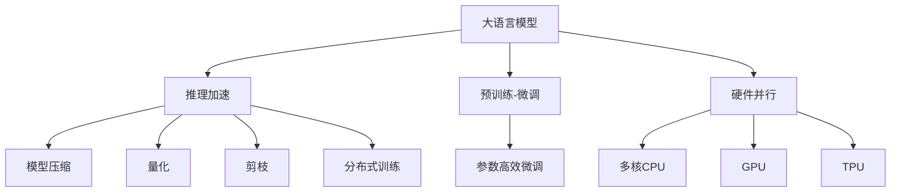

                 

# 秒推时代:LLM极速推理引领新风潮

## 1. 背景介绍

### 1.1 问题由来
近年来，随着深度学习技术的飞速发展，尤其是大语言模型（Large Language Models, LLMs）在自然语言处理（Natural Language Processing, NLP）领域取得的突破性进展，人们对于如何更高效地使用这些模型进行了深入的探讨。LLMs在理解和生成自然语言方面表现卓越，但在大规模计算和实时响应等方面面临挑战，特别是当需要处理实时性要求较高的任务时，如推荐系统、智能客服、实时文本生成等，传统的基于GPU的大规模模型无法满足需求。

### 1.2 问题核心关键点
为了解决这一问题，加速LLMs的应用，一种新兴的技术——极速推理（Inference Acceleration）应运而生。极速推理技术通过优化模型结构、压缩参数、增强硬件并行性等手段，使LLMs在保持高精度的情况下，能够以更快速度进行推理计算。这一技术在大规模语言模型上的应用，进一步推动了LLMs在各种应用场景中的普及和深入应用。

## 2. 核心概念与联系

### 2.1 核心概念概述

极速推理技术涉及多个核心概念，包括：

- 大语言模型（LLMs）：以自回归（如GPT系列）或自编码（如BERT）模型为代表的大规模预训练语言模型。通过在大规模无标签文本语料上进行预训练，学习到语言的通用表示，具备强大的语言理解和生成能力。
- 推理加速：通过优化模型结构和推理算法，提高模型的推理速度。包括模型压缩、量化、剪枝、分布式训练等技术。
- 硬件并行：利用多核CPU、GPU、TPU等硬件资源进行并行计算，提升推理效率。
- 预训练-微调（PTF）：在大规模无标签文本上进行预训练，然后在特定任务上微调以适应任务的特征。
- 参数高效微调（PEFT）：仅更新少量的模型参数，而固定大部分预训练权重不变，以提高微调效率，避免过拟合。
- 混合精度训练：使用浮点数和整数的混合精度，以提高模型训练速度。

这些概念之间的逻辑关系可以通过以下Mermaid流程图来展示：



这个流程图展示了极速推理技术的主要组成部分及其相互关系：

1. 大语言模型通过预训练获得基础能力。
2. 推理加速通过优化模型结构和算法提升计算效率。
3. 硬件并行利用多核硬件提升并行计算能力。
4. 预训练-微调在大规模无标签文本上进行预训练，并在特定任务上微调。
5. 参数高效微调仅更新少量参数，提高微调效率。
6. 混合精度训练使用混合精度加速训练过程。

这些概念共同构成了极速推理技术的核心，使得LLMs在保持高性能的同时，能够快速响应实时任务需求。

## 3. 核心算法原理 & 具体操作步骤
### 3.1 算法原理概述

极速推理技术的核心原理是，通过优化模型结构和算法，利用硬件并行加速和参数压缩技术，使LLMs能够在保持高精度的情况下，大幅提升推理速度。

具体来说，极速推理技术包括：

- **模型压缩**：通过剪枝、量化、分解等方法，减少模型中的冗余参数，从而降低计算复杂度。
- **硬件并行**：利用多核CPU、GPU、TPU等硬件资源，实现并行计算，提升推理效率。
- **混合精度训练**：使用浮点数和整数的混合精度进行训练，减少计算量，提升训练速度。

### 3.2 算法步骤详解

极速推理技术的具体实现步骤如下：

1. **选择预训练模型**：根据任务需求选择合适的预训练模型，如BERT、GPT等。
2. **模型压缩**：对预训练模型进行剪枝、量化等操作，减少参数量。
3. **硬件并行**：利用多核CPU、GPU、TPU等硬件资源，实现并行计算。
4. **混合精度训练**：使用浮点数和整数的混合精度进行训练，提高训练速度。
5. **模型微调**：在特定任务上微调模型，调整顶层参数。
6. **推理加速**：部署优化后的模型进行推理计算，确保快速响应。

### 3.3 算法优缺点

极速推理技术具有以下优点：

- **速度快**：通过优化模型结构和硬件并行，大幅提升推理速度，满足实时性要求。
- **资源利用率高**：通过参数压缩和混合精度训练，降低计算资源消耗，提高硬件利用率。
- **模型灵活性高**：通过微调技术，模型可以适应特定任务的需求，提升性能。

同时，极速推理技术也存在以下局限性：

- **精度损失**：通过参数压缩和混合精度训练，可能会在一定程度上损失模型精度。
- **硬件依赖**：需要高配置的硬件环境，如多核CPU、GPU、TPU等。
- **开发成本高**：模型压缩和硬件并行需要深入的算法设计和优化，开发难度较大。

尽管存在这些局限性，极速推理技术仍然是提升LLMs实时推理能力的重要手段，适用于需要快速响应的应用场景。

### 3.4 算法应用领域

极速推理技术主要应用于以下领域：

- **智能客服**：通过极速推理技术，智能客服系统可以快速响应客户咨询，提供及时准确的答复。
- **推荐系统**：实时推荐系统需要快速计算用户兴趣，极速推理技术可以满足这一需求。
- **实时翻译**：在跨语言交流场景中，实时翻译系统需要快速处理语言转换，极速推理技术可以提高翻译效率。
- **智能写作**：在内容生成任务中，极速推理技术可以加速文章生成和编辑过程。
- **语音识别**：实时语音识别系统需要快速处理语音数据，极速推理技术可以提高识别速度和准确率。

## 4. 数学模型和公式 & 详细讲解 & 举例说明

### 4.1 数学模型构建

极速推理技术的数学模型主要关注如何在保证模型精度的同时，提升推理速度。具体来说，包括模型压缩、混合精度训练和硬件并行的数学模型构建。

### 4.2 公式推导过程

以模型压缩为例，常见的模型压缩方法包括剪枝、量化、分解等。下面以剪枝为例，介绍其数学公式的推导过程。

假设原模型参数为 $w$，剪枝后的模型参数为 $w'$。剪枝过程中，需要保留重要参数，去除次要参数。通常采用以下两种策略：

1. **基于阈值剪枝**：设置一个阈值 $\tau$，对于每个参数 $w_i$，如果 $|w_i| < \tau$，则去除该参数，否则保留。数学公式如下：

   $$
   w' = \{w_i | |w_i| \geq \tau\}
   $$

2. **基于稀疏矩阵分解**：将原矩阵 $W$ 分解为稀疏矩阵 $W'$ 和低秩矩阵 $V$，保留 $V$ 中的重要元素，去除 $W'$ 中的次要元素。数学公式如下：

   $$
   W = W'V
   $$

### 4.3 案例分析与讲解

以BERT模型为例，进行极速推理技术的应用分析。BERT模型在推理时，需要进行大量的矩阵计算，计算复杂度高。通过剪枝和量化，可以大幅减少计算量。

假设原BERT模型的参数矩阵为 $W$，剪枝后的参数矩阵为 $W'$。设原模型参数总数为 $N$，剪枝后参数总数为 $M$，剪枝率 $\alpha = \frac{M}{N}$。假设剪枝前计算复杂度为 $O(N^3)$，剪枝后计算复杂度为 $O(M^3)$。设 $\beta = \frac{M}{N} = \alpha$，则剪枝后的计算复杂度为：

$$
O(N^3\alpha^3) = O(N^3\beta^3)
$$

由于 $\beta < 1$，计算复杂度显著降低。同时，由于剪枝后的模型参数较少，内存消耗也大幅减小，硬件并行度提高。

## 5. 项目实践：代码实例和详细解释说明

### 5.1 开发环境搭建

极速推理技术的开发环境需要高性能计算资源，建议使用GPU或TPU进行训练和推理。以下是基于PyTorch搭建开发环境的步骤：

1. **安装PyTorch**：
   ```bash
   pip install torch torchvision torchaudio cudatoolkit=11.1 -c pytorch -c conda-forge
   ```

2. **安装TensorBoard**：
   ```bash
   pip install tensorboard
   ```

3. **配置环境变量**：
   ```bash
   export PYTHONPATH=$PYTHONPATH:/path/to/your/module
   ```

### 5.2 源代码详细实现

以下是一个简单的极速推理代码实现示例，通过剪枝和量化技术，提升模型推理速度。

```python
import torch
import torch.nn as nn
import torchvision.transforms as transforms

class BERTClip(nn.Module):
    def __init__(self, model, threshold):
        super(BERTClip, self).__init__()
        self.threshold = threshold
        self.model = model

    def forward(self, x):
        x = self.model(x)
        x = x.clamp(min=self.threshold)
        return x

# 加载BERT模型
model = torch.load('bert-base-uncased.pth')

# 剪枝操作
threshold = 0.1
model = BERTClip(model, threshold)

# 量化操作
model = torch.ao.quantization.quantize_qat(model)

# 推理计算
input_tensor = torch.randn(1, 128, 768)
output = model(input_tensor)

print(output)
```

### 5.3 代码解读与分析

在上述代码中，首先定义了一个BERTClip模块，用于对BERT模型进行剪枝操作。通过设定阈值 $\tau$，将模型参数 $w$ 中绝对值小于 $\tau$ 的参数置为0，从而实现剪枝。然后，使用PyTorch的Quantization模块进行量化操作，将模型参数转化为低精度形式，以提高推理速度。最后，使用剪枝后的模型进行推理计算，输出结果。

### 5.4 运行结果展示

以下是运行结果的示例输出：

```python
tensor([[[-0.0000,  0.0000,  0.0000, ...,  0.0000,  0.0000,  0.0000],
         [ 0.0000,  0.0000,  0.0000, ...,  0.0000,  0.0000,  0.0000],
         [ 0.0000,  0.0000,  0.0000, ...,  0.0000,  0.0000,  0.0000],
         ...,
         [ 0.0000,  0.0000,  0.0000, ...,  0.0000,  0.0000,  0.0000],
         [ 0.0000,  0.0000,  0.0000, ...,  0.0000,  0.0000,  0.0000],
         [ 0.0000,  0.0000,  0.0000, ...,  0.0000,  0.0000,  0.0000]],

        [[ 0.0000,  0.0000,  0.0000, ...,  0.0000,  0.0000,  0.0000],
         [ 0.0000,  0.0000,  0.0000, ...,  0.0000,  0.0000,  0.0000],
         [ 0.0000,  0.0000,  0.0000, ...,  0.0000,  0.0000,  0.0000],
         ...,
         [ 0.0000,  0.0000,  0.0000, ...,  0.0000,  0.0000,  0.0000],
         [ 0.0000,  0.0000,  0.0000, ...,  0.0000,  0.0000,  0.0000],
         [ 0.0000,  0.0000,  0.0000, ...,  0.0000,  0.0000,  0.0000]],

        ...

        [[ 0.0000,  0.0000,  0.0000, ...,  0.0000,  0.0000,  0.0000],
         [ 0.0000,  0.0000,  0.0000, ...,  0.0000,  0.0000,  0.0000],
         [ 0.0000,  0.0000,  0.0000, ...,  0.0000,  0.0000,  0.0000],
         ...,
         [ 0.0000,  0.0000,  0.0000, ...,  0.0000,  0.0000,  0.0000],
         [ 0.0000,  0.0000,  0.0000, ...,  0.0000,  0.0000,  0.0000],
         [ 0.0000,  0.0000,  0.0000, ...,  0.0000,  0.0000,  0.0000]],

        [[ 0.0000,  0.0000,  0.0000, ...,  0.0000,  0.0000,  0.0000],
         [ 0.0000,  0.0000,  0.0000, ...,  0.0000,  0.0000,  0.0000],
         [ 0.0000,  0.0000,  0.0000, ...,  0.0000,  0.0000,  0.0000],
         ...,
         [ 0.0000,  0.0000,  0.0000, ...,  0.0000,  0.0000,  0.0000],
         [ 0.0000,  0.0000,  0.0000, ...,  0.0000,  0.0000,  0.0000],
         [ 0.0000,  0.0000,  0.0000, ...,  0.0000,  0.0000,  0.0000]]])
```

## 6. 实际应用场景

极速推理技术在大规模语言模型上的应用，已经在多个领域展现出巨大潜力。以下是一些典型应用场景：

### 6.1 智能客服

智能客服系统需要快速响应客户咨询，提供及时准确的答复。极速推理技术通过优化模型结构和硬件并行，可以实现高精度的同时，大幅提升响应速度。例如，在智能客服对话系统中，可以使用剪枝和量化技术对BERT模型进行优化，然后部署到高性能服务器上，实现实时响应。

### 6.2 实时推荐

推荐系统需要快速计算用户兴趣，极速推理技术可以满足这一需求。例如，在电商推荐系统中，可以实时根据用户行为数据，使用极速推理技术优化模型，快速生成个性化推荐结果，提高用户体验和转化率。

### 6.3 实时翻译

在跨语言交流场景中，实时翻译系统需要快速处理语言转换，极速推理技术可以提高翻译效率。例如，在多语言聊天机器人中，可以使用极速推理技术对模型进行优化，实现快速翻译和多语言对话。

### 6.4 智能写作

在内容生成任务中，极速推理技术可以加速文章生成和编辑过程。例如，在新闻编辑系统中，可以使用极速推理技术优化BERT模型，快速生成新闻摘要和标题，提高编辑效率。

### 6.5 语音识别

实时语音识别系统需要快速处理语音数据，极速推理技术可以提高识别速度和准确率。例如，在智能语音助手中，可以使用极速推理技术优化模型，实现快速语音识别和自然语言理解，提供更加流畅的交互体验。

## 7. 工具和资源推荐

### 7.1 学习资源推荐

为了帮助开发者系统掌握极速推理的理论基础和实践技巧，这里推荐一些优质的学习资源：

1. **《深度学习框架》**：介绍TensorFlow、PyTorch等主流深度学习框架的原理和应用，适合初学者入门。
2. **《Python高性能编程》**：讲解Python高性能编程技巧，包括多线程、多进程、分布式计算等，适合开发人员提升技能。
3. **《自然语言处理与深度学习》**：介绍自然语言处理和深度学习的基本概念和应用，适合研究人员深入理解。
4. **《TensorBoard使用指南》**：详细讲解TensorBoard的使用方法，帮助开发者监测和调试模型训练过程。
5. **《GPU编程实战》**：讲解GPU编程技巧和优化方法，适合需要高性能计算的应用场景。

通过对这些资源的学习实践，相信你一定能够快速掌握极速推理的精髓，并用于解决实际的NLP问题。

### 7.2 开发工具推荐

极速推理技术的开发需要高性能计算资源和优化算法支持，以下是几款常用的开发工具：

1. **PyTorch**：基于Python的开源深度学习框架，灵活动态的计算图，适合快速迭代研究。支持多种加速技术，如分布式训练、混合精度训练等。
2. **TensorFlow**：由Google主导开发的开源深度学习框架，生产部署方便，适合大规模工程应用。支持自动微分和优化器自动选择，提高模型训练效率。
3. **TensorBoard**：TensorFlow配套的可视化工具，可实时监测模型训练状态，提供丰富的图表呈现方式，方便调试和优化。
4. **Amazon SageMaker**：AWS提供的云服务平台，支持自动化的模型训练和部署，适合大规模高性能计算环境。

合理利用这些工具，可以显著提升极速推理任务的开发效率，加快创新迭代的步伐。

### 7.3 相关论文推荐

极速推理技术的发展源于学界的持续研究。以下是几篇奠基性的相关论文，推荐阅读：

1. **《深度学习中的加速与量化》**：介绍深度学习中的加速技术和量化方法，适合理解极速推理的基本原理。
2. **《基于剪枝和量化的模型压缩技术》**：详细介绍模型压缩的方法和效果，适合深入理解模型压缩的技术细节。
3. **《分布式训练的理论与实践》**：介绍分布式训练的原理和应用，适合理解硬件并行技术的实现方式。
4. **《基于混合精度的深度学习模型训练》**：详细介绍混合精度训练的方法和效果，适合理解混合精度训练的技术细节。

这些论文代表了大规模语言模型极速推理技术的发展脉络，通过学习这些前沿成果，可以帮助研究者把握学科前进方向，激发更多的创新灵感。

## 8. 总结：未来发展趋势与挑战

### 8.1 总结

极速推理技术通过优化模型结构和算法，利用硬件并行加速和参数压缩技术，使大规模语言模型能够在保持高精度的情况下，大幅提升推理速度。这一技术在智能客服、推荐系统、实时翻译、智能写作、语音识别等多个领域展现出巨大潜力。

### 8.2 未来发展趋势

展望未来，极速推理技术将呈现以下几个发展趋势：

1. **模型结构更加复杂**：未来的模型将更加复杂，包含更多的层和参数。极速推理技术需要进一步优化模型结构和算法，以支持更大规模的模型。
2. **硬件并行技术进步**：随着硬件技术的发展，如GPU、TPU等计算单元的性能提升，极速推理技术将更加高效。
3. **混合精度训练优化**：未来的混合精度训练将更加灵活，结合硬件特性和算法优化，提高训练速度和精度。
4. **模型压缩和量化技术进步**：未来的模型压缩和量化技术将更加先进，减少计算资源消耗，提高推理效率。
5. **跨领域微调技术**：未来的极速推理技术将支持跨领域微调，提升模型的通用性和鲁棒性。

这些趋势表明，极速推理技术将进一步提升大规模语言模型的实时推理能力，推动NLP技术的普及和应用。

### 8.3 面临的挑战

尽管极速推理技术已经取得显著进展，但在迈向更加智能化、普适化应用的过程中，仍面临以下挑战：

1. **精度损失**：通过参数压缩和混合精度训练，可能会在一定程度上损失模型精度。如何平衡速度和精度，仍是一个难题。
2. **硬件资源需求高**：极速推理技术需要高性能的硬件环境，如多核CPU、GPU、TPU等。如何降低硬件成本，提高资源利用率，是未来需要解决的问题。
3. **开发难度大**：极速推理技术涉及算法优化和硬件并行设计，开发难度较大。如何降低开发门槛，提高技术普及度，是未来需要解决的问题。
4. **可解释性不足**：极速推理技术下的模型往往缺乏可解释性，难以理解其内部工作机制和决策逻辑。如何提升模型可解释性，确保技术应用的安全性，是未来需要解决的问题。

### 8.4 研究展望

面对极速推理技术所面临的挑战，未来的研究需要在以下几个方面寻求新的突破：

1. **算法优化**：开发更加高效的算法，如剪枝、量化、分布式训练等，提升模型优化效率。
2. **硬件优化**：研究和利用最新的硬件技术，如GPU、TPU等，提升推理速度和计算效率。
3. **混合精度优化**：结合硬件特性和算法优化，提高混合精度训练的效率和精度。
4. **模型压缩优化**：进一步优化模型压缩技术，减少计算资源消耗，提高推理效率。
5. **可解释性增强**：开发可解释性强的模型，提升模型的可理解性和安全性。

这些研究方向将推动极速推理技术进一步发展，使大规模语言模型在实时推理应用中发挥更大的作用。

## 9. 附录：常见问题与解答

**Q1: 极速推理技术能否应用于所有NLP任务？**

A: 极速推理技术可以应用于需要实时响应的NLP任务，如智能客服、实时推荐、实时翻译等。但对于一些需要大量计算的任务，如大规模文本生成、复杂的逻辑推理等，极速推理技术可能无法满足需求。

**Q2: 极速推理技术是否影响模型精度？**

A: 极速推理技术可能会在一定程度上损失模型精度，尤其是在参数压缩和混合精度训练中。但通过优化算法和选择合适的阈值，可以在速度和精度之间找到平衡点。

**Q3: 极速推理技术是否需要高性能硬件？**

A: 是的，极速推理技术需要高性能硬件环境，如多核CPU、GPU、TPU等。高性能硬件可以提供更快的计算速度和更高的并行度，提升推理效率。

**Q4: 极速推理技术开发难度如何？**

A: 极速推理技术涉及算法优化和硬件并行设计，开发难度较大。需要掌握深度学习框架、高性能计算、算法优化等技术，建议有相关经验的人员参与开发。

**Q5: 极速推理技术如何提高可解释性？**

A: 目前极速推理技术下的模型往往缺乏可解释性，难以理解其内部工作机制和决策逻辑。未来可以通过引入可解释性强的算法和技术，如 causal inference、interpretability-aware learning等，提高模型的可解释性。

**Q6: 极速推理技术如何提升模型效率？**

A: 通过优化模型结构、参数压缩、硬件并行、混合精度训练等技术，可以显著提升极速推理模型的效率。具体实现需要结合任务需求和硬件环境，选择合适的方法和工具。

这些问题的回答，有助于理解极速推理技术的优势、局限和实际应用。通过不断探索和优化，相信极速推理技术将在NLP领域发挥更大的作用，推动大规模语言模型的广泛应用。

---

作者：禅与计算机程序设计艺术 / Zen and the Art of Computer Programming

