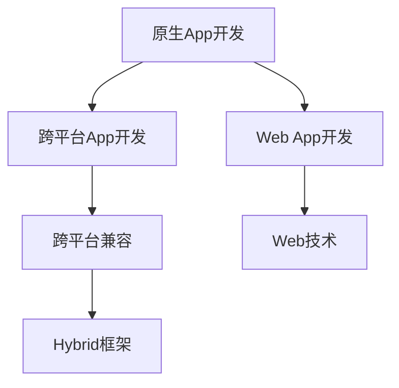

                 

# 移动端全栈开发：原生App与跨平台方案

在当今快速发展的移动互联网时代，移动应用已经成为人们生活中不可或缺的一部分。无论是商业应用、教育平台、社交媒体，还是游戏、健康、娱乐等领域，移动应用都能为用户提供丰富的互动体验和便捷的服务。然而，随着用户对移动应用体验要求的不断提高，以及技术的发展和市场竞争的加剧，开发移动应用变得越来越复杂和困难。为应对这一挑战，全栈开发（Full-stack Development）成为了一种流行且有效的解决方案。本文将全面介绍移动端全栈开发的核心理念、主要技术和实际应用场景，帮助开发者掌握这一新兴开发方法，提高开发效率，降低开发成本。

## 1. 背景介绍

### 1.1 问题由来
随着移动互联网的普及，全球移动应用市场增长迅猛，各大企业纷纷投入巨大资源进行移动应用开发。然而，传统的Web开发和原生开发（Native Development）都有其固有的不足，难以同时满足快速迭代、跨平台兼容、高效开发和优化性能等多重需求。

- **Web开发**：开发周期长、用户体验较差、兼容性问题多。
- **原生开发**：开发成本高、维护难度大、多平台适配复杂。

为了克服这些困难，全栈开发逐渐成为主流趋势。全栈开发利用前端、后端、跨平台等技术，实现统一的开发流程，提升开发效率，降低开发成本，为用户提供更优质的体验。

### 1.2 问题核心关键点
全栈开发的核心在于以下几个方面：

- **统一技术栈**：前端与后端使用相同的技术栈，提升开发效率。
- **跨平台兼容**：支持iOS、Android、Web等多个平台，实现跨平台开发。
- **前端优化**：通过前端框架和技术优化性能，提升用户体验。
- **后端服务**：使用Node.js、Django等后端框架，实现高效的数据处理和业务逻辑。

## 2. 核心概念与联系

### 2.1 核心概念概述

为更好地理解全栈开发，本节将介绍几个密切相关的核心概念：

- **原生App开发**：使用原生的编程语言（如Swift、Kotlin）和框架（如React Native、Flutter），开发运行在各自平台（如iOS、Android）上的移动应用。
- **跨平台App开发**：使用跨平台的开发框架（如React Native、Flutter），开发能够在多个平台（如iOS、Android、Web）上运行的同一份代码的移动应用。
- **Web App开发**：使用Web技术（如HTML、CSS、JavaScript）开发运行在浏览器上的移动应用，通常需要使用Hybrid开发框架（如Ionic、Cordova）来实现跨平台兼容。

这些概念之间的关系可以通过以下Mermaid流程图来展示：



这个流程图展示了一些核心概念之间的关系：

1. 原生App开发和跨平台App开发都可以通过使用特定的开发框架（如React Native、Flutter）来实现跨平台兼容。
2. Web App开发依赖Web技术，通常需要借助Hybrid框架才能实现跨平台兼容性。
3. Web技术和Hybrid框架均可与跨平台App开发技术共存，提供更多样化的开发方式。

## 3. 核心算法原理 & 具体操作步骤
### 3.1 算法原理概述

全栈开发的核心在于实现统一的开发框架和技术栈，以提升开发效率和跨平台兼容性。其核心算法原理主要包括以下几个方面：

- **前端框架**：如React Native、Flutter等，提供跨平台组件和样式，实现统一的UI开发。
- **后端服务**：如Node.js、Django等，实现高效的数据处理和业务逻辑。
- **跨平台适配**：通过Hybrid框架，实现前端代码在多个平台上的兼容。

### 3.2 算法步骤详解

以下是全栈开发的主要操作步骤：

**Step 1: 选择开发框架和技术栈**
- 确定前端使用React Native、Flutter等跨平台框架，或使用Ionic、Cordova等Hybrid框架。
- 确定后端使用Node.js、Django、Spring Boot等技术栈，实现高效的数据处理和业务逻辑。

**Step 2: 设计应用架构**
- 设计前端与后端的通信协议和数据交换格式，确保前后端兼容。
- 设计数据模型和业务逻辑，确定数据库架构和数据迁移方案。
- 设计前端UI和交互流程，选择适合的UI组件库和布局工具。

**Step 3: 开发和测试**
- 使用选定的开发框架和技术栈，开发前端和后端。
- 进行单元测试、集成测试和系统测试，确保代码质量和性能。
- 在iOS、Android、Web等多个平台上进行兼容性测试。

**Step 4: 部署和维护**
- 使用云端部署工具（如AWS、Google Cloud）或本地服务器部署应用。
- 定期进行系统优化和性能调优，处理用户反馈和Bug修复。
- 更新后端服务和数据库，确保数据的完整性和安全性。

### 3.3 算法优缺点

全栈开发具有以下优点：

1. **提升开发效率**：前端和后端使用统一的技术栈，减少了代码切换和重复工作。
2. **降低开发成本**：避免重复开发多个平台的应用，节省了人力和时间成本。
3. **提高用户体验**：使用跨平台框架和组件库，实现统一的UI和用户体验。
4. **增强跨平台兼容性**：实现跨平台开发，适应不同平台的用户需求。

同时，全栈开发也存在一定的缺点：

1. **学习曲线陡峭**：涉及前端、后端和跨平台技术，需要较长的学习周期。
2. **性能问题**：跨平台框架和Hybrid框架可能影响性能，需要优化。
3. **开发复杂性**：多平台兼容和前后端通信增加了代码复杂性。
4. **技术栈限制**：某些技术栈可能不支持某些平台或功能，需要额外调整。

尽管存在这些局限性，但全栈开发仍是大势所趋，可以帮助开发者实现更高的开发效率和更优的用户体验。

### 3.4 算法应用领域

全栈开发在多个领域得到了广泛的应用，包括但不限于以下几个方面：

- **商业应用**：如电商平台、金融App、旅游App等，需要处理大量用户数据和复杂的业务逻辑。
- **教育平台**：如在线课程、学习App等，需要实现丰富的互动和个性化推荐功能。
- **社交媒体**：如微博、微信等，需要支持多种通信方式和即时消息功能。
- **游戏应用**：如手机游戏、在线棋牌等，需要提供流畅的游戏体验和高性能的图形渲染。
- **健康医疗**：如在线问诊、健康管理等，需要实现数据安全和个人隐私保护。

这些应用领域对全栈开发的需求日益增长，推动了全栈开发技术的不断发展和完善。

## 4. 数学模型和公式 & 详细讲解 & 举例说明

### 4.1 数学模型构建

本节将使用数学语言对全栈开发的核心技术进行更加严格的刻画。

假设全栈开发的应用需要支持iOS、Android、Web等多个平台，使用跨平台框架React Native进行开发。前端和后端的通信通过RESTful API实现，后端使用Node.js技术栈。

### 4.2 公式推导过程

以下是全栈开发中常见的数学模型和公式推导：

- **数据模型设计**：定义用户、订单、商品等实体类，设计数据表结构和关联关系。
- **数据迁移方案**：使用数据迁移工具（如Flyway、Liquibase）实现数据从原平台迁移到新平台。
- **接口设计**：定义RESTful API接口，包括路由、请求方法、请求参数和响应数据格式。

### 4.3 案例分析与讲解

以下以一个电商平台的全栈开发案例为例，详细介绍全栈开发的具体实施过程：

**Step 1: 数据模型设计**

- 用户实体类：
```java
class User {
    private String id;
    private String username;
    private String email;
    // 省略getter和setter方法
}
```

- 订单实体类：
```java
class Order {
    private String id;
    private User user;
    private List<Item> items;
    // 省略getter和setter方法
}
```

- 商品实体类：
```java
class Item {
    private String id;
    private String name;
    private double price;
    // 省略getter和setter方法
}
```

**Step 2: 数据迁移方案**

使用Liquibase实现数据迁移：
```java
<liberty-appender name="core-mysql" class=" liquibase.database.core.mysql.MySQLDatabase">
   <username>root</username>
   <password>password</password>
   <url>jdbc:mysql://localhost:3306/mydb</url>
</liberty-appender>
```

**Step 3: 接口设计**

定义RESTful API接口，使用Spring Boot框架实现：
```java
@RestController
@RequestMapping("/api")
public class OrderController {
    @Autowired
    private OrderService orderService;
    
    @GetMapping("/orders")
    public List<Order> getOrders() {
        return orderService.getAllOrders();
    }
    
    @PostMapping("/orders")
    public Order createOrder(@RequestBody Order order) {
        return orderService.createOrder(order);
    }
}
```

## 5. 项目实践：代码实例和详细解释说明
### 5.1 开发环境搭建

在进行全栈开发实践前，我们需要准备好开发环境。以下是使用React Native和Node.js进行全栈开发的环境配置流程：

1. 安装Node.js：从官网下载并安装Node.js，作为全栈开发的基础运行环境。

2. 安装React Native CLI：
```bash
npm install -g react-native-cli
```

3. 配置项目目录：
```bash
npx react-native init my-project
```

4. 配置后端环境：
```bash
npm install express mongoose --save
node index.js
```

完成上述步骤后，即可在项目目录中开始全栈开发实践。

### 5.2 源代码详细实现

这里我们以一个电商平台的商品展示页面为例，给出使用React Native和Node.js进行全栈开发的代码实现。

**前端代码**：
```javascript
import React, { useState, useEffect } from 'react';
import { View, Text, FlatList, StyleSheet } from 'react-native';

const HomeScreen = () => {
  const [items, setItems] = useState([]);
  const [isLoading, setIsLoading] = useState(true);

  useEffect(() => {
    fetch('http://localhost:3000/api/items')
      .then(response => response.json())
      .then(data => {
        setItems(data.items);
        setIsLoading(false);
      })
      .catch(error => console.error(error));
  }, []);

  const renderItem = ({ item }) => (
    <View style={styles.item}>
      <Text style={styles.title}>{item.name}</Text>
      <Text style={styles.price}>{item.price}</Text>
    </View>
  );

  return (
    <View style={styles.container}>
      {isLoading ? (
        <Text>Loading...</Text>
      ) : (
        <FlatList
          data={items}
          renderItem={renderItem}
          keyExtractor={item => item.id}
        />
      )}
    </View>
  );
};

const styles = StyleSheet.create({
  container: {
    flex: 1,
    alignItems: 'center',
    justifyContent: 'center',
  },
  item: {
    backgroundColor: '#f9c2ff',
    padding: 20,
    marginVertical: 8,
    marginHorizontal: 16,
  },
  title: {
    fontSize: 24,
    fontWeight: 'bold',
  },
  price: {
    fontSize: 18,
  },
});

export default HomeScreen;
```

**后端代码**：
```javascript
const express = require('express');
const mongoose = require('mongoose');
const app = express();

// 定义数据模型
const Item = mongoose.model('Item', new mongoose.Schema({
  name: String,
  price: Number,
}));

// 连接数据库
mongoose.connect('mongodb://localhost:27017/mydb', { useNewUrlParser: true });

// 定义路由
app.get('/api/items', async (req, res) => {
  const items = await Item.find();
  res.json({ items });
});

// 启动服务器
app.listen(3000, () => {
  console.log('Server started on port 3000');
});
```

**运行结果展示**：
```bash
$ react-native run-android
[...]
```

**代码解读与分析**：

前端代码使用React Native框架，定义了商品列表的展示页面。通过fetch API向后端发起请求，获取商品数据，并使用FlatList组件显示在页面上。

后端代码使用Express框架，定义了商品列表的API接口，使用mongoose连接MongoDB数据库，获取商品数据并返回JSON格式的结果。

## 6. 实际应用场景

### 6.1 电商应用开发

电商应用是典型的全栈开发应用场景，需要实现用户注册、登录、购物车、订单管理等功能。使用全栈开发，前端和后端使用统一的技术栈，可以大幅提升开发效率和性能，同时降低开发和维护成本。

**前端**：使用React Native或Flutter框架，实现商品浏览、购物车、结算、订单管理等页面。
**后端**：使用Node.js、Django、Spring Boot等技术栈，实现用户认证、商品管理、订单处理、支付处理等核心功能。
**跨平台兼容**：使用Ionic或React Native等框架，实现跨平台兼容。

### 6.2 在线教育平台开发

在线教育平台需要支持视频直播、课程录制、互动讨论、作业批改等功能。使用全栈开发，可以实现前端和后端的无缝对接，提升用户体验和系统稳定性。

**前端**：使用React Native或Flutter框架，实现直播、视频、互动等页面。
**后端**：使用Node.js、Django、Spring Boot等技术栈，实现课程管理、用户认证、作业批改等核心功能。
**跨平台兼容**：使用Ionic或React Native等框架，实现跨平台兼容。

### 6.3 社交媒体应用开发

社交媒体应用需要支持好友管理、消息聊天、动态更新、推荐系统等功能。使用全栈开发，可以实现前端和后端的统一管理，提升开发效率和用户体验。

**前端**：使用React Native或Flutter框架，实现消息聊天、动态更新、推荐系统等页面。
**后端**：使用Node.js、Django、Spring Boot等技术栈，实现好友管理、消息处理、推荐系统等核心功能。
**跨平台兼容**：使用React Native或Ionic等框架，实现跨平台兼容。

## 7. 工具和资源推荐

### 7.1 学习资源推荐

为帮助开发者系统掌握全栈开发的技术基础和实践技巧，这里推荐一些优质的学习资源：

1. 《JavaScript高级程序设计》：详细介绍了JavaScript语言的核心概念和高级特性，是前端开发的重要参考书籍。
2. 《Node.js设计模式》：介绍了Node.js框架常用的设计模式和最佳实践，帮助开发者提升后端开发效率。
3. React Native官方文档：提供了完整的React Native框架开发指南和API参考，是前端开发的重要资源。
4. Flask官方文档：提供了完整的Flask框架开发指南和API参考，帮助开发者提升后端开发效率。
5. 《全栈开发实战》：实战案例驱动，涵盖前端、后端、跨平台开发等多方面内容，适合初、中级开发者学习。

通过对这些资源的学习实践，相信你一定能够快速掌握全栈开发的技术精髓，并用于解决实际的开发问题。

### 7.2 开发工具推荐

高效的开发离不开优秀的工具支持。以下是几款用于全栈开发开发的常用工具：

1. Visual Studio Code：支持多种编程语言，提供丰富的插件和扩展，是开发者的首选IDE。
2. Git：版本控制工具，方便开发者协作和版本管理。
3. Postman：API测试工具，方便开发者测试API接口。
4. Docker：容器化技术，方便开发者构建和部署应用。
5. Swagger：API文档生成工具，方便开发者快速生成API文档。

合理利用这些工具，可以显著提升全栈开发任务的开发效率，加快创新迭代的步伐。

### 7.3 相关论文推荐

全栈开发技术的发展源于学界的持续研究。以下是几篇奠基性的相关论文，推荐阅读：

1. Full-Stack JavaScript Development Patterns：介绍了全栈JavaScript开发的模式和实践，帮助开发者提升开发效率。
2. React Native Development Best Practices：提供了React Native开发的最佳实践，帮助开发者构建高质量的全栈应用。
3. Node.js Architectures and Design Patterns：介绍了Node.js框架常用的架构和设计模式，帮助开发者提升后端开发效率。
4. Flutter Development Best Practices：提供了Flutter开发的最佳实践，帮助开发者构建高质量的全栈应用。
5. Full-Stack Web Development with Node.js and React：介绍了Node.js和React结合的全栈开发方法，帮助开发者提升开发效率和系统性能。

这些论文代表了大全栈开发技术的发展脉络。通过学习这些前沿成果，可以帮助研究者把握学科前进方向，激发更多的创新灵感。

## 8. 总结：未来发展趋势与挑战

### 8.1 研究成果总结

全栈开发技术在移动应用开发中逐渐成为主流，帮助开发者提升开发效率和用户体验，降低开发和维护成本。随着全栈开发技术的不断成熟，其应用范围将更加广泛，推动移动应用开发进入新的发展阶段。

### 8.2 未来发展趋势

展望未来，全栈开发技术将呈现以下几个发展趋势：

1. **前端框架和后端框架的进一步融合**：前端和后端框架将进一步融合，提升开发效率和系统性能。
2. **跨平台技术的进一步优化**：跨平台框架将进一步优化，提升性能和用户体验。
3. **移动应用功能的不断扩展**：全栈开发技术将支持更多的移动应用功能，提升用户体验和系统性能。
4. **新兴技术的不断引入**：新兴技术（如AI、AR、VR等）将引入全栈开发中，提升应用功能和用户体验。
5. **开发工具和流程的进一步优化**：开发工具和流程将进一步优化，提升开发效率和系统性能。

### 8.3 面临的挑战

尽管全栈开发技术已经取得了显著成果，但在迈向更加智能化、普适化应用的过程中，它仍面临诸多挑战：

1. **学习曲线陡峭**：全栈开发涉及前端、后端和跨平台技术，需要较长的学习周期。
2. **性能问题**：跨平台框架和Hybrid框架可能影响性能，需要优化。
3. **开发复杂性**：多平台兼容和前后端通信增加了代码复杂性。
4. **技术栈限制**：某些技术栈可能不支持某些平台或功能，需要额外调整。

尽管存在这些挑战，全栈开发仍是大势所趋，可以帮助开发者实现更高的开发效率和更优的用户体验。

### 8.4 研究展望

面对全栈开发面临的挑战，未来的研究需要在以下几个方面寻求新的突破：

1. **前端和后端框架的进一步融合**：探索更好的前端和后端框架结合方式，提升开发效率和系统性能。
2. **跨平台技术的进一步优化**：优化跨平台框架，提升性能和用户体验。
3. **新兴技术的引入**：引入新兴技术（如AI、AR、VR等），提升应用功能和用户体验。
4. **开发工具和流程的优化**：优化开发工具和流程，提升开发效率和系统性能。
5. **开发效率和用户体验的进一步提升**：提升开发效率和用户体验，推动全栈开发技术的不断进步。

这些研究方向的探索，必将引领全栈开发技术迈向更高的台阶，为构建高效、稳定的移动应用系统铺平道路。

## 9. 附录：常见问题与解答

**Q1：全栈开发是否适用于所有类型的应用开发？**

A: 全栈开发适用于需要实现复杂功能、高性能、多平台兼容的移动应用开发。然而，对于某些特殊场景（如高性能游戏、复杂金融系统等），可能需要使用原生开发或针对特定平台的技术栈。

**Q2：使用全栈开发时，前端和后端应如何选择技术栈？**

A: 前端和后端应根据应用需求和技术栈的特性进行选择。如前端使用React Native，后端使用Node.js，可以实现跨平台兼容和高效的数据处理。如果应用性能要求高，可以考虑使用Flutter等框架，但后端开发复杂性增加。

**Q3：全栈开发中的跨平台兼容是如何实现的？**

A: 全栈开发中的跨平台兼容主要依赖前端框架和跨平台组件库。如React Native、Flutter等框架，提供跨平台组件和样式，实现统一的UI开发。使用Ionic、Cordova等Hybrid框架，实现前端代码在多个平台上的兼容。

**Q4：全栈开发中的前端和后端通信是如何实现的？**

A: 全栈开发中的前端和后端通信主要依赖API接口。使用RESTful API接口，实现前后端的数据交换。使用Spring Boot、Flask等后端框架，实现高效的数据处理和业务逻辑。

**Q5：全栈开发中的性能优化有哪些方法？**

A: 全栈开发中的性能优化主要依赖前端框架和后端优化技术。如使用React Native、Flutter等高性能框架，优化页面渲染和组件渲染。使用Node.js、Django等高效的后端框架，优化数据处理和业务逻辑。使用Docker、Kubernetes等容器化技术，优化应用的部署和扩展。

以上是全栈开发的核心理念、主要技术和实际应用场景的详细介绍，希望能对广大开发者有所帮助。掌握全栈开发技术，将大幅提升开发效率和用户体验，推动移动应用开发进入新的发展阶段。

