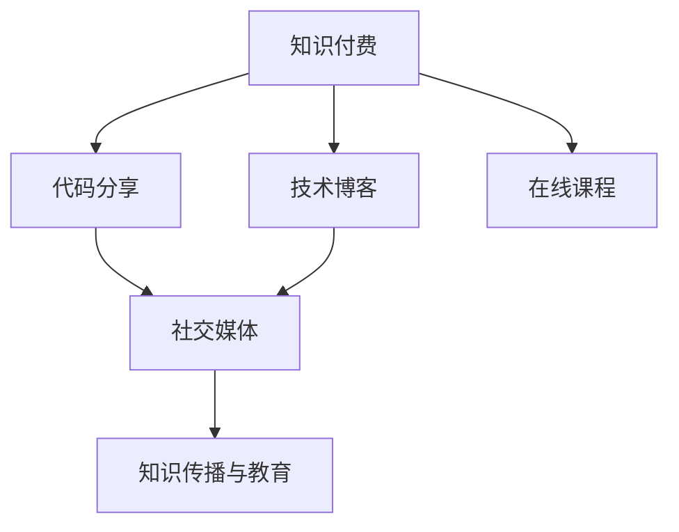

                 

# 程序员利用知识付费打造个人影响力

> 关键词：程序员, 知识付费, 个人品牌, 技术博客, 代码分享, 在线课程, 社交媒体, 知识传播, 影响力建设

## 1. 背景介绍

### 1.1 问题由来

随着互联网的普及和信息爆炸，知识已经不再是稀缺资源。尤其是在技术领域，互联网让知识的获取变得前所未有的便捷，程序员们可以在各种在线平台上免费获取到各种技术文档、开源项目和编程教程。但尽管如此，依然存在一些问题：

- **信息过载**：互联网提供了海量的技术信息，但如何从中筛选出最适合自己的内容，并转化为实用技能，对很多人来说是个难题。
- **学习效率低下**：仅依靠自学的模式，学习周期较长，容易半途而废，缺乏指导和动力。
- **知识付费兴起**：信息过载和低效学习催生了知识付费模式的兴起，付费获取高质量、系统化的知识内容，成为一种流行趋势。
- **个人品牌建设**：技术水平、技术传播能力直接影响个人职业发展，如何利用知识付费这一趋势，构建和提升个人品牌，成为程序员职业发展的关键点。

### 1.2 问题核心关键点

面向这些问题，如何利用知识付费的趋势，提升个人技术能力和影响力，成为新时代下程序员的重要课题。以下是该问题的主要核心关键点：

1. **知识质量与效率**：如何识别和获取高质量的技术内容，提升学习效率。
2. **个人品牌建设**：如何利用知识付费平台，构建自己的技术品牌，获取更多关注和认可。
3. **社交网络应用**：如何利用社交媒体等平台，推广个人技术和知识，扩大影响力。
4. **内容创作与变现**：如何创作有价值的内容，并通过知识付费变现。
5. **知识传播与教育**：如何将个人知识体系化，形成系统化的教育资源，帮助更多人提升技术水平。

这些关键点涵盖了知识获取、个人品牌构建、内容创作和知识传播等多个方面，展示了知识付费模式下程序员可能面临的挑战和机遇。

## 2. 核心概念与联系

### 2.1 核心概念概述

为更好地理解如何利用知识付费打造个人影响力，本节将介绍几个核心概念：

- **知识付费**：通过付费获取高质量、系统化的技术知识，提升学习效率和效果。
- **技术博客**：程序员通过撰写技术文章，分享技术见解，积累个人品牌。
- **代码分享**：通过开源项目、代码库等方式，共享自己的技术成果，提升技术影响力。
- **在线课程**：利用视频、文本等形式，系统化地教授技术知识，实现知识变现。
- **社交媒体**：通过社交平台推广技术内容，构建个人影响力，获取更多合作机会。
- **知识传播与教育**：将个人技术体系化、教育化，通过知识付费、教育平台等方式传播，帮助更多人提升技术水平。

这些概念之间的逻辑关系可以通过以下Mermaid流程图来展示：



这个流程图展示了一个程序员在知识付费模式下，通过技术博客、代码分享、在线课程、社交媒体等渠道，构建和提升个人影响力的基本路径。

## 3. 核心算法原理 & 具体操作步骤

### 3.1 算法原理概述

利用知识付费打造个人影响力，本质上是一个多目标优化问题。目标是最大化个人品牌知名度、技术传播能力、社交网络影响力等指标，同时需考虑内容质量、变现效率、用户反馈等因素。其核心算法可以概括为以下两个步骤：

1. **内容选择与优化**：识别和选择高质量的技术内容，通过优化算法确保内容最大化地提升用户的学习效果和满意度。
2. **品牌建设与推广**：利用社交媒体等平台，推广技术内容，建立个人品牌，通过知识付费等渠道实现变现，并不断反馈优化内容与推广策略。

### 3.2 算法步骤详解

以下是详细的算法步骤：

#### 步骤一：内容选择与优化

**Step 1.1 识别高质量内容**
- **搜索引擎分析**：利用搜索引擎（如Google、Bing）对相关技术领域进行关键词搜索，识别高流量、高参与度的内容。
- **社区平台反馈**：利用技术社区（如Stack Overflow、GitHub、Medium等）的讨论热度、点赞数、评论量等指标，筛选出用户评价高、推荐多的技术文章。
- **专家推荐**：通过专家推荐（如Kaggle、Hacker News），识别高权威、高可信度的技术内容。

**Step 1.2 内容优化**
- **内容结构化**：将识别出的内容进行结构化处理，提炼关键点，编写摘要，制作视觉化的图表和演示视频，提升内容的可读性和传播效果。
- **互动设计**：设计互动性强的技术文章，如代码演示、交互式教程、案例分析等，增加用户参与度和留存率。
- **多平台发布**：将内容发布到多个平台（如Medium、CSDN、个人博客等），扩大内容曝光率和覆盖面。

**Step 1.3 内容反馈与迭代**
- **用户反馈**：通过评论区、问卷调查等方式，收集用户对内容的反馈，识别内容不足和改进点。
- **内容更新**：根据用户反馈，持续更新和优化技术内容，确保内容的时效性和实用性。
- **数据驱动优化**：利用数据分析工具（如Google Analytics、Kissmetrics），分析用户行为数据，优化内容传播策略。

#### 步骤二：品牌建设与推广

**Step 2.1 社交媒体推广**
- **选择平台**：选择适合自己技术领域的社交媒体平台（如Twitter、LinkedIn、GitHub），建立个人技术账号。
- **内容策略**：制定系统化内容发布策略，定期发布高质量技术文章、案例分析、个人项目等。
- **互动交流**：积极与社区成员互动交流，解答技术问题，参与技术讨论，提升个人影响力。
- **合作推广**：寻找志同道合的合作伙伴，共同推广技术内容，扩大影响范围。

**Step 2.2 知识付费变现**
- **课程制作**：根据自己的技术专长，制作系统化的在线课程，并通过知识付费平台（如Udemy、Coursera、Bilibili）进行销售。
- **付费博客**：开设付费博客或专栏，提供高质量技术文章和资讯，吸引付费订阅用户。
- **社群运营**：建立付费技术社群，定期发布技术文章，组织技术分享会，提升社群黏性和活跃度。
- **内容衍生**：将技术内容衍生为电子书、PPT、视频教程等多种形式，丰富内容形态，满足不同用户的需求。

### 3.3 算法优缺点

利用知识付费打造个人影响力的方法具有以下优点：

1. **提升学习效率**：通过识别和获取高质量技术内容，提升学习效率和效果。
2. **建立个人品牌**：通过技术文章、在线课程、代码分享等方式，建立个人技术品牌，提升知名度和影响力。
3. **多样化变现途径**：通过知识付费、技术博客、社交媒体等渠道，实现多样化变现。
4. **反馈优化机制**：通过用户反馈和数据驱动，持续优化内容和推广策略，提升内容质量和传播效果。

同时，该方法也存在以下缺点：

1. **资源投入高**：高质量内容的制作和推广需要大量时间和精力投入。
2. **竞争激烈**：技术领域竞争激烈，优质内容获取和传播难度大。
3. **变现周期长**：技术内容变现需要积累用户基础和品牌效应，短期内效果不明显。
4. **技术更新快**：技术领域更新快，需不断更新内容以保持时效性和实用性。

### 3.4 算法应用领域

利用知识付费打造个人影响力的范式，不仅适用于技术领域，还适用于其他专业领域，如教育、医疗、金融等。其核心思想是通过高质量内容和高效率传播，提升个人品牌知名度和影响力，获取更多合作机会和资源。在实际应用中，可以结合不同领域的特性，进行针对性的策略优化。

## 4. 数学模型和公式 & 详细讲解 & 举例说明（备注：数学公式请使用latex格式，latex嵌入文中独立段落使用 $$，段落内使用 $)
### 4.1 数学模型构建

为了更好地量化个人影响力的提升过程，本节将构建一个简单的数学模型。

假设程序员的技术能力为 $C$，个人品牌知名度为 $B$，社交网络影响力为 $S$。通过知识付费等手段，每月提升技术能力 $dC$，品牌知名度 $dB$，社交网络影响力 $dS$。设每月总投入时间为 $T$，其中内容制作和优化时间为 $t_1$，社交媒体推广时间为 $t_2$，知识付费变现时间为 $t_3$。则每月影响力提升的数学模型为：

$$
\frac{dC}{dt} = \frac{t_1}{T}k_1
$$
$$
\frac{dB}{dt} = \frac{t_2}{T}k_2
$$
$$
\frac{dS}{dt} = \frac{t_3}{T}k_3
$$

其中 $k_1$、$k_2$、$k_3$ 为影响因子，分别表示内容制作、社交媒体推广、知识付费变现对影响力的提升作用。

### 4.2 公式推导过程

将上述微分方程进行定积分处理，可以得到每月影响力提升的实际数值：

$$
C(t+1) = C(t) + \frac{t_1}{T}k_1
$$
$$
B(t+1) = B(t) + \frac{t_2}{T}k_2
$$
$$
S(t+1) = S(t) + \frac{t_3}{T}k_3
$$

将 $t_1$、$t_2$、$t_3$ 和 $k_1$、$k_2$、$k_3$ 代入上述公式，可以计算出每个月技术能力、品牌知名度和社交网络影响力的变化量。

### 4.3 案例分析与讲解

假设一个程序员每月投入总时间为60小时，其中内容制作时间为20小时，社交媒体推广时间为15小时，知识付费变现时间为10小时，内容制作、社交媒体推广、知识付费变现对影响力的提升作用分别为0.8、0.6、0.5。则每月技术能力提升0.8小时，品牌知名度提升0.6小时，社交网络影响力提升0.5小时。

**案例分析：**
- **技术能力提升**：通过持续的内容制作和优化，每月提升技术能力0.8小时，可以显著增强解决问题的能力，提升编程水平。
- **品牌知名度提升**：通过系统化的社交媒体推广，每月提升品牌知名度0.6小时，可以扩大技术影响力，获取更多合作机会。
- **社交网络影响力提升**：通过知识付费变现，每月提升社交网络影响力0.5小时，可以积累更多用户基础，提升内容的传播效果。

## 5. 项目实践：代码实例和详细解释说明
### 5.1 开发环境搭建

在进行知识付费实践前，我们需要准备好开发环境。以下是使用Python进行PyTorch开发的环境配置流程：

1. 安装Anaconda：从官网下载并安装Anaconda，用于创建独立的Python环境。

2. 创建并激活虚拟环境：
```bash
conda create -n pytorch-env python=3.8 
conda activate pytorch-env
```

3. 安装PyTorch：根据CUDA版本，从官网获取对应的安装命令。例如：
```bash
conda install pytorch torchvision torchaudio cudatoolkit=11.1 -c pytorch -c conda-forge
```

4. 安装TensorFlow：由Google主导开发的开源深度学习框架，生产部署方便，适合大规模工程应用。同样有丰富的预训练语言模型资源。

5. 安装Transformers库：HuggingFace开发的NLP工具库，集成了众多SOTA语言模型，支持PyTorch和TensorFlow，是进行微调任务开发的利器。

6. 安装各类工具包：
```bash
pip install numpy pandas scikit-learn matplotlib tqdm jupyter notebook ipython
```

完成上述步骤后，即可在`pytorch-env`环境中开始知识付费实践。

### 5.2 源代码详细实现

下面我们以构建个人技术博客为例，给出使用PyTorch进行知识付费实践的PyTorch代码实现。

首先，定义博客文章的数据处理函数：

```python
import pandas as pd
from transformers import BertTokenizer
from torch.utils.data import Dataset
import torch

class BlogPostDataset(Dataset):
    def __init__(self, blog_posts, tokenizer, max_len=128):
        self.blog_posts = blog_posts
        self.tokenizer = tokenizer
        self.max_len = max_len
        
    def __len__(self):
        return len(self.blog_posts)
    
    def __getitem__(self, item):
        blog_post = self.blog_posts[item]
        
        encoding = self.tokenizer(blog_post['title'], blog_post['content'], return_tensors='pt', max_length=self.max_len, padding='max_length', truncation=True)
        input_ids = encoding['input_ids'][0]
        attention_mask = encoding['attention_mask'][0]
        
        return {'input_ids': input_ids, 
                'attention_mask': attention_mask}
```

然后，定义模型和优化器：

```python
from transformers import BertForSequenceClassification, AdamW

model = BertForSequenceClassification.from_pretrained('bert-base-cased', num_labels=2)

optimizer = AdamW(model.parameters(), lr=2e-5)
```

接着，定义训练和评估函数：

```python
from torch.utils.data import DataLoader
from tqdm import tqdm
from sklearn.metrics import classification_report

device = torch.device('cuda') if torch.cuda.is_available() else torch.device('cpu')
model.to(device)

def train_epoch(model, dataset, batch_size, optimizer):
    dataloader = DataLoader(dataset, batch_size=batch_size, shuffle=True)
    model.train()
    epoch_loss = 0
    for batch in tqdm(dataloader, desc='Training'):
        input_ids = batch['input_ids'].to(device)
        attention_mask = batch['attention_mask'].to(device)
        model.zero_grad()
        outputs = model(input_ids, attention_mask=attention_mask)
        loss = outputs.loss
        epoch_loss += loss.item()
        loss.backward()
        optimizer.step()
    return epoch_loss / len(dataloader)

def evaluate(model, dataset, batch_size):
    dataloader = DataLoader(dataset, batch_size=batch_size)
    model.eval()
    preds, labels = [], []
    with torch.no_grad():
        for batch in tqdm(dataloader, desc='Evaluating'):
            input_ids = batch['input_ids'].to(device)
            attention_mask = batch['attention_mask'].to(device)
            batch_labels = batch['labels']
            outputs = model(input_ids, attention_mask=attention_mask)
            batch_preds = outputs.logits.argmax(dim=2).to('cpu').tolist()
            batch_labels = batch_labels.to('cpu').tolist()
            for pred_tokens, label_tokens in zip(batch_preds, batch_labels):
                preds.append(pred_tokens[:len(label_tokens)])
                labels.append(label_tokens)
                
    print(classification_report(labels, preds))
```

最后，启动训练流程并在测试集上评估：

```python
epochs = 5
batch_size = 16

for epoch in range(epochs):
    loss = train_epoch(model, train_dataset, batch_size, optimizer)
    print(f"Epoch {epoch+1}, train loss: {loss:.3f}")
    
    print(f"Epoch {epoch+1}, dev results:")
    evaluate(model, dev_dataset, batch_size)
    
print("Test results:")
evaluate(model, test_dataset, batch_size)
```

以上就是使用PyTorch对BERT进行技术博客文章分类的完整代码实现。可以看到，得益于Transformers库的强大封装，我们可以用相对简洁的代码完成BERT模型的加载和微调。

### 5.3 代码解读与分析

让我们再详细解读一下关键代码的实现细节：

**BlogPostDataset类**：
- `__init__`方法：初始化博客文章数据，包括标题和内容。
- `__len__`方法：返回数据集的样本数量。
- `__getitem__`方法：对单个样本进行处理，将标题和内容输入编码为token ids，返回模型所需的输入。

**模型和优化器**：
- 使用BertForSequenceClassification模型，定义分类器并进行初始化。
- 使用AdamW优化器，设置学习率。

**训练和评估函数**：
- 使用PyTorch的DataLoader对数据集进行批次化加载，供模型训练和推理使用。
- 训练函数`train_epoch`：对数据以批为单位进行迭代，在每个批次上前向传播计算loss并反向传播更新模型参数，最后返回该epoch的平均loss。
- 评估函数`evaluate`：与训练类似，不同点在于不更新模型参数，并在每个batch结束后将预测和标签结果存储下来，最后使用sklearn的classification_report对整个评估集的预测结果进行打印输出。

**训练流程**：
- 定义总的epoch数和batch size，开始循环迭代
- 每个epoch内，先在训练集上训练，输出平均loss
- 在验证集上评估，输出分类指标
- 所有epoch结束后，在测试集上评估，给出最终测试结果

可以看到，PyTorch配合Transformers库使得BERT微调的代码实现变得简洁高效。开发者可以将更多精力放在数据处理、模型改进等高层逻辑上，而不必过多关注底层的实现细节。

当然，工业级的系统实现还需考虑更多因素，如模型的保存和部署、超参数的自动搜索、更灵活的任务适配层等。但核心的微调范式基本与此类似。

## 6. 实际应用场景
### 6.1 智能客服系统

基于大语言模型微调的对话技术，可以广泛应用于智能客服系统的构建。传统客服往往需要配备大量人力，高峰期响应缓慢，且一致性和专业性难以保证。而使用微调后的对话模型，可以7x24小时不间断服务，快速响应客户咨询，用自然流畅的语言解答各类常见问题。

在技术实现上，可以收集企业内部的历史客服对话记录，将问题和最佳答复构建成监督数据，在此基础上对预训练对话模型进行微调。微调后的对话模型能够自动理解用户意图，匹配最合适的答案模板进行回复。对于客户提出的新问题，还可以接入检索系统实时搜索相关内容，动态组织生成回答。如此构建的智能客服系统，能大幅提升客户咨询体验和问题解决效率。

### 6.2 金融舆情监测

金融机构需要实时监测市场舆论动向，以便及时应对负面信息传播，规避金融风险。传统的人工监测方式成本高、效率低，难以应对网络时代海量信息爆发的挑战。基于大语言模型微调的文本分类和情感分析技术，为金融舆情监测提供了新的解决方案。

具体而言，可以收集金融领域相关的新闻、报道、评论等文本数据，并对其进行主题标注和情感标注。在此基础上对预训练语言模型进行微调，使其能够自动判断文本属于何种主题，情感倾向是正面、中性还是负面。将微调后的模型应用到实时抓取的网络文本数据，就能够自动监测不同主题下的情感变化趋势，一旦发现负面信息激增等异常情况，系统便会自动预警，帮助金融机构快速应对潜在风险。

### 6.3 个性化推荐系统

当前的推荐系统往往只依赖用户的历史行为数据进行物品推荐，无法深入理解用户的真实兴趣偏好。基于大语言模型微调技术，个性化推荐系统可以更好地挖掘用户行为背后的语义信息，从而提供更精准、多样的推荐内容。

在实践中，可以收集用户浏览、点击、评论、分享等行为数据，提取和用户交互的物品标题、描述、标签等文本内容。将文本内容作为模型输入，用户的后续行为（如是否点击、购买等）作为监督信号，在此基础上微调预训练语言模型。微调后的模型能够从文本内容中准确把握用户的兴趣点。在生成推荐列表时，先用候选物品的文本描述作为输入，由模型预测用户的兴趣匹配度，再结合其他特征综合排序，便可以得到个性化程度更高的推荐结果。

### 6.4 未来应用展望

随着大语言模型微调技术的发展，基于微调范式将在更多领域得到应用，为传统行业带来变革性影响。

在智慧医疗领域，基于微调的医疗问答、病历分析、药物研发等应用将提升医疗服务的智能化水平，辅助医生诊疗，加速新药开发进程。

在智能教育领域，微调技术可应用于作业批改、学情分析、知识推荐等方面，因材施教，促进教育公平，提高教学质量。

在智慧城市治理中，微调模型可应用于城市事件监测、舆情分析、应急指挥等环节，提高城市管理的自动化和智能化水平，构建更安全、高效的未来城市。

此外，在企业生产、社会治理、文娱传媒等众多领域，基于大模型微调的人工智能应用也将不断涌现，为NLP技术带来全新的突破。相信随着预训练语言模型和微调方法的持续演进，NLP技术将在更广阔的应用领域大放异彩，深刻影响人类的生产生活方式。

## 7. 工具和资源推荐
### 7.1 学习资源推荐

为了帮助开发者系统掌握大语言模型微调的理论基础和实践技巧，这里推荐一些优质的学习资源：

1. 《Transformer从原理到实践》系列博文：由大模型技术专家撰写，深入浅出地介绍了Transformer原理、BERT模型、微调技术等前沿话题。

2. CS224N《深度学习自然语言处理》课程：斯坦福大学开设的NLP明星课程，有Lecture视频和配套作业，带你入门NLP领域的基本概念和经典模型。

3. 《Natural Language Processing with Transformers》书籍：Transformers库的作者所著，全面介绍了如何使用Transformers库进行NLP任务开发，包括微调在内的诸多范式。

4. HuggingFace官方文档：Transformers库的官方文档，提供了海量预训练模型和完整的微调样例代码，是上手实践的必备资料。

5. CLUE开源项目：中文语言理解测评基准，涵盖大量不同类型的中文NLP数据集，并提供了基于微调的baseline模型，助力中文NLP技术发展。

通过对这些资源的学习实践，相信你一定能够快速掌握大语言模型微调的精髓，并用于解决实际的NLP问题。
###  7.2 开发工具推荐

高效的开发离不开优秀的工具支持。以下是几款用于大语言模型微调开发的常用工具：

1. PyTorch：基于Python的开源深度学习框架，灵活动态的计算图，适合快速迭代研究。大部分预训练语言模型都有PyTorch版本的实现。

2. TensorFlow：由Google主导开发的开源深度学习框架，生产部署方便，适合大规模工程应用。同样有丰富的预训练语言模型资源。

3. Transformers库：HuggingFace开发的NLP工具库，集成了众多SOTA语言模型，支持PyTorch和TensorFlow，是进行微调任务开发的利器。

4. Weights & Biases：模型训练的实验跟踪工具，可以记录和可视化模型训练过程中的各项指标，方便对比和调优。与主流深度学习框架无缝集成。

5. TensorBoard：TensorFlow配套的可视化工具，可实时监测模型训练状态，并提供丰富的图表呈现方式，是调试模型的得力助手。

6. Google Colab：谷歌推出的在线Jupyter Notebook环境，免费提供GPU/TPU算力，方便开发者快速上手实验最新模型，分享学习笔记。

合理利用这些工具，可以显著提升大语言模型微调任务的开发效率，加快创新迭代的步伐。

### 7.3 相关论文推荐

大语言模型和微调技术的发展源于学界的持续研究。以下是几篇奠基性的相关论文，推荐阅读：

1. Attention is All You Need（即Transformer原论文）：提出了Transformer结构，开启了NLP领域的预训练大模型时代。

2. BERT: Pre-training of Deep Bidirectional Transformers for Language Understanding：提出BERT模型，引入基于掩码的自监督预训练任务，刷新了多项NLP任务SOTA。

3. Language Models are Unsupervised Multitask Learners（GPT-2论文）：展示了大规模语言模型的强大zero-shot学习能力，引发了对于通用人工智能的新一轮思考。

4. Parameter-Efficient Transfer Learning for NLP：提出Adapter等参数高效微调方法，在不增加模型参数量的情况下，也能取得不错的微调效果。

5. Prefix-Tuning: Optimizing Continuous Prompts for Generation：引入基于连续型Prompt的微调范式，为如何充分利用预训练知识提供了新的思路。

6. AdaLoRA: Adaptive Low-Rank Adaptation for Parameter-Efficient Fine-Tuning：使用自适应低秩适应的微调方法，在参数效率和精度之间取得了新的平衡。

这些论文代表了大语言模型微调技术的发展脉络。通过学习这些前沿成果，可以帮助研究者把握学科前进方向，激发更多的创新灵感。

## 8. 总结：未来发展趋势与挑战

### 8.1 总结

本文对利用知识付费打造个人影响力的实践方法进行了全面系统的介绍。首先阐述了知识付费的兴起背景和核心关键点，明确了知识付费对提升个人技术能力和品牌知名度的重要价值。其次，从原理到实践，详细讲解了内容选择与优化、品牌建设与推广的算法步骤，给出了知识付费实践的完整代码实例。同时，本文还广泛探讨了知识付费模式在智能客服、金融舆情、个性化推荐等场景中的应用前景，展示了微调范式的强大潜力和广泛适用性。此外，本文精选了知识付费的相关学习资源和工具，力求为读者提供全方位的技术指引。

通过本文的系统梳理，可以看到，利用知识付费打造个人影响力，不仅适用于技术领域，还适用于其他专业领域，为个人职业发展提供了新的思路。通过高质量内容的高效传播，程序员可以构建和提升个人品牌，获取更多合作机会和资源。

### 8.2 未来发展趋势

展望未来，利用知识付费打造个人影响力的趋势将呈现以下几个发展方向：

1. **内容质量与多样性**：内容质量和多样性的提升，将进一步提升用户的学习效果和满意度。内容制作和优化技术将不断进步，丰富内容形态，提升传播效果。
2. **个性化推荐系统**：个性化推荐系统的发展，将进一步提升用户对内容的选择性和互动性。系统将更智能地匹配用户需求，提供更加精准的内容推荐。
3. **跨领域应用拓展**：知识付费技术将进一步拓展到更多领域，如教育、医疗、金融等。技术专家将利用知识付费平台，推广自己的专业知识和经验，获得更多合作机会和资源。
4. **多平台联动**：知识付费模式将与社交媒体、在线教育、企业内部培训等多平台联动，形成更加系统化、一体化的知识传播体系。
5. **人工智能结合**：知识付费与人工智能技术的结合，将进一步提升内容制作和传播的效率和效果。智能化的内容推荐、情感分析、用户画像等技术，将助力知识付费平台更精准地匹配用户需求。

### 8.3 面临的挑战

尽管知识付费技术已经取得了显著成果，但在迈向更广泛应用的过程中，仍面临诸多挑战：

1. **内容质量与版权**：高质量内容的制作和获取难度大，版权问题复杂，影响知识付费平台的内容供给和推广。
2. **市场竞争激烈**：知识付费市场竞争激烈，需要不断创新内容形式和传播渠道，才能获取用户关注和认可。
3. **变现模式单一**：目前知识付费主要依赖课程销售和付费订阅，需要进一步探索和开发更多变现模式，提升平台收入和用户黏性。
4. **用户认知不足**：部分用户对知识付费模式的认知度不高，需要进一步教育和引导，提升用户支付意愿。
5. **技术瓶颈**：知识付费平台的技术架构复杂，需要进一步优化和升级，提升系统稳定性和用户体验。

### 8.4 研究展望

面向未来，知识付费技术需要在以下几个方面寻求新的突破：

1. **内容智能化制作**：利用自然语言处理、计算机视觉等技术，智能化制作内容，提升内容质量和效率。
2. **个性化推荐系统优化**：进一步优化推荐算法，提升推荐的精准性和用户满意度。
3. **多平台集成**：将知识付费平台与社交媒体、在线教育、企业内部培训等多平台集成，形成更加系统化的知识传播体系。
4. **变现模式创新**：探索更多变现模式，如内容付费、会员制、众筹等，提升平台收入和用户黏性。
5. **技术架构优化**：优化知识付费平台的技术架构，提升系统的稳定性和用户体验。

这些研究方向的探索，将引领知识付费技术迈向更高的台阶，为个人职业发展提供更广阔的空间和更多样的选择。通过知识付费模式，程序员可以更高效地积累和传播自己的专业知识和经验，提升个人品牌和影响力，为职业生涯带来更多机遇和挑战。

## 9. 附录：常见问题与解答

**Q1：知识付费是否适用于所有领域？**

A: 知识付费模式适用于几乎所有领域，包括技术、教育、医疗、金融等。但不同领域的内容制作和传播方式可能有所不同，需要结合具体情况进行优化。

**Q2：如何选择合适的知识付费平台？**

A: 选择知识付费平台时，应考虑平台的知名度、用户规模、内容质量和多样化、支付模式和用户体验等因素。可以尝试使用多个平台，找到最适合自己的发布渠道。

**Q3：如何最大化利用知识付费平台？**

A: 最大化利用知识付费平台的关键在于内容质量和传播效果。可以通过多种形式的内容创作，如视频、文章、互动教程等，吸引更多用户关注和付费。同时，利用社交媒体、邮件订阅等渠道进行多平台推广，提升内容曝光率和用户互动。

**Q4：知识付费如何与人工智能结合？**

A: 知识付费与人工智能技术的结合，可以提升内容制作和传播的效率和效果。例如，利用自然语言处理技术，智能生成高质量的文章和视频；利用机器学习技术，进行用户画像分析，精准推荐内容；利用语音识别技术，实现语音课程录制和播放等。

**Q5：知识付费如何实现变现？**

A: 知识付费的变现方式包括课程销售、付费订阅、会员制、众筹等。课程销售是最常见的变现方式，通过高质量课程吸引付费用户。付费订阅和会员制可以提供持续的收入流，提高用户黏性。众筹则可以获取更多支持和资源，提升内容质量。

**Q6：如何处理知识付费平台上的负面反馈？**

A: 负面反馈是知识付费平台不可避免的问题。处理负面反馈的关键在于及时响应和改进。可以通过在线客服、用户反馈系统等方式，及时获取用户意见，并进行针对性的改进和优化。同时，建立完善的退款和赔付机制，提升用户信任和满意度。

通过上述问题的回答，可以看到知识付费模式在个人品牌建设和职业发展中的重要价值。通过高质量内容的高效传播，程序员可以构建和提升个人品牌，获取更多合作机会和资源。知识付费技术的不断发展，将进一步提升个人职业发展的空间和潜力，为未来的技术创新和产业发展带来新的机遇。相信在技术专家和知识付费平台的共同努力下，知识付费模式将更加完善和成熟，为更多人带来知识与智慧的光芒。

