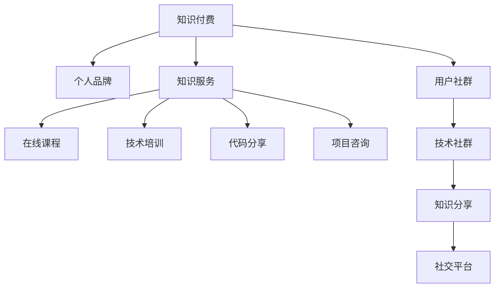

                 

# 程序员利用知识付费打造个人影响力的方法

## 1. 背景介绍

在信息技术飞速发展的今天，程序员已经成为了科技创新的主力军，他们在软件开发、系统架构、人工智能等领域都有着不可替代的作用。然而，对于大部分程序员来说，技术能力并不能直接转换为经济收入和社会地位。如何打破这种局面，实现个人影响力的最大化，成为了很多程序员面临的重要课题。

### 1.1 问题由来

程序员在职业生涯早期，往往通过薪资增长、职位晋升等方式来提升经济收入。但随着技术发展和职位晋升瓶颈的显现，单靠这些传统方式已经难以满足高层次的需求。这时候，利用知识付费成为一种新的思路。通过将自己的知识和经验变现，不仅能够提升个人收入，还能扩大社会影响力，推动技术传播和应用。

### 1.2 问题核心关键点

知识付费的本质是将知识或经验转化为经济收益的过程。程序员通过提供有价值的知识服务，如技术培训、代码分享、项目咨询等，来获取收入。然而，这其中涉及到知识内容的挖掘、包装、销售和维护等多个环节，每一个环节都需要精心设计，才能最大化利用知识付费的力量。

## 2. 核心概念与联系

### 2.1 核心概念概述

为了更好地理解程序员如何利用知识付费打造个人影响力，本节将介绍几个密切相关的核心概念：

- 知识付费：通过提供有价值的知识服务，将知识或经验转化为经济收入的过程。
- 个人品牌：程序员通过技术输出和社交活动建立起来的专业形象和市场认可度。
- 知识服务：包括在线课程、技术培训、代码分享、项目咨询等多样化服务形式。
- 用户社群：通过建立技术社群，培养忠实用户，形成稳定的用户基础。
- 知识分享：在技术社区和社交平台上分享知识，扩大影响力。
- 个人价值：通过知识付费和个人品牌塑造，提升个人的社会和经济地位。

这些核心概念之间的逻辑关系可以通过以下Mermaid流程图来展示：



这个流程图展示了一个完整的知识付费和个人品牌建设框架：

1. 知识付费是整个体系的核心动力，驱动个人品牌建设。
2. 知识服务是知识付费的具体体现，形式多样，需精心设计。
3. 用户社群是知识服务的稳定支持，有助于扩大影响力和用户粘性。
4. 知识分享是传播个人品牌的有效手段，通过社交平台不断提升知名度。
5. 个人价值是最终目标，实现经济和社会双重提升。

## 3. 核心算法原理 & 具体操作步骤

### 3.1 算法原理概述

利用知识付费打造个人影响力的过程，本质上是一种基于市场供需机制的知识服务过程。程序员作为服务提供者，通过提供有价值的技术知识和服务，满足用户需求，从而获得经济收益。

形式化地，假设程序员提供的知识服务为 $S$，用户需求为 $D$，市场供需平衡点为 $E$。在知识付费模型中，服务价格 $P$ 与市场需求 $D$ 和供给 $S$ 存在关系：

$$
P = f(D, S)
$$

其中 $f$ 是一个定价模型，依赖于市场供需平衡点的动态调整。在实际应用中，常见的定价模型包括：

- 按次付费：用户每次使用知识服务时支付固定费用，适用于单次交易的知识服务。
- 订阅制：用户定期支付固定费用，获取持续的知识服务，适用于持续型知识服务。
- 成果导向：根据服务的成果质量，支付相应的费用，适用于高附加值知识服务。

### 3.2 算法步骤详解

基于知识付费的个人影响力打造，通常包括以下几个关键步骤：

**Step 1: 确定知识服务类型**
- 根据个人专长和技术领域，确定适合的知识服务类型。如技术培训、项目咨询、在线课程等。
- 评估不同服务类型的市场需求、难度和收益预期，选择合适的服务模式。

**Step 2: 设计知识服务方案**
- 针对目标用户群体，设计有针对性的知识服务方案。如针对初级开发者的代码分享，针对企业项目咨询的解决方案等。
- 确定服务的详细内容和呈现方式，如视频、文章、直播等，满足用户多样化需求。

**Step 3: 开发知识服务平台**
- 选择或开发合适的知识服务平台，如Github、知识星球、钉钉企业服务等。
- 将知识服务内容上传或集成到平台，优化用户体验和交互界面。

**Step 4: 市场营销和推广**
- 通过社交媒体、技术博客、技术社区等渠道进行市场营销，吸引潜在用户。
- 利用SEO、SEM等手段提高平台流量和搜索引擎排名。

**Step 5: 用户互动和反馈**
- 在知识服务平台建立用户社群，鼓励用户互动和反馈，形成稳定的用户基础。
- 根据用户反馈和需求，持续优化和迭代知识服务内容。

**Step 6: 持续内容和创新**
- 定期发布新的知识服务内容，保持平台活力和用户粘性。
- 持续创新，引入新的知识服务模式和技术，提升服务质量和用户满意度。

**Step 7: 数据分析和优化**
- 利用数据分析工具，监控平台流量、用户行为和收益情况，进行定期分析和优化。
- 优化定价策略、内容质量和用户体验，提高知识服务的市场竞争力。

### 3.3 算法优缺点

利用知识付费打造个人影响力的过程具有以下优点：
1. 直接经济收益：程序员能够通过知识服务直接获得收入，快速提升经济水平。
2. 扩大影响范围：知识服务的高附加值能帮助程序员获得更多关注和认可。
3. 促进技术传播：通过知识分享和社群互动，加速技术传播和应用。
4. 提升社会地位：成为技术专家和意见领袖，有助于提升社会地位和影响力。

同时，该方法也存在一定的局限性：
1. 高投入门槛：平台搭建、内容制作、市场营销等环节投入较大。
2. 市场竞争激烈：技术领域竞争激烈，新入局者难以获得初始用户基础。
3. 知识服务质量要求高：服务内容需要高质量和深度，才能吸引和留住用户。
4. 市场反应延迟：知识服务从设计到用户反馈需要一定时间，难以快速调整和优化。
5. 用户忠诚度不稳定：用户忠诚度受服务质量、价格等因素影响，容易流失。

尽管存在这些局限性，但就目前而言，利用知识付费打造个人影响力已经成为了程序员提升自身价值的有效途径。

### 3.4 算法应用领域

基于知识付费的个人影响力打造方法，已经在软件开发、系统架构、人工智能等多个技术领域得到了广泛应用，取得了显著的效果。具体而言，可以通过以下方式应用：

- 在线教育：如Udemy、Coursera等平台，提供课程培训和项目实战指导。
- 技术咨询：提供企业项目技术方案、技术评估和系统架构设计等咨询服务。
- 代码分享：在Github等平台上分享高质量代码和项目实战经验，建立技术影响力。
- 开源项目：在开源社区参与项目开发和维护，提升技术能力和社会影响力。
- 技术博客：在技术博客和社区平台撰写技术文章，传播技术经验和见解。
- 知识星球：建立技术社群，与志同道合的技术人交流互动，共享知识。

除了上述这些常见应用场景，基于知识付费的个人影响力打造，还可以通过多种形式实现，如技术讲座、技术研讨、技术书籍等。未来，随着技术的发展和市场的变化，将会有更多形式的知识付费服务涌现，为程序员打造个人影响力提供更多的可能性。

## 4. 数学模型和公式 & 详细讲解 & 举例说明

### 4.1 数学模型构建

假设程序员提供的知识服务为 $S$，市场需求为 $D$，服务价格为 $P$，市场供需平衡点为 $E$。知识付费的过程可以用以下模型来描述：

- 知识服务 $S$ 的供给量与投入的精力和资源成正比。
- 市场需求 $D$ 与用户数量和需求质量成正比。
- 服务价格 $P$ 取决于市场需求 $D$ 和供给 $S$。

形式化地，我们可以将上述关系用以下数学模型表示：

$$
S = f_{S}(E)
$$
$$
D = f_{D}(U, Q)
$$
$$
P = f_{P}(D, S)
$$

其中 $U$ 为潜在用户数量，$Q$ 为需求质量，$f_{S}$ 为供给函数，$f_{D}$ 为需求函数，$f_{P}$ 为价格函数。

### 4.2 公式推导过程

以下以知识服务 $S$ 和市场需求 $D$ 的关系为例，推导其数学模型：

假设知识服务 $S$ 的供给量与投入的精力和资源成正比，记为 $S = k_1 \times E + k_2$，其中 $k_1$ 和 $k_2$ 为常数。市场需求 $D$ 与潜在用户数量 $U$ 和需求质量 $Q$ 成正比，记为 $D = k_3 \times U \times Q + k_4$，其中 $k_3$ 和 $k_4$ 为常数。

市场供需平衡点 $E$ 为两者关系的中点，即 $E = \frac{S + D}{2}$。将上述公式代入平衡点公式中，可以得到：

$$
E = \frac{k_1 \times E + k_2 + k_3 \times U \times Q + k_4}{2}
$$

化简后得到：

$$
2E = k_1 \times E + k_2 + k_3 \times U \times Q + k_4
$$

进一步整理得到：

$$
E(2 - k_1) = k_2 + k_3 \times U \times Q + k_4
$$

由此可以看出，供给和需求对市场供需平衡点的影响。程序员可以通过调整知识服务的投入和质量，来控制供需平衡点，从而影响市场价格和收益。

### 4.3 案例分析与讲解

以下以在线教育平台的知识付费为例，进行详细讲解：

**案例背景：**
假设某在线教育平台提供Java编程课程，市场上有10,000名潜在用户，但只有一半的用户真正需求Java课程，需求质量为0.5。平台的课程供给量为500门，每门课程需要程序员投入20小时的精力和资源。

**案例分析：**
1. 需求分析：10,000名潜在用户，实际需求人数为5,000，需求质量为0.5。
2. 供给分析：500门课程，每门课程投入20小时，共10,000小时。

**计算供需平衡点：**

$$
E = \frac{500 + \frac{5,000 \times 0.5 \times 10,000}{1}}{2} = \frac{500 + 25,000}{2} = 12,750
$$

供需平衡点为12,750，意味着平台需要供给约13,000门课程，才能满足市场需求。

**计算价格模型：**

假设课程价格 $P$ 与供给 $S$ 和需求 $D$ 的关系为 $P = k_5 \times S + k_6 \times D + k_7$，其中 $k_5, k_6, k_7$ 为常数。根据供需平衡点 $E$ 和价格函数，可以解出课程价格为：

$$
P = k_5 \times 13,000 + k_6 \times 12,750 + k_7
$$

由此，程序员可以据此制定合适的定价策略，优化课程供给和需求，最大化经济收益。

## 5. 项目实践：代码实例和详细解释说明

### 5.1 开发环境搭建

在进行知识付费实践前，我们需要准备好开发环境。以下是使用Python进行Flask开发的环境配置流程：

1. 安装Python：从官网下载并安装Python，建议安装最新稳定版本。
2. 安装Flask：通过pip安装Flask框架，`pip install Flask`。
3. 创建Flask应用：使用以下命令创建Flask应用：
```python
from flask import Flask

app = Flask(__name__)

@app.route('/')
def hello_world():
    return 'Hello, World!'
```

4. 运行应用：通过以下命令运行Flask应用，`python app.py`。
5. 部署应用：将应用部署到云服务器或Web服务器，如AWS、Heroku等。

完成上述步骤后，即可在服务器上搭建Flask应用，开始知识付费服务的开发。

### 5.2 源代码详细实现

我们以一个简单的知识付费平台为例，展示如何在Flask上实现知识服务的线上购买。

**代码实现：**

```python
from flask import Flask, request, jsonify

app = Flask(__name__)

# 知识服务列表
courses = [
    {'name': 'Java编程入门', 'price': 199, 'description': 'Java基础入门课程'},
    {'name': 'Python数据分析', 'price': 199, 'description': 'Python数据分析实战'},
    {'name': 'Python网络爬虫', 'price': 199, 'description': 'Python爬虫入门教程'}
]

@app.route('/api/courses', methods=['GET'])
def get_courses():
    return jsonify(courses)

@app.route('/api/courses/<id>', methods=['GET'])
def get_course(id):
    for course in courses:
        if course['id'] == id:
            return jsonify(course)
    return jsonify({'message': 'Course not found'}), 404

@app.route('/api/courses/<id>/purchase', methods=['POST'])
def purchase(id):
    course = get_course(id)
    if course is None:
        return jsonify({'message': 'Course not found'}), 404
    
    price = course['price']
    payment = request.json.get('payment', 0)
    
    if payment < price:
        return jsonify({'message': 'Insufficient payment'})
    
    # 模拟支付操作
    if payment == price:
        return jsonify({'message': 'Purchase successful'})
    
    return jsonify({'message': 'Payment error'})

if __name__ == '__main__':
    app.run(debug=True)
```

**代码解释：**
1. 首先定义了知识服务列表，包括课程名称、价格和描述。
2. 使用Flask的route装饰器，定义了获取课程列表和课程详情的接口。
3. 定义了购买接口，接收课程ID和支付金额作为请求参数，并进行支付逻辑判断。
4. 在主程序中运行Flask应用，开启调试模式。

**运行结果展示：**
- 访问`http://localhost:5000/api/courses`，返回所有课程信息。
- 访问`http://localhost:5000/api/courses/1`，返回ID为1的课程信息。
- 访问`http://localhost:5000/api/courses/1/purchase`，发送POST请求，支付199元，返回`Purchase successful`。

通过上述代码，展示了一个简单的知识付费平台的开发过程。在实际应用中，还需要加入用户认证、订单管理、支付处理等功能，才能实现完整的知识付费系统。

## 6. 实际应用场景

### 6.1 教育培训

基于知识付费的教育培训平台已经成为程序员提升自身价值的重要途径之一。例如，Udemy、Coursera等在线教育平台，通过提供高质量的课程培训，吸引了大量技术爱好者。程序员可以在这些平台上提供课程制作和培训指导，获得经济收益。

在具体实现上，可以组织技术社区和开源项目，邀请知名程序员参与课程制作和评估，提升课程质量和可信度。通过广告和社交媒体营销，吸引潜在用户，建立稳定用户群体。在平台上提供持续的技术支持和交流互动，增强用户粘性和忠诚度。

### 6.2 企业技术咨询

企业技术咨询是知识付费的另一种重要形式，程序员可以为企业提供项目技术方案、系统架构设计、技术评估等咨询服务。这种形式对程序员的技术能力和经验要求较高，因此能带来较高的收益。

在具体应用中，可以与企业建立长期合作关系，提供定制化的解决方案。利用社交网络和技术博客，宣传自身技术能力和成功案例，吸引企业关注和合作。通过项目合作，积累丰富的实战经验，提升自身市场地位。

### 6.3 开源项目维护

开源项目维护也是一种知识付费的途径，程序员可以为开源项目提供技术支持、代码贡献、文档撰写等，获得社区认可和贡献者身份。在开源社区中，贡献者身份可以带来一定的经济收益和声誉。

在具体实践中，可以通过参与开源项目、撰写技术文档、提供技术支持等方式，展示自身技术能力。在项目贡献中，积极与社区成员互动交流，建立良好的个人品牌形象。通过社区认可和贡献者身份，积累技术影响力，拓展商业机会。

### 6.4 技术讲座和研讨会

技术讲座和研讨会是知识付费的另一种形式，程序员可以分享自己的技术经验、最新进展和项目实战，吸引技术爱好者关注。通过线下或线上讲座，与听众互动交流，建立长期联系。

在具体应用中，可以与技术社区、行业协会或企业合作，组织线上线下技术活动。通过讲座和研讨会，展示自身技术能力和行业影响力。在活动结束后，建立技术社群，与听众保持联系，持续提供技术支持和交流。

## 7. 工具和资源推荐

### 7.1 学习资源推荐

为了帮助程序员系统掌握知识付费的理论基础和实践技巧，这里推荐一些优质的学习资源：

1. 《知识付费的理论与实践》系列博文：由知识付费领域的专家撰写，深入浅出地介绍了知识付费的原理、市场和商业模式。
2. Coursera《知识付费业务开发》课程：由知名教育机构开设的课程，系统讲解了知识付费的各个环节和关键点。
3. 《知识付费：从0到1》书籍：详细介绍了知识付费的各个环节和运营策略，涵盖从内容制作到市场推广的全过程。
4. Udemy《知识付费内容制作》课程：提供丰富的知识付费课程制作和运营案例，帮助程序员快速上手。
5. WeChat《知识付费平台开发》课程：介绍知识付费平台的技术实现和开发技巧，适合编程初学者。

通过对这些资源的学习实践，相信你一定能够快速掌握知识付费的精髓，并用于解决实际问题。

### 7.2 开发工具推荐

高效的开发离不开优秀的工具支持。以下是几款用于知识付费开发的常用工具：

1. Flask：轻量级的Web框架，易于上手和扩展。适合快速开发知识付费平台。
2. Django：功能强大的Web框架，支持多种数据库和认证机制。适合复杂的大型知识付费平台。
3. GitLab：开源代码管理平台，支持代码托管、持续集成和项目管理。适合团队协作和代码共享。
4. Slack：团队协作工具，支持即时通讯、文件共享和任务管理。适合知识付费平台的技术交流和合作。
5. GitHub：全球最大的开源社区，支持代码托管、版本控制和社区互动。适合开源项目维护和分享。

合理利用这些工具，可以显著提升知识付费项目的开发效率，加快创新迭代的步伐。

### 7.3 相关论文推荐

知识付费领域的研究涉及多学科的交叉，以下是几篇奠基性的相关论文，推荐阅读：

1. 《知识付费平台的用户行为研究》：研究用户行为和消费心理，提出针对知识付费平台的优化策略。
2. 《知识付费的定价模型研究》：构建知识付费的定价模型，分析供给和需求对价格的影响。
3. 《知识付费的社交网络分析》：研究社交网络对知识付费的影响，提出优化用户互动的策略。
4. 《知识付费的商业模型设计》：探讨知识付费的商业模式，提供多维度的运营建议。
5. 《知识付费内容的用户评价研究》：分析用户对知识付费内容的评价和反馈，提出内容优化的方法。

这些论文代表了大数据、社交网络和商业模型等领域的研究进展，为知识付费的发展提供了理论基础和实践指导。

## 8. 总结：未来发展趋势与挑战

### 8.1 总结

本文对程序员利用知识付费打造个人影响力的方法进行了全面系统的介绍。首先阐述了知识付费的概念和重要意义，明确了知识付费在提升个人经济收入和社会地位方面的独特价值。其次，从原理到实践，详细讲解了知识付费的数学模型和操作步骤，给出了知识付费任务开发的完整代码实例。同时，本文还广泛探讨了知识付费方法在教育培训、企业咨询、开源项目维护、技术讲座等多个领域的应用前景，展示了知识付费范式的巨大潜力。此外，本文精选了知识付费技术的各类学习资源，力求为读者提供全方位的技术指引。

通过本文的系统梳理，可以看到，利用知识付费打造个人影响力已经成为程序员提升自身价值的有效途径。基于知识付费的个人影响力打造，已经在软件开发、系统架构、人工智能等多个技术领域得到了广泛应用，取得了显著的效果。未来，随着技术的不断发展和社会需求的演变，利用知识付费打造个人影响力的路径将更加多样化，为程序员提供更广阔的发展空间。

### 8.2 未来发展趋势

展望未来，知识付费领域将呈现以下几个发展趋势：

1. 平台多样化：除了传统的知识付费平台，如Udemy、Coursera等，未来还将涌现更多形式的知识付费平台，如微信公众号、知识星球、B站直播等。
2. 服务个性化：根据用户需求和偏好，提供个性化的知识服务内容，提升用户体验和满意度。
3. 知识社区化：建立技术社群，增强用户互动和交流，形成稳定的用户基础。
4. 商业模式多元化：除了按次付费、订阅制等传统模式，还将出现更多元化的商业模式，如按效果付费、按问题付费等。
5. 内容持续化：持续更新和发布高质量的知识服务内容，保持平台活力和用户粘性。
6. 国际化拓展：将知识付费服务推广到全球市场，拓展更大的用户群体和商业机会。

这些趋势凸显了知识付费领域的广阔前景。这些方向的探索发展，必将进一步提升知识付费服务的质量和市场竞争力，为程序员打造个人影响力提供更多可能。

### 8.3 面临的挑战

尽管知识付费领域已经取得了显著成效，但在迈向更加智能化、普适化应用的过程中，它仍面临着诸多挑战：

1. 内容质量保证：知识服务内容需要高质量和深度，才能吸引和留住用户。如何保证内容质量，避免低质内容泛滥，还需要更多的投入和监管。
2. 用户忠诚度不稳定：用户忠诚度受服务质量、价格等因素影响，容易流失。如何建立稳定的用户基础，提高用户粘性，还需要持续优化和运营。
3. 市场竞争激烈：知识付费领域竞争激烈，新入局者难以获得初始用户基础。如何突破竞争壁垒，快速建立市场影响力，还需要更多的创新和资源投入。
4. 技术平台建设：知识付费平台需要较强的技术支持，包括内容管理、用户互动、支付处理等。如何提升技术平台建设能力，优化用户体验，还需要更多的技术投入。
5. 监管和伦理问题：知识付费服务中可能涉及版权、隐私等问题，需要建立完善的监管机制，确保合法合规。

这些挑战是知识付费领域面临的主要问题，也是未来需要积极应对和解决的重要课题。

### 8.4 研究展望

面向未来，知识付费领域的研究需要在以下几个方面寻求新的突破：

1. 探索更高效的内容生成机制：利用自然语言处理、生成对抗网络等技术，提高内容生成效率和质量。
2. 引入AI辅助内容推荐：利用推荐系统算法，根据用户偏好和行为推荐高质量内容，提升用户体验。
3. 结合社交网络和社区互动：通过社交网络建立知识社区，增强用户互动和交流，提升用户粘性和忠诚度。
4. 引入区块链技术：利用区块链技术保障知识付费服务的可信度和透明性，提升平台信誉和用户信任。
5. 建立知识服务评价体系：构建知识服务评价体系，对内容质量、用户体验和商业价值进行综合评估，引导高质量内容和服务。
6. 引入智能客服和自动化管理：利用智能客服和自动化管理工具，提升平台运营效率和用户服务体验。

这些研究方向将推动知识付费领域向更高层次发展，为程序员打造个人影响力提供更多技术支撑和创新机遇。面向未来，知识付费将成为程序员提升自身价值的重要手段，为技术传播和应用带来新的活力。

## 9. 附录：常见问题与解答

**Q1：如何选择合适的知识付费服务模式？**

A: 选择合适的知识付费服务模式，需要考虑自身的技术专长、市场需求和收益预期。以下是几种常见模式的特点：
1. 按次付费：适用于单次交易的知识服务，如培训课程、技术讲座等。
2. 订阅制：适用于持续型知识服务，如技术博客、知识星球等。
3. 成果导向：适用于高附加值知识服务，如项目咨询、技术方案等。

在选择服务模式时，应综合考虑服务内容、用户需求和收益预期，选择最合适的模式。

**Q2：如何保证知识付费服务的内容质量？**

A: 保证知识付费服务的内容质量，需要从以下几个方面入手：
1. 建立内容审查机制：通过专家评审、同行评审等方式，对内容进行严格审查和评估。
2. 引入社区互动：通过用户评价、反馈和互动，及时发现和修正低质量内容。
3. 持续优化和迭代：根据用户需求和市场反馈，持续更新和优化内容，提升内容质量和用户体验。
4. 引入AI辅助生成：利用自然语言处理、生成对抗网络等技术，提升内容生成效率和质量。

通过这些措施，可以最大化保证知识付费服务的内容质量，提升用户满意度和平台声誉。

**Q3：如何建立稳定的用户基础？**

A: 建立稳定的用户基础，需要从以下几个方面入手：
1. 提供高质量内容：持续发布高质量的知识服务内容，吸引和留住用户。
2. 强化用户互动：建立技术社群，通过互动和交流增强用户粘性。
3. 优化用户体验：提升平台易用性和功能，提供良好的用户体验。
4. 引入推荐系统：利用推荐算法，根据用户偏好和行为推荐高质量内容。
5. 提供用户反馈渠道：建立用户反馈渠道，及时响应用户需求和问题。

通过这些措施，可以建立稳定的用户基础，提升用户忠诚度和平台活力。

**Q4：如何应对知识付费领域的技术挑战？**

A: 应对知识付费领域的技术挑战，需要从以下几个方面入手：
1. 提升技术平台建设能力：建立高效的内容管理系统，提升平台易用性和功能。
2. 引入AI辅助服务：利用自然语言处理、推荐系统等技术，提升平台运营效率和服务质量。
3. 建立完善的监管机制：确保知识付费服务的合法合规，保护用户权益和平台信誉。
4. 引入智能客服和自动化管理：利用智能客服和自动化管理工具，提升平台运营效率和用户服务体验。

通过这些措施，可以克服知识付费领域的技术挑战，提升平台竞争力和服务质量。

---

作者：禅与计算机程序设计艺术 / Zen and the Art of Computer Programming

