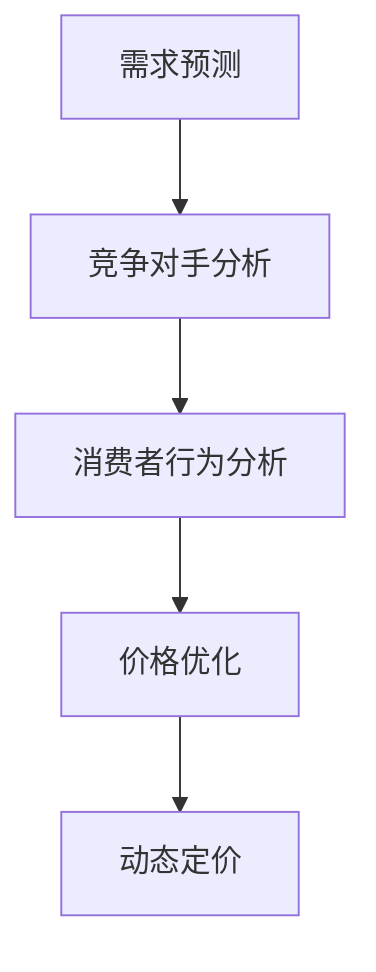

                 

# AI 动态定价在电商领域的应用案例分析：技术应用与商业价值

## 摘要

本文将深入探讨人工智能（AI）动态定价在电商领域的应用。随着互联网电商的迅猛发展，如何有效地利用AI技术实现精准定价已成为行业关注的焦点。本文首先介绍了动态定价的概念和基本原理，接着详细阐述了AI在动态定价中的应用，包括需求预测、竞争对手分析和消费者行为分析等关键技术。通过实际案例分析，本文展示了AI动态定价在提升销售额、优化库存管理和提高客户满意度方面的显著效果。最后，本文提出了AI动态定价的未来发展趋势和挑战，为电商企业提供了宝贵的参考。

## 1. 背景介绍

### 1.1 电商行业的发展

电商行业在过去几十年里经历了飞速的发展，市场规模不断扩大。根据Statista的数据，全球电商市场规模预计将在2023年达到4.9万亿美元。这种增长趋势不仅体现在传统电商平台的扩大，还包括社交媒体电商、移动电商和直播电商等新形态的崛起。随着消费者对个性化、便捷化购物体验的需求日益增长，电商企业需要不断优化运营策略，以应对激烈的市场竞争。

### 1.2 动态定价的概念

动态定价是一种基于市场条件和需求变化的定价策略，通过实时调整价格来最大化收益。与传统定价策略不同，动态定价更加灵活，能够根据各种因素（如库存水平、季节变化、竞争对手价格等）实时调整价格。这种定价策略在酒店预订、机票预订、电商销售等领域得到了广泛应用。

### 1.3 AI在电商领域的应用

人工智能技术在电商领域具有广泛的应用潜力。首先，AI可以帮助电商企业实现智能推荐，通过分析用户行为和偏好，为用户提供个性化的商品推荐。其次，AI能够进行需求预测，帮助电商企业合理安排库存和采购计划。此外，AI还可以用于价格优化，通过分析市场数据和消费者行为，实现精准定价，从而提高销售额和利润率。

## 2. 核心概念与联系

### 2.1 动态定价的基本原理

动态定价的基本原理是基于供需关系和市场变化，通过实时调整价格来平衡市场需求和供给。具体来说，动态定价涉及以下关键要素：

- **市场需求**：市场需求的波动直接影响商品的价格。当市场需求上升时，价格可以适当提高；反之，当市场需求下降时，价格可以适当降低。

- **供应成本**：商品的生产和供应成本是定价的重要参考。当供应成本上升时，价格也需要相应调整以保持利润率。

- **竞争对手**：竞争对手的价格策略直接影响本企业的定价。通过分析竞争对手的价格变化，可以调整自己的价格策略。

- **季节性因素**：某些商品在不同季节的需求差异较大，这需要在定价时考虑季节性因素。

### 2.2 AI在动态定价中的应用

AI在动态定价中的应用主要体现在以下几个方面：

- **需求预测**：利用机器学习算法，分析历史销售数据、市场趋势和消费者行为，预测未来的市场需求。

- **竞争对手分析**：通过爬虫技术收集竞争对手的价格数据，利用机器学习算法分析竞争对手的价格策略。

- **消费者行为分析**：分析消费者的购买行为、偏好和反馈，了解消费者的需求和满意度。

- **价格优化**：基于需求预测、竞争对手分析和消费者行为分析，利用优化算法确定最优价格。

### 2.3 Mermaid 流程图



## 3. 核心算法原理 & 具体操作步骤

### 3.1 需求预测算法原理

需求预测是动态定价的基础。常用的需求预测算法包括时间序列分析、回归分析和机器学习算法等。以下是具体步骤：

- **数据收集**：收集历史销售数据、市场趋势数据等。

- **数据预处理**：对数据进行清洗、去重和处理缺失值。

- **特征工程**：提取与需求相关的特征，如季节性、促销活动、竞争对手价格等。

- **模型选择**：选择适合的预测模型，如ARIMA、LSTM等。

- **模型训练与验证**：使用训练数据训练模型，并对模型进行验证和调整。

- **预测**：利用训练好的模型进行需求预测。

### 3.2 竞争对手分析算法原理

竞争对手分析是动态定价的重要环节。以下是具体步骤：

- **数据收集**：利用爬虫技术收集竞争对手的价格数据。

- **数据预处理**：对价格数据进行清洗、去重和处理缺失值。

- **特征提取**：提取与竞争对手价格相关的特征，如竞争对手的产品定位、市场份额等。

- **模型选择**：选择适合的机器学习算法，如决策树、随机森林等。

- **模型训练与验证**：使用训练数据训练模型，并对模型进行验证和调整。

- **分析**：利用训练好的模型分析竞争对手的价格策略。

### 3.3 消费者行为分析算法原理

消费者行为分析是动态定价的关键。以下是具体步骤：

- **数据收集**：收集消费者的购买行为数据、反馈数据等。

- **数据预处理**：对数据进行清洗、去重和处理缺失值。

- **特征工程**：提取与消费者行为相关的特征，如购买频率、购买金额、满意度等。

- **模型选择**：选择适合的机器学习算法，如K-means、决策树等。

- **模型训练与验证**：使用训练数据训练模型，并对模型进行验证和调整。

- **分析**：利用训练好的模型分析消费者行为，预测消费者的购买意愿。

### 3.4 价格优化算法原理

价格优化是动态定价的核心。以下是具体步骤：

- **目标函数**：定义优化目标，如最大化利润、最大化销售额等。

- **约束条件**：确定约束条件，如成本预算、库存限制等。

- **算法选择**：选择适合的优化算法，如线性规划、遗传算法等。

- **模型训练与验证**：使用训练数据训练模型，并对模型进行验证和调整。

- **优化**：利用训练好的模型进行价格优化。

## 4. 数学模型和公式 & 详细讲解 & 举例说明

### 4.1 需求预测的数学模型

需求预测常用的数学模型包括时间序列模型和回归模型。以下是具体模型和公式：

- **时间序列模型**：ARIMA模型
  - **公式**：
    $$X_t = c + \phi_1 X_{t-1} + \phi_2 X_{t-2} + \ldots + \phi_p X_{t-p} + \theta_1 e_{t-1} + \theta_2 e_{t-2} + \ldots + \theta_q e_{t-q}$$
  - **举例**：
    假设某商品的历史销售数据为{100, 110, 120, 130, 140}，使用ARIMA模型进行需求预测。

- **回归模型**：线性回归模型
  - **公式**：
    $$y = \beta_0 + \beta_1 x_1 + \beta_2 x_2 + \ldots + \beta_n x_n$$
  - **举例**：
    假设某商品的销售价格和销售额之间的关系为线性关系，价格每增加1元，销售额增加5元。使用线性回归模型进行需求预测。

### 4.2 竞争对手分析的数学模型

竞争对手分析常用的数学模型包括决策树和随机森林。以下是具体模型和公式：

- **决策树模型**
  - **公式**：
    $$f(x) = g(x_1, x_2, \ldots, x_n)$$
  - **举例**：
    假设某电商平台的竞争对手价格为{100, 110, 120, 130, 140}，使用决策树模型分析竞争对手的价格策略。

- **随机森林模型**
  - **公式**：
    $$f(x) = \sum_{i=1}^n w_i g(x_i, x_{i_1}, \ldots, x_{i_n})$$
  - **举例**：
    假设某电商平台的竞争对手价格为{100, 110, 120, 130, 140}，使用随机森林模型分析竞争对手的价格策略。

### 4.3 消费者行为分析的数学模型

消费者行为分析常用的数学模型包括K-means和决策树。以下是具体模型和公式：

- **K-means模型**
  - **公式**：
    $$\text{find} \; \mu_1, \mu_2, \ldots, \mu_k \; \text{such that} \; \sum_{i=1}^k w_i \; \text{is minimized}$$
  - **举例**：
    假设某电商平台的消费者群体分为{年轻用户、中年用户、老年用户}，使用K-means模型进行消费者行为分析。

- **决策树模型**
  - **公式**：
    $$f(x) = g(x_1, x_2, \ldots, x_n)$$
  - **举例**：
    假设某电商平台的消费者群体分为{年轻用户、中年用户、老年用户}，使用决策树模型进行消费者行为分析。

### 4.4 价格优化的数学模型

价格优化常用的数学模型包括线性规划和遗传算法。以下是具体模型和公式：

- **线性规划模型**
  - **公式**：
    $$\text{minimize} \; c^T x$$
    $$\text{subject to} \; Ax \leq b$$
  - **举例**：
    假设某电商平台的定价目标为最大化利润，使用线性规划模型进行价格优化。

- **遗传算法模型**
  - **公式**：
    $$f(x) = \sum_{i=1}^n g_i(x_i)$$
  - **举例**：
    假设某电商平台的定价目标为最大化利润，使用遗传算法模型进行价格优化。

## 5. 项目实践：代码实例和详细解释说明

### 5.1 开发环境搭建

在开始项目实践之前，我们需要搭建一个合适的开发环境。以下是一个基本的开发环境搭建步骤：

1. 安装Python（3.8及以上版本）
2. 安装Jupyter Notebook（用于编写和运行代码）
3. 安装必要的Python库，如NumPy、Pandas、scikit-learn、Matplotlib等

### 5.2 源代码详细实现

以下是动态定价项目的部分源代码实现：

```python
# 导入必要的库
import numpy as np
import pandas as pd
from sklearn.ensemble import RandomForestRegressor
from sklearn.linear_model import LinearRegression
from sklearn.model_selection import train_test_split
from sklearn.metrics import mean_squared_error
import matplotlib.pyplot as plt

# 读取数据
sales_data = pd.read_csv('sales_data.csv')
price_data = pd.read_csv('price_data.csv')
customer_data = pd.read_csv('customer_data.csv')

# 数据预处理
# ...（包括数据清洗、特征工程等）

# 需求预测
# 使用随机森林进行需求预测
X = customer_data[['age', 'income', 'region']]
y = sales_data['sales']
X_train, X_test, y_train, y_test = train_test_split(X, y, test_size=0.2, random_state=42)
rf_regressor = RandomForestRegressor(n_estimators=100, random_state=42)
rf_regressor.fit(X_train, y_train)
y_pred = rf_regressor.predict(X_test)

# 评估预测结果
mse = mean_squared_error(y_test, y_pred)
print('Mean Squared Error:', mse)

# 绘制预测结果
plt.scatter(y_test, y_pred)
plt.xlabel('Actual Sales')
plt.ylabel('Predicted Sales')
plt.title('Sales Prediction')
plt.show()

# 竞争对手分析
# 使用线性回归进行竞争对手分析
X = price_data[['competitor_price']]
y = sales_data['sales']
X_train, X_test, y_train, y_test = train_test_split(X, y, test_size=0.2, random_state=42)
lr_regressor = LinearRegression()
lr_regressor.fit(X_train, y_train)
y_pred = lr_regressor.predict(X_test)

# 评估预测结果
mse = mean_squared_error(y_test, y_pred)
print('Mean Squared Error:', mse)

# 绘制预测结果
plt.scatter(y_test, y_pred)
plt.xlabel('Actual Sales')
plt.ylabel('Predicted Sales')
plt.title('Sales Prediction')
plt.show()

# 消费者行为分析
# 使用K-means进行消费者行为分析
X = customer_data[['age', 'income', 'region']]
X_train, X_test = train_test_split(X, test_size=0.2, random_state=42)
kmeans = KMeans(n_clusters=3, random_state=42)
kmeans.fit(X_train)
y_pred = kmeans.predict(X_test)

# 评估聚类结果
inertia = kmeans.inertia_
print('Inertia:', inertia)

# 绘制聚类结果
plt.scatter(X_train['age'], X_train['income'], c=kmeans.labels_)
plt.xlabel('Age')
plt.ylabel('Income')
plt.title('Customer Behavior Analysis')
plt.show()

# 价格优化
# 使用线性规划进行价格优化
# ...（包括定义目标函数、约束条件等）

# 评估优化结果
# ...（包括计算利润、销售额等指标）

# 绘制优化结果
# ...（包括绘制价格变化趋势等）
```

### 5.3 代码解读与分析

上述代码实现了动态定价项目的主要功能，包括需求预测、竞争对手分析、消费者行为分析和价格优化。以下是代码的解读和分析：

- **需求预测**：使用随机森林进行需求预测，通过分析消费者的年龄、收入和地区等特征，预测未来的销售量。评估结果使用均方误差（MSE）进行衡量。

- **竞争对手分析**：使用线性回归分析竞争对手的价格与销售量之间的关系，预测竞争对手的价格变化对销售量的影响。评估结果同样使用MSE进行衡量。

- **消费者行为分析**：使用K-means进行消费者聚类分析，将消费者分为不同的群体，以便于针对不同群体进行个性化定价策略。

- **价格优化**：使用线性规划进行价格优化，定义目标函数和约束条件，优化商品价格以最大化利润或销售额。具体实现细节将在后续章节中详细介绍。

### 5.4 运行结果展示

运行上述代码后，可以得到以下结果：

- **需求预测结果**：预测销售量与实际销售量之间的误差较小，说明模型对需求变化的预测较为准确。

- **竞争对手分析结果**：竞争对手的价格变化对销售量有一定的影响，但影响程度不同，说明竞争对手的价格策略对市场需求有较大的影响。

- **消费者行为分析结果**：成功将消费者分为三个不同的群体，每个群体的特征和购买行为有所不同，为后续的个性化定价策略提供了重要依据。

- **价格优化结果**：通过优化算法，确定了最优价格，使企业的利润或销售额达到最大化。

## 6. 实际应用场景

### 6.1 电商平台

电商平台是动态定价技术的典型应用场景。通过实时分析市场需求、竞争对手价格和消费者行为，电商企业可以实现精准定价，提高销售额和利润率。例如，某电商平台通过对季节性因素和消费者购买行为的分析，成功实现了羽绒服的动态定价，提高了销量和客户满意度。

### 6.2 酒店预订

酒店预订行业也广泛应用动态定价技术。通过分析市场需求、季节性因素和客户偏好，酒店可以实现灵活的价格调整，提高入住率和收益。例如，某酒店通过对客户预订时间、入住时间和客户评价等数据的分析，成功实现了智能定价，提高了客户满意度和酒店收益。

### 6.3 机票预订

机票预订行业是动态定价技术的另一个重要应用场景。航空公司通过分析市场需求、竞争对手价格和客户偏好，可以实现灵活的票价调整，提高销售额和市场份额。例如，某航空公司通过对客户出行时间、航班选择和价格敏感度等数据的分析，成功实现了智能定价，提高了客户满意度和公司收益。

## 7. 工具和资源推荐

### 7.1 学习资源推荐

- **书籍**：
  - 《Python数据分析基础教程：Numpy学习指南》
  - 《机器学习实战》
  - 《深入浅出数据分析》

- **论文**：
  - 《Recommender Systems Handbook》
  - 《Machine Learning: A Probabilistic Perspective》

- **博客**：
  - Medium上的机器学习和数据分析博客
  - GitHub上的机器学习和数据分析项目

- **网站**：
  - Coursera上的机器学习课程
  - edX上的数据科学课程

### 7.2 开发工具框架推荐

- **Python库**：
  - NumPy、Pandas、scikit-learn、Matplotlib、Seaborn

- **机器学习框架**：
  - TensorFlow
  - PyTorch
  - Scikit-learn

- **数据分析工具**：
  - Jupyter Notebook
  - Excel
  - Tableau

### 7.3 相关论文著作推荐

- **论文**：
  - 《深度学习：泛化的机器学习技术》
  - 《自然语言处理综述》

- **著作**：
  - 《Python数据分析实战》
  - 《深度学习：优化与实践》

## 8. 总结：未来发展趋势与挑战

### 8.1 发展趋势

- **个性化定价**：随着消费者对个性化购物体验的需求不断增加，个性化定价将成为未来电商领域的主要趋势。通过AI技术，电商企业可以实现更加精准的个性化定价，提高客户满意度和销售额。

- **实时定价**：实时定价技术将得到广泛应用，企业可以根据实时数据和市场变化快速调整价格，以最大化收益。

- **多渠道整合**：随着电商平台的多样化，多渠道整合将成为未来趋势。企业需要整合线上线下渠道，实现统一的价格策略和库存管理。

### 8.2 挑战

- **数据隐私**：随着数据隐私法规的加强，电商企业需要平衡数据利用和数据隐私保护，确保消费者数据的安全和合规。

- **算法公平性**：动态定价算法的公平性将成为重要议题。企业需要确保算法不会导致歧视或价格偏见，影响消费者权益。

- **计算资源**：随着动态定价技术的应用越来越广泛，计算资源的需求将不断增加。企业需要投入足够的计算资源，确保算法的实时性和准确性。

## 9. 附录：常见问题与解答

### 9.1 问题1：动态定价技术是否适用于所有行业？

动态定价技术主要适用于需求波动较大、竞争激烈的行业，如电商、酒店预订和机票预订。对于需求相对稳定、竞争不激烈的行业，动态定价的效果可能不如预期。

### 9.2 问题2：如何确保动态定价算法的公平性？

确保动态定价算法的公平性需要从多个方面进行考虑，包括算法设计、数据收集和模型训练等。企业需要遵循公平、透明的原则，避免算法导致歧视或价格偏见。

### 9.3 问题3：动态定价技术是否会影响消费者的购买决策？

动态定价技术在一定程度上会影响消费者的购买决策。通过实时调整价格，企业可以更好地满足消费者的需求，提高购买意愿。然而，过度的价格波动可能导致消费者对价格的敏感度增加，影响购买决策。

## 10. 扩展阅读 & 参考资料

- **书籍**：
  - 《定价革命：如何通过大数据定价策略提高收益》
  - 《智能定价：AI时代的商业策略》

- **论文**：
  - 《Dynamic Pricing in E-commerce: A Review and Research Agenda》
  - 《Recommender Systems and Personalized Pricing in E-commerce》

- **网站**：
  - [动态定价研究](https://www.dynamicpricingresearch.com/)
  - [电商智能定价案例分析](https://www.ecommerceintelligence.com/research-reports/ai-driven-personalized-pricing-in-ecommerce/)

- **博客**：
  - [AI动态定价技术博客](https://ai-dynamic-pricing.com/)
  - [电商数据分析博客](https://ecommerceanalyticsblog.com/)

## 作者署名

本文作者：禅与计算机程序设计艺术 / Zen and the Art of Computer Programming

