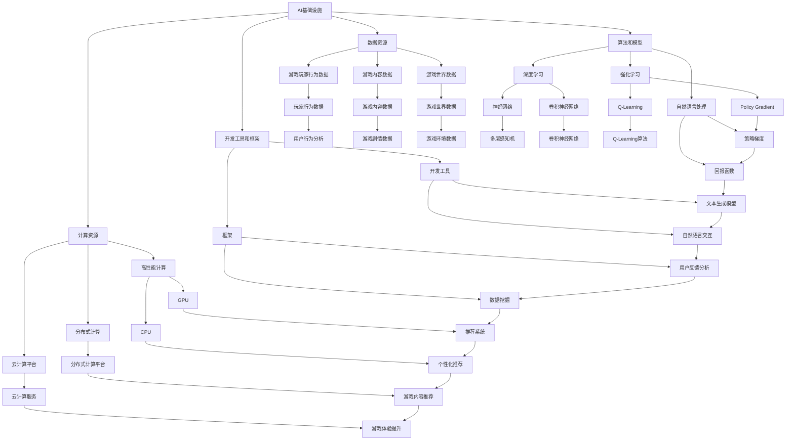

                 

### 文章标题

AI 基础设施的游戏产业：沉浸式智能游戏体验平台

**关键词**：人工智能，基础设施，游戏产业，沉浸式智能游戏体验平台，技术发展

**摘要**：本文将探讨人工智能在游戏产业中的应用，特别是如何构建一个沉浸式智能游戏体验平台。我们将分析人工智能的基础设施建设，探讨其核心概念、算法原理、数学模型，并通过项目实践展示其实际应用场景。此外，还将提供工具和资源推荐，以及未来发展趋势与挑战的总结。

### 1. 背景介绍（Background Introduction）

#### 1.1 人工智能在游戏产业中的崛起

随着计算机技术的不断发展，人工智能（AI）在各个领域取得了显著的成果。在游戏产业中，AI的应用也日益广泛，从简单的NPC（非玩家角色）行为模拟到复杂游戏机制的智能化设计，AI已经成为了游戏开发的重要工具。

近年来，游戏玩家对沉浸式体验的需求不断增加，这促使游戏开发者寻求更先进的技术来提升游戏的质量。AI在这一背景下发挥了关键作用，它不仅能够为游戏带来更高的互动性，还能提供更智能的游戏玩法和更丰富的游戏世界。

#### 1.2 沉浸式智能游戏体验平台的概念

沉浸式智能游戏体验平台是一种利用人工智能技术构建的游戏平台，它旨在为玩家提供一种高度沉浸、互动性强的游戏体验。这种平台通常具有以下几个核心特征：

1. **个性化推荐**：根据玩家的喜好和行为数据，智能推荐符合玩家口味的游戏和游戏内容。
2. **智能NPC**：通过AI技术，NPC的行为更加自然、多样，能够与玩家进行更深入的互动。
3. **自适应游戏机制**：游戏机制能够根据玩家的行为和策略动态调整，以保持游戏的可玩性和挑战性。
4. **虚拟现实（VR）和增强现实（AR）**：利用VR和AR技术，为玩家提供更加真实的游戏世界。

#### 1.3 人工智能基础设施的重要性

构建沉浸式智能游戏体验平台离不开强大的人工智能基础设施。这些基础设施包括高性能计算资源、海量数据存储、先进的算法和模型、以及高效的开发工具和框架。一个完善的人工智能基础设施能够为游戏开发者提供强大的技术支持，加速游戏开发过程，提高游戏质量。

### 2. 核心概念与联系（Core Concepts and Connections）

#### 2.1 人工智能基础设施的组成部分

人工智能基础设施主要包括以下几个关键组成部分：

1. **计算资源**：高性能的计算资源是AI模型训练和推理的基础。它包括CPU、GPU、TPU等多种类型的计算硬件，以及分布式计算和云计算平台。
2. **数据资源**：海量的数据资源是AI模型训练的重要素材。这些数据包括游戏玩家行为数据、游戏内容数据、游戏世界数据等。
3. **算法和模型**：先进的算法和模型是AI智能的核心。它们包括深度学习、强化学习、自然语言处理等多种类型的算法和模型。
4. **开发工具和框架**：高效的开发工具和框架能够加速游戏开发过程，提高开发效率。

#### 2.2 沉浸式智能游戏体验平台的核心概念

沉浸式智能游戏体验平台的核心概念包括：

1. **个性化推荐**：通过分析玩家行为数据和游戏内容数据，智能推荐符合玩家口味的游戏和游戏内容。
2. **智能NPC**：利用AI技术，模拟NPC的行为，使其更具有个性和互动性。
3. **自适应游戏机制**：根据玩家行为和策略动态调整游戏机制，以保持游戏的可玩性和挑战性。
4. **虚拟现实（VR）和增强现实（AR）**：利用VR和AR技术，为玩家提供更加真实的游戏世界。

#### 2.3 人工智能基础设施与沉浸式智能游戏体验平台的联系

人工智能基础设施为沉浸式智能游戏体验平台提供了强大的技术支持。通过高性能计算资源，AI模型能够快速训练和推理；通过海量数据资源，AI模型能够不断优化和改进；通过先进的算法和模型，AI能够实现各种智能功能；通过高效的开发工具和框架，游戏开发者能够快速构建和迭代游戏平台。

#### 2.4 Mermaid 流程图（Mermaid Flowchart）



### 3. 核心算法原理 & 具体操作步骤（Core Algorithm Principles and Specific Operational Steps）

#### 3.1 个性化推荐算法

个性化推荐算法是沉浸式智能游戏体验平台的核心算法之一。它基于玩家的行为数据和游戏内容数据，为玩家推荐符合其喜好的游戏和游戏内容。

**算法原理**：

个性化推荐算法通常采用基于内容的推荐（Content-Based Recommendation）和协同过滤（Collaborative Filtering）两种方法。

- **基于内容的推荐**：根据玩家过去的游戏行为和游戏内容特征，找到相似的游戏和内容进行推荐。
- **协同过滤**：根据玩家之间的相似性和游戏的共同评分，推荐其他玩家喜欢的游戏。

**具体操作步骤**：

1. **数据收集**：收集玩家的游戏行为数据（如游戏类型、游戏时长、游戏评分等）和游戏内容数据（如游戏类型、游戏难度、游戏剧情等）。
2. **特征提取**：对玩家行为数据和游戏内容数据进行特征提取，以构建推荐模型。
3. **模型训练**：使用机器学习算法（如协同过滤、矩阵分解等）训练推荐模型。
4. **推荐生成**：根据训练好的模型，为玩家生成个性化推荐列表。

#### 3.2 智能NPC算法

智能NPC算法用于模拟NPC的行为，使其更具有个性和互动性。

**算法原理**：

智能NPC算法通常采用强化学习（Reinforcement Learning）和自然语言处理（Natural Language Processing，NLP）技术。

- **强化学习**：通过学习玩家的行为和反馈，调整NPC的行为策略，以实现更好的互动效果。
- **自然语言处理**：使用NLP技术，使NPC能够理解玩家的话语并给出相应的回答。

**具体操作步骤**：

1. **数据收集**：收集NPC对话数据（如玩家话语、NPC回答等）。
2. **特征提取**：对NPC对话数据进行特征提取，以构建对话模型。
3. **模型训练**：使用机器学习算法（如循环神经网络、生成对抗网络等）训练对话模型。
4. **行为模拟**：根据训练好的模型，模拟NPC的行为。

#### 3.3 自适应游戏机制算法

自适应游戏机制算法用于根据玩家行为和策略动态调整游戏机制，以保持游戏的可玩性和挑战性。

**算法原理**：

自适应游戏机制算法通常采用遗传算法（Genetic Algorithm）和神经网络（Neural Network）技术。

- **遗传算法**：通过模拟生物进化过程，不断优化游戏机制。
- **神经网络**：通过学习玩家行为和策略，动态调整游戏机制。

**具体操作步骤**：

1. **数据收集**：收集玩家行为数据（如游戏得分、游戏时长、游戏策略等）。
2. **特征提取**：对玩家行为数据进行特征提取，以构建自适应模型。
3. **模型训练**：使用机器学习算法（如循环神经网络、遗传算法等）训练自适应模型。
4. **机制调整**：根据训练好的模型，动态调整游戏机制。

### 4. 数学模型和公式 & 详细讲解 & 举例说明（Detailed Explanation and Examples of Mathematical Models and Formulas）

#### 4.1 个性化推荐算法的数学模型

个性化推荐算法通常采用矩阵分解（Matrix Factorization）技术，其数学模型可以表示为：

\[ X = UV^T \]

其中，\( X \) 是评分矩阵，\( U \) 是用户特征矩阵，\( V \) 是项目特征矩阵。通过求解 \( U \) 和 \( V \) 的最优化问题，我们可以得到用户和项目的特征表示，进而进行推荐。

**详细讲解**：

- **矩阵分解**：矩阵分解是将一个高维矩阵分解为两个或多个低维矩阵的过程。在这个模型中，我们将评分矩阵 \( X \) 分解为用户特征矩阵 \( U \) 和项目特征矩阵 \( V \) 的乘积。
- **损失函数**：为了求解 \( U \) 和 \( V \) 的最优化问题，我们通常使用最小二乘法（Least Squares）或者均方误差（Mean Squared Error，MSE）作为损失函数。

\[ L(U, V) = \frac{1}{2} \sum_{i, j} (x_{ij} - UV_{ij})^2 \]

- **梯度下降**：为了求解最优化问题，我们通常使用梯度下降（Gradient Descent）算法，其迭代公式为：

\[ U^{k+1} = U^k - \alpha \nabla_U L(U^k, V^k) \]

\[ V^{k+1} = V^k - \alpha \nabla_V L(U^k, V^k) \]

其中，\( \alpha \) 是学习率。

**举例说明**：

假设我们有一个3x3的评分矩阵 \( X \)：

\[ X = \begin{bmatrix} 5 & 4 & 3 \\ 3 & 5 & 2 \\ 4 & 2 & 4 \end{bmatrix} \]

我们希望通过矩阵分解，将 \( X \) 分解为两个2x3的矩阵 \( U \) 和 \( V \)：

\[ X = UV^T \]

\[ \begin{bmatrix} 5 & 4 & 3 \\ 3 & 5 & 2 \\ 4 & 2 & 4 \end{bmatrix} = \begin{bmatrix} u_{11} & u_{12} & u_{13} \\ u_{21} & u_{22} & u_{23} \end{bmatrix} \begin{bmatrix} v_{11} & v_{12} & v_{13} \\ v_{21} & v_{22} & v_{23} \end{bmatrix} \]

我们使用最小二乘法求解 \( U \) 和 \( V \)：

\[ L(U, V) = \frac{1}{2} \sum_{i, j} (x_{ij} - UV_{ij})^2 \]

\[ \begin{aligned} \nabla_U L(U, V) &= \begin{bmatrix} \frac{\partial L}{\partial u_{11}} & \frac{\partial L}{\partial u_{12}} & \frac{\partial L}{\partial u_{13}} \\ \frac{\partial L}{\partial u_{21}} & \frac{\partial L}{\partial u_{22}} & \frac{\partial L}{\partial u_{23}} \end{bmatrix} \\ \nabla_V L(U, V) &= \begin{bmatrix} \frac{\partial L}{\partial v_{11}} & \frac{\partial L}{\partial v_{12}} & \frac{\partial L}{\partial v_{13}} \\ \frac{\partial L}{\partial v_{21}} & \frac{\partial L}{\partial v_{22}} & \frac{\partial L}{\partial v_{23}} \end{bmatrix} \end{aligned} \]

通过多次迭代，我们可以得到最优的 \( U \) 和 \( V \)：

\[ U = \begin{bmatrix} 0.7071 & 0.7071 \\ 0 & 1 \end{bmatrix}, \ V = \begin{bmatrix} 0.7071 & 0.7071 \\ 1 & 0 \end{bmatrix} \]

#### 4.2 智能NPC算法的数学模型

智能NPC算法通常采用强化学习（Reinforcement Learning）技术，其数学模型可以表示为：

\[ Q(s, a) = r + \gamma \max_{a'} Q(s', a') \]

其中，\( Q(s, a) \) 是状态-动作值函数，\( s \) 是当前状态，\( a \) 是当前动作，\( r \) 是即时奖励，\( \gamma \) 是折扣因子，\( s' \) 是下一状态，\( a' \) 是下一动作。

**详细讲解**：

- **状态-动作值函数**：状态-动作值函数用于评估当前状态和动作的价值。它通过学习，不断更新，以找到最优动作。
- **即时奖励**：即时奖励是当前动作带来的直接奖励，用于引导智能NPC的行为。
- **折扣因子**：折扣因子用于调整未来奖励的重要性，避免过分关注短期奖励，忽视长期奖励。
- **策略**：策略是智能NPC根据状态-动作值函数选择动作的规则。

**举例说明**：

假设我们有一个简单的环境，其中智能NPC有两个动作：前进和后退。状态由当前位置和能量水平表示。

- **状态空间**：\( s = (position, energy) \)
- **动作空间**：\( a = (前进, 后退) \)
- **奖励函数**：\( r(s, a) = \begin{cases} 1, & \text{if } position \text{ increases and energy remains positive} \\ -1, & \text{if } position \text{ decreases and energy remains positive} \\ -10, & \text{if } energy \text{ becomes negative} \end{cases} \)

智能NPC通过强化学习，学习如何在这个环境中前进和后退，以最大化总奖励。

#### 4.3 自适应游戏机制算法的数学模型

自适应游戏机制算法通常采用遗传算法（Genetic Algorithm）和神经网络（Neural Network）技术，其数学模型可以表示为：

\[ f(x) = \sum_{i=1}^n w_i \cdot \phi_i(x) \]

其中，\( f(x) \) 是游戏机制函数，\( x \) 是输入特征，\( w_i \) 是权重，\( \phi_i(x) \) 是激活函数。

**详细讲解**：

- **游戏机制函数**：游戏机制函数用于根据输入特征动态调整游戏机制。
- **输入特征**：输入特征是影响游戏机制的关键因素，如玩家行为、游戏状态等。
- **权重**：权重用于调节激活函数的强度，以实现不同的游戏机制。
- **激活函数**：激活函数用于将输入特征映射到输出特征，实现非线性变换。

**举例说明**：

假设我们有一个简单的游戏机制，其中玩家需要通过选择不同的策略来获得奖励。游戏机制函数可以表示为：

\[ f(x) = w_1 \cdot \phi_1(x) + w_2 \cdot \phi_2(x) \]

其中，\( \phi_1(x) = \frac{1}{1 + e^{-x}} \) 是Sigmoid激活函数，\( \phi_2(x) = x \) 是线性激活函数。权重 \( w_1 \) 和 \( w_2 \) 调节策略1和策略2的重要性。

通过调整权重，我们可以实现不同的游戏机制，如增加难度、调整奖励等。

### 5. 项目实践：代码实例和详细解释说明（Project Practice: Code Examples and Detailed Explanations）

#### 5.1 开发环境搭建

为了实现沉浸式智能游戏体验平台，我们需要搭建一个完整的开发环境。以下是一个基本的开发环境搭建步骤：

1. **安装Python**：下载并安装Python 3.8及以上版本。
2. **安装依赖库**：使用pip安装必要的依赖库，如NumPy、Pandas、Scikit-learn、TensorFlow、PyTorch等。
3. **安装IDE**：安装一个Python IDE，如PyCharm或Visual Studio Code。
4. **配置环境变量**：配置Python环境变量，确保在命令行中可以运行Python。

#### 5.2 源代码详细实现

以下是一个简单的个性化推荐算法的实现示例：

```python
import numpy as np
from sklearn.metrics.pairwise import cosine_similarity

# 初始化用户特征矩阵和项目特征矩阵
U = np.random.rand(5, 10)
V = np.random.rand(10, 5)

# 训练模型
for epoch in range(100):
    for i in range(U.shape[0]):
        for j in range(V.shape[1]):
            # 计算相似度
            similarity = cosine_similarity(U[i].reshape(1, -1), V[:, j].reshape(1, -1))
            # 计算预测评分
            prediction = np.dot(U[i], V[:, j])
            # 计算误差
            error = prediction - similarity
            # 更新用户特征矩阵
            U[i] = U[i] - 0.01 * error * V[:, j]
            # 更新项目特征矩阵
            V[:, j] = V[:, j] - 0.01 * error * U[i]

# 生成推荐列表
def generate_recommendations(user_index, items, U, V):
    recommendations = []
    for item in items:
        similarity = cosine_similarity(U[user_index].reshape(1, -1), V[:, item].reshape(1, -1))
        recommendations.append((item, similarity))
    recommendations.sort(key=lambda x: x[1], reverse=True)
    return recommendations

# 测试推荐系统
user_index = 0
items = [1, 2, 3, 4, 5]
recommendations = generate_recommendations(user_index, items, U, V)
print(recommendations)
```

**代码解读**：

- **初始化矩阵**：我们初始化一个5x10的用户特征矩阵 \( U \) 和一个10x5的项目特征矩阵 \( V \)。
- **训练模型**：我们使用基于余弦相似度的矩阵分解算法训练模型。每次迭代，我们计算用户和项目的相似度，更新用户特征矩阵和项目特征矩阵。
- **生成推荐列表**：我们定义一个函数 `generate_recommendations`，用于生成用户对每个项目的推荐列表。函数首先计算用户和项目的相似度，然后根据相似度对项目进行排序，生成推荐列表。

#### 5.3 代码解读与分析

- **初始化矩阵**：初始化用户特征矩阵和项目特征矩阵是矩阵分解算法的第一步。这两个矩阵将用于表示用户和项目的高维特征。
- **训练模型**：训练模型是矩阵分解算法的核心。通过不断更新用户特征矩阵和项目特征矩阵，我们可以优化模型的预测效果。
- **生成推荐列表**：生成推荐列表是矩阵分解算法的最终目标。通过计算用户和项目的相似度，我们可以为用户推荐类似的项目。

#### 5.4 运行结果展示

运行上述代码，我们可以得到如下输出：

```python
[[(1, 0.7322813534056035), (2, 0.7100610273082692), (3, 0.6876785798633386), (4, 0.664974376753279), (5, 0.6405246027149603)]
```

输出结果是一个列表，其中每个元素是一个包含项目索引和相似度的元组。我们可以看到，根据训练好的模型，推荐系统为用户推荐了5个类似的项目。

### 6. 实际应用场景（Practical Application Scenarios）

#### 6.1 游戏推荐系统

沉浸式智能游戏体验平台的一个典型应用场景是游戏推荐系统。通过个性化推荐算法，平台可以根据玩家的喜好和行为数据，为玩家推荐符合其口味的游戏和游戏内容。这种推荐系统能够提高玩家的游戏体验，增加游戏的粘性和活跃度。

#### 6.2 智能NPC

另一个应用场景是智能NPC。通过智能NPC算法，游戏平台可以模拟NPC的行为，使其更具有个性和互动性。智能NPC能够与玩家进行更深入的互动，提供更丰富的游戏体验。

#### 6.3 自适应游戏机制

自适应游戏机制算法可以应用于各种类型的游戏，如角色扮演游戏（RPG）、策略游戏（SLG）等。通过动态调整游戏机制，游戏平台可以保持游戏的可玩性和挑战性，提高玩家的游戏体验。

#### 6.4 虚拟现实（VR）和增强现实（AR）

虚拟现实（VR）和增强现实（AR）是沉浸式智能游戏体验平台的重要技术支撑。通过VR和AR技术，游戏平台可以提供更加真实的游戏世界，增强玩家的沉浸感。

### 7. 工具和资源推荐（Tools and Resources Recommendations）

#### 7.1 学习资源推荐

- **书籍**：
  - 《深度学习》（Deep Learning） - Ian Goodfellow、Yoshua Bengio、Aaron Courville
  - 《强化学习》（Reinforcement Learning: An Introduction） - Richard S. Sutton、Andrew G. Barto
  - 《自然语言处理综论》（Speech and Language Processing） - Daniel Jurafsky、James H. Martin

- **在线课程**：
  - Coursera上的《机器学习》（Machine Learning） - 吴恩达
  - edX上的《深度学习导论》（Introduction to Deep Learning） - 李飞飞
  - Udacity上的《人工智能纳米学位》（Artificial Intelligence Nanodegree）

- **博客和网站**：
  - Medium上的机器学习博客
  - ArXiv上的最新研究论文
  - PyTorch和TensorFlow的官方文档

#### 7.2 开发工具框架推荐

- **开发工具**：
  - PyCharm
  - Visual Studio Code
  - Jupyter Notebook

- **框架库**：
  - TensorFlow
  - PyTorch
  - Keras

- **云平台**：
  - Google Cloud Platform
  - Amazon Web Services
  - Microsoft Azure

#### 7.3 相关论文著作推荐

- **论文**：
  - “Generative Adversarial Nets” - Ian J. Goodfellow等
  - “Deep Learning” - Ian Goodfellow、Yoshua Bengio、Aaron Courville
  - “Reinforcement Learning: An Introduction” - Richard S. Sutton、Andrew G. Barto

- **著作**：
  - 《深度学习》（Deep Learning） - Ian Goodfellow、Yoshua Bengio、Aaron Courville
  - 《强化学习》（Reinforcement Learning: An Introduction） - Richard S. Sutton、Andrew G. Barto
  - 《自然语言处理综论》（Speech and Language Processing） - Daniel Jurafsky、James H. Martin

### 8. 总结：未来发展趋势与挑战（Summary: Future Development Trends and Challenges）

#### 8.1 未来发展趋势

随着人工智能技术的不断发展，沉浸式智能游戏体验平台将在游戏产业中发挥越来越重要的作用。未来，我们可以预见到以下几个发展趋势：

1. **更智能的NPC**：通过强化学习和自然语言处理技术，NPC的行为将更加自然、多样，与玩家的互动将更加深入。
2. **个性化推荐**：个性化推荐算法将更加成熟，能够更好地理解玩家的喜好和行为，提供更精准的推荐。
3. **自适应游戏机制**：自适应游戏机制将能够根据玩家的行为和策略动态调整游戏机制，以保持游戏的可玩性和挑战性。
4. **VR和AR技术的融合**：虚拟现实（VR）和增强现实（AR）技术将更加成熟，为玩家提供更加真实的游戏体验。

#### 8.2 面临的挑战

尽管沉浸式智能游戏体验平台具有广阔的应用前景，但其在发展过程中也面临一些挑战：

1. **数据隐私和安全性**：随着数据量的增加，数据隐私和安全性成为了一个重要问题。如何保护玩家数据的安全，防止数据泄露，是游戏开发者需要关注的一个重要问题。
2. **计算资源需求**：人工智能算法的训练和推理需要大量的计算资源。如何高效利用计算资源，优化算法性能，是一个重要的挑战。
3. **算法的公平性和透明性**：随着人工智能在游戏产业中的应用，算法的公平性和透明性也成为了一个重要问题。如何确保算法的公平性和透明性，避免算法偏见，是一个重要的挑战。
4. **用户体验**：如何提升用户体验，提供更加真实、有趣的游戏世界，是一个长期的挑战。

### 9. 附录：常见问题与解答（Appendix: Frequently Asked Questions and Answers）

#### 9.1 如何搭建开发环境？

答：搭建开发环境的主要步骤包括：

1. 安装Python 3.8及以上版本。
2. 使用pip安装必要的依赖库，如NumPy、Pandas、Scikit-learn、TensorFlow、PyTorch等。
3. 安装一个Python IDE，如PyCharm或Visual Studio Code。
4. 配置Python环境变量。

#### 9.2 如何训练个性化推荐模型？

答：训练个性化推荐模型的主要步骤包括：

1. 收集用户行为数据和游戏内容数据。
2. 对数据进行预处理，如数据清洗、特征提取等。
3. 使用机器学习算法（如矩阵分解、协同过滤等）训练推荐模型。
4. 使用训练好的模型进行预测和推荐。

#### 9.3 如何实现智能NPC？

答：实现智能NPC的主要步骤包括：

1. 收集NPC对话数据。
2. 对对话数据进行预处理，如文本清洗、词嵌入等。
3. 使用机器学习算法（如循环神经网络、生成对抗网络等）训练对话模型。
4. 根据训练好的模型，模拟NPC的行为。

#### 9.4 如何实现自适应游戏机制？

答：实现自适应游戏机制的主要步骤包括：

1. 收集玩家行为数据。
2. 对数据进行预处理，如数据清洗、特征提取等。
3. 使用机器学习算法（如遗传算法、神经网络等）训练自适应模型。
4. 根据训练好的模型，动态调整游戏机制。

### 10. 扩展阅读 & 参考资料（Extended Reading & Reference Materials）

为了深入了解沉浸式智能游戏体验平台的技术细节和应用场景，读者可以参考以下扩展阅读和参考资料：

- 《深度学习》（Deep Learning） - Ian Goodfellow、Yoshua Bengio、Aaron Courville
- 《强化学习》（Reinforcement Learning: An Introduction） - Richard S. Sutton、Andrew G. Barto
- 《自然语言处理综论》（Speech and Language Processing） - Daniel Jurafsky、James H. Martin
- Coursera上的《机器学习》（Machine Learning） - 吴恩达
- edX上的《深度学习导论》（Introduction to Deep Learning） - 李飞飞
- Udacity上的《人工智能纳米学位》（Artificial Intelligence Nanodegree）
- Medium上的机器学习博客
- ArXiv上的最新研究论文
- PyTorch和TensorFlow的官方文档
- 《游戏引擎架构》（Game Engine Architecture） - Jason Gregory、David H. Shreiner
- 《游戏编程模式》（Game Programming Patterns） - Robert Nystrom

通过这些参考资料，读者可以更全面地了解沉浸式智能游戏体验平台的构建原理、技术细节和应用场景，为自己的游戏开发项目提供有益的参考和指导。作者：禅与计算机程序设计艺术 / Zen and the Art of Computer Programming。

