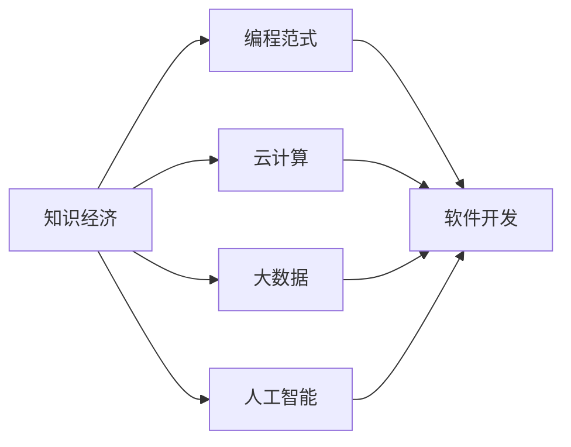

                 

# 程序员在知识经济时代的发展路径

> 关键词：知识经济, 编程范式, 云计算, 大数据, 人工智能, 持续学习

## 1. 背景介绍

在当今的知识经济时代，程序员（Professional Programmers）扮演着越来越重要的角色。随着科技的飞速发展和数字经济的崛起，编程已经成为推动社会进步和产业变革的核心力量。本文将深入探讨程序员在知识经济时代的发展路径，揭示编程范式、云计算、大数据和人工智能等多重因素如何塑造程序员的职业未来。

## 2. 核心概念与联系

### 2.1 核心概念概述

为更好地理解程序员在知识经济时代的发展路径，本节将介绍几个关键的概念：

- **知识经济（Knowledge Economy）**：建立在知识和信息基础上的经济体系，强调创新、创造和知识的价值。程序员作为知识创新的重要力量，在知识经济时代将面临新的机遇和挑战。
- **编程范式（Programming Paradigm）**：编程的基本方法和原则，如面向对象编程、函数式编程、声明式编程等，影响着程序员的开发习惯和思维方式。
- **云计算（Cloud Computing）**：基于互联网的计算服务，提供弹性、便捷的计算资源，支持大规模软件开发和应用部署。
- **大数据（Big Data）**：海量、复杂的数据集，通过数据处理和分析技术挖掘有价值的信息，推动决策科学和商业智能的发展。
- **人工智能（AI）**：模拟人类智能行为的计算机技术，包括机器学习、深度学习等，为编程和软件开发带来新的思路和工具。

这些核心概念通过编程技术和信息技术的应用，密切关联着程序员的职业发展和行业前景。理解这些概念之间的关系，将帮助我们更好地把握知识经济时代程序员的发展路径。

### 2.2 核心概念原理和架构的 Mermaid 流程图



这个流程图展示了知识经济如何通过编程范式、云计算、大数据和人工智能四大支柱，推动软件开发的创新和演进。程序员作为其中的关键角色，将在这些技术的基础上，不断拓展其职业能力和发展空间。

## 3. 核心算法原理 & 具体操作步骤

### 3.1 算法原理概述

程序员在知识经济时代的发展，不仅依赖于编程技能，更依赖于对新技术的理解和应用。云计算、大数据和人工智能等技术，为程序员提供了强大的工具和平台，使其能够更高效、更灵活地开发和部署软件系统。

以云计算为例，其虚拟化和弹性计算的特点，使得程序员可以在任何时间和地点，通过互联网资源进行软件开发和应用部署。这种灵活性不仅提升了开发效率，也促进了全球协作和资源共享。同时，云计算提供了大规模存储和处理能力，使得程序员能够处理和分析海量数据，进行大数据分析和应用开发。

人工智能技术的崛起，则为程序员带来了全新的编程思路和工具。机器学习和深度学习等技术，使得程序员可以开发智能化的应用系统，实现自动化、智能化和自适应功能。人工智能还可以辅助程序员进行代码优化和错误检测，提升软件开发质量和效率。

### 3.2 算法步骤详解

基于上述原理，程序员在知识经济时代的发展路径可以大致分为以下步骤：

1. **基础技能学习**：掌握编程语言（如Python、Java等）、数据结构和算法等基础编程技能，为后续学习和应用新技术打下坚实基础。

2. **技术栈扩展**：学习云计算（如AWS、Azure、Google Cloud等）、大数据处理（如Hadoop、Spark等）和人工智能（如TensorFlow、PyTorch等）技术，提升综合技术能力。

3. **项目实践与积累**：参与实际项目开发，积累经验。可以从小规模应用开始，逐步扩展到中大型系统，提升解决问题的能力和团队协作能力。

4. **持续学习和更新**：技术日新月异，程序员需要不断学习新技术，更新知识体系。可以通过在线课程、技术社区、行业会议等渠道获取最新信息。

### 3.3 算法优缺点

云计算、大数据和人工智能等技术为程序员带来了诸多优势：

- **灵活性和可扩展性**：云计算提供了弹性的计算资源，支持大规模软件开发和应用部署，提升了开发效率和资源利用率。
- **数据处理能力**：大数据技术提供了强大的数据处理和分析能力，帮助程序员挖掘数据价值，优化决策和业务流程。
- **智能化辅助**：人工智能技术为编程和软件开发带来了新的思路和工具，辅助程序员进行代码优化、错误检测和智能推荐，提升了开发质量和效率。

但这些技术也存在一些局限性：

- **学习曲线陡峭**：新技术的学习和掌握需要时间和精力，特别是人工智能等复杂技术，需要扎实的数学和算法基础。
- **资源和成本**：云计算和大数据处理需要较高的计算和存储资源，可能带来高昂的成本。
- **数据安全和隐私**：云计算和大数据处理涉及大量敏感数据，需要严格的数据安全和隐私保护措施。

### 3.4 算法应用领域

基于云计算、大数据和人工智能等技术，程序员可以在多个领域进行创新和应用：

- **软件开发与部署**：云计算提供了弹性的计算资源和便捷的部署方式，程序员可以高效开发和部署应用系统。
- **数据分析与商业智能**：大数据技术支持海量数据的处理和分析，程序员可以挖掘数据价值，推动商业智能和决策支持。
- **人工智能应用**：人工智能技术为程序员提供了新的编程思路和工具，支持智能应用系统的开发和部署。
- **物联网与智能设备**：云计算和物联网技术结合，支持智能设备和系统的开发和应用，提升设备互联和数据共享能力。
- **金融科技与区块链**：云计算和区块链技术结合，支持金融科技应用开发，推动数字货币和智能合约的发展。

## 4. 数学模型和公式 & 详细讲解 & 举例说明

### 4.1 数学模型构建

在本节中，我们将介绍几个核心的数学模型，用于阐述程序员在知识经济时代的发展路径。

**数据分布模型**：假设程序员的技术技能分布遵循正态分布，记为 $f(x;\mu,\sigma)$，其中 $\mu$ 为均值，$\sigma$ 为标准差。我们可以用 $D$ 表示程序员的技术技能分布数据集。

**技能提升模型**：假设程序员的技能提升遵循指数衰减模型，记为 $S(t)$，其中 $t$ 为时间，$\lambda$ 为衰减系数。我们可以用 $S$ 表示程序员在时间 $t$ 时的技能水平。

### 4.2 公式推导过程

首先，我们对数据分布模型进行推导：

$$
f(x;\mu,\sigma) = \frac{1}{\sigma\sqrt{2\pi}}e^{-\frac{(x-\mu)^2}{2\sigma^2}}
$$

然后，对技能提升模型进行推导：

$$
S(t) = S_0e^{-\lambda t}
$$

其中，$S_0$ 表示初始技能水平。

### 4.3 案例分析与讲解

我们可以用这两个模型来分析程序员的职业发展路径。例如，假设一位程序员的初始技能水平为 $S_0$，在时间 $t$ 时的技能水平为 $S(t)$，则其技能提升过程可以用指数衰减模型表示。同时，我们可以根据实际数据分布模型，预测不同技能水平程序员的技术分布情况。

## 5. 项目实践：代码实例和详细解释说明

### 5.1 开发环境搭建

在进行项目实践前，我们需要准备好开发环境。以下是使用Python进行PyTorch开发的环境配置流程：

1. 安装Anaconda：从官网下载并安装Anaconda，用于创建独立的Python环境。

2. 创建并激活虚拟环境：
```bash
conda create -n pytorch-env python=3.8 
conda activate pytorch-env
```

3. 安装PyTorch：根据CUDA版本，从官网获取对应的安装命令。例如：
```bash
conda install pytorch torchvision torchaudio cudatoolkit=11.1 -c pytorch -c conda-forge
```

4. 安装TensorFlow：
```bash
conda install tensorflow -c tensorflow
```

5. 安装各类工具包：
```bash
pip install numpy pandas scikit-learn matplotlib tqdm jupyter notebook ipython
```

完成上述步骤后，即可在`pytorch-env`环境中开始项目实践。

### 5.2 源代码详细实现

这里我们以机器学习模型的开发为例，给出使用PyTorch进行代码实现的详细过程。

首先，导入必要的库：

```python
import torch
import torch.nn as nn
import torch.optim as optim
import numpy as np
```

然后，定义数据集和模型：

```python
class Dataset(torch.utils.data.Dataset):
    def __init__(self, data, labels):
        self.data = data
        self.labels = labels
        
    def __getitem__(self, index):
        return self.data[index], self.labels[index]
    
    def __len__(self):
        return len(self.data)
    
class LinearModel(nn.Module):
    def __init__(self, input_dim, output_dim):
        super(LinearModel, self).__init__()
        self.linear = nn.Linear(input_dim, output_dim)
        
    def forward(self, x):
        return self.linear(x)
    
# 创建数据集
train_data = np.random.rand(100, 10)
train_labels = np.random.randint(0, 2, 100)
train_dataset = Dataset(train_data, train_labels)
test_data = np.random.rand(100, 10)
test_labels = np.random.randint(0, 2, 100)
test_dataset = Dataset(test_data, test_labels)
```

接着，定义训练和评估函数：

```python
def train(model, train_loader, test_loader, num_epochs, learning_rate):
    model.train()
    criterion = nn.BCELoss()
    optimizer = optim.SGD(model.parameters(), lr=learning_rate)
    
    for epoch in range(num_epochs):
        for data, target in train_loader:
            optimizer.zero_grad()
            output = model(data)
            loss = criterion(output, target)
            loss.backward()
            optimizer.step()
            
        model.eval()
        with torch.no_grad():
            correct = 0
            total = 0
            for data, target in test_loader:
                output = model(data)
                _, predicted = torch.max(output.data, 1)
                total += target.size(0)
                correct += (predicted == target).sum().item()
            
        print('Epoch {}: Accuracy = {:.2f}%'.format(epoch+1, correct/total*100))
    
def test(model, test_loader):
    model.eval()
    correct = 0
    total = 0
    with torch.no_grad():
        for data, target in test_loader:
            output = model(data)
            _, predicted = torch.max(output.data, 1)
            total += target.size(0)
            correct += (predicted == target).sum().item()
    
    print('Test Accuracy = {:.2f}%'.format(correct/total*100))
```

最后，启动训练流程并在测试集上评估：

```python
model = LinearModel(10, 2)
train_loader = torch.utils.data.DataLoader(train_dataset, batch_size=32, shuffle=True)
test_loader = torch.utils.data.DataLoader(test_dataset, batch_size=32)
train(model, train_loader, test_loader, num_epochs=10, learning_rate=0.01)
test(model, test_loader)
```

以上就是使用PyTorch进行机器学习模型开发的完整代码实现。可以看到，得益于PyTorch的强大封装，我们可以用相对简洁的代码完成模型的构建和训练。

### 5.3 代码解读与分析

让我们再详细解读一下关键代码的实现细节：

**Dataset类**：
- `__init__`方法：初始化数据和标签。
- `__getitem__`方法：返回单个样本的输入和标签。
- `__len__`方法：返回数据集的样本数量。

**LinearModel类**：
- `__init__`方法：定义模型结构，包括一个线性层。
- `forward`方法：定义前向传播过程，将输入通过线性层进行变换。

**train函数**：
- 定义了训练过程，包括前向传播、损失计算、反向传播和参数更新等步骤。

**test函数**：
- 定义了测试过程，包括前向传播和准确率计算。

**训练流程**：
- 定义总的epoch数和批大小，开始循环迭代
- 每个epoch内，先在训练集上进行训练，输出当前epoch的准确率
- 在测试集上评估，输出测试准确率

可以看到，PyTorch配合TensorFlow库使得机器学习模型的开发变得简洁高效。开发者可以将更多精力放在数据处理、模型改进等高层逻辑上，而不必过多关注底层的实现细节。

当然，工业级的系统实现还需考虑更多因素，如模型的保存和部署、超参数的自动搜索、更灵活的任务适配层等。但核心的编程范式基本与此类似。

## 6. 实际应用场景

### 6.1 软件开发与部署

基于云计算的弹性计算资源和便捷的部署方式，程序员可以高效开发和部署应用系统。例如，使用AWS的EC2和ECS服务，可以轻松搭建和扩展Web应用程序，支持高并发和高可用性。同时，云计算提供的DevOps工具，如CI/CD管道和容器化技术，可以提升开发和部署的自动化水平，加速软件迭代和交付。

### 6.2 数据分析与商业智能

大数据技术为程序员提供了强大的数据处理和分析能力，帮助其挖掘数据价值，推动商业智能和决策支持。例如，使用Hadoop和Spark框架，可以处理和分析海量数据，进行实时数据流处理和批处理分析，支持大数据平台和商业智能应用的开发。

### 6.3 人工智能应用

人工智能技术为程序员提供了新的编程思路和工具，支持智能应用系统的开发和部署。例如，使用TensorFlow和PyTorch框架，可以构建和训练各种机器学习模型，如神经网络、深度学习模型等，支持智能推荐、语音识别、自然语言处理等应用。

### 6.4 物联网与智能设备

云计算和物联网技术结合，支持智能设备和系统的开发和应用。例如，使用AWS IoT和IoT Core服务，可以轻松搭建和扩展智能设备管理系统，支持设备互联和数据共享，推动物联网应用的发展。

### 6.5 金融科技与区块链

云计算和区块链技术结合，支持金融科技应用开发，推动数字货币和智能合约的发展。例如，使用Hyperledger Fabric和Ethereum平台，可以构建和部署分布式应用，支持区块链技术在金融、供应链和智能合约等场景的应用。

## 7. 工具和资源推荐

### 7.1 学习资源推荐

为了帮助程序员系统掌握云计算、大数据和人工智能等技术，这里推荐一些优质的学习资源：

1. **《深度学习》课程**：斯坦福大学开设的深度学习课程，涵盖了深度学习的基础理论和实践技能，适合初学者和进阶学习。
2. **《Python数据科学手册》**：Python数据科学领域的经典书籍，涵盖了NumPy、Pandas、Scikit-learn等数据处理和分析工具的使用。
3. **《TensorFlow官方文档》**：TensorFlow官方提供的详细文档，包括教程、API参考和示例代码，是TensorFlow学习的必备资料。
4. **《机器学习实战》**：从实战角度讲解机器学习应用的经典书籍，通过实际案例和代码实现，帮助程序员掌握机器学习技能。
5. **Kaggle竞赛平台**：数据科学竞赛平台，提供大量真实数据集和实际应用场景，通过参加竞赛实践数据处理和机器学习技能。

通过对这些资源的学习实践，相信程序员一定能够系统掌握云计算、大数据和人工智能等技术，提升职业能力和发展空间。

### 7.2 开发工具推荐

高效的开发离不开优秀的工具支持。以下是几款用于云计算、大数据和人工智能开发的常用工具：

1. **PyTorch**：基于Python的开源深度学习框架，灵活动态的计算图，适合快速迭代研究。大部分预训练语言模型都有PyTorch版本的实现。
2. **TensorFlow**：由Google主导开发的开源深度学习框架，生产部署方便，适合大规模工程应用。同样有丰富的预训练语言模型资源。
3. **Hadoop和Spark**：Apache基金会开源的大数据处理框架，支持分布式存储和计算，适合处理海量数据。
4. **AWS、Azure和Google Cloud**：全球领先的云计算平台，提供弹性的计算资源和便捷的部署方式，支持大规模软件开发和应用部署。
5. **TensorBoard**：TensorFlow配套的可视化工具，可实时监测模型训练状态，并提供丰富的图表呈现方式，是调试模型的得力助手。
6. **Kubernetes**：开源容器编排工具，支持容器化应用的部署和管理，支持自动扩展和高可用性。

合理利用这些工具，可以显著提升云计算、大数据和人工智能应用的开发效率，加快创新迭代的步伐。

### 7.3 相关论文推荐

云计算、大数据和人工智能等技术的发展源于学界的持续研究。以下是几篇奠基性的相关论文，推荐阅读：

1. **《MapReduce: Simplified Data Processing on Large Clusters》**：Google发表的MapReduce论文，提出了分布式计算的简化模型，奠定了大数据处理的基础。
2. **《TensorFlow: A System for Large-Scale Machine Learning》**：Google发表的TensorFlow论文，介绍了基于数据流图的计算框架，推动了深度学习和大数据应用的发展。
3. **《BERT: Pre-training of Deep Bidirectional Transformers for Language Understanding》**：BERT论文提出了预训练语言模型，刷新了多项NLP任务SOTA，推动了自然语言处理技术的发展。
4. **《Attention is All You Need》**：Transformer论文提出了自注意力机制，推动了深度学习模型从序列到全局的学习范式转变。

这些论文代表了大数据、云计算和人工智能技术的发展脉络。通过学习这些前沿成果，可以帮助程序员把握学科前进方向，激发更多的创新灵感。

## 8. 总结：未来发展趋势与挑战

### 8.1 总结

本文对程序员在知识经济时代的发展路径进行了全面系统的介绍。首先阐述了云计算、大数据和人工智能等技术对程序员职业的影响，明确了程序员在知识经济时代将面临新的机遇和挑战。其次，从原理到实践，详细讲解了云计算、大数据和人工智能等技术的核心概念和应用范式，给出了项目实践的完整代码实现。同时，本文还探讨了程序员在各个实际应用场景中的发展路径，展示了知识经济时代程序员广阔的职业前景。

通过本文的系统梳理，可以看到，云计算、大数据和人工智能等技术正在塑造程序员的职业未来。这些技术的广泛应用，不仅提升了编程和软件开发的质量和效率，也拓展了程序员的职业能力和发展空间。未来，伴随技术的不停迭代和优化，程序员将不断拓展其职业边界，引领技术创新和社会进步。

### 8.2 未来发展趋势

展望未来，程序员在知识经济时代的发展路径将呈现以下几个趋势：

1. **技术栈不断扩展**：云计算、大数据和人工智能等技术将继续演进，程序员需要不断学习新技术，更新知识体系，以适应技术发展的需要。
2. **跨领域能力提升**：随着技术的融合和应用，程序员将需要具备跨领域的知识和技能，提升综合能力。例如，结合云计算和物联网技术，开发智能设备管理系统；结合人工智能和大数据技术，构建商业智能平台等。
3. **自动化和智能化**：AI辅助开发工具将越来越普及，程序员可以通过自动化和智能化工具，提升开发效率和代码质量。例如，使用机器学习和深度学习技术，辅助代码检测和优化；使用自然语言处理技术，生成代码文档和注释等。
4. **持续学习和职业发展**：知识经济时代，技术更新速度快，程序员需要持续学习，不断提升自己的职业能力和竞争力。可以通过在线课程、技术社区、行业会议等渠道获取最新信息，提升专业水平。

### 8.3 面临的挑战

尽管云计算、大数据和人工智能等技术为程序员带来了诸多机遇，但在迈向更加智能化、普适化应用的过程中，它们仍面临着诸多挑战：

1. **学习曲线陡峭**：新技术的学习和掌握需要时间和精力，特别是人工智能等复杂技术，需要扎实的数学和算法基础。
2. **资源和成本高**：云计算和大数据处理需要较高的计算和存储资源，可能带来高昂的成本。
3. **数据安全和隐私**：云计算和大数据处理涉及大量敏感数据，需要严格的数据安全和隐私保护措施。
4. **算法复杂性高**：人工智能算法复杂度高，模型的训练和调优需要大量的计算资源和时间。
5. **技术融合难度大**：云计算、大数据和人工智能等技术的融合，需要跨学科的知识和技能，技术难度较大。

### 8.4 研究展望

面对知识经济时代程序员面临的挑战，未来的研究需要在以下几个方面寻求新的突破：

1. **智能化辅助工具**：开发更加智能化的辅助工具，提升编程效率和代码质量。例如，使用自然语言处理技术，辅助生成代码和注释；使用机器学习技术，辅助代码检测和优化等。
2. **自动化编程技术**：开发自动化编程工具，支持自动生成代码、自动测试和部署等，提升开发效率和质量。
3. **跨学科融合**：结合不同领域的知识和技能，推动技术融合和创新。例如，结合人工智能和物联网技术，开发智能设备和应用；结合云计算和大数据技术，构建智能数据分析平台等。
4. **持续学习机制**：开发持续学习机制，支持程序员不断更新知识体系，提升专业水平。例如，使用在线课程和知识图谱，支持持续学习和知识共享；使用智能推荐系统，推荐最新的学习资源和应用场景等。

这些研究方向的探索，必将引领程序员在知识经济时代的职业发展和创新，推动技术和社会的进步。

## 9. 附录：常见问题与解答

**Q1：程序员在知识经济时代需要掌握哪些新技术？**

A: 程序员在知识经济时代需要掌握以下新技术：
- 云计算：如AWS、Azure、Google Cloud等，提供弹性的计算资源和便捷的部署方式。
- 大数据：如Hadoop、Spark等，支持海量数据的处理和分析。
- 人工智能：如TensorFlow、PyTorch等，支持深度学习模型的构建和训练。
- 自然语言处理：如BERT、GPT等，支持自然语言理解、生成和翻译等应用。
- 物联网：如AWS IoT、Google IoT等，支持智能设备和系统的开发和应用。
- 区块链：如Hyperledger、Ethereum等，支持分布式应用和智能合约的开发。

**Q2：如何提升程序员的编程效率？**

A: 提升程序员的编程效率，可以从以下几个方面入手：
- 使用自动化工具：如代码生成器、自动化测试工具等，提升开发效率。
- 使用模板和框架：如React、Vue等前端框架，提升开发质量和可维护性。
- 使用持续集成/持续部署（CI/CD）：如Jenkins、GitLab CI等，提升开发和部署的自动化水平。
- 使用编程范式：如函数式编程、声明式编程等，提升代码的可读性和可维护性。

**Q3：如何应对云计算和大数据处理的高成本？**

A: 应对云计算和大数据处理的高成本，可以从以下几个方面入手：
- 使用云服务提供商的弹性计算资源：如AWS EC2、Azure VM、Google Compute Engine等，按需使用资源，降低成本。
- 使用容器化和微服务架构：如Kubernetes、Docker等，优化资源利用率，提升应用性能。
- 使用大数据处理框架：如Hadoop、Spark等，优化数据处理流程，提升处理效率。
- 使用数据湖和数据仓库：如Amazon Redshift、Google BigQuery等，存储和分析大量数据，优化数据管理。

**Q4：如何保护数据安全和隐私？**

A: 保护数据安全和隐私，可以从以下几个方面入手：
- 使用数据加密技术：如AES、RSA等，保护数据在传输和存储过程中的安全性。
- 使用访问控制技术：如RBAC、ABAC等，控制数据访问权限，防止非法访问。
- 使用数据匿名化技术：如数据脱敏、数据掩码等，保护用户隐私，防止数据泄露。
- 使用安全审计和监控工具：如AWS CloudTrail、Google Cloud Audit Logs等，监控和记录数据访问行为，及时发现和处理异常。

**Q5：如何提升程序员的持续学习能力和职业发展？**

A: 提升程序员的持续学习能力和职业发展，可以从以下几个方面入手：
- 使用在线课程和学习平台：如Coursera、Udacity、edX等，提供最新的课程和认证，帮助程序员不断提升技能。
- 参加技术社区和行业会议：如GitHub、Stack Overflow、Meetup等，交流技术心得，获取最新行业动态。
- 阅读技术书籍和论文：如《深度学习》、《TensorFlow官方文档》等，深入理解技术和应用。
- 实践项目和开源贡献：如参与开源项目、写技术博客等，积累项目经验和交流成果。

通过不断学习和实践，程序员可以提升职业能力和发展空间，在知识经济时代中实现自我提升和职业发展。

