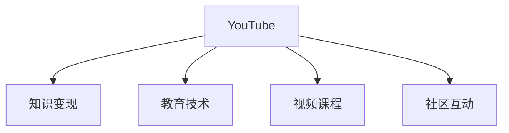

                 

# 程序员如何利用YouTube进行知识变现

> 关键词：YouTube, 知识变现, 教育技术, 视频课程, 社区互动, 广告收益

## 1. 背景介绍

随着互联网技术的飞速发展，在线教育市场迎来了爆发式增长。特别是在新冠疫情期间，人们更加依赖线上平台进行学习和培训。YouTube作为全球最大的视频分享平台，凭借其丰富的内容和多样的互动形式，成为了教育技术领域的明星。而作为程序员，如何利用YouTube进行知识变现，成为一个值得深思的问题。

本文将从多个角度探讨程序员如何通过YouTube平台，将专业知识转化为实际收益。从平台机制、内容创作、广告收益到社区互动，全面解析YouTube知识变现的完整攻略。

## 2. 核心概念与联系

### 2.1 核心概念概述

为了更好地理解程序员如何利用YouTube进行知识变现，本节将介绍几个关键概念：

- **YouTube**：全球最大的视频分享平台，拥有超过20亿活跃用户，涵盖了各行各业的专业知识分享。
- **知识变现**：将专业知识、技能、经验等转化为实际收益，包括广告收益、会员订阅费、课程销售、赞助等。
- **教育技术**：结合教育学和计算机技术，通过在线平台进行知识传播和教育的活动。
- **视频课程**：由专业教育者制作的在线教育内容，涵盖课程设计、讲授、互动等多个环节。
- **社区互动**：通过评论、直播、问答等形式，与观众建立深度互动，增强学习体验和参与感。

这些概念之间的逻辑关系可以通过以下Mermaid流程图来展示：



这个流程图展示了几大核心概念之间的连接关系：

1. YouTube为知识变现提供了平台。
2. 教育技术是知识变现的基础，通过专业的内容设计、讲授、互动等手段。
3. 视频课程是教育技术的一种具体实现，强调了内容和形式上的创新。
4. 社区互动则是知识变现的重要补充，通过增强观众的参与感和体验感，提升变现效果。

## 3. 核心算法原理 & 具体操作步骤

### 3.1 算法原理概述

YouTube知识变现的核心在于通过优质的内容吸引观众，通过平台提供的多种收益模式获得收益。其核心算法原理主要包括以下几个方面：

- **内容推荐算法**：YouTube通过分析用户观看历史和互动行为，推荐相关视频，增加观看量和观众粘性。
- **收益分配机制**：YouTube根据视频的观看次数、互动率、观众年龄性别等，进行收益分配，以最大化广告收入和会员订阅收益。
- **用户互动激励**：通过点赞、评论、分享等互动行为，提升视频的可见性和推荐度，增加收益。

### 3.2 算法步骤详解

以下将详细介绍YouTube知识变现的详细步骤：

**Step 1: 选择合适的视频主题和内容**

- 确定视频主题，选择与自身专业知识相关的领域。例如，如果你是一名前端开发工程师，可以选择Web开发、JavaScript、React等主题。
- 创作高质量视频内容，包括引言、正文、总结、互动等环节。使用视频剪辑软件进行专业制作，提升视觉效果和观众体验。

**Step 2: 发布和推广视频**

- 在YouTube上创建账户，设置视频标题、描述、标签等信息，使用户更容易搜索到你的视频。
- 使用YouTube提供的推广工具，如YouTube Ads，提升视频曝光量。可以设定广告预算、定向人群、广告时长等参数。
- 与观众互动，及时回复评论和私信，增加用户粘性。

**Step 3: 优化视频表现和观众体验**

- 分析观众反馈，调整视频内容和风格，增加观看量和订阅量。
- 优化视频标题和描述，增加SEO效果，提升搜索结果排名。
- 使用YouTube的社区功能，如直播、问答，与观众进行深度互动，提升用户体验和参与感。

**Step 4: 探索多样化的收益模式**

- 开启广告收益，YouTube会根据广告投放的点击率和观看时间进行收益分配。
- 开启会员订阅，用户可以支付月费，获取独家视频、直播、会员专属社区等特权。
- 销售视频课程，通过YouTube的付费课程功能，制作和销售在线教育内容。
- 接受赞助和品牌合作，与企业或品牌合作，获取品牌曝光和收益。

**Step 5: 数据分析和调整**

- 使用YouTube Analytics等工具，分析视频观看数据、观众互动数据等，了解视频表现和用户反馈。
- 根据分析结果，调整视频内容、推广策略等，持续优化变现效果。

### 3.3 算法优缺点

YouTube知识变现具有以下优点：

- **低门槛**：相较于其他平台，YouTube视频制作门槛较低，技术要求不高，适合各种技能水平的人。
- **广泛受众**：YouTube拥有全球用户，能够覆盖广泛的观众群体，扩大知识变现的潜力。
- **多种收益模式**：除了广告收益和会员订阅外，还可以结合课程销售、赞助等方式进行变现。

同时，该方法也存在一定的局限性：

- **竞争激烈**：YouTube内容丰富，但优秀内容稀少，竞争激烈。
- **收益不稳定**：收益受广告投放效果、观众互动等因素影响，收益不稳定性较大。
- **内容制作成本**：高质量的视频内容制作成本较高，需要投入时间和资金。

尽管存在这些局限性，但整体而言，YouTube知识变现方法仍然是一个相对简单且高效的变现途径，适合具备一定专业知识和技术技能的程序员。

### 3.4 算法应用领域

YouTube知识变现方法广泛适用于各个领域，以下是几个典型的应用场景：

- **技术教程**：包括编程语言、框架、工具等技术栈的深入讲解。
- **产品演示**：展示自己开发的产品或工具，通过演示提升产品知名度和市场认知。
- **行业分析**：分享行业动态、技术趋势、职业发展等，吸引对特定行业感兴趣的用户。
- **软技能培训**：如时间管理、沟通技巧、项目管理等，提升个人综合能力。
- **职业转型**：分享从一种职业向另一种职业转型的经验和技巧，帮助他人实现职业目标。

## 4. 数学模型和公式 & 详细讲解 & 举例说明

### 4.1 数学模型构建

YouTube知识变现的数学模型主要涉及视频观看次数、互动次数、广告点击率等指标，通过这些指标计算收益。设视频观看次数为$V$，广告点击次数为$A$，观众互动次数为$I$，则收益$R$可以表示为：

$$
R = \alpha V + \beta A + \gamma I
$$

其中$\alpha$、$\beta$、$\gamma$为收益系数，需要根据具体情况进行调整。

### 4.2 公式推导过程

1. **广告收益计算**：广告收益主要取决于广告点击次数和广告时长，假设广告时长为$t$，点击率为$k$，则广告收益$R_{ad}$为：
$$
R_{ad} = k \cdot A \cdot t
$$

2. **会员订阅收益计算**：假设订阅人数为$S$，月费为$m$，则订阅收益$R_{sub}$为：
$$
R_{sub} = S \cdot m
$$

3. **课程销售收益计算**：假设课程销售数量为$C$，课程售价为$p$，则课程销售收益$R_{course}$为：
$$
R_{course} = C \cdot p
$$

### 4.3 案例分析与讲解

以一位前端开发工程师为例，假设其视频的广告点击率为10%，广告时长为15秒，一个月内视频观看次数为10000，订阅人数为1000人，课程销售数量为500，售价为100元。根据上述公式，可以计算出如下收益：

- 广告收益：$R_{ad} = 0.1 \cdot 10000 \cdot 0.15 = 150$元
- 订阅收益：$R_{sub} = 1000 \cdot 10 = 10000$元
- 课程销售收益：$R_{course} = 500 \cdot 100 = 50000$元

总收益为：$R = 150 + 10000 + 50000 = 51150$元

## 5. 项目实践：代码实例和详细解释说明

### 5.1 开发环境搭建

在进行YouTube知识变现实践前，我们需要准备好开发环境。以下是使用Python进行YouTube API开发的流程：

1. 安装Google API客户端库：
```bash
pip install google-api-python-client
```

2. 创建YouTube API项目：登录Google Cloud Console，创建YouTube API项目，并生成API密钥。

3. 配置环境变量：将API密钥和项目ID等配置信息保存到环境变量中。

4. 编写测试代码：编写简单的Python代码，测试API连接和调用。

### 5.2 源代码详细实现

以下是一个简单的Python代码示例，用于获取YouTube频道信息：

```python
from googleapiclient.discovery import build

# 设置API密钥和项目ID
YOUTUBE_API_SERVICE_NAME = 'youtube'
YOUTUBE_API_VERSION = 'v3'
YOUTUBE_API_KEY = 'YOUR_API_KEY'
YOUTUBE_CHANNEL_ID = 'UCxx-8i1DzNgE54RbQxS5t-X8'

# 创建API客户端
youtube = build(YOUTUBE_API_SERVICE_NAME, YOUTUBE_API_VERSION, developerKey=YOUTUBE_API_KEY)

# 获取频道信息
response = youtube.channels().list(
    part='snippet',
    id=YOUTUBE_CHANNEL_ID).execute()

# 打印频道信息
print(response)
```

### 5.3 代码解读与分析

这个简单的代码示例展示了如何通过Google API客户端库，获取YouTube频道信息。在实际开发中，可以根据需要调用更多的YouTube API，如上传视频、发布频道、查看统计数据等，进行复杂的视频内容管理。

需要注意的是，YouTube API的使用需要遵守Google的API使用协议，保护用户隐私和数据安全，遵守API使用限制等。

### 5.4 运行结果展示

运行上述代码后，控制台将输出YouTube频道的详细信息，包括频道名称、频道ID、频道描述等。通过API，可以获取更多的频道数据，为内容创作和推广提供依据。

## 6. 实际应用场景

### 6.1 视频课程销售

YouTube视频课程销售是最常见的知识变现方式之一。通过制作高质量的视频课程，吸引特定领域的观众，实现高额收益。对于程序员来说，可以分享前端开发、后端开发、全栈开发等技术栈的课程，满足不同水平和需求的用户。

### 6.2 品牌合作和赞助

与品牌或企业合作，通过品牌曝光和赞助获得收益。例如，为某编程软件公司制作宣传视频，展示其功能和优势，获取广告费用和品牌推广机会。

### 6.3 直播互动

利用YouTube直播功能，与观众实时互动，进行技术分享、问题解答、编程实战等。直播不仅能提升观众参与感，还能通过打赏、广告等形式直接变现。

## 7. 工具和资源推荐

### 7.1 学习资源推荐

为了帮助程序员系统掌握YouTube知识变现的理论基础和实践技巧，这里推荐一些优质的学习资源：

1. YouTube官方文档：详细介绍了YouTube API的使用方法，包括视频上传、频道管理、数据分析等。
2. YouTube Creator Academy：官方提供的YouTube内容创作者培训课程，涵盖视频制作、广告投放、观众互动等多个方面。
3. Coursera《YouTube内容创作》课程：由知名教育机构提供的YouTube内容创作课程，涵盖视频规划、制作、推广等多个环节。
4. Udemy《YouTube广告优化》课程：通过实战演练，帮助学员提升YouTube广告投放的效果和收益。

通过对这些资源的学习实践，相信你一定能够快速掌握YouTube知识变现的精髓，并用于解决实际的变现问题。

### 7.2 开发工具推荐

高效的开发离不开优秀的工具支持。以下是几款用于YouTube知识变现开发的常用工具：

1. Python和Google API客户端库：使用Python进行YouTube API的开发，支持多种数据处理和分析功能。
2. YouTube Studio：YouTube官方的视频管理工具，提供视频发布、编辑、分析等一站式服务。
3. Trello和Slack：项目管理工具和团队协作工具，帮助团队高效进行内容创作和推广。
4. Google Analytics：YouTube提供的详细数据分析工具，帮助开发者了解观众行为和视频表现。

合理利用这些工具，可以显著提升YouTube知识变现的开发效率，加快创新迭代的步伐。

### 7.3 相关论文推荐

YouTube知识变现方法源自学界的持续研究。以下是几篇奠基性的相关论文，推荐阅读：

1. The Google YouTube Watching History Data: A Second-Order Differential Equation System for Data Integration, Implicit Modeling, and Analytics：分析YouTube观看历史数据，构建视频推荐和收益预测模型。
2. YouTube Channels: What Users See and How They View it：研究YouTube用户观看行为，优化视频推荐算法。
3. The Economics of YouTube: From Content Creation to Monetization：研究YouTube平台的经济模型，分析视频创作者和观众的收益和行为。

这些论文代表了大语言模型微调技术的发展脉络。通过学习这些前沿成果，可以帮助研究者把握学科前进方向，激发更多的创新灵感。

## 8. 总结：未来发展趋势与挑战

### 8.1 总结

本文对程序员如何利用YouTube进行知识变现进行了全面系统的介绍。首先阐述了知识变现的背景和意义，明确了YouTube在知识变现中的核心作用。其次，从原理到实践，详细讲解了YouTube知识变现的数学模型和操作步骤，给出了完整的知识变现实践代码示例。同时，本文还探讨了知识变现在视频课程销售、品牌合作、直播互动等多个实际应用场景中的应用前景，展示了YouTube知识变现的巨大潜力。此外，本文精选了知识变现技术的各类学习资源，力求为读者提供全方位的技术指引。

通过本文的系统梳理，可以看到，YouTube知识变现方法正在成为内容创作者和教育技术领域的重要范式，极大地拓展了内容创作者的变现渠道和方式。YouTube平台的丰富功能和多样化变现模式，使得内容创作者能够根据自身特点和需求，灵活选择变现方式，最大化收益。

### 8.2 未来发展趋势

展望未来，YouTube知识变现技术将呈现以下几个发展趋势：

1. **内容多样化**：除了视频课程，还将出现更多形式的知识内容，如直播、短视频、文章等，满足不同用户的需求。
2. **平台智能化**：利用AI技术进行内容推荐和观众分析，提升平台的用户体验和变现效果。
3. **多元化收益**：除了广告和会员订阅，还将出现更多创新的收益模式，如内容付费、专属会员、虚拟礼物等。
4. **跨平台联动**：YouTube与其他社交平台、电商平台联动，提供一体化的服务，增加变现渠道和机会。
5. **生态系统构建**：通过构建社区、建立品牌合作、参与行业活动等方式，提升内容创作者的知名度和影响力，形成良性生态。

以上趋势凸显了YouTube知识变现技术的广阔前景。这些方向的探索发展，必将进一步提升YouTube平台的变现能力和用户粘性，为内容创作者提供更广阔的发展空间。

### 8.3 面临的挑战

尽管YouTube知识变现技术已经取得了瞩目成就，但在迈向更加智能化、普适化应用的过程中，它仍面临诸多挑战：

1. **内容同质化**：大量内容创作者涌入平台，导致内容同质化现象严重，用户难以区分优质内容。
2. **流量获取难度**：新内容创作者难以获取初始流量，需要通过大量营销推广手段才能获得关注。
3. **收益不稳定**：收益受平台政策和观众互动等因素影响，收益不稳定性较大。
4. **技术门槛**：高质量视频制作和内容创新需要较高的技术水平，内容创作者需要具备一定的技术能力。
5. **用户粘性不足**：用户流失率较高，平台需要持续优化用户体验和互动形式，提升用户粘性。

尽管存在这些挑战，但整体而言，YouTube知识变现方法仍然是一个相对简单且高效的变现途径，适合具备一定专业知识和技术技能的程序员。

### 8.4 研究展望

面向未来，大语言模型微调技术还需要在以下几个方面寻求新的突破：

1. **内容创新**：持续创新视频内容，提升观众体验和满意度，吸引更多观众关注和互动。
2. **技术优化**：优化视频制作流程，降低成本，提高效率，提升内容质量。
3. **数据分析**：深入挖掘观众行为数据，进行精准营销和内容推荐，最大化变现效果。
4. **品牌合作**：与更多企业或品牌合作，提升品牌曝光和收益。
5. **社区建设**：通过社区功能增强用户粘性和参与感，提升平台活力和用户忠诚度。

这些研究方向的探索，必将引领YouTube知识变现技术迈向更高的台阶，为内容创作者提供更广阔的发展空间和更优质的变现机会。相信随着学界和产业界的共同努力，YouTube知识变现技术将不断进步，内容创作者能够更好地实现知识变现，推动教育技术和在线内容的繁荣发展。

## 9. 附录：常见问题与解答

**Q1：YouTube知识变现是否适用于所有内容创作者？**

A: YouTube知识变现适用于具备一定专业知识和技能的内容创作者，特别是擅长制作和传播高质量视频内容的创作者。但需要注意的是，内容创作需要投入大量时间和精力，需具备较强的技术和创作能力。

**Q2：如何提升YouTube视频的观看量？**

A: 提升观看量需要多方面努力：
1. 优化视频标题和描述，增加SEO效果。
2. 制作高质量视频内容，注重视觉效果和观众体验。
3. 利用YouTube广告投放工具，提升视频曝光量。
4. 积极与观众互动，增加观众粘性和参与感。
5. 定期更新视频内容，保持观众新鲜感。

**Q3：如何选择合适的YouTube广告投放策略？**

A: 选择合适的广告投放策略需要考虑多个因素：
1. 确定目标观众群体，进行定向投放。
2. 设置合理的广告预算和投放时间。
3. 选择适合的广告类型，如视频前贴片、视频广告、展示广告等。
4. 分析广告效果，及时调整策略。

**Q4：YouTube收益如何分配？**

A: YouTube的收益分配机制较为复杂，主要受以下几个因素影响：
1. 观看次数：视频观看次数越多，收益越高。
2. 互动次数：点赞、评论、分享等互动行为会提升视频的推荐度和观看量。
3. 广告投放效果：广告点击率和观看时长直接影响广告收益。
4. 观众年龄和性别：不同年龄段和性别的观众对视频内容的需求不同，收益也会有所差异。

**Q5：如何构建YouTube社区？**

A: 构建YouTube社区需要多方面努力：
1. 定期进行直播互动，与观众进行深度交流。
2. 通过评论和私信回复观众，增强互动感。
3. 创建专属群组或频道，形成固定观众群体。
4. 发布专属内容，满足观众的特定需求。

总之，YouTube知识变现需要内容创作者在内容创作、平台运营、观众互动等多个环节进行全面优化和调整，方能实现理想的变现效果。

---

作者：禅与计算机程序设计艺术 / Zen and the Art of Computer Programming

