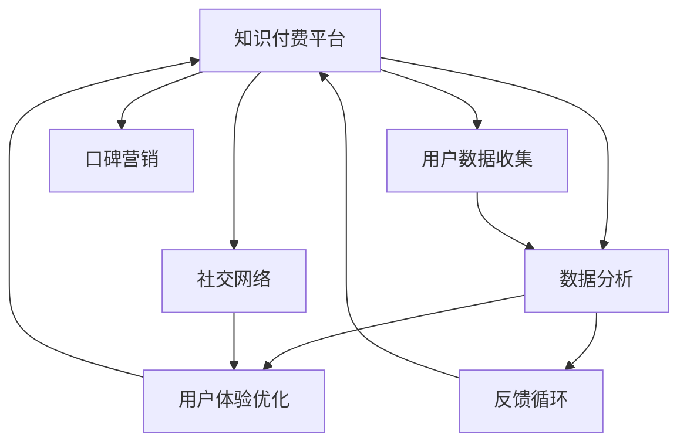

                 

# 程序员如何利用口碑营销推广知识付费

> 关键词：程序员, 知识付费, 口碑营销, 社交网络, 数据分析, 用户体验, 反馈循环

## 1. 背景介绍

在知识付费浪潮中，程序员作为专业技能要求高、职业发展需求迫切的一群人，面临着大量的知识获取需求。传统的教育模式已无法满足这一需求，知识付费平台应运而生。然而，如何有效推广知识付费产品，吸引程序员用户，成为平台运营商亟待解决的问题。本文将探讨如何利用口碑营销策略，提升知识付费平台的用户粘性和付费转化率。

## 2. 核心概念与联系

### 2.1 核心概念概述

在深入探讨如何利用口碑营销推广知识付费之前，需要先明确几个核心概念及其相互关系。

- **知识付费**：指通过付费获取知识或技术解决方案的商业模式。知识付费平台提供大量在线课程、技术文档、专家讲座等内容，用户需要付费才能获取这些资源。
- **口碑营销**：利用用户之间的自发传播来推广产品或服务。与传统广告相比，口碑营销更具真实性和可信度。
- **社交网络**：指通过社会关系链进行的交流和信息共享平台，如微信、LinkedIn、GitHub等。程序员经常使用社交网络进行技术交流和资源分享。
- **数据分析**：指通过收集和分析用户数据，以指导产品优化和营销策略的制定。
- **用户体验**：指用户在使用产品或服务时的感受和体验，良好的用户体验能提升用户满意度和忠诚度。
- **反馈循环**：指用户在产品使用过程中提供反馈，平台根据反馈优化产品和服务，从而形成正向循环。

这些概念构成了利用口碑营销推广知识付费的基础框架，通过这些工具和技术手段，可以提升平台的知名度和用户满意度，最终实现知识付费产品的成功推广。

### 2.2 核心概念联系的Mermaid流程图



这个流程图展示了核心概念之间的相互关系：

1. 知识付费平台收集用户数据，并利用数据分析优化用户体验。
2. 平台通过社交网络进行内容传播，提升用户粘性。
3. 用户反馈和社交互动帮助平台不断优化产品和服务。
4. 良好的用户体验和内容质量驱动口碑营销，吸引更多用户。

## 3. 核心算法原理 & 具体操作步骤

### 3.1 算法原理概述

利用口碑营销推广知识付费，本质上是通过社交网络的传播效应，将优质内容推荐给潜在用户，激发其购买欲望。算法原理包括以下几个关键环节：

1. **内容推荐**：通过用户行为数据和内容属性，为用户推荐相关课程和资料。
2. **社交网络分析**：利用社交网络结构分析用户群体特征，筛选具有高传播力的用户群体。
3. **反馈分析**：通过用户反馈，调整推荐算法和内容质量，提升用户体验。
4. **激励机制设计**：设计合适的激励机制，激励用户积极传播和评价内容。

### 3.2 算法步骤详解

**步骤1: 数据收集与用户画像构建**

- **数据来源**：收集用户在平台上的行为数据，包括课程浏览记录、购买行为、评价反馈等。
- **用户画像构建**：通过对数据的聚类分析和特征提取，构建用户画像，识别出对知识付费敏感的用户群体。

**步骤2: 内容推荐算法设计**

- **内容评估**：对课程和资料进行评分和评估，综合考虑用户反馈、课程难度和质量等因素。
- **推荐算法**：基于协同过滤、矩阵分解等算法，为用户推荐相关课程和资料。

**步骤3: 社交网络分析与传播力筛选**

- **社交网络分析**：通过分析用户社交网络结构，识别出具有高传播力的用户群体。
- **筛选传播力用户**：利用社交网络影响力指标，如粉丝数、互动率等，筛选出高传播力的种子用户。

**步骤4: 激励机制设计**

- **传播激励**：设计激励机制，如赠送优惠券、会员权益等，鼓励用户传播和评价内容。
- **评价激励**：对用户评价进行奖励，如积分、折扣等，提升评价质量。

**步骤5: 实施与效果监测**

- **实施推广**：通过社交网络向筛选出的传播力用户推广课程，设计有吸引力的内容标签和宣传文案。
- **效果监测**：收集推广效果数据，如新用户增长、课程购买率等，评估推广效果。

### 3.3 算法优缺点

**优点：**

1. **高可信度**：口碑营销基于用户间的真实反馈和信任，具有较高的可信度。
2. **低成本**：相比传统广告，口碑营销成本较低，效果显著。
3. **持续传播**：利用社交网络效应，口碑营销能够实现持续的传播和推广。

**缺点：**

1. **依赖用户**：口碑营销依赖于用户的主动传播，难以控制。
2. **传播速度慢**：传播速度和范围受限于社交网络结构，难以快速覆盖大量用户。
3. **用户偏执**：部分用户可能只关注某些意见领袖，对其他用户评价的接受度不高。

### 3.4 算法应用领域

利用口碑营销推广知识付费的方法，可以应用于各种知识付费平台，如在线教育、技术文档、专家讲座等。特别是在程序员群体中，这种方法具有更强的适用性。

## 4. 数学模型和公式 & 详细讲解 & 举例说明

### 4.1 数学模型构建

为了更好地理解和应用口碑营销算法，本文将构建一个简化的数学模型。设 $U$ 为平台用户集，$C$ 为课程内容集，$R$ 为行为数据集，$S$ 为社交网络结构。

**用户画像模型**：
$$ P_U = \text{Cluster}(R_U) $$
其中 $R_U$ 为用户的课程浏览记录、购买行为等行为数据集。

**内容评估模型**：
$$ S_C = \text{Rating}(C) $$
其中 $S_C$ 为课程内容评分，$C$ 为课程内容集。

**社交网络分析模型**：
$$ P_S = \text{Influence}(S) $$
其中 $P_S$ 为社交网络中具有高传播力的用户群体。

**推荐算法模型**：
$$ R_U' = \text{Recommend}(P_U, S_C) $$
其中 $R_U'$ 为推荐给用户 $P_U$ 的相关课程内容。

### 4.2 公式推导过程

**用户画像模型推导**：
$$ P_U = \text{Cluster}(R_U) $$
其中 $\text{Cluster}$ 为聚类算法，如K-means、层次聚类等。

**内容评估模型推导**：
$$ S_C = \text{Rating}(C) $$
其中 $\text{Rating}$ 为评分算法，如基于评分的回归模型。

**社交网络分析模型推导**：
$$ P_S = \text{Influence}(S) $$
其中 $\text{Influence}$ 为社交网络影响力指标计算算法。

**推荐算法模型推导**：
$$ R_U' = \text{Recommend}(P_U, S_C) $$
其中 $\text{Recommend}$ 为推荐算法，如基于协同过滤、矩阵分解等。

### 4.3 案例分析与讲解

假设某在线教育平台需要推广一门针对Java程序员的高级编程课程。

1. **数据收集与用户画像构建**：收集平台用户的历史行为数据，通过K-means聚类算法，识别出对Java编程课程感兴趣的程序员群体。

2. **内容推荐算法设计**：对课程进行评分，考虑用户评价、课程难度和内容质量等因素，设计推荐算法，为用户推荐相关Java编程课程。

3. **社交网络分析与传播力筛选**：分析用户社交网络结构，识别出具有高传播力的Java程序员用户，如GitHub上的知名开发者。

4. **激励机制设计**：设计传播激励机制，如提供课程优惠券，鼓励高传播力用户积极推广课程。

5. **实施与效果监测**：通过社交网络向筛选出的高传播力用户推广课程，收集推广效果数据，如新用户增长、课程购买率等。

## 5. 项目实践：代码实例和详细解释说明

### 5.1 开发环境搭建

在开始项目实践前，需要搭建相应的开发环境。以下是搭建环境的详细步骤：

1. **安装Python**：从官网下载并安装最新版本的Python，确保支持常用的第三方库。
2. **安装PyTorch**：作为深度学习的主流框架，PyTorch提供了强大的数据处理和模型训练能力。
3. **安装TensorFlow**：Google开源的深度学习框架，适合大规模工程应用。
4. **安装NumPy和Pandas**：用于数据处理和分析。
5. **安装scikit-learn**：用于机器学习和数据挖掘。
6. **安装Matplotlib和Seaborn**：用于数据可视化。

### 5.2 源代码详细实现

下面是一个简化的代码示例，展示了如何使用PyTorch和scikit-learn进行内容推荐和社交网络分析。

**用户画像构建**

```python
from sklearn.cluster import KMeans
import pandas as pd

# 假设R_U为用户的课程浏览记录
R_U = pd.read_csv('user_browsing_data.csv')
user_clusters = KMeans(n_clusters=5).fit_predict(R_U)
```

**内容评估**

```python
from sklearn.linear_model import Ridge
import pandas as pd

# 假设S_C为课程评分
S_C = pd.read_csv('course_ratings.csv')
course_scores = Ridge(alpha=0.1).fit(S_C['course'], S_C['score'])
```

**社交网络分析**

```python
import networkx as nx

# 假设S为社交网络结构
G = nx.Graph()
for u, v, w in S:
    G.add_edge(u, v, weight=w)
influential_users = nx.influence_scores(G)
```

**推荐算法**

```python
from sklearn.neighbors import NearestNeighbors

# 假设R_U为推荐用户集
R_U = pd.read_csv('recommended_users.csv')
nn = NearestNeighbors(algorithm='brute', n_neighbors=10)
nn.fit(R_U[['user', 'programming_skill']])
recommended_courses = nn.kneighbors(S_C, return_distance=False)
```

### 5.3 代码解读与分析

**用户画像构建**

- 使用K-means聚类算法，对用户的行为数据进行聚类，识别出对Java编程课程感兴趣的用户群体。

**内容评估**

- 使用Ridge回归模型，对课程评分进行预测，综合考虑课程难度和质量等因素。

**社交网络分析**

- 使用NetworkX库构建社交网络，计算各用户在社交网络中的影响力。

**推荐算法**

- 使用最近邻算法，为用户推荐相关Java编程课程。

### 5.4 运行结果展示

通过上述代码实现，可以得到以下结果：

- 用户画像：识别出对Java编程课程感兴趣的用户群体。
- 内容评估：对Java编程课程进行评分，综合考虑用户反馈和课程难度。
- 社交网络分析：识别出具有高传播力的Java程序员用户。
- 推荐算法：为用户推荐相关Java编程课程，提升课程购买率。

## 6. 实际应用场景

利用口碑营销推广知识付费的方法，在程序员群体中的应用场景十分广泛。以下是几个典型的应用场景：

### 6.1 程序员社区和论坛

程序员社区和论坛是程序员获取知识的重要渠道，通过在这些平台上推广知识付费产品，可以有效吸引用户关注。例如，在Stack Overflow和GitHub等平台上，发布高质量的编程课程，利用社交网络的传播效应，吸引程序员用户的注意。

### 6.2 开源项目和代码库

开源项目和代码库是程序员交流和分享的重要场所，通过在这些平台上推广知识付费产品，可以有效提升产品的曝光率。例如，在GitHub上推广高级编程课程，通过开源项目的贡献者进行传播，吸引更多的开发者关注。

### 6.3 技术博客和文章

技术博客和文章是程序员获取前沿技术的重要来源，通过在这些平台上推广知识付费产品，可以有效提升产品的可信度和吸引力。例如，在Medium和CSDN等技术博客平台上，发布高质量的编程课程介绍文章，吸引程序员用户关注。

### 6.4 未来应用展望

随着技术的发展，利用口碑营销推广知识付费的方法将不断演进。未来可能出现以下新的趋势：

1. **AI辅助推荐**：利用AI技术优化推荐算法，提升推荐精度。
2. **实时反馈调整**：实时收集用户反馈，动态调整推荐策略。
3. **多渠道推广**：利用社交网络、邮件、短信等多渠道进行推广，扩大传播范围。
4. **个性化激励**：根据用户行为数据，设计个性化的激励机制，提升用户传播意愿。
5. **知识图谱融合**：将知识图谱和推荐算法结合，提升推荐效果。

## 7. 工具和资源推荐

### 7.1 学习资源推荐

为了更好地掌握利用口碑营销推广知识付费的方法，推荐以下学习资源：

1. **《深度学习理论与实践》**：全面介绍深度学习的基本理论和实践方法，包括推荐系统、社交网络分析等。
2. **《机器学习实战》**：通过实际案例介绍机器学习算法和应用，涵盖推荐系统和社交网络分析。
3. **《Python数据科学手册》**：详细讲解Python数据科学库的使用，包括NumPy、Pandas、scikit-learn等。
4. **Coursera《数据科学与机器学习》课程**：由斯坦福大学开设的机器学习课程，涵盖推荐系统、社交网络分析等内容。
5. **edX《数据分析与可视化》课程**：由麻省理工学院开设的数据分析课程，涵盖数据处理、可视化等内容。

### 7.2 开发工具推荐

以下是一些常用的开发工具，帮助程序员进行利用口碑营销推广知识付费的实践：

1. **Jupyter Notebook**：免费的交互式开发环境，适合快速迭代实验和数据分析。
2. **PyTorch**：开源的深度学习框架，适合大规模模型的训练和优化。
3. **TensorFlow**：开源的深度学习框架，适合大规模工程应用。
4. **Keras**：高层次的深度学习API，适合快速搭建和训练模型。
5. **Scikit-learn**：常用的机器学习库，适合数据处理和分析。
6. **Pandas**：常用的数据处理库，适合大规模数据集的处理。

### 7.3 相关论文推荐

为了深入了解利用口碑营销推广知识付费的方法，推荐以下相关论文：

1. **《基于社交网络的知识发现与推荐》**：研究基于社交网络的知识推荐方法，提升推荐效果。
2. **《利用机器学习进行在线教育用户画像构建》**：探讨用户画像的构建方法和应用场景。
3. **《利用口碑营销提升在线教育平台的用户粘性和转化率》**：分析口碑营销在在线教育平台上的应用效果。
4. **《社交网络中的知识传播与推荐算法》**：研究社交网络中的知识传播机制，提升推荐算法的效果。
5. **《基于用户反馈的在线教育推荐系统》**：研究用户反馈对推荐系统的影响，提升用户体验。

## 8. 总结：未来发展趋势与挑战

### 8.1 研究成果总结

利用口碑营销推广知识付费的方法，已经在实践中取得了显著效果。通过社交网络的传播效应，可以有效提升知识付费产品的曝光率和用户粘性。未来的研究将继续探索如何优化推荐算法，提升用户满意度和转化率。

### 8.2 未来发展趋势

未来利用口碑营销推广知识付费的方法将呈现以下趋势：

1. **AI技术的应用**：利用AI技术优化推荐算法和社交网络分析，提升推荐效果和用户传播意愿。
2. **多渠道推广**：通过多种渠道进行推广，扩大传播范围和用户覆盖面。
3. **个性化激励**：根据用户行为数据，设计个性化的激励机制，提升用户传播意愿。
4. **实时反馈调整**：实时收集用户反馈，动态调整推荐策略，提升用户体验。

### 8.3 面临的挑战

尽管利用口碑营销推广知识付费的方法已经取得了一定成效，但仍面临以下挑战：

1. **用户行为数据隐私**：如何保护用户行为数据隐私，确保用户数据安全。
2. **模型公平性**：如何避免模型偏见，确保推荐结果的公平性。
3. **多平台整合**：如何整合不同平台的数据和资源，提升推广效果。
4. **用户体验优化**：如何优化用户体验，提升用户满意度和忠诚度。

### 8.4 研究展望

未来，利用口碑营销推广知识付费的方法需要在以下方面进行深入研究：

1. **数据隐私保护**：研究数据隐私保护技术，确保用户数据安全。
2. **模型公平性**：研究模型公平性算法，提升推荐结果的公平性。
3. **多平台整合**：研究多平台数据整合和资源共享技术，提升推广效果。
4. **用户体验优化**：研究用户体验优化技术，提升用户满意度和忠诚度。

## 9. 附录：常见问题与解答

**Q1：如何收集用户行为数据？**

A: 通过用户在平台上的浏览记录、购买行为、评价反馈等，可以收集到详细的用户行为数据。平台可以通过API接口或日志记录的方式获取这些数据。

**Q2：如何评估课程内容质量？**

A: 可以利用用户评分、专家评测、课程评价等多种方法，综合评估课程内容质量。具体评估指标包括课程难度、内容深度、用户反馈等。

**Q3：如何筛选高传播力用户？**

A: 可以利用社交网络影响力指标，如粉丝数、互动率等，筛选出具有高传播力的用户。可以通过网络分析工具，如Gephi、Cytoscape等，进行社交网络分析。

**Q4：如何设计激励机制？**

A: 可以设计多种激励机制，如赠送优惠券、会员权益等，鼓励用户积极传播和评价内容。还可以设置积分系统，对积极传播的用户进行积分奖励。

**Q5：如何保证用户数据隐私？**

A: 可以采用数据加密、匿名化处理等技术手段，保护用户行为数据隐私。同时，制定明确的数据隐私政策，告知用户数据的使用方式和保护措施。

总之，利用口碑营销推广知识付费的方法，可以在程序员群体中产生显著的推广效果。通过有效的推荐算法和激励机制，吸引更多的程序员用户关注和购买知识付费产品，从而推动知识付费行业的健康发展。

---

作者：禅与计算机程序设计艺术 / Zen and the Art of Computer Programming

