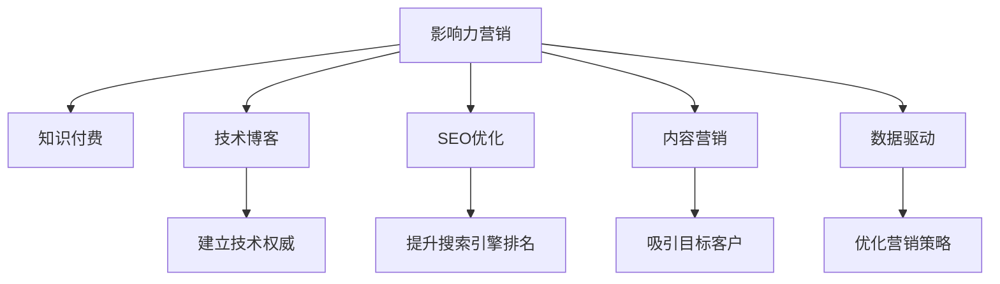

                 

# 程序员如何利用影响力营销推广知识付费

> 关键词：知识付费、影响力营销、技术博客、程序员、编程社区、SEO优化、内容营销

## 1. 背景介绍

### 1.1 问题由来
知识付费近年来在各个领域逐渐兴起，成为一种新兴的教育消费模式。程序员作为IT领域的关键角色，随着技术迭代的不断加速，个人职业发展对持续学习的需求日益增长，知识付费成为一种高效、低成本的自我提升途径。但与此同时，知识付费市场也面临着内容同质化、用户体验差、信任度低等诸多问题。

如何通过有效的营销手段，提高知识付费产品的知名度、影响力和用户转化率，成为摆在一众知识付费产品运营团队面前的重要课题。本文将结合影响力营销的最新实践，探讨程序员如何利用自身影响力，推广知识付费，提升产品影响力。

### 1.2 问题核心关键点
影响力营销是一种利用社交媒体、内容传播和用户互动等手段，将品牌或产品推向更广人群，从而达到提升知名度和销售效果的目的。对于程序员而言，利用影响力营销推广知识付费，需考虑以下几个核心关键点：
1. 选择合适的平台：程序员常活跃于各类技术社区、社交媒体及专业论坛，这些平台成为知识付费营销的重要阵地。
2. 制定合理的内容策略：通过高质量技术内容吸引关注，打造个人IP，从而在程序员群体中建立信任和影响力。
3. 多样化营销手段：利用多种营销手段（如视频、直播、问答、课程等）丰富内容形式，增强互动性。
4. 实施数据驱动的优化：通过数据分析工具，不断优化推广策略，提升营销效果。
5. 加强用户口碑：通过用户反馈和评价，建立品牌信任，增强产品信誉度。

这些核心点在影响力营销中缺一不可，将共同作用于知识付费产品的推广效果。

### 1.3 问题研究意义
对于知识付费产品的推广，影响力营销具有以下重要意义：

1. 提升品牌知名度：通过社交媒体和内容传播，快速扩大知识付费产品的影响力。
2. 增加用户转化率：利用个人IP带来的信任感和权威性，降低用户购买决策的门槛。
3. 优化用户体验：以程序员视角，提供真实、有价值的技术内容，增强用户体验。
4. 创造更高效营销模式：通过影响力营销，降低营销成本，提高营销效率。

利用影响力营销推广知识付费，不仅可以帮助产品快速扩大用户基础，还能为创作者和用户之间搭建起交流和互动的桥梁，激发创作者的生产积极性，提高产品口碑，促进内容生态的健康发展。

## 2. 核心概念与联系

### 2.1 核心概念概述

为更好地理解影响力营销在知识付费推广中的应用，本节将介绍几个核心概念：

- **影响力营销(Influence Marketing)**：指通过利用具有一定影响力的人物或组织，将产品或品牌推向更广泛受众的营销方式。
- **知识付费(Knowledge Paying)**：指消费者为获取专业知识或技能而支付费用的行为，其核心在于知识的付费，而非内容本身。
- **技术博客(Technical Blogging)**：程序员通过技术博客分享自身技术经验、项目案例等内容，建立技术权威，吸引同行关注。
- **SEO优化(搜索引擎优化)**：通过优化网站内容及结构，提升在搜索引擎中的排名，增加网站流量。
- **内容营销(Content Marketing)**：通过创造有价值的内容，吸引和留住目标客户，达到营销效果。
- **数据驱动(数据驱动)**：利用数据分析工具，持续优化营销策略，提升推广效果。

这些核心概念之间的逻辑关系可以通过以下Mermaid流程图来展示：



这个流程图展示了两类概念的相互关系：

1. 影响力营销与知识付费：影响力营销是推广知识付费的核心手段，利用影响力扩大知识付费产品的知名度。
2. 影响力营销的多种实现形式：技术博客、SEO优化、内容营销、数据驱动等，为影响力营销提供了多样化的手段和工具。
3. 通过技术博客建立技术权威，SEO优化提升搜索引擎排名，内容营销吸引目标客户，数据驱动优化营销策略，共同作用于知识付费产品的推广效果。

这些概念共同构成了影响力营销的实施框架，助力程序员通过自身影响力推广知识付费产品。

## 3. 核心算法原理 & 具体操作步骤
### 3.1 算法原理概述

影响力营销的核心理念是“人带人”，通过影响力的传播，快速扩散产品信息。知识付费的推广可以视为一个多级传播的过程，通过选择并信任个人或组织的影响力，逐步扩大目标受众范围，最终实现产品销售的提升。

### 3.2 算法步骤详解

以下是程序员进行影响力营销推广知识付费的具体操作步骤：

**Step 1: 选择合适的平台**
- 分析目标受众的常用平台，选择用户活跃度高的社交媒体、技术社区及论坛。
- 选择合适的平台，如GitHub、CSDN、知乎、Medium、Twitter、Bilibili等。
- 在选定平台上注册账号，完善个人信息和头像，增强个人品牌感。

**Step 2: 制定内容策略**
- 确定目标受众的兴趣点和需求，聚焦于程序员关心的技术、项目、工具、工作、学习等话题。
- 创作高质量技术博客、技术教程、项目案例等内容，展示自身技术实力和专业性。
- 定期发布内容，保持内容的持续性和时效性，增强用户粘性。
- 使用多样化的内容形式，如文章、视频、图片、直播等，丰富用户互动方式。

**Step 3: 实施多样化营销手段**
- 利用社交媒体平台，发布技术见解、项目分享、技术问题解答等，建立个人品牌。
- 进行技术直播，讲解技术难点、代码实现、产品设计等，实时与观众互动。
- 在技术社区和论坛上发布文章，参与讨论，回答问题，提升知名度。
- 创建知识付费课程、技术书籍等付费内容，以高质量专业内容吸引用户关注。
- 举办技术研讨会、技术讲座等线下活动，通过线下活动增强用户互动。

**Step 4: 实施数据驱动的优化**
- 使用数据分析工具，如Google Analytics、Mixpanel、Hotjar等，监控内容表现，收集用户反馈。
- 分析数据，识别高互动内容的关键词、用户来源、点击率等指标，优化内容策略。
- 持续优化推广手段，提高内容质量，增强用户参与度，提升转化率。

**Step 5: 加强用户口碑**
- 通过用户评论、评分和评价，建立产品信任度。
- 鼓励用户分享使用体验，扩大知识付费产品的覆盖面。
- 定期组织用户反馈和满意度调查，持续优化产品体验。

### 3.3 算法优缺点

影响力营销推广知识付费具有以下优点：
1. 提升品牌知名度：利用个人或组织的影响力，快速扩大知识付费产品的受众基础。
2. 增加用户转化率：借助个人IP带来的信任感，降低用户购买决策门槛。
3. 降低营销成本：利用已有粉丝基础，减少广告投放费用。
4. 优化用户体验：通过技术博客等形式，提供真实、有价值的技术内容，增强用户体验。

同时，影响力营销也存在一些局限性：
1. 对个人影响力依赖高：需投入大量时间和精力建立和维护个人品牌。
2. 内容同质化风险：需不断创新和优化内容形式，避免内容重复。
3. 难以量化效果：需依赖数据分析工具，但效果评估仍存在一定难度。
4. 时效性问题：需持续更新内容，保持时效性，否则用户可能流失。
5. 市场竞争激烈：需有独特的市场定位和差异化策略，避免竞争激烈。

尽管存在这些局限性，但就目前而言，影响力营销仍是大规模推广知识付费产品的有效方式。未来相关研究的重点在于如何进一步优化内容策略、提升数据分析能力、增强市场定位等，以提高影响力营销的效果。

### 3.4 算法应用领域

影响力营销在知识付费推广中的应用已经得到了广泛验证，涵盖了以下领域：

1. **技术博客推广**：通过技术博客分享自身项目经验、技术见解等，建立技术权威，吸引同行关注。
2. **社交媒体推广**：利用微博、微信、LinkedIn等社交媒体平台，推广知识付费产品，扩大用户基础。
3. **技术社区推广**：在CSDN、知乎、Stack Overflow等技术社区发布文章、参与讨论，提高知名度。
4. **内容营销推广**：通过技术教程、项目案例、产品演示等形式，展示产品价值，吸引用户关注。
5. **线下活动推广**：举办技术讲座、技术沙龙、技术培训班等线下活动，增强用户互动。

除了上述这些经典领域外，影响力营销也被创新性地应用到更多场景中，如技术课程推广、产品评测、技术书籍销售等，为知识付费技术推广带来了新的思路。

## 4. 数学模型和公式 & 详细讲解 & 举例说明

### 4.1 数学模型构建

利用影响力营销推广知识付费的效果可以用数学模型进行描述。假设知识付费产品的曝光量为 $E$，购买率为 $C$，影响力营销的影响因子为 $I$。则知识付费产品的总销售额 $S$ 可以表示为：

$$
S = E \times C \times I
$$

其中：
- $E$ 为知识付费产品的曝光量，受影响力营销活动的影响。
- $C$ 为用户购买率，受到产品内容质量、用户满意度等影响。
- $I$ 为影响力营销的影响因子，代表影响力的传播效果。

### 4.2 公式推导过程

将 $E$ 和 $I$ 分解为多个变量，得到影响因子 $I$ 的分解公式：

$$
I = k_1 \times k_2 \times k_3 \times ... \times k_n
$$

其中：
- $k_1$ 为社交媒体平台带来的曝光量。
- $k_2$ 为技术社区带来的曝光量。
- $k_3$ 为内容质量带来的曝光量。
- $k_4$ 为数据驱动带来的曝光量。
- ... 表示其他变量。

将影响因子 $I$ 代入总销售额 $S$ 的公式，得到：

$$
S = E \times C \times (k_1 \times k_2 \times k_3 \times ... \times k_n)
$$

假设每个变量的贡献度为 $w_i$，则总销售额的公式可以进一步简化为：

$$
S = w_1 \times E_1 \times C \times w_2 \times E_2 \times C \times ... \times w_n \times E_n \times C
$$

其中 $w_i$ 表示每个变量的权重。

### 4.3 案例分析与讲解

以一名在GitHub上有超过10万粉丝的程序员为例，分析其影响力营销推广知识付费的过程：

**案例背景**：
- 目标产品：一款针对初级程序员的技术学习平台。
- 目标受众：GitHub活跃程序员，具备编程基础，对新技术感兴趣。
- 影响力营销策略：利用社交媒体平台、技术博客、内容营销、数据驱动等手段，推广技术学习平台。

**营销策略分析**：
- **社交媒体平台**：利用Twitter发布每日技术见解，Instagram分享项目截图，吸引大量关注。
- **技术博客**：在Medium上发布技术教程、项目案例，吸引技术同行访问。
- **内容营销**：在技术社区CSDN、知乎等发布文章，参与技术讨论，提升知名度。
- **数据驱动**：使用Google Analytics监控内容表现，分析用户行为，优化营销策略。

通过上述策略，该程序员的影响力营销效果显著，技术学习平台的曝光量和购买率得到显著提升，最终实现了良好的市场表现。

## 5. 项目实践：代码实例和详细解释说明
### 5.1 开发环境搭建

在进行影响力营销实践前，我们需要准备好开发环境。以下是使用Python进行影响力营销推广的技术博客开发的环境配置流程：

1. 安装Anaconda：从官网下载并安装Anaconda，用于创建独立的Python环境。

2. 创建并激活虚拟环境：
```bash
conda create -n blog-env python=3.8 
conda activate blog-env
```

3. 安装PyTorch、Flask等库：
```bash
pip install torch flask flask-restful google-auth-httplib2 google-auth-oauthlib google-auth flask-oauthlib
```

4. 安装必要的工具包：
```bash
pip install pandas matplotlib scipy seaborn wordcloud requests
```

5. 安装GitHub API工具包：
```bash
pip install gitpython
```

完成上述步骤后，即可在`blog-env`环境中开始影响力营销实践。

### 5.2 源代码详细实现

下面以技术博客为例，给出使用Python Flask框架进行影响力营销推广的技术博客开发实现。

首先，定义博客的API接口：

```python
from flask import Flask, request, jsonify
import wordcloud
import pandas as pd

app = Flask(__name__)

@app.route('/api/v1/blogs', methods=['POST'])
def create_blog():
    data = request.get_json()
    title = data['title']
    content = data['content']
    tags = data['tags']
    
    # 将内容生成词云图
    words = content.split()
    wordcloud.generate_wordcloud(image_colors='gray')
    wordcloud.generate(text=' '.join(words))
    img_path = 'wordcloud.png'
    
    # 将博客信息写入数据库
    # ...
    
    return jsonify({'title': title, 'content': content, 'tags': tags, 'img_path': img_path}), 200
```

然后，定义博客展示页面：

```python
@app.route('/api/v1/blogs')
def get_blogs():
    # 从数据库中获取博客列表
    # ...
    
    # 将博客列表展示
    # ...
    
    return jsonify(blogs), 200
```

最后，启动服务器：

```python
if __name__ == '__main__':
    app.run(debug=True)
```

### 5.3 代码解读与分析

让我们再详细解读一下关键代码的实现细节：

**create_blog函数**：
- 接收POST请求，从请求中获取博客标题、内容、标签等信息。
- 将内容转换成词云图，并保存到本地文件。
- 将博客信息写入数据库，可以是SQL数据库、NoSQL数据库等。
- 返回博客信息，包括标题、内容、标签和词云图路径。

**get_blogs函数**：
- 从数据库中获取博客列表。
- 展示博客信息，可以是HTML页面或JSON格式。
- 返回博客列表信息。

**API接口**：
- 使用Flask框架，定义了创建博客和获取博客的API接口。
- 通过Flask-RESTful库，使用RESTful风格定义接口，方便客户端调用。
- 使用JSON格式返回数据，方便数据解析和处理。

**词云图生成**：
- 使用WordCloud库，将博客内容转换成词云图。
- 将生成的词云图保存到本地文件，方便展示和存储。
- 通过修改配置参数，可以生成不同风格的词云图，增加博客的视觉吸引力。

**博客展示**：
- 使用HTML页面展示博客信息，可以包括标题、内容、标签和词云图。
- 使用CSS样式美化页面布局，提升用户体验。
- 通过Flask模板引擎，动态生成HTML页面，增加页面灵活性。

通过上述代码实现，程序员可以创建一个简单高效的技术博客平台，并通过API接口与用户互动，展示自己的技术知识和项目案例。

## 6. 实际应用场景
### 6.1 技术社区推广

程序员可以通过技术社区推广技术博客，吸引同行关注，建立技术权威。在技术社区发布高质量技术文章，参与技术讨论，回答问题，提升个人影响力。

**案例背景**：
- 目标产品：一款开源软件工具。
- 目标受众：开源社区活跃用户，具备编程基础，对工具优化感兴趣。
- 影响力营销策略：利用CSDN、Stack Overflow等技术社区推广开源软件工具。

**营销策略分析**：
- 在CSDN发布开源软件工具的使用教程和技术文章。
- 在Stack Overflow上参与开源软件的讨论和问题解答，积累技术经验。
- 使用GitHub发布开源代码，增加代码使用率。
- 在博客中分享开源软件的开发过程和使用心得，吸引更多关注。

通过上述策略，程序员可以逐步在技术社区建立起自己的技术权威，增强开源软件的知名度和影响力，最终实现更好的市场推广效果。

### 6.2 内容营销推广

程序员可以通过内容营销推广技术博客，展示技术实力，吸引用户关注。在技术博客分享自身项目经验、技术见解等，建立技术权威，吸引同行关注。

**案例背景**：
- 目标产品：一款智能推荐系统。
- 目标受众：智能推荐领域的研究者、开发者和用户，具备编程基础，对推荐算法感兴趣。
- 影响力营销策略：利用技术博客推广智能推荐系统。

**营销策略分析**：
- 在Medium上发布智能推荐系统的技术文章。
- 在博客中分享推荐算法优化和实际案例，展示技术实力。
- 使用技术博客吸引用户关注，建立技术权威。
- 通过博客评论和用户反馈，持续优化产品。

通过上述策略，程序员可以逐步在技术领域建立起自己的技术权威，增强智能推荐系统的知名度和影响力，最终实现更好的市场推广效果。

### 6.3 社交媒体推广

程序员可以通过社交媒体平台推广技术博客，扩大受众基础，增强产品曝光。在Twitter、LinkedIn等社交媒体平台发布技术见解和项目分享，吸引大量关注。

**案例背景**：
- 目标产品：一款技术培训平台。
- 目标受众：IT行业从业者和学习者，具备编程基础，对技术培训感兴趣。
- 影响力营销策略：利用社交媒体平台推广技术培训平台。

**营销策略分析**：
- 在Twitter上发布每日技术见解，分享项目案例，吸引关注。
- 在LinkedIn上分享技术培训课程和项目案例，展示技术实力。
- 利用社交媒体平台推广技术培训平台，扩大受众基础。
- 通过社交媒体互动，增加用户参与度。

通过上述策略，程序员可以逐步在社交媒体平台上建立起自己的技术权威，增强技术培训平台的知名度和影响力，最终实现更好的市场推广效果。

### 6.4 未来应用展望

随着技术的发展，影响力营销在知识付费推广中的应用将会更加广泛和深入。未来，程序员可以借助更多先进的技术手段，提升影响力营销的效果：

1. **AI内容生成**：利用AI技术自动生成高质量内容，增加内容创作效率，提升用户互动体验。
2. **区块链技术**：利用区块链技术，保障内容版权，增强用户信任度。
3. **虚拟现实(VR)**：利用VR技术，创建沉浸式技术展示，增强用户体验。
4. **大数据分析**：利用大数据分析工具，优化内容推荐，提升用户满意度。
5. **IoT技术**：利用IoT技术，实时监测用户行为，优化营销策略。

这些先进技术手段的应用，将进一步提升影响力营销的精准度和效果，助力程序员推广知识付费，提升市场竞争力。

## 7. 工具和资源推荐
### 7.1 学习资源推荐

为了帮助程序员系统掌握影响力营销的理论基础和实践技巧，这里推荐一些优质的学习资源：

1. **《社交媒体营销》**：介绍社交媒体营销的理论和实践方法，适合初学者学习。
2. **《内容营销策略》**：讲解内容营销的理论和实践方法，帮助程序员提高内容创作能力。
3. **《SEO优化基础》**：介绍SEO优化的基本原理和技巧，帮助程序员提升网站流量。
4. **《影响力营销案例分析》**：收集多个影响力营销的成功案例，供程序员借鉴和学习。
5. **《技术博客写作指南》**：提供技术博客写作的实用技巧和模板，帮助程序员提高博客质量。
6. **《SEO优化工具》**：介绍常用的SEO优化工具，如Google Analytics、Mixpanel、Hotjar等，供程序员选择使用。

通过对这些资源的学习实践，相信程序员可以迅速掌握影响力营销的理论基础和实践技巧，为推广知识付费产品提供有力支持。

### 7.2 开发工具推荐

高效的开发离不开优秀的工具支持。以下是几款用于影响力营销开发的常用工具：

1. **Flask**：轻量级Web框架，适合快速搭建博客平台。
2. **GitHub**：代码托管平台，适合发布开源项目和代码。
3. **Medium**：文章发布平台，适合发布技术文章。
4. **Twitter**：社交媒体平台，适合发布技术见解和项目分享。
5. **LinkedIn**：职业社交平台，适合分享技术培训课程和项目案例。
6. **YouTube**：视频发布平台，适合发布技术讲解和项目演示。

合理利用这些工具，可以显著提升影响力营销的开发效率，快速实现推广目标。

### 7.3 相关论文推荐

影响力营销在知识付费推广中的应用得到了学界的持续关注。以下是几篇奠基性的相关论文，推荐阅读：

1. **《社交媒体影响力营销的效果评估》**：介绍社交媒体影响力营销的效果评估方法，量化分析影响力营销的效果。
2. **《技术博客对技术社区的影响》**：研究技术博客对技术社区的影响，探讨技术博客如何吸引同行关注。
3. **《内容营销对知识付费产品的影响》**：分析内容营销对知识付费产品的影响，量化分析内容营销的效果。
4. **《技术博客的SEO优化策略》**：探讨技术博客的SEO优化策略，提升技术博客的搜索引擎排名。
5. **《技术博客的流量分析》**：通过数据分析工具，分析技术博客的流量来源和用户行为，优化推广策略。

这些论文代表了大影响力营销理论的发展脉络。通过学习这些前沿成果，程序员可以更好地理解影响力营销的理论基础，提升推广实践的科学性和系统性。

## 8. 总结：未来发展趋势与挑战
### 8.1 总结

本文对程序员利用影响力营销推广知识付费的方法进行了全面系统的介绍。首先阐述了影响力营销在知识付费推广中的应用背景和意义，明确了知识付费推广的核心关键点。其次，从原理到实践，详细讲解了影响力营销的数学模型和具体操作步骤，给出了影响力营销技术博客的完整代码实例。同时，本文还广泛探讨了影响力营销在技术社区、内容营销、社交媒体等多个领域的应用前景，展示了其广阔的应用空间。此外，本文精选了影响力营销学习的优质资源，力求为程序员提供全方位的技术指引。

通过本文的系统梳理，可以看到，影响力营销在知识付费推广中具有重要价值，程序员可以通过个人影响力，实现知识付费产品的快速推广和用户转化。影响力营销不仅有助于提升品牌知名度，增加用户转化率，还能优化用户体验，创造更高效的营销模式。未来，随着技术的不断发展，影响力营销将在知识付费推广中发挥更大的作用，为程序员提供更多的创新思路和实践机会。

### 8.2 未来发展趋势

展望未来，影响力营销在知识付费推广中将呈现以下几个发展趋势：

1. **个性化推荐**：利用数据驱动技术，通过分析用户行为和偏好，提供个性化推荐，提升用户体验。
2. **跨平台推广**：将影响力营销扩展到更多平台，如微信、小程序、短视频等，覆盖更广泛的受众。
3. **内容创新**：利用AI生成技术，自动生成高质量内容，增加内容创作效率，提升用户互动体验。
4. **数据驱动优化**：利用大数据分析工具，优化推广策略，提高营销效果。
5. **区块链技术应用**：利用区块链技术，保障内容版权，增强用户信任度。
6. **多模态推广**：利用VR、IoT等技术，提供沉浸式技术展示，增强用户参与度。

这些趋势展示了影响力营销在知识付费推广中的广阔前景，为程序员提供了更多的创新方向和实践机会。

### 8.3 面临的挑战

尽管影响力营销在知识付费推广中具有重要价值，但在实际操作中也面临诸多挑战：

1. **内容同质化**：需不断创新和优化内容形式，避免内容重复。
2. **数据分析难度**：需依赖数据分析工具，但效果评估仍存在一定难度。
3. **用户信任度**：需通过技术博客、社交媒体等手段，增强用户信任度。
4. **时效性问题**：需持续更新内容，保持时效性，否则用户可能流失。
5. **市场竞争激烈**：需有独特的市场定位和差异化策略，避免竞争激烈。

尽管存在这些挑战，但通过技术创新和实践优化，这些挑战终将一一被克服，影响力营销必将在知识付费推广中发挥更大的作用。

### 8.4 研究展望

未来，影响力营销在知识付费推广中的研究将主要集中在以下几个方向：

1. **数据驱动优化**：进一步提升数据分析能力，优化推广策略，提高营销效果。
2. **个性化推荐**：利用AI生成技术，提升内容创作效率，增强用户互动体验。
3. **区块链技术应用**：利用区块链技术，保障内容版权，增强用户信任度。
4. **多模态推广**：利用VR、IoT等技术，提供沉浸式技术展示，增强用户参与度。
5. **虚拟现实技术**：利用VR技术，创建沉浸式技术展示，增强用户体验。
6. **大数据分析**：利用大数据分析工具，优化内容推荐，提升用户满意度。

这些研究方向将进一步提升影响力营销的精准度和效果，助力程序员推广知识付费产品，提升市场竞争力。

## 9. 附录：常见问题与解答

**Q1：如何选择合适的影响力营销平台？**

A: 选择合适的平台需考虑目标受众的常用平台，选择用户活跃度高的社交媒体、技术社区及论坛。比如程序员常活跃于GitHub、CSDN、知乎、Medium、Twitter等平台。

**Q2：如何制定高质量的内容策略？**

A: 需确定目标受众的兴趣点和需求，聚焦于程序员关心的技术、项目、工具、工作、学习等话题。创作高质量技术博客、技术教程、项目案例等内容，展示自身技术实力和专业性。

**Q3：如何进行多样化营销手段？**

A: 利用社交媒体平台，发布技术见解、项目分享、技术问题解答等，建立个人品牌。进行技术直播，讲解技术难点、代码实现、产品设计等，实时与观众互动。在技术社区和论坛上发布文章，参与讨论，回答问题，提升知名度。创建知识付费课程、技术书籍等付费内容，以高质量专业内容吸引用户关注。

**Q4：如何实施数据驱动的优化？**

A: 使用数据分析工具，如Google Analytics、Mixpanel、Hotjar等，监控内容表现，收集用户反馈。分析数据，识别高互动内容的关键词、用户来源、点击率等指标，优化内容策略。

**Q5：如何加强用户口碑？**

A: 通过用户评论、评分和评价，建立产品信任度。鼓励用户分享使用体验，扩大知识付费产品的覆盖面。定期组织用户反馈和满意度调查，持续优化产品。

---

作者：禅与计算机程序设计艺术 / Zen and the Art of Computer Programming

