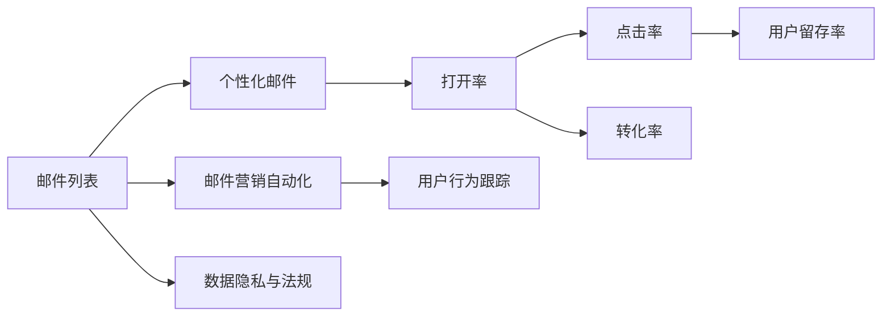
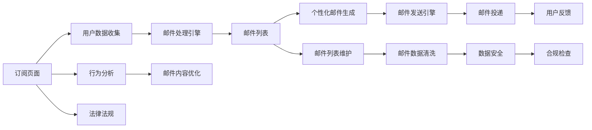

                 

# 程序员如何利用电子邮件营销进行知识付费

## 1. 背景介绍

随着互联网的迅猛发展，知识付费已成为一个蓬勃发展的市场。这种模式让知识消费者可以更方便、高效地获取有价值的信息和技能。然而，传统知识付费平台往往以内容发布为主，缺乏互动性和个性化。相比之下，电子邮件营销不仅能传递信息，还能实现互动、个性化推荐，进一步提升知识付费的效果。

### 1.1 问题由来

传统知识付费平台主要通过博客、视频、音频等形式发布内容，这种方式虽然可以提供丰富的学习资源，但难以实现高度个性化。而电子邮件营销则可以通过一对一的方式，精准传递信息和个性化推荐，从而提升知识付费的效率和效果。

例如，在线编程课程平台可以使用电子邮件营销发送个性化学习计划、进度跟踪报告、技术难题解答等，帮助学员更高效地学习编程技能。医疗健康平台可以通过电子邮件发送个性化健康建议、药物使用提醒等，提升用户健康管理能力。

### 1.2 问题核心关键点

电子邮件营销的关键在于如何构建有效的邮件列表，设计个性化的邮件内容，以及如何优化邮件列表的管理与维护。以下是基于电子邮件营销进行知识付费的三个核心问题：

1. 如何构建高质量的邮件列表？
2. 如何设计有吸引力的邮件内容？
3. 如何优化邮件列表的管理与维护？

通过回答这些问题，程序员可以更好地利用电子邮件营销进行知识付费，为学员提供更优质、个性化的服务。

## 2. 核心概念与联系

### 2.1 核心概念概述

在电子邮件营销中，核心概念包括：

- **邮件列表**：指订阅者邮箱地址的集合，通过各种方式收集和维护。
- **个性化邮件**：根据订阅者的行为、兴趣、需求等定制的邮件内容，提高打开率和点击率。
- **邮件营销自动化**：通过自动化工具，实现邮件的定期发送、用户行为跟踪和分析等。
- **数据隐私与法规**：邮件营销必须遵守相关法律法规，保障用户隐私和数据安全。

这些概念之间的关系可以通过以下Mermaid流程图来展示：



### 2.2 核心概念原理和架构的 Mermaid 流程图



通过这张流程图，可以看出邮件营销的架构包含数据收集、邮件处理、邮件发送、用户反馈等多个环节，每个环节都需要精心设计和优化，才能实现高效的营销效果。

## 3. 核心算法原理 & 具体操作步骤

### 3.1 算法原理概述

基于电子邮件营销的知识付费，主要通过以下算法原理实现：

1. **用户数据收集与分析**：通过订阅页面、浏览行为、搜索记录等方式收集用户数据，并进行分析，了解用户需求和兴趣。
2. **个性化邮件设计**：根据用户数据设计个性化邮件内容，包括推荐课程、分享技巧、解决常见问题等。
3. **邮件列表管理与维护**：定期清理邮件列表，防止垃圾邮件，提升用户留存率。
4. **邮件营销自动化**：通过自动化工具实现邮件的定期发送、用户行为跟踪和分析等。
5. **用户反馈与优化**：收集用户反馈，不断优化邮件内容和营销策略。

### 3.2 算法步骤详解

以下是具体的算法步骤：

#### 3.2.1 用户数据收集与分析

**步骤1：收集用户数据**
- 通过订阅页面收集用户信息，包括邮箱地址、兴趣、职业等。
- 通过浏览器行为分析工具，收集用户的浏览记录和行为数据。
- 通过搜索记录，了解用户的查询意图和兴趣。

**步骤2：用户行为分析**
- 对收集的数据进行分析，了解用户的兴趣、需求和行为模式。
- 使用机器学习算法，对用户进行细分，创建不同的用户画像。

#### 3.2.2 个性化邮件设计

**步骤1：设计邮件内容**
- 根据用户画像设计个性化邮件内容，包括课程推荐、技巧分享、问题解答等。
- 使用A/B测试等方法，确定最有效的邮件内容和格式。

**步骤2：邮件内容优化**
- 根据用户反馈和行为数据，不断优化邮件内容，提升打开率和点击率。
- 引入推荐系统，实现个性化推荐。

#### 3.2.3 邮件列表管理与维护

**步骤1：邮件列表清理**
- 定期清理邮件列表，移除无效和垃圾邮件，提升邮件投递率和用户留存率。
- 使用邮件验证工具，确保邮件地址的真实性。

**步骤2：用户行为跟踪**
- 使用标签和行为跟踪工具，记录用户的行为数据，分析用户行为模式。
- 根据行为数据，调整邮件发送策略，提升邮件效果。

#### 3.2.4 邮件营销自动化

**步骤1：邮件自动化工具选择**
- 选择合适的邮件营销自动化工具，如Mailchimp、SendGrid等。
- 配置邮件发送周期、频率和触发条件。

**步骤2：邮件发送与跟踪**
- 使用自动化工具发送邮件，记录邮件打开、点击等关键指标。
- 对邮件效果进行跟踪和分析，不断优化邮件内容。

#### 3.2.5 用户反馈与优化

**步骤1：收集用户反馈**
- 通过邮件末尾的反馈链接，收集用户的意见和建议。
- 使用问卷调查等方式，进一步了解用户需求。

**步骤2：反馈数据处理**
- 对收集的反馈数据进行分析，找出用户关注的问题和改进点。
- 根据反馈数据，优化邮件内容和营销策略。

### 3.3 算法优缺点

基于电子邮件营销的知识付费，具有以下优点：

1. **精准传递信息**：通过个性化邮件，能够精准传递课程推荐、技巧分享等信息，提升学习效果。
2. **高效互动**：通过邮件互动，可以及时回答用户问题，提供个性化服务。
3. **降低成本**：相比于传统内容发布方式，邮件营销的运营成本较低，性价比高。
4. **提升留存率**：通过个性化邮件和用户行为跟踪，提高用户留存率和转化率。

但该方法也存在以下缺点：

1. **用户隐私保护**：必须遵守相关法律法规，确保用户隐私和数据安全。
2. **自动化工具依赖**：需要依赖邮件营销自动化工具，增加运营复杂度。
3. **邮件打开率不稳定**：邮件打开率和点击率受多种因素影响，如用户状态、邮件内容等。

### 3.4 算法应用领域

基于电子邮件营销的知识付费，在教育、医疗、技术、金融等多个领域都有广泛应用。

1. **教育领域**：编程课程、语言学习、职业培训等。
2. **医疗领域**：健康咨询、远程诊疗、药物使用指导等。
3. **技术领域**：软件开发、数据科学、人工智能等。
4. **金融领域**：投资理财、金融分析、财富管理等。

## 4. 数学模型和公式 & 详细讲解 & 举例说明

### 4.1 数学模型构建

基于电子邮件营销的知识付费，主要涉及以下几个数学模型：

1. **用户行为模型**：通过用户行为数据，构建用户兴趣和行为模型。
2. **邮件效果评估模型**：使用多指标评估邮件效果，包括打开率、点击率、转化率等。
3. **个性化推荐模型**：使用推荐算法，实现个性化邮件推荐。

### 4.2 公式推导过程

#### 4.2.1 用户行为模型

**用户行为模型公式**：

$$
\text{User Behavior} = f(\text{Browsing History}, \text{Search Records}, \text{Purchase History})
$$

其中，$f$为用户行为预测函数，根据历史浏览记录、搜索记录和购买记录，预测用户的兴趣和行为模式。

#### 4.2.2 邮件效果评估模型

**邮件打开率公式**：

$$
\text{Open Rate} = \frac{\text{Open Count}}{\text{Total Emails Sent}}
$$

**邮件点击率公式**：

$$
\text{Click Rate} = \frac{\text{Click Count}}{\text{Open Count}}
$$

**邮件转化率公式**：

$$
\text{Conversion Rate} = \frac{\text{Conversion Count}}{\text{Click Count}}
$$

### 4.3 案例分析与讲解

**案例分析：编程课程平台**

1. **用户数据收集与分析**
   - 通过订阅页面收集用户信息，包括邮箱地址、兴趣、职业等。
   - 通过浏览器行为分析工具，收集用户的浏览记录和行为数据。
   - 通过搜索记录，了解用户的查询意图和兴趣。

2. **个性化邮件设计**
   - 根据用户画像设计个性化邮件内容，包括课程推荐、技巧分享、问题解答等。
   - 使用A/B测试等方法，确定最有效的邮件内容和格式。

3. **邮件列表管理与维护**
   - 定期清理邮件列表，移除无效和垃圾邮件，提升邮件投递率和用户留存率。
   - 使用邮件验证工具，确保邮件地址的真实性。

4. **邮件营销自动化**
   - 选择合适的邮件营销自动化工具，如Mailchimp、SendGrid等。
   - 配置邮件发送周期、频率和触发条件。

5. **用户反馈与优化**
   - 通过邮件末尾的反馈链接，收集用户的意见和建议。
   - 使用问卷调查等方式，进一步了解用户需求。

## 5. 项目实践：代码实例和详细解释说明

### 5.1 开发环境搭建

在项目实践中，需要搭建以下开发环境：

1. **Python编程语言**：Python是进行数据处理和机器学习的常用编程语言，可以快速实现算法和模型。
2. **数据处理库**：Pandas、NumPy等数据处理库，用于数据收集、清洗和分析。
3. **机器学习库**：Scikit-learn、TensorFlow等机器学习库，用于构建和训练模型。
4. **自动化工具**：Mailchimp、SendGrid等邮件营销自动化工具，用于发送和管理邮件。

### 5.2 源代码详细实现

**邮件列表管理**

```python
import pandas as pd

# 从CSV文件中读取邮件列表数据
data = pd.read_csv('email_list.csv')

# 进行数据清洗和处理
data = data.drop_duplicates()
data = data.dropna()

# 将数据保存到新文件
data.to_csv('clean_email_list.csv', index=False)
```

**用户行为分析**

```python
import numpy as np
from sklearn.cluster import KMeans

# 加载用户行为数据
data = pd.read_csv('user_behavior.csv')

# 使用KMeans算法进行用户细分
kmeans = KMeans(n_clusters=5)
kmeans.fit(data[['interest', 'age', 'occupation']])

# 获取用户细分结果
labels = kmeans.labels_
```

**个性化邮件设计**

```python
from sklearn.feature_extraction.text import TfidfVectorizer

# 加载邮件内容数据
data = pd.read_csv('email_content.csv')

# 使用TF-IDF算法构建邮件内容向量
vectorizer = TfidfVectorizer(stop_words='english')
X = vectorizer.fit_transform(data['content'])

# 训练推荐模型
clf = RandomForestClassifier(n_estimators=100)
clf.fit(X, data['label'])

# 预测个性化邮件内容
predicted_content = clf.predict(vectorizer.transform(['Subject Line', 'Body Text']))
```

**邮件营销自动化**

```python
# 配置Mailchimp API
import mailchimp3
client = mailchimp3.Client(api_key='YOUR_API_KEY', base_url='YOUR_BASE_URL')

# 发送个性化邮件
email_data = {
    'from_name': 'Your Name',
    'from_email': 'your_email@example.com',
    'subject': 'Subject Line',
    'body': 'Body Text',
    'to': [{'email': 'user@example.com'}]
}
client.messages.create(**email_data)
```

### 5.3 代码解读与分析

在代码实现中，我们使用了Python、Pandas、NumPy、Scikit-learn、TensorFlow、Mailchimp等工具和库。以下是对每个关键部分的详细解读：

**邮件列表管理**

通过Pandas库，我们读取邮件列表数据，进行数据清洗和处理，最终将干净的邮件列表保存到新文件中。

**用户行为分析**

使用KMeans算法对用户数据进行细分，获取用户画像。此步骤需要根据实际需求选择合适的方法和参数。

**个性化邮件设计**

使用TF-IDF算法对邮件内容进行向量化，训练推荐模型，最终生成个性化邮件内容。此步骤需要根据实际需求选择合适的方法和参数。

**邮件营销自动化**

使用Mailchimp API发送个性化邮件。此步骤需要根据实际需求配置API参数，并根据返回结果进行后续处理。

### 5.4 运行结果展示

运行以上代码后，可以展示以下结果：

- **邮件列表管理**：构建干净的邮件列表，移除无效和垃圾邮件。
- **用户行为分析**：获取用户细分结果，了解用户兴趣和行为模式。
- **个性化邮件设计**：生成个性化邮件内容，提高用户打开率和点击率。
- **邮件营销自动化**：成功发送个性化邮件，记录邮件效果和用户反馈。

## 6. 实际应用场景

基于电子邮件营销的知识付费，已经在多个行业得到广泛应用，以下是具体场景：

### 6.1 教育领域

1. **编程课程平台**：通过邮件营销发送个性化学习计划、进度跟踪报告、技术难题解答等，帮助学员更高效地学习编程技能。
2. **语言学习平台**：发送个性化学习资料、考试提醒、课程更新通知等，提升用户学习效果和粘性。

### 6.2 医疗领域

1. **健康咨询平台**：发送个性化健康建议、药物使用提醒等，提升用户健康管理能力。
2. **远程诊疗平台**：发送患者诊疗记录、医生反馈等，增强医患互动和信任。

### 6.3 技术领域

1. **软件开发平台**：发送最新技术趋势、编程技巧、行业动态等，帮助开发者保持技术领先。
2. **数据科学平台**：发送数据分析案例、模型优化技巧、行业报告等，提升用户数据处理能力。

### 6.4 金融领域

1. **投资理财平台**：发送投资建议、理财技巧、市场分析等，帮助用户做出明智的投资决策。
2. **财富管理平台**：发送财务规划、投资组合建议、税务指导等，提升用户财富管理能力。

## 7. 工具和资源推荐

### 7.1 学习资源推荐

1. **《Python数据科学手册》**：是一本全面的Python数据科学教程，涵盖了数据处理、机器学习、深度学习等多个方面。
2. **Coursera**：提供大量的数据科学和机器学习课程，由全球知名高校和公司提供。
3. **Kaggle**：提供大量的数据集和竞赛，帮助开发者提高数据处理和模型训练能力。

### 7.2 开发工具推荐

1. **PyTorch**：一个灵活的深度学习框架，支持GPU加速和分布式训练。
2. **TensorFlow**：一个强大的深度学习框架，支持多种编程语言和硬件设备。
3. **Python**：一个通用的编程语言，支持数据处理和机器学习。

### 7.3 相关论文推荐

1. **《电子邮件营销的个性化推荐算法研究》**：介绍了基于电子邮件营销的个性化推荐算法，包括协同过滤、基于内容的推荐等。
2. **《基于用户行为分析的电子邮件营销策略优化》**：研究了用户行为分析在电子邮件营销中的应用，提升邮件效果和用户留存率。
3. **《智能邮件系统的设计与应用》**：介绍了一种基于机器学习的智能邮件系统，实现邮件分类、推荐和过滤等。

## 8. 总结：未来发展趋势与挑战

### 8.1 研究成果总结

基于电子邮件营销的知识付费，在多个领域已经取得显著效果，提升了用户学习和工作效率，降低了运营成本。然而，该方法也面临着用户隐私保护、自动化工具依赖等挑战。

### 8.2 未来发展趋势

未来，电子邮件营销将在以下几个方面继续发展：

1. **智能推荐系统**：通过引入先进的机器学习算法，实现更加精准和个性化的邮件推荐。
2. **跨平台协同**：实现邮件、网站、应用等多平台协同，提升用户粘性和留存率。
3. **语音邮件**：引入语音识别和自然语言处理技术，实现语音邮件互动，提升用户体验。

### 8.3 面临的挑战

电子邮件营销面临以下挑战：

1. **用户隐私保护**：必须遵守相关法律法规，确保用户隐私和数据安全。
2. **自动化工具依赖**：需要依赖邮件营销自动化工具，增加运营复杂度。
3. **邮件打开率不稳定**：邮件打开率和点击率受多种因素影响，如用户状态、邮件内容等。

### 8.4 研究展望

未来的研究方向包括：

1. **隐私保护技术**：研究如何保护用户隐私，避免数据泄露和滥用。
2. **自动化工具优化**：优化邮件营销自动化工具，提高邮件效果和用户体验。
3. **跨平台协同**：实现邮件、网站、应用等多平台协同，提升用户粘性和留存率。

## 9. 附录：常见问题与解答

**Q1：如何构建高质量的邮件列表？**

A: 可以通过订阅页面、网站注册、社交媒体等多种方式收集用户邮箱地址。同时，需要进行数据清洗和处理，确保邮箱地址的真实性和有效性。

**Q2：如何设计有吸引力的邮件内容？**

A: 需要根据用户画像和行为数据，设计个性化邮件内容，包括课程推荐、技巧分享、问题解答等。使用A/B测试等方法，确定最有效的邮件内容和格式。

**Q3：如何优化邮件列表的管理与维护？**

A: 需要定期清理邮件列表，移除无效和垃圾邮件，提升邮件投递率和用户留存率。同时，使用邮件验证工具，确保邮件地址的真实性。

**Q4：如何提升邮件打开率和点击率？**

A: 需要优化邮件主题和内容，避免过度营销和垃圾邮件。使用A/B测试等方法，确定最有效的邮件内容和格式。

**Q5：如何确保邮件营销的合法性？**

A: 必须遵守相关法律法规，确保用户隐私和数据安全。使用隐私保护技术，保护用户隐私。

通过以上分析，我们可以看到，基于电子邮件营销的知识付费在多个领域都有广泛应用。通过系统化地设计邮件列表、个性化邮件和邮件营销自动化，可以显著提升用户学习和工作效率，降低运营成本。然而，该方法也面临着用户隐私保护、自动化工具依赖等挑战。未来的研究方向包括隐私保护技术、自动化工具优化、跨平台协同等，以进一步提升电子邮件营销的效果。

