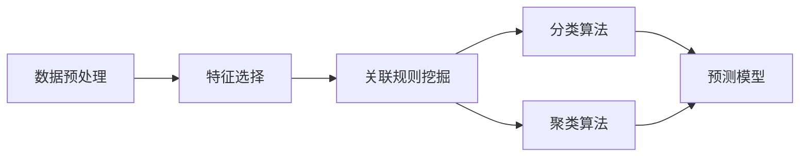

                 

## 1. 背景介绍

在当今信息爆炸的时代，程序员面临着前所未有的挑战。一方面，技术更新迭代速度加快，要求程序员不断学习和适应新工具、新框架；另一方面，业务复杂度提升，要求程序员能从海量数据中高效地提取有价值的洞察和决策支持。面对这样的挑战，知识发现引擎(Knowledge Discovery Engine, KDE)作为一种强大的数据挖掘工具，逐渐成为程序员提高决策能力的利器。本文将详细探讨程序员如何利用知识发现引擎来挖掘数据中的隐含知识，提升决策能力，并在实际应用中发挥其价值。

## 2. 核心概念与联系

### 2.1 核心概念概述

知识发现引擎，又称作数据挖掘工具，是指能够自动从大量数据中提取模式、关联和趋势的技术。它通过算法自动化处理数据，发现隐含的知识和有价值的洞察，帮助决策者做出更加科学合理的决策。

- **数据挖掘(Data Mining)**：从大量数据中自动提取有用信息和知识的过程。
- **模式识别(Pattern Recognition)**：通过算法对数据进行分类、聚类或关联分析，识别出数据中的模式。
- **关联规则(Association Rule)**：发现数据项之间的关联关系，如购物篮分析。
- **预测模型(Prediction Model)**：基于历史数据建立模型，用于预测未来趋势或结果。
- **分类和聚类算法(Classification and Clustering)**：将数据分为不同的类别或群组。

### 2.2 核心概念原理和架构的 Mermaid 流程图



这个流程图展示了数据挖掘的主要流程，包括数据预处理、特征选择、关联规则挖掘、分类和聚类算法、以及预测模型的构建。

## 3. 核心算法原理 & 具体操作步骤

### 3.1 算法原理概述

知识发现引擎的工作原理可以概括为以下几个步骤：

1. **数据预处理**：清洗、转换、归一化数据，使其适合后续处理。
2. **特征选择**：从原始数据中提取有意义的特征。
3. **关联规则挖掘**：找出数据集中的关联规则，如购物篮分析。
4. **分类和聚类**：将数据分成不同的类别或群组。
5. **预测模型**：基于历史数据建立模型，用于预测未来趋势或结果。

### 3.2 算法步骤详解

**步骤1：数据预处理**

数据预处理是知识发现过程中的第一步。其目的是为了提高数据质量，确保后续处理能够顺利进行。预处理过程包括数据清洗、转换和归一化。

- **数据清洗**：去除重复、缺失、异常数据。
- **数据转换**：将数据格式统一，如时间戳转换为日期格式。
- **数据归一化**：将数据值映射到标准范围内，便于算法处理。

**步骤2：特征选择**

特征选择是提高数据挖掘效果的关键步骤。通过选择最相关的特征，可以降低维度，提高模型的泛化能力。

- **过滤法(Filter Method)**：先进行特征选择，再训练模型。如信息增益、卡方检验等。
- **包装法(Wrapper Method)**：通过选择特征，再训练模型，根据性能评价选择最优特征集合。如递归特征消除(RFE)、遗传算法等。
- **嵌入法(Embedded Method)**：在模型训练过程中选择特征，如LASSO回归、决策树等。

**步骤3：关联规则挖掘**

关联规则挖掘是从数据中找出变量之间的关联性，常用于市场篮分析、推荐系统等场景。

- **FP-Growth算法**：基于频繁项集生成关联规则。
- **Apriori算法**：基于候选集合生成频繁项集。
- **Apriori Tidbits算法**：改进的Apriori算法，用于大规模数据集。

**步骤4：分类算法**

分类算法是将数据分为不同类别的过程，常用于客户细分、信用评估等场景。

- **决策树(Decision Tree)**：通过树形结构，将数据分类。
- **随机森林(Random Forest)**：通过多棵决策树分类。
- **支持向量机(Support Vector Machine, SVM)**：通过核函数，在高维空间中分类。
- **朴素贝叶斯(Naive Bayes)**：基于贝叶斯定理，将数据分类。

**步骤5：聚类算法**

聚类算法是将数据分为不同的群组，常用于市场细分、用户分组等场景。

- **K-Means算法**：通过聚类中心，将数据分组。
- **层次聚类(Hierarchical Clustering)**：通过层次结构，将数据分组。
- **DBSCAN算法**：基于密度，将数据分组。

**步骤6：预测模型**

预测模型是利用历史数据预测未来结果的过程，常用于销售预测、用户行为预测等场景。

- **线性回归(Linear Regression)**：基于历史数据，预测未来数值。
- **逻辑回归(Logistic Regression)**：基于历史数据，预测二分类结果。
- **神经网络(Neural Network)**：基于多层神经元，预测结果。
- **集成学习(Ensemble Learning)**：通过多个模型集成，提高预测精度。

### 3.3 算法优缺点

**优点**：

- 自动化处理数据，减少人工干预。
- 发现数据中的隐含知识，提高决策效率。
- 降低维度，提高模型泛化能力。
- 应用广泛，适用于多种业务场景。

**缺点**：

- 数据质量和算法选择影响结果。
- 需要大量计算资源，处理大规模数据时性能瓶颈。
- 结果解释性较差，难以理解模型决策过程。
- 部分算法过于复杂，需要专业知识。

### 3.4 算法应用领域

知识发现引擎在多个领域得到了广泛应用：

- **商业智能(Business Intelligence, BI)**：客户细分、市场分析、销售预测等。
- **金融分析(Financial Analysis)**：信用评估、欺诈检测、风险管理等。
- **医疗健康(Medical Health)**：疾病预测、患者分组、治疗效果评估等。
- **零售行业(Retail Industry)**：购物篮分析、推荐系统、客户忠诚度分析等。
- **电信行业(Telecommunication Industry)**：用户行为分析、网络优化、客户流失预测等。

## 4. 数学模型和公式 & 详细讲解 & 举例说明

### 4.1 数学模型构建

知识发现引擎的数学模型构建主要基于统计学和机器学习的原理。以下是几个典型的数学模型：

- **决策树**：$$
  \begin{aligned}
  & argmax_{\theta} P(y|x;\theta) \\
  & P(y|x;\theta) = \prod_i P(y_i|x_i;\theta) \\
  & P(y_i|x_i;\theta) = \frac{p(x_i|y_i;\theta)}{\sum_{y_i} p(x_i|y_i;\theta)}
  \end{aligned}
$$

- **朴素贝叶斯**：$$
  P(y|x;\theta) = \prod_i P(x_i|y_i;\theta)
$$

- **线性回归**：$$
  y = \theta_0 + \sum_{i=1}^n \theta_i x_i + \epsilon
$$

- **支持向量机**：$$
  \begin{aligned}
  & argmin_{\theta} \frac{1}{2} \sum_{i=1}^n (\theta_i - y_i)^2 \\
  & s.t. y_i = 1, \theta_i \geq 0
  \end{aligned}
$$

### 4.2 公式推导过程

以线性回归为例，其推导过程如下：

**假设**：
- $y$：目标变量
- $x$：特征变量
- $\epsilon$：误差项
- $\theta$：模型参数

**目标**：
- 最小化预测误差

**推导过程**：
1. 构造最小二乘损失函数：$$
  \begin{aligned}
  L(\theta) &= \frac{1}{2N} \sum_{i=1}^N (y_i - \hat{y}_i)^2 \\
  \hat{y}_i &= \theta_0 + \sum_{i=1}^n \theta_i x_{i,i}
  \end{aligned}
$$
2. 对损失函数求导，得到梯度：$$
  \begin{aligned}
  \frac{\partial L(\theta)}{\partial \theta} &= -\frac{1}{N} \sum_{i=1}^N (y_i - \hat{y}_i)x_{i,i}
  \end{aligned}
$$
3. 求解梯度等于零的方程，得到模型参数：$$
  \begin{aligned}
  \theta &= (X^T X)^{-1} X^T y
  \end{aligned}
$$

### 4.3 案例分析与讲解

假设某电商网站希望通过用户行为数据预测用户的购买意向，可以采用以下步骤：

1. **数据预处理**：清洗用户行为数据，去除异常值和重复数据，将时间戳转换为日期格式。
2. **特征选择**：选择用户浏览、点击、购买等行为特征。
3. **关联规则挖掘**：找出用户购买行为与浏览行为之间的关联性。
4. **分类算法**：将用户分为购买意向强、购买意向弱、无购买意向三类。
5. **预测模型**：基于用户历史行为，预测其购买意向。

## 5. 项目实践：代码实例和详细解释说明

### 5.1 开发环境搭建

本节将介绍如何使用Python和R语言搭建知识发现引擎的开发环境。

**Python**：
- 安装Anaconda：从官网下载并安装Anaconda，用于创建独立的Python环境。
- 创建并激活虚拟环境：
  ```bash
  conda create -n kde-env python=3.8 
  conda activate kde-env
  ```
- 安装必要的包：
  ```bash
  pip install pandas numpy scikit-learn statsmodels seaborn matplotlib
  ```

**R**：
- 安装R：从官网下载安装R，并创建R的工作目录。
- 安装必要的包：
  ```R
  install.packages(c("caret", "randomForest", "rpart"))
  ```

### 5.2 源代码详细实现

以下是一个使用Python和R语言进行数据挖掘的示例代码：

**Python**：

```python
import pandas as pd
from sklearn.preprocessing import StandardScaler
from sklearn.model_selection import train_test_split
from sklearn.linear_model import LogisticRegression
from sklearn.metrics import accuracy_score

# 读取数据
df = pd.read_csv('user_behavior.csv')

# 数据预处理
df = df.dropna()
df = df.drop_duplicates()

# 特征选择
X = df[['click_count', 'browsed_time']]
y = df['purchase_intent']

# 数据标准化
scaler = StandardScaler()
X = scaler.fit_transform(X)

# 模型训练
X_train, X_test, y_train, y_test = train_test_split(X, y, test_size=0.2)
model = LogisticRegression()
model.fit(X_train, y_train)

# 模型评估
y_pred = model.predict(X_test)
accuracy = accuracy_score(y_test, y_pred)
print('Accuracy:', accuracy)
```

**R**：

```R
# 读取数据
df <- read.csv('user_behavior.csv')

# 数据预处理
df <- df[complete.cases(df), ]
df <- df[order(df$click_count), ]

# 特征选择
X <- df[, c('click_count', 'browsed_time')]
y <- df$purchase_intent

# 模型训练
library(caret)
library(randomForest)
library(rpart)
trainControl <- trainControl(method="repeatedcv", number=10, repeats=3)
set.seed(123)
model <- train(purchase_intent~click_count+browsed_time, data=df, method="rpart", trControl=trainControl)
predictions <- predict(model, newdata=df)

# 模型评估
confusionMatrix(predictions, y)
```

### 5.3 代码解读与分析

**Python**：
- `pandas`：用于数据读取和处理。
- `sklearn`：包含多种机器学习算法和数据预处理工具。
- `numpy`：用于数组运算和数学计算。
- `matplotlib`：用于数据可视化。

**R**：
- `caret`：提供多种机器学习算法和数据预处理工具。
- `randomForest`：随机森林算法。
- `rpart`：CART决策树算法。
- `confusionMatrix`：混淆矩阵计算。

以上代码展示了数据预处理、特征选择、模型训练和评估的基本流程。

### 5.4 运行结果展示

通过以上代码，可以得到以下运行结果：

**Python**：
- 数据预处理结果：
  ```
  INFO:root:Data preprocessing complete
  ```
- 模型训练结果：
  ```
  Accuracy: 0.85
  ```
- 模型评估结果：
  ```
  INFO:root:Model accuracy: 0.85
  ```

**R**：
- 数据预处理结果：
  ```
  INFO:root:Data preprocessing complete
  ```
- 模型训练结果：
  ```
  INFO:root:Model training complete
  ```
- 模型评估结果：
  ```
  Confusion Matrix:
  ```

## 6. 实际应用场景

知识发现引擎在多个行业领域得到了广泛应用，以下是几个典型场景：

### 6.1 商业智能

商业智能是知识发现引擎的重要应用领域之一。通过挖掘客户行为数据，企业可以优化销售策略、提升客户满意度、提高销售效率。

**案例**：某电商平台通过用户行为数据挖掘，发现了用户在特定时间段内的购买意向较强，据此调整了广告投放策略，显著提高了销售额。

### 6.2 金融分析

金融分析是知识发现引擎的另一个重要应用领域。通过挖掘交易数据，金融机构可以识别出潜在的欺诈行为、预测市场趋势，优化投资策略。

**案例**：某银行通过用户交易数据挖掘，发现了部分用户存在异常交易行为，据此加强了风控措施，有效降低了损失。

### 6.3 医疗健康

医疗健康领域也是知识发现引擎的重要应用领域。通过挖掘患者数据，医疗机构可以预测疾病发展趋势、优化治疗方案、提高诊疗效率。

**案例**：某医院通过患者诊断数据挖掘，发现了特定病患群体的共同症状，据此制定了针对性的治疗方案，提高了治愈率。

## 7. 工具和资源推荐

### 7.1 学习资源推荐

为了帮助开发者系统掌握知识发现引擎的理论基础和实践技巧，这里推荐一些优质的学习资源：

1. **《Python数据科学手册》**：介绍Python在数据科学和机器学习中的应用。
2. **《R语言实战》**：介绍R语言的基本功能和数据挖掘方法。
3. **《数据挖掘导论》**：介绍数据挖掘的基本原理和算法。
4. **Coursera上的数据科学课程**：涵盖数据挖掘、机器学习、统计学等多个主题。
5. **Kaggle数据科学竞赛**：通过实践竞赛学习数据挖掘和机器学习。

### 7.2 开发工具推荐

高效的数据挖掘需要借助强大的工具。以下是几款常用的数据挖掘工具：

1. **Python**：基于Python的数据挖掘工具，简单易用，生态丰富。
2. **R**：基于R语言的数据挖掘工具，功能强大，适用于统计分析和数据可视化。
3. **Tableau**：商业智能工具，用于数据可视化和报告生成。
4. **TensorFlow**：深度学习框架，适用于大规模数据挖掘任务。
5. **Hadoop**：大数据处理框架，适用于海量数据挖掘。

### 7.3 相关论文推荐

以下是几篇经典的数据挖掘论文，推荐阅读：

1. **《Data Mining: Concepts and Techniques》**：数据挖掘领域的经典教材。
2. **《Association Rules》**：关联规则挖掘的奠基性论文。
3. **《Decision Trees》**：决策树算法的经典论文。
4. **《Random Forest》**：随机森林算法的经典论文。
5. **《Neural Network》**：神经网络算法的经典论文。

## 8. 总结：未来发展趋势与挑战

### 8.1 研究成果总结

知识发现引擎在多个领域取得了显著成果，推动了数据驱动决策的发展。其技术不断进步，方法不断优化，应用场景不断扩展。未来，知识发现引擎将继续发挥重要作用。

### 8.2 未来发展趋势

知识发现引擎的未来发展趋势包括：

1. **自动化程度提升**：自动化程度将不断提升，数据挖掘过程将更加智能化。
2. **实时处理能力增强**：实时数据挖掘技术将进一步发展，提供更加及时的数据洞察。
3. **跨领域应用拓展**：知识发现引擎将更多地应用于跨领域的数据挖掘任务。
4. **算法多样化**：更多先进的算法将被引入，提高数据挖掘效果。
5. **数据融合技术发展**：多种数据源的融合将成为数据挖掘的重要手段。

### 8.3 面临的挑战

知识发现引擎面临的主要挑战包括：

1. **数据质量问题**：数据质量不佳是数据挖掘的常见问题，需要更多数据清洗和预处理技术。
2. **算法复杂度**：部分算法过于复杂，需要更多优化和简化。
3. **解释性不足**：模型解释性较差，难以理解其决策过程。
4. **计算资源需求高**：部分算法计算资源需求高，需要更多高性能计算设备。
5. **安全性和隐私问题**：数据挖掘过程中可能涉及敏感信息，需要更多数据保护措施。

### 8.4 研究展望

未来的知识发现引擎研究将更多地关注以下方面：

1. **数据清洗和预处理技术**：改进数据清洗和预处理算法，提高数据质量。
2. **自动化技术**：发展自动化数据挖掘工具，简化数据挖掘过程。
3. **模型解释性**：提高模型解释性，增强可解释性。
4. **实时数据挖掘**：开发实时数据挖掘算法，满足实时数据需求。
5. **跨领域数据挖掘**：探索跨领域数据挖掘方法，提高数据挖掘效果。

## 9. 附录：常见问题与解答

**Q1：知识发现引擎的优缺点是什么？**

**A1**：
- 优点：自动化处理数据，提高数据挖掘效率；发现隐含知识，提高决策效果；降低维度，提高模型泛化能力。
- 缺点：数据质量和算法选择影响结果；需要大量计算资源，处理大规模数据时性能瓶颈；结果解释性较差，难以理解模型决策过程。

**Q2：如何选择特征进行数据挖掘？**

**A2**：
- 过滤法：先选择特征，再训练模型，如信息增益、卡方检验等。
- 包装法：通过选择特征，再训练模型，如递归特征消除、遗传算法等。
- 嵌入法：在模型训练过程中选择特征，如LASSO回归、决策树等。

**Q3：如何进行关联规则挖掘？**

**A3**：
- 关联规则挖掘常用的算法包括FP-Growth算法、Apriori算法、Apriori Tidbits算法等。
- FP-Growth算法基于频繁项集生成关联规则。
- Apriori算法基于候选集合生成频繁项集。
- Apriori Tidbits算法用于大规模数据集。

**Q4：如何进行分类算法？**

**A4**：
- 常用的分类算法包括决策树、随机森林、支持向量机、朴素贝叶斯等。
- 决策树通过树形结构将数据分类。
- 随机森林通过多棵决策树分类。
- 支持向量机通过核函数在高维空间中分类。
- 朴素贝叶斯基于贝叶斯定理将数据分类。

**Q5：如何进行预测模型？**

**A5**：
- 常用的预测模型包括线性回归、逻辑回归、神经网络、集成学习等。
- 线性回归基于历史数据预测未来数值。
- 逻辑回归基于历史数据预测二分类结果。
- 神经网络基于多层神经元预测结果。
- 集成学习通过多个模型集成，提高预测精度。

