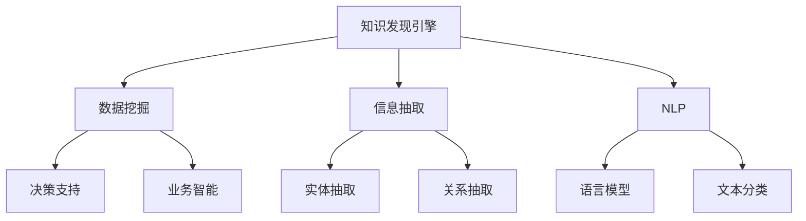

                 

# 程序员如何利用知识发现引擎提高工作质量

> 关键词：知识发现引擎, 数据挖掘, 信息抽取, 自然语言处理, 决策支持, 业务智能

## 1. 背景介绍

### 1.1 问题由来

在信息技术飞速发展的今天，软件行业不断涌现出新的技术、工具和框架。这给程序员带来了前所未有的挑战：如何从海量的信息中找到有用的知识，提高自己的工作效率？传统的搜索、文档阅读等方法已经无法满足需求，亟需一种高效的知识发现手段。

### 1.2 问题核心关键点

为了高效地获取和使用知识，程序员需要构建一个能够自动抽取和组织信息的知识发现引擎。该引擎可以实时更新，帮助程序员掌握最新的技术进展、工具用法、最佳实践等，从而提高工作效率，减少错误发生率，提升代码质量。

### 1.3 问题研究意义

构建一个高效的程序员知识发现引擎，对于提升软件开发效率、降低开发成本、加速技术迭代具有重要意义：

- 提高工作效率：自动化获取和推荐最新知识，减少手工查找时间。
- 减少错误发生率：利用知识引擎的建议和工具，避免常见错误和陷阱。
- 提升代码质量：获取最佳实践和技术指引，编写更高质量的代码。
- 加速技术迭代：跟踪最新技术动态，快速学习新技术、新框架，保持竞争力。
- 促进知识共享：自动生成技术文档和案例库，助力团队协作和学习。

## 2. 核心概念与联系

### 2.1 核心概念概述

为更好地理解程序员知识发现引擎的构建方法，本节将介绍几个密切相关的核心概念：

- 知识发现引擎(Knowledge Discovery Engine)：通过自动化地抽取、组织和推荐知识，帮助程序员快速获取最新技术动态和工具用法等信息的技术工具。
- 数据挖掘(Data Mining)：从大量数据中自动发现和提取有用信息的过程，是知识发现的基础。
- 信息抽取(Information Extraction)：自动从文本中提取结构化信息，如实体、关系等，便于知识抽取和利用。
- 自然语言处理(Natural Language Processing, NLP)：利用计算机技术处理、理解和生成人类语言的技术，是知识发现的重要手段。
- 决策支持(Decision Support)：通过提供分析报告和建议，辅助用户做出决策，是知识发现的重要应用。
- 业务智能(Business Intelligence, BI)：利用数据仓库和分析工具，辅助企业决策，是知识发现的重要应用场景。

这些核心概念之间的逻辑关系可以通过以下Mermaid流程图来展示：



这个流程图展示知识发现引擎的核心概念及其之间的关系：

1. 数据挖掘为知识发现提供数据基础。
2. 信息抽取将非结构化文本转化为结构化数据，便于知识抽取。
3. 自然语言处理技术用于文本分析和理解，提取关键信息。
4. 决策支持和业务智能分别利用知识发现的结果，辅助决策和业务分析。

这些概念共同构成了程序员知识发现引擎的框架，使得知识获取和利用变得更加高效和精确。

## 3. 核心算法原理 & 具体操作步骤
### 3.1 算法原理概述

程序员知识发现引擎的构建核心在于通过信息抽取和自然语言处理技术，从文本中抽取有用的信息，并结合决策支持算法，自动生成推荐和报告。其算法流程大致如下：

1. 数据预处理：清洗、归一化原始文本数据。
2. 信息抽取：通过实体抽取、关系抽取等技术，从文本中提取结构化信息。
3. 知识存储：将抽取的信息存入知识库，便于后续查询和推荐。
4. 自然语言处理：利用语言模型、文本分类等技术，理解文本内容和语义。
5. 推荐生成：结合用户偏好、知识库和领域专家知识，自动生成推荐。
6. 报告生成：根据用户查询，生成定制化的分析报告和建议。

### 3.2 算法步骤详解

#### 3.2.1 数据预处理

数据预处理是知识发现引擎的基础，涉及数据清洗、归一化、分词、去除停用词等步骤。以下是具体的预处理流程：

1. **文本清洗**：去除无关符号、特殊字符和噪声信息。
2. **归一化**：统一不同形式的表达，如将“Java”、“java”、“Java™”转化为“Java”。
3. **分词**：将文本按照词汇进行切分，便于后续的信息抽取。
4. **去除停用词**：删除常见但无实际意义的词汇，如“的”、“是”等。
5. **词干提取**：将单词转化为其词干形式，减少同义词带来的信息冗余。

#### 3.2.2 信息抽取

信息抽取是从文本中自动提取结构化信息的过程。通常使用命名实体识别(NER)、关系抽取(RE)等技术，提取关键实体和关系。以下是具体的抽取流程：

1. **命名实体识别**：识别文本中的实体，如人名、地名、组织名等。
2. **关系抽取**：识别实体之间的关系，如“John Smith”和“Google”之间存在雇主与雇员关系。
3. **实体消歧**：对于具有相同名称的实体，根据上下文判断其具体指向，如区分“Jack”是“Jack Ma”还是“Jack Black”。
4. **关系推理**：利用逻辑推理，推断隐含的实体关系，如“Steve Jobs”是“Apple”的创始人。

#### 3.2.3 知识存储

知识存储是将抽取的信息存入知识库，供后续查询和推荐使用。以下是具体的存储流程：

1. **关系数据库**：使用关系型数据库，存储结构化信息，便于查询。
2. **图数据库**：使用图数据库，存储实体关系网络，便于复杂的推理。
3. **NoSQL数据库**：使用NoSQL数据库，存储半结构化数据，如文档、列表等。
4. **知识图谱**：使用知识图谱，存储实体和关系，便于语义查询和推理。

#### 3.2.4 自然语言处理

自然语言处理技术用于文本分析和理解，提取关键信息。以下是具体的处理流程：

1. **语言模型**：使用语言模型，如n-gram模型、LSTM模型、Transformer模型等，理解文本内容和语义。
2. **文本分类**：使用文本分类技术，将文本分为不同的类别，如技术文档、教程、博客等。
3. **情感分析**：使用情感分析技术，判断文本的情感倾向，如积极、中立、消极等。
4. **关键词提取**：使用关键词提取技术，如TF-IDF、TextRank等，找出文本中的关键词汇。

#### 3.2.5 推荐生成

推荐生成是根据用户偏好、知识库和领域专家知识，自动生成推荐。以下是具体的生成流程：

1. **用户画像**：收集用户的历史行为数据，生成用户画像。
2. **相似度计算**：计算用户画像与知识库中实体的相似度，找到相关实体。
3. **推荐算法**：使用协同过滤、内容推荐等算法，生成推荐结果。
4. **动态调整**：根据用户反馈，动态调整推荐算法参数，提升推荐效果。

#### 3.2.6 报告生成

报告生成是根据用户查询，生成定制化的分析报告和建议。以下是具体的生成流程：

1. **用户查询**：接收用户查询请求，如“学习Python的最佳资源”。
2. **查询解析**：解析用户查询，找出关键实体和关系。
3. **信息检索**：在知识库中检索相关信息，生成初步报告。
4. **数据可视化**：使用数据可视化工具，如Tableau、D3.js等，展示报告内容。
5. **报告定制**：根据用户偏好，定制报告格式和内容，如Markdown、PDF等。

### 3.3 算法优缺点

程序员知识发现引擎的优点在于其自动化、高效化和精确化：

1. **自动化**：自动化抽取、存储和推荐知识，减少人工操作。
2. **高效化**：通过技术手段快速获取有用信息，提高工作效率。
3. **精确化**：利用领域知识和逻辑推理，提供准确的信息和推荐。

但该引擎也存在一些缺点：

1. **数据依赖**：依赖高质量、大规模的数据源，获取信息的完整性和准确性有待提高。
2. **领域限制**：不同领域的应用需要定制化开发，通用性有所不足。
3. **模型复杂**：算法和模型复杂，对技术要求较高，难以快速部署。
4. **隐私风险**：用户隐私信息可能被泄露，需要严格的数据保护措施。

### 3.4 算法应用领域

程序员知识发现引擎的应用领域非常广泛，包括但不限于以下几个方面：

- 技术文档和教程推荐：从技术文档、教程中自动抽取关键信息和推荐。
- 代码质量提升：从代码片段中抽取信息，自动生成最佳实践和代码优化建议。
- 知识库构建：自动构建和维护知识库，存储领域内的关键知识和经验。
- 问题诊断：从问题描述中抽取信息，自动生成问题诊断报告和解决方案。
- 知识共享：将知识抽取结果自动生成文档和案例库，助力团队协作和学习。

除了上述这些典型应用外，知识发现引擎还可以创新性地应用于更多场景中，如代码注释、版本控制、开发工具集成等，为软件开发带来更多的智能化支持。

## 4. 数学模型和公式 & 详细讲解  
### 4.1 数学模型构建

假设程序员知识发现引擎的目标是推荐最相关的技术文档。设用户查询为 $q$，文档集合为 $D$，文档向量为 $v_i$，用户查询向量为 $v_q$。定义向量间的余弦相似度为：

$$
\text{sim}(v_i,v_q) = \cos(\theta) = \frac{v_i \cdot v_q}{||v_i|| ||v_q||}
$$

其中 $v_i \cdot v_q$ 为向量点积，$||v_i||$ 和 $||v_q||$ 分别为向量范数。

### 4.2 公式推导过程

根据余弦相似度定义，可以计算用户查询与文档之间的相似度，然后根据相似度排序，推荐最相关的文档。具体推导过程如下：

1. **向量表示**：将文档和查询转化为向量表示，如词袋模型、TF-IDF、Word2Vec等。
2. **相似度计算**：计算文档向量与查询向量之间的余弦相似度。
3. **排序和推荐**：根据相似度排序，生成推荐列表，推荐最相关的文档。

### 4.3 案例分析与讲解

假设用户查询为“如何使用GitHub”，有以下两个技术文档：

- 文档A：“GitHub快速入门”，内容涉及GitHub的基础操作。
- 文档B：“GitHub高级用法”，内容涉及GitHub高级功能。

查询向量为 $v_q=[0.1, 0.2, 0.3, 0]$，文档A和B的向量表示分别为 $v_{A}=[0.2, 0.3, 0.1, 0.2]$ 和 $v_{B}=[0.4, 0.1, 0.1, 0.4]$。

计算余弦相似度：

$$
\text{sim}(A,q) = \frac{0.1 \cdot 0.1 + 0.2 \cdot 0.2 + 0.3 \cdot 0.3 + 0.0 \cdot 0.0}{\sqrt{0.1^2 + 0.2^2 + 0.3^2 + 0.0^2} \cdot \sqrt{0.1^2 + 0.2^2 + 0.3^2 + 0.0^2}} = 0.6
$$

$$
\text{sim}(B,q) = \frac{0.4 \cdot 0.1 + 0.1 \cdot 0.2 + 0.1 \cdot 0.3 + 0.4 \cdot 0.0}{\sqrt{0.4^2 + 0.1^2 + 0.1^2 + 0.4^2} \cdot \sqrt{0.1^2 + 0.2^2 + 0.3^2 + 0.0^2}} = 0.3
$$

由于 $\text{sim}(A,q) > \text{sim}(B,q)$，因此推荐文档A。

## 5. 项目实践：代码实例和详细解释说明
### 5.1 开发环境搭建

在进行知识发现引擎实践前，我们需要准备好开发环境。以下是使用Python进行Spark开发的开发环境配置流程：

1. 安装Anaconda：从官网下载并安装Anaconda，用于创建独立的Python环境。

2. 创建并激活虚拟环境：
```bash
conda create -n pyspark-env python=3.8 
conda activate pyspark-env
```

3. 安装PySpark：根据Spark版本，从官网获取对应的安装命令。例如：
```bash
conda install pyspark -c conda-forge -c defaults
```

4. 安装必要的工具包：
```bash
pip install scikit-learn pandas numpy pysparknlp
```

完成上述步骤后，即可在`pyspark-env`环境中开始知识发现引擎的开发。

### 5.2 源代码详细实现

这里我们以GitHub技术文档推荐为例，给出使用PySpark进行知识发现引擎的代码实现。

首先，定义文档向量化函数：

```python
from pyspark.sql import SparkSession
from pyspark.sql.functions import col, vector
from pyspark.ml.feature import VectorAssembler

def vectorize(documents):
    spark = SparkSession.builder.appName("document_vectorization").getOrCreate()
    # 定义文档向量特征列
    features = ['title', 'content']
    # 将文档特征组装成向量
    assembler = VectorAssembler(inputCols=features, outputCol="vector")
    # 对每个文档进行向量化
    vectorized_documents = assembler.transform(documents)
    # 返回向量化的文档数据
    return vectorized_documents.select(col("vector"))
```

然后，定义余弦相似度计算函数：

```python
def compute_cosine_similarity(documents, query):
    spark = SparkSession.builder.appName("cosine_similarity").getOrCreate()
    # 计算文档向量与查询向量的余弦相似度
    similarity_df = documents.select("vector").crossJoin(query.select("vector"))
    cosine_similarity = similarity_df.withColumn("similarity", (col("vector") * query["vector"]).sum() / ((col("vector")**2 + query["vector"]**2)**0.5))
    return cosine_similarity
```

接着，定义推荐函数：

```python
def recommend_documents(documents, query, num_recommendations=5):
    spark = SparkSession.builder.appName("document_recommendation").getOrCreate()
    # 计算余弦相似度
    similarity_df = compute_cosine_similarity(documents, query)
    # 对余弦相似度进行排序
    sorted_similarity = similarity_df.select(col("similarity"), "doc_id").orderBy(col("similarity").desc())
    # 获取推荐文档列表
    recommended_docs = sorted_similarity.select(col("doc_id")).collect()[:num_recommendations]
    return recommended_docs
```

最后，启动推荐流程：

```python
spark = SparkSession.builder.appName("document_recommendation").getOrCreate()

# 加载文档数据
documents = spark.read.csv("documents.csv", header=True, inferSchema=True)

# 加载查询数据
query = spark.read.csv("query.csv", header=True, inferSchema=True)

# 推荐文档
recommended_docs = recommend_documents(documents, query)

# 打印推荐结果
for doc_id in recommended_docs:
    print(doc_id)
```

以上就是使用PySpark进行GitHub技术文档推荐的完整代码实现。可以看到，通过简单的向量化和相似度计算，我们就能实现高效的技术文档推荐。

### 5.3 代码解读与分析

让我们再详细解读一下关键代码的实现细节：

**vectorize函数**：
- 使用`pyspark.sql`模块创建SparkSession，连接数据库。
- 定义文档特征列，如标题和内容。
- 使用`VectorAssembler`将特征组装成向量。
- 返回向量化的文档数据。

**compute_cosine_similarity函数**：
- 使用`pyspark.sql`模块创建SparkSession。
- 计算文档向量与查询向量的余弦相似度。
- 返回余弦相似度数据。

**recommend_documents函数**：
- 使用`pyspark.sql`模块创建SparkSession。
- 调用余弦相似度计算函数，计算文档与查询的相似度。
- 对相似度进行排序，获取推荐文档。
- 返回推荐文档列表。

**推荐流程**：
- 加载文档和查询数据。
- 调用推荐函数，获取推荐文档。
- 打印推荐结果。

可以看到，使用PySpark进行知识发现引擎的开发，可以方便地实现大规模数据的处理和分析。开发者可以利用Spark的分布式计算特性，快速处理海量数据，实现高效的推荐。

## 6. 实际应用场景
### 6.1 技术文档推荐

技术文档推荐是程序员知识发现引擎的典型应用之一。通过自动抽取文档中的关键信息，生成推荐列表，程序员可以更方便地获取最新的技术动态和工具用法。

例如，对于Java开发者，可以构建一个基于Java文档的技术文档推荐引擎。当开发者查询“Spring Boot教程”时，系统可以推荐最新的Spring Boot文档、官方指南、用户评价等，帮助开发者快速获取最新资料。

### 6.2 代码质量提升

代码质量提升是程序员知识发现引擎的重要应用。通过抽取代码片段中的关键信息，自动生成最佳实践和代码优化建议，程序员可以提升代码质量，减少错误发生率。

例如，对于Java开发者，可以构建一个基于Java代码的技术文档推荐引擎。当开发者编写代码时，系统可以自动抽取代码片段，并推荐最佳实践、代码优化建议等，帮助开发者编写更高质量的代码。

### 6.3 知识库构建

知识库构建是程序员知识发现引擎的高级应用。通过自动抽取技术文档、代码、论文等结构化信息，构建领域内的知识库，存储关键知识和经验。

例如，对于Web开发领域，可以构建一个Web开发知识库。通过自动抽取Web开发相关的技术文档、框架教程、代码示例等，存储到知识库中，供开发者查询和学习。

### 6.4 问题诊断

问题诊断是程序员知识发现引擎的创新应用。通过自动抽取问题描述中的关键信息，自动生成问题诊断报告和解决方案，程序员可以更快地解决问题。

例如，对于Python开发者，可以构建一个Python问题诊断引擎。当开发者遇到“Python报错”问题时，系统可以自动抽取问题描述，并生成问题诊断报告和解决方案，帮助开发者快速解决问题。

### 6.5 知识共享

知识共享是程序员知识发现引擎的协同应用。通过自动生成技术文档和案例库，助力团队协作和学习，提升团队整体技术水平。

例如，对于开发团队，可以构建一个开发团队知识共享引擎。通过自动生成开发团队的文档、案例库等，存储到知识库中，供团队成员查询和学习，促进团队协作。

## 7. 工具和资源推荐
### 7.1 学习资源推荐

为了帮助开发者系统掌握知识发现引擎的理论基础和实践技巧，这里推荐一些优质的学习资源：

1. 《机器学习》系列课程：斯坦福大学开设的机器学习课程，有Lecture视频和配套作业，带你入门机器学习的基本概念和经典模型。
2. 《自然语言处理》系列书籍：包含《Speech and Language Processing》、《Foundations of Statistical Natural Language Processing》等经典教材，全面介绍自然语言处理的理论和实践。
3. 《Python for Data Analysis》书籍：提供Python数据分析的全面指南，涵盖数据清洗、数据可视化、数据处理等技术。
4. 《Spark in Action》书籍：提供Spark的全面指南，涵盖Spark Core、Spark SQL、Spark Streaming等技术。
5. 《Kaggle机器学习竞赛指南》书籍：提供Kaggle机器学习竞赛的实战经验，涵盖数据预处理、特征工程、模型训练等技术。

通过对这些资源的学习实践，相信你一定能够快速掌握知识发现引擎的精髓，并用于解决实际的NLP问题。

### 7.2 开发工具推荐

高效的开发离不开优秀的工具支持。以下是几款用于知识发现引擎开发的常用工具：

1. PySpark：基于Scala和Python的分布式计算框架，适合大规模数据处理和分析。
2. TensorFlow：由Google主导开发的开源深度学习框架，适合大规模机器学习和模型训练。
3. Apache Kafka：分布式消息队列，适合实时数据处理和流式计算。
4. Apache Flink：分布式流式计算框架，适合实时数据处理和复杂流式计算。
5. Apache Hadoop：分布式文件系统，适合海量数据存储和分布式处理。

合理利用这些工具，可以显著提升知识发现引擎的开发效率，加快创新迭代的步伐。

### 7.3 相关论文推荐

知识发现引擎的发展源于学界的持续研究。以下是几篇奠基性的相关论文，推荐阅读：

1. Weka：数据挖掘和知识发现工具，提供多种机器学习算法和数据预处理工具。
2. Stanford NLP：自然语言处理工具库，包含多种自然语言处理技术和算法。
3. BERT：预训练语言模型，利用自监督学习任务提升语言理解能力。
4. GPT-3：大规模预训练语言模型，展示了大规模语言模型的强大zero-shot学习能力。
5. TextRank：文本重要性排序算法，利用图模型计算文本重要性。

这些论文代表了大语言模型微调技术的发展脉络。通过学习这些前沿成果，可以帮助研究者把握学科前进方向，激发更多的创新灵感。

## 8. 总结：未来发展趋势与挑战
### 8.1 总结

本文对程序员知识发现引擎的构建方法进行了全面系统的介绍。首先阐述了知识发现引擎的背景和意义，明确了知识发现引擎在提高软件开发效率、降低开发成本、加速技术迭代方面的独特价值。其次，从原理到实践，详细讲解了知识发现引擎的数学原理和操作步骤，给出了知识发现引擎任务开发的完整代码实例。同时，本文还广泛探讨了知识发现引擎在技术文档推荐、代码质量提升、知识库构建等多个领域的应用前景，展示了知识发现引擎的广阔前景。

通过本文的系统梳理，可以看到，程序员知识发现引擎在大规模数据处理、自动化知识抽取和推荐等方面具有重要应用价值，可以显著提升程序员的工作效率，减少错误发生率，提升代码质量。未来，伴随技术进一步成熟，知识发现引擎必将在软件开发中发挥更大的作用，为软件开发行业带来变革性影响。

### 8.2 未来发展趋势

展望未来，知识发现引擎的发展将呈现以下几个趋势：

1. 自动化程度提升：知识发现引擎将进一步自动化，减少人工干预，提高效率和准确性。
2. 大数据处理能力增强：利用云计算和分布式计算技术，处理更大规模的数据集，提供更丰富的信息。
3. 跨领域应用拓展：知识发现引擎将扩展到更多领域，如医疗、金融、教育等，为各行业带来智能化支持。
4. 知识图谱构建：利用知识图谱技术，构建领域内的知识网络，提供更丰富的查询和推荐。
5. 实时交互能力提升：通过聊天机器人和智能助手，实现实时交互和动态推荐。
6. 多模态融合：将文本、图像、语音等多种信息融合，提供更全面、准确的信息推荐。

这些趋势凸显了知识发现引擎的广阔前景和巨大潜力，为知识发现引擎的未来发展指明了方向。

### 8.3 面临的挑战

尽管知识发现引擎已经取得了不少进展，但在迈向更加智能化、普适化应用的过程中，仍面临诸多挑战：

1. 数据隐私和安全：知识发现引擎需要处理大量敏感数据，如何保护用户隐私和数据安全是一个重要问题。
2. 跨领域适用性：不同领域的应用需要定制化开发，通用性有所不足。
3. 模型复杂度：知识发现引擎的算法和模型复杂，需要较高的技术水平。
4. 数据质量和一致性：知识发现引擎依赖高质量、一致性的数据，数据预处理和清洗是关键。
5. 计算资源需求：知识发现引擎需要大量计算资源，如何高效利用计算资源是重要问题。

### 8.4 研究展望

面对知识发现引擎面临的挑战，未来的研究需要在以下几个方面寻求新的突破：

1. 提升数据隐私和安全：利用差分隐私、联邦学习等技术，保护用户隐私和数据安全。
2. 构建通用化知识发现引擎：利用迁移学习、预训练技术，提升知识发现引擎的跨领域适用性。
3. 简化算法和模型：利用高效模型和算法，降低知识发现引擎的计算资源需求。
4. 提升数据质量和一致性：利用自动化数据清洗和预处理技术，提高数据质量和一致性。
5. 优化推荐算法：利用深度学习、协同过滤等算法，提升推荐效果和效率。

这些研究方向将推动知识发现引擎技术不断成熟，为软件开发行业带来更多智能化支持。相信随着学界和产业界的共同努力，知识发现引擎必将在软件开发中发挥更大作用，成为软件开发的重要工具。

## 9. 附录：常见问题与解答

**Q1：知识发现引擎和搜索引擎有什么区别？**

A: 知识发现引擎和搜索引擎虽然都是信息检索系统，但核心区别在于其检索目标和实现方法。搜索引擎主要关注用户查询和文档匹配，而知识发现引擎不仅关注文档匹配，还强调对文档内容的分析和挖掘，自动发现和抽取结构化信息。

**Q2：知识发现引擎的核心技术是什么？**

A: 知识发现引擎的核心技术主要包括数据预处理、信息抽取、自然语言处理、推荐算法等。其中数据预处理、信息抽取是知识抽取的基础，自然语言处理是理解文档内容的关键，推荐算法是知识推荐的核心。

**Q3：知识发现引擎如何处理多模态数据？**

A: 知识发现引擎处理多模态数据通常采用多模态融合技术。将文本、图像、语音等多种信息融合，利用多模态模型提取多源信息，提供更全面、准确的信息推荐。

**Q4：知识发现引擎如何保护用户隐私？**

A: 知识发现引擎保护用户隐私通常采用差分隐私、联邦学习等技术。通过添加噪声、分布式学习等方式，保护用户隐私信息，防止数据泄露。

**Q5：知识发现引擎在实际应用中需要注意哪些问题？**

A: 知识发现引擎在实际应用中需要注意数据隐私和安全、跨领域适用性、模型复杂度、数据质量和一致性、计算资源需求等问题。开发者需要在各个环节进行全面优化，才能最大限度地发挥知识发现引擎的潜力。

---

作者：禅与计算机程序设计艺术 / Zen and the Art of Computer Programming

