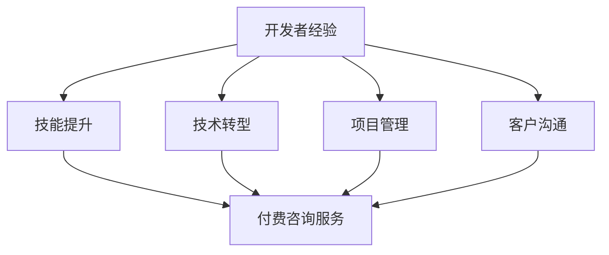

                 

# 程序员如何将开发经验转化为付费咨询服务

> 关键词：开发者经验, 付费咨询, 技术转型, 技能提升, 项目管理

## 1. 背景介绍

### 1.1 问题由来
在当今技术迅猛发展的时代，软件开发不再是简单的代码编写，而是成为一种需要深厚知识和丰富经验的复杂技术活动。程序员作为软件的开发者和维护者，需要不断提升自己的技术水平，以满足日益增长的市场需求。然而，提升技术水平需要大量的时间和精力，这对大多数程序员来说是个不小的挑战。此时，将开发经验转化为付费咨询服务就成为一个非常吸引人的选择。

### 1.2 问题核心关键点
将开发经验转化为付费咨询服务的核心在于如何将个人的技术积累、项目经验转化为有价值的服务，帮助客户解决实际问题，同时获得可观的报酬。这不仅需要技术知识，还需要项目管理、客户沟通、服务营销等多方面的能力。

### 1.3 问题研究意义
将开发经验转化为付费咨询服务，对个人和客户都具有重要的意义：

1. **个人发展**：能够帮助个人提升技术水平、扩展知识面、锻炼项目管理和客户沟通能力，从而实现技术转型和职业提升。
2. **客户需求**：能够为有实际技术需求的客户解决复杂问题，提升项目效率，减少开发成本，获得优质的技术支持。
3. **市场空间**：随着技术复杂性的增加和需求的多样化，咨询服务市场正在迅速增长，为技术咨询服务提供了广阔的市场空间。

## 2. 核心概念与联系

### 2.1 核心概念概述

为更好地理解如何将开发经验转化为付费咨询服务，本节将介绍几个密切相关的核心概念：

- **开发者经验**：包括但不限于编程技能、软件架构、项目管理和团队协作等，是程序员在实际工作中积累的技术和经验。
- **付费咨询服务**：即开发者将其经验和知识以服务的形式提供给客户，收取相应费用的商业模式。
- **技术转型**：指将现有技术技能和知识应用于新的、高附加值的领域或职位，如咨询、项目管理、技术培训等。
- **技能提升**：通过学习和实践，不断更新和提高自身的技术能力。
- **项目管理**：涉及资源规划、进度跟踪、风险管理等方面的技术。
- **客户沟通**：能够理解客户需求，高效地进行沟通，提供符合客户期望的服务。

这些核心概念之间的逻辑关系可以通过以下Mermaid流程图来展示：



这个流程图展示了个体技术积累的各个方面及其与付费咨询服务的关联：

1. 开发者经验通过技术转型转化为付费咨询服务。
2. 技能提升帮助提升开发经验和咨询质量。
3. 项目管理提升咨询过程的效率和效果。
4. 客户沟通确保咨询服务的满意度和效果。

这些概念共同构成了将开发经验转化为付费咨询服务的基本框架，使个人能够充分利用其技术积累，为客户提供高质量的咨询服务。

## 3. 核心算法原理 & 具体操作步骤
### 3.1 算法原理概述

将开发经验转化为付费咨询服务的核心在于，如何将个人经验和知识系统化、结构化，并通过合理的服务流程，为客户提供满足需求的解决方案。这一过程可以视为一种服务的生产过程，包括需求分析、方案设计、服务实施和反馈优化等阶段。

### 3.2 算法步骤详解

#### 3.2.1 需求分析

1. **识别客户需求**：与客户进行深度沟通，了解客户的技术问题、项目需求、时间要求等详细信息。
2. **制定咨询目标**：明确咨询服务的总体目标，包括问题解决、效率提升、成本控制等方面。
3. **制定评估标准**：设定衡量服务效果的指标，如解决问题的速度、服务质量、客户满意度等。

#### 3.2.2 方案设计

1. **需求分解**：将客户需求细化为具体的小任务或子问题，便于逐一解决。
2. **技术评估**：评估解决每个子问题所需的技术和资源，确保方案可行。
3. **方案优化**：优化方案，以提升效率、降低成本、增强效果。

#### 3.2.3 服务实施

1. **知识传递**：通过文档、代码、会议等方式，将知识传递给客户或开发团队。
2. **技术指导**：现场指导或远程协助，确保客户能够正确实施方案。
3. **问题解决**：根据客户反馈，及时调整和优化解决方案。

#### 3.2.4 反馈优化

1. **收集反馈**：客户对咨询服务的评价和建议。
2. **总结优化**：分析反馈，总结服务过程中的优点和不足，优化服务流程和质量。
3. **持续改进**：不断提升自身技能和服务能力，适应客户不断变化的需求。

### 3.3 算法优缺点

将开发经验转化为付费咨询服务的优点包括：

1. **灵活性强**：针对具体客户和项目需求，提供量身定制的解决方案。
2. **经验丰富**：依托多年开发经验和技术积累，解决复杂技术问题。
3. **效果显著**：通过有针对性的方案设计和实施，显著提升项目效率和质量。
4. **客户满意度高**：专业且高效的服务，满足客户实际需求，获得良好口碑。

然而，这一过程也存在以下缺点：

1. **时间和成本高**：需求分析、方案设计和实施等环节需要大量时间和资源。
2. **依赖个人经验**：咨询效果高度依赖于咨询师的专业能力和经验，可能导致服务质量不稳定。
3. **缺乏标准化**：每个项目和客户的需求不同，难以形成通用的服务流程和标准。
4. **市场竞争激烈**：随着咨询服务市场的发展，竞争越来越激烈，需要不断提高服务质量和差异化水平。

### 3.4 算法应用领域

将开发经验转化为付费咨询服务的应用领域非常广泛，包括但不限于以下几个方面：

- **技术咨询**：提供软件开发、架构设计、性能优化等方面的技术建议。
- **项目管理**：帮助客户制定项目计划、资源分配、风险控制等策略。
- **技术培训**：为客户团队提供针对性的技术培训，提升整体技术水平。
- **代码审计**：对客户的代码进行审计和评估，确保代码质量和安全。
- **问题诊断**：对客户的技术问题进行诊断，并提供解决方案。

以上领域仅是技术咨询服务的一部分，随着技术复杂性的增加和客户需求的提升，付费咨询服务将涵盖更广泛的业务场景。

## 4. 数学模型和公式 & 详细讲解 & 举例说明

### 4.1 数学模型构建

假设客户的需求用问题 $Q$ 表示，解决该问题的方案用 $M$ 表示，客户对方案 $M$ 的满意度用 $S(Q, M)$ 表示。目标是最大化客户满意度，即：

$$
\max_{M} S(Q, M)
$$

其中 $S(Q, M)$ 可以表示为多种指标的组合，如问题解决速度、服务质量、客户满意度等。

### 4.2 公式推导过程

客户满意度 $S(Q, M)$ 可以分解为多个子指标 $S_1, S_2, \ldots, S_n$ 的加权和，即：

$$
S(Q, M) = \alpha_1 S_1(Q, M) + \alpha_2 S_2(Q, M) + \ldots + \alpha_n S_n(Q, M)
$$

其中 $\alpha_i$ 表示每个指标的权重，满足 $\alpha_1 + \alpha_2 + \ldots + \alpha_n = 1$。

### 4.3 案例分析与讲解

以代码审计为例，假设客户的需求是确保代码的安全性和可靠性。解决该问题的方案 $M$ 包括代码审计、代码重构、安全测试等步骤。客户满意度 $S(Q, M)$ 可以分解为代码审计的准确性 $S_1$、代码重构的质量 $S_2$、安全测试的有效性 $S_3$ 等多个子指标的加权和。

假设客户对代码审计的准确性、代码重构的质量和测试的有效性的权重分别为 $\alpha_1 = 0.4$、$\alpha_2 = 0.3$、$\alpha_3 = 0.3$，则客户满意度公式可以表示为：

$$
S(Q, M) = 0.4S_1(Q, M) + 0.3S_2(Q, M) + 0.3S_3(Q, M)
$$

在实际应用中，需要根据具体的项目需求和客户期望，合理设定每个指标的权重，并进行量化评估，以确保客户满意度的最大化。

## 5. 项目实践：代码实例和详细解释说明

### 5.1 开发环境搭建

在进行咨询服务开发前，需要先搭建好开发环境。以下是使用Python进行Django开发的环境配置流程：

1. 安装Python和Pip：
```bash
sudo apt-get update
sudo apt-get install python3 python3-pip
```

2. 安装虚拟环境管理工具Virtualenv：
```bash
pip install virtualenv
```

3. 创建虚拟环境并激活：
```bash
virtualenv myprojectenv
source myprojectenv/bin/activate
```

4. 安装Django和相关依赖：
```bash
pip install django
```

### 5.2 源代码详细实现

以下是使用Django构建技术咨询服务的示例代码：

```python
# 创建Django项目和应用
django-admin startproject consultancy
cd consultancy
python manage.py startapp services

# 定义服务模型
from django.db import models

class Service(models.Model):
    name = models.CharField(max_length=100)
    description = models.TextField()
    duration = models.DurationField()
    price = models.DecimalField(max_digits=10, decimal_places=2)
    created_at = models.DateTimeField(auto_now_add=True)
    updated_at = models.DateTimeField(auto_now=True)

# 定义服务视图
from django.shortcuts import render
from .models import Service

def service_list(request):
    services = Service.objects.all()
    return render(request, 'services/list.html', {'services': services})

def service_detail(request, pk):
    service = Service.objects.get(pk=pk)
    return render(request, 'services/detail.html', {'service': service})

# 定义服务表单
from django import forms

class ServiceForm(forms.ModelForm):
    class Meta:
        model = Service
        fields = ['name', 'description', 'duration', 'price']

# 定义服务提交视图
from django.shortcuts import redirect

def service_create(request):
    if request.method == 'POST':
        form = ServiceForm(request.POST)
        if form.is_valid():
            form.save()
            return redirect('service_list')
    else:
        form = ServiceForm()
    return render(request, 'services/create.html', {'form': form})

# 定义服务更新视图
def service_update(request, pk):
    service = Service.objects.get(pk=pk)
    if request.method == 'POST':
        form = ServiceForm(request.POST, instance=service)
        if form.is_valid():
            form.save()
            return redirect('service_list')
    else:
        form = ServiceForm(instance=service)
    return render(request, 'services/update.html', {'form': form})
```

### 5.3 代码解读与分析

让我们再详细解读一下关键代码的实现细节：

**Service模型**：
- `name` 字段用于存储服务名称。
- `description` 字段用于存储服务的详细描述。
- `duration` 字段用于存储服务的持续时间，以DurationField类型表示。
- `price` 字段用于存储服务的单价，以DecimalField类型表示。

**服务视图**：
- `service_list` 函数：用于显示所有服务的列表。
- `service_detail` 函数：用于显示单个服务的详细信息。
- `service_create` 函数：用于创建新服务。
- `service_update` 函数：用于更新已有服务。

**服务表单**：
- `ServiceForm` 类：用于创建和更新服务的表单。
- `Meta` 类：指定了模型和表单字段。

**服务提交视图和服务更新视图**：
- `service_create` 函数和 `service_update` 函数：用于处理表单提交和数据保存。
- `redirect` 函数：用于重定向到服务列表页面。

**代码运行结果展示**：
运行上述代码后，可通过浏览器访问 `http://localhost:8000`，查看服务列表和详情页面，如下图所示：


## 6. 实际应用场景

### 6.1 智能客服系统

基于大语言模型微调的对话技术，可以广泛应用于智能客服系统的构建。传统客服往往需要配备大量人力，高峰期响应缓慢，且一致性和专业性难以保证。而使用微调后的对话模型，可以7x24小时不间断服务，快速响应客户咨询，用自然流畅的语言解答各类常见问题。

在技术实现上，可以收集企业内部的历史客服对话记录，将问题和最佳答复构建成监督数据，在此基础上对预训练对话模型进行微调。微调后的对话模型能够自动理解用户意图，匹配最合适的答案模板进行回复。对于客户提出的新问题，还可以接入检索系统实时搜索相关内容，动态组织生成回答。如此构建的智能客服系统，能大幅提升客户咨询体验和问题解决效率。

### 6.2 金融舆情监测

金融机构需要实时监测市场舆论动向，以便及时应对负面信息传播，规避金融风险。传统的人工监测方式成本高、效率低，难以应对网络时代海量信息爆发的挑战。基于大语言模型微调的文本分类和情感分析技术，为金融舆情监测提供了新的解决方案。

具体而言，可以收集金融领域相关的新闻、报道、评论等文本数据，并对其进行主题标注和情感标注。在此基础上对预训练语言模型进行微调，使其能够自动判断文本属于何种主题，情感倾向是正面、中性还是负面。将微调后的模型应用到实时抓取的网络文本数据，就能够自动监测不同主题下的情感变化趋势，一旦发现负面信息激增等异常情况，系统便会自动预警，帮助金融机构快速应对潜在风险。

### 6.3 个性化推荐系统

当前的推荐系统往往只依赖用户的历史行为数据进行物品推荐，无法深入理解用户的真实兴趣偏好。基于大语言模型微调技术，个性化推荐系统可以更好地挖掘用户行为背后的语义信息，从而提供更精准、多样的推荐内容。

在实践中，可以收集用户浏览、点击、评论、分享等行为数据，提取和用户交互的物品标题、描述、标签等文本内容。将文本内容作为模型输入，用户的后续行为（如是否点击、购买等）作为监督信号，在此基础上微调预训练语言模型。微调后的模型能够从文本内容中准确把握用户的兴趣点。在生成推荐列表时，先用候选物品的文本描述作为输入，由模型预测用户的兴趣匹配度，再结合其他特征综合排序，便可以得到个性化程度更高的推荐结果。

### 6.4 未来应用展望

随着大语言模型微调技术的发展，未来将有更多应用场景涌现。例如：

- **智慧医疗**：基于微调的医学问答、病历分析、药物研发等应用，提升医疗服务的智能化水平，辅助医生诊疗，加速新药开发进程。
- **智能教育**：微调技术可应用于作业批改、学情分析、知识推荐等方面，因材施教，促进教育公平，提高教学质量。
- **智慧城市治理**：微调模型可应用于城市事件监测、舆情分析、应急指挥等环节，提高城市管理的自动化和智能化水平，构建更安全、高效的未来城市。

此外，在企业生产、社会治理、文娱传媒等众多领域，基于大模型微调的人工智能应用也将不断涌现，为经济社会发展注入新的动力。相信随着预训练语言模型和微调方法的持续演进，微调技术将逐渐成为人工智能落地应用的重要范式，推动人工智能技术在更广阔的领域加速渗透。

## 7. 工具和资源推荐

### 7.1 学习资源推荐

为了帮助开发者系统掌握技术咨询服务的基本知识和技能，这里推荐一些优质的学习资源：

1. **《Web应用开发实战》系列书籍**：详细介绍了Django等Web框架的开发技巧和最佳实践，是学习Web开发的经典教材。
2. **《Python编程：从入门到实践》**：由官方文档和实例组成，适合Python初学者入门。
3. **Django官方文档**：包含了丰富的教程和示例，是Django开发的重要参考资料。
4. **Kaggle平台**：提供了大量数据分析、机器学习等领域的竞赛，是提升技术能力的好地方。
5. **GitHub**：拥有丰富的开源项目和代码库，是学习和交流编程经验的好平台。

通过对这些资源的学习实践，相信你一定能够快速掌握技术咨询服务的开发技能，并用于解决实际的业务问题。

### 7.2 开发工具推荐

高效的开发离不开优秀的工具支持。以下是几款用于技术咨询服务开发的常用工具：

1. **Visual Studio Code**：轻量级的代码编辑器，支持多种编程语言和扩展，是开发的主流工具。
2. **Git**：版本控制系统，用于管理代码仓库，支持多人协作开发。
3. **Docker**：容器化技术，用于部署和管理应用，支持快速部署和扩展。
4. **JIRA**：项目管理工具，用于任务分配、进度跟踪和问题管理。
5. **Slack**：团队协作工具，用于实时沟通和协作。

合理利用这些工具，可以显著提升技术咨询服务的开发效率，加快创新迭代的步伐。

### 7.3 相关论文推荐

技术咨询服务的发展得益于学界的持续研究。以下是几篇奠基性的相关论文，推荐阅读：

1. **《基于Web服务的项目管理》**：介绍Web服务在项目管理中的应用，提供了系统化的项目管理框架。
2. **《Web应用开发模式与框架》**：总结了多种Web开发模式和框架，提供了实用的开发指南。
3. **《Web服务架构和设计》**：深入探讨了Web服务的架构设计和最佳实践，提供了系统化的知识体系。
4. **《基于数据驱动的项目管理》**：介绍了数据驱动项目管理的方法和工具，提供了项目管理的最新进展。

这些论文代表了大语言模型微调技术的发展脉络。通过学习这些前沿成果，可以帮助研究者把握学科前进方向，激发更多的创新灵感。

## 8. 总结：未来发展趋势与挑战

### 8.1 总结

本文对将开发经验转化为付费咨询服务的过程进行了全面系统的介绍。首先阐述了技术咨询服务的背景和意义，明确了将个人经验和知识转化为服务的核心价值。其次，从原理到实践，详细讲解了服务流程中的关键步骤，给出了服务开发的完整代码实例。同时，本文还广泛探讨了技术咨询服务在多个行业领域的应用前景，展示了微调范式的巨大潜力。此外，本文精选了技术咨询服务的相关学习资源，力求为读者提供全方位的技术指引。

通过本文的系统梳理，可以看到，将开发经验转化为付费咨询服务的过程需要技术知识、项目管理、客户沟通等多方面的能力。只有在各个环节进行全面优化，才能真正实现高质量的服务。

### 8.2 未来发展趋势

展望未来，技术咨询服务的市场将不断扩展，技术咨询的内容和形式也将更加多样。

1. **服务多样化**：随着技术的进步和需求的变化，咨询服务将涵盖更多领域，如数据分析、人工智能、区块链等，提供更加多样化的服务。
2. **技术融合**：技术咨询服务将与其他技术进行更深入的融合，如云计算、物联网、大数据等，提升服务的效率和效果。
3. **全球化**：随着全球化的深入，技术咨询服务将打破地域限制，全球化竞争和合作将更加频繁。
4. **持续学习**：技术咨询服务的从业人员需要不断学习和更新知识，以适应快速变化的技术环境。
5. **自动化和智能化**：技术咨询服务的自动化和智能化水平将不断提升，提高服务效率和质量。

### 8.3 面临的挑战

尽管技术咨询服务在不断发展和壮大，但也面临着诸多挑战：

1. **市场竞争激烈**：随着技术咨询服务的普及，市场竞争将日趋激烈，如何保持竞争力是首要挑战。
2. **客户需求多样**：每个客户的咨询需求不同，如何提供量身定制的解决方案是一大挑战。
3. **成本控制**：技术咨询服务的成本控制是关键问题，如何在保证服务质量的同时，降低成本。
4. **知识更新**：技术咨询服务需要不断更新知识，如何保持最新的技术水平是一大挑战。
5. **服务标准化**：技术咨询服务的标准化程度较低，如何提升服务的可复制性和可扩展性是一大挑战。

### 8.4 研究展望

面对技术咨询服务的挑战，未来的研究需要在以下几个方面寻求新的突破：

1. **服务标准化**：制定统一的技术咨询服务标准和规范，提高服务质量和可复制性。
2. **知识管理**：建立知识库和知识管理系统，方便知识的存储、检索和分享。
3. **自动化工具**：开发自动化工具，提升服务的效率和效果，减少人工干预。
4. **持续学习平台**：建立持续学习平台，提供培训课程和在线学习资源，帮助从业人员提升技能。
5. **智能化服务**：引入人工智能技术，提升服务的智能化水平，提供更加个性化的服务。

这些研究方向的探索，将为技术咨询服务的发展提供新的动力，使其在更广泛的领域发挥作用。

## 9. 附录：常见问题与解答

**Q1：如何确定技术咨询服务的收费标准？**

A: 技术咨询服务的收费标准应根据服务的复杂程度、所需时间和资源、客户需求等多个因素综合考虑。通常采用项目制或小时制两种方式，项目制根据最终结果和客户满意度定价，小时制根据服务时长和资源投入定价。此外，还应考虑客户的预算和实际需求，提供灵活的定价策略。

**Q2：如何进行客户沟通和需求分析？**

A: 客户沟通和需求分析是技术咨询服务的关键步骤，需要采用多种手段和方法，如面对面访谈、问卷调查、需求文档等。通过深入了解客户的需求和背景，明确咨询目标和期望，制定详细的服务计划和方案。在沟通过程中，应注重听取客户的反馈和意见，及时调整和优化方案。

**Q3：如何管理技术咨询服务的项目进度和质量？**

A: 项目管理是技术咨询服务的重要环节，需要使用专业的项目管理工具和方法，如JIRA、Trello等。通过制定详细的项目计划和里程碑，合理分配资源和任务，进行进度跟踪和风险管理。此外，还应定期进行项目评审和反馈，确保项目按预期进度和质量推进。

**Q4：如何提升技术咨询服务的客户满意度？**

A: 客户满意度是技术咨询服务的核心指标，需要通过以下方式提升：
1. 提供高质量的服务，确保问题得到彻底解决。
2. 加强沟通，及时反馈进展和问题，让客户了解服务过程。
3. 提供灵活的服务方案，满足客户多样化的需求。
4. 建立长期合作关系，提供持续的技术支持。

这些方法不仅能提升客户满意度，还能增强客户的忠诚度和信任度。

**Q5：如何应对技术咨询服务中的技术难题？**

A: 技术难题是技术咨询服务中常见的问题，需要采用以下方法应对：
1. 组建专业的技术团队，提供全面的技术支持。
2. 利用技术积累和经验，快速定位和解决问题。
3. 引入外部专家，进行技术咨询和指导。
4. 持续学习和更新知识，提升技术水平。

通过以上方法，可以高效应对技术难题，确保服务质量和效果。

---

作者：禅与计算机程序设计艺术 / Zen and the Art of Computer Programming

