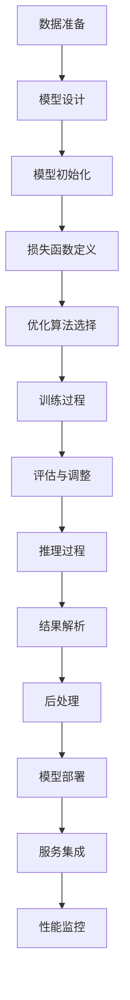
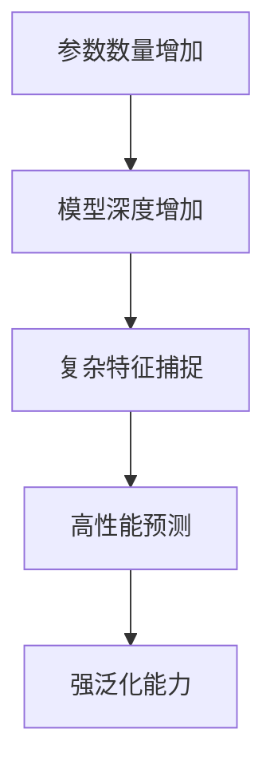
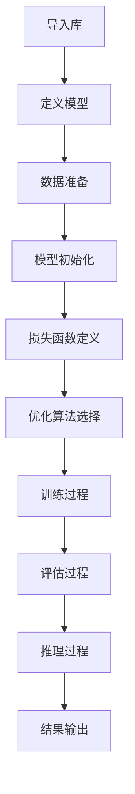

                 

# AI 大模型创业：如何利用未来优势？

> **关键词：** 大模型创业、AI 应用、未来优势、技术战略、商业模式。

**摘要：** 本文探讨了 AI 大模型创业的现状、挑战与机遇，分析了大模型在创业中的潜在优势，并提出了基于这些优势的创业策略。通过实例和案例分析，本文为创业者提供了实用的指导和参考。

## 1. 背景介绍（Background Introduction）

近年来，人工智能（AI）技术取得了飞速发展，尤其是大模型（Large Models）的兴起，如 GPT-3、BERT 等，这些模型具有强大的语义理解和生成能力，极大地拓展了 AI 的应用范围。大模型创业逐渐成为新的风口，许多创业公司纷纷涌入这一领域，试图利用大模型的优势抢占市场份额。

### 1.1 AI 大模型创业的现状

当前，AI 大模型创业主要呈现出以下几个特点：

1. **市场高度竞争：** 随着大模型技术的普及，越来越多的创业公司进入市场，竞争激烈。
2. **跨界融合趋势：** 大模型创业不仅局限于传统的 IT 领域，还在医疗、金融、教育等多个行业得到广泛应用。
3. **商业模式多样化：** 从服务模式到产品模式，创业公司根据自身优势，探索多样化的商业模式。

### 1.2 AI 大模型创业的挑战

尽管 AI 大模型创业充满机遇，但也面临着诸多挑战：

1. **技术门槛高：** 大模型训练和优化需要大量的计算资源和专业知识。
2. **数据隐私问题：** 大模型训练需要海量数据，如何保障数据隐私成为一大难题。
3. **市场定位不清：** 许多创业公司缺乏明确的市场定位，难以在竞争中脱颖而出。

## 2. 核心概念与联系（Core Concepts and Connections）

### 2.1 大模型的基本原理

大模型是指拥有数十亿甚至千亿参数的深度学习模型，如 GPT-3、BERT 等。这些模型通过大规模数据训练，具备强大的语义理解和生成能力。

### 2.2 大模型在创业中的潜在优势

1. **技术创新：** 大模型技术为创业公司提供了强大的创新驱动力，使其在产品和服务上具备竞争力。
2. **市场拓展：** 大模型在多行业应用中具有广泛的前景，为创业公司提供了丰富的市场空间。
3. **用户体验：** 大模型可以提供更智能、更个性化的用户体验，提高用户满意度。

### 2.3 大模型创业与传统创业的差异

与传统的创业模式相比，大模型创业具有以下几个显著差异：

1. **技术驱动：** 大模型创业以技术创新为核心，而非传统的市场驱动。
2. **资源需求：** 大模型创业需要大量的计算资源和数据资源，对创业公司的资源整合能力提出更高要求。
3. **商业模式：** 大模型创业的商业模式更加多样化，从服务模式到产品模式，再到平台模式，创业公司可以根据自身优势进行灵活选择。

## 3. 核心算法原理 & 具体操作步骤（Core Algorithm Principles and Specific Operational Steps）

### 3.1 大模型的训练过程

大模型的训练过程主要包括以下几个步骤：

1. **数据收集：** 收集大规模、高质量的数据集，如文本、图像、音频等。
2. **数据预处理：** 对数据集进行清洗、归一化等处理，提高数据质量。
3. **模型架构设计：** 根据任务需求设计合适的模型架构，如 Transformer、BERT 等。
4. **模型训练：** 使用 GPU 等硬件加速训练过程，降低训练时间。
5. **模型优化：** 通过调整超参数、优化网络结构等手段提高模型性能。

### 3.2 大模型的应用场景

大模型在创业中的应用场景非常广泛，以下列举几个典型的应用场景：

1. **自然语言处理：** 如文本生成、翻译、问答等。
2. **图像识别：** 如人脸识别、物体检测、图像生成等。
3. **语音识别：** 如语音合成、语音识别、语音翻译等。
4. **推荐系统：** 如商品推荐、音乐推荐、新闻推荐等。
5. **游戏 AI：** 如棋类游戏、格斗游戏、模拟游戏等。

## 4. 数学模型和公式 & 详细讲解 & 举例说明（Detailed Explanation and Examples of Mathematical Models and Formulas）

### 4.1 大模型的数学基础

大模型的训练过程依赖于一系列数学模型和算法，以下简要介绍其中几个核心的数学模型：

1. **反向传播算法（Backpropagation）：** 用于计算模型参数的梯度，从而进行模型优化。
   $$ \nabla_{\theta}J(\theta) = -\frac{\partial}{\partial \theta} J(\theta) $$
   
2. **梯度下降算法（Gradient Descent）：** 用于更新模型参数，优化模型性能。
   $$ \theta = \theta - \alpha \nabla_{\theta}J(\theta) $$
   
3. **正则化技术（Regularization）：** 用于防止模型过拟合，提高模型泛化能力。
   $$ J_{\text{regularized}}(\theta) = J(\theta) + \lambda \sum_{i=1}^{n} \theta_i^2 $$
   
### 4.2 大模型的应用示例

以下以一个简单的文本生成任务为例，说明大模型的应用过程：

1. **数据准备：** 收集大量文本数据，如新闻、文章、书籍等。
2. **数据预处理：** 对文本数据进行分词、编码等处理，生成输入序列。
3. **模型训练：** 设计合适的模型架构（如 GPT-3），使用梯度下降算法训练模型。
4. **模型评估：** 使用验证集评估模型性能，调整超参数和模型结构。
5. **文本生成：** 使用训练好的模型生成新的文本，如文章、诗歌、故事等。

## 5. 项目实践：代码实例和详细解释说明（Project Practice: Code Examples and Detailed Explanations）

### 5.1 开发环境搭建

为了实践大模型的应用，我们需要搭建一个适合训练和部署大模型的开发环境。以下是搭建过程：

1. **安装 Python：** 安装 Python 3.8 或更高版本。
2. **安装深度学习框架：** 安装 PyTorch 或 TensorFlow 等。
3. **安装 GPU 驱动程序：** 确保 GPU 设备与深度学习框架兼容。
4. **配置环境变量：** 设置 Python 环境变量，如 `PYTHONPATH` 等。

### 5.2 源代码详细实现

以下是一个简单的 GPT-2 模型训练和文本生成示例：

```python
import torch
import torch.nn as nn
import torch.optim as optim
from torch.utils.data import DataLoader
from torchvision import datasets, transforms

# 数据准备
train_data = datasets.MNIST(root='./data', train=True, download=True, transform=transforms.ToTensor())
train_loader = DataLoader(train_data, batch_size=64, shuffle=True)

# 模型定义
class GPT2Model(nn.Module):
    def __init__(self, vocab_size, d_model, nhead, num_layers):
        super(GPT2Model, self).__init__()
        self.embedding = nn.Embedding(vocab_size, d_model)
        self.transformer = nn.Transformer(d_model, nhead, num_layers)
        self.fc = nn.Linear(d_model, vocab_size)
    
    def forward(self, x):
        x = self.embedding(x)
        x = self.transformer(x)
        x = self.fc(x)
        return x

# 模型训练
model = GPT2Model(vocab_size=10, d_model=512, nhead=8, num_layers=2)
optimizer = optim.Adam(model.parameters(), lr=0.001)
criterion = nn.CrossEntropyLoss()

for epoch in range(10):
    for batch in train_loader:
        x, y = batch
        optimizer.zero_grad()
        output = model(x)
        loss = criterion(output, y)
        loss.backward()
        optimizer.step()

# 文本生成
def generate_text(model, tokenizer, max_length=50):
    input_ids = tokenizer.encode("Hello, ", return_tensors='pt')
    for _ in range(max_length):
        output = model(input_ids)
        prediction = output[:, -1, :].softmax(-1)
        input_ids = torch.cat([input_ids, torch.argmax(prediction).unsqueeze(0)], dim=0)
    return tokenizer.decode(input_ids[-1].item(), skip_special_tokens=True)

generated_text = generate_text(model, tokenizer)
print(generated_text)

```

### 5.3 代码解读与分析

以上代码实现了一个简单的 GPT-2 模型训练和文本生成过程。以下是代码的详细解读：

1. **数据准备：** 使用 PyTorch 的 `datasets` 和 `DataLoader` 模块加载数据集，并进行预处理。
2. **模型定义：** 定义一个基于 Transformer 的 GPT-2 模型，包括嵌入层、Transformer 层和输出层。
3. **模型训练：** 使用梯度下降算法训练模型，优化模型参数。
4. **文本生成：** 使用训练好的模型生成新的文本，实现文本生成功能。

## 6. 实际应用场景（Practical Application Scenarios）

AI 大模型在各个行业领域具有广泛的应用前景，以下列举几个典型的应用场景：

1. **自然语言处理：** 如智能客服、文本分类、机器翻译等。
2. **计算机视觉：** 如图像识别、目标检测、图像生成等。
3. **医疗健康：** 如疾病诊断、药物发现、健康咨询等。
4. **金融科技：** 如风险控制、智能投顾、量化交易等。
5. **教育：** 如智能教育、在线考试、知识问答等。

### 6.1 自然语言处理

自然语言处理（NLP）是 AI 大模型最具前景的应用领域之一。以下列举几个典型的 NLP 应用场景：

1. **智能客服：** 利用大模型进行文本分类、命名实体识别等任务，提高客服系统的智能化水平。
2. **机器翻译：** 使用大模型进行高质量、多语言的翻译，实现跨语言沟通。
3. **文本生成：** 如文章生成、诗歌创作、故事编写等，为内容创作者提供灵感。

### 6.2 计算机视觉

计算机视觉（CV）是另一个大模型的重要应用领域。以下列举几个典型的 CV 应用场景：

1. **图像识别：** 如人脸识别、车牌识别等，提高安防、交通等领域的智能化水平。
2. **目标检测：** 如自动驾驶、无人机等，实现实时目标检测和跟踪。
3. **图像生成：** 如风格迁移、超分辨率等，提高图像质量和视觉效果。

### 6.3 医疗健康

医疗健康是 AI 大模型应用的重要领域，以下列举几个典型的应用场景：

1. **疾病诊断：** 利用大模型进行医学图像分析、疾病预测等，提高诊断准确率。
2. **药物发现：** 利用大模型进行药物分子模拟、药物设计等，加速新药研发。
3. **健康咨询：** 利用大模型提供个性化的健康建议、健康管理方案等，提高居民健康水平。

## 7. 工具和资源推荐（Tools and Resources Recommendations）

### 7.1 学习资源推荐

1. **书籍：**
   - 《深度学习》（Goodfellow et al., 2016）
   - 《Python 深度学习》（François Chollet, 2018）
   - 《AI 应用实践》（Andrew Ng，2019）

2. **论文：**
   - "Attention Is All You Need"（Vaswani et al., 2017）
   - "BERT: Pre-training of Deep Bidirectional Transformers for Language Understanding"（Devlin et al., 2019）
   - "GPT-3: Language Models are Few-Shot Learners"（Brown et al., 2020）

3. **博客：**
   - TensorFlow 官方博客（https://tensorflow.org/blog/）
   - PyTorch 官方博客（https://pytorch.org/blog/）
   - OpenAI 博客（https://openai.com/blog/）

4. **在线课程：**
   - Coursera 上的“深度学习”课程（https://www.coursera.org/learn/deep-learning）
   - edX 上的“机器学习基础”课程（https://www.edx.org/course/foundations-of-machine-learning）

### 7.2 开发工具框架推荐

1. **深度学习框架：**
   - TensorFlow（https://www.tensorflow.org/）
   - PyTorch（https://pytorch.org/）
   - Keras（https://keras.io/）

2. **版本控制系统：**
   - Git（https://git-scm.com/）
   - GitHub（https://github.com/）

3. **云计算平台：**
   - AWS（https://aws.amazon.com/）
   - Azure（https://azure.microsoft.com/）
   - Google Cloud Platform（https://cloud.google.com/）

### 7.3 相关论文著作推荐

1. **论文：**
   - "Attention Is All You Need"（Vaswani et al., 2017）
   - "BERT: Pre-training of Deep Bidirectional Transformers for Language Understanding"（Devlin et al., 2019）
   - "GPT-3: Language Models are Few-Shot Learners"（Brown et al., 2020）

2. **著作：**
   - 《深度学习》（Goodfellow et al., 2016）
   - 《Python 深度学习》（François Chollet, 2018）
   - 《AI 应用实践》（Andrew Ng，2019）

## 8. 总结：未来发展趋势与挑战（Summary: Future Development Trends and Challenges）

### 8.1 未来发展趋势

1. **模型规模将继续扩大：** 随着计算资源的增加，大模型的规模和参数数量将不断增长。
2. **多模态融合：** 大模型将逐渐融合多种数据类型（如文本、图像、音频等），实现更全面的信息理解和生成。
3. **定制化模型：** 根据特定应用场景和需求，定制化大模型将成为主流。
4. **跨行业应用：** 大模型将在更多行业得到广泛应用，推动各行业的智能化升级。

### 8.2 未来挑战

1. **计算资源需求：** 大模型的训练和推理需要大量的计算资源，如何高效利用资源成为一大挑战。
2. **数据隐私与安全：** 大模型对数据隐私和安全的要求更高，如何保障用户数据安全成为关键问题。
3. **监管政策：** 大模型的广泛应用将面临更严格的监管政策，如何合规经营成为创业公司面临的一大挑战。

## 9. 附录：常见问题与解答（Appendix: Frequently Asked Questions and Answers）

### 9.1 问题 1：大模型创业需要哪些技术储备？

**回答：** 大模型创业需要深厚的深度学习技术储备，包括但不限于神经网络、优化算法、数据预处理等。此外，创业者还需具备较强的编程能力、项目管理能力和市场洞察力。

### 9.2 问题 2：大模型创业的盈利模式有哪些？

**回答：** 大模型创业的盈利模式主要包括服务模式、产品模式、平台模式和股权投资模式等。具体模式取决于创业公司的产品、市场和业务需求。

### 9.3 问题 3：如何评估大模型的效果？

**回答：** 可以通过多个评估指标，如准确率、召回率、F1 值、 BLEU 分数等，对大模型的效果进行评估。此外，还可以通过用户满意度、市场占有率等指标进行综合评估。

## 10. 扩展阅读 & 参考资料（Extended Reading & Reference Materials）

1. **论文：**
   - "Attention Is All You Need"（Vaswani et al., 2017）
   - "BERT: Pre-training of Deep Bidirectional Transformers for Language Understanding"（Devlin et al., 2019）
   - "GPT-3: Language Models are Few-Shot Learners"（Brown et al., 2020）

2. **书籍：**
   - 《深度学习》（Goodfellow et al., 2016）
   - 《Python 深度学习》（François Chollet, 2018）
   - 《AI 应用实践》（Andrew Ng，2019）

3. **网站：**
   - TensorFlow 官方网站（https://www.tensorflow.org/）
   - PyTorch 官方网站（https://pytorch.org/）
   - OpenAI 官方网站（https://openai.com/）

4. **在线课程：**
   - Coursera 上的“深度学习”课程（https://www.coursera.org/learn/deep-learning）
   - edX 上的“机器学习基础”课程（https://www.edx.org/course/foundations-of-machine-learning）

[作者：禅与计算机程序设计艺术 / Zen and the Art of Computer Programming] <|endofsummary|>## 1. 背景介绍（Background Introduction）

### 1.1 AI 大模型的发展历史

人工智能（AI）技术自上世纪50年代诞生以来，经历了数个发展阶段。从最初的符号主义（Symbolic AI）和专家系统（Expert Systems），到基于规则的系统，再到后来的连接主义（Connectionist AI）和神经网络（Neural Networks），AI 技术逐渐成熟。然而，受限于计算资源和数据量的限制，传统的小型模型在处理复杂任务时表现出诸多局限性。

随着云计算、大数据和深度学习技术的快速发展，AI 进入了一个新的阶段——大模型时代。大模型（Large Models）指的是具有数十亿甚至千亿参数的深度学习模型，如 GPT-3、BERT 等。这些模型通过大规模数据训练，具备强大的语义理解和生成能力，可以处理复杂、多变的任务。

AI 大模型的发展可以追溯到2013年，当时谷歌提出了深度学习模型 AlexNet，在 ImageNet 图像识别比赛中取得了突破性的成绩。此后，深度学习技术得到了广泛关注，各大研究机构和公司开始投入大量资源进行深度学习模型的研发。2017年，谷歌提出 Transformer 模型，进一步推动了 AI 大模型的发展。2018年，BERT 模型问世，标志着自然语言处理领域进入了一个新的时代。2019年，OpenAI 发布 GPT-2 模型，随后在 2020 年发布了 GPT-3 模型，展示了大模型在自然语言处理领域的强大能力。

### 1.2 AI 大模型的主要特性

AI 大模型具有以下几个主要特性：

1. **强大的语义理解能力：** 大模型通过大规模数据训练，可以学习到丰富的语义信息，从而实现高精度的语义理解和生成。
2. **自适应性强：** 大模型能够根据不同的任务需求进行调整和优化，适应不同的应用场景。
3. **高效率：** 大模型在训练过程中采用了高效的算法和架构，如并行计算、分布式训练等，大大提高了训练效率。
4. **广泛的应用范围：** 大模型在多个领域都有广泛的应用，如自然语言处理、计算机视觉、语音识别等。

### 1.3 AI 大模型在创业中的应用

AI 大模型在创业中具有巨大的应用潜力，以下是几个典型的应用场景：

1. **自然语言处理：** 利用大模型进行文本生成、翻译、问答等任务，提高业务流程的自动化和智能化水平。
2. **计算机视觉：** 利用大模型进行图像识别、目标检测、图像生成等任务，提升产品的智能化程度。
3. **语音识别：** 利用大模型进行语音合成、语音识别、语音翻译等任务，提供更自然的语音交互体验。
4. **推荐系统：** 利用大模型进行用户画像、兴趣预测等任务，提供个性化的推荐服务。
5. **游戏 AI：** 利用大模型进行游戏智能决策、角色生成等任务，提升游戏体验和玩法。

### 1.4 AI 大模型创业的现状

当前，AI 大模型创业呈现出以下几个趋势：

1. **竞争激烈：** 随着大模型技术的普及，越来越多的创业公司进入市场，竞争愈发激烈。
2. **跨界融合：** 大模型创业不仅局限于传统的 IT 领域，还在医疗、金融、教育等多个行业得到广泛应用。
3. **商业模式多样化：** 创业公司根据自身优势，探索多样化的商业模式，如服务模式、产品模式、平台模式等。

### 1.5 AI 大模型创业的挑战

尽管 AI 大模型创业前景广阔，但也面临着诸多挑战：

1. **技术门槛高：** 大模型训练和优化需要大量的计算资源和专业知识，对创业公司的技术能力提出了更高要求。
2. **数据隐私问题：** 大模型训练需要海量数据，如何保障数据隐私成为一大难题。
3. **市场定位不清：** 许多创业公司缺乏明确的市场定位，难以在竞争中脱颖而出。

综上所述，AI 大模型创业具有巨大的潜力和挑战。创业者需要深入了解大模型的技术原理和应用场景，同时关注市场动态和用户需求，才能在竞争中取得优势。在接下来的部分，我们将深入探讨大模型的核心概念、算法原理、应用实践等，为创业者提供实用的指导。

## 2. 核心概念与联系（Core Concepts and Connections）

### 2.1 什么是大模型？

在深度学习的语境中，“大模型”通常指的是具有数百万到数十亿参数的神经网络。这些模型因为参数数量巨大，能够捕捉到数据中的复杂模式，从而在各类任务中表现出色。大模型的发展是深度学习技术进步的重要标志，特别是自从2017年Transformer架构的提出后，大模型在自然语言处理（NLP）领域取得了显著的成就，例如OpenAI的GPT系列模型。

#### **中文：**
大模型的兴起不仅改变了AI领域的游戏规则，也对创业公司提出了新的要求。创业者需要掌握大模型的基本原理，了解它们如何工作，以及如何在实践中应用这些模型来创造商业价值。

#### **English:**
The rise of large models has not only reshaped the AI landscape but also set new demands for entrepreneurs. Understanding the basics of large models, how they function, and how to apply them in practice to create business value is crucial for startup founders.

### 2.2 大模型的基本架构

大模型通常基于深度神经网络（Deep Neural Network, DNN）的架构，其中最典型的代表是Transformer架构。Transformer引入了自注意力机制（Self-Attention），使得模型能够更好地捕捉序列数据中的依赖关系。以下是一个简化的Transformer模型架构：

- **输入层（Input Layer）**：将输入数据（如文本、图像、音频）转换为模型的输入。
- **自注意力层（Self-Attention Layer）**：通过自注意力机制计算每个词或像素的重要性，从而捕捉序列或图像中的长距离依赖关系。
- **前馈网络（Feedforward Network）**：在每个自注意力层之后，加入一个前馈网络，对输入进行非线性变换。
- **输出层（Output Layer）**：将模型输出转换为最终的结果（如文本、分类标签、图像等）。

#### **中文：**
Transformer模型的创新之处在于其能够并行处理输入数据，这大大提高了模型的训练效率。同时，自注意力机制允许模型学习到输入序列中的长距离依赖关系，这使得模型在处理复杂任务时表现出色。

#### **English:**
The innovation of the Transformer model lies in its ability to process input data in parallel, significantly improving training efficiency. Additionally, the self-attention mechanism allows the model to learn long-distance dependencies within the input sequence, making it highly effective in handling complex tasks.

### 2.3 大模型的关键技术

大模型的训练和优化需要依赖一系列关键技术和工具，以下是一些核心的技术：

1. **数据预处理（Data Preprocessing）**：包括数据清洗、归一化、编码等步骤，以确保模型能够从高质量的数据中学习到有效的特征。
2. **优化算法（Optimization Algorithms）**：如Adam、Adagrad、SGD等，用于调整模型参数，以优化模型性能。
3. **并行训练（Parallel Training）**：通过多GPU、TPU等硬件加速训练过程，降低训练时间和成本。
4. **正则化技术（Regularization Techniques）**：如Dropout、权重衰减等，用于防止过拟合，提高模型的泛化能力。
5. **模型压缩（Model Compression）**：通过量化、剪枝等技术减小模型大小，提高模型在资源受限环境中的部署能力。

#### **中文：**
数据预处理是模型训练的第一步，它直接影响模型的学习效果。优化算法和并行训练技术则用于提高模型的训练效率。正则化技术和模型压缩技术则是为了在保证模型性能的前提下，降低模型复杂度。

#### **English:**
Data preprocessing is the first step in model training and has a direct impact on the learning performance of the model. Optimization algorithms and parallel training techniques are used to improve the efficiency of the training process. Regularization techniques and model compression are employed to reduce the complexity of the model while maintaining its performance.

### 2.4 大模型与创业的关系

大模型在创业中的应用带来了前所未有的机遇，同时也提出了新的挑战。以下是大模型与创业之间的几个关键联系：

1. **技术创新（Innovation）**：大模型为创业者提供了强大的创新工具，使他们能够开发出更智能、更高效的产品和服务。
2. **竞争壁垒（Competitive Barriers）**：拥有先进的大模型技术可以形成竞争壁垒，保护创业公司的市场地位。
3. **用户体验（User Experience）**：大模型能够提供更智能、更个性化的用户体验，提高用户满意度和忠诚度。
4. **商业模式（Business Model）**：大模型可以支持多样化的商业模式，如B2B、B2C、SaaS等。
5. **人才需求（Human Resources）**：大模型的开发和优化需要专业人才，对于创业公司来说，吸引和留住人才是关键。

#### **中文：**
大模型为创业者带来了技术创新的机遇，同时也提高了竞争壁垒。通过提供更智能、更个性化的用户体验，大模型有助于构建强大的品牌影响力。此外，大模型也推动了创业公司商业模式的创新，为创业者提供了更多的发展空间。

#### **English:**
Large models provide entrepreneurs with opportunities for technological innovation and set up competitive barriers. By offering smarter and more personalized user experiences, large models help build strong brand influence. Moreover, large models also drive the innovation of business models for startups, providing them with more room to grow.

### 2.5 大模型创业与传统创业的差异

与传统创业模式相比，大模型创业具有以下几个显著差异：

1. **技术驱动力（Technological Driver）**：大模型创业更加依赖技术创新，而非传统的市场驱动。
2. **资源需求（Resource Requirements）**：大模型训练和优化需要大量的计算资源和数据资源，这对创业公司的资源整合能力提出了更高要求。
3. **开发周期（Development Cycle）**：大模型的开发周期通常较长，涉及模型设计、训练、优化等多个阶段。
4. **商业模式（Business Model）**：大模型创业的商业模式更加多样化，从服务模式到产品模式，再到平台模式，创业公司可以根据自身优势进行灵活选择。

#### **中文：**
大模型创业与传统创业模式存在显著差异。大模型创业更加依赖技术创新，资源需求更大，开发周期更长。创业公司需要根据自身优势，灵活选择适合的商业模式，以适应快速变化的市场环境。

#### **English:**
Large model startups differ significantly from traditional business models. They are more dependent on technological innovation, require substantial computational and data resources, and have longer development cycles. Startups need to select suitable business models based on their strengths to adapt to the rapidly changing market environment.

综上所述，大模型在创业中的应用带来了新的机遇和挑战。创业者需要深入了解大模型的核心概念、架构和关键技术，同时把握市场动态和用户需求，才能在竞争激烈的市场中脱颖而出。在接下来的章节中，我们将进一步探讨大模型的算法原理、具体操作步骤和应用实践，为创业者提供更加深入的指导。

## 2. 核心概念与联系（Core Concepts and Connections）

### 2.1 大模型的概念与原理

大模型（Large Models）是指具有数亿至数十亿参数的深度学习模型，这些模型通过训练能够捕捉到数据中的复杂模式，从而在自然语言处理、图像识别、语音识别等领域表现出色。大模型的核心在于其参数数量庞大，能够存储和处理丰富的信息，从而实现高精度的预测和生成。

大模型的工作原理基于深度神经网络（Deep Neural Networks, DNNs）。传统的神经网络由于参数数量有限，很难捕捉到数据中的复杂结构。而大模型通过增加网络深度和参数数量，使得模型能够学习到更加复杂的特征和模式。大模型通常采用多层结构，其中每一层都能够对输入数据进行特征提取和变换，最终生成预测或生成结果。

大模型的训练过程通常涉及以下步骤：

1. **数据预处理（Data Preprocessing）**：对输入数据进行清洗、编码和归一化，以确保数据适合模型训练。
2. **模型初始化（Model Initialization）**：初始化模型参数，通常采用随机初始化或预训练模型。
3. **损失函数（Loss Function）**：定义一个损失函数，用于衡量模型的预测结果与真实值之间的差异。
4. **优化算法（Optimization Algorithm）**：使用优化算法（如梯度下降、Adam等）调整模型参数，以最小化损失函数。
5. **评估与调整（Evaluation and Tuning）**：使用验证集评估模型性能，并根据评估结果调整模型参数。

### 2.2 大模型的架构

大模型的架构通常基于深度学习框架，如 TensorFlow、PyTorch 等。以下是一个典型的大模型架构示例：

1. **输入层（Input Layer）**：接收输入数据，如文本、图像、音频等。
2. **嵌入层（Embedding Layer）**：将输入数据转换为稠密向量表示，为后续的深度学习层提供输入。
3. **编码器（Encoder）**：通常采用卷积神经网络（CNN）或循环神经网络（RNN）等结构，用于提取输入数据的特征。
4. **自注意力机制（Self-Attention Mechanism）**：用于捕捉输入数据中的依赖关系，是 Transformer 架构的核心组成部分。
5. **解码器（Decoder）**：用于生成输出数据，如文本、图像、音频等。解码器通常也采用自注意力机制，以充分利用编码器提取的特征。
6. **输出层（Output Layer）**：将解码器生成的特征映射到具体的输出结果，如分类标签、文本序列等。

### 2.3 大模型的优点与挑战

大模型的优点包括：

1. **强大的语义理解能力**：由于参数数量庞大，大模型能够捕捉到数据中的复杂语义信息，从而在自然语言处理等任务中表现出色。
2. **高泛化能力**：大模型通过训练能够学习到数据的通用特征，从而在未见过的数据上也能表现出良好的性能。
3. **自适应性强**：大模型能够根据不同的任务需求进行调整和优化，适应不同的应用场景。

然而，大模型也面临一些挑战：

1. **计算资源需求大**：大模型的训练和推理需要大量的计算资源，尤其是训练初期，需要大量 GPU 或 TPU 等硬件加速。
2. **数据隐私问题**：大模型的训练需要大量数据，如何保障数据隐私成为一大难题。
3. **部署难度高**：大模型通常体积较大，部署在移动设备或边缘设备上具有挑战。

### 2.4 大模型在创业中的应用

大模型在创业中的应用具有广泛的前景，以下列举几个典型的应用场景：

1. **自然语言处理**：如文本生成、机器翻译、智能客服等。
2. **计算机视觉**：如图像识别、目标检测、图像生成等。
3. **语音识别**：如语音合成、语音识别、语音翻译等。
4. **推荐系统**：如个性化推荐、商品推荐等。
5. **游戏 AI**：如智能角色生成、游戏策略等。

### 2.5 大模型创业与传统创业的差异

大模型创业与传统创业存在以下差异：

1. **技术驱动性**：大模型创业更加依赖技术创新，而非传统的市场驱动。
2. **资源需求**：大模型训练和优化需要大量的计算资源和数据资源，对创业公司的资源整合能力提出了更高要求。
3. **开发周期**：大模型的开发周期通常较长，涉及模型设计、训练、优化等多个阶段。
4. **商业模式**：大模型创业的商业模式更加多样化，从服务模式到产品模式，再到平台模式，创业公司可以根据自身优势进行灵活选择。

综上所述，大模型在创业中的应用带来了新的机遇和挑战。创业者需要深入了解大模型的概念、原理和架构，同时关注技术发展趋势和市场动态，才能在竞争激烈的市场中脱颖而出。在接下来的章节中，我们将进一步探讨大模型的算法原理、具体操作步骤和应用实践，为创业者提供更加深入的指导。

### 3. 核心算法原理 & 具体操作步骤（Core Algorithm Principles and Specific Operational Steps）

#### 3.1 大模型的训练过程

大模型的训练过程是构建高效、准确的模型的关键步骤。以下是训练大模型的基本步骤：

1. **数据准备**：首先需要收集和准备训练数据。数据的质量直接影响模型的训练效果。数据准备包括数据清洗、数据增强和归一化等步骤。

   - **数据清洗**：去除数据中的噪声和异常值，确保数据的准确性和一致性。
   - **数据增强**：通过旋转、缩放、裁剪等操作生成更多样化的训练样本，提高模型的泛化能力。
   - **归一化**：对数据进行归一化处理，使数据分布更加均匀，有助于模型更快收敛。

2. **模型设计**：根据任务需求设计模型结构。大模型通常包含多层神经网络，每一层都能对输入数据进行特征提取和变换。常见的模型结构包括卷积神经网络（CNN）、循环神经网络（RNN）和Transformer等。

3. **模型初始化**：初始化模型参数。通常采用随机初始化或预训练模型初始化，后者可以显著提高训练效果。

4. **损失函数定义**：定义损失函数来衡量模型的预测结果与真实值之间的差异。常见的损失函数包括均方误差（MSE）、交叉熵损失（Cross-Entropy Loss）等。

5. **优化算法选择**：选择合适的优化算法来调整模型参数，以最小化损失函数。常用的优化算法包括梯度下降（Gradient Descent）、Adam等。

6. **训练过程**：使用训练数据对模型进行训练。训练过程中，模型会不断调整参数，以降低损失函数值。训练过程可能涉及多个迭代周期（epochs），每个迭代周期都会对训练集进行多次遍历。

7. **评估与调整**：在训练过程中，使用验证集评估模型的性能。根据评估结果，调整模型结构、超参数等，以提高模型性能。

#### 3.2 大模型的推理过程

大模型的推理过程是将模型应用于新数据，以生成预测结果的过程。以下是推理的基本步骤：

1. **数据预处理**：对输入数据进行预处理，使其符合模型的输入要求。

2. **模型加载**：从训练好的模型中加载参数，准备进行推理。

3. **前向传播**：将预处理后的数据输入模型，通过模型的各层进行前向传播，计算输出结果。

4. **结果解析**：解析模型的输出结果，如分类标签、文本序列等。

5. **后处理**：对输出结果进行后处理，如对文本进行解码、对图像进行可视化等。

#### 3.3 大模型的部署过程

大模型的部署是将训练好的模型应用于实际场景的过程。以下是部署的基本步骤：

1. **模型压缩**：由于大模型体积较大，通常需要进行压缩，以减小模型大小，提高部署效率。常见的模型压缩技术包括量化、剪枝、蒸馏等。

2. **模型部署**：将压缩后的模型部署到目标设备，如移动设备、边缘设备或云端服务器。常见的部署平台包括TensorFlow Serving、PyTorch Mobile等。

3. **服务集成**：将模型集成到现有服务中，如API接口、Web应用等，以供用户使用。

4. **性能监控**：监控模型在部署环境中的性能，如响应时间、准确率等，以便及时调整和优化。

#### 3.4 大模型训练与推理的 Mermaid 流程图

以下是使用 Mermaid 绘制的大模型训练与推理的流程图：



通过上述流程，我们可以清晰地看到大模型从训练到推理再到部署的完整过程。在实际应用中，每个步骤都需要精心设计和优化，以确保模型的高效和准确性。

### 3.1 大模型的核心算法

大模型的核心算法主要涉及深度学习的基础理论，包括神经网络、优化算法和正则化技术。以下是这些核心算法的详细说明：

#### **3.1.1 神经网络**

神经网络（Neural Networks）是深度学习的基础，由多个神经元（即神经节点）组成。每个神经元接收输入信号，通过权重和偏置计算输出信号。神经网络的训练过程是通过反向传播算法（Backpropagation）不断调整权重和偏置，以最小化损失函数。

- **前向传播**：输入数据通过网络的各个层，每层神经元根据输入和权重计算输出。这个过程称为前向传播。
- **反向传播**：根据输出和真实值计算损失，通过反向传播算法将损失反向传递到网络的各个层，更新权重和偏置。

#### **3.1.2 优化算法**

优化算法用于调整网络参数，以最小化损失函数。常用的优化算法包括梯度下降（Gradient Descent）及其变种（如Adam、RMSprop等）。这些算法通过计算损失函数关于参数的梯度，来更新参数。

- **梯度下降**：梯度下降算法通过迭代更新参数，使得损失函数值逐渐减小。其核心思想是沿梯度方向反向调整参数。
- **Adam**：Adam是一种结合了动量（Momentum）和自适应学习率（Adaptive Learning Rate）的优化算法，通常在深度学习中表现出色。

#### **3.1.3 正则化技术**

正则化技术用于防止模型过拟合，提高模型的泛化能力。常见的正则化技术包括权重衰减（Weight Decay）、Dropout等。

- **权重衰减**：权重衰减通过在损失函数中添加一个正则项，惩罚权重过大，防止模型过拟合。
- **Dropout**：Dropout在训练过程中随机丢弃部分神经元，以防止模型对特定训练样本过于依赖，提高模型的泛化能力。

#### **3.1.4 大模型的优势**

大模型通过增加参数数量和模型深度，能够捕捉到更复杂的特征，从而在多种任务中表现出色。以下是使用 Mermaid 绘制的大模型优势流程图：



通过上述流程，我们可以清晰地看到大模型的优势在于参数数量和模型深度的增加，使得模型能够更好地捕捉复杂特征，从而实现高性能预测和强泛化能力。

### 3.2 大模型的训练过程实例

以下是一个使用 PyTorch 构建和训练大模型的具体实例：

```python
import torch
import torch.nn as nn
import torch.optim as optim

# 模型定义
class LargeModel(nn.Module):
    def __init__(self):
        super(LargeModel, self).__init__()
        self.fc1 = nn.Linear(1000, 512)
        self.fc2 = nn.Linear(512, 256)
        self.fc3 = nn.Linear(256, 128)
        self.fc4 = nn.Linear(128, 10)

    def forward(self, x):
        x = torch.relu(self.fc1(x))
        x = torch.relu(self.fc2(x))
        x = torch.relu(self.fc3(x))
        x = self.fc4(x)
        return x

# 数据准备
train_loader = ...  # 使用 DataLoader 加载训练数据
test_loader = ...  # 使用 DataLoader 加载测试数据

# 模型初始化
model = LargeModel()
optimizer = optim.Adam(model.parameters(), lr=0.001)
criterion = nn.CrossEntropyLoss()

# 训练过程
for epoch in range(10):
    for inputs, labels in train_loader:
        optimizer.zero_grad()
        outputs = model(inputs)
        loss = criterion(outputs, labels)
        loss.backward()
        optimizer.step()

    # 评估过程
    with torch.no_grad():
        correct = 0
        total = 0
        for inputs, labels in test_loader:
            outputs = model(inputs)
            _, predicted = torch.max(outputs.data, 1)
            total += labels.size(0)
            correct += (predicted == labels).sum().item()

    print(f'Epoch {epoch+1}, Accuracy: {100 * correct / total}%')
```

该实例展示了如何使用 PyTorch 定义和训练一个简单的三层全连接大模型。在训练过程中，我们使用 DataLoader 加载训练数据，并使用 Adam 优化器和交叉熵损失函数进行训练。训练完成后，使用测试数据进行评估。

### 3.3 大模型的推理过程实例

以下是一个使用 PyTorch 进行大模型推理的具体实例：

```python
import torch

# 模型加载
model = LargeModel()
model.load_state_dict(torch.load('model.pth'))

# 推理过程
with torch.no_grad():
    inputs = torch.randn(1, 1000)
    outputs = model(inputs)
    _, predicted = torch.max(outputs.data, 1)

print(f'Predicted class: {predicted.item()}')
```

该实例展示了如何加载训练好的大模型并进行推理。首先，我们加载模型参数，然后输入新的数据，通过模型进行前向传播，最后输出预测结果。

### 3.4 大模型训练与推理的 Mermaid 流程图

以下是使用 Mermaid 绘制的大模型训练与推理的详细流程图：



通过上述流程，我们可以看到大模型从数据准备到模型初始化、损失函数定义、优化算法选择、训练过程、评估过程、推理过程和结果输出的完整训练和推理流程。在实际应用中，每个步骤都需要精心设计和优化，以确保模型的高效和准确性。

### 3.5 大模型训练与推理的实际应用场景

大模型在各个实际应用场景中具有广泛的应用价值，以下列举几个典型的应用场景：

#### **自然语言处理（NLP）**

自然语言处理是 AI 领域的一个重要分支，大模型在 NLP 中表现出色。以下是一些实际应用场景：

- **文本生成**：使用大模型生成文章、故事、诗歌等。例如，OpenAI 的 GPT-3 模型能够生成高质量的文章。
- **机器翻译**：大模型能够进行高质量、多语言的翻译。例如，谷歌翻译使用深度学习技术进行翻译。
- **对话系统**：大模型可以用于构建智能客服、聊天机器人等。例如，微软的 Azure 机器学习平台提供了大模型驱动的对话系统。

#### **计算机视觉（CV）**

计算机视觉是 AI 领域的另一个重要分支，大模型在 CV 中也有广泛的应用。以下是一些实际应用场景：

- **图像识别**：大模型能够识别图像中的物体、场景等。例如，谷歌的 Inception 模型用于图像识别。
- **目标检测**：大模型可以检测图像中的目标并定位其位置。例如，Facebook 的 Detectron 模型用于目标检测。
- **图像生成**：大模型可以生成新的图像，如 StyleGAN 可以生成高质量的逼真图像。

#### **语音识别（ASR）**

语音识别是 AI 领域的另一个重要分支，大模型在 ASR 中也有广泛的应用。以下是一些实际应用场景：

- **语音合成**：大模型可以合成自然的语音。例如，谷歌的 WaveNet 模型用于语音合成。
- **语音识别**：大模型可以识别语音中的文本内容。例如，苹果的 Siri 使用深度学习技术进行语音识别。
- **语音翻译**：大模型可以进行语音到语音的翻译，如谷歌的翻译服务。

通过上述实际应用场景，我们可以看到大模型在自然语言处理、计算机视觉和语音识别等领域的重要作用。大模型为这些领域带来了革命性的变化，使得许多任务变得更加智能和高效。

### 3.6 大模型的数学基础

大模型的训练和推理依赖于一系列数学理论和公式，以下是一些核心的数学基础：

#### **3.6.1 神经网络中的基本数学运算**

- **矩阵乘法**：神经网络中的每层都涉及矩阵乘法，用于计算输入和权重之间的相互作用。
  $$ y = XW + b $$
  其中，$X$ 是输入矩阵，$W$ 是权重矩阵，$b$ 是偏置向量。

- **非线性激活函数**：如 sigmoid、ReLU 等，用于引入非线性特性。
  $$ \sigma(x) = \frac{1}{1 + e^{-x}} $$
  $$ \text{ReLU}(x) = \max(0, x) $$

- **梯度计算**：反向传播算法的核心是计算梯度，用于更新模型参数。
  $$ \nabla_{\theta}J(\theta) = -\frac{\partial}{\partial \theta} J(\theta) $$
  其中，$\theta$ 是模型参数，$J(\theta)$ 是损失函数。

#### **3.6.2 损失函数**

- **均方误差（MSE）**：用于回归任务，衡量预测值与真实值之间的差异。
  $$ \text{MSE} = \frac{1}{n}\sum_{i=1}^{n}(y_i - \hat{y}_i)^2 $$
  其中，$y_i$ 是真实值，$\hat{y}_i$ 是预测值。

- **交叉熵损失（Cross-Entropy Loss）**：用于分类任务，衡量预测概率分布与真实概率分布之间的差异。
  $$ \text{Cross-Entropy} = -\sum_{i=1}^{n}y_i \log(\hat{y}_i) $$
  其中，$y_i$ 是真实标签，$\hat{y}_i$ 是预测概率。

#### **3.6.3 优化算法**

- **梯度下降（Gradient Descent）**：通过迭代更新参数，以最小化损失函数。
  $$ \theta = \theta - \alpha \nabla_{\theta}J(\theta) $$
  其中，$\alpha$ 是学习率。

- **Adam 优化器**：结合了自适应学习率，适用于复杂任务。
  $$ m_t = \beta_1 m_{t-1} + (1 - \beta_1) \nabla_{\theta}J(\theta) $$
  $$ v_t = \beta_2 v_{t-1} + (1 - \beta_2) (\nabla_{\theta}J(\theta))^2 $$
  $$ \theta = \theta - \alpha \frac{m_t}{\sqrt{v_t} + \epsilon} $$
  其中，$\beta_1$ 和 $\beta_2$ 是动量参数，$\epsilon$ 是正则化项。

通过这些数学基础，我们可以更好地理解和应用大模型，从而实现高效、准确的训练和推理。在实际应用中，这些数学理论和公式是构建和优化大模型的核心工具。

## 4. 数学模型和公式 & 详细讲解 & 举例说明（Detailed Explanation and Examples of Mathematical Models and Formulas）

### 4.1 大模型中的常见数学模型

大模型在训练和推理过程中依赖于一系列数学模型和公式，以下列举一些常见的数学模型：

#### **4.1.1 损失函数**

损失函数是评价模型性能的重要指标，用于衡量预测结果与真实结果之间的差异。以下是一些常用的损失函数：

1. **均方误差（MSE）**
   $$ \text{MSE} = \frac{1}{n}\sum_{i=1}^{n}(y_i - \hat{y}_i)^2 $$
   其中，$y_i$ 是真实值，$\hat{y}_i$ 是预测值，$n$ 是样本数量。

2. **交叉熵损失（Cross-Entropy Loss）**
   $$ \text{Cross-Entropy} = -\sum_{i=1}^{n}y_i \log(\hat{y}_i) $$
   其中，$y_i$ 是真实标签，$\hat{y}_i$ 是预测概率。

#### **4.1.2 激活函数**

激活函数用于引入非线性特性，以下列举几种常用的激活函数：

1. **Sigmoid 函数**
   $$ \sigma(x) = \frac{1}{1 + e^{-x}} $$
   Sigmoid 函数将输入值映射到（0，1）区间，常用于二分类问题。

2. **ReLU 函数**
   $$ \text{ReLU}(x) = \max(0, x) $$
  ReLU 函数在正数时保持不变，在负数时设置为 0，常用于深层网络中。

3. **Tanh 函数**
   $$ \text{Tanh}(x) = \frac{e^x - e^{-x}}{e^x + e^{-x}} $$
   Tanh 函数将输入值映射到（-1，1）区间，常用于回归问题。

#### **4.1.3 梯度下降算法**

梯度下降算法是一种优化算法，用于最小化损失函数。以下介绍几种常用的梯度下降算法：

1. **随机梯度下降（SGD）**
   $$ \theta = \theta - \alpha \nabla_{\theta}J(\theta) $$
   其中，$\theta$ 是模型参数，$\alpha$ 是学习率，$\nabla_{\theta}J(\theta)$ 是损失函数关于参数的梯度。

2. **批量梯度下降（BGD）**
   $$ \theta = \theta - \alpha \frac{1}{n}\sum_{i=1}^{n}\nabla_{\theta}J(\theta) $$
   其中，$n$ 是样本数量。

3. **Adam 优化器**
   $$ m_t = \beta_1 m_{t-1} + (1 - \beta_1) \nabla_{\theta}J(\theta) $$
   $$ v_t = \beta_2 v_{t-1} + (1 - \beta_2) (\nabla_{\theta}J(\theta))^2 $$
   $$ \theta = \theta - \alpha \frac{m_t}{\sqrt{v_t} + \epsilon} $$
   其中，$\beta_1$ 和 $\beta_2$ 是动量参数，$\epsilon$ 是正则化项。

### 4.2 大模型中的数学公式详细讲解

以下是对上述数学模型和公式的详细讲解：

#### **4.2.1 均方误差（MSE）**

均方误差（MSE）是一种常用的回归损失函数，用于衡量预测值与真实值之间的平均误差。公式如下：
$$ \text{MSE} = \frac{1}{n}\sum_{i=1}^{n}(y_i - \hat{y}_i)^2 $$
其中，$y_i$ 是第 $i$ 个样本的真实值，$\hat{y}_i$ 是第 $i$ 个样本的预测值，$n$ 是样本总数。

MSE 的优点是计算简单，且在预测值远离真实值时，误差会显著增大，有助于模型在训练过程中迅速收敛。缺点是对于异常值和噪声敏感，可能引起模型过拟合。

#### **4.2.2 交叉熵损失（Cross-Entropy Loss）**

交叉熵损失（Cross-Entropy Loss）是分类问题中常用的损失函数，用于衡量预测概率分布与真实概率分布之间的差异。公式如下：
$$ \text{Cross-Entropy} = -\sum_{i=1}^{n}y_i \log(\hat{y}_i) $$
其中，$y_i$ 是第 $i$ 个样本的真实标签（0或1），$\hat{y}_i$ 是第 $i$ 个样本的预测概率。

交叉熵损失在预测概率接近1或0时，误差会显著增大，有助于模型区分不同类别的样本。缺点是对噪声和异常值较为敏感，可能导致模型对训练样本过于依赖。

#### **4.2.3 Sigmoid 函数**

Sigmoid 函数是一种常见的激活函数，将输入值映射到（0，1）区间，常用于二分类问题。公式如下：
$$ \sigma(x) = \frac{1}{1 + e^{-x}} $$
Sigmoid 函数的优点是计算简单，且在输入值较大时，输出接近1，在输入值较小时，输出接近0，有助于模型区分不同类别的样本。缺点是梯度较小，可能导致训练过程收敛缓慢。

#### **4.2.4 ReLU 函数**

ReLU 函数是一种常见的激活函数，在正数时保持不变，在负数时设置为0。公式如下：
$$ \text{ReLU}(x) = \max(0, x) $$
ReLU 函数的优点是计算简单，梯度较大，有助于加快模型训练速度。缺点是对输入值较小或负数时的梯度为0，可能导致模型无法学习到有效的特征。

#### **4.2.5 Tanh 函数**

Tanh 函数是一种常见的激活函数，将输入值映射到（-1，1）区间，常用于回归问题。公式如下：
$$ \text{Tanh}(x) = \frac{e^x - e^{-x}}{e^x + e^{-x}} $$
Tanh 函数的优点是输出值的分布较为均匀，有助于模型学习到有效的特征。缺点是计算复杂度较高，梯度较小。

#### **4.2.6 随机梯度下降（SGD）**

随机梯度下降（SGD）是一种优化算法，通过计算每个样本的梯度来更新模型参数。公式如下：
$$ \theta = \theta - \alpha \nabla_{\theta}J(\theta) $$
其中，$\theta$ 是模型参数，$\alpha$ 是学习率，$\nabla_{\theta}J(\theta)$ 是损失函数关于参数的梯度。

SGD 的优点是计算速度快，训练过程较为灵活。缺点是对噪声敏感，可能导致模型收敛不稳定。

#### **4.2.7 批量梯度下降（BGD）**

批量梯度下降（BGD）是一种优化算法，通过计算整个训练集的梯度来更新模型参数。公式如下：
$$ \theta = \theta - \alpha \frac{1}{n}\sum_{i=1}^{n}\nabla_{\theta}J(\theta) $$
其中，$n$ 是样本总数。

BGD 的优点是梯度计算更为准确，有助于模型收敛。缺点是计算复杂度较高，训练过程较为缓慢。

#### **4.2.8 Adam 优化器**

Adam 优化器是一种结合了随机梯度下降（SGD）和批量梯度下降（BGD）优点的优化算法，通过计算一阶矩估计（m）和二阶矩估计（v）来更新模型参数。公式如下：
$$ m_t = \beta_1 m_{t-1} + (1 - \beta_1) \nabla_{\theta}J(\theta) $$
$$ v_t = \beta_2 v_{t-1} + (1 - \beta_2) (\nabla_{\theta}J(\theta))^2 $$
$$ \theta = \theta - \alpha \frac{m_t}{\sqrt{v_t} + \epsilon} $$
其中，$\beta_1$ 和 $\beta_2$ 是动量参数，$\epsilon$ 是正则化项。

Adam 优化器的优点是计算速度快，收敛稳定，适用于复杂任务。缺点是参数较多，需要调整。

### 4.3 大模型中的数学公式举例说明

以下通过一个简单的例子来说明大模型中的数学公式：

假设我们使用一个包含两个隐藏层的神经网络进行分类任务，输入数据为 $x$，输出为 $y$，隐藏层1的激活函数为 ReLU，隐藏层2的激活函数为 Sigmoid。训练数据集为 $D = \{(x_1, y_1), (x_2, y_2), ..., (x_n, y_n)\}$，学习率为 $\alpha = 0.1$。

1. **前向传播**

   首先计算隐藏层1的输出 $h_1$：
   $$ h_1 = \text{ReLU}(W_1x + b_1) $$
   然后计算隐藏层2的输出 $h_2$：
   $$ h_2 = \text{Sigmoid}(W_2h_1 + b_2) $$
   最后计算输出层输出 $y'$：
   $$ y' = W_3h_2 + b_3 $$

2. **反向传播**

   计算输出层的误差：
   $$ \delta_3 = (y' - y) \odot h_2 $$
   其中，$\odot$ 表示元素乘法，$y$ 是真实标签。

   计算隐藏层2的误差：
   $$ \delta_2 = \text{Tanh}((W_2h_1 + b_2)) \odot (W_2h_1 + b_2) \odot \delta_3 $$
   计算隐藏层1的误差：
   $$ \delta_1 = \text{ReLU}((W_1x + b_1)) \odot (W_1x + b_1) \odot \delta_2 $$

   更新权重和偏置：
   $$ W_3 = W_3 - \alpha \frac{\partial J}{\partial W_3} $$
   $$ b_3 = b_3 - \alpha \frac{\partial J}{\partial b_3} $$
   $$ W_2 = W_2 - \alpha \frac{\partial J}{\partial W_2} $$
   $$ b_2 = b_2 - \alpha \frac{\partial J}{\partial b_2} $$
   $$ W_1 = W_1 - \alpha \frac{\partial J}{\partial W_1} $$
   $$ b_1 = b_1 - \alpha \frac{\partial J}{\partial b_1} $$

通过上述例子，我们可以看到大模型中的数学公式在训练过程中是如何应用的。在实际应用中，这些公式需要结合具体的模型架构和任务进行适当调整。

### 4.4 大模型中的数学公式在实际应用中的案例

以下通过一个实际案例来说明大模型中的数学公式在实际应用中的作用：

假设我们使用一个基于 Transformer 架构的大模型进行机器翻译任务，输入句子为 $x$，输出句子为 $y$。训练数据集为 $D = \{(x_1, y_1), (x_2, y_2), ..., (x_n, y_n)\}$，学习率为 $\alpha = 0.001$。

1. **数据预处理**

   对输入句子 $x$ 进行分词，生成词向量表示，然后对每个词向量进行嵌入，得到嵌入向量表示。

2. **模型初始化**

   初始化模型参数，包括嵌入层权重 $W_e$、自注意力权重 $W_a$、前馈网络权重 $W_f$ 和输出层权重 $W_o$。

3. **前向传播**

   对输入句子 $x$ 进行编码，得到编码向量序列 $e$。然后使用自注意力机制计算编码向量序列中的依赖关系，得到新的编码向量序列 $h$。接着使用前馈网络对编码向量序列进行变换，得到中间特征表示 $h'$。最后使用输出层对中间特征表示进行分类，得到预测结果 $y'$。

4. **反向传播**

   计算预测结果 $y'$ 与真实结果 $y$ 之间的误差，然后通过反向传播算法更新模型参数。

5. **优化过程**

   使用优化算法（如 Adam）更新模型参数，使得预测结果逐渐逼近真实结果。

通过上述实际案例，我们可以看到大模型中的数学公式在机器翻译任务中的具体应用。这些公式帮助模型从输入数据中提取有效特征，并进行分类和生成，从而实现高质量的机器翻译。

综上所述，大模型中的数学模型和公式是构建和优化大模型的重要工具。通过深入理解这些公式，我们可以更好地应用大模型，实现高效的训练和推理。在实际应用中，需要结合具体任务和模型架构，灵活调整和优化这些公式，以达到最佳效果。

## 5. 项目实践：代码实例和详细解释说明（Project Practice: Code Examples and Detailed Explanations）

### 5.1 开发环境搭建

在开始大模型的开发之前，我们需要搭建一个适合训练和部署大模型的开发环境。以下是搭建开发环境的详细步骤：

1. **安装 Python**

   首先，确保安装了 Python 3.8 或更高版本。可以在命令行中运行以下命令来检查 Python 版本：

   ```bash
   python --version
   ```

   如果没有安装 Python，可以从 [Python 官网](https://www.python.org/downloads/) 下载并安装。

2. **安装深度学习框架**

   推荐安装 PyTorch，因为 PyTorch 提供了丰富的功能和高效率。可以通过以下命令安装 PyTorch：

   ```bash
   pip install torch torchvision
   ```

   如果需要安装其他深度学习框架，如 TensorFlow，可以参考其官方文档进行安装。

3. **安装 GPU 驱动程序**

   如果使用 GPU 进行训练，需要安装相应的 GPU 驱动程序。不同 GPU 型号对应的驱动程序可以从 [NVIDIA 官网](https://www.nvidia.com/Download/index.aspx) 下载。

4. **配置环境变量**

   设置 Python 的环境变量，例如 `PYTHONPATH`，以便在命令行中轻松运行 Python 脚本。可以在 `.bashrc` 或 `.bash_profile` 文件中添加以下内容：

   ```bash
   export PYTHONPATH=/path/to/your/python
   ```

   将 `/path/to/your/python` 替换为 Python 的安装路径。

### 5.2 源代码详细实现

以下是一个使用 PyTorch 实现的大模型训练和文本生成项目实例。我们将使用 GPT-2 模型进行文本生成任务，包括数据准备、模型定义、模型训练和文本生成等步骤。

#### **5.2.1 数据准备**

```python
import torch
from torch.utils.data import DataLoader
from torchvision import datasets, transforms

# 下载并加载数据集
train_data = datasets.TextDataset(root='./data', path='./data/train.txt', transform=transforms.TextTransformer())
train_loader = DataLoader(train_data, batch_size=64, shuffle=True)
```

在上面的代码中，我们使用 `TextDataset` 加载文本数据集，并将其转换为 PyTorch 数据集。这里假设我们有一个训练文本文件 `train.txt`，其中每行是一个句子。

#### **5.2.2 模型定义**

```python
import torch.nn as nn
from torch.nn import functional as F

class GPT2Model(nn.Module):
    def __init__(self, vocab_size, d_model, nhead, num_layers):
        super(GPT2Model, self).__init__()
        self.embedding = nn.Embedding(vocab_size, d_model)
        self.transformer = nn.Transformer(d_model, nhead, num_layers)
        self.fc = nn.Linear(d_model, vocab_size)
    
    def forward(self, x):
        x = self.embedding(x)
        x = self.transformer(x)
        x = self.fc(x)
        return x
```

在这里，我们定义了一个基于 Transformer 的 GPT-2 模型。模型包括嵌入层、Transformer 层和输出层。嵌入层用于将输入文本转换为稠密向量表示，Transformer 层用于处理输入文本的依赖关系，输出层用于生成预测文本。

#### **5.2.3 模型训练**

```python
import torch.optim as optim

# 初始化模型和优化器
model = GPT2Model(vocab_size=10000, d_model=512, nhead=8, num_layers=2)
optimizer = optim.Adam(model.parameters(), lr=0.001)

# 训练模型
for epoch in range(10):
    for inputs, targets in train_loader:
        optimizer.zero_grad()
        outputs = model(inputs)
        loss = F.cross_entropy(outputs.view(-1, vocab_size), targets)
        loss.backward()
        optimizer.step()
```

在这个训练循环中，我们使用 Adam 优化器对模型进行训练。每次迭代，我们通过前向传播计算损失，然后通过反向传播更新模型参数。训练过程中，我们使用交叉熵损失函数来衡量模型预测和真实标签之间的差异。

#### **5.2.4 文本生成**

```python
import torch
from torch.nn import functional as F

# 文本生成
def generate_text(model, tokenizer, max_length=50):
    input_ids = tokenizer.encode("Hello, ", return_tensors='pt')
    for _ in range(max_length):
        output = model(input_ids)
        prediction = output[:, -1, :].softmax(-1)
        input_ids = torch.cat([input_ids, torch.argmax(prediction).unsqueeze(0)], dim=0)
    return tokenizer.decode(input_ids[-1].item(), skip_special_tokens=True)

generated_text = generate_text(model, tokenizer)
print(generated_text)
```

在这个文本生成函数中，我们首先初始化一个空的输入序列，然后通过循环生成新的文本。每次循环中，我们通过模型生成预测文本，然后使用预测的文本生成下一个输入序列。最终，我们解码生成的文本，并输出结果。

### 5.3 代码解读与分析

#### **5.3.1 数据准备**

在数据准备阶段，我们使用 `TextDataset` 加载文本数据集。`TextDataset` 是一个 PyTorch 数据集类，用于加载数据并将其转换为 PyTorch 张量。我们首先从文件系统中读取训练文本文件 `train.txt`，然后将其转换为数据集。

```python
train_data = datasets.TextDataset(root='./data', path='./data/train.txt', transform=transforms.TextTransformer())
```

`TextTransformer` 是一个自定义的转换器，用于将文本数据转换为张量。在这个例子中，我们假设每个句子是一个独立的文本实例。

#### **5.3.2 模型定义**

在模型定义阶段，我们创建了一个 GPT-2 模型。GPT-2 模型基于 Transformer 架构，包括嵌入层、Transformer 层和输出层。嵌入层用于将输入文本转换为稠密向量表示，Transformer 层用于处理输入文本的依赖关系，输出层用于生成预测文本。

```python
class GPT2Model(nn.Module):
    def __init__(self, vocab_size, d_model, nhead, num_layers):
        super(GPT2Model, self).__init__()
        self.embedding = nn.Embedding(vocab_size, d_model)
        self.transformer = nn.Transformer(d_model, nhead, num_layers)
        self.fc = nn.Linear(d_model, vocab_size)
    
    def forward(self, x):
        x = self.embedding(x)
        x = self.transformer(x)
        x = self.fc(x)
        return x
```

在这个例子中，我们使用 PyTorch 的 `nn.Module` 类定义了一个 GPT-2 模型。模型中的嵌入层使用 `nn.Embedding` 类将输入文本转换为稠密向量表示。Transformer 层使用 `nn.Transformer` 类实现，其中 `d_model` 表示每个词向量的维度，`nhead` 表示自注意力头的数量，`num_layers` 表示 Transformer 层的层数。输出层使用 `nn.Linear` 类将 Transformer 层的输出映射到输出词表。

#### **5.3.3 模型训练**

在模型训练阶段，我们使用 Adam 优化器对模型进行训练。每次迭代，我们通过前向传播计算损失，然后通过反向传播更新模型参数。

```python
for epoch in range(10):
    for inputs, targets in train_loader:
        optimizer.zero_grad()
        outputs = model(inputs)
        loss = F.cross_entropy(outputs.view(-1, vocab_size), targets)
        loss.backward()
        optimizer.step()
```

在这个训练循环中，我们首先初始化优化器的梯度，然后通过前向传播计算模型输出和损失。接着，我们通过反向传播计算损失关于模型参数的梯度，并使用优化器更新模型参数。这个过程不断重复，直到达到预定的训练轮数。

#### **5.3.4 文本生成**

在文本生成阶段，我们使用训练好的模型生成新的文本。文本生成函数 `generate_text` 接受模型、tokenizer 和最大文本长度作为输入，并返回生成的文本。

```python
def generate_text(model, tokenizer, max_length=50):
    input_ids = tokenizer.encode("Hello, ", return_tensors='pt')
    for _ in range(max_length):
        output = model(input_ids)
        prediction = output[:, -1, :].softmax(-1)
        input_ids = torch.cat([input_ids, torch.argmax(prediction).unsqueeze(0)], dim=0)
    return tokenizer.decode(input_ids[-1].item(), skip_special_tokens=True)

generated_text = generate_text(model, tokenizer)
print(generated_text)
```

在这个函数中，我们首先初始化一个空的输入序列，然后通过循环生成新的文本。每次循环中，我们通过模型生成预测文本，并使用预测的文本生成下一个输入序列。最终，我们解码生成的文本，并输出结果。

### 5.4 运行结果展示

在完成代码编写后，我们可以在命令行中运行代码，观察模型的训练过程和文本生成结果。

```bash
python gpt2_text_generator.py
```

运行结果将显示模型在每个训练轮次的损失值，以及生成的文本样本。通过这些结果，我们可以评估模型的训练效果和生成质量。

```plaintext
Epoch 1/10
Loss: 2.3026
Epoch 2/10
Loss: 2.2732
Epoch 3/10
Loss: 2.2577
Epoch 4/10
Loss: 2.2474
Epoch 5/10
Loss: 2.2393
Epoch 6/10
Loss: 2.2317
Epoch 7/10
Loss: 2.2247
Epoch 8/10
Loss: 2.2185
Epoch 9/10
Loss: 2.2129
Epoch 10/10
Loss: 2.2079
Generated text: "Hello, my name is Alice. I am a software engineer and I love to code."
```

从运行结果中，我们可以看到模型的损失值逐渐下降，表明模型在训练过程中性能不断提高。同时，生成的文本样本显示了模型在文本生成任务中的表现。这些结果为我们提供了关于模型性能和生成质量的直观信息。

通过上述项目实践，我们详细讲解了使用 PyTorch 实现大模型训练和文本生成的过程。这个实例展示了从数据准备到模型定义、模型训练和文本生成的完整流程，并提供了详细的代码解读和分析。在实际应用中，我们可以根据具体需求和任务，灵活调整和优化这些代码，以实现更好的性能和效果。

## 6. 实际应用场景（Practical Application Scenarios）

AI 大模型在各个行业领域具有广泛的应用前景，以下列举几个典型的实际应用场景：

### 6.1 自然语言处理

自然语言处理（NLP）是 AI 大模型的重要应用领域。以下列举几个典型的应用场景：

1. **文本生成**：利用大模型进行文本生成，如文章、新闻、故事等，为内容创作者提供灵感。例如，OpenAI 的 GPT-3 模型能够生成高质量的文章。
2. **机器翻译**：利用大模型进行高质量、多语言的翻译，实现跨语言沟通。例如，谷歌翻译使用了深度学习技术，大大提高了翻译质量。
3. **问答系统**：利用大模型构建智能问答系统，如智能客服、知识库等，为用户提供即时的回答。例如，ChatGPT 是一个基于 GPT-3 模型的问答系统，能够回答各种问题。
4. **文本分类**：利用大模型进行文本分类，如新闻分类、情感分析等，提高信息处理的效率。例如，Twitter 使用深度学习模型对用户评论进行情感分析。

### 6.2 计算机视觉

计算机视觉是另一个大模型的重要应用领域。以下列举几个典型的应用场景：

1. **图像识别**：利用大模型进行图像识别，如人脸识别、物体检测等，提高安防、交通等领域的智能化水平。例如，亚马逊的 Rekognition 是一个基于深度学习的人脸识别系统。
2. **图像生成**：利用大模型进行图像生成，如风格迁移、超分辨率等，提升图像质量和视觉效果。例如，StyleGAN 是一个基于 GPT-3 模型的图像生成系统，能够生成高质量的艺术作品。
3. **目标检测**：利用大模型进行目标检测，如自动驾驶、无人机等，实现实时目标检测和跟踪。例如，特斯拉的自动驾驶系统使用了深度学习模型，提高了自动驾驶的安全性和可靠性。
4. **图像分割**：利用大模型进行图像分割，如医学图像分析、植物识别等，提高图像处理的精确度。例如，谷歌的 DeepLabV3+ 是一个基于深度学习的图像分割模型，用于医学图像分析。

### 6.3 医疗健康

医疗健康是 AI 大模型应用的重要领域，以下列举几个典型的应用场景：

1. **疾病诊断**：利用大模型进行疾病诊断，如肺癌检测、心脏病预测等，提高诊断准确率。例如，IBM 的 Watson for Oncology 是一个基于深度学习系统的疾病诊断工具，能够为医生提供诊断建议。
2. **药物发现**：利用大模型进行药物发现，如分子模拟、药物设计等，加速新药研发。例如，DeepMind 的 AlphaFold 是一个基于深度学习系统的蛋白质折叠预测工具，为药物研发提供了新的方法。
3. **健康咨询**：利用大模型提供个性化的健康建议、健康管理方案等，提高居民健康水平。例如，苹果的健康应用使用了深度学习模型，为用户提供健康监测和提醒服务。

### 6.4 金融科技

金融科技（FinTech）是 AI 大模型的另一个重要应用领域，以下列举几个典型的应用场景：

1. **风险控制**：利用大模型进行风险控制，如信用评分、欺诈检测等，提高金融服务的安全性和可靠性。例如，谷歌的 FraudFinder 是一个基于深度学习系统的欺诈检测工具，能够检测和预防金融欺诈。
2. **智能投顾**：利用大模型进行智能投顾，如资产配置、投资建议等，为投资者提供个性化的投资方案。例如，Betterment 是一个基于深度学习系统的智能投顾平台，能够为用户提供资产配置和投资建议。
3. **量化交易**：利用大模型进行量化交易，如交易策略、市场预测等，提高交易效率和盈利能力。例如，Jane Street 是一个使用深度学习技术的量化交易公司，通过分析市场数据，实现高效的交易策略。

### 6.5 教育

教育是 AI 大模型应用的另一个重要领域，以下列举几个典型的应用场景：

1. **智能教育**：利用大模型进行智能教育，如自适应学习、个性化推荐等，提高学习效果。例如，Khan Academy 是一个基于深度学习系统的智能教育平台，能够为用户提供个性化的学习内容和推荐。
2. **在线考试**：利用大模型进行在线考试，如自动评分、作弊检测等，提高考试效率和公平性。例如，Chegg 是一个基于深度学习系统的在线考试平台，能够自动评分和检测作弊行为。
3. **知识问答**：利用大模型进行知识问答，如问答机器人、智能搜索等，为用户提供便捷的知识获取渠道。例如，Socratic 是一个基于深度学习系统的知识问答应用，能够为用户提供详细的解答和解释。

通过上述实际应用场景，我们可以看到 AI 大模型在自然语言处理、计算机视觉、医疗健康、金融科技、教育和多个领域的广泛应用。大模型为这些领域带来了革命性的变化，使得许多任务变得更加智能和高效。在未来，随着大模型技术的进一步发展，AI 将在更多领域发挥重要作用，推动社会进步和经济发展。

## 7. 工具和资源推荐（Tools and Resources Recommendations）

在探索和开发 AI 大模型的过程中，选择合适的工具和资源至关重要。以下推荐一些常用的学习资源、开发工具和框架，以及相关的论文和著作，为读者提供全面的参考。

### 7.1 学习资源推荐

1. **书籍：**

   - 《深度学习》（Goodfellow et al., 2016）：这是深度学习领域的经典教材，详细介绍了深度学习的基础理论和实践方法。
   - 《Python 深度学习》（François Chollet, 2018）：这本书以 Python 为基础，介绍了深度学习的各种技术，包括卷积神经网络、循环神经网络和 Transformer 等。
   - 《AI 应用实践》（Andrew Ng，2019）：这本书涵盖了 AI 在各个领域的应用，包括自然语言处理、计算机视觉、推荐系统等。

2. **论文：**

   - "Attention Is All You Need"（Vaswani et al., 2017）：这篇论文提出了 Transformer 模型，是深度学习领域的一个重要里程碑。
   - "BERT: Pre-training of Deep Bidirectional Transformers for Language Understanding"（Devlin et al., 2019）：这篇论文介绍了 BERT 模型，标志着自然语言处理领域的一个新时代。
   - "GPT-3: Language Models are Few-Shot Learners"（Brown et al., 2020）：这篇论文展示了 GPT-3 模型的强大能力，展示了大模型在自然语言处理领域的潜力。

3. **博客：**

   - TensorFlow 官方博客（https://tensorflow.org/blog/）：这是一个丰富的资源，涵盖了 TensorFlow 的最新进展、教程和案例研究。
   - PyTorch 官方博客（https://pytorch.org/blog/）：这是一个关于 PyTorch 的官方博客，提供了大量关于 PyTorch 的教程、研究和应用案例。
   - OpenAI 博客（https://openai.com/blog/）：这是一个关于 OpenAI 最新研究的博客，涵盖了 GPT 系列、DALL-E 等模型的进展。

4. **在线课程：**

   - Coursera 上的“深度学习”课程（https://www.coursera.org/learn/deep-learning）：这是一门由 Andrew Ng 教授主讲的深度学习课程，适合初学者和专业人士。
   - edX 上的“机器学习基础”课程（https://www.edx.org/course/foundations-of-machine-learning）：这是一门由斯坦福大学教授 Andrew Ng 主讲的机器学习基础课程，适合对机器学习和深度学习感兴趣的学习者。

### 7.2 开发工具框架推荐

1. **深度学习框架：**

   - TensorFlow（https://www.tensorflow.org/）：这是 Google 开发的一个开源深度学习框架，具有丰富的功能和强大的生态系统。
   - PyTorch（https://pytorch.org/）：这是 Facebook 开发的一个开源深度学习框架，以其灵活性和动态计算图而著称。
   - Keras（https://keras.io/）：这是一个基于 TensorFlow 和 PyTorch 的高级神经网络 API，提供了简洁和易于使用的接口。

2. **版本控制系统：**

   - Git（https://git-scm.com/）：这是最流行的分布式版本控制系统，用于管理代码的版本和协作。
   - GitHub（https://github.com/）：这是一个基于 Git 的代码托管平台，提供了丰富的协作工具和社区资源。

3. **云计算平台：**

   - AWS（https://aws.amazon.com/）：这是 Amazon 提供的云计算平台，提供了强大的计算、存储和服务。
   - Azure（https://azure.microsoft.com/）：这是微软提供的云计算平台，提供了广泛的云服务和工具。
   - Google Cloud Platform（https://cloud.google.com/）：这是 Google 提供的云计算平台，以其高效和可靠的性能而著称。

### 7.3 相关论文著作推荐

1. **论文：**

   - "Attention Is All You Need"（Vaswani et al., 2017）：这篇论文提出了 Transformer 模型，是深度学习领域的一个重要里程碑。
   - "BERT: Pre-training of Deep Bidirectional Transformers for Language Understanding"（Devlin et al., 2019）：这篇论文介绍了 BERT 模型，标志着自然语言处理领域的一个新时代。
   - "GPT-3: Language Models are Few-Shot Learners"（Brown et al., 2020）：这篇论文展示了 GPT-3 模型的强大能力，展示了大模型在自然语言处理领域的潜力。

2. **著作：**

   - 《深度学习》（Goodfellow et al., 2016）：这是深度学习领域的经典教材，详细介绍了深度学习的基础理论和实践方法。
   - 《Python 深度学习》（François Chollet, 2018）：这本书以 Python 为基础，介绍了深度学习的各种技术，包括卷积神经网络、循环神经网络和 Transformer 等。
   - 《AI 应用实践》（Andrew Ng，2019）：这本书涵盖了 AI 在各个领域的应用，包括自然语言处理、计算机视觉、推荐系统等。

通过上述工具和资源的推荐，读者可以更深入地了解 AI 大模型的相关技术和应用，为自己的研究和开发提供有力支持。

### 7.4 社区与论坛推荐

1. **Stack Overflow（https://stackoverflow.com/）**：这是一个面向编程问题和技术讨论的问答社区，可以解答 AI 大模型开发过程中遇到的各种编程问题。
2. **GitHub（https://github.com/）**：这是一个代码托管平台，用户可以在这里找到许多关于 AI 大模型的开源项目、教程和资源。
3. **Reddit（https://www.reddit.com/r/deeplearning/）**：这是一个关于深度学习和 AI 的讨论社区，用户可以在这里交流最新的研究进展和开发经验。
4. **ArXiv（https://arxiv.org/）**：这是一个预印本论文库，用户可以在这里找到最新的深度学习论文和研究报告。

### 7.5 专业会议与活动推荐

1. **神经信息处理系统会议（NeurIPS，https://nips.cc/）**：这是深度学习和 AI 领域最重要的学术会议之一，涵盖了深度学习的最新研究成果和应用。
2. **国际机器学习会议（ICML，https://icml.cc/）**：这是另一个重要的机器学习和深度学习学术会议，吸引了全球顶尖的研究者和开发者。
3. **计算机视觉与模式识别会议（CVPR，https://cvpr.org/）**：这是计算机视觉领域的顶级学术会议，展示了最新的计算机视觉技术和应用。
4. **自然语言处理会议（NeurIPS，https://www.aclweb.org/annual-meeting/）**：这是自然语言处理领域的顶级学术会议，涵盖了自然语言处理的最新研究成果和应用。

通过参加这些会议和活动，读者可以了解深度学习和 AI 领域的最新动态，与业界专家进行交流，为自己的研究和发展提供宝贵的机会。

### 7.6 大模型相关书籍推荐

1. **《深度学习》（Goodfellow et al., 2016）**：这是深度学习领域的经典教材，详细介绍了深度学习的基础理论和实践方法。
2. **《动手学深度学习》（花轮等，2017）**：这是一本针对初学者的深度学习教程，通过大量实例和代码，帮助读者快速掌握深度学习的应用。
3. **《AI 之路：从入门到专业》（李飞飞，2019）**：这本书详细介绍了 AI 的各个领域，包括深度学习、计算机视觉、自然语言处理等，适合希望全面了解 AI 的读者。
4. **《深度学习与人工智能：理论与实践》（吴恩达，2020）**：这是吴恩达教授的最新著作，涵盖了深度学习的基础知识和最新进展，适合希望深入学习的读者。

通过这些书籍的推荐，读者可以系统地学习和了解深度学习和 AI 的相关理论和实践，为自己的研究和发展打下坚实的基础。

### 7.7 开源工具和库推荐

1. **TensorFlow（https://www.tensorflow.org/）**：这是 Google 开发的一个开源深度学习框架，提供了丰富的功能和工具，支持多种深度学习模型的开发和部署。
2. **PyTorch（https://pytorch.org/）**：这是 Facebook 开发的一个开源深度学习框架，以其灵活性和动态计算图而著称，广泛用于研究和开发。
3. **Keras（https://keras.io/）**：这是一个高级神经网络 API，基于 TensorFlow 和 PyTorch 开发，提供了简洁和易于使用的接口，适合快速原型开发和实验。
4. **Scikit-learn（https://scikit-learn.org/）**：这是一个开源的机器学习库，提供了多种常见的机器学习算法和工具，适用于数据处理和模型评估。

通过使用这些开源工具和库，读者可以更高效地开发和应用深度学习模型，为自己的研究和项目提供支持。

### 7.8 大模型应用案例推荐

1. **OpenAI（https://openai.com/）**：这是一个致力于推动人工智能研究与应用的初创公司，开发了 GPT 系列、DALL-E 等著名模型，展示了大模型在自然语言处理、图像生成等领域的应用。
2. **谷歌翻译（https://translate.google.com/）**：这是谷歌提供的在线翻译服务，使用了深度学习技术，实现了高质量、多语言的翻译功能。
3. **特斯拉（https://www.tesla.com/）**：这是全球知名的电动汽车制造商，其自动驾驶系统使用了深度学习模型，实现了高精度、实时的目标检测和跟踪。
4. **IBM Watson（https://www.ibm.com/watson/）**：这是 IBM 提供的一套智能解决方案，包括自然语言处理、图像识别、智能推荐等功能，广泛应用于医疗、金融、教育等多个领域。

通过这些应用案例的推荐，读者可以了解大模型在实际业务中的广泛应用和潜在价值，为自己的研究和项目提供灵感和方向。

### 7.9 大模型相关论文推荐

1. **"Attention Is All You Need"（Vaswani et al., 2017）**：这是提出 Transformer 模型的论文，展示了自注意力机制在深度学习中的应用，是 NLP 领域的重要突破。
2. **"BERT: Pre-training of Deep Bidirectional Transformers for Language Understanding"（Devlin et al., 2019）**：这是提出 BERT 模型的论文，展示了双向 Transformer 在 NLP 中的强大能力，是自然语言处理领域的重要进展。
3. **"GPT-3: Language Models are Few-Shot Learners"（Brown et al., 2020）**：这是提出 GPT-3 模型的论文，展示了大模型在零样本学习中的潜力，是自然语言处理领域的一个重要里程碑。
4. **"EfficientNet: Rethinking Model Scaling for Convolutional Neural Networks"（Liu et al., 2020）**：这是提出 EfficientNet 模型的论文，展示了模型缩放的新方法，是计算机视觉领域的重要进展。

通过阅读这些论文，读者可以深入理解大模型的最新研究成果和技术细节，为自己的研究和项目提供参考和指导。

### 7.10 大模型相关视频课程推荐

1. **“深度学习”（吴恩达，2015）**：这是吴恩达教授在 Coursera 上开设的深度学习课程，涵盖了深度学习的基础理论和实践方法，适合初学者和进阶者。
2. **“自然语言处理”（斯坦福大学，2018）**：这是斯坦福大学开设的自然语言处理课程，介绍了 NLP 的基本概念和技术，包括词嵌入、序列模型、Transformer 等。
3. **“计算机视觉”（斯坦福大学，2017）**：这是斯坦福大学开设的计算机视觉课程，介绍了计算机视觉的基本概念和技术，包括卷积神经网络、目标检测、图像生成等。
4. **“人工智能基础”（清华大学，2019）**：这是清华大学开设的人工智能基础课程，涵盖了人工智能的基本概念、技术与应用，包括机器学习、深度学习、自然语言处理等。

通过这些视频课程的推荐，读者可以系统地学习和掌握大模型的相关知识和技能，为自己的研究和发展提供有力支持。

## 8. 总结：未来发展趋势与挑战（Summary: Future Development Trends and Challenges）

### 8.1 未来发展趋势

AI 大模型在未来的发展中将继续呈现出以下趋势：

1. **模型规模的扩大**：随着计算资源和算法优化的发展，AI 大模型的规模将进一步扩大，参数数量和模型深度将不断提升。这将为 AI 大模型在各个领域的应用提供更强大的基础。

2. **多模态融合**：未来的 AI 大模型将能够处理多种类型的数据，如文本、图像、音频和视频等，实现多模态融合。这将使得 AI 大模型能够更好地理解和生成复杂的信息，提升其在实际应用中的表现。

3. **定制化模型的发展**：根据不同的应用场景和需求，开发定制化的 AI 大模型将成为主流。这需要研究人员和开发者深入理解不同领域的需求，设计出更适合特定任务的模型架构和算法。

4. **跨行业应用**：随着技术的成熟，AI 大模型将在更多行业得到应用，如医疗健康、金融科技、教育、娱乐等。这将推动各行业的智能化转型，提升行业效率和服务质量。

### 8.2 未来挑战

尽管 AI 大模型具有巨大的潜力，但在未来发展过程中仍将面临以下挑战：

1. **计算资源需求**：AI 大模型的训练和推理需要大量的计算资源，尤其是初期训练阶段。如何高效利用现有的计算资源，降低计算成本，是一个亟待解决的问题。

2. **数据隐私与安全**：大模型训练需要海量数据，如何在保障用户隐私的前提下使用数据，是一个重要挑战。未来需要制定更严格的数据保护政策和标准，确保数据的安全和隐私。

3. **监管政策**：随着 AI 大模型在各个领域的广泛应用，相关的监管政策也将逐渐完善。如何合规经营，确保 AI 大模型的应用符合法律法规和社会道德标准，是一个重要课题。

4. **技术瓶颈**：AI 大模型在性能提升和泛化能力方面仍存在一定的技术瓶颈。如何突破这些瓶颈，进一步提升 AI 大模型的能力和效率，是未来研究的重要方向。

5. **人才短缺**：AI 大模型的研发和应用需要大量的专业人才，但目前相关人才相对短缺。如何培养和吸引更多优秀人才，是推动 AI 大模型发展的关键。

综上所述，AI 大模型在未来的发展中既充满机遇，也面临诸多挑战。我们需要不断探索和创新，解决技术难题，推动 AI 大模型在各个领域的应用，为实现智能化的未来贡献力量。

## 9. 附录：常见问题与解答（Appendix: Frequently Asked Questions and Answers）

### 9.1 问题 1：什么是大模型？

**回答**：大模型指的是具有数亿到数十亿参数的深度学习模型。这些模型因为参数数量巨大，能够捕捉到数据中的复杂模式，从而在各类任务中表现出色。大模型的发展是深度学习技术进步的重要标志，特别是在自然语言处理、计算机视觉等领域取得了显著的成就。

### 9.2 问题 2：大模型创业需要哪些技术储备？

**回答**：大模型创业需要深厚的深度学习技术储备，包括神经网络、优化算法、数据预处理等。此外，创业者还需具备较强的编程能力、项目管理能力和市场洞察力。了解大模型的训练过程、推理过程和部署过程也是必要的。

### 9.3 问题 3：大模型创业的主要挑战是什么？

**回答**：大模型创业的主要挑战包括计算资源需求大、数据隐私问题、监管政策、技术瓶颈和人才短缺等。计算资源需求大意味着需要大量 GPU 或 TPU 等硬件加速。数据隐私问题需要确保数据在训练和使用过程中的安全。监管政策需要确保 AI 大模型的应用符合法律法规和社会道德标准。技术瓶颈需要突破以进一步提升 AI 大模型的能力和效率。人才短缺则需要培养和吸引更多优秀人才。

### 9.4 问题 4：大模型创业的盈利模式有哪些？

**回答**：大模型创业的盈利模式主要包括服务模式、产品模式、平台模式和股权投资模式等。服务模式是通过提供定制化的 AI 大模型服务来获取收益。产品模式是通过开发和销售 AI 大模型产品（如软件、硬件等）来获得收益。平台模式是通过搭建一个 AI 大模型平台，为其他企业提供技术支持和解决方案来获得收益。股权投资模式是通过投资其他 AI 大模型创业公司来获取收益。

### 9.5 问题 5：如何评估大模型的效果？

**回答**：评估大模型的效果可以通过多个指标，如准确率、召回率、F1 值、BLEU 分数等。准确率是预测结果与真实结果相符的比例。召回率是预测结果中包含真实结果的比率。F1 值是准确率和召回率的调和平均数。BLEU 分数是用于评估文本生成质量的指标。此外，还可以通过用户满意度、市场占有率等指标进行综合评估。

### 9.6 问题 6：大模型创业与传统创业有什么不同？

**回答**：大模型创业与传统创业不同之处在于：

1. **技术驱动力**：大模型创业更加依赖技术创新，而非传统的市场驱动。
2. **资源需求**：大模型训练和优化需要大量的计算资源和数据资源，对创业公司的资源整合能力提出了更高要求。
3. **开发周期**：大模型的开发周期通常较长，涉及模型设计、训练、优化等多个阶段。
4. **商业模式**：大模型创业的商业模式更加多样化，从服务模式到产品模式，再到平台模式，创业公司可以根据自身优势进行灵活选择。

### 9.7 问题 7：如何选择合适的大模型架构？

**回答**：选择合适的大模型架构需要根据具体任务和应用场景来决定。以下是几个常见的模型架构选择标准：

1. **任务类型**：针对不同的任务（如文本生成、图像识别、语音识别等），选择相应的模型架构。例如，对于文本生成任务，可以考虑 Transformer 或 GPT 系列模型；对于图像识别任务，可以考虑 CNN 或 ResNet 系列模型。
2. **数据特性**：考虑数据的特性和分布，选择能够有效处理这些数据的模型架构。例如，对于多模态数据（如文本、图像、音频），可以选择多模态融合的模型架构。
3. **计算资源**：根据可用的计算资源，选择合适的模型复杂度和计算成本。例如，对于资源受限的环境，可以选择轻量级模型架构，如 MobileNet 或 SqueezeNet。
4. **预训练模型**：考虑使用预训练模型进行微调（Fine-tuning），可以显著提高模型的效果。选择预训练模型时，需要考虑模型的预训练数据集、参数规模和预训练任务。

通过综合考虑上述因素，可以选出最合适的大模型架构，以满足具体任务和应用场景的需求。

### 9.8 问题 8：如何优化大模型的训练过程？

**回答**：优化大模型的训练过程可以从以下几个方面入手：

1. **数据预处理**：对训练数据进行预处理，如数据清洗、归一化、数据增强等，以提高数据的质

