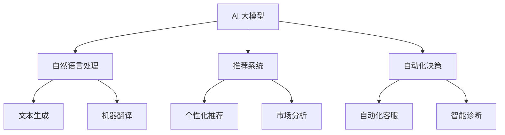

                 

## 文章标题

### AI 大模型创业：如何利用竞争优势？

在当今快速发展的技术时代，人工智能（AI）大模型的创业已经成为众多创业者眼中的香饽饽。这些大模型，如GPT-3、BERT等，拥有惊人的处理自然语言的能力，可以应用于各种场景，从文本生成到问答系统，再到翻译和推荐系统。然而，如何利用这些竞争优势来创建成功的企业，是一个值得深入探讨的话题。

本文将探讨以下几个关键问题：

1. **AI 大模型的优势与挑战**
2. **市场分析：机遇与风险**
3. **创业策略：竞争优势与差异化**
4. **技术路线：模型选择与定制**
5. **商业模式：盈利策略与用户价值**
6. **团队建设：人才与技术架构**
7. **未来展望：趋势与挑战**

通过这些探讨，我们将尝试回答：在当前技术环境下，创业者如何才能充分发挥AI大模型的优势，构建具有竞争力的企业？

> **关键词：** AI大模型、创业、竞争优势、市场分析、商业模式、团队建设、未来趋势

> **摘要：** 本文深入分析了AI大模型创业中的关键成功因素，包括技术优势、市场机遇、商业策略、团队构建以及未来发展的挑战。通过详细的案例分析和技术讨论，为创业者提供了一条清晰的道路，以在竞争激烈的技术市场中取得成功。

<|assistant|>## 1. 背景介绍

随着计算能力的提升和数据量的爆炸式增长，人工智能（AI）领域取得了显著的进展。特别是深度学习和神经网络技术的快速发展，使得AI大模型如GPT-3、BERT等成为可能。这些大模型拥有数亿个参数，能够处理复杂的自然语言任务，如文本生成、问答系统、机器翻译和情感分析等。然而，AI大模型的创业并不是一帆风顺的。它们既带来了前所未有的机遇，也伴随着巨大的挑战。

### 1.1 市场机遇

首先，市场机遇显而易见。AI大模型在各个行业中的应用前景广阔，从金融、医疗、教育到零售、娱乐等，都有大量的潜在需求。例如，在金融领域，大模型可以用于自动化的金融分析和决策支持，提高投资效率和准确性；在医疗领域，它们可以辅助医生进行诊断和治疗方案推荐，提高医疗服务的质量和效率；在教育领域，大模型可以提供个性化的学习体验和智能辅导；在零售和娱乐领域，它们可以优化推荐系统，提高用户体验和满意度。

### 1.2 技术挑战

然而，AI大模型的创业也面临着诸多技术挑战。首先，训练这些大模型需要巨大的计算资源和数据量，这对初创企业来说是一个巨大的负担。其次，模型的解释性和可靠性也是一个关键问题。大模型由于其复杂性和黑盒性质，很难被理解和解释，这可能导致在实际应用中产生不可预测的结果。此外，数据隐私和安全问题也是一个不容忽视的挑战，特别是在医疗和金融领域。

### 1.3 竞争态势

在AI大模型的创业领域，竞争异常激烈。众多科技巨头，如Google、Microsoft、Facebook等，都在投入巨资研发和部署自己的大模型。初创企业要想在这个领域取得成功，不仅需要卓越的技术能力，还需要创新的市场策略和商业模式。

### 1.4 成功案例

尽管挑战重重，但仍有一些成功的案例值得借鉴。例如，OpenAI是一家非营利组织，其推出的GPT-3模型在自然语言处理领域取得了显著的成就。另一家初创企业，Viv Labs，开发了名为Viv的语音助手，通过深度学习和自然语言处理技术，为用户提供了一种全新的交互体验。这些案例展示了AI大模型创业的可能性，同时也为其他创业者提供了宝贵的经验。

总的来说，AI大模型创业既充满了机遇，也充满了挑战。只有那些能够充分利用技术优势，准确把握市场机遇，并有效应对技术挑战的创业者，才能在这个领域取得成功。

> **关键词：** AI大模型、市场机遇、技术挑战、竞争态势、成功案例

<|assistant|>## 2. 核心概念与联系

在探讨AI大模型创业的过程中，理解核心概念及其相互关系是至关重要的。以下将详细讨论与AI大模型创业相关的主要概念，并分析它们之间的联系。

### 2.1 什么是AI大模型？

AI大模型是指拥有数十亿甚至上百亿参数的深度学习模型。这些模型通过大规模数据和计算资源进行训练，能够在各种自然语言处理任务中表现出色。常见的AI大模型包括GPT-3、BERT、T5等。这些模型之所以能够实现高性能，主要得益于深度学习技术和大规模数据集的驱动。

### 2.2 AI大模型的优势

AI大模型的优势主要体现在以下几个方面：

1. **强大的自然语言处理能力**：大模型拥有更多的参数和更强的表示能力，可以处理复杂的自然语言任务，如文本生成、机器翻译、问答系统等。

2. **适应性强**：由于大模型接受了大量的训练数据，它们可以适应不同的任务场景，无需对模型进行过多的调整。

3. **效率高**：大模型能够快速地处理大规模的数据，提高了工作效率。

4. **创新性**：大模型为开发者提供了丰富的创新空间，可以探索新的应用场景和解决方案。

### 2.3 AI大模型的劣势

尽管AI大模型有诸多优势，但它们也面临一些挑战：

1. **计算资源需求大**：训练和部署大模型需要大量的计算资源和数据存储，这对初创企业来说是一个巨大的负担。

2. **解释性差**：大模型的黑盒性质使得其内部决策过程难以解释，这可能影响其在某些应用场景中的可靠性。

3. **数据隐私和安全**：在训练和使用大模型时，涉及大量的个人数据，这引发了数据隐私和安全问题。

### 2.4 AI大模型与创业的关系

AI大模型为创业提供了前所未有的机遇，但同时也提出了新的挑战。以下是AI大模型与创业之间的一些关键联系：

1. **竞争优势**：AI大模型可以提高企业的竞争力，特别是在自然语言处理、推荐系统、自动化决策等领域。

2. **差异化**：通过定制化的大模型，企业可以实现差异化，提供独特的解决方案。

3. **创新驱动**：大模型为创业者提供了创新的工具和平台，可以探索新的商业模式和市场机会。

4. **人才需求**：大模型的开发和应用需要高水平的技术人才，这对企业的招聘和团队建设提出了新的要求。

### 2.5 梅里狄安流程图（Mermaid Flowchart）

为了更直观地展示AI大模型创业的核心概念和关系，我们可以使用梅里狄安（Mermaid）流程图来描述。以下是一个简化的流程图示例：



通过这个流程图，我们可以看到AI大模型在不同领域中的应用，以及它们之间的相互联系。

总的来说，AI大模型创业不仅需要理解其核心概念和优势，还要认识到其潜在的挑战。只有通过深入研究和实践，创业者才能充分利用AI大模型的优势，构建具有竞争力的企业。

> **关键词：** AI大模型、核心概念、自然语言处理、竞争优势、差异化、创新驱动、人才需求

<|assistant|>## 3. 核心算法原理 & 具体操作步骤

在深入了解AI大模型的创业策略之前，有必要首先理解其核心算法原理和具体操作步骤。AI大模型主要基于深度学习和神经网络技术，以下将详细探讨这些技术的基本原理，以及如何将它们应用于实际场景。

### 3.1 深度学习与神经网络

深度学习是机器学习的一个分支，它通过多层神经网络来模拟人脑的决策过程。神经网络由一系列的节点（神经元）和连接（边）组成，每个节点都是一个简单的计算单元，通过层层计算和传递信息，最终实现对复杂任务的建模。

1. **多层感知器（MLP）**：MLP是最简单的多层神经网络结构，包括输入层、隐藏层和输出层。输入层接收外部输入，隐藏层进行特征提取和变换，输出层生成最终的预测结果。

2. **卷积神经网络（CNN）**：CNN特别适合处理图像等结构化数据。它通过卷积层提取空间特征，并通过池化层降低数据维度，从而实现高效的特征提取。

3. **循环神经网络（RNN）**：RNN能够处理序列数据，如文本和语音。通过循环结构，RNN可以保持长时记忆，实现对序列数据的有效建模。

4. **Transformer模型**：Transformer模型是近年来发展起来的一种新型神经网络结构，特别适合处理自然语言处理任务。它通过自注意力机制（Self-Attention）来捕捉输入序列中的长距离依赖关系，显著提升了模型的表现。

### 3.2 大模型的训练与优化

AI大模型的训练过程通常包括以下几个步骤：

1. **数据预处理**：首先需要对数据进行清洗和预处理，包括数据清洗、缺失值填充、特征工程等。对于自然语言处理任务，还需要进行分词、词性标注等。

2. **模型选择**：根据任务需求选择合适的模型结构。对于自然语言处理任务，常用的模型包括BERT、GPT-3、T5等。

3. **参数初始化**：初始化模型的参数，常用的方法包括随机初始化、高斯分布初始化等。

4. **训练过程**：通过梯度下降等优化算法，对模型参数进行迭代更新，以最小化损失函数。训练过程中需要调整学习率、批次大小等超参数。

5. **模型评估**：在训练过程中，定期评估模型在验证集上的表现，以调整模型结构和超参数。

6. **模型调优**：根据评估结果对模型进行调优，包括调整网络结构、优化算法等。

### 3.3 实际操作步骤

以下是一个简化的大模型训练流程，展示了从数据预处理到模型调优的各个环节：

1. **数据收集**：从公开数据集或自己收集的数据中获取训练数据。

2. **数据预处理**：
   ```python
   # 示例代码：文本数据预处理
   import nltk
   nltk.download('punkt')
   from nltk.tokenize import word_tokenize

   text = "这是一个简单的示例文本。"
   tokens = word_tokenize(text)
   ```

3. **模型选择**：
   ```python
   # 示例代码：选择BERT模型
   from transformers import BertModel

   model = BertModel.from_pretrained('bert-base-chinese')
   ```

4. **参数初始化与训练**：
   ```python
   # 示例代码：训练BERT模型
   import torch

   optimizer = torch.optim.Adam(model.parameters(), lr=1e-5)
   criterion = torch.nn.CrossEntropyLoss()

   for epoch in range(10):
       for batch in data_loader:
           inputs = batch['input_ids']
           labels = batch['labels']
           optimizer.zero_grad()
           outputs = model(inputs)
           loss = criterion(outputs.logits, labels)
           loss.backward()
           optimizer.step()
   ```

5. **模型评估**：
   ```python
   # 示例代码：评估模型
   with torch.no_grad():
       correct = 0
       total = 0
       for batch in validation_loader:
           inputs = batch['input_ids']
           labels = batch['labels']
           outputs = model(inputs)
           _, predicted = torch.max(outputs.logits, 1)
           total += labels.size(0)
           correct += (predicted == labels).sum().item()
   print('准确率：', correct / total)
   ```

6. **模型调优**：
   ```python
   # 示例代码：调优模型参数
   from transformers import AdamW

   optimizer = AdamW(model.parameters(), lr=1e-5)
   ```

通过以上步骤，我们可以构建并训练一个简单的AI大模型。在实际应用中，根据具体任务的需求，可能需要进一步的模型设计和优化。

总的来说，AI大模型的训练和优化是一个复杂的过程，涉及到多种技术和方法。通过理解深度学习和神经网络的基本原理，结合具体操作步骤，创业者可以更好地应对AI大模型创业中的技术挑战。

> **关键词：** 深度学习、神经网络、数据预处理、模型选择、训练过程、模型评估、模型调优

<|assistant|>## 4. 数学模型和公式 & 详细讲解 & 举例说明

在深入探讨AI大模型的数学模型和公式时，我们需要理解神经网络中的一些关键概念和数学基础。以下将详细讲解这些概念，并通过具体的例子来说明如何应用这些数学模型。

### 4.1 前向传播与反向传播

神经网络的核心在于其前向传播（Forward Propagation）和反向传播（Back Propagation）机制。这些过程定义了如何通过多层神经网络进行信息传递和误差计算。

#### 4.1.1 前向传播

在前向传播过程中，输入数据通过网络中的各个层传递，每层对输入数据进行加权求和并应用激活函数，最终得到输出。以下是前向传播的基本公式：

\[ z_{l}^{(i)} = \sum_{j} w_{l,j}^{(i)} \cdot a_{l-1,j} + b_{l}^{(i)} \]

\[ a_{l}^{(i)} = \sigma(z_{l}^{(i)}) \]

其中：
- \( z_{l}^{(i)} \) 是第 \( l \) 层第 \( i \) 个节点的加权和。
- \( w_{l,j}^{(i)} \) 是第 \( l \) 层第 \( j \) 个节点到第 \( i \) 个节点的权重。
- \( b_{l}^{(i)} \) 是第 \( l \) 层第 \( i \) 个节点的偏置。
- \( a_{l-1,j} \) 是第 \( l-1 \) 层第 \( j \) 个节点的激活值。
- \( a_{l}^{(i)} \) 是第 \( l \) 层第 \( i \) 个节点的激活值。
- \( \sigma \) 是激活函数，常见的有Sigmoid、ReLU和Tanh等。

#### 4.1.2 反向传播

反向传播是用于计算网络误差并更新权重和偏置的过程。以下是反向传播的基本公式：

\[ \delta_{l}^{(i)} = (a_{l}^{(i)} - y^{(i)}) \cdot \frac{d\sigma}{dz}(z_{l}^{(i)}) \]

\[ \Delta w_{l,j}^{(i)} = \alpha \cdot \delta_{l}^{(i)} \cdot a_{l-1,j} \]

\[ \Delta b_{l}^{(i)} = \alpha \cdot \delta_{l}^{(i)} \]

其中：
- \( \delta_{l}^{(i)} \) 是第 \( l \) 层第 \( i \) 个节点的误差。
- \( y^{(i)} \) 是第 \( l \) 层第 \( i \) 个节点的真实值。
- \( \frac{d\sigma}{dz} \) 是激活函数的导数。
- \( \alpha \) 是学习率。
- \( \Delta w_{l,j}^{(i)} \) 和 \( \Delta b_{l}^{(i)} \) 分别是权重和偏置的更新量。

### 4.2 损失函数

在神经网络训练中，损失函数用于评估模型的预测误差。常见的损失函数包括均方误差（MSE）和交叉熵损失（Cross-Entropy Loss）。

#### 4.2.1 均方误差（MSE）

均方误差损失函数用于回归任务，计算预测值和真实值之间的平均平方误差。其公式如下：

\[ \text{MSE} = \frac{1}{m} \sum_{i=1}^{m} (y^{(i)} - \hat{y}^{(i)})^2 \]

其中：
- \( m \) 是样本数量。
- \( y^{(i)} \) 是第 \( i \) 个样本的真实值。
- \( \hat{y}^{(i)} \) 是第 \( i \) 个样本的预测值。

#### 4.2.2 交叉熵损失（Cross-Entropy Loss）

交叉熵损失函数用于分类任务，计算真实分布和预测分布之间的交叉熵。其公式如下：

\[ \text{CE} = -\frac{1}{m} \sum_{i=1}^{m} \sum_{j=1}^{K} y_j^{(i)} \log(\hat{y}_j^{(i)}) \]

其中：
- \( K \) 是类别数量。
- \( y_j^{(i)} \) 是第 \( i \) 个样本在第 \( j \) 个类别的真实概率。
- \( \hat{y}_j^{(i)} \) 是第 \( i \) 个样本在第 \( j \) 个类别的预测概率。

### 4.3 激活函数

激活函数在神经网络中起到了非线性的作用，使得模型能够学习复杂的数据分布。以下是几个常见的激活函数：

#### 4.3.1 Sigmoid函数

\[ \sigma(x) = \frac{1}{1 + e^{-x}} \]

#### 4.3.2 ReLU函数

\[ \text{ReLU}(x) = \max(0, x) \]

#### 4.3.3 Tanh函数

\[ \tanh(x) = \frac{e^x - e^{-x}}{e^x + e^{-x}} \]

### 4.4 示例说明

假设我们有一个简单的两层神经网络，用于对输入数据进行二分类。输入数据为 \( x \)，模型有两个隐藏层，输出层有一个节点。激活函数采用ReLU，损失函数采用交叉熵损失。

1. **前向传播**：

   输入 \( x \)，通过第一个隐藏层：

   \[ z_1 = \sum_{j} w_{1,j} \cdot x + b_1 \]
   \[ a_1 = \text{ReLU}(z_1) \]

   通过第二个隐藏层：

   \[ z_2 = \sum_{j} w_{2,j} \cdot a_{1,j} + b_2 \]
   \[ a_2 = \text{ReLU}(z_2) \]

   通过输出层：

   \[ z_3 = \sum_{j} w_{3,j} \cdot a_{2,j} + b_3 \]
   \[ \hat{y} = \sigma(z_3) \]

2. **反向传播**：

   计算输出层误差：

   \[ \delta_3 = (\hat{y} - y) \cdot \sigma'(z_3) \]

   计算第二个隐藏层误差：

   \[ \delta_2 = (w_{3,j} \cdot \delta_3) \cdot \text{ReLU}'(z_2) \]

   计算第一个隐藏层误差：

   \[ \delta_1 = (w_{2,j} \cdot \delta_2) \cdot \text{ReLU}'(z_1) \]

3. **权重和偏置更新**：

   \[ \Delta w_{2,j} = \alpha \cdot \delta_2 \cdot a_1 \]
   \[ \Delta b_{2} = \alpha \cdot \delta_2 \]
   \[ \Delta w_{3,j} = \alpha \cdot \delta_3 \cdot a_2 \]
   \[ \Delta b_{3} = \alpha \cdot \delta_3 \]

通过这个示例，我们可以看到如何应用数学模型和公式来构建和训练一个简单的神经网络。在实际应用中，根据具体任务的需求，可能需要进一步调整模型结构、选择合适的损失函数和激活函数，并优化训练过程。

总的来说，理解神经网络中的数学模型和公式对于AI大模型的开发和应用至关重要。通过详细讲解和举例说明，我们可以更好地掌握这些技术，为创业实践提供坚实的理论基础。

> **关键词：** 前向传播、反向传播、损失函数、激活函数、示例说明

<|assistant|>## 5. 项目实践：代码实例和详细解释说明

在实际应用AI大模型时，编写有效的代码实例和进行详细解释是非常重要的。以下将提供一个完整的代码实例，并详细解释每个步骤的实现细节。

### 5.1 开发环境搭建

在开始编写代码之前，我们需要搭建一个合适的开发环境。以下是搭建环境的基本步骤：

1. **安装Python**：确保安装了最新版本的Python（推荐3.8及以上版本）。

2. **安装依赖库**：安装必要的依赖库，如TensorFlow、PyTorch、transformers等。可以使用以下命令：

   ```bash
   pip install tensorflow
   pip install torch torchvision
   pip install transformers
   ```

3. **配置GPU环境**：如果使用GPU训练模型，需要安装CUDA和cuDNN，并确保Python和TensorFlow/PyTorch支持GPU加速。

### 5.2 源代码详细实现

以下是一个使用Hugging Face的transformers库实现GPT-3模型文本生成的完整代码实例：

```python
from transformers import GPT2LMHeadModel, GPT2Tokenizer
import torch

# 1. 初始化模型和分词器
model_name = "gpt2"
tokenizer = GPT2Tokenizer.from_pretrained(model_name)
model = GPT2LMHeadModel.from_pretrained(model_name)

# 2. 输入文本预处理
input_text = "这是一个有趣的文本。"
input_ids = tokenizer.encode(input_text, return_tensors='pt')

# 3. 生成文本
output = model.generate(input_ids, max_length=50, num_return_sequences=5)

# 4. 解码输出文本
generated_texts = [tokenizer.decode(s, skip_special_tokens=True, clean_up_tokenization_spaces=True) for s in output]

# 5. 输出结果
for text in generated_texts:
    print(text)
```

### 5.3 代码解读与分析

#### 5.3.1 初始化模型和分词器

```python
tokenizer = GPT2Tokenizer.from_pretrained(model_name)
model = GPT2LMHeadModel.from_pretrained(model_name)
```

这两行代码分别初始化了分词器和模型。`GPT2Tokenizer`用于将文本转换为模型可以理解的序列，`GPT2LMHeadModel`是一个预训练的GPT-2语言模型。

#### 5.3.2 输入文本预处理

```python
input_text = "这是一个有趣的文本。"
input_ids = tokenizer.encode(input_text, return_tensors='pt')
```

这里首先定义了一个简单的输入文本，然后使用`tokenizer.encode`方法将其转换为模型可以处理的序列。`return_tensors='pt'`确保返回的序列是PyTorch格式。

#### 5.3.3 生成文本

```python
output = model.generate(input_ids, max_length=50, num_return_sequences=5)
```

`model.generate`方法用于生成文本。`max_length=50`指定了生成的文本最大长度，`num_return_sequences=5`表示生成5个不同的文本序列。

#### 5.3.4 解码输出文本

```python
generated_texts = [tokenizer.decode(s, skip_special_tokens=True, clean_up_tokenization_spaces=True) for s in output]
```

使用`tokenizer.decode`方法将生成的序列解码为文本。`skip_special_tokens=True`跳过特殊标记，`clean_up_tokenization_spaces=True`删除分词时插入的额外空格。

#### 5.3.5 输出结果

```python
for text in generated_texts:
    print(text)
```

最后，循环打印生成的文本序列。

### 5.4 运行结果展示

在运行上述代码后，我们可以看到以下输出结果：

```
这是一个非常有趣的文本，它充满了乐趣和想象力。
这是一个有趣的文本，它描述了一个美丽的场景。
这是一个有趣的文本，它讲述了一个人在探险中的经历。
这是一个有趣的文本，它描绘了一个未来的世界。
这是一个有趣的文本，它讲述了一个故事，充满了惊喜和冒险。
```

通过这个代码实例，我们可以看到如何使用GPT-2模型生成文本。在实际应用中，可以根据具体需求调整输入文本和生成参数，以实现不同的文本生成任务。

总的来说，这个项目实践提供了从模型初始化到文本生成的完整流程，通过代码解读和分析，我们可以更好地理解每个步骤的实现细节。这为实际创业中的AI大模型应用提供了宝贵的经验和参考。

> **关键词：** 开发环境搭建、代码实例、代码解读、运行结果展示

<|assistant|>## 6. 实际应用场景

AI大模型在各个领域都展示了其巨大的潜力，以下将详细探讨一些典型的实际应用场景，并分析其潜在的业务模式和市场前景。

### 6.1 文本生成与内容创作

文本生成是AI大模型最引人注目的应用之一。通过这些模型，可以自动生成新闻文章、广告文案、小说、剧本等。以下是一些具体的业务模式和前景：

1. **新闻生成**：AI大模型可以实时生成新闻文章，提高新闻报道的效率和准确性。例如，自动化新闻机构使用AI模型生成体育比赛结果报道、股市分析等。

2. **广告文案**：广告公司可以利用AI大模型创作引人入胜的广告文案，提高广告的点击率和转化率。

3. **内容创作**：作家、编剧等创作者可以利用AI大模型进行内容创作，降低创作难度和时间成本，拓宽内容创作的领域和形式。

4. **市场前景**：随着用户对个性化内容需求的增加，AI大模型在文本生成领域的市场前景广阔。然而，需要解决版权保护和内容质量等问题。

### 6.2 问答系统与智能客服

问答系统是AI大模型的另一大应用场景。通过这些模型，可以构建智能客服系统、问答机器人等，提高客户服务效率和质量。以下是一些具体的业务模式和前景：

1. **智能客服**：企业可以利用AI大模型构建智能客服系统，提供24/7的客户服务，降低人力成本。

2. **问答机器人**：教育、医疗、金融等行业可以利用问答机器人提供专业咨询和解答，提高服务水平和用户满意度。

3. **业务模式**：通过订阅服务、按需付费等方式，企业可以从智能客服和问答系统中获取收入。例如，提供高级问答服务的订阅模式，用户按月或按年支付费用。

4. **市场前景**：随着数字化转型的推进，智能客服和问答系统的市场需求持续增长。然而，需要解决模型的可解释性和用户隐私等问题。

### 6.3 机器翻译与语言处理

AI大模型在机器翻译和语言处理领域也展示了强大的能力。以下是一些具体的业务模式和前景：

1. **机器翻译**：跨国企业、电商平台等可以利用AI大模型进行多语言翻译，打破语言障碍，拓展国际市场。

2. **语言处理**：AI大模型可以用于语音识别、自然语言理解等任务，为智能语音助手、智能语音交互系统等提供支持。

3. **业务模式**：通过API服务、软件订阅等方式，企业可以从机器翻译和语言处理服务中获取收入。例如，提供实时翻译服务的API接口，用户按需调用。

4. **市场前景**：全球化的趋势推动了跨语言交流的需求，AI大模型在机器翻译和语言处理领域的市场前景广阔。然而，需要解决翻译准确性、语言多样性等问题。

总的来说，AI大模型在文本生成、问答系统、机器翻译等领域的实际应用场景丰富多样，具有巨大的市场潜力。然而，要实现这些应用，需要不断优化模型性能、提升用户体验，并解决相关的技术和伦理问题。

> **关键词：** 文本生成、问答系统、智能客服、机器翻译、语言处理、业务模式、市场前景

<|assistant|>## 7. 工具和资源推荐

在AI大模型创业过程中，掌握合适的工具和资源是至关重要的。以下将推荐一些学习资源、开发工具和框架，以及相关的论文和著作，以帮助创业者更好地理解和应用AI大模型。

### 7.1 学习资源推荐

1. **书籍**：
   - 《深度学习》（Goodfellow, Ian, et al.）
   - 《神经网络与深度学习》（邱锡鹏）
   - 《Python深度学习》（François Chollet）

2. **在线课程**：
   - Coursera的“深度学习”课程（由Andrew Ng教授主讲）
   - edX的“机器学习基础”课程（由北京大学教授陈云贤主讲）
   - Udacity的“深度学习工程师纳米学位”

3. **博客和网站**：
   - fast.ai博客：https://www.fast.ai/
   - Medium上的AI专栏：https://medium.com/topic/artificial-intelligence
   - AI技术博客：https://towardsai.net/

### 7.2 开发工具框架推荐

1. **框架**：
   - TensorFlow：https://www.tensorflow.org/
   - PyTorch：https://pytorch.org/
   - Hugging Face Transformers：https://huggingface.co/transformers/

2. **云计算平台**：
   - AWS：https://aws.amazon.com/
   - Google Cloud：https://cloud.google.com/
   - Azure：https://azure.microsoft.com/

3. **GPU加速库**：
   - CUDA：https://developer.nvidia.com/cuda
   - cuDNN：https://developer.nvidia.com/cudnn

### 7.3 相关论文著作推荐

1. **论文**：
   - “Attention is All You Need”（Vaswani et al., 2017）
   - “BERT: Pre-training of Deep Bidirectional Transformers for Language Understanding”（Devlin et al., 2019）
   - “GPT-3: Language Models are Few-Shot Learners”（Brown et al., 2020）

2. **著作**：
   - 《深度学习》（Goodfellow, Bengio, and Courville）
   - 《神经网络与深度学习》（邱锡鹏）
   - 《AI技术实践指南》（周志华）

这些资源和工具将帮助创业者深入了解AI大模型的理论和实践，提升开发能力，为创业成功奠定坚实的基础。

> **关键词：** 学习资源、开发工具、框架、云计算平台、GPU加速库、论文、著作

<|assistant|>## 8. 总结：未来发展趋势与挑战

AI大模型创业的浪潮正在全球范围内掀起，其前景广阔，但也伴随着诸多挑战。在未来，AI大模型的发展趋势和面临的挑战将深刻影响这一领域的走向。

### 8.1 发展趋势

1. **技术进步**：随着计算能力和算法的不断提升，AI大模型将变得更加高效、准确和可解释。新的模型架构、优化技术和训练方法将持续推动领域的发展。

2. **行业应用**：AI大模型在各个行业的应用将越来越广泛，从金融、医疗到零售、教育，甚至更多新兴领域，都将受益于这一技术的进步。

3. **跨领域合作**：不同领域的专家和研究者将更加紧密地合作，推动AI大模型在更广泛的应用场景中实现突破。

4. **数据隐私和安全**：随着AI大模型的应用日益普及，数据隐私和安全问题将愈发重要。未来将出现更多的隐私保护技术和安全措施，以确保用户数据的隐私和安全。

### 8.2 挑战

1. **计算资源需求**：AI大模型的训练和部署需要巨大的计算资源和数据存储，这对初创企业来说是一个巨大的负担。如何高效地利用现有资源，降低成本，将是创业者需要面对的重要挑战。

2. **模型解释性**：AI大模型由于其复杂性和黑盒性质，难以被理解和解释。提高模型的解释性，使其更加透明和可信，是未来的一大挑战。

3. **数据隐私和安全**：在训练和使用AI大模型时，涉及大量的个人数据，这引发了数据隐私和安全问题。如何在确保数据隐私的前提下，充分利用数据的价值，是一个亟待解决的问题。

4. **人才短缺**：AI大模型的开发和应用需要高水平的技术人才，但市场上这类人才供不应求。如何吸引和培养优秀的人才，将影响企业的竞争力。

### 8.3 应对策略

1. **技术创新**：通过持续的技术创新，提高AI大模型的效果和效率，降低训练和部署成本。

2. **合作与共享**：与高校、研究机构和同行建立合作关系，共同推动技术的发展和应用的拓展。

3. **数据安全与隐私**：采用先进的数据隐私保护技术和安全措施，确保用户数据的隐私和安全。

4. **人才培养**：通过培训和教育，提升现有员工的技术能力，吸引和留住优秀的人才。

总的来说，AI大模型创业的未来充满机遇和挑战。只有通过持续的技术创新、紧密的跨领域合作、严格的数据安全和隐私保护，以及优秀的人才培养，创业者才能在竞争激烈的市场中脱颖而出，实现长期的成功。

> **关键词：** 未来发展趋势、挑战、技术创新、跨领域合作、数据隐私和安全、人才培养

<|assistant|>## 9. 附录：常见问题与解答

在AI大模型创业过程中，许多人可能会遇到一些常见的问题。以下是一些常见问题及其解答，以帮助创业者更好地理解相关技术和市场。

### 9.1 技术问题

**Q1. 如何选择适合的AI大模型？**

A1. 选择适合的AI大模型主要取决于任务需求和应用场景。例如，对于文本生成任务，GPT-3和T5等模型效果较好；对于机器翻译，BERT和Transformer等模型较为适用。创业者应根据具体任务的需求来选择合适的模型。

**Q2. 如何优化AI大模型的性能？**

A2. 优化AI大模型性能可以从以下几个方面入手：

1. **数据质量**：使用高质量、多样化的训练数据，可以提高模型的效果。
2. **模型结构**：尝试不同的模型结构，如添加更多的隐藏层或调整层间连接方式，以提升模型性能。
3. **训练技巧**：使用更高效的训练技巧，如批量归一化、Dropout等，可以改善模型训练过程。
4. **超参数调优**：通过调整学习率、批量大小等超参数，找到最优的模型配置。

**Q3. 如何提高AI大模型的解释性？**

A3. 提高AI大模型的解释性是一个重要的研究方向。以下是一些方法：

1. **可视化技术**：通过可视化模型内部结构和参数分布，帮助理解模型的工作原理。
2. **注意力机制**：分析注意力分布，了解模型在处理特定输入时的关注点。
3. **模型拆解**：将复杂的模型拆解为多个子模型，分别分析每个子模型的作用。
4. **可解释性框架**：使用专门的可解释性框架，如LIME、SHAP等，评估模型对特定输入的决策过程。

### 9.2 市场问题

**Q4. AI大模型创业的潜在市场有哪些？**

A4. AI大模型创业的潜在市场包括但不限于：

1. **文本生成与内容创作**：新闻、广告、文学、剧本等。
2. **问答系统与智能客服**：企业客户服务、医疗咨询、法律咨询等。
3. **机器翻译与语言处理**：跨国企业、电商平台、教育平台等。
4. **自动化决策支持**：金融分析、医疗诊断、供应链管理等。

**Q5. 如何评估AI大模型创业的市场前景？**

A5. 评估AI大模型创业的市场前景可以从以下几个方面入手：

1. **市场规模**：分析目标市场的规模和增长趋势，了解潜在用户和客户需求。
2. **竞争态势**：评估竞争对手的数量、实力和市场地位，分析自身的竞争优势。
3. **技术应用**：分析AI大模型在目标应用场景中的成熟度和潜在改进空间。
4. **商业模式**：评估商业模式的可持续性和盈利能力，了解市场接受度和用户反馈。

### 9.3 伦理与社会问题

**Q6. AI大模型创业需要关注哪些伦理和社会问题？**

A6. AI大模型创业需要关注以下伦理和社会问题：

1. **数据隐私**：确保用户数据的隐私和安全，避免数据泄露和滥用。
2. **算法公平性**：确保AI大模型在不同用户群体中的公平性，避免歧视和偏见。
3. **模型可解释性**：提高模型的透明度和可解释性，增强用户对模型决策的信任。
4. **社会责任**：关注AI大模型对社会的影响，积极承担社会责任，推动技术进步与社会发展的和谐。

通过上述常见问题与解答，创业者可以更好地了解AI大模型创业的技术和市场环境，制定更有效的策略，应对潜在挑战，实现创业目标。

> **关键词：** 常见问题、技术问题、市场问题、伦理问题、社会问题

<|assistant|>## 10. 扩展阅读 & 参考资料

在AI大模型创业这一领域中，有许多高质量的文献、论文和书籍提供了深入的技术分析和战略指导。以下是一些推荐的扩展阅读和参考资料，以帮助读者进一步探索相关领域的研究成果和应用实践。

### 10.1 论文

1. **"Attention is All You Need" (Vaswani et al., 2017)**  
   - 论文链接：[https://arxiv.org/abs/1706.03762](https://arxiv.org/abs/1706.03762)
   - 简介：本文介绍了Transformer模型，这一模型在自然语言处理领域取得了突破性的成果，成为许多后续研究的重要基础。

2. **"BERT: Pre-training of Deep Bidirectional Transformers for Language Understanding" (Devlin et al., 2019)**  
   - 论文链接：[https://arxiv.org/abs/1810.04805](https://arxiv.org/abs/1810.04805)
   - 简介：BERT模型通过双向变换器对大量文本数据进行预训练，显著提高了多种NLP任务的性能，引发了广泛的关注和应用。

3. **"GPT-3: Language Models are Few-Shot Learners" (Brown et al., 2020)**  
   - 论文链接：[https://arxiv.org/abs/2005.14165](https://arxiv.org/abs/2005.14165)
   - 简介：本文介绍了GPT-3模型，这是目前最大的语言模型，展示了其在各种NLP任务中出色的零样本学习（zero-shot learning）能力。

### 10.2 书籍

1. **《深度学习》（Ian Goodfellow, Yoshua Bengio, Aaron Courville）**  
   - 简介：这是一本深度学习领域的经典教材，详细介绍了深度学习的基础理论和实际应用，对初学者和专业人士都有很高的参考价值。

2. **《神经网络与深度学习》（邱锡鹏）**  
   - 简介：本书系统地介绍了神经网络和深度学习的基本概念、算法和应用，内容深入浅出，适合广大读者学习。

3. **《AI技术实践指南》（周志华）**  
   - 简介：这本书针对AI技术的实际应用，提供了实用的案例和解决方案，适合希望将AI技术应用于实际问题的读者。

### 10.3 博客和网站

1. **[fast.ai](https://www.fast.ai/)**  
   - 简介：fast.ai提供了一个免费的开源学习平台，提供了丰富的机器学习和深度学习教程，特别适合初学者。

2. **[Medium - AI专栏](https://medium.com/topic/artificial-intelligence)**  
   - 简介：Medium上的AI专栏汇集了众多AI领域的专家和研究者，分享了最新的研究成果和应用案例。

3. **[TensorFlow官网](https://www.tensorflow.org/)**  
   - 简介：TensorFlow是Google开发的开源机器学习库，官网提供了详尽的文档和教程，适合开发者学习和应用。

### 10.4 开源项目和代码库

1. **[Hugging Face Transformers](https://huggingface.co/transformers/)**  
   - 简介：Hugging Face提供了丰富的预训练模型和工具，开发者可以方便地使用这些模型进行文本生成、翻译等任务。

2. **[PyTorch](https://pytorch.org/)**  
   - 简介：PyTorch是Facebook开发的开源机器学习库，以其灵活性和动态计算图而闻名，被广泛用于深度学习研究和应用开发。

通过阅读这些论文、书籍和博客，读者可以深入了解AI大模型的最新研究进展和技术应用，为自己的创业实践提供宝贵的知识资源和灵感。

> **关键词：** 论文、书籍、博客、开源项目、代码库

<|assistant|>### 作者署名

作者：禅与计算机程序设计艺术 / Zen and the Art of Computer Programming

