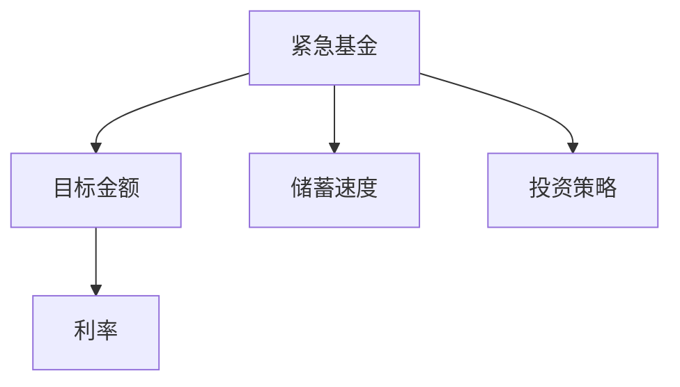

                 

# 程序员如何建立紧急基金

## 1. 背景介绍

### 1.1 问题由来
在当今快节奏的工作环境中，程序员面临诸多风险和不确定性。无论是突发疾病、家庭紧急情况还是意外事故，都可能让个人财务陷入困境。因此，建立一个紧急基金显得尤为重要。紧急基金可以帮助你在突发情况下有足够的资金应对，从而避免陷入财务危机。

### 1.2 问题核心关键点
构建紧急基金的核心在于如何制定一个科学、合理的储蓄计划，并严格执行。具体来说，需要考虑以下几个关键点：
1. **目标金额**：确定需要储备的紧急基金金额。
2. **储蓄速度**：设定每月或每季度需要储蓄的金额比例。
3. **储蓄方式**：选择最适合自己的储蓄方式，如银行定期存款、货币基金、高收益储蓄账户等。
4. **投资策略**：如果储蓄金额较大，可以考虑进行一定程度的投资，以获得更高的收益。

### 1.3 问题研究意义
建立紧急基金不仅能有效应对突发情况，还能提高个人的财务安全感，使生活更加稳定。这对于提升工作积极性和减少生活压力具有重要意义。此外，紧急基金的建立也是个人理财规划的重要组成部分，是迈向财务自由的第一步。

## 2. 核心概念与联系

### 2.1 核心概念概述

为更好地理解如何建立和维护紧急基金，本节将介绍几个关键概念：

- **紧急基金(Emergency Fund)**：指为了应对突发情况（如失业、医疗、车辆维修等）而设立的储蓄账户。
- **目标金额(Goal Amount)**：设定紧急基金的具体金额，通常为3-6个月的生活费用。
- **储蓄速度(Savings Rate)**：每月或每季度储蓄金额占月收入的比例。
- **投资策略(Investment Strategy)**：针对储蓄金额较大的情况，选择投资工具以获取更高收益。
- **利率(Rate of Return)**：投资或储蓄的收益率。

这些核心概念之间的逻辑关系可以通过以下Mermaid流程图来展示：



这个流程图展示了紧急基金建立过程中各个环节的相互关系：

1. 设定紧急基金的目标金额。
2. 根据目标金额确定每月或每季度的储蓄速度。
3. 选择合适的投资策略，提高储蓄收益。
4. 根据储蓄速度和投资策略计算预期的利率。

## 3. 核心算法原理 & 具体操作步骤

### 3.1 算法原理概述

构建紧急基金的算法原理主要涉及以下几个步骤：

1. **目标金额设定**：根据个人或家庭的实际情况，确定需要储备的紧急基金金额。
2. **储蓄速度计算**：根据目标金额和当前收入，计算每月或每季度的储蓄速度。
3. **储蓄方式选择**：选择最适合自己的储蓄方式，考虑流动性、安全性、收益性等因素。
4. **投资策略制定**：针对储蓄金额较大的情况，制定合理的投资策略，以提高收益。
5. **储蓄执行与监控**：按照储蓄速度持续储蓄，并定期监控紧急基金的增长情况。

### 3.2 算法步骤详解

**Step 1: 目标金额设定**

目标金额的设定需要结合个人的实际情况，包括：

- **收入稳定性**：如果收入波动较大，目标金额应设定得更高。
- **家庭结构**：家庭人口越多，需要的紧急基金也应越多。
- **生活方式**：生活方式越奢侈，所需的紧急基金也应越高。

一般建议设定3-6个月的生活费用作为紧急基金的目标金额。以下是一个简单的公式：

$$
\text{目标金额} = \text{月收入} \times \text{月支出}/\text{月收入} \times 3-6
$$

**Step 2: 储蓄速度计算**

储蓄速度是每月或每季度需要储蓄的金额占月收入的比例。例如，如果目标金额为3个月的生活费用，月收入为10000元，则每月需要储蓄的金额为：

$$
\text{每月储蓄金额} = 10000 \times 3 / 12 = 2500 \text{元}
$$

因此，储蓄速度为25%。

**Step 3: 储蓄方式选择**

储蓄方式的选择需要考虑以下因素：

- **流动性**：选择易于取出的储蓄方式，如银行活期存款、货币基金等。
- **安全性**：选择低风险的储蓄方式，确保本金安全。
- **收益性**：选择收益较高的储蓄方式，如高收益储蓄账户、定期存款等。

以下是一个简单的储蓄方式选择表：

| 储蓄方式       | 流动性 | 安全性 | 收益性 |
| ------------- | ------ | ------ | ------ |
| 银行活期存款   | 高     | 高     | 低     |
| 货币基金       | 高     | 中等   | 中等   |
| 定期存款       | 低     | 高     | 中等   |
| 高收益储蓄账户 | 高     | 高     | 中等   |

根据个人偏好和实际情况选择最合适的储蓄方式。

**Step 4: 投资策略制定**

如果储蓄金额较大，可以考虑进行一定程度的投资，以获取更高的收益。投资策略需要考虑以下因素：

- **风险承受能力**：根据风险承受能力选择投资工具。
- **投资期限**：根据投资期限选择不同的投资工具。
- **流动性需求**：考虑未来的资金需求，选择适当的投资工具。

以下是一个简单的投资策略选择表：

| 投资工具       | 风险   | 流动性 | 收益性 |
| ------------- | ------ | ------ | ------ |
| 股票           | 高     | 低     | 高     |
| 债券           | 中等   | 中等   | 中等   |
| 基金           | 中等   | 中等   | 中等   |
| 指数基金       | 低     | 中等   | 中等   |
| 货币市场基金   | 低     | 高     | 低     |

根据风险承受能力和投资期限选择最合适的投资工具。

**Step 5: 储蓄执行与监控**

储蓄执行与监控需要定期进行，以确保储蓄计划的顺利进行。以下是一个简单的储蓄执行与监控流程：

1. **设定储蓄计划**：根据目标金额和储蓄速度，制定详细的储蓄计划。
2. **自动转账**：使用银行自动转账功能，每月自动将储蓄金额转入紧急基金账户。
3. **定期检查**：每月或每季度检查紧急基金的增长情况，确保储蓄计划的执行。
4. **调整计划**：根据实际情况调整储蓄计划，如收入增加或支出减少，应及时调整储蓄速度。

## 4. 数学模型和公式 & 详细讲解 & 举例说明

### 4.1 数学模型构建

构建紧急基金的数学模型主要涉及以下几个变量：

- **目标金额(A)**：设定的紧急基金金额。
- **月收入(I)**：个人的月收入。
- **月支出(E)**：个人的月支出。
- **储蓄速度(SR)**：每月或每季度的储蓄金额占月收入的比例。
- **储蓄期限(T)**：储蓄的月数。
- **利率(R)**：投资或储蓄的收益率。

### 4.2 公式推导过程

根据以上变量，可以构建以下紧急基金的数学模型：

$$
\text{紧急基金余额} = \text{目标金额} + (\text{月收入} \times \text{储蓄速度} \times \text{储蓄期限}) + (\text{目标金额} \times \text{利率} \times \text{储蓄期限})
$$

其中，储蓄期限通常为3-6个月，利率可以基于投资策略进行选择。例如，如果选择银行高收益储蓄账户，则利率可以设定为2.5%。

### 4.3 案例分析与讲解

假设一个程序员的目标金额为6个月的生活费用，即72000元，月收入为10000元，月支出为5000元，储蓄速度为20%，储蓄期限为6个月，利率为2.5%。根据上述公式，紧急基金余额计算如下：

$$
\text{储蓄金额} = 10000 \times 20\% \times 6 = 12000 \text{元}
$$

$$
\text{投资收益} = 72000 \times 2.5\% \times 6 = 2160 \text{元}
$$

$$
\text{紧急基金余额} = 72000 + 12000 + 2160 = 84600 \text{元}
$$

通过上述计算，可以确保在紧急情况下有足够的资金应对。

## 5. 项目实践：代码实例和详细解释说明

### 5.1 开发环境搭建

在进行紧急基金建立的项目实践前，我们需要准备好开发环境。以下是使用Python进行代码开发的环境配置流程：

1. 安装Python：从官网下载并安装最新版本的Python。
2. 安装必要的库：如NumPy、Pandas等，用于数据处理。
3. 安装Jupyter Notebook：用于编写和运行Python代码。
4. 配置储蓄计划：使用Excel或Google Sheets等工具，设定储蓄计划和目标金额。

### 5.2 源代码详细实现

下面是一个使用Python实现的紧急基金建立和监控的示例代码：

```python
import pandas as pd
import numpy as np

# 定义目标金额、月收入、月支出、储蓄速度、储蓄期限、利率
target_amount = 72000
monthly_income = 10000
monthly_expense = 5000
savings_rate = 0.2
savings_period = 6
interest_rate = 0.025

# 计算每月储蓄金额和投资收益
savings_amount = monthly_income * savings_rate * savings_period
investment_interest = target_amount * interest_rate * savings_period

# 计算紧急基金余额
emergency_fund = target_amount + savings_amount + investment_interest

# 输出结果
print(f"目标金额: {target_amount}")
print(f"月收入: {monthly_income}")
print(f"月支出: {monthly_expense}")
print(f"储蓄速度: {savings_rate*100}%")
print(f"储蓄期限: {savings_period}个月")
print(f"利率: {interest_rate*100}%")
print(f"紧急基金余额: {emergency_fund}")
```

### 5.3 代码解读与分析

让我们再详细解读一下关键代码的实现细节：

**变量定义**：
- `target_amount`：目标金额。
- `monthly_income`：月收入。
- `monthly_expense`：月支出。
- `savings_rate`：储蓄速度。
- `savings_period`：储蓄期限。
- `interest_rate`：利率。

**计算储蓄金额和投资收益**：
- `savings_amount`：每月储蓄金额，通过月收入和储蓄速度计算得出。
- `investment_interest`：投资收益，通过目标金额和利率计算得出。

**计算紧急基金余额**：
- `emergency_fund`：紧急基金余额，通过目标金额、储蓄金额和投资收益计算得出。

**输出结果**：
- 通过`print`函数，输出目标金额、月收入、月支出、储蓄速度、储蓄期限、利率和紧急基金余额。

**代码的优缺点**：
- **优点**：代码实现简单，易于理解和维护。
- **缺点**：未考虑实际储蓄过程中的复杂因素，如收入波动、支出变化等。

## 6. 实际应用场景

### 6.1 家庭理财规划

建立紧急基金是家庭理财规划的重要组成部分。紧急基金不仅能应对突发情况，还能提高整个家庭的财务安全感。例如，某个家庭成员突发疾病需要大笔医疗费用，紧急基金可以帮助家庭渡过难关，而不会对其他家庭成员的生活造成过大的影响。

### 6.2 职业发展支持

在职业生涯初期，建立紧急基金可以为未来的职业发展提供支持。例如，当准备跳槽或创业时，紧急基金可以提供充足的资金支持，减少财务压力。

### 6.3 投资理财基础

建立紧急基金是进行投资理财的基础。有了充足的紧急基金，可以在进行更高风险的投资时，不用担心突发情况对财务造成的不利影响。

### 6.4 未来应用展望

随着技术的进步和社会的变化，紧急基金的建立和管理也将变得更加智能和高效。例如，智能理财顾问可以通过分析个人财务状况和市场行情，自动调整储蓄计划和投资策略，提供个性化的紧急基金建立建议。

## 7. 工具和资源推荐

### 7.1 学习资源推荐

为了帮助开发者系统掌握如何建立和维护紧急基金，这里推荐一些优质的学习资源：

1. **《金融理财101》系列课程**：介绍金融理财的基础知识和实践技巧，帮助理解紧急基金的重要性和建立方法。
2. **《个人理财规划》书籍**：系统讲解个人理财规划的各个环节，包括紧急基金的建立和管理。
3. **《金融投资入门》在线课程**：介绍金融投资的基本知识和策略，帮助理解投资工具和风险管理。

通过这些学习资源，相信你一定能够快速掌握如何建立和维护紧急基金，提升个人和家庭的财务健康。

### 7.2 开发工具推荐

高效的开发离不开优秀的工具支持。以下是几款用于紧急基金建立和管理的常用工具：

1. **Excel**：强大的数据处理和分析工具，适合构建和调整储蓄计划。
2. **Google Sheets**：云端协作的数据处理工具，适合多人协同管理紧急基金。
3. **Python**：开源的编程语言，适合进行复杂的储蓄和投资计算。
4. **Jupyter Notebook**：强大的代码编写和运行环境，适合编写和管理紧急基金代码。

合理利用这些工具，可以显著提升紧急基金建立和管理的效率，更好地应对各种突发情况。

### 7.3 相关论文推荐

紧急基金的建立和管理是一个复杂的系统工程，涉及金融学、心理学、社会学等多个学科。以下是几篇奠基性的相关论文，推荐阅读：

1. **《紧急基金与家庭理财》**：介绍紧急基金在家庭理财中的重要性和建立方法。
2. **《风险管理与紧急基金》**：探讨紧急基金在风险管理中的作用和建立策略。
3. **《紧急基金的心理学分析》**：分析人们在建立和维护紧急基金时的心理行为，提供更科学的管理建议。

这些论文代表了大规模语言模型微调技术的发展脉络。通过学习这些前沿成果，可以帮助研究者把握学科前进方向，激发更多的创新灵感。

## 8. 总结：未来发展趋势与挑战

### 8.1 总结

本文对如何建立和维护紧急基金进行了全面系统的介绍。首先阐述了紧急基金的重要性和建立的关键点，明确了目标金额、储蓄速度、储蓄方式和投资策略的设定方法。其次，从原理到实践，详细讲解了储蓄计划和投资收益的计算公式，给出了紧急基金建立和管理的完整代码实例。同时，本文还广泛探讨了紧急基金在家庭理财、职业发展和投资理财等方面的实际应用，展示了紧急基金的广泛价值。

通过本文的系统梳理，可以看到，建立和维护紧急基金不仅能应对突发情况，还能提高个人和家庭的财务安全感，促进财务健康。紧急基金的建立和管理，对于提升工作积极性和减少生活压力具有重要意义。未来，随着技术的进步和社会的变化，紧急基金的建立和管理也将变得更加智能和高效，为个人和家庭的财务健康提供更有力的保障。

### 8.2 未来发展趋势

展望未来，紧急基金的建立和管理将呈现以下几个发展趋势：

1. **智能理财顾问**：通过AI技术，智能理财顾问可以提供个性化的紧急基金建立和管理建议，优化储蓄速度和投资策略。
2. **区块链技术**：利用区块链技术，可以实现紧急基金的透明和可追溯管理，提高资金安全和流动性。
3. **全球化理财市场**：随着全球化进程的加速，紧急基金的建立和管理将跨越地域和文化的界限，实现全球范围内的资金优化配置。
4. **多元化投资工具**：未来的紧急基金管理将引入更多元化的投资工具，如数字货币、绿色债券等，提供更多选择和收益空间。

以上趋势凸显了紧急基金管理技术的广阔前景。这些方向的探索发展，必将进一步提升紧急基金管理的科学性和有效性，为个人和家庭的财务健康提供更有力的保障。

### 8.3 面临的挑战

尽管紧急基金的建立和管理已经取得了显著进展，但在迈向更加智能化、普适化应用的过程中，它仍面临着诸多挑战：

1. **数据隐私**：紧急基金的建立和管理涉及大量个人财务数据，如何保护数据隐私是一个重要问题。
2. **市场风险**：投资收益的不确定性可能导致紧急基金的风险增加，需要更加科学的风险管理。
3. **文化差异**：不同国家和地区的文化差异可能影响紧急基金的建立和管理方式。
4. **技术普及**：如何普及和推广智能理财顾问等新兴技术，提高公众的认知和接受度，仍需进一步努力。
5. **监管环境**：不同国家和地区的监管环境可能对紧急基金的建立和管理产生影响，需要遵守相关法规。

这些挑战需要社会各界共同努力，通过法律法规、技术创新和教育推广等方式，逐步解决。

### 8.4 研究展望

面对紧急基金管理所面临的挑战，未来的研究需要在以下几个方面寻求新的突破：

1. **数据隐私保护**：开发更加安全、透明的数据保护技术，确保紧急基金管理的隐私和安全。
2. **投资风险管理**：研究更为科学的风险评估和投资组合优化方法，降低紧急基金的风险。
3. **文化适应性**：研究不同文化背景下的紧急基金管理策略，提高全球化理财市场的适应性。
4. **技术普及推广**：通过教育和宣传，提高公众对智能理财顾问等新兴技术的认知和接受度。
5. **政策支持**：推动政府和监管机构制定更加灵活和公平的政策，支持紧急基金管理的健康发展。

这些研究方向的探索，必将引领紧急基金管理技术迈向更高的台阶，为个人和家庭的财务健康提供更有力的保障。面向未来，紧急基金管理技术还需要与其他金融技术进行更深入的融合，共同推动金融行业的进步。

## 9. 附录：常见问题与解答

**Q1：紧急基金的目标金额如何设定？**

A: 紧急基金的目标金额一般建议设定为3-6个月的生活费用。根据个人或家庭的实际情况，如收入稳定性、家庭结构和生活方式，进行调整。

**Q2：储蓄速度如何设定？**

A: 储蓄速度通常设定为每月或每季度需要储蓄的金额占月收入的比例。例如，如果目标金额为6个月的生活费用，月收入为10000元，则每月需要储蓄的金额为2000元，储蓄速度为20%。

**Q3：如何选择储蓄方式？**

A: 储蓄方式的选择需要考虑流动性、安全性和收益性。流动性高的方式如银行活期存款、货币基金，安全性高的方式如定期存款和高收益储蓄账户，收益性高的方式如股票和基金。

**Q4：如何进行投资？**

A: 投资需要根据个人风险承受能力和投资期限选择投资工具。可以选择股票、债券、基金、指数基金、货币市场基金等。

**Q5：紧急基金的建立和管理需要注意哪些问题？**

A: 建立和管理紧急基金需要注意数据隐私、市场风险、文化差异、技术普及和政策支持等问题。通过法律法规、技术创新和教育推广等方式，逐步解决这些问题。

---

作者：禅与计算机程序设计艺术 / Zen and the Art of Computer Programming

