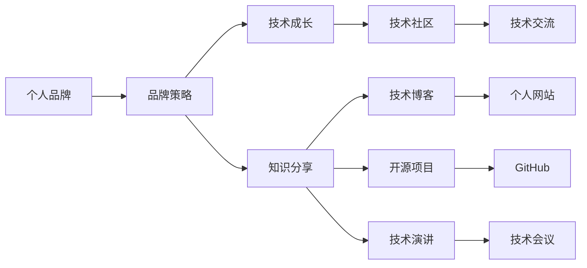

                 

# 程序员如何打造个人品牌IP

> 关键词：品牌建设, 技术成长, 软件开发, 职业发展, 个人影响力

## 1. 背景介绍

在信息爆炸和竞争激烈的时代，个人品牌不仅是个体在职场中的"名片"，更是影响其职业发展和商业合作的宝贵资源。对于程序员来说，打造个人品牌IP，既能够提升其专业价值，又能够拓展职业视野，赢得更多的职业机会。本文将详细解析程序员如何通过多维度的策略和实践，构筑自身的品牌影响力。

## 2. 核心概念与联系

### 2.1 核心概念概述

为了深入理解如何打造个人品牌，本节将介绍以下几个关键概念：

- 个人品牌(Personal Branding)：指个体通过一系列有策略的行为和内容展示，形成独特的职业形象，从而提升自身在行业内的知名度和影响力。
- 程序员个人品牌(Developer Personal Branding)：专指技术从业者通过技术输出、社区参与、技术交流等活动，塑造专业形象，提升行业地位。
- 品牌策略(Brand Strategy)：指个体通过明确目标、定位、内容规划等步骤，系统构建个人品牌的过程。
- 技术成长(Technical Growth)：指程序员不断学习新技术、积累项目经验，提升自身技术水平和解决问题能力的过程。
- 知识分享(Knowledge Sharing)：指通过写博客、开课程、发表演讲等方式，将所学技术分享给他人的行为。

这些概念之间存在紧密联系，共同构成了程序员打造个人品牌的核心框架。通过明确品牌策略，程序员能够有针对性地进行技术成长和知识分享，从而构建自身的品牌影响力。

### 2.2 核心概念原理和架构的 Mermaid 流程图



该图展示了程序员打造个人品牌的过程：

1. 首先通过明确的品牌策略，指导技术成长和知识分享。
2. 技术成长包括在技术社区学习和实践，提升自身技能。
3. 知识分享则通过博客、开源项目、演讲等多种形式，传播知识，吸引关注。
4. 技术社区、博客、开源项目等平台，进一步加强了与同行和社区的互动，形成正反馈。
5. 技术演讲、技术会议等活动，能够显著提升个人品牌影响力，拓展合作机会。

## 3. 核心算法原理 & 具体操作步骤
### 3.1 算法原理概述

打造个人品牌并非一蹴而就，而是一个持续迭代的过程。其核心算法原理包括：

1. **设定目标**：明确个人品牌的定位和目标，确定期望达成的影响力范围和水平。
2. **技术成长**：通过持续学习和实践，积累技术知识和项目经验，提升解决复杂问题的能力。
3. **知识分享**：通过输出内容，将技术见解和实践经验分享给他人，建立专业声誉。
4. **社区互动**：积极参与技术社区，贡献代码、解答问题，提升在社区中的活跃度和影响力。
5. **反馈循环**：通过社交媒体、职业网络、演讲等活动获取反馈，不断调整和优化个人品牌策略。

### 3.2 算法步骤详解

#### 步骤一：设定个人品牌目标

- **目标设定**：
  1. 明确个人品牌的核心定位，如技术专家、创新领袖、开源贡献者等。
  2. 确定具体目标，如在GitHub上获得一定数量的Star，或在博客上每月发布高质量文章。

- **目标评估**：
  1. 评估当前技术和职业现状，分析与目标之间的差距。
  2. 制定阶段性目标和计划，逐步推进品牌建设。

#### 步骤二：技术成长

- **学习策略**：
  1. 定期阅读最新的技术博客、论文，关注技术社区和论坛。
  2. 参加线上和线下的技术会议、培训班，学习新技术和最佳实践。
  3. 参与开源项目，通过实战提升技术水平和项目经验。

- **实践项目**：
  1. 在GitHub上发布个人项目，实践新技术，积累代码库。
  2. 贡献代码到开源项目，与社区成员合作，提高项目维护能力。

#### 步骤三：知识分享

- **内容创作**：
  1. 撰写技术博客，分享个人见解和实战经验。
  2. 开设技术课程或网络讲座，系统讲解技术要点和应用场景。
  3. 在社交媒体上发布技术文章和动态，提高曝光度。

- **反馈机制**：
  1. 通过评论和点赞等互动，了解读者反馈，调整内容策略。
  2. 收集意见和建议，优化博客和课程内容，提升质量。

#### 步骤四：社区互动

- **社区参与**：
  1. 在技术社区和论坛上活跃，回答问题、参与讨论。
  2. 加入技术群组，与同行交流经验，分享资源。

- **影响力提升**：
  1. 定期举办技术沙龙、线上技术会，吸引同行参与。
  2. 在社交媒体上发布技术活动信息，扩大活动影响范围。

#### 步骤五：反馈循环

- **反馈收集**：
  1. 通过社交媒体、职业网络、演讲等活动获取反馈。
  2. 收集数据和反馈，进行品牌策略调整。

- **优化策略**：
  1. 根据反馈结果，调整技术成长和知识分享的策略。
  2. 持续优化个人品牌内容，提升专业性和吸引力。

### 3.3 算法优缺点

**优点**：

- **提升技术水平**：通过持续学习和实践，不断积累技术知识，提升解决问题能力。
- **建立专业声誉**：通过知识分享和社区互动，建立个人在行业内的专业形象和声誉。
- **拓展职业机会**：提升个人品牌影响力，吸引更多职业机会和合作。

**缺点**：

- **需要长期投入**：打造个人品牌是一个长期的过程，需要持续的时间投入。
- **内容质量要求高**：高质量的内容输出，需要较高的专业水平和写作能力。
- **面对技术更新**：需不断更新技术知识和项目经验，保持品牌的时代性。

### 3.4 算法应用领域

个人品牌建设的应用领域非常广泛，以下是几个主要领域：

1. **职业发展**：通过提升技术能力和影响力，为升职、跳槽、创业等职业发展提供支持。
2. **技术传播**：成为技术传播者，帮助更多人了解和学习新技术，推动技术进步。
3. **企业合作**：通过个人品牌影响力，吸引企业合作机会，提升自身职业地位。
4. **学术研究**：在学术界，通过个人品牌，提升研究成果的可见度和影响力。
5. **社会公益**：通过技术传播和社区互动，参与社会公益活动，提升社会影响力。

## 4. 数学模型和公式 & 详细讲解 & 举例说明

### 4.1 数学模型构建

个人品牌的影响力可以通过一系列指标来量化，包括：

- **技术技能水平**：$S$，表示个人的技术深度和广度。
- **专业认可度**：$R$，表示个人在行业内的声誉和认可度。
- **社区活跃度**：$C$，表示在技术社区中的互动和参与程度。
- **知识分享量**：$K$，表示个人输出的内容数量和质量。
- **曝光度**：$E$，表示个人品牌在网络上的可见性。

通过建立数学模型，可以更系统地评估和提升个人品牌影响力。

### 4.2 公式推导过程

个人品牌影响力的数学模型可以表示为：

$$
F = S \times R \times C \times K \times E
$$

其中，$F$为个人品牌影响力，各变量含义如下：

- $S$：技术技能水平，表示个人掌握的技术深度和广度，可以通过学习新技术、积累项目经验来提升。
- $R$：专业认可度，可以通过发表技术论文、参加技术会议、获取职业认证等方式提高。
- $C$：社区活跃度，可以通过参与社区讨论、贡献代码、举办技术活动等提升。
- $K$：知识分享量，可以通过撰写技术博客、开设技术课程、参加技术讲座等方式增加。
- $E$：曝光度，可以通过社交媒体、职业网络、公开演讲等方式提升。

### 4.3 案例分析与讲解

假设某程序员在GitHub上有100个Star，每年发表20篇技术博客，每月在技术社区活跃超过20小时，参加5次线上技术会议，在LinkedIn上拥有5000名关注者。根据上述公式，计算其个人品牌影响力为：

$$
F = 100 \times 3 \times 1.2 \times 20 \times 2^5 = 115200
$$

该数值虽为假定，但通过具体数据计算，可以更直观地理解各变量对品牌影响力的贡献。

## 5. 项目实践：代码实例和详细解释说明

### 5.1 开发环境搭建

1. **编程环境**：
   - 安装Python 3.x，推荐使用Anaconda。
   - 安装必要的开发工具，如PyCharm、Visual Studio Code等。

2. **版本控制**：
   - 安装Git，使用GitHub或GitLab进行代码版本管理。

3. **文档管理**：
   - 使用Markdown格式编写技术博客，使用GitHub Pages或博客园等平台发布。

4. **代码托管**：
   - 在GitHub上创建个人仓库，展示技术项目和开源贡献。

### 5.2 源代码详细实现

以一个简单的技术博客发布为例，展示如何通过GitHub Pages搭建个人博客，并通过Markdown编写和发布技术文章。

1. **安装Git**：
   ```bash
   brew install git
   ```

2. **创建博客仓库**：
   ```bash
   git clone https://github.com/<username>/<blog-name>.git
   ```

3. **安装Markdown编辑器**：
   - 推荐使用Typora或Atom等Markdown编辑器。

4. **编写博客**：
   - 使用Markdown语法撰写技术文章。

5. **发布博客**：
   - 在GitHub Pages上设置域名和页面路径。
   - 将Markdown文件上传至GitHub仓库，并通过CNAME文件设置GitHub Pages的域名。

### 5.3 代码解读与分析

**GitHub Pages**：
- **作用**：提供静态网页托管服务，快速搭建个人博客。
- **实现方式**：通过Jekyll等工具，将Markdown文件编译为HTML页面，自动发布至指定域名。

**Markdown语法**：
- **作用**：轻量级文本格式，用于快速编写格式清晰的技术文章。
- **特点**：支持标题、段落、列表、代码块等常见格式，语法简单直观。

### 5.4 运行结果展示

搭建个人博客后，可以通过浏览器访问，查看已发布的技术文章。同时，通过GitHub Pages的统计工具，可以跟踪文章的访问量和读者反馈，优化博客内容和互动策略。

## 6. 实际应用场景

### 6.1 技术大咖

某知名技术大咖通过多年积累，已成为业界知名的开源贡献者和技术顾问。其技术博客阅读量破百万，在各大技术会议上担任演讲嘉宾，每年举办多次技术沙龙，与业内同行深度交流。

### 6.2 职业经理

某IT经理通过建立个人品牌，在职业道路上取得了显著进展。其技术博客和开源项目吸引了大量同行关注，并因此获得了多家知名企业的合作邀请。通过品牌影响力，该经理成功转型为技术合伙人，实现了职业跃迁。

### 6.3 技术新人

某技术新人通过系统规划个人品牌建设，不断学习和积累，三年内从一个技术小白成长为公司核心开发者。其技术博客和GitHub贡献逐步提升，在技术社区逐渐崭露头角，为职业发展打下了坚实基础。

### 6.4 未来应用展望

随着技术的不断进步，个人品牌建设将更加多元和个性化。未来，以下方向可能成为重要趋势：

1. **多模态内容传播**：通过视频、音频等多种形式，提升内容的传播力和影响力。
2. **虚拟技术演示**：通过虚拟现实、增强现实等技术，提供沉浸式的技术体验，增强互动效果。
3. **人工智能辅助**：利用AI生成工具，提升内容创作效率，个性化推荐内容，增强用户体验。

## 7. 工具和资源推荐

### 7.1 学习资源推荐

1. **《开发者如何打造个人品牌》书籍**：详细介绍了技术人士如何通过技术输出、社区参与、职业发展等方式，塑造个人品牌。
2. **GitHub Pages官方文档**：提供详细的GitHub Pages使用指南，帮助读者搭建和管理个人博客。
3. **GitHub Learning Lab**：提供免费的GitHub使用课程，帮助初学者快速上手Git和GitHub。
4. **Coursera《Web开发》课程**：系统讲解HTML、CSS、JavaScript等前端技术，为技术博客开发提供支持。
5. **Udemy《Python Web开发》课程**：通过实战项目，学习如何使用Python开发Web应用，提升技术技能。

### 7.2 开发工具推荐

1. **PyCharm**：功能强大的IDE，支持Python、Java、JavaScript等多种语言开发。
2. **Visual Studio Code**：轻量级代码编辑器，支持多种语言和扩展。
3. **Git**：版本控制工具，帮助管理代码变更和协作。
4. **GitHub Pages**：提供免费的静态网页托管服务，支持Markdown格式的内容发布。
5. **Typora**：Markdown编辑器，支持多平台使用，功能强大。

### 7.3 相关论文推荐

1. **《打造个人品牌的关键因素》论文**：探讨个人品牌建设的重要因素和策略。
2. **《技术社区参与对职业发展的影响》论文**：分析技术社区参与与职业成长的关系。
3. **《开源项目对个人职业影响力的研究》论文**：评估开源项目对技术从业人员职业发展的影响。
4. **《技术博客对技术传播的贡献》论文**：研究技术博客在技术传播中的作用和影响。

## 8. 总结：未来发展趋势与挑战

### 8.1 研究成果总结

本文系统分析了程序员如何通过技术成长、知识分享、社区互动等策略，逐步构建个人品牌。通过数学模型和公式推导，进一步明确了各因素对品牌影响力的贡献。在实际应用中，通过代码实例展示了如何搭建和运营个人博客。最后，对个人品牌建设的未来趋势和挑战进行了深入分析。

### 8.2 未来发展趋势

未来，随着技术的不断进步，个人品牌建设将更加多元化。技术传播方式将更加多样，内容创作工具将更加智能化，品牌影响力评估将更加科学化。个人品牌将成为程序员职业发展的重要工具，助力其在技术职场中脱颖而出。

### 8.3 面临的挑战

尽管个人品牌建设具有重要意义，但在实践中仍面临诸多挑战：

1. **时间管理**：如何在繁忙的工作中持续投入时间和精力进行品牌建设。
2. **内容质量**：如何确保输出的内容质量和专业性，避免低质内容影响品牌声誉。
3. **技术更新**：如何保持技术知识和项目的时代性，避免品牌内容过时。
4. **社区互动**：如何高效互动，避免过度曝光和负面互动。
5. **品牌风险**：如何规避品牌风险，避免因不良行为影响声誉。

### 8.4 研究展望

未来，对个人品牌建设的深入研究将有助于优化技术职场环境，提升技术从业人员的专业形象和职业价值。通过不断探索和实践，我们有望构建更加科学、高效的个人品牌建设框架，助力程序员在技术职场中实现更高的职业成就。

## 9. 附录：常见问题与解答

**Q1：个人品牌建设需要投入多少时间和精力？**

A: 个人品牌建设是一个持续的过程，需要根据个人职业发展和兴趣选择合适的时间和精力投入。一般来说，每周至少投入2-3小时进行内容创作和社区互动，可以有效提升品牌影响力。

**Q2：如何提升技术博客的访问量和读者互动？**

A: 提升博客访问量和读者互动，可以通过以下方法：
1. 在社交媒体上分享博客内容，吸引更多访问者。
2. 在技术社区和论坛上发布博客链接，吸引同行关注。
3. 在GitHub上同步博客内容，利用GitHub Pages提升曝光度。
4. 通过评论和互动，了解读者反馈，调整内容策略。

**Q3：如何选择合适的开源项目进行贡献？**

A: 选择开源项目进行贡献，可以从以下几方面考虑：
1. 项目的热度和活跃度，确保项目的持续发展和社区支持。
2. 项目的规模和技术复杂度，根据自己的技术水平选择合适项目。
3. 项目的贡献渠道和维护者，了解项目的贡献流程和维护者的沟通方式。

**Q4：如何进行有效的技术社区互动？**

A: 技术社区互动的关键在于积极参与和贡献。具体方法包括：
1. 在社区中提问和回答，积累互动经验。
2. 参与社区讨论，分享技术见解。
3. 贡献代码和资源，展示技术能力。
4. 建立社区关系，拓展职业网络。

**Q5：如何避免技术博客过时和内容质量低劣？**

A: 避免博客过时和内容低劣，可以通过以下方法：
1. 定期更新博客内容，保持技术知识的最新性。
2. 持续学习和实践，确保内容的专业性和深度。
3. 通过社区反馈和自我审查，提升内容质量。
4. 设置内容标准和审核流程，确保输出的专业性。

---

作者：禅与计算机程序设计艺术 / Zen and the Art of Computer Programming

