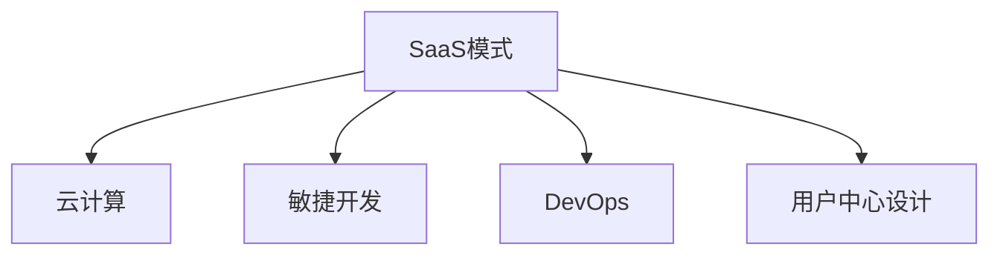

                 

## 1. 背景介绍

随着云计算、人工智能技术的快速发展，SaaS（Software as a Service，软件即服务）模式成为许多企业提供产品和服务的主要方式。SaaS产品通过云基础设施提供可扩展、易于访问的软件服务，帮助企业实现业务数字化转型。根据CB Insights的数据，2023年全球SaaS市场估值有望突破3.2万亿美元，其中不仅包括如Salesforce、Zoom等全球知名SaaS公司，也包括许多快速成长的初创公司。

程序员如何在这一大背景下，打造出能够实现千万美元估值的SaaS产品？本文将深入探讨这一问题，从战略规划、技术选型、产品设计、市场推广等多个方面，为你提供全面的指导。

## 2. 核心概念与联系

### 2.1 核心概念概述

- **SaaS模式**：SaaS是一种通过互联网提供软件应用的技术，客户无需购买软件，只需按需使用，通常采用订阅制收费模式。
- **云计算**：云计算提供弹性的计算资源，支持SaaS产品的构建和运行。
- **敏捷开发**：敏捷开发是一种迭代式的软件开发方法，强调快速响应变化和持续交付。
- **DevOps**：DevOps是软件开发与运维的结合，旨在提高软件交付效率和质量。
- **用户中心设计**：以用户需求和反馈为导向的产品设计方法，以提高用户体验和满意度。

这些核心概念之间的关系可以通过以下Mermaid流程图来展示：



## 3. 核心算法原理 & 具体操作步骤

### 3.1 算法原理概述

打造千万美元估值的SaaS产品，本质上是一个从需求分析到产品实现，再到市场推广的全流程。其核心算法原理包括以下几个关键步骤：

1. **市场分析**：通过数据分析和用户调研，了解市场需求和竞争态势。
2. **产品规划**：确定产品功能和优先级，设计产品架构和接口。
3. **技术选型**：选择合适的技术栈和开发框架，确保产品性能和可扩展性。
4. **敏捷开发**：采用迭代开发方式，快速响应用户需求变化。
5. **DevOps实践**：持续集成和持续交付，确保软件质量和安全。
6. **用户中心设计**：聚焦用户体验，不断优化产品设计。
7. **市场推广**：制定有效的营销策略，吸引和留存用户。

### 3.2 算法步骤详解

#### 3.2.1 市场分析

市场分析是SaaS产品开发的首要环节。通过市场分析，可以了解目标用户群体的需求、竞争者的优劣势以及市场趋势。

**步骤1**：收集市场数据和用户调研资料，包括行业报告、用户反馈和社交媒体评论等。

**步骤2**：使用数据分析工具（如Google Analytics、Tableau等）对数据进行可视化分析，识别市场需求和趋势。

**步骤3**：进行竞争分析，通过SWOT分析法（Strengths, Weaknesses, Opportunities, Threats）了解竞争对手的优劣势。

**步骤4**：结合分析结果，定义产品的核心功能和市场需求，制定初步的开发计划。

#### 3.2.2 产品规划

产品规划涉及确定产品的功能和优先级，设计产品架构和接口。

**步骤1**：根据市场分析结果，确定产品的核心功能和次要功能。

**步骤2**：设计产品架构，包括前端和后端的接口设计、数据流和业务逻辑等。

**步骤3**：制定产品路线图，明确各个功能的优先级和时间节点。

**步骤4**：进行原型设计和用户测试，收集反馈并调整方案。

#### 3.2.3 技术选型

技术选型是确保SaaS产品性能和可扩展性的关键步骤。

**步骤1**：根据产品需求，选择适合的技术栈和开发框架，如Node.js、Python、React等。

**步骤2**：评估云计算服务商（如AWS、Azure、Google Cloud）的性能和成本，选择适合的云基础设施。

**步骤3**：选择合适的数据库（如MySQL、MongoDB、PostgreSQL等）和存储解决方案（如对象存储、云数据库等）。

**步骤4**：考虑DevOps工具和流程，如Jenkins、Docker、Kubernetes等，以提高软件交付效率和质量。

#### 3.2.4 敏捷开发

敏捷开发强调快速响应需求变化和持续交付。

**步骤1**：采用Scrum或Kanban等敏捷方法论，将开发任务分解为小的迭代周期。

**步骤2**：通过每日站会、回顾会议等敏捷实践，确保团队协作和进度透明。

**步骤3**：使用持续集成（CI）和持续交付（CD）工具（如Jenkins、GitLab CI等），自动构建和部署代码。

**步骤4**：定期进行代码审查和质量检查，确保代码质量和安全。

#### 3.2.5 DevOps实践

DevOps实践旨在提高软件交付效率和质量，保障SaaS产品的稳定运行。

**步骤1**：采用容器化技术（如Docker）和容器编排工具（如Kubernetes），管理应用部署。

**步骤2**：实现自动化部署流程，确保每次发布都能快速、可靠地部署到生产环境。

**步骤3**：监控系统性能和日志，使用工具（如Prometheus、Grafana）进行可视化分析。

**步骤4**：建立故障恢复和应急响应机制，确保系统高可用性。

#### 3.2.6 用户中心设计

用户中心设计聚焦于用户体验，不断优化产品设计。

**步骤1**：通过用户调研和数据收集，了解用户需求和使用习惯。

**步骤2**：设计用户界面（UI）和用户体验（UX），确保界面友好、操作简便。

**步骤3**：进行A/B测试，评估不同设计方案的效果，选择最优方案。

**步骤4**：根据用户反馈，持续迭代和优化产品设计。

#### 3.2.7 市场推广

市场推广是吸引和留存用户的关键步骤。

**步骤1**：制定市场策略，包括定价模型、市场定位和目标用户群体。

**步骤2**：进行SEO优化和内容营销，提升产品在线可见性。

**步骤3**：使用社交媒体广告、邮件营销等渠道，吸引潜在用户。

**步骤4**：提供试用和免费版本，吸引新用户并增加用户粘性。

### 3.3 算法优缺点

基于SaaS产品开发的算法具有以下优点：

- **快速响应市场变化**：敏捷开发和持续交付确保产品能够快速适应市场变化。
- **持续改进**：用户中心设计和用户反馈机制帮助持续优化产品。
- **高扩展性**：云基础设施提供弹性的计算资源，支持产品快速扩展。

但同时，也存在一些缺点：

- **技术栈复杂**：需要选择合适的技术栈和开发框架，技术门槛较高。
- **成本投入大**：初期投资包括云计算资源、DevOps工具等，成本较高。
- **安全风险**：用户数据和应用安全需重点关注，防范风险。

### 3.4 算法应用领域

基于SaaS产品开发的算法广泛适用于各个领域，如客户关系管理（CRM）、人力资源管理（HRM）、财务管理（Finance）、电子商务（E-commerce）等。这些领域对数字化转型和提高运营效率的需求日益增长，为SaaS产品的开发提供了广阔的市场空间。

## 4. 数学模型和公式 & 详细讲解 & 举例说明

### 4.1 数学模型构建

SaaS产品的开发涉及多个维度，可以构建以下数学模型来指导开发过程：

- **用户增长模型**：预测用户数量和增长速度，优化市场推广策略。
- **产品满意度模型**：量化用户满意度，进行A/B测试优化产品设计。
- **成本收益模型**：计算投资回报率（ROI），评估产品盈利能力。

#### 4.2 公式推导过程

以用户增长模型为例，假设用户增长遵循Gompertz模型，用户数量 $N(t)$ 随时间 $t$ 变化的公式为：

$$ N(t) = N_0 e^{\alpha t} $$

其中 $N_0$ 为初始用户数，$\alpha$ 为增长率。

给定初始用户数和增长率，可以计算任意时刻的用户数量，用于指导市场推广策略。

#### 4.3 案例分析与讲解

某SaaS公司开发了一款CRM产品，初始用户数为1000，增长率为15%。使用Gompertz模型计算未来一年的用户数量：

1. 初始用户数 $N_0 = 1000$
2. 增长率 $\alpha = 0.15$
3. 时间 $t = 12$ 个月

代入公式，计算结果如下：

$$ N(12) = 1000 e^{0.15 \times 12} \approx 2186 $$

这表明，如果保持当前增长率，一年后公司用户数量将接近2186。基于此数据，公司可以制定相应的市场推广策略，如增加广告投放、优化用户体验等，以确保用户数量持续增长。

## 5. 项目实践：代码实例和详细解释说明

### 5.1 开发环境搭建

SaaS产品的开发环境包括开发工具、云基础设施和DevOps工具。以下是常用的开发环境搭建流程：

1. **安装开发工具**：安装Python、Node.js、Vue.js等开发工具，搭建开发环境。

2. **配置云基础设施**：选择AWS、Azure或Google Cloud等云服务商，搭建云环境。

3. **安装DevOps工具**：安装Jenkins、Docker、Kubernetes等DevOps工具，配置CI/CD流程。

### 5.2 源代码详细实现

以一个简单的SaaS产品为例，介绍代码实现和关键功能。

**前端：**

```javascript
// Vue.js 组件
<template>
  <div>
    <h1>{{ message }}</h1>
    <button @click="incrementCounter">增加计数</button>
  </div>
</template>

<script>
export default {
  name: 'Counter',
  data() {
    return {
      message: '初始值为0',
      count: 0
    }
  },
  methods: {
    incrementCounter() {
      this.count++
    }
  }
}
</script>
```

**后端：**

```python
# Flask 应用程序
from flask import Flask, render_template, request

app = Flask(__name__)

@app.route('/')
def index():
    message = '初始值为0'
    count = 0
    if request.args.get('count'):
        count = int(request.args.get('count'))
    return render_template('index.html', message=message, count=count)

@app.route('/increment')
def increment():
    count = request.args.get('count')
    if count:
        count += 1
    else:
        count = 0
    return render_template('index.html', message='增加计数', count=count)

if __name__ == '__main__':
    app.run(debug=True)
```

**数据库：**

```python
# PostgreSQL 数据库操作
import psycopg2

conn = psycopg2.connect(dbname='mydb', user='myuser', password='mypassword', host='localhost')
cur = conn.cursor()

# 插入数据
cur.execute("INSERT INTO counter (value) VALUES (%s)", (0,))

# 查询数据
cur.execute("SELECT * FROM counter")
rows = cur.fetchall()
for row in rows:
    print(row)

conn.close()
```

**部署：**

使用Docker和Kubernetes进行应用部署，以下是一个简单的Dockerfile：

```dockerfile
# 从Python基础镜像开始
FROM python:3.8

# 安装Flask等依赖
COPY requirements.txt /
RUN pip install -r requirements.txt

# 复制代码和数据
COPY . .

# 设置环境变量
ENV FLASK_APP=app.py
ENV FLASK_ENV=development

# 暴露端口
EXPOSE 5000

# 启动应用
CMD ["flask", "run"]
```

### 5.3 代码解读与分析

**前端代码解读：**

- **模板（template）**：使用Vue.js框架，创建界面模板。
- **数据（data）**：定义组件的状态，包括初始消息和计数器值。
- **方法（methods）**：定义方法，如增加计数器的逻辑。

**后端代码解读：**

- **Flask框架**：使用Python的Flask框架，创建Web应用程序。
- **路由（route）**：定义路由，处理请求和响应。
- **模板渲染（render_template）**：将数据渲染到HTML模板中。

**数据库代码解读：**

- **连接（connect）**：连接PostgreSQL数据库。
- **插入数据（execute）**：插入初始计数器值。
- **查询数据（fetchall）**：查询并打印计数器值。

**部署代码解读：**

- **Dockerfile**：定义Docker镜像，包括Python环境、Flask应用和数据。
- **EXPOSE指令**：暴露端口，让容器能够访问。
- **CMD指令**：启动Flask应用，运行服务器。

## 6. 实际应用场景

### 6.1 客户关系管理（CRM）

CRM是SaaS产品的重要应用场景，帮助企业管理客户关系，提高销售效率。

**案例**：一家销售公司使用SaaS CRM平台管理客户信息和销售活动。平台集成了销售管理、客户服务、市场营销等功能，提升了客户满意度和销售转化率。

### 6.2 人力资源管理（HRM）

HRM是SaaS产品的重要应用场景，帮助企业管理员工信息，提升人力资源管理效率。

**案例**：一家大型企业使用SaaS HRM平台管理员工信息、考勤和绩效评估。平台提供了员工自助服务、HR数据分析等功能，提升了员工体验和HR工作效率。

### 6.3 财务管理（Finance）

财务管理是SaaS产品的重要应用场景，帮助企业管理财务数据，提升财务决策效率。

**案例**：一家金融公司使用SaaS财务管理平台管理会计凭证、财务报表和预算。平台提供了自动化报表生成、财务分析等功能，提升了财务决策的准确性和效率。

### 6.4 电子商务（E-commerce）

电子商务是SaaS产品的重要应用场景，帮助企业管理在线销售和客户服务。

**案例**：一家电商公司使用SaaS电商平台管理商品、订单和客户反馈。平台提供了购物车、订单管理、客户评论等功能，提升了客户体验和订单处理效率。

## 7. 工具和资源推荐

### 7.1 学习资源推荐

- **《SaaS开发实战》**：由SaaS公司技术负责人撰写，详细介绍SaaS产品开发的完整流程。
- **《云计算基础》**：由云计算专家撰写，深入介绍云计算基础和SaaS应用架构。
- **《DevOps实践指南》**：由DevOps社区贡献，详细介绍DevOps实践和工具。
- **《用户中心设计》**：由用户体验设计师撰写，详细介绍用户中心设计的原理和实践。

### 7.2 开发工具推荐

- **Python**：Python是SaaS产品开发的主流语言，广泛应用于Web开发、数据科学等领域。
- **Flask**：Flask是一个轻量级的Web框架，适合快速开发Web应用程序。
- **Vue.js**：Vue.js是一个渐进式JavaScript框架，适合开发前端用户界面。
- **Docker**：Docker是一个容器化平台，适合部署和管理SaaS应用。
- **Kubernetes**：Kubernetes是一个容器编排平台，适合管理多个Docker容器。

### 7.3 相关论文推荐

- **《SaaS产品的设计原则》**：讨论了SaaS产品设计的关键原则和方法。
- **《SaaS开发的最佳实践》**：介绍了SaaS开发的最佳实践和经验教训。
- **《SaaS产品的用户体验设计》**：讨论了用户体验设计在SaaS产品开发中的重要性。
- **《SaaS产品的市场推广策略》**：介绍了SaaS产品的市场推广策略和案例分析。

## 8. 总结：未来发展趋势与挑战

### 8.1 总结

本文详细介绍了程序员如何打造千万美元估值的SaaS产品，从市场分析到技术选型，再到产品设计和市场推广，全面系统地讲解了SaaS产品开发的完整流程。通过理论结合实践，为读者提供了全面的指导。

### 8.2 未来发展趋势

- **多云集成**：越来越多的企业采用多云环境，SaaS产品需要支持多云集成，实现资源优化和成本控制。
- **人工智能**：人工智能技术在SaaS产品中的应用将越来越广泛，提升产品智能化水平。
- **低代码开发**：低代码开发工具的发展将降低SaaS产品开发的技术门槛，提高开发效率。
- **用户隐私保护**：随着数据隐私法规的完善，SaaS产品需要加强用户数据保护，提升安全性。
- **全球化部署**：SaaS产品需要支持全球化部署，满足不同地区的需求和法规要求。

### 8.3 面临的挑战

- **技术栈选择**：选择合适的技术栈和框架，确保产品性能和可扩展性。
- **成本控制**：平衡初期投资和长期运营成本，确保可持续发展。
- **用户体验优化**：持续优化用户体验，提升用户满意度和留存率。
- **市场竞争**：在竞争激烈的市场环境中，找到差异化优势，实现快速增长。
- **数据安全**：保障用户数据和应用安全，防止数据泄露和攻击。

### 8.4 研究展望

- **自动化测试**：开发自动化测试工具，确保软件质量和安全。
- **微服务架构**：采用微服务架构，提升系统可扩展性和可靠性。
- **混合云部署**：探索混合云部署模型，优化资源使用和成本控制。
- **人工智能应用**：结合人工智能技术，提升产品智能化和自动化水平。
- **区块链技术**：探索区块链技术在SaaS产品中的应用，提高数据安全性和信任度。

## 9. 附录：常见问题与解答

**Q1：SaaS产品开发需要哪些技术栈？**

A: SaaS产品开发需要多种技术栈，主要包括：

- **前端技术栈**：HTML/CSS、JavaScript、Vue.js等。
- **后端技术栈**：Python、Flask、Django等。
- **数据库技术栈**：MySQL、PostgreSQL等。
- **云基础设施**：AWS、Azure、Google Cloud等。
- **DevOps工具**：Jenkins、Docker、Kubernetes等。

**Q2：如何提高SaaS产品的市场竞争力？**

A: 提高SaaS产品市场竞争力的关键在于：

- **快速响应市场变化**：采用敏捷开发和持续交付，确保产品快速迭代。
- **优化用户体验**：聚焦用户需求，持续优化产品设计。
- **合理定价策略**：制定合理的定价模型，吸引和留存用户。
- **强大的客户支持**：提供优质的客户服务和技术支持，提升用户满意度。
- **有效的市场推广**：制定有效的营销策略，吸引潜在用户。

**Q3：SaaS产品开发过程中需要考虑哪些安全问题？**

A: SaaS产品开发过程中需要考虑以下安全问题：

- **数据隐私保护**：保护用户数据隐私，遵守数据隐私法规。
- **应用安全**：防止SQL注入、XSS等常见攻击，确保应用安全。
- **网络安全**：防止DDoS攻击、恶意软件等，保障网络安全。
- **用户认证**：采用安全的认证机制，防止用户身份被盗用。
- **数据备份**：定期备份数据，防止数据丢失或损坏。

**Q4：SaaS产品如何实现高效扩展？**

A: SaaS产品实现高效扩展的关键在于：

- **云基础设施**：选择弹性计算资源，支持快速扩展。
- **微服务架构**：采用微服务架构，提升系统可扩展性。
- **自动化部署**：采用自动化部署工具，快速部署新功能。
- **负载均衡**：采用负载均衡技术，均衡分配请求负载。
- **缓存机制**：采用缓存机制，减少数据库负载。

**Q5：SaaS产品开发过程中如何进行项目管理？**

A: SaaS产品开发过程中项目管理的关键在于：

- **敏捷开发**：采用敏捷开发方法论，快速响应需求变化。
- **项目规划**：明确项目目标和任务，制定详细的项目计划。
- **团队协作**：采用协作工具（如JIRA、Trello等），确保团队协作高效。
- **进度监控**：定期监控项目进度，及时发现和解决问题。
- **质量保证**：采用自动化测试工具，确保软件质量和安全。

希望本文能够为程序员打造千万美元估值的SaaS产品提供有用的指导，帮助你在数字化转型的大潮中乘风破浪，实现技术梦想。

---

作者：禅与计算机程序设计艺术 / Zen and the Art of Computer Programming

