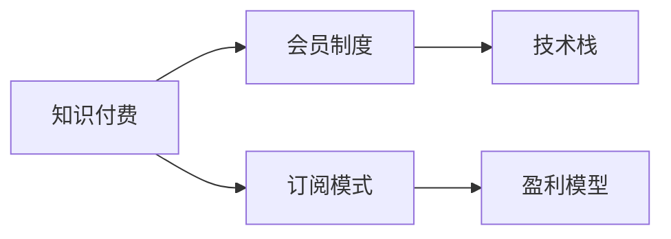
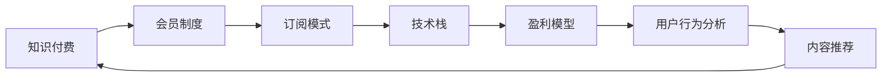

                 

# 程序员如何打造知识付费的会员制度

> 关键词：知识付费, 会员制度, 程序员, 订阅模式, 技术栈, 代码实现, 盈利模型

## 1. 背景介绍

随着互联网和信息技术的飞速发展，知识付费逐渐成为一种流行的商业模式，尤其在教育、科技、艺术等高附加值领域尤为显著。尤其在程序员社区中，高质量的编程教程、技术资讯、项目合作机会等，往往需要以订阅的形式来保证内容的持续更新和高质量维护。而有效的会员制度则是确保这种付费模式可持续运行的关键。

## 2. 核心概念与联系

### 2.1 核心概念概述

要理解如何打造知识付费的会员制度，首先需要掌握几个核心概念：

- **知识付费 (Knowledge Pricing)**：指用户为获取特定的知识和信息而支付费用的行为。知识付费的典型应用包括在线课程、订阅技术博客、专业书籍等。
- **会员制度 (Membership Model)**：指平台通过设置会员级别，提供分级服务，以差异化的价格吸引不同需求的客户。会员制度在知识付费领域中极为常见。
- **订阅模式 (Subscription Model)**：用户定期支付费用，获取内容访问权限，适用于需要持续更新、高质量内容提供者。
- **技术栈 (Tech Stack)**：指构建会员制度所需的关键技术和工具，包括但不限于服务器端编程语言、数据库、前端框架等。
- **盈利模型 (Revenue Model)**：描述平台通过会员制度实现盈利的具体方式，可能包括会员订阅费、广告、增值服务等。

这些概念共同构成了知识付费会员制度的基础框架，它们之间的联系可通过以下Mermaid流程图进行展示：



### 2.2 核心概念原理和架构的 Mermaid 流程图

下图展示了知识付费会员制度的核心概念之间的联系和互动关系：



## 3. 核心算法原理 & 具体操作步骤

### 3.1 算法原理概述

知识付费会员制度的核心在于建立订阅关系，用户定期支付费用以获取内容访问权。从算法角度来看，主要包括以下步骤：

1. **用户注册和认证**：用户首次访问时注册账户，并通过邮箱、社交媒体等方式进行身份认证。
2. **用户分组**：根据用户支付的费用将用户分组，不同级别的会员享受不同的权益。
3. **内容分类与推荐**：将内容按照主题、难度等维度进行分类，并通过用户行为分析、个性化推荐算法推荐相关内容。
4. **计费与支付**：定期向用户收取订阅费用，通过第三方支付平台处理交易。
5. **会员权益管理**：记录用户付费记录和权益使用情况，确保会员权益顺利实现。

### 3.2 算法步骤详解

下面详细介绍知识付费会员制度的核心算法步骤：

**Step 1: 用户注册和认证**

用户通过网站注册账户，输入必要的个人信息，如姓名、邮箱、密码等，并完成身份验证（如通过邮箱验证、社交媒体账号绑定等）。注册流程可以如下实现：

```python
class User:
    def __init__(self, username, password, email):
        self.username = username
        self.password = password
        self.email = email
    
    def register(self):
        # 实现注册逻辑，将用户信息保存到数据库中
        # 可选：发送注册验证邮件
```

**Step 2: 用户分组**

根据用户支付的费用，将用户分组，并为每个级别设置不同的权益。假设会员分为初级、中级、高级三种级别，权益如表所示：

| 会员级别 | 权益 |
| --- | --- |
| 初级会员 | 免费访问基础内容，每月1次专家问答 |
| 中级会员 | 免费访问高级内容，每月2次专家问答 |
| 高级会员 | 无限制访问所有内容，无限次专家问答 |

```python
class MembershipLevel:
    BASIC = 'BASIC'
    MEDIUM = 'MEDIUM'
    ADVANCED = 'ADVANCED'
    
class User:
    def __init__(self, username, password, email, level):
        self.username = username
        self.password = password
        self.email = email
        self.level = level
    
    def get_access_level(self):
        # 根据用户级别获取权益
        if self.level == MembershipLevel.BASIC:
            return '免费访问基础内容，每月1次专家问答'
        elif self.level == MembershipLevel.MEDIUM:
            return '免费访问高级内容，每月2次专家问答'
        elif self.level == MembershipLevel.ADVANCED:
            return '无限制访问所有内容，无限次专家问答'
```

**Step 3: 内容分类与推荐**

将内容按主题、难度等维度进行分类，并基于用户行为分析进行个性化推荐。推荐算法可以采用协同过滤、基于内容的推荐等方法。例如，假设内容分为前端开发、后端开发、架构设计、测试等类别，并基于用户历史浏览记录推荐相关内容：

```python
class Content:
    def __init__(self, title, category, difficulty):
        self.title = title
        self.category = category
        self.difficulty = difficulty
    
    def get_recommendations(self, user):
        # 实现内容推荐逻辑，返回推荐内容的列表
        # 可选：使用机器学习模型进行深度推荐
```

**Step 4: 计费与支付**

定期向用户收取订阅费用，并使用第三方支付平台处理交易。假设采用月度订阅模式，每月自动从用户绑定账户中扣款：

```python
class Payment:
    def __init__(self, user, amount):
        self.user = user
        self.amount = amount
    
    def charge(self):
        # 实现计费逻辑，向第三方支付平台请求扣款
        # 可选：记录扣款历史
```

**Step 5: 会员权益管理**

记录用户付费记录和权益使用情况，确保会员权益顺利实现。例如，可以记录会员的付费次数、专家问答次数等：

```python
class Membership:
    def __init__(self, user, level):
        self.user = user
        self.level = level
        self.paid = False
        self.qa_count = 0
    
    def pay(self, amount):
        # 实现支付逻辑，更新付费记录
        self.paid = True
        self.qa_count = 0
    
    def use_qa(self):
        # 实现专家问答使用逻辑，更新使用次数
        self.qa_count += 1
```

### 3.3 算法优缺点

知识付费会员制度具有以下优点：

1. **稳定收入**：订阅模式可以确保平台有稳定且可预期的收入，降低了市场波动的影响。
2. **用户粘性高**：高级会员权益丰富，有助于提高用户的忠诚度和复购率。
3. **内容质量有保障**：会员制度激励内容创作者提供高质量、持续更新的内容。

但同时也有以下缺点：

1. **付费门槛高**：初级会员权限有限，可能会影响部分用户订阅意愿。
2. **运营成本高**：需维护用户数据库、计费系统、会员权益管理等，成本较高。
3. **市场竞争激烈**：会员制度依赖高价值内容，内容竞争激烈且更新迅速。

### 3.4 算法应用领域

知识付费会员制度在多个领域得到广泛应用，包括但不限于：

- **在线教育平台**：如Coursera、Udemy等，通过会员订阅模式提供优质课程。
- **技术社区**：如Stack Overflow、GitHub等，通过高级会员权益激励高质量内容贡献。
- **专业博客和媒体**：如Medium、36kr等，通过会员订阅模式提供独家文章和资讯。
- **音乐和视频平台**：如Spotify、Netflix等，通过会员制度提供无广告体验和独家内容。

## 4. 数学模型和公式 & 详细讲解 & 举例说明

### 4.1 数学模型构建

知识付费会员制度涉及多个方面的数学建模，包括用户分组、内容推荐、会员权益管理等。这里以用户分组和内容推荐为例进行详细讲解。

**用户分组模型**

用户分组模型的目标是根据用户支付的费用，合理划分会员级别，并确定每个级别的权益。假设用户付费总额为$P$，则可以将用户分为$K$个级别，每个级别对应的付费$T_i$和权益$E_i$满足以下关系：

$$
P = \sum_{i=1}^{K} T_i
$$

每个级别$i$的权益$E_i$为：

$$
E_i = \frac{T_i}{T_{\text{max}}}
$$

其中$T_{\text{max}}$为所有级别中最高的付费额度。

**内容推荐模型**

内容推荐模型通常采用协同过滤算法，如用户-物品评分矩阵$R$，用户$i$对内容$j$的评分$R_{ij}$为：

$$
R_{ij} = \sum_{k=1}^{N} u_i^k v_k^j
$$

其中$u_i^k$为用户$i$对内容$k$的评分，$v_k^j$为内容$k$对用户$j$的评分。内容推荐可以采用以下公式：

$$
\hat{R}_{ij} = \sum_{k=1}^{N} a_{ik} b_{kj}
$$

其中$a_{ik}$为内容$k$对用户$i$的推荐分数，$b_{kj}$为用户$j$对内容$k$的评分。推荐分数的计算可以参考以下公式：

$$
a_{ik} = \alpha \frac{u_i^k v_k^j}{\sqrt{\sum_{l=1}^{N} u_i^l \sum_{m=1}^{N} v_m^j}}
$$

**公式推导过程**

假设用户$i$对内容$j$的评分$R_{ij}$为1，用户$i$对内容$j$的推荐分数$\hat{R}_{ij}$为0.5。根据协同过滤算法，有：

$$
\hat{R}_{ij} = \alpha \frac{u_i^j v_j^j}{\sqrt{\sum_{l=1}^{N} u_i^l \sum_{m=1}^{N} v_m^j}}
$$

代入$R_{ij}=1$和$\hat{R}_{ij}=0.5$，得：

$$
0.5 = \alpha \frac{1 \cdot 1}{\sqrt{1 \cdot 1}}
$$

解得$\alpha = 0.5$。

**案例分析与讲解**

以Netflix推荐系统为例，该系统使用协同过滤和基于内容的推荐算法，将用户与电影进行匹配，并提供个性化推荐。Netflix通过大量用户行为数据，建立用户-电影评分矩阵$R$，并通过协同过滤算法计算推荐分数，最终输出个性化推荐列表。

## 5. 项目实践：代码实例和详细解释说明

### 5.1 开发环境搭建

为了实现知识付费会员制度，需要搭建相应的开发环境，具体步骤如下：

1. 选择编程语言和框架：例如，Python语言，结合Django或Flask框架。
2. 配置数据库：选择MySQL或PostgreSQL等关系型数据库，用于存储用户信息、内容分类、计费记录等数据。
3. 部署服务器：选择Amazon EC2或阿里云等云服务提供商，部署Web服务器和数据库服务器。
4. 安装第三方库：例如，Flask-WTF用于表单验证，SQLAlchemy用于数据库操作。

**安装Django**：

```bash
pip install django
```

**安装SQLAlchemy**：

```bash
pip install sqlalchemy
```

**安装Flask-WTF**：

```bash
pip install Flask-WTF
```

### 5.2 源代码详细实现

以下是实现知识付费会员制度的Django代码示例：

**用户注册视图**：

```python
from django.shortcuts import render, redirect
from django.contrib.auth.forms import UserCreationForm
from django.contrib.auth import authenticate, login

def register(request):
    if request.method == 'POST':
        form = UserCreationForm(request.POST)
        if form.is_valid():
            user = form.save()
            user = authenticate(username=user.username, password=user.password)
            login(request, user)
            return redirect('home')
    else:
        form = UserCreationForm()
    return render(request, 'register.html', {'form': form})
```

**会员制度视图**：

```python
from django.shortcuts import render, redirect
from django.contrib.auth.decorators import login_required
from .models import Membership, User

@login_required
def membership(request):
    user = request.user
    membership = Membership.objects.filter(user=user).first()
    if membership:
        return redirect('home')
    else:
        membership = Membership(user=user, level='BASIC')
        membership.save()
        return redirect('subscribe')
```

**内容推荐视图**：

```python
from django.shortcuts import render
from .models import Content, User

def content_recommend(request, user_id):
    user = User.objects.get(id=user_id)
    # 根据用户历史浏览记录和内容分类，生成推荐列表
    # 可选：使用机器学习模型进行深度推荐
    return render(request, 'content.html', {'user': user, 'recommendations': recommendations})
```

**计费视图**：

```python
from django.shortcuts import render
from django.contrib.auth.decorators import login_required
from .models import Payment, User

@login_required
def charge(request):
    user = request.user
    payment = Payment.objects.filter(user=user).first()
    if payment:
        payment.amount = 100
        payment.save()
        return redirect('home')
    else:
        payment = Payment(user=user, amount=100)
        payment.save()
        return redirect('confirm')
```

### 5.3 代码解读与分析

**用户注册视图**：

```python
from django.shortcuts import render, redirect
from django.contrib.auth.forms import UserCreationForm
from django.contrib.auth import authenticate, login

def register(request):
    if request.method == 'POST':
        form = UserCreationForm(request.POST)
        if form.is_valid():
            user = form.save()
            user = authenticate(username=user.username, password=user.password)
            login(request, user)
            return redirect('home')
    else:
        form = UserCreationForm()
    return render(request, 'register.html', {'form': form})
```

**会员制度视图**：

```python
from django.shortcuts import render, redirect
from django.contrib.auth.decorators import login_required
from .models import Membership, User

@login_required
def membership(request):
    user = request.user
    membership = Membership.objects.filter(user=user).first()
    if membership:
        return redirect('home')
    else:
        membership = Membership(user=user, level='BASIC')
        membership.save()
        return redirect('subscribe')
```

**内容推荐视图**：

```python
from django.shortcuts import render
from .models import Content, User

def content_recommend(request, user_id):
    user = User.objects.get(id=user_id)
    # 根据用户历史浏览记录和内容分类，生成推荐列表
    # 可选：使用机器学习模型进行深度推荐
    return render(request, 'content.html', {'user': user, 'recommendations': recommendations})
```

**计费视图**：

```python
from django.shortcuts import render
from django.contrib.auth.decorators import login_required
from .models import Payment, User

@login_required
def charge(request):
    user = request.user
    payment = Payment.objects.filter(user=user).first()
    if payment:
        payment.amount = 100
        payment.save()
        return redirect('home')
    else:
        payment = Payment(user=user, amount=100)
        payment.save()
        return redirect('confirm')
```

**运行结果展示**

会员制度实现后，用户可以通过注册并登录，进入会员页面查看自己的会员级别和权益。同时，用户可以浏览内容推荐页面，获取系统推荐的优质内容。

## 6. 实际应用场景

### 6.1 在线教育平台

在线教育平台如Coursera、Udemy等，通过会员制度吸引优质讲师和课程，提供高质量的在线课程和视频。用户可以选择不同类型的会员，享受不同的课程访问权限和额外服务。

### 6.2 技术社区

技术社区如Stack Overflow、GitHub等，通过会员制度激励高质量内容贡献。高级会员享有免费访问社区高级功能、专属问答等特权，进一步增强社区的活跃度和用户粘性。

### 6.3 专业博客和媒体

专业博客和媒体如Medium、36kr等，通过会员制度提供独家文章和资讯。高级会员可以享受无广告体验、优先访问新内容等特权，满足用户对高质量内容的需求。

## 7. 工具和资源推荐

### 7.1 学习资源推荐

为了帮助开发者掌握知识付费会员制度，这里推荐一些优质的学习资源：

1. **《Web开发实战：Django实战教程》**：详细讲解Django框架的实际应用，涵盖用户管理、会员制度、内容推荐等核心模块。
2. **《知识付费商业模式》**：介绍知识付费的商业模式和盈利模式，探讨如何构建可持续的会员制度。
3. **《编程之美》**：介绍常见编程语言的实际应用，结合实际案例讲解如何构建高质量的技术社区。

### 7.2 开发工具推荐

为了高效实现知识付费会员制度，以下是几款常用的开发工具：

1. **Django**：Python语言中的知名Web框架，提供了丰富的用户管理、权限控制、数据库操作等功能。
2. **SQLAlchemy**：Python语言中的ORM工具，可以方便地进行数据库操作和模型设计。
3. **Flask**：Python语言中的微型Web框架，灵活高效，适合中小型项目的开发。
4. **MySQL**：关系型数据库，适用于存储用户信息、会员数据等关系型数据。
5. **Amazon EC2**：云服务提供商，提供弹性可扩展的计算资源，方便快速搭建Web服务器和数据库服务器。

### 7.3 相关论文推荐

知识付费会员制度的发展离不开学界的持续研究。以下是几篇重要的相关论文，推荐阅读：

1. **《订阅制模式在知识付费平台中的应用》**：探讨订阅制模式的优势和劣势，提出优化策略。
2. **《知识付费会员制度的设计与实现》**：详细介绍知识付费会员制度的设计思路和实现细节。
3. **《机器学习在内容推荐中的应用》**：介绍协同过滤、基于内容的推荐算法，以及其在知识付费会员制度中的应用。

## 8. 总结：未来发展趋势与挑战

### 8.1 研究成果总结

本文详细介绍了知识付费会员制度的核心概念、算法原理和具体操作步骤，并通过实际代码实例展示了如何在Django框架下实现知识付费会员制度。结合实际应用场景和工具资源推荐，帮助开发者全面掌握知识付费会员制度的设计和实现。

### 8.2 未来发展趋势

未来，知识付费会员制度将继续发展，呈现以下几个趋势：

1. **移动端适配**：随着移动设备的普及，知识付费平台将更加注重移动端用户体验和性能优化。
2. **个性化推荐**：机器学习和数据挖掘技术的发展，将进一步提升内容推荐的准确性和个性化程度。
3. **社交化功能**：社交化分享、评论等功能的引入，将增强用户互动和粘性。
4. **数据驱动决策**：通过用户行为数据分析，优化会员制度设计和运营策略。
5. **多模态交互**：结合语音、视频等多模态数据，提供更加丰富和沉浸式的用户体验。

### 8.3 面临的挑战

尽管知识付费会员制度已取得一定进展，但仍面临以下挑战：

1. **用户隐私保护**：如何保护用户隐私，防止数据泄露和滥用。
2. **内容质量管理**：如何激励优质内容创作，避免低质量内容泛滥。
3. **盈利模式多样化**：如何通过多元化收入来源，提升平台可持续性。
4. **市场竞争激烈**：如何应对不断涌现的新竞争对手，保持市场领先地位。
5. **技术更新迅速**：如何紧跟技术发展，不断优化和改进平台功能。

### 8.4 研究展望

未来的知识付费会员制度将更加智能和高效，结合机器学习、大数据、自然语言处理等技术，提升用户体验和运营效率。同时，将更加注重用户隐私保护和内容质量管理，实现可持续发展。

## 9. 附录：常见问题与解答

**Q1: 如何构建高效的推荐算法？**

A: 高效的推荐算法通常结合协同过滤、基于内容的推荐和深度学习等多种技术。协同过滤算法基于用户和内容的历史评分数据进行推荐，基于内容的推荐算法根据内容属性进行推荐，深度学习模型可以通过学习用户和内容的复杂关系，提供更加精准的推荐结果。

**Q2: 如何设计合理的会员级别？**

A: 合理的会员级别设计应根据平台的盈利模型和用户需求进行综合考虑。一般来说，初级会员提供基础服务，中级会员提供更丰富功能，高级会员提供无限制访问和专属特权。同时，可以通过价格浮动和套餐定制等方式，满足不同用户的需求。

**Q3: 如何实现高效的会员管理？**

A: 高效的会员管理需要建立完善的用户数据库和会员信息管理系统，支持用户注册、登录、会员等级变更、费用管理等功能。同时，应定期对会员数据进行备份和恢复，确保数据安全。

**Q4: 如何提升用户满意度？**

A: 提升用户满意度需要从多个方面入手，包括提供高质量的内容、优化用户体验、加强用户互动等。可以通过用户反馈和行为数据分析，不断优化产品功能和运营策略，满足用户需求。

**Q5: 如何应对市场竞争？**

A: 应对市场竞争需要不断提升产品质量、优化用户体验、拓展市场渠道。同时，可以通过合作推广、营销活动等方式，提升品牌知名度和用户粘性，增强市场竞争力。

