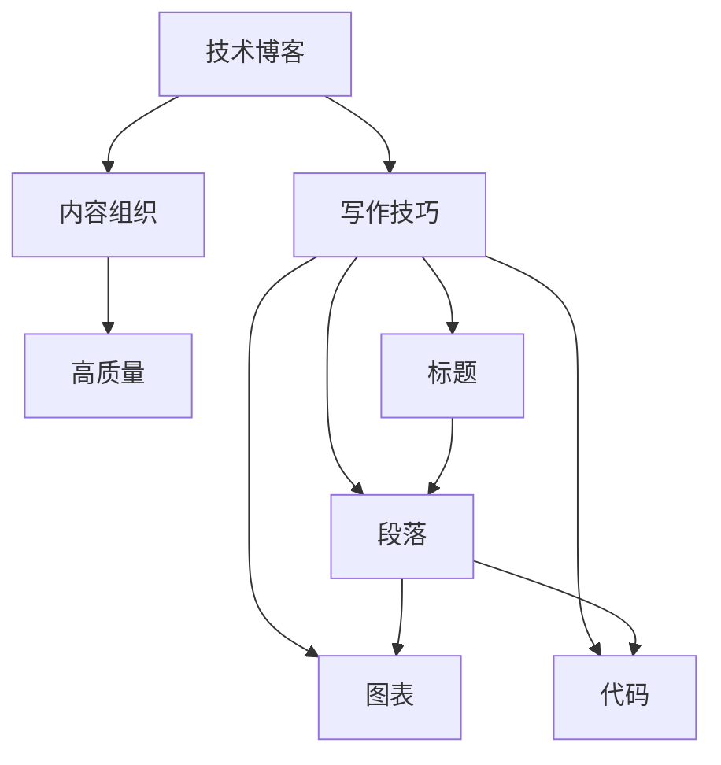

                 

# 程序员如何打造高质量的技术电子书

> 关键词：技术电子书, 程序员, 高质量, 写作技巧, 技术博客, 内容组织, 案例分析, 技术传播, 持续更新, 技术趋势, 学习资源

## 1. 背景介绍

随着技术快速发展，越来越多的程序员希望通过技术博客或电子书来记录和分享自己的技术心得。然而，高质量的技术文章不仅要求作者具备扎实的基础知识和编程能力，还需要有良好的写作技巧和内容组织能力。本博客将从如何打造高质量技术电子书的角度，系统地介绍技术写作的基本原则、技巧和方法，帮助程序员提升技术传播的能力。

## 2. 核心概念与联系

### 2.1 核心概念概述

本节将介绍几个核心概念，以及它们之间的联系。

- **技术博客**：通过博客形式分享技术知识、编程心得和项目经验的平台。
- **技术电子书**：以电子书形式系统化地组织和呈现技术知识、原理和实践的书籍。
- **高质量**：技术文章需要具备清晰的主题、准确的信息、流畅的表达和易读的结构。
- **写作技巧**：包括选题、布局、段落、标题、图表、代码等技术细节的处理技巧。
- **内容组织**：如何合理规划和组织文章的结构，确保信息的逻辑性和连贯性。

这些概念之间存在紧密的联系。技术博客和电子书都是技术传播的载体，而高质量则是它们共同追求的目标。写作技巧和内容组织则是实现高质量技术文章的必要手段。

### 2.2 核心概念原理和架构的 Mermaid 流程图



此图展示了技术博客和电子书的制作流程。作者首先需要进行内容组织（B），然后运用写作技巧（C），从而产出高质量的文章（D）。文章中包含了标题（E）、段落（F）、图表（G）和代码（H）等元素，这些元素共同构成了高质量文章的骨架。

## 3. 核心算法原理 & 具体操作步骤

### 3.1 算法原理概述

打造高质量的技术文章，需要遵循一定的算法原理和操作步骤。这些步骤包括选题、构思、写稿、编辑、发布等环节。每一步都涉及到了算法原理的应用，如内容组织的逻辑性、段落的连贯性、图表和代码的可读性等。

### 3.2 算法步骤详解

#### 3.2.1 选题

- **定位目标读者**：了解目标读者群体，明确他们最关心的技术和问题，选择相关主题。
- **需求调研**：通过问卷调查、社区讨论等方式收集读者需求，确定文章主题。
- **新颖性判断**：选择新颖且有实际应用价值的技术或问题，避免重复他人的工作。

#### 3.2.2 构思

- **文章结构**：设计文章的大纲和目录，确保内容逻辑清晰，便于读者理解和记忆。
- **核心观点**：确定文章的核心观点和关键信息，围绕这些核心内容展开。
- **案例分析**：搜集相关案例，通过具体实例来支撑文章观点。

#### 3.2.3 写稿

- **开头引入**：用引人入胜的开头吸引读者注意力，简要介绍文章的核心内容。
- **主体部分**：详细阐述文章的核心观点和技术细节，每部分之间逻辑连贯，内容详实。
- **结尾总结**：总结文章的主要结论，提出实际应用建议或未来研究方向。

#### 3.2.4 编辑

- **审校与修改**：多次审校文章，纠正语法错误、提高语句流畅度、优化内容结构。
- **格式调整**：调整标题、段落、代码块的格式，使其符合出版标准。
- **图表插入**：插入必要的图表和示意图，帮助读者更直观地理解技术细节。

#### 3.2.5 发布

- **多渠道发布**：在博客、论坛、社交媒体等多渠道发布文章，增加曝光率。
- **更新与维护**：定期更新文章，纠正错误，添加最新技术和实例。

### 3.3 算法优缺点

#### 3.3.1 优点

- **系统化**：通过严格的步骤和清晰的结构，帮助读者更好地理解和学习技术。
- **普适性**：适用于各种类型的技术博客和电子书，有助于提升作者的技术传播能力。
- **可重复性**：每一步都可以根据实际情况进行调整，灵活应对不同的写作需求。

#### 3.3.2 缺点

- **时间投入**：每一步都需要仔细思考和处理，可能会占用大量时间。
- **需高水平写作**：需要作者具备扎实的技术知识和出色的写作能力，对初学者有一定门槛。

### 3.4 算法应用领域

这种写作流程不仅适用于技术博客和电子书，也适用于技术演讲、技术培训等形式的技术传播活动。通过系统的步骤和详细的指导，可以有效地提升技术传播的效率和质量，使更多人受益于技术知识。

## 4. 数学模型和公式 & 详细讲解 & 举例说明

### 4.1 数学模型构建

假设我们正在撰写一篇关于“深度学习在图像识别中的应用”的技术文章。

- **选题**：深度学习
- **内容组织**：文章结构，如引言、算法介绍、应用案例、未来展望等
- **核心观点**：深度学习通过多层神经网络结构，能够有效提升图像识别准确率。

### 4.2 公式推导过程

以深度学习中的卷积神经网络（CNN）为例，我们可进行以下推导：

- **公式**：$y=f(x)$，其中$x$为输入图像，$y$为输出标签，$f$为CNN模型。
- **推导**：通过卷积层、池化层、全连接层等操作，将输入图像转化为输出标签。

### 4.3 案例分析与讲解

以实际项目中的图像识别系统为例，讲解CNN模型的实现和优化：

- **背景**：某电商平台的商品图片分类项目，要求高准确率、低延迟。
- **实现**：选用LeNet-5网络结构，引入批归一化、Dropout等技术优化模型。
- **优化**：使用GPU加速训练，调整学习率，增加数据增强等手段。

## 5. 项目实践：代码实例和详细解释说明

### 5.1 开发环境搭建

在撰写技术文章时，我们需要一个支持编程和写作的环境。建议使用IDE如Visual Studio Code、PyCharm等，以及文本编辑器如Vim、Sublime等。

### 5.2 源代码详细实现

以下是一个简单的Python代码示例，用于图像分类：

```python
import tensorflow as tf
from tensorflow.keras import layers

# 构建CNN模型
model = tf.keras.Sequential([
    layers.Conv2D(32, (3,3), activation='relu', input_shape=(32,32,3)),
    layers.MaxPooling2D((2,2)),
    layers.Conv2D(64, (3,3), activation='relu'),
    layers.MaxPooling2D((2,2)),
    layers.Conv2D(64, (3,3), activation='relu'),
    layers.Flatten(),
    layers.Dense(64, activation='relu'),
    layers.Dense(10)
])

# 编译模型
model.compile(optimizer='adam', loss=tf.keras.losses.SparseCategoricalCrossentropy(from_logits=True), metrics=['accuracy'])

# 加载数据
(x_train, y_train), (x_test, y_test) = tf.keras.datasets.cifar10.load_data()

# 数据预处理
x_train = x_train / 255.0
x_test = x_test / 255.0

# 训练模型
model.fit(x_train, y_train, epochs=10, validation_data=(x_test, y_test))
```

### 5.3 代码解读与分析

- **模型构建**：使用Sequential模型，添加卷积层、池化层和全连接层。
- **编译模型**：指定优化器、损失函数和评价指标。
- **数据加载**：使用CIFAR-10数据集。
- **数据预处理**：对图像数据进行归一化处理。
- **模型训练**：使用10个epoch进行训练，验证集用于评估模型性能。

### 5.4 运行结果展示

训练完成后，可对模型进行评估和预测，例如：

```python
# 评估模型
model.evaluate(x_test, y_test)

# 预测新数据
predictions = model.predict(x_test[:10])
```

## 6. 实际应用场景

### 6.1 技术博客

技术博客是程序员最常见的技术传播形式。通过博客平台，程序员可以分享自己的技术心得和项目经验，与其他程序员交流心得。高质量的技术博客往往能够吸引大量的读者关注和评论，有助于提升作者的技术影响力。

### 6.2 技术演讲

技术演讲是一种直接、生动的方式传播技术知识。优秀的技术演讲需要良好的内容组织和流畅的表达，以及适时互动。通过技术演讲，程序员可以将复杂的理论和技术细节直观地传达给听众，增强其理解和兴趣。

### 6.3 技术培训

技术培训是一种系统化的技术传播形式，适用于企业内部或公开课程。高质量的技术培训需要详细的内容组织和结构设计，确保学员能够系统地掌握技术知识和实践技能。通过技术培训，程序员可以将技术知识高效地传递给学员，提升其技术水平和实践能力。

## 7. 工具和资源推荐

### 7.1 学习资源推荐

1. **《程序员的写作修炼》**：介绍技术写作的基本原则和技巧。
2. **《技术写作的艺术》**：讲解如何通过清晰的语言和结构表达技术内容。
3. **Coursera和edX**：提供各类技术写作和演讲课程。
4. **Medium和Hacker News**：浏览优秀技术文章，学习其写作技巧。

### 7.2 开发工具推荐

1. **Visual Studio Code**：功能强大的IDE，支持多种编程语言和插件。
2. **PyCharm**：专业的Python IDE，提供丰富的调试和开发功能。
3. **Sublime Text**：轻量级的文本编辑器，支持多种语法高亮和自动补全。

### 7.3 相关论文推荐

1. **《技术写作与传播》**：介绍技术写作的基本原理和技巧。
2. **《技术博客和社区的传播效果》**：分析技术博客和社区的传播效果和受众行为。
3. **《技术演讲与培训的效果评估》**：探讨技术演讲和培训的效果和影响。

## 8. 总结：未来发展趋势与挑战

### 8.1 研究成果总结

本文系统地介绍了技术博客和电子书的制作流程，包括选题、构思、写稿、编辑、发布等步骤。通过实用的写作技巧和丰富的案例分析，帮助程序员提升技术传播能力。

### 8.2 未来发展趋势

未来，技术传播形式将更加多样化，包括直播、视频、播客等形式。同时，人工智能和大数据分析技术也将被广泛应用于技术传播领域，提升技术传播的效率和质量。

### 8.3 面临的挑战

高质量技术传播需要高水平的内容组织和表达技巧，同时需要投入大量时间和精力。此外，技术传播的即时性和互动性也提出了更高的要求。

### 8.4 研究展望

未来的技术传播研究将关注如何利用人工智能和大数据分析技术，提升技术传播的效果和效率。同时，也会探讨如何通过多模态技术和交互设计，增强技术传播的吸引力和互动性。

## 9. 附录：常见问题与解答

**Q1：如何提升技术文章的可读性？**

A: 使用清晰的标题和段落，避免使用过于复杂的术语，适当加入图表和代码示例，增加文章的易读性。

**Q2：如何设计良好的技术文章结构？**

A: 按照“引言-背景-实现-优化-总结”等结构设计文章，确保内容逻辑清晰、层次分明。

**Q3：如何处理技术文章中的代码块？**

A: 适当减少代码量，使用合适的缩进和注释，增加代码块的可读性。

**Q4：如何提升技术文章的互动性？**

A: 在文章结尾加入读者讨论，鼓励读者留言和提问，增加文章的互动性。

---

作者：禅与计算机程序设计艺术 / Zen and the Art of Computer Programming

