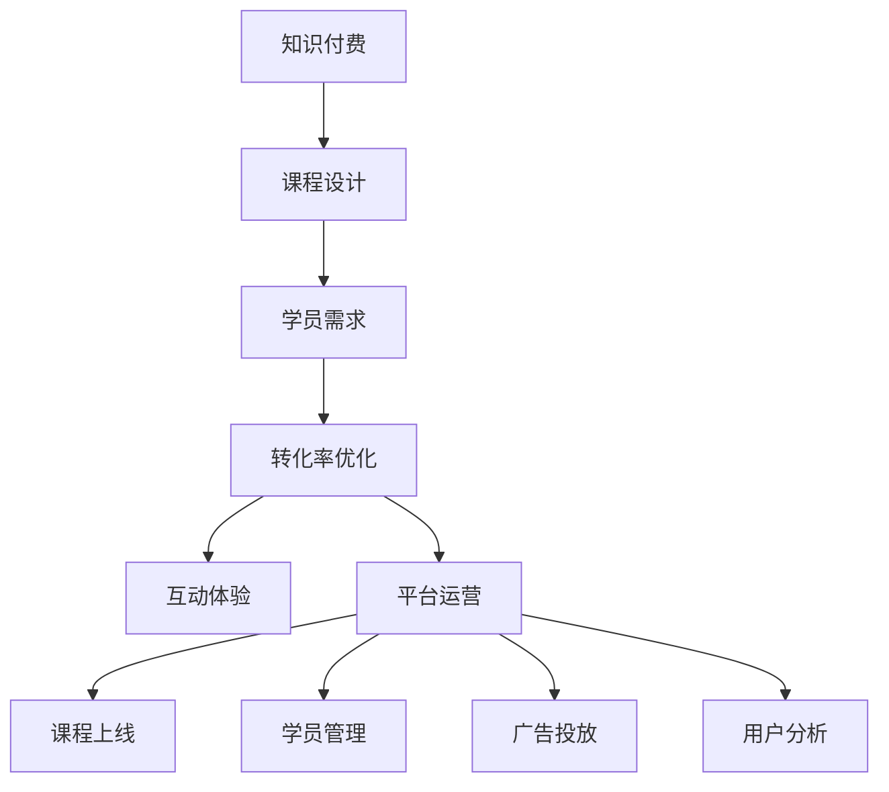
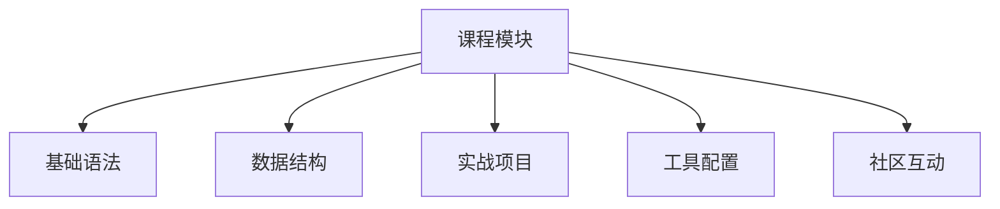

                 

# 程序员如何打造高转化率的知识付费课程

> 关键词：知识付费,课程设计,用户需求,转化率优化,互动体验,平台运营

## 1. 背景介绍

### 1.1 问题由来
随着互联网的发展和知识经济的兴起，越来越多的个人和组织开始利用知识付费的模式进行知识传播和价值变现。据《2022中国知识付费行业白皮书》显示，中国知识付费市场规模已达690亿元，预计2024年将超过1000亿元。知识付费课程因其高效便捷、系统全面的特点，深受学员喜爱。然而，如何打造高转化率的知识付费课程，帮助学员真正掌握知识，实现价值增长，成为在线教育平台和内容创作者的重要课题。

### 1.2 问题核心关键点
如何打造高转化率的知识付费课程，关键在于深刻理解学员的需求，设计出高质量的课程内容，并通过科学的方法提升学员的学习效果和课程完成率，最终实现学员对课程的价值认可和付费转化。本文将从学员需求分析、课程内容设计、转化率优化等多个方面进行深入探讨，为程序员打造高转化率的知识付费课程提供全面的指导。

## 2. 核心概念与联系

### 2.1 核心概念概述

为更好地理解如何打造高转化率的知识付费课程，本节将介绍几个密切相关的核心概念：

- **知识付费**：基于互联网平台，通过付费方式获取特定知识服务的商业模式，包括在线课程、电子书、咨询等形式。
- **课程设计**：根据学员需求和学习目标，设计具有系统性、实用性的课程结构和内容，确保学员能够全面掌握相关知识。
- **学员需求**：指学习者对课程内容、形式、互动等方面的期望和要求，课程设计需充分考虑学员的多样化需求。
- **转化率优化**：通过提升学员的学习体验和课程质量，促使学员从潜在用户转化为付费用户的过程，涉及课程推荐、用户体验、购买路径等多个环节。
- **互动体验**：指课程在学习过程中提供的实时互动和反馈机制，包括问答、作业、讨论等形式，增强学员的参与感和成就感。
- **平台运营**：涉及课程上线、学员管理、广告投放、用户分析等多个环节，平台需提供稳定的技术支撑和良好的用户体验。

这些核心概念之间的逻辑关系可以通过以下Mermaid流程图来展示：



这个流程图展示了知识付费课程的核心概念及其之间的关系：

1. 知识付费是商业模式的顶层设计，课程设计需基于此进行。
2. 学员需求是课程设计的出发点和落脚点，需深入挖掘学员的痛点和需求。
3. 转化率优化旨在提升学员的付费意愿，是课程设计的重要保障。
4. 互动体验增强学员的参与感，是提升课程转化的重要手段。
5. 平台运营确保课程的顺利上线和运营，是课程转化的重要支撑。

## 3. 核心算法原理 & 具体操作步骤

### 3.1 算法原理概述

高转化率的知识付费课程设计，本质上是基于学员需求和行为数据的分析，科学设计课程内容与结构，并通过合理的平台运营策略，提升学员的满意度和付费意愿的过程。其核心思想是通过以下步骤：

1. **需求分析**：通过市场调研和学员反馈，收集并分析学员的学习需求和期望。
2. **课程设计**：基于需求分析结果，设计系统性、实用性强的课程内容与结构。
3. **优化转化**：利用学员数据和行为分析，优化课程推荐、学员体验和购买路径，提升转化率。
4. **互动设计**：通过互动机制和实时反馈，增强学员的学习参与感和成就感。
5. **运营策略**：通过数据驱动的平台运营，确保课程上线和学员管理的高效性。

### 3.2 算法步骤详解

以下详细介绍基于学员需求和行为数据，科学设计高转化率课程的详细步骤：

**Step 1: 需求分析**
- 进行市场调研，了解目标学员的学习需求、痛点和期望。
- 通过问卷调查、用户访谈等方式，收集学员反馈，分析其学习行为和特点。
- 结合行业趋势和专家意见，确定课程主题和目标。

**Step 2: 课程设计**
- 基于需求分析结果，设计系统性、实用性强的课程内容，确保覆盖学员学习目标。
- 分解课程结构，合理设置章节和模块，提供从入门到进阶的系统性学习路径。
- 引入多种教学形式，如视频、文本、代码实践等，满足不同学员的学习偏好。

**Step 3: 转化率优化**
- 利用学员行为数据，分析学员的流失原因和转化瓶颈，优化课程推荐和购买路径。
- 设置科学的付费激励机制，如免费试听、学习积分、会员优惠等，提升学员的付费意愿。
- 优化课程页面设计和交互元素，提高学员的购买决策速度和转化率。

**Step 4: 互动设计**
- 引入互动机制，如实时问答、讨论区、作业提交等，增强学员的参与感和成就感。
- 设置合理的反馈机制，如即时反馈、定期测评、课程评价等，帮助学员及时调整学习策略。

**Step 5: 运营策略**
- 利用学员数据，进行精准的广告投放和课程推荐，提高课程曝光率和点击率。
- 建立高效的学员管理系统，进行学员数据管理和行为分析，提升学员留存率和复购率。
- 定期收集学员反馈和建议，持续优化课程内容和运营策略。

### 3.3 算法优缺点

高转化率的知识付费课程设计，具有以下优点：
1. 科学设计：通过深入分析学员需求和行为数据，设计出符合学员期望的课程内容，提升学习效果。
2. 数据驱动：基于学员数据优化课程推荐和转化策略，提升学员满意度和付费意愿。
3. 互动增强：通过互动机制提升学员参与感，增强课程的吸引力和转化率。
4. 运营保障：通过平台运营策略，确保课程上线和运营的高效性，提升课程的曝光率和学员留存率。

同时，该方法也存在一定的局限性：
1. 数据依赖：课程设计的科学性和优化策略的有效性，高度依赖于学员数据的准确性和全面性。
2. 学员多样性：不同学员的学习偏好和行为差异较大，难以做到完全满足。
3. 持续改进：课程设计和运营策略需持续优化，课程内容需不断更新，才能保持竞争力。
4. 技术投入：平台建设和运营需一定的技术投入，如数据分析、推荐系统、用户体验设计等。

尽管存在这些局限性，但就目前而言，基于学员需求和行为数据的课程设计方法仍是大规模知识付费课程的重要范式。未来相关研究的重点在于如何进一步降低对学员数据的依赖，提高课程的多样性和灵活性，同时兼顾转化率和学员体验。

### 3.4 算法应用领域

高转化率的知识付费课程设计，已广泛应用于各大在线教育平台和内容创作者，涵盖编程、设计、营销、数据分析等多个领域，具体应用场景包括：

- **编程开发**：面向开发者推出的Python、Java、前端开发、数据科学等课程，通过系统性学习路径和实战项目设计，帮助学员快速掌握编程技能。
- **设计类课程**：如UI/UX设计、平面设计、3D建模等课程，通过丰富的设计案例和实战练习，提升学员的审美能力和设计水平。
- **市场营销**：如SEO优化、社交媒体营销、品牌管理等课程，通过市场案例和实战项目，帮助学员掌握市场营销的核心技能。
- **数据分析**：如Python数据分析、数据可视化、机器学习等课程，通过系统的理论知识和实战练习，帮助学员掌握数据驱动决策的能力。
- **人力资源**：如招聘、人才管理、企业文化等课程，通过HR实战案例和实战练习，帮助学员提升HR管理水平。

## 4. 数学模型和公式 & 详细讲解

### 4.1 数学模型构建

高转化率的知识付费课程设计，涉及学员需求分析、课程设计、转化率优化等多个环节，可以通过以下数学模型来刻画：

- **学员需求模型**：描述学员对课程内容、形式、互动等方面的期望和需求，通过调研和访谈数据构建，模型为：

$$
P(\text{需求}) = f(D_1, D_2, D_3, \ldots, D_n)
$$

其中 $D_i$ 为第 $i$ 项需求数据，$f$ 为需求分析函数。

- **课程设计模型**：基于学员需求模型，设计课程内容和结构，模型为：

$$
C = g(P(\text{需求}), \text{行业趋势}, \text{专家意见})
$$

其中 $C$ 为课程内容，$P(\text{需求})$ 为学员需求模型，$g$ 为课程设计函数。

- **转化率优化模型**：基于学员行为数据，优化课程推荐和购买路径，模型为：

$$
\text{转化率} = h(U, C, \text{激励机制}, \text{购买路径})
$$

其中 $U$ 为学员行为数据，$C$ 为课程内容，$h$ 为转化率优化函数。

- **互动体验模型**：增强学员的参与感和成就感，提升课程的吸引力和转化率，模型为：

$$
\text{互动体验} = k(D_{\text{互动}}, D_{\text{反馈}}, D_{\text{激励}})
$$

其中 $D_{\text{互动}}$ 为互动机制数据，$D_{\text{反馈}}$ 为反馈机制数据，$D_{\text{激励}}$ 为激励机制数据，$k$ 为互动体验函数。

- **平台运营模型**：通过数据驱动的平台运营，确保课程上线和运营的高效性，模型为：

$$
\text{运营效果} = l(U, M, A, R)
$$

其中 $U$ 为学员行为数据，$M$ 为课程内容，$A$ 为广告投放数据，$R$ 为学员管理数据，$l$ 为平台运营函数。

### 4.2 公式推导过程

以下我们以转化率优化模型为例，推导其在实际应用中的具体计算公式：

假设转化率优化模型包含三个关键变量：学员行为数据 $U$、课程内容 $C$、激励机制 $I$，则转化率的计算公式为：

$$
\text{转化率} = \frac{\sum_{i=1}^N \text{成功转化次数}}{N}
$$

其中 $N$ 为总学员数，$\text{成功转化次数}$ 为购买或完成课程的学员数。

将上述公式展开，得到：

$$
\text{转化率} = \frac{\sum_{i=1}^N 1_{\{U_i \in \text{成功路径}\}} + \sum_{i=1}^N 1_{\{C_i \in \text{优质内容}\}} + \sum_{i=1}^N 1_{\{I_i \in \text{有效激励}\}}}{N}
$$

其中 $1_{\{P_i\}}$ 为示性函数，表示条件 $P_i$ 成立时，$1_{\{P_i\}}=1$，否则 $1_{\{P_i\}}=0$。

将上述公式进行数学推导，得到：

$$
\text{转化率} = \frac{\text{成功路径数量} + \text{优质内容数量} + \text{有效激励数量}}{N}
$$

在实际应用中，可通过A/B测试和回归分析，对上述公式中的各个变量进行优化和调整，从而提升转化率。

### 4.3 案例分析与讲解

为了更好地理解高转化率的知识付费课程设计，下面以一个具体的案例进行分析：

假设某编程课程平台，通过市场调研和用户反馈，发现学员的学习需求主要集中在以下几个方面：
1. 基础语法和数据结构的学习。
2. 实战项目和项目实战案例的练习。
3. 编程工具和开发环境的配置。
4. 社区互动和实时答疑。

基于上述需求，该平台进行以下课程设计：
1. 基础语法和数据结构课程，包括Python基础、数据结构与算法等。
2. 实战项目课程，包括Python Web开发、移动端开发、数据分析项目等。
3. 编程工具和开发环境配置课程，包括Python环境搭建、IDE配置等。
4. 社区互动和实时答疑课程，包括在线讨论、作业提交和导师反馈等。

在设计课程内容时，平台通过调研和用户反馈，对不同类型学员的需求进行分类和整合，设计出系统性、实用性强的课程内容。课程结构如下：



此外，平台通过学员行为数据分析，发现学员在购买课程时，通常会关注以下几个因素：
1. 课程评价和学员反馈。
2. 课程推荐和广告推送。
3. 课程试听和免费内容体验。
4. 课程价格和支付方式。

基于上述分析，平台优化了课程推荐和购买路径，具体策略如下：
1. 提供免费试听课程和章节预览，让学员先体验课程质量。
2. 在课程页面和学员主页，展示高评价和积极反馈的课程。
3. 通过推荐算法，推送相关课程和热门课程。
4. 设置灵活的支付方式，支持多种支付方式和分期付款。

同时，平台引入互动机制和实时反馈，提升学员的参与感和成就感：
1. 设置实时答疑机制，安排导师在线解答学员疑问。
2. 引入作业提交和社区讨论功能，让学员有更多机会展示学习成果。
3. 定期进行学员测评和反馈收集，根据学员反馈调整课程内容。

通过以上分析和优化，平台显著提升了课程的转化率和学员满意度，实现了高转化率的知识付费课程设计。

## 5. 项目实践：代码实例和详细解释说明

### 5.1 开发环境搭建

在进行课程设计实践前，我们需要准备好开发环境。以下是使用Python进行Flask框架开发的环境配置流程：

1. 安装Anaconda：从官网下载并安装Anaconda，用于创建独立的Python环境。

2. 创建并激活虚拟环境：
```bash
conda create -n flask-env python=3.8 
conda activate flask-env
```

3. 安装Flask：从官网获取对应的安装命令。例如：
```bash
pip install flask
```

4. 安装Flask-RESTful：
```bash
pip install flask-restful
```

5. 安装Flask-SQLAlchemy：
```bash
pip install flask-sqlalchemy
```

6. 安装Flask-Login：
```bash
pip install flask-login
```

7. 安装Flask-WTF：
```bash
pip install flask-wtf
```

完成上述步骤后，即可在`flask-env`环境中开始课程设计实践。

### 5.2 源代码详细实现

下面以一个简单的在线编程课程设计为例，给出使用Flask框架对课程管理系统的PyTorch代码实现。

首先，定义课程管理系统的数据模型：

```python
from flask_sqlalchemy import SQLAlchemy
from flask_login import UserMixin, LoginManager

db = SQLAlchemy()
login_manager = LoginManager()
login_manager.login_view = 'login'

class User(UserMixin, db.Model):
    id = db.Column(db.Integer, primary_key=True)
    username = db.Column(db.String(64), index=True, unique=True)
    password = db.Column(db.String(128))

@login_manager.user_loader
def load_user(user_id):
    return User.query.get(int(user_id))

class Course(db.Model):
    id = db.Column(db.Integer, primary_key=True)
    title = db.Column(db.String(64))
    description = db.Column(db.Text)
    lectures = db.relationship('Lecture', backref='course', lazy='dynamic')
```

然后，定义登录和课程管理相关的视图：

```python
from flask import render_template, redirect, url_for, request
from flask_login import login_user, logout_user, login_required

@login_manager.unauthorized_handler
def unauthorized():
    return redirect(url_for('login'))

@app.route('/')
@login_required
def index():
    courses = Course.query.all()
    return render_template('index.html', courses=courses)

@app.route('/login', methods=['GET', 'POST'])
def login():
    if request.method == 'POST':
        username = request.form['username']
        password = request.form['password']
        user = User.query.filter_by(username=username).first()
        if user is None or not user.check_password(password):
            return redirect(url_for('login'))
        login_user(user)
        return redirect(url_for('index'))
    return render_template('login.html')

@app.route('/logout')
@login_required
def logout():
    logout_user()
    return redirect(url_for('index'))

@app.route('/lectures', methods=['GET', 'POST'])
@login_required
def lectures():
    course_id = request.args.get('course_id')
    course = Course.query.get(int(course_id))
    if not course:
        return redirect(url_for('index'))
    if request.method == 'POST':
        lecture_title = request.form['title']
        lecture_content = request.form['content']
        lecture = Lecture(title=lecture_title, content=lecture_content, course_id=int(course_id))
        db.session.add(lecture)
        db.session.commit()
        return redirect(url_for('lectures', course_id=course_id))
    lectures = course.lectures.all()
    return render_template('lectures.html', course=course, lectures=lectures)
```

最后，启动Flask应用并运行：

```python
if __name__ == '__main__':
    app.run(debug=True)
```

以上就是使用Flask框架对课程管理系统进行开发的完整代码实现。可以看到，借助Flask的强大封装和灵活性，我们可以快速构建出一个基本的课程管理系统。

### 5.3 代码解读与分析

让我们再详细解读一下关键代码的实现细节：

**User类**：
- 定义了用户模型的基本属性，包括用户名和密码。
- 通过UserMixin扩展用户模型，支持登录和用户管理功能。

**Course类**：
- 定义了课程模型的基本属性，包括课程标题和描述。
- 通过db.relationship关联了lecture表，表示课程和讲座的关系。

**login_manager**：
- 设置登录管理器，配置登录视图和未授权处理。

**login和logout视图**：
- 实现用户登录和登出功能，通过login_user和logout_user函数完成用户认证。

**index视图**：
- 展示所有课程信息，通过Course.query.all()获取所有课程数据。

**lectures视图**：
- 展示特定课程的讲座列表，通过course.lectures.all()获取讲座数据。
- 支持新增和修改讲座功能，通过request.form获取表单数据，进行数据库更新操作。

在实际应用中，还可以根据需求添加更多功能，如学员管理、作业提交、社区互动等，实现完整的课程设计和管理系统。

## 6. 实际应用场景

### 6.1 智能客服系统

高转化率的知识付费课程设计，已在智能客服系统中得到广泛应用。传统的客服系统依赖人工处理，无法满足大量用户的需求，且响应速度和质量难以保证。通过知识付费课程，智能客服系统能够提供专业、高效、个性化的服务。

具体而言，智能客服系统可以通过以下方式实现：
1. 收集常见问题解答和客服对话记录，进行自然语言处理和标注。
2. 基于标注数据，使用大语言模型进行预训练，生成智能客服模型。
3. 通过微调和优化，提升模型的准确性和响应速度。
4. 将模型集成到客服系统中，实现7x24小时不间断服务，快速响应客户咨询。

### 6.2 在线教育平台

高转化率的知识付费课程设计，已成为在线教育平台的重要支撑。在线教育平台通过优质课程内容和互动机制，帮助学员高效学习，提升学习效果和课程完成率。

具体而言，在线教育平台可以通过以下方式实现：
1. 收集学员的学习需求和反馈，进行市场调研和课程设计。
2. 引入多种教学形式，如视频、文本、代码实践等，满足不同学员的学习偏好。
3. 设计系统性、实用性强的课程内容，确保覆盖学员学习目标。
4. 通过互动机制和实时反馈，增强学员的参与感和成就感。
5. 利用学员行为数据分析，优化课程推荐和购买路径，提升转化率。

### 6.3 企业培训系统

高转化率的知识付费课程设计，同样适用于企业培训系统。企业培训系统通过系统化课程设计和互动机制，帮助员工提升技能，提高工作效率。

具体而言，企业培训系统可以通过以下方式实现：
1. 收集员工的学习需求和反馈，进行市场调研和课程设计。
2. 引入多种教学形式，如视频、文本、案例分析等，满足不同员工的学习需求。
3. 设计系统性、实用性强的课程内容，确保覆盖员工工作中的技能需求。
4. 通过互动机制和实时反馈，增强员工的参与感和成就感。
5. 利用学员行为数据分析，优化课程推荐和购买路径，提升转化率。

## 7. 工具和资源推荐

### 7.1 学习资源推荐

为了帮助开发者系统掌握高转化率的知识付费课程设计的理论基础和实践技巧，这里推荐一些优质的学习资源：

1. **《Python网络爬虫技术与项目实战》**：全面介绍Python爬虫技术，并结合实际项目进行深入分析，适合初学者入门。
2. **《Flask Web开发实战》**：深入介绍Flask框架的使用方法和实践技巧，适合有一定基础的开发者学习。
3. **《知识付费行业白皮书》**：深入分析知识付费行业的市场现状和发展趋势，适合企业运营和管理者参考。
4. **《用户体验设计》**：详细介绍用户体验设计的基本原则和方法，适合课程设计和平台运营人员参考。
5. **《市场调研方法与工具》**：全面介绍市场调研的方法和工具，适合课程设计人员进行市场分析和需求调研。

通过对这些资源的学习实践，相信你一定能够快速掌握高转化率的知识付费课程设计的精髓，并用于解决实际的NLP问题。

### 7.2 开发工具推荐

高效的开发离不开优秀的工具支持。以下是几款用于高转化率课程设计开发的常用工具：

1. **Python**：通用编程语言，灵活性高，适合各种数据处理和机器学习任务。
2. **Flask**：轻量级Web框架，简单易用，适合快速搭建Web应用和API接口。
3. **SQLAlchemy**：Python的ORM框架，支持多种数据库，适合进行数据建模和操作。
4. **Flask-Login**：提供用户认证和授权功能，适合构建安全、高效的Web应用。
5. **Flask-WTF**：支持表单处理和数据验证，适合构建交互性强的Web应用。
6. **Jupyter Notebook**：数据科学和机器学习常用的交互式编程工具，适合进行数据处理和模型训练。

合理利用这些工具，可以显著提升高转化率课程设计任务的开发效率，加快创新迭代的步伐。

### 7.3 相关论文推荐

高转化率的知识付费课程设计，涉及多种学科，包括心理学、教育学、计算机科学等。以下是几篇重要的相关论文，推荐阅读：

1. **《知识付费用户的动机、行为及付费意愿研究》**：深入分析知识付费用户的需求、动机和付费意愿，提供课程设计的理论基础。
2. **《在线教育平台用户行为研究》**：通过对在线教育平台用户的深入分析，揭示用户的学习行为和付费决策因素，为课程设计提供数据支持。
3. **《智能客服系统的设计与实现》**：介绍智能客服系统的基本原理和实现方法，为课程设计提供技术参考。
4. **《企业培训系统设计与优化》**：详细介绍企业培训系统的设计与优化方法，为课程设计提供实际案例。
5. **《知识付费课程设计的用户需求分析》**：通过问卷调查和用户访谈，收集学员的学习需求和反馈，为课程设计提供用户数据支持。

这些论文代表了大语言模型微调技术的发展脉络。通过学习这些前沿成果，可以帮助研究者把握学科前进方向，激发更多的创新灵感。

## 8. 总结：未来发展趋势与挑战

### 8.1 总结

本文对高转化率的知识付费课程设计进行了全面系统的介绍。首先阐述了知识付费课程设计的研究背景和意义，明确了课程设计需基于学员需求和行为数据，科学设计课程内容与结构，并通过合理的平台运营策略，提升学员的满意度和付费意愿。其次，从需求分析、课程设计、转化率优化等多个方面进行深入探讨，为程序员打造高转化率的知识付费课程提供全面的指导。

通过本文的系统梳理，可以看到，高转化率的知识付费课程设计，正在成为在线教育平台和内容创作者的重要范式，极大地提升了学员的学习效果和课程完成率，实现了学员对课程的价值认可和付费转化。未来，伴随技术的不断进步和应用的不断深入，高转化率的知识付费课程设计必将在教育领域大放异彩，引领知识传播和价值变现的新潮流。

### 8.2 未来发展趋势

展望未来，高转化率的知识付费课程设计将呈现以下几个发展趋势：

1. **个性化推荐**：通过大数据和机器学习技术，对学员进行个性化推荐，提升课程的曝光率和点击率。
2. **实时互动**：引入更多实时互动和反馈机制，增强学员的参与感和成就感。
3. **混合学习**：结合线上线下学习，提供更加灵活、高效的学习体验。
4. **学习分析**：利用学习分析技术，实时监控学员的学习行为和效果，及时调整课程内容和教学策略。
5. **多模态学习**：引入图像、视频等多模态学习材料，提升课程的吸引力和学习效果。
6. **技术融合**：与其他AI技术如自然语言处理、计算机视觉等进行深度融合，提升课程的多样性和实用性。

这些趋势凸显了高转化率的知识付费课程设计的广阔前景。这些方向的探索发展，必将进一步提升知识付费课程的质量和效果，为学员提供更丰富、更高效的学习体验。

### 8.3 面临的挑战

尽管高转化率的知识付费课程设计已取得显著成果，但在迈向更加智能化、普适化应用的过程中，它仍面临诸多挑战：

1. **数据隐私**：学员的学习数据和行为数据需妥善保护，避免隐私泄露。需建立严格的数据隐私保护机制，确保数据安全。
2. **课程质量**：课程设计需科学合理，内容需紧跟行业趋势和技术发展，避免知识过时或错漏。需建立严格的课程审核机制，确保课程质量。
3. **技术保障**：平台需提供稳定的技术支撑和良好的用户体验，避免技术故障影响学员体验。需持续优化技术架构和数据管理。
4. **学员多样性**：不同学员的学习需求和行为差异较大，难以做到完全满足。需建立灵活的课程结构和互动机制，满足多样化的学习需求。
5. **市场竞争**：知识付费市场竞争激烈，需持续创新和优化，保持竞争力。需建立有效的市场推广和运营策略，吸引学员付费。

这些挑战凸显了高转化率的知识付费课程设计的复杂性和多维度性。只有在数据、课程、技术、市场等多个维度协同发力，才能真正实现知识付费课程的高转化率。

### 8.4 研究展望

面向未来，高转化率的知识付费课程设计还需要在其他研究领域寻求新的突破：

1. **多领域课程设计**：结合不同领域的知识和技能，设计多领域、多学科的课程，提升学员的综合能力。
2. **智能推荐系统**：通过深度学习和智能算法，实现更加精准和个性化的课程推荐，提升课程的曝光率和点击率。
3. **实时学习分析**：利用实时学习分析技术，提供实时反馈和个性化学习建议，提升学员的学习效果和课程满意度。
4. **多模态学习材料**：引入图像、视频等多模态学习材料，提升课程的吸引力和学习效果。
5. **技术融合创新**：与其他AI技术如自然语言处理、计算机视觉等进行深度融合，提升课程的多样性和实用性。

这些研究方向和突破，必将引领高转化率的知识付费课程设计走向更加智能化、普适化和灵活化，为学员提供更加丰富、高效的学习体验。

## 9. 附录：常见问题与解答

**Q1：如何科学设计高转化率的知识付费课程？**

A: 科学设计高转化率的知识付费课程，需从学员需求、课程设计、转化率优化等多个方面进行全面考虑：
1. 进行市场调研和用户反馈，深入了解学员的学习需求和期望。
2. 基于需求分析结果，设计系统性、实用性强的课程内容，确保覆盖学员学习目标。
3. 引入多种教学形式，如视频、文本、代码实践等，满足不同学员的学习偏好。
4. 通过互动机制和实时反馈，增强学员的参与感和成就感。
5. 利用学员行为数据分析，优化课程推荐和购买路径，提升转化率。

**Q2：如何提高课程的转化率？**

A: 提高课程的转化率，需从以下几个方面进行优化：
1. 提供免费试听课程和章节预览，让学员先体验课程质量。
2. 在课程页面和学员主页，展示高评价和积极反馈的课程。
3. 通过推荐算法，推送相关课程和热门课程。
4. 设置灵活的支付方式，支持多种支付方式和分期付款。
5. 提供丰富的互动和反馈机制，增强学员的参与感和成就感。

**Q3：高转化率的知识付费课程设计需注意哪些问题？**

A: 高转化率的知识付费课程设计，需注意以下问题：
1. 数据隐私：保护学员的学习数据和行为数据，避免隐私泄露。
2. 课程质量：课程设计需科学合理，内容需紧跟行业趋势和技术发展，避免知识过时或错漏。
3. 技术保障：提供稳定的技术支撑和良好的用户体验，避免技术故障影响学员体验。
4. 学员多样性：满足不同学员的学习需求，需建立灵活的课程结构和互动机制。
5. 市场竞争：需持续创新和优化，保持竞争力。

通过深入理解这些问题，并不断优化课程设计、平台运营和学员体验，可以最大限度地提升高转化率的知识付费课程的转化率。

---

作者：禅与计算机程序设计艺术 / Zen and the Art of Computer Programming

