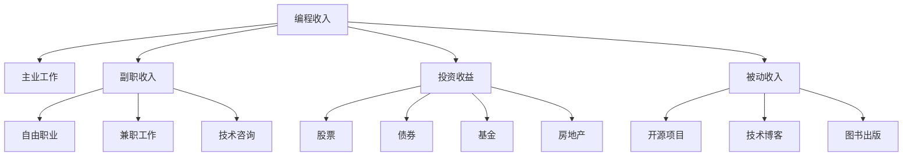

                 

# 程序员如何构建多元化收入结构

> 关键词：编程收入、副职收入、投资收益、被动收入、多样化盈利

## 1. 背景介绍

随着科技行业的迅猛发展，程序员的收入水平和社会地位有了显著提升，但这也带来了新的挑战：如何在保持技术专长和创新活力的同时，构建可持续的多元化收入结构，以应对未来可能出现的职业风险。本文将探讨如何通过编程收入、副职收入、投资收益和被动收入等多种途径，帮助程序员构建多元化的收入结构，从而实现职业稳定性和财务自由的双重目标。

## 2. 核心概念与联系

### 2.1 核心概念概述

为更好地理解构建多元化收入结构的方法，本节将介绍几个核心概念及其相互联系：

- **编程收入**：即程序员通过主业工作所获得的主要收入来源，通常包括薪资、奖金、股权激励等。
- **副职收入**：指程序员利用业余时间从事其他工作或项目，如自由职业、兼职工作、技术咨询等，以增加额外收入。
- **投资收益**：程序员通过投资股票、债券、基金、房地产等多种资产，获得的资本增值和收益。
- **被动收入**：程序员通过构建一次性付出但长期自动带来收入的项目或工具，如开源项目、技术博客、图书出版等，获得的持续性收入。

这些概念之间的联系紧密，程序员可以通过不同组合的方式，构建自己的多元化收入结构，实现财务自由的理想状态。

### 2.2 核心概念原理和架构的 Mermaid 流程图



这个流程图展示了程序员的多元化收入结构构建框架，不同收入来源之间相互独立又相互补充，共同构建一个多层次、多渠道的收入体系。

## 3. 核心算法原理 & 具体操作步骤

### 3.1 算法原理概述

构建多元化收入结构的算法原理，本质上是通过组合优化和风险管理，最大化不同收入来源的预期收益，同时控制其风险。算法目标是在给定的资源和时间约束下，选择最优的收入组合方案，以实现财务目标的最大化。

### 3.2 算法步骤详解

构建多元化收入结构的步骤通常包括以下几个关键环节：

1. **目标设定**：根据个人财务需求和职业规划，设定收入和财务自由的具体目标。
2. **资源评估**：评估自身的时间和财务资源，包括主业工作的稳定性和收入潜力，业余时间的可利用程度，以及投资和资产的现有状况。
3. **市场调研**：研究不同收入来源的市场需求、竞争态势和盈利模式，选择适合自己的收入项目和投资标的。
4. **策略制定**：根据目标、资源和市场调研结果，制定具体的收入策略和投资计划。
5. **执行与监控**：按照制定的策略执行各种收入和投资活动，同时定期监控其进展和效果，及时调整优化。
6. **风险管理**：对不同收入和投资活动进行风险评估和管理，确保风险可控。

### 3.3 算法优缺点

构建多元化收入结构的算法具有以下优点：

- **分散风险**：通过多元化投资和收入来源，可以有效分散职业变动、市场波动等带来的风险。
- **提升财务自由度**：多渠道的收入来源有助于在短期内实现财务稳定，长期内实现财务自由。
- **增强职业稳定性**：多元化的收入结构可以在主业工作不稳定时提供额外的财务支持，确保生活质量不受到重大影响。

同时，该方法也存在以下缺点：

- **复杂度高**：构建和维护多元化的收入结构需要较高的专业技能和时间投入。
- **资源需求**：需要有足够的资金、时间和精力进行市场调研和策略执行。
- **市场波动**：市场的不确定性可能会对某些收入来源产生负面影响。

### 3.4 算法应用领域

构建多元化收入结构的算法不仅适用于技术领域的程序员，同样适用于各行各业的职场人士。无论是在金融、医疗、教育还是其他行业，通过合理规划和策略执行，都可以实现财务稳定和职业发展的双重目标。

## 4. 数学模型和公式 & 详细讲解 & 举例说明

### 4.1 数学模型构建

假设程序员有 $T$ 年的时间资源，其中 $t_1$ 年用于主业工作（编程收入），$t_2$ 年用于其他收入来源（副职收入、投资收益、被动收入）。设主业工作的年薪资为 $S$，其他收入来源的预期年收益为 $R_1, R_2, R_3$，其中 $R_2$ 包括副职收入，$R_3$ 包括投资收益，$R_3$ 包括被动收入。设目标年收益为 $F$。

目标函数为：
$$
\max F = S t_1 + R_1 t_2 + R_2 t_2 + R_3 t_3
$$
约束条件为：
$$
t_1 + t_2 + t_3 = T
$$

### 4.2 公式推导过程

通过线性规划方法，求解上述优化问题。设 $x_1 = t_1, x_2 = t_2, x_3 = t_3$，则目标函数和约束条件可表示为：
$$
\max F = S x_1 + R_1 x_2 + R_2 x_2 + R_3 x_3
$$
$$
x_1 + x_2 + x_3 = T
$$

引入变量 $y_1, y_2, y_3$ 分别表示 $x_1, x_2, x_3$ 的上界，则有：
$$
x_1 = y_1, x_2 = y_2, x_3 = y_3
$$

将 $x_1, x_2, x_3$ 替换为 $y_1, y_2, y_3$，目标函数变为：
$$
\max F = S y_1 + R_1 y_2 + R_2 y_2 + R_3 y_3
$$
$$
y_1 + y_2 + y_3 = T
$$

令 $y = (y_1, y_2, y_3)$，则目标函数和约束条件可表示为：
$$
\max F = \begin{bmatrix} S & R_1 & R_2 & R_3 \end{bmatrix} y
$$
$$
\begin{bmatrix} 1 & 1 & 1 \end{bmatrix} y = T
$$

通过求解上述线性规划问题，可得到最优的收入策略 $y$。

### 4.3 案例分析与讲解

假设程序员 John 有以下资源和目标：

- 当前主业工作年薪资为 $100,000$。
- 预计有 $10$ 年的时间资源，其中 $5$ 年用于主业工作，剩余 $5$ 年用于其他收入来源。
- 目标年收益为 $300,000$。
- 其他收入来源的预期年收益为：副职收入 $R_1 = 50,000$，投资收益 $R_2 = 100,000$，被动收入 $R_3 = 150,000$。

根据公式推导，建立线性规划模型：
$$
\max 100,000y_1 + 50,000y_2 + 100,000y_2 + 150,000y_3
$$
$$
1y_1 + 1y_2 + 1y_3 = 10
$$

通过求解线性规划问题，可得最优解 $y = (3, 1.5, 4.5)$，即：

- 在 $5$ 年内，John 将有 $3$ 年用于主业工作，获得 $300,000$ 的收入。
- 在 $1.5$ 年内，John 将从事副职工作，获得 $75,000$ 的收入。
- 在 $4.5$ 年内，John 将进行投资和被动收入，获得 $250,000$ 的收入。

该方案能够最大化实现 John 的财务目标，同时分散了主业工作的不确定性风险。

## 5. 项目实践：代码实例和详细解释说明

### 5.1 开发环境搭建

构建多元化收入结构需要综合考虑多种因素，包括编程技能、投资知识、市场调研等。因此，搭建一个高效、灵活的开发环境至关重要。以下是一个基本的搭建步骤：

1. **编程环境**：使用 Python 和 Jupyter Notebook 搭建开发环境，利用 Pandas、NumPy、SciPy 等库进行数据分析和建模。
2. **投资环境**：使用 Alpaca、Interactive Brokers 等平台进行股票和基金交易。
3. **市场调研环境**：使用 Google Trends、Alpha Vantage 等工具进行市场调研。

### 5.2 源代码详细实现

下面以投资收益为例，展示如何使用 Python 和 Pandas 进行股票投资的计算。

```python
import pandas as pd
import numpy as np
import matplotlib.pyplot as plt

# 读取历史股价数据
df = pd.read_csv('stock_prices.csv')

# 计算年化收益率
returns = np.log(df['price'] / df['price'].shift(1))
annual_return = np.mean(returns) * np.sqrt(252)

# 计算波动率
volatility = np.std(returns)

# 计算夏普比率
risk_free_rate = 0.01
sharpe_ratio = (annual_return - risk_free_rate) / volatility

print(f"Yearly Return: {annual_return:.2%}")
print(f"Volatility: {volatility:.2%}")
print(f"Sharpe Ratio: {sharpe_ratio:.2}")
```

通过上述代码，可以计算出历史股价的年化收益率、波动率和夏普比率，作为投资决策的参考指标。

### 5.3 代码解读与分析

以上代码使用了 Pandas 和 NumPy 进行数据处理和计算，展示了如何通过历史股价数据计算投资回报率、波动率和夏普比率。在实际应用中，这些指标可以帮助程序员进行投资决策，选择合适的投资标的。

## 6. 实际应用场景

### 6.1 职业转型

许多程序员面临职业转型的挑战，如何通过多元化收入结构平滑过渡到新的职业领域，是关键问题。通过副职收入和投资收益，程序员可以在保持主业稳定的同时，探索新的职业机会，实现职业转型。

例如，一位软件工程师可以利用业余时间学习人工智能技术，并通过技术咨询、自由职业等方式逐步积累新领域的知识和经验。同时，通过投资收益，获取额外的资金支持，加速职业转型的进程。

### 6.2 应对职业风险

程序员的职业稳定性受到多种因素的影响，如技术变革、市场波动、公司战略调整等。通过多元化收入结构，可以有效应对这些职业风险，确保财务稳定。

例如，一位在科技公司工作的程序员，可以同时在多个公司进行兼职，获取更多的编程收入。同时，通过投资房地产等低风险资产，保障财务安全。

### 6.3 财务自由

财务自由是程序员追求的终极目标。通过多元化收入结构，可以实现短期内积累资本，长期内获得稳定收益，最终实现财务自由。

例如，一位资深软件开发者通过主业收入、投资收益和被动收入，逐步积累资本，并最终通过技术博客、图书出版等被动收入实现财务自由，不再依赖主业工作。

## 7. 工具和资源推荐

### 7.1 学习资源推荐

为了帮助程序员构建多元化收入结构，以下是几组推荐的资源：

1. **《程序员的财务自由之路》**：详细介绍了程序员如何通过主业、副业、投资和被动收入等多种途径实现财务自由。
2. **《Python金融编程》**：介绍了如何使用 Python 进行金融数据分析和投资建模，适合程序员自学投资收益部分。
3. **《智能投顾实战》**：讲解了智能投顾技术的原理和实现方法，适合程序员进行投资策略优化。

### 7.2 开发工具推荐

1. **PyCharm**：高效、强大的 Python 开发工具，支持数据分析、建模等任务。
2. **Alpha Vantage**：提供实时和历史市场数据，支持多种编程语言的 API。
3. **Alpaca**：提供股票、加密货币等交易平台，支持 Python 接口。

### 7.3 相关论文推荐

构建多元化收入结构的理论基础主要来源于金融学和经济学。以下是几篇相关的经典论文：

1. **《A Theory of Rational Expectations》**：罗伯特·C. 卢卡斯（Robert C. Lucas），研究了市场预期和信息不对称对资产价格的影响。
2. **《资产定价模型：理论与应用》**：约翰·H. 坎贝尔（John H. Campbell）和理查德·G. 米勒（Richard G. Miller），介绍了资产定价模型及其应用。
3. **《多元化的投资组合》**：哈里·马科维茨（Harry Markowitz），提出了投资组合分散风险的优化方法。

## 8. 总结：未来发展趋势与挑战

### 8.1 研究成果总结

本文对构建多元化收入结构的方法进行了全面系统的介绍，包括编程收入、副职收入、投资收益和被动收入等核心概念及其联系。通过数学模型和案例分析，展示了如何通过策略制定和执行，实现财务目标的多元化。

### 8.2 未来发展趋势

展望未来，构建多元化收入结构将呈现以下几个发展趋势：

1. **自动化与智能化**：随着 AI 和机器学习技术的普及，自动化和智能化的投资和收入管理将变得更加普遍，提高效率和准确性。
2. **全球化与本地化结合**：全球化的金融市场为程序员提供了更广阔的投资机会，同时本地化策略也需考虑特定市场的特点和需求。
3. **可持续发展**：越来越多程序员关注环境保护和可持续发展，投资于清洁能源和绿色科技等领域的收入来源将逐渐增加。

### 8.3 面临的挑战

尽管构建多元化收入结构有诸多优势，但仍面临以下挑战：

1. **知识更新**：市场和技术的变化迅速，程序员需要不断学习新知识，以适应市场变化。
2. **时间管理**：多种收入来源和投资活动需要大量时间管理，如何平衡工作和生活将是重要课题。
3. **风险控制**：不同收入来源的风险管理需要综合考虑，如何在分散风险的同时获取最大收益。

### 8.4 研究展望

未来的研究需要在以下几个方面寻求新的突破：

1. **动态优化**：构建动态优化的收入和投资策略，适应市场变化。
2. **协同优化**：将多种收入来源和投资策略进行协同优化，实现整体收益的最大化。
3. **自动化与人工结合**：结合 AI 自动化与人工干预，提高决策的准确性和可解释性。

## 9. 附录：常见问题与解答

**Q1：构建多元化收入结构需要多长时间？**

A: 构建多元化收入结构需要时间和精力的投入，具体时间取决于个人的资源和目标。一般而言，需要数年甚至更长时间，逐步积累和优化不同收入来源。

**Q2：多元化收入结构是否可以完全代替主业收入？**

A: 多元化收入结构可以提供额外的收入来源，但难以完全替代主业收入。主业收入仍然是财务稳定的基础，多元化收入结构可以作为补充和保障。

**Q3：如何评估不同投资标的的风险？**

A: 评估投资标的的风险可以通过分析历史数据、财务指标、市场趋势等多种方式，具体方法包括计算夏普比率、波动率、最大回撤等指标，综合判断投资标的的风险水平。

**Q4：如何平衡工作与多元化收入活动？**

A: 合理的时间管理和优先级排序是平衡工作与多元化收入活动的关键。建议将时间分为多个阶段，逐步增加收入活动的时间和比例，确保生活质量不受影响。

通过深入探讨构建多元化收入结构的各个环节，本文希望能为程序员提供实用的指导，帮助他们在职业发展中更好地实现财务自由和职业稳定性。面对未来的挑战，保持学习与适应，将是我们不断前行的动力。

---

作者：禅与计算机程序设计艺术 / Zen and the Art of Computer Programming

