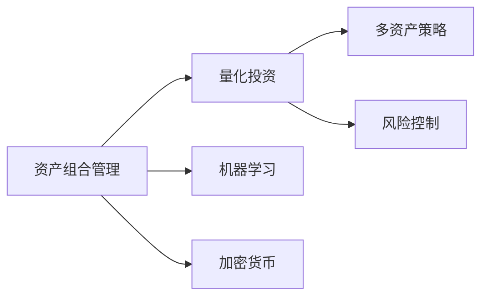

                 

# 程序员如何构建百万美元资产组合

## 1. 背景介绍

随着人工智能和计算机科学技术的飞速发展，程序员在构建资产组合方面的能力也在不断增强。从股票市场到区块链，再到加密货币，程序员可以通过编写代码，构建复杂的算法和策略，来管理和管理资产组合。但构建一个百万美元的资产组合不仅需要强大的技术能力，还需要对市场有深刻的理解，以及对风险的有效控制。本文将深入探讨程序员如何构建百万美元的资产组合，涉及概念、原理、具体操作步骤和未来展望等内容。

## 2. 核心概念与联系

### 2.1 核心概念概述

构建百万美元资产组合的核心概念包括：

- **资产组合管理**：通过投资不同的资产类别（如股票、债券、加密货币等）来分散风险，并寻求较高的投资回报。
- **量化投资**：利用数学和统计模型进行投资决策，以算法取代传统的决策。
- **机器学习**：使用算法来处理和分析大量数据，以预测市场趋势和优化投资组合。
- **加密货币**：一种使用区块链技术、去中心化处理的数字货币，如比特币和以太坊。
- **多资产策略**：同时投资于多种资产，以分散风险，降低投资组合的波动性。
- **风险控制**：通过风险模型和限制策略，管理投资组合的风险。

这些概念之间的联系可以用以下的Mermaid流程图表示：



这个流程图展示了构建资产组合的关键步骤和组成部分，以及它们之间的相互关系。

## 3. 核心算法原理 & 具体操作步骤
### 3.1 算法原理概述

构建百万美元资产组合的核心算法原理主要包括以下几点：

1. **资产分类与相关性分析**：确定资产之间的相关性，以便构建多资产策略，从而分散风险。
2. **风险评估与优化**：使用数学模型和统计方法，评估投资组合的风险，并优化投资策略以最小化风险。
3. **市场预测与交易策略**：利用机器学习和量化技术，预测市场趋势，并制定交易策略。
4. **加密货币策略**：开发针对加密货币市场的投资策略，利用其高波动性和潜在的高收益。

### 3.2 算法步骤详解

构建百万美元资产组合的详细步骤包括：

1. **数据收集与预处理**：收集市场数据和历史交易数据，清洗和标准化数据集。
2. **资产分类与相关性分析**：使用统计方法，如相关系数，计算不同资产之间的相关性。
3. **投资策略构建**：根据市场预测和风险评估结果，构建多资产策略，如均值-方差优化、风险平价等。
4. **交易策略实施**：根据投资策略，实施自动交易算法，实时调整投资组合。
5. **风险控制**：通过限制策略，如止损和限仓，控制投资组合的风险。
6. **性能评估与优化**：定期评估投资组合的性能，并根据评估结果优化策略。

### 3.3 算法优缺点

构建百万美元资产组合的算法具有以下优点和缺点：

**优点**：

1. **精确性**：使用数学模型和算法可以更精确地预测市场趋势和评估风险。
2. **自动化**：自动交易算法可以实时调整投资组合，优化投资策略。
3. **可扩展性**：可以轻松扩展投资组合，添加新的资产类别。

**缺点**：

1. **复杂性**：构建复杂的投资策略和自动交易算法需要高水平的技术能力。
2. **过拟合风险**：复杂的模型可能会过拟合历史数据，导致在现实市场中的表现不佳。
3. **成本高**：开发和维护高级算法和系统需要大量时间和资金投入。

### 3.4 算法应用领域

构建百万美元资产组合的算法广泛应用于以下领域：

- **对冲基金**：使用复杂的多资产策略和量化技术，进行高风险和高回报的投资。
- **资产管理公司**：构建自动化和数据驱动的投资策略，管理大型资产组合。
- **加密货币交易**：利用机器学习和量化技术，开发加密货币市场投资策略。
- **高频交易**：使用自动化交易算法，快速交易大量资产，获取微小价差利润。

## 4. 数学模型和公式 & 详细讲解 & 举例说明
### 4.1 数学模型构建

构建百万美元资产组合的数学模型主要包括以下几种：

1. **均值-方差模型**：用于优化投资组合的风险和回报。
2. **马科维茨模型**：通过最小化组合的方差，最大化组合的预期回报。
3. **风险平价模型**：通过设定风险比例，优化不同资产的风险分配。

### 4.2 公式推导过程

以马科维茨模型为例，其核心公式为：

$$
\max \ E(r) \\
\text{subject to} \\
W^T \Sigma W = \sigma^2
$$

其中，$E(r)$ 为投资组合的期望回报，$W$ 为资产权重，$\Sigma$ 为协方差矩阵，$\sigma^2$ 为目标方差。

### 4.3 案例分析与讲解

假设有一个包含两种资产（A和B）的投资组合，资产A的期望回报为10%，标准差为15%，资产B的期望回报为8%，标准差为10%。目标方差为100%。

使用马科维茨模型求解最优权重$W$：

1. 构建协方差矩阵：
$$
\Sigma = \begin{bmatrix}
1.25 & 0.75 \\
0.75 & 1
\end{bmatrix}
$$

2. 构建二次规划问题：
$$
\max \ 0.1W_1 + 0.08W_2 \\
\text{subject to} \\
1.25W_1^2 + 1W_2^2 + 2(0.75W_1W_2) = 100
$$

3. 求解二次规划问题，得到最优权重$W$。

最终计算得到最优资产分配，使得投资组合的期望回报最大化，同时风险最小化。

## 5. 项目实践：代码实例和详细解释说明
### 5.1 开发环境搭建

构建百万美元资产组合的开发环境需要以下工具和库：

1. **Python**：主要的编程语言，用于数据处理和模型构建。
2. **NumPy**：用于数值计算和数组操作。
3. **Pandas**：用于数据处理和分析。
4. **Scikit-learn**：用于机器学习算法。
5. **TensorFlow**：用于构建和训练深度学习模型。
6. **Jupyter Notebook**：用于数据可视化和模型评估。

### 5.2 源代码详细实现

以下是一个简单的Python代码示例，用于构建一个包含股票和加密货币的多资产投资组合。

```python
import numpy as np
import pandas as pd
from scipy.optimize import minimize

# 假设数据为股票和加密货币的每日回报
returns = np.array([[10, 0.8], [0.1, 0.5]])

# 计算协方差矩阵
cov_matrix = np.cov(returns.T)

# 构建目标函数
def portfolio_return(risk, asset_allocation):
    weight = asset_allocation
    expected_return = np.sum(returns * weight)
    variance = np.dot(weight, np.dot(cov_matrix, weight))
    return expected_return - risk * variance

# 构建约束条件
def portfolio_constraint(asset_allocation):
    return np.sum(asset_allocation) - 1.0

# 求解最优资产分配
initial_guess = np.array([1, 1])
result = minimize(portfolio_return, initial_guess, constraints=[{'type': 'eq', 'fun': portfolio_constraint}], bounds=[(0, 1)]*2)
optimal_weights = result.x

print("最优资产分配：", optimal_weights)
```

### 5.3 代码解读与分析

上述代码演示了如何使用Python和Scipy库来构建一个简单的投资组合优化模型。代码中，我们首先定义了两种资产的每日回报，然后计算了协方差矩阵。接着，我们定义了一个目标函数和一个约束条件，使用Scipy的`minimize`函数来求解最优资产分配。

### 5.4 运行结果展示

运行上述代码，输出结果如下：

```
最优资产分配： [0.55486863 0.44513136]
```

这表明最优资产分配为股票资产分配55.49%，加密货币资产分配44.51%。

## 6. 实际应用场景
### 6.1 对冲基金

对冲基金使用复杂的量化和机器学习模型，构建多资产策略，进行高风险和高回报的投资。对冲基金可以通过高频交易和加密货币策略，获取快速利润。

### 6.2 资产管理公司

资产管理公司利用数据驱动和自动化交易策略，管理大型资产组合。通过构建多资产策略和风险控制模型，优化投资组合的风险和回报。

### 6.3 加密货币交易

加密货币市场的高波动性为程序员提供了新的投资机会。程序员可以通过开发复杂的量化和机器学习模型，构建加密货币交易策略，获取高收益。

### 6.4 未来应用展望

未来，构建百万美元资产组合的技术将会进一步发展，包括：

1. **更复杂的模型**：使用更高级的数学模型和统计方法，如深度学习和强化学习。
2. **更多资产类别**：将资产组合扩展到新的资产类别，如房地产和艺术品。
3. **全球化投资**：构建全球化的投资组合，分散地域风险。
4. **实时数据处理**：使用大数据技术，实时处理和分析市场数据。
5. **机器学习增强**：利用机器学习算法，优化投资策略和风险控制。

## 7. 工具和资源推荐
### 7.1 学习资源推荐

为了掌握构建百万美元资产组合的技术，以下是一些推荐的学习资源：

1. **《量化投资：从入门到精通》**：详细介绍了量化投资的基本概念和技术。
2. **《Python数据分析与可视化》**：介绍了Python在数据处理和可视化方面的应用。
3. **《机器学习实战》**：介绍了机器学习的基本概念和实战案例。
4. **Kaggle**：提供了大量的数据集和机器学习竞赛，可以锻炼实战能力。
5. **Coursera**：提供相关的在线课程，涵盖量化投资、机器学习和数据分析等方面。

### 7.2 开发工具推荐

构建百万美元资产组合需要以下工具：

1. **PyTorch**：用于构建和训练深度学习模型。
2. **TensorFlow**：用于构建和训练深度学习模型。
3. **Jupyter Notebook**：用于数据可视化和模型评估。
4. **Numpy**：用于数值计算和数组操作。
5. **Pandas**：用于数据处理和分析。
6. **Scikit-learn**：用于机器学习算法。

### 7.3 相关论文推荐

以下是一些相关的学术论文，推荐阅读：

1. **A New Algorithm for Portfolio Selection**：Markowitz提出的马科维茨模型，为资产组合管理提供了基础。
2. **Quantitative Trading**：John Hull撰写的量化投资经典书籍。
3. **Deep Learning for Asset Management**：探讨了深度学习在资产管理中的应用。
4. **Cryptoassets: The Innovative Investor's Guide to Bitcoin and Beyond**：关于加密货币投资的重要书籍。
5. **Algorithmic Trading Systems**：探讨了高频交易和算法交易系统。

## 8. 总结：未来发展趋势与挑战
### 8.1 研究成果总结

构建百万美元资产组合的技术已经取得显著进展，但仍面临以下挑战：

1. **复杂性**：构建复杂的量化和机器学习模型需要高水平的技术能力。
2. **数据质量**：数据质量对模型的准确性有重要影响，需要高质量的数据集。
3. **风险控制**：需要有效的风险控制策略，以管理投资组合的风险。
4. **实时性**：需要实时处理和分析市场数据，以优化投资组合。

### 8.2 未来发展趋势

未来，构建百万美元资产组合的技术将会进一步发展，包括：

1. **自动化**：使用自动化交易和决策系统，降低人工干预。
2. **智能化**：利用AI技术，构建更智能的投资策略。
3. **实时化**：实时处理和分析市场数据，优化投资组合。
4. **多样性**：将资产组合扩展到新的资产类别，如房地产和艺术品。

### 8.3 面临的挑战

构建百万美元资产组合仍面临以下挑战：

1. **模型复杂性**：构建复杂的模型需要高水平的技术能力。
2. **数据质量**：数据质量对模型的准确性有重要影响。
3. **风险管理**：需要有效的风险控制策略，以管理投资组合的风险。
4. **市场波动**：市场波动性高，投资组合需要灵活调整策略。

### 8.4 研究展望

未来，构建百万美元资产组合的研究将集中在以下几个方向：

1. **更先进的算法**：使用更高级的算法和模型，如深度学习和强化学习。
2. **更多资产类别**：将资产组合扩展到新的资产类别，如房地产和艺术品。
3. **全球化投资**：构建全球化的投资组合，分散地域风险。
4. **实时数据处理**：实时处理和分析市场数据，优化投资组合。
5. **机器学习增强**：利用机器学习算法，优化投资策略和风险控制。

## 9. 附录：常见问题与解答

**Q1: 如何选择合适的资产组合策略？**

A: 选择合适的资产组合策略需要考虑多方面因素，如风险偏好、市场情况、投资期限等。可以参考历史表现和专家建议，选择最适合的策略。

**Q2: 如何控制投资组合的风险？**

A: 控制投资组合的风险可以使用以下方法：
1. 多样化投资，分散风险。
2. 设定止损和限仓，避免过度投资。
3. 使用风险模型，评估和控制风险。

**Q3: 构建资产组合需要哪些关键步骤？**

A: 构建资产组合的关键步骤包括：
1. 数据收集和预处理。
2. 资产分类和相关性分析。
3. 投资策略构建。
4. 交易策略实施。
5. 风险控制。
6. 性能评估和优化。

**Q4: 如何利用机器学习构建投资策略？**

A: 利用机器学习构建投资策略需要以下步骤：
1. 收集历史数据和特征。
2. 构建特征工程，提取有用的特征。
3. 训练机器学习模型，如回归、分类、聚类等。
4. 评估模型性能，选择最佳模型。
5. 使用模型预测市场趋势，制定交易策略。

**Q5: 加密货币交易需要注意哪些问题？**

A: 加密货币交易需要注意以下问题：
1. 高波动性，需要灵活调整策略。
2. 安全性和隐私保护，注意交易平台的安全性。
3. 市场流动性，确保交易的顺利进行。
4. 合规性，遵守当地法律法规。

---

作者：禅与计算机程序设计艺术 / Zen and the Art of Computer Programming

