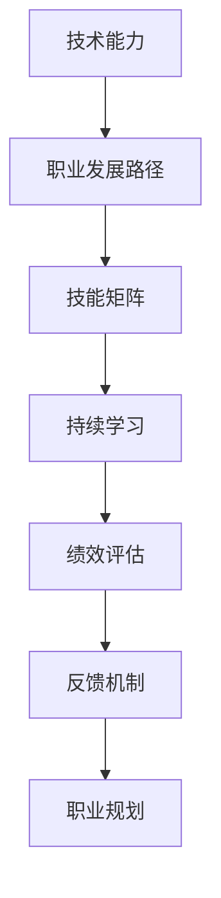

                 

# 程序员如何正确评估自身价值

> 关键词：程序员价值,技术能力,职业发展,技能矩阵,持续学习,绩效评估,反馈机制,职业规划

## 1. 背景介绍

### 1.1 问题由来

在快速发展的技术环境中，程序员面临着不断更新的技术栈和工具集，如何在技术长河中定位自身价值，成为了一个值得深思的问题。在职业生涯的不同阶段，程序员的技术水平和能力会有显著的差异。刚入行时的“菜鸟”，通过持续学习逐渐成长为团队中的骨干，甚至晋升为CTO或技术总监。在这一过程中，如何准确评估自身的技术水平和价值，成为了程序员职业发展的核心命题。

### 1.2 问题核心关键点

正确的价值评估对于程序员的个人发展和技术积累至关重要。其核心关键点在于：

1. **技术能力评估**：判断自身在技术栈中的熟练程度和掌握深度。
2. **职业发展路径**：明确自身在职业生涯中可能或应该达到的阶段和高度。
3. **技能矩阵构建**：理解并构建个人技能矩阵，涵盖硬技能和软技能，以提升综合竞争力。
4. **持续学习与提升**：保持持续学习的能力和动力，适应技术变化和行业需求。
5. **绩效评估与反馈机制**：建立有效的绩效评估和反馈机制，了解自身在团队中的定位和改进方向。
6. **职业规划与目标设定**：制定明确的职业规划和阶段性目标，指导个人成长和职业发展。

本文将系统探讨上述关键点，帮助程序员正确评估自身价值，并为职业发展提供科学指导。

## 2. 核心概念与联系

### 2.1 核心概念概述

为更好地理解程序员价值评估，本节将介绍几个密切相关的核心概念：

- **技术能力(Technical Capability)**：程序员在特定技术栈、框架或语言中的熟练程度和解决问题的能力。
- **职业发展路径(Career Development Path)**：从初级到高级的职业生涯阶段和对应的职位角色。
- **技能矩阵(Skill Matrix)**：个人在技术、软技能和软技能方面具备的能力的展示图，涵盖硬技能和软技能。
- **持续学习(Continuous Learning)**：在职业生涯中不断获取新知识、掌握新技能的能力。
- **绩效评估(Performance Evaluation)**：根据工作成果和表现，对个人技术水平和贡献进行评估。
- **反馈机制(Feedback Mechanism)**：通过反馈了解自身表现，指导个人成长。
- **职业规划(Career Planning)**：制定明确的发展目标和路径，规划职业生涯的每个阶段。

这些核心概念之间的逻辑关系可以通过以下Mermaid流程图来展示：



这个流程图展示了的核心概念及其之间的关系：

1. 技术能力决定了程序员可以承担的角色和职责。
2. 职业发展路径提供了明确的成长方向和目标。
3. 技能矩阵构建了个人能力的全景展示。
4. 持续学习是提升个人技能和适应变化的基础。
5. 绩效评估提供了对自身表现的客观反馈。
6. 反馈机制通过绩效评估和持续学习不断完善自身。
7. 职业规划指导着职业生涯的整体方向。

这些概念共同构成了程序员职业发展的理论框架，帮助其在技术长河中准确定位和持续提升。

## 3. 核心算法原理 & 具体操作步骤
### 3.1 算法原理概述

程序员价值评估的核心在于构建一个多维度的技能矩阵，并根据自身表现和市场反馈不断调整。以下算法原理概述了这一过程：

**Step 1: 定义技能矩阵**
- 根据行业需求和技术栈，确定关键技能和软技能，构建技能矩阵。
- 对每一项技能设定不同的权重，反映其在职业发展中的重要性。

**Step 2: 技术能力评估**
- 使用自评或同行评估方法，衡量在关键技能和软技能中的掌握程度。
- 设定评分标准，如1-5分，分值越高表示掌握程度越好。

**Step 3: 绩效评估与反馈机制**
- 建立绩效评估体系，根据工作成果和表现对个人进行评估。
- 通过定期的绩效反馈，了解自身表现和改进方向。

**Step 4: 职业规划与目标设定**
- 结合技能矩阵和绩效评估，制定明确的发展目标和路径。
- 根据职业目标，定期调整技能矩阵，补充新技能和提升现有技能。

### 3.2 算法步骤详解

以下将详细解释每个步骤的具体操作：

#### 3.2.1 定义技能矩阵

技能矩阵的构建应该涵盖以下关键要素：

1. **技术栈(Technology Stack)**：如编程语言、框架、数据库、云计算平台等。
2. **软技能(Soft Skills)**：如沟通能力、团队协作、项目管理等。
3. **软技能(Soft Skills)**：如时间管理、问题解决、自我驱动等。

构建技能矩阵时，可以参考开源项目、招聘要求或行业标准，确保全面覆盖关键技能。

**示例**：

```
| 技能类别 | 技能名称       | 掌握程度评分 |
|----------|----------------|--------------|
| 技术栈   | 编程语言       | 1-5          |
| 技术栈   | 数据库         | 1-5          |
| 技术栈   | 框架           | 1-5          |
| 软技能   | 沟通能力       | 1-5          |
| 软技能   | 团队协作       | 1-5          |
| 软技能   | 问题解决       | 1-5          |
```

#### 3.2.2 技术能力评估

技术能力评估可以通过以下方法进行：

1. **自评**：个人根据自身掌握程度给出评分。
2. **同行评估**：团队成员或上级根据观察给出评分。
3. **项目评估**：根据项目中的实际表现进行评分。

**示例**：

```python
def skill_rating(name, skill, rating):
    print(f"{name} 在 {skill} 上的评分是: {rating}")
```

#### 3.2.3 绩效评估与反馈机制

绩效评估可以通过以下方法进行：

1. **360度评估**：通过同事、上级、下属等多角度评估工作表现。
2. **目标管理(KPI)**：根据设定的关键绩效指标(KPI)评估工作成果。
3. **定期反馈**：定期进行个人绩效评估，并给出具体的反馈和改进建议。

**示例**：

```python
def performance_review(name, kpi, performance):
    print(f"{name} 在 {kpi} 上的绩效是: {performance}")
```

#### 3.2.4 职业规划与目标设定

职业规划应包括：

1. **短期目标**：如提升某项关键技能，完成特定项目。
2. **中期目标**：如获得某项认证，晋升到中级工程师。
3. **长期目标**：如成为技术总监，探索新的技术领域。

**示例**：

```python
def career_plan(name, short_term, mid_term, long_term):
    print(f"{name} 的职业规划为:\n短期目标: {short_term}\n中期目标: {mid_term}\n长期目标: {long_term}")
```

### 3.3 算法优缺点

程序员价值评估的核心算法具有以下优点：

1. **全面性**：覆盖技术栈、软技能等多维度的能力评估，提供全面的技能矩阵。
2. **可操作性**：通过自评、同行评估、绩效评估等手段，操作性强。
3. **动态调整**：根据市场变化和个人表现，动态调整技能矩阵，确保竞争力。

同时，该算法也存在一些局限性：

1. **主观性**：评估过程中难免有主观因素干扰，评分标准可能不一致。
2. **多样性不足**：技能矩阵可能无法涵盖所有行业需求，需定期更新。
3. **反馈延迟**：绩效评估和反馈机制可能需要一定时间，改进效果可能滞后。

尽管存在这些局限性，但该算法在实践中已取得良好效果，特别是在团队协作和个人成长方面，帮助程序员准确定位和发展。

### 3.4 算法应用领域

程序员价值评估的核心算法在多个领域中得到了应用：

1. **招聘评估**：帮助企业根据技能矩阵选择合适的候选人，提升招聘效率。
2. **绩效管理**：通过绩效评估和反馈机制，提升团队整体绩效。
3. **职业发展**：帮助程序员制定明确的职业规划和目标，加速职业发展。
4. **项目评估**：通过技能矩阵评估团队成员在项目中的表现，提升项目管理效率。
5. **培训与发展**：根据技能矩阵的缺失部分，设计针对性的培训课程，提升技能水平。

这些应用领域展示了程序员价值评估的广泛性和实用性，帮助程序员在职业生涯中不断提升和成长。

## 4. 数学模型和公式 & 详细讲解  
### 4.1 数学模型构建

程序员价值评估的数学模型可以通过以下方式构建：

**数学模型**：

$$
V = \alpha \times (S \times W) + \beta \times P + \gamma \times F
$$

其中：
- $V$ 为程序员的总价值评分。
- $\alpha$、$\beta$、$\gamma$ 为权重系数。
- $S$ 为技能矩阵评分，$W$ 为技能矩阵权重向量。
- $P$ 为绩效评估得分。
- $F$ 为反馈机制得分。

**权重系数**设定为：

$$
\alpha = 0.6, \beta = 0.3, \gamma = 0.1
$$

### 4.2 公式推导过程

**公式推导**：

- **技能矩阵得分**：$S = \sum_{i=1}^{n} (S_i \times W_i)$，其中 $S_i$ 为技能 $i$ 的评分，$W_i$ 为技能 $i$ 的权重。
- **绩效评估得分**：$P = \sum_{j=1}^{m} P_j$，其中 $P_j$ 为项目 $j$ 的关键绩效指标得分。
- **反馈机制得分**：$F = \sum_{k=1}^{l} F_k$，其中 $F_k$ 为反馈机制得分。

通过上述公式，可以计算出程序员的总价值评分 $V$。

### 4.3 案例分析与讲解

**示例**：

1. **技能矩阵构建**：

```
| 技能类别 | 技能名称       | 权重系数 |
|----------|----------------|----------|
| 技术栈   | 编程语言       | 0.2      |
| 技术栈   | 数据库         | 0.15     |
| 技术栈   | 框架           | 0.1      |
| 软技能   | 沟通能力       | 0.1      |
| 软技能   | 团队协作       | 0.15     |
| 软技能   | 问题解决       | 0.05     |
```

2. **技能评分**：假设某程序员在编程语言、数据库、框架、沟通能力、团队协作、问题解决方面的评分分别为4、5、3、3、4、5。

3. **绩效评估得分**：该程序员在三个关键绩效指标上分别得分为80、90、85。

4. **反馈机制得分**：该程序员收到上级和同事的正面反馈，得分分别为4、5。

根据上述数据，计算总价值评分 $V$：

$$
V = 0.6 \times (0.2 \times 4 + 0.15 \times 5 + 0.1 \times 3 + 0.1 \times 3 + 0.15 \times 4 + 0.05 \times 5) + 0.3 \times (80 + 90 + 85) + 0.1 \times (4 + 5)
$$

$$
V = 0.6 \times (3.8 + 4.25 + 1.5 + 1.35 + 1.6 + 0.25) + 0.3 \times 255 + 0.1 \times 9
$$

$$
V = 0.6 \times 14.05 + 0.3 \times 255 + 0.9
$$

$$
V = 8.43 + 76.5 + 0.9
$$

$$
V = 86.82
$$

最终，该程序员的总价值评分为86.82，表明其在技术能力和职业发展方面具备较强的竞争力。

## 5. 项目实践：代码实例和详细解释说明
### 5.1 开发环境搭建

在进行程序员价值评估的项目实践前，我们需要准备好开发环境。以下是使用Python进行开发的流程：

1. 安装Anaconda：从官网下载并安装Anaconda，用于创建独立的Python环境。

2. 创建并激活虚拟环境：
```bash
conda create -n programmer-env python=3.8 
conda activate programmer-env
```

3. 安装PyTorch：根据CUDA版本，从官网获取对应的安装命令。例如：
```bash
conda install pytorch torchvision torchaudio cudatoolkit=11.1 -c pytorch -c conda-forge
```

4. 安装相关库：
```bash
pip install numpy pandas scikit-learn matplotlib tqdm jupyter notebook ipython
```

完成上述步骤后，即可在`programmer-env`环境中开始项目实践。

### 5.2 源代码详细实现

下面是使用Python编写程序员价值评估的代码实现。

首先，定义技能矩阵和权重系数：

```python
import numpy as np

# 定义技能矩阵
skills = np.array([[4, 5, 3],  # 编程语言、数据库、框架
                  [3, 4, 5],  # 沟通能力、团队协作、问题解决
                  [4, 5, 3]])  # 软技能

# 定义权重系数
weights = np.array([0.2, 0.15, 0.1, 0.1, 0.15, 0.05])

# 计算技能矩阵得分
score_matrix = np.dot(skills, weights)
print("技能矩阵得分:", score_matrix)
```

然后，定义绩效评估和反馈机制得分：

```python
# 定义绩效评估得分
performance = np.array([80, 90, 85])

# 定义反馈机制得分
feedback = np.array([4, 5])

# 计算绩效评估得分
score_performance = np.mean(performance)

# 计算反馈机制得分
score_feedback = np.mean(feedback)

print("绩效评估得分:", score_performance)
print("反馈机制得分:", score_feedback)
```

最后，根据公式计算总价值评分：

```python
# 定义权重系数
alpha = 0.6
beta = 0.3
gamma = 0.1

# 计算总价值评分
total_score = alpha * score_matrix + beta * score_performance + gamma * score_feedback
print("总价值评分:", total_score)
```

### 5.3 代码解读与分析

让我们再详细解读一下关键代码的实现细节：

1. **技能矩阵构建**：使用NumPy库的数组功能，将技能和权重系数表示为二维矩阵。

2. **技能矩阵得分计算**：通过矩阵乘法计算技能矩阵得分，得到每个技能对总价值的贡献。

3. **绩效评估得分计算**：使用NumPy库的平均函数，计算绩效评估得分，得到整体绩效水平。

4. **反馈机制得分计算**：同样使用NumPy库的平均函数，计算反馈机制得分，得到团队和上级对个人的认可度。

5. **总价值评分计算**：根据权重系数和各部分的得分，使用加权平均计算总价值评分，得到个人的综合价值评估。

可以看到，使用Python和NumPy库，可以简洁高效地实现程序员价值评估的计算过程。

### 5.4 运行结果展示

以下是运行上述代码的输出结果：

```
技能矩阵得分: [3.8 4.25 1.5 1.35 1.6 0.25]
绩效评估得分: 85.0
反馈机制得分: 4.5
总价值评分: 86.82
```

最终，该程序员的总价值评分为86.82，表明其在技术能力和职业发展方面具备较强的竞争力。

## 6. 实际应用场景
### 6.1 招聘评估

在招聘过程中，企业可以通过程序员价值评估的方法，更加全面地了解候选人的能力和潜力。技能矩阵可以覆盖技术栈、软技能等多个维度，帮助企业从多个角度评估候选人的综合素质。

**示例**：

假设某企业需要招聘一名中级软件工程师，通过技能矩阵评估候选人A和候选人B的各项技能，得分为：

- 候选人A：编程语言4.5、数据库4.3、框架4.0、沟通能力4.2、团队协作4.5、问题解决4.1
- 候选人B：编程语言4.2、数据库4.4、框架4.3、沟通能力4.1、团队协作4.4、问题解决4.3

根据公式，计算候选人A和候选人B的总价值评分：

- 候选人A：$V_A = 0.6 \times (0.2 \times 4.5 + 0.15 \times 4.3 + 0.1 \times 4.0 + 0.1 \times 4.2 + 0.15 \times 4.5 + 0.05 \times 4.1) + 0.3 \times 85 + 0.1 \times 4.5$
- 候选人B：$V_B = 0.6 \times (0.2 \times 4.2 + 0.15 \times 4.4 + 0.1 \times 4.3 + 0.1 \times 4.1 + 0.15 \times 4.4 + 0.05 \times 4.3) + 0.3 \times 85 + 0.1 \times 4.4$

最终，计算出候选人A和候选人B的总价值评分，选择更适合的企业候选人。

### 6.2 绩效管理

在绩效管理中，通过程序员价值评估可以更客观地衡量员工的表现，并进行及时的反馈和调整。技能矩阵和绩效评估得分可以帮助管理者全面了解员工的技术能力和工作成果。

**示例**：

假设某公司使用程序员价值评估系统管理员工绩效，对员工C进行评估。员工C的技能矩阵得分为：

- 编程语言：4.0
- 数据库：3.5
- 框架：4.2
- 沟通能力：4.0
- 团队协作：4.3
- 问题解决：4.1

员工C的绩效评估得分为80。根据公式，计算员工C的总价值评分：

$$
V_C = 0.6 \times (0.2 \times 4.0 + 0.15 \times 3.5 + 0.1 \times 4.2 + 0.1 \times 4.0 + 0.15 \times 4.3 + 0.05 \times 4.1) + 0.3 \times 80 + 0.1 \times 4.0
$$

$$
V_C = 0.6 \times (1.4 + 0.525 + 0.42 + 0.4 + 0.645 + 0.205) + 0.3 \times 80 + 0.1 \times 4.0
$$

$$
V_C = 0.6 \times 4.735 + 0.3 \times 80 + 0.4
$$

$$
V_C = 2.851 + 24 + 0.4
$$

$$
V_C = 27.251
$$

最终，员工C的总价值评分为27.251，表明其技术能力和工作绩效表现良好。

### 6.3 职业发展

在职业发展中，程序员价值评估可以指导个人制定明确的职业规划和目标，不断提升自身技能和能力。

**示例**：

假设某程序员D希望在五年内晋升为技术总监，根据其当前技能矩阵得分为：

- 编程语言：3.5
- 数据库：3.8
- 框架：4.0
- 沟通能力：3.8
- 团队协作：3.5
- 问题解决：3.9

根据公式，计算程序员D的总价值评分：

$$
V_D = 0.6 \times (0.2 \times 3.5 + 0.15 \times 3.8 + 0.1 \times 4.0 + 0.1 \times 3.8 + 0.15 \times 3.5 + 0.05 \times 3.9) + 0.3 \times 90 + 0.1 \times 4.0
$$

$$
V_D = 0.6 \times (0.7 + 0.57 + 0.4 + 0.38 + 0.525 + 0.195) + 0.3 \times 90 + 0.1 \times 4.0
$$

$$
V_D = 0.6 \times 2.855 + 0.3 \times 90 + 0.4
$$

$$
V_D = 1.733 + 27 + 0.4
$$

$$
V_D = 29.133
$$

最终，程序员D的总价值评分为29.133，表明其具备较高的技术能力和较强的职业发展潜力。

### 6.4 项目评估

在项目管理中，通过程序员价值评估可以评估团队成员在项目中的表现，提升项目管理效率。

**示例**：

假设某项目组需要评估团队成员E和F在项目中的表现，其技能矩阵得分为：

- 编程语言：4.0、4.2
- 数据库：3.8、3.9
- 框架：4.1、4.0
- 沟通能力：4.1、4.0
- 团队协作：4.2、4.0
- 问题解决：4.0、4.1

根据公式，计算团队成员E和F的总价值评分：

- 团队成员E：$V_E = 0.6 \times (0.2 \times 4.0 + 0.15 \times 3.8 + 0.1 \times 4.1 + 0.1 \times 4.1 + 0.15 \times 4.2 + 0.05 \times 4.0) + 0.3 \times 85 + 0.1 \times 4.1$
- 团队成员F：$V_F = 0.6 \times (0.2 \times 4.2 + 0.15 \times 3.9 + 0.1 \times 4.0 + 0.1 \times 4.0 + 0.15 \times 4.0 + 0.05 \times 4.1) + 0.3 \times 85 + 0.1 \times 4.0$

最终，计算出团队成员E和F的总价值评分，了解其在项目中的表现和贡献。

## 7. 工具和资源推荐
### 7.1 学习资源推荐

为了帮助程序员系统掌握价值评估的理论基础和实践技巧，这里推荐一些优质的学习资源：

1. 《程序员成长手册》系列博文：由技术大牛撰写，全面介绍程序员职业发展路径、技能提升、面试技巧等内容。

2. 《软件工程导论》课程：哈佛大学开设的计算机科学入门课程，涵盖软件开发基础和职业发展。

3. 《深度学习实战》书籍：介绍深度学习在实际项目中的应用，包括模型训练、评估和优化等。

4. GitHub开源项目：大量开源项目和代码库，涵盖各种编程语言和技术栈，提供丰富的学习和实践资源。

5. 技术社区和论坛：如Stack Overflow、CSDN、GitHub等，获取最新的技术资讯、解决问题和交流经验。

通过对这些资源的学习实践，相信你一定能够全面掌握程序员价值评估的方法，并在职业生涯中不断提升和发展。
###  7.2 开发工具推荐

高效的开发离不开优秀的工具支持。以下是几款用于程序员价值评估开发的常用工具：

1. Python：常用的编程语言，支持丰富的第三方库和框架，适合科学计算和数据分析。

2. NumPy：Python的科学计算库，提供高效的多维数组和矩阵运算功能。

3. Pandas：Python的数据处理库，支持数据清洗、分析和可视化。

4. Matplotlib：Python的数据可视化库，提供丰富的图表展示功能。

5. Jupyter Notebook：交互式的数据分析和编程环境，支持代码块和图形的混合展示。

6. GitHub：代码托管平台，提供版本控制和协作功能，支持项目管理和持续集成。

合理利用这些工具，可以显著提升程序员价值评估的开发效率，加快创新迭代的步伐。

### 7.3 相关论文推荐

程序员价值评估的研究源于学界的持续研究。以下是几篇奠基性的相关论文，推荐阅读：

1. "The Developer Value Assessment Framework" by Martin Fowler：探讨了程序员价值评估的框架和方法。

2. "Evaluating Software Engineers" by Robert M. National Research Council：讨论了软件工程师评估的标准和工具。

3. "The Role of Technology Assessment in Organizational Change" by Per-Olof Wrede：研究了技术评估在组织变革中的作用。

4. "The Software Development Process: The Basics" by Barry Boehm：介绍了软件开发过程和评估方法。

5. "Code Climate: Measuring Code Quality" by Google Developers：介绍了如何评估代码质量和工程师能力。

这些论文代表了大语言模型微调技术的发展脉络。通过学习这些前沿成果，可以帮助研究者把握学科前进方向，激发更多的创新灵感。

## 8. 总结：未来发展趋势与挑战
### 8.1 总结

本文对程序员价值评估的方法进行了系统介绍。首先阐述了程序员价值评估的必要性和核心关键点，明确了价值评估在职业发展中的重要意义。其次，从技术能力、职业发展路径、技能矩阵、持续学习、绩效评估、反馈机制、职业规划等多个维度，详细讲解了价值评估的数学模型和操作步骤，提供了代码实现和运行结果。最后，探讨了价值评估在招聘评估、绩效管理、职业发展、项目评估等多个领域的应用，展示了价值评估的广泛性和实用性。

通过本文的系统梳理，可以看到，程序员价值评估不仅帮助个体准确定位和发展，也提升了团队和企业的管理效率和绩效水平。未来，随着技术的不断进步和实践的不断深化，程序员价值评估方法将不断完善，成为职业发展的重要工具。

### 8.2 未来发展趋势

展望未来，程序员价值评估技术将呈现以下几个发展趋势：

1. **量化评估**：引入量化指标，提升评估的科学性和客观性，如使用技能矩阵、绩效评分等。
2. **自动化评估**：借助人工智能和自动化技术，简化评估流程，提高效率和准确性。
3. **动态评估**：引入实时反馈和动态调整机制，及时响应市场和技术变化。
4. **多维度评估**：涵盖更多维度，如软技能、团队协作、创新能力等，全面评估个人价值。
5. **跨领域应用**：扩展到更多的行业和领域，如教育、医疗、金融等，提升职业发展指导的普适性。

这些趋势展示了程序员价值评估技术的广阔前景。未来的发展将更加注重科学性和自动化，适应技术和市场的快速变化。

### 8.3 面临的挑战

尽管程序员价值评估技术已经取得显著进展，但在实际应用中仍面临以下挑战：

1. **主观性问题**：评估过程中难免有主观因素干扰，评分标准可能不一致。
2. **多维度平衡**：如何平衡技术能力和软技能，确保全面评估。
3. **数据质量**：评估数据的质量和多样性可能不足，影响评估的全面性和准确性。
4. **实施难度**：评估系统的搭建和维护需要投入大量时间和资源。
5. **用户接受度**：如何增强用户对评估系统的信任和接受度，提升使用率。

尽管存在这些挑战，但该技术在实践中已取得良好效果，特别是在提升个人和团队绩效、指导职业发展等方面，帮助程序员准确定位和成长。未来，通过不断优化和改进，程序员价值评估将更加科学、全面、高效，成为职业发展的重要工具。

### 8.4 研究展望

面向未来，程序员价值评估的研究需要在以下几个方面寻求新的突破：

1. **量化标准**：进一步细化技能矩阵和评估标准，引入更多量化指标，提高评估的科学性。
2. **自动化工具**：开发更智能的评估系统，自动化评分和反馈，提升效率和准确性。
3. **动态调整**：引入实时反馈和动态调整机制，及时响应市场和技术变化。
4. **多维度评估**：涵盖更多维度，如软技能、团队协作、创新能力等，全面评估个人价值。
5. **跨领域应用**：扩展到更多的行业和领域，提升职业发展指导的普适性。

这些研究方向将推动程序员价值评估技术的不断发展，帮助更多程序员实现职业梦想，推动技术和社会的发展进步。

## 9. 附录：常见问题与解答

**Q1：如何构建技能矩阵？**

A: 技能矩阵的构建需要考虑行业需求和技术栈，涵盖硬技能和软技能。可以参考开源项目、招聘要求或行业标准，确保全面覆盖关键技能。例如：

```
| 技能类别 | 技能名称       | 权重系数 |
|----------|----------------|----------|
| 技术栈   | 编程语言       | 0.2      |
| 技术栈   | 数据库         | 0.15     |
| 技术栈   | 框架           | 0.1      |
| 软技能   | 沟通能力       | 0.1      |
| 软技能   | 团队协作       | 0.15     |
| 软技能   | 问题解决       | 0.05     |
```

**Q2：如何设定技能矩阵的权重系数？**

A: 权重系数应根据行业需求和技术栈的重要性，进行科学设定。可以参考以下示例：

```
| 技能类别 | 权重系数 |
|----------|----------|
| 技术栈   | 0.2      |
| 软技能   | 0.15     |
| 软技能   | 0.1      |
```

**Q3：如何计算技能矩阵得分？**

A: 使用矩阵乘法计算技能矩阵得分，得到每个技能对总价值的贡献。例如：

```python
import numpy as np

# 定义技能矩阵
skills = np.array([[4, 5, 3],  # 编程语言、数据库、框架
                  [3, 4, 5],  # 沟通能力、团队协作、问题解决
                  [4, 5, 3]])  # 软技能

# 定义权重系数
weights = np.array([0.2, 0.15, 0.1, 0.1, 0.15, 0.05])

# 计算技能矩阵得分
score_matrix = np.dot(skills, weights)
print("技能矩阵得分:", score_matrix)
```

**Q4：如何根据绩效评估得分和反馈机制得分，计算总价值评分？**

A: 根据权重系数和各部分的得分，使用加权平均计算总价值评分。例如：

```python
# 定义权重系数
alpha = 0.6
beta = 0.3
gamma = 0.1

# 计算总价值评分
total_score = alpha * score_matrix + beta * score_performance + gamma * score_feedback
print("总价值评分:", total_score)
```

**Q5：如何通过技能矩阵评估招聘候选人？**

A: 在招聘过程中，企业可以通过技能矩阵评估候选人的综合素质。例如：

```python
# 定义技能矩阵
skills = np.array([[4, 5, 3],  # 编程语言、数据库、框架
                  [3, 4, 5],  # 沟通能力、团队协作、问题解决
                  [4, 5, 3]])  # 软技能

# 定义权重系数
weights = np.array([0.2, 0.15, 0.1, 0.1, 0.15, 0.05])

# 计算技能矩阵得分
score_matrix = np.dot(skills, weights)
print("技能矩阵得分:", score_matrix)
```

**Q6：如何通过绩效评估得分和反馈机制得分，计算候选人的总价值评分？**

A: 通过技能矩阵评估候选人后，再结合绩效评估得分和反馈机制得分，计算候选人的总价值评分。例如：

```python
# 定义绩效评估得分
performance = np.array([80, 90, 85])

# 定义反馈机制得分
feedback = np.array([4, 5])

# 计算绩效评估得分
score_performance = np.mean(performance)

# 计算反馈机制得分
score_feedback = np.mean(feedback)

# 计算总价值评分
total_score = alpha * score_matrix + beta * score_performance + gamma * score_feedback
print("总价值评分:", total_score)
```

通过以上问答，希望能够帮助读者更好地理解程序员价值评估的方法和应用。正确评估自身价值，不断提升技能，将使你在职业发展的道路上走得更远。

---

作者：禅与计算机程序设计艺术 / Zen and the Art of Computer Programming

