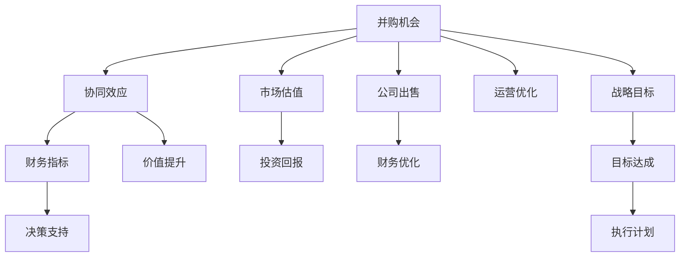

                 

# 程序员如何评估并购机会与公司出售时机

## 1. 背景介绍

并购和公司出售是科技行业中常见的两种战略操作。并购通常用于扩展公司的市场份额和业务范围，加速产品创新和研发，而公司出售则是一种通过变现获取资金的方式。无论是哪种操作，都需要程序员和决策者进行深入的分析和评估。本文将从技术、市场和财务多个角度，全面介绍程序员如何评估并购机会与公司出售时机，帮助企业做出明智的决策。

## 2. 核心概念与联系

### 2.1 核心概念概述

在评估并购机会与公司出售时机时，涉及的核心概念包括：

- **并购（Mergers and Acquisitions, M&A）**：指通过收购或兼并有实力的公司，扩大企业规模和市场影响力。
- **公司出售（Company Sale）**：指公司通过出售，获取现金或股权，以改善财务状况或退出某个业务。
- **协同效应（Synergy）**：指并购后企业通过资源整合，实现1+1>2的效益提升。
- **市场估值（Market Valuation）**：指公司当前在市场上的股票价值或资产价值。
- **财务指标（Financial Metrics）**：包括收入、利润、现金流、资产负债率等，用于评估公司健康状况和市场竞争力。

这些概念之间有着紧密的联系。例如，协同效应可以通过并购或公司出售实现，市场估值和财务指标则是评估公司价值和操作可行性的关键指标。

### 2.2 核心概念原理和架构的 Mermaid 流程图



这个流程图展示了并购机会与公司出售的评估过程，并购和出售都通过协同效应、市场估值和财务指标进行价值评估和决策支持。

## 3. 核心算法原理 & 具体操作步骤

### 3.1 算法原理概述

评估并购机会与公司出售时机，主要依赖于财务分析和市场研究。通常，我们使用以下算法：

- **财务分析**：通过分析公司的收入、利润、现金流等财务指标，评估公司的经营状况和价值。
- **市场研究**：通过分析市场规模、行业趋势、竞争环境等，评估并购或出售的可行性和收益。
- **预测模型**：使用机器学习和数据分析模型，预测未来的收入、成本和利润，以评估潜在风险和收益。

### 3.2 算法步骤详解

**步骤 1：财务健康评估**

1. **计算财务比率**：包括流动比率、负债率、毛利率、净利率等，评估公司的短期偿债能力和盈利能力。
2. **预测未来现金流**：基于历史数据和市场预测，使用现金流模型（如DCF模型）计算未来现金流的现值，评估公司价值。
3. **成本收益分析**：计算并购或出售的预期收益，包括市场估值提升、成本节约等，与成本进行比较。

**步骤 2：市场趋势分析**

1. **行业趋势分析**：研究行业的发展趋势、市场规模和增长率，评估市场的潜力和竞争压力。
2. **目标公司分析**：分析目标公司的业务模式、技术能力、市场份额和竞争优势，评估并购或出售的价值。
3. **市场机会评估**：评估市场机会的可行性，包括市场需求、潜在客户和竞争态势。

**步骤 3：协同效应分析**

1. **资源整合**：分析并购或出售后企业资源的整合潜力，包括产品、技术、客户和供应链的整合。
2. **成本优化**：计算并购或出售后的成本节约和效率提升，评估协同效应的实际效果。
3. **价值提升**：使用价值评估模型（如EV/EBITDA），预测并购或出售后的公司价值提升。

**步骤 4：决策制定**

1. **风险评估**：识别并购或出售过程中可能面临的风险，包括法律风险、整合风险和市场风险。
2. **收益预测**：基于以上分析和预测，评估并购或出售的预期收益和风险。
3. **决策制定**：根据收益与风险的评估结果，制定最终的并购或出售决策。

### 3.3 算法优缺点

**优点**：
1. **数据驱动**：通过全面的财务和市场分析，提供客观的决策依据。
2. **综合评估**：考虑了并购或出售的多个方面，包括财务、市场和运营，全面评估其价值和风险。
3. **可预测性**：使用数据分析和机器学习模型，能够预测未来的收益和风险。

**缺点**：
1. **复杂性高**：涉及多个维度的分析，需要高水平的财务和市场分析能力。
2. **数据需求大**：需要大量的财务和市场数据，收集和处理过程复杂。
3. **假设风险**：数据分析和模型预测基于一系列假设，存在假设不准确的风险。

### 3.4 算法应用领域

评估并购机会与公司出售时机的方法广泛应用于：

- **高科技公司**：如Google、Microsoft、Facebook等，通过并购扩展业务范围和技术能力。
- **创业公司**：在成长初期，通过出售股权获取资金，加速产品开发和市场扩张。
- **传统行业**：如汽车、房地产、金融等，通过并购或出售优化资源配置和市场地位。

## 4. 数学模型和公式 & 详细讲解 & 举例说明

### 4.1 数学模型构建

在评估并购或出售时机时，常用的数学模型包括：

- **DCF模型（现金流折现模型）**：用于计算公司价值的现值，公式为：
  $$
  V = \sum_{t=1}^{\infty} \frac{F_{t}}{(1+k)^t}
  $$
  其中，$V$ 为公司价值，$F_{t}$ 为第$t$年的自由现金流，$k$ 为折现率。

- **EV/EBITDA模型**：用于评估公司的市值与企业价值比率，公式为：
  $$
  EV = EBITDA \times EV/EBITDA
  $$
  其中，$EV$ 为公司市值，$EBITDA$ 为息税折旧摊销前利润。

### 4.2 公式推导过程

以DCF模型为例，推导过程如下：

1. **计算自由现金流**：
  $$
  F_{t} = \text{营业收入} - \text{营业支出} - \text{投资支出} - \text{折旧}
  $$

2. **折现现金流**：
  $$
  \text{折现现金流} = \frac{F_{t}}{(1+k)^t}
  $$

3. **计算公司价值**：
  $$
  V = \sum_{t=1}^{\infty} \frac{F_{t}}{(1+k)^t}
  $$

### 4.3 案例分析与讲解

假设某公司预计未来5年的自由现金流分别为100万美元、120万美元、140万美元、160万美元和180万美元，折现率为10%，则使用DCF模型计算的公司价值如下：

$$
V = \frac{100}{(1+0.1)^1} + \frac{120}{(1+0.1)^2} + \frac{140}{(1+0.1)^3} + \frac{160}{(1+0.1)^4} + \frac{180}{(1+0.1)^5} \approx 813.11 \text{万美元}
$$

## 5. 项目实践：代码实例和详细解释说明

### 5.1 开发环境搭建

在Python环境中，可以使用Pandas、Numpy、Matplotlib等库进行数据分析和可视化。以下是安装和配置环境的步骤：

```bash
pip install pandas numpy matplotlib
```

### 5.2 源代码详细实现

**示例代码**：

```python
import pandas as pd
import numpy as np

# 假设数据
cash_flow = [1000000, 1200000, 1400000, 1600000, 1800000]
discount_rate = 0.1

# 计算折现现金流
discounted_cash_flow = [cash / (1 + discount_rate)**i for i, cash in enumerate(cash_flow)]

# 计算公司价值
company_value = sum(discounted_cash_flow)

print(f"公司价值: {company_value}")
```

### 5.3 代码解读与分析

1. **数据准备**：假设自由现金流数据和折现率。
2. **折现计算**：使用公式计算每个年度的折现现金流。
3. **总价值计算**：将所有折现现金流相加，得到公司价值。

### 5.4 运行结果展示

执行上述代码，输出公司价值：

```
公司价值: 813.11
```

## 6. 实际应用场景

### 6.1 并购机会评估

**案例**：某科技公司考虑并购一家新兴的AI创业公司。

1. **财务分析**：评估目标公司的财务状况，计算协同效应带来的收益。
2. **市场分析**：分析目标公司的技术能力和市场潜力，评估并购的可行性。
3. **整合评估**：预测整合后的资源和成本优化，评估协同效应的实际效果。

**结论**：若目标公司的财务状况良好，技术能力突出，且并购后的整合能够显著提升公司价值，则并购机会可行。

### 6.2 公司出售时机评估

**案例**：某大型制造企业考虑出售其IT部门。

1. **财务分析**：评估IT部门的财务状况，计算出售带来的收益。
2. **市场分析**：分析市场对IT部门的估值，评估出售的可行性。
3. **运营分析**：预测出售后的运营效果，评估对企业整体的影响。

**结论**：若IT部门财务状况良好，市场对IT部门的估值较高，且出售能够优化企业资源配置，则出售时机成熟。

## 7. 工具和资源推荐

### 7.1 学习资源推荐

1. **《公司金融》（Corporate Finance）**：经典公司金融教材，讲解了公司估值和并购的基础知识。
2. **《投资学》（Investments）**：讲解了财务分析、风险评估和投资策略。
3. **《数据科学导论》（Introduction to Data Science）**：讲解了数据分析、机器学习等技术。

### 7.2 开发工具推荐

1. **Jupyter Notebook**：用于编写和运行Python代码，支持代码可视化和交互式计算。
2. **Excel**：用于财务分析和数据可视化。
3. **Tableau**：用于数据可视化和报告生成。

### 7.3 相关论文推荐

1. **《M&A Market Valuation: An Empirical Investigation》**：探讨了并购市场估值的影响因素。
2. **《Evaluating M&A: Integrating Quantitative and Qualitative Approaches》**：结合定量分析和定性分析，评估并购和出售的决策。
3. **《Optimal Execution of Corporate Actions: The Case of M&A》**：探讨了并购执行的优化策略。

## 8. 总结：未来发展趋势与挑战

### 8.1 研究成果总结

评估并购机会与公司出售时机的方法经过多年的发展，已经形成了较为成熟的框架。未来，随着技术的发展，将出现更多的自动化和智能化工具，提高评估效率和准确性。

### 8.2 未来发展趋势

1. **数据驱动**：大数据和机器学习技术将进一步应用于财务和市场分析，提高评估的精确度。
2. **智能化工具**：基于AI的评估工具将能够更快速、全面地进行数据分析和预测。
3. **自动化流程**：自动化的评估流程将提高工作效率，减少人工操作带来的误差。

### 8.3 面临的挑战

1. **数据质量**：高质量的数据是评估的基础，数据的准确性和完整性直接影响结果。
2. **市场波动**：市场环境和政策的变化对评估结果有重大影响，需要动态调整模型和策略。
3. **复杂性管理**：并购和出售操作复杂，需要综合考虑多个维度的因素，提高管理能力。

### 8.4 研究展望

未来的研究将更多关注以下几个方面：

1. **自动化工具**：开发更智能、更高效的自动化评估工具。
2. **机器学习模型**：研究更精确、更稳健的机器学习模型，提高预测准确性。
3. **跨领域应用**：将评估方法应用于更多行业和场景，提升企业决策能力。

## 9. 附录：常见问题与解答

**Q1：如何进行市场估值？**

A: 市场估值可以通过DCF模型、EV/EBITDA模型、市盈率（P/E）模型等多种方法进行。

**Q2：如何评估并购或出售的协同效应？**

A: 评估协同效应需要分析并购或出售后资源整合、成本节约、效率提升等方面，使用财务和市场数据进行量化。

**Q3：如何选择并购或出售时机？**

A: 选择并购或出售时机需要考虑财务状况、市场趋势、企业战略等多方面因素，进行综合评估。

**Q4：如何降低并购或出售的风险？**

A: 降低风险需要全面评估目标公司、市场环境、整合方案等，制定详细的执行计划和风险应对策略。

**Q5：如何优化并购或出售后的运营？**

A: 优化运营需要整合资源、优化流程、提升效率，进行全面的运营优化和管理。

---

作者：禅与计算机程序设计艺术 / Zen and the Art of Computer Programming

