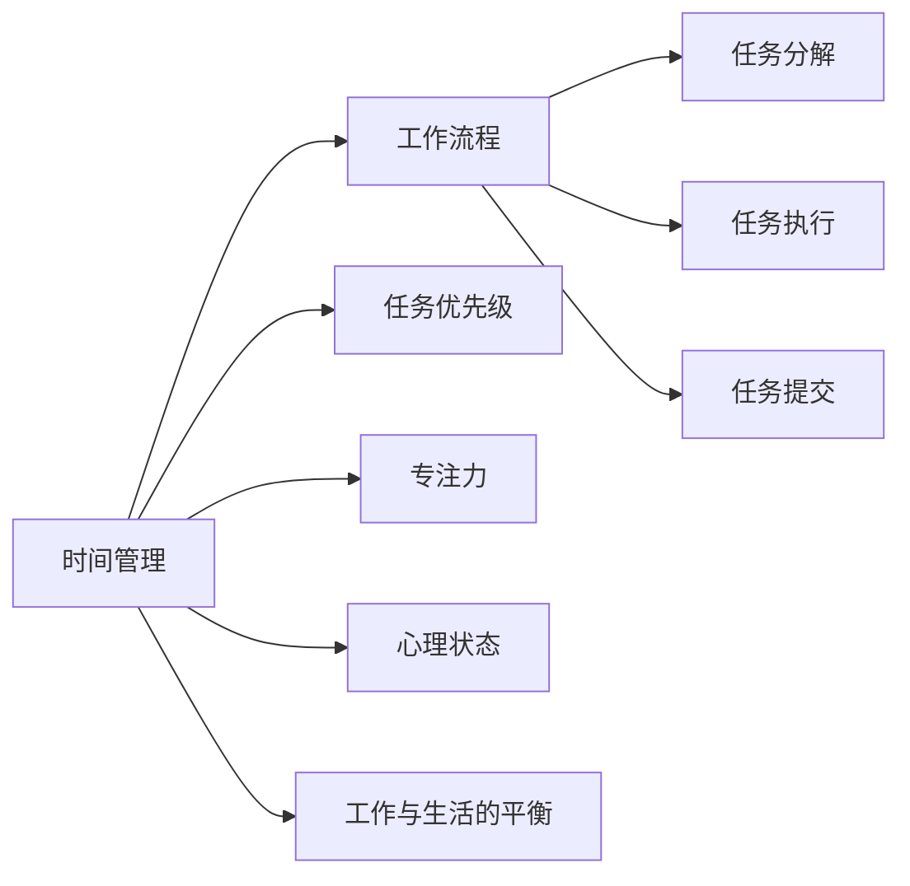

                 

# 程序员如何进行时间管理

> 关键词：时间管理, 编程效率, 工作流程, 软件工程, 职业发展

## 1. 背景介绍

### 1.1 问题由来
在快速发展的IT行业中，程序员面临着繁重的工作压力和高度竞争。一方面，技术栈繁多、更新迭代迅速，程序员需要不断学习新的技能和工具；另一方面，交付周期紧迫，项目需求复杂多样，程序员需要高效完成高质量的代码。如何在这两者之间找到平衡，进行有效的时间管理，成为了程序员职业生涯中的重要课题。

### 1.2 问题核心关键点
时间管理不仅仅是日历和待办事项的规划，而是涉及工作流程、心理状态、工具使用等多个维度的综合优化。本文将介绍一系列时间管理的核心策略和实践方法，帮助程序员提升工作效率，实现职业发展。

### 1.3 问题研究意义
掌握时间管理技能，对程序员具有以下几方面的重要意义：
- 提升编程效率。时间管理能够帮助程序员合理规划工作任务，减少无效时间的浪费，提高代码质量和开发速度。
- 增强工作成就感。良好的时间管理能够帮助程序员在高压环境下保持高效工作状态，提高职业满足感和幸福感。
- 促进职业发展。高效的时间管理不仅能提升个人技能，还能提高团队协作效率，成为职业成长的重要助力。
- 防止职业倦怠。合理的工作节奏和时间分配，能够有效避免长期高强度工作带来的疲劳和倦怠。

## 2. 核心概念与联系

### 2.1 核心概念概述

为了更好地理解时间管理的方法和技巧，本节将介绍几个关键概念及其之间的联系：

- **时间管理**：对工作时间进行规划、安排和控制，以高效完成工作任务。
- **工作流程**：指工作的步骤和环节，包括任务分解、任务执行、任务提交等。
- **任务优先级**：根据任务的重要性和紧急程度，划分任务优先级，合理安排时间。
- **专注力**：保持专注，减少干扰，提高工作质量。
- **心理状态**：保持积极乐观的心态，避免焦虑和疲劳。
- **工作与生活的平衡**：确保有足够的休息和娱乐时间，避免过度工作。

这些概念之间的联系可以通过以下Mermaid流程图来展示：



这个流程图展示时间管理对工作流程的影响，并通过多个维度支撑时间管理。

## 3. 核心算法原理 & 具体操作步骤
### 3.1 算法原理概述

时间管理的核心算法原理基于任务优先级和时间分配。通过科学的任务划分和合理安排，能够最大化地利用时间，提高工作效率。常见的时间管理方法包括番茄工作法、四象限法则、GTD方法（Getting Things Done）等。

- **番茄工作法**：将工作时间分为25分钟专注工作和一个5分钟休息的周期，每4个周期后休息15-30分钟。
- **四象限法则**：将任务分为四类：紧急且重要、紧急但不重要、重要但不紧急、不重要且不紧急，根据优先级安排时间。
- **GTD方法**：将所有任务和想法记录下来，然后根据上下文和优先级进行分类，最后制定计划并执行。

### 3.2 算法步骤详解

以下是使用番茄工作法的时间管理详细步骤：

1. **任务清单准备**：
   - 列出所有需要完成的任务，并对其进行分类和优先级排序。
   - 例如，可以分为项目任务、日常任务、学习任务等。

2. **设定工作周期**：
   - 将工作时间分成25分钟一个的工作周期，每个周期后休息5分钟。
   - 每4个工作周期后，休息15-30分钟。

3. **开始工作周期**：
   - 选择一个任务，专注于25分钟的工作周期，期间避免所有干扰，如社交媒体、电话等。
   - 完成后，标记任务完成，并休息5分钟。

4. **评估和调整**：
   - 在每个工作周期结束时，评估任务的完成情况和效率。
   - 根据实际情况调整任务清单和优先级，确保时间高效利用。

### 3.3 算法优缺点

时间管理方法的优势在于：
- **提升效率**：通过专注的工作周期和定时休息，避免疲劳，提高工作效率。
- **心理调适**：定期休息有助于心理放松，减少焦虑和压力。
- **清晰规划**：清晰的任务划分和优先级排序，有助于明确工作目标，减少迷茫。

其缺点主要在于：
- **适应性不足**：不同人、不同任务可能需要不同的时间管理策略，过于僵化的规则可能不适用。
- **干扰因素多**：工作环境中的干扰因素较多，难以完全按计划进行。

### 3.4 算法应用领域

时间管理方法不仅适用于程序员，在各行各业都能发挥重要作用。例如：

- **项目管理**：项目经理可以使用番茄工作法或四象限法则，合理分配团队任务和会议时间，提升项目进度。
- **教育培训**：教师和学生可以通过GTD方法，有效规划学习和复习时间，提高学习效率。
- **行政工作**：行政人员可以使用四象限法则，合理安排日常事务和紧急任务，提升工作效率。
- **创业公司**：创业者可以使用番茄工作法，提升产品开发和市场推广的效率。

## 4. 数学模型和公式 & 详细讲解

### 4.1 数学模型构建

时间管理本质上是对时间的分配和规划。可以将时间管理问题建模为一个线性规划问题，目标函数和约束条件如下：

$$
\min_{x_i} \sum_{i=1}^n c_i x_i
$$

其中，$x_i$ 表示第 $i$ 个任务的完成时间，$c_i$ 表示任务 $i$ 的重要性和紧急程度系数。

约束条件为：
- 所有任务的完成时间之和不超过可用时间 $T$：$\sum_{i=1}^n x_i \leq T$
- 每个任务的最小完成时间限制：$x_i \geq \delta_i$
- 任务优先级约束：$x_i \leq \beta_j$，其中 $\beta_j$ 表示第 $j$ 个任务的完成时间限制。

### 4.2 公式推导过程

将上述问题转化为线性规划模型，目标最小化总完成时间，约束条件包括总时间限制、任务优先级和任务完成时间限制。求解过程如下：

1. 将所有约束条件转化为标准形式。
2. 使用单纯形法、分支定界法等优化算法求解线性规划问题。
3. 输出最优解，即时间管理方案。

### 4.3 案例分析与讲解

以一个简单的软件开发项目为例，任务包括需求分析、设计、编码、测试和部署。每个任务的时间和优先级如下：

| 任务         | 时间(小时) | 优先级 |
| ------------ | ---------- | ------ |
| 需求分析     | 5         | 高     |
| 设计         | 4         | 中     |
| 编码         | 20        | 高     |
| 测试         | 10        | 中     |
| 部署         | 2         | 低     |

采用四象限法则进行任务优先级划分，如紧急且重要为高优先级，紧急但不重要为中优先级，重要但不紧急为低优先级，不重要且不紧急为最低优先级。假设每天有8小时可用时间，则任务划分和优先级如下：

| 任务         | 时间(小时) | 优先级 |
| ------------ | ---------- | ------ |
| 需求分析     | 2          | 高     |
| 设计         | 1          | 中     |
| 编码         | 6          | 高     |
| 测试         | 2          | 中     |
| 部署         | 0.5        | 低     |

根据优先级和时间限制，合理分配任务，每日工作计划如下：

| 时间段     | 任务         | 完成时间 |
| ---------- | ------------ | -------- |
| 9:00-9:25   | 需求分析     | 9:25     |
| 9:30-10:00  | 设计         | 10:00    |
| 10:00-10:35 | 编码         | 10:35    |
| 10:40-11:10 | 测试         | 11:10    |
| 11:15-11:40 | 编码         | 11:40    |
| 11:45-12:00 | 部署         | 12:00    |

通过上述时间管理模型，程序员可以清晰地规划每日工作，高效完成项目任务。

## 5. 项目实践：代码实例和详细解释说明
### 5.1 开发环境搭建

在进行时间管理项目实践前，我们需要准备好开发环境。以下是使用Python进行开发的环境配置流程：

1. 安装Anaconda：从官网下载并安装Anaconda，用于创建独立的Python环境。

2. 创建并激活虚拟环境：
```bash
conda create -n time-management python=3.8 
conda activate time-management
```

3. 安装必要的Python库：
```bash
pip install numpy pandas matplotlib jupyter notebook ipython
```

4. 安装相关工具：
```bash
pip install pytz pycommander pyproj
```

完成上述步骤后，即可在`time-management`环境中开始时间管理项目实践。

### 5.2 源代码详细实现

我们以番茄工作法为例，实现一个简单的Python程序，用于跟踪和管理任务。

首先，定义任务类和任务列表：

```python
class Task:
    def __init__(self, name, duration, priority):
        self.name = name
        self.duration = duration
        self.priority = priority
        self.completed = False
        
class TaskList:
    def __init__(self):
        self.tasks = []
    
    def add_task(self, task):
        self.tasks.append(task)
    
    def remove_task(self, task):
        self.tasks.remove(task)
    
    def get_tasks(self):
        return self.tasks
```

然后，实现番茄工作法的计时器和任务执行函数：

```python
import time

class PomodoroTimer:
    def __init__(self, tasks, duration=25, break_duration=5):
        self.tasks = tasks
        self.duration = duration
        self.break_duration = break_duration
        self.current_task = 0
        self.current_break = 0
        
    def start_timer(self):
        self.current_task = 0
        self.current_break = 0
        self.tasks = [task for task in self.tasks if not task.completed]
        
    def run_timer(self):
        while True:
            if self.current_task < len(self.tasks):
                self.work(self.duration)
                self.take_break(self.break_duration)
            else:
                break
    
    def work(self, duration):
        self.tasks[self.current_task].start_timer(duration)
        time.sleep(duration)
        self.tasks[self.current_task].completed = True
    
    def take_break(self, duration):
        time.sleep(duration)
        self.current_break += 1
        self.current_task += 1
```

最后，实现任务优先级排序和任务执行循环：

```python
from itertools import groupby
from operator import itemgetter

def sort_tasks(tasks):
    return sorted(tasks, key=itemgetter(1))

def execute_tasks(tasks):
    task_list = TaskList()
    for task in tasks:
        task_list.add_task(task)
    sorted_tasks = sort_tasks(task_list.get_tasks())
    pomodoro = PomodoroTimer(sorted_tasks)
    pomodoro.start_timer()
    pomodoro.run_timer()
```

以上就是使用Python实现番茄工作法的完整代码实现。可以看到，通过类和函数的封装，代码结构清晰，易于理解和维护。

### 5.3 代码解读与分析

让我们再详细解读一下关键代码的实现细节：

**Task类和TaskList类**：
- `Task`类用于表示单个任务，包含任务名称、时长、优先级和已完成状态。
- `TaskList`类用于管理多个任务，包括添加、移除和获取任务。

**PomodoroTimer类**：
- `PomodoroTimer`类用于实现番茄工作法，包含计时器、任务列表、当前任务和当前休息状态。
- `start_timer`方法用于重置计时器，并筛选未完成的任务。
- `run_timer`方法用于循环执行任务，包括工作周期和休息周期。
- `work`方法用于执行一个工作周期，标记任务完成。
- `take_break`方法用于执行一个休息周期，更新当前任务和休息状态。

**sort_tasks和execute_tasks函数**：
- `sort_tasks`函数用于对任务列表按照优先级进行排序。
- `execute_tasks`函数用于执行所有任务，包括初始化任务列表、排序任务、执行番茄工作法。

通过上述代码实现，能够有效跟踪和管理程序员的任务执行过程，合理规划工作时间，提升工作效率。

### 5.4 运行结果展示

假设有一个包含以下任务的任务列表：

| 任务         | 时间(小时) | 优先级 |
| ------------ | ---------- | ------ |
| 需求分析     | 2          | 高     |
| 设计         | 1          | 中     |
| 编码         | 6          | 高     |
| 测试         | 2          | 中     |
| 部署         | 0.5        | 低     |

使用上述代码实现番茄工作法，得到的工作计划如下：

| 时间段     | 任务         | 完成时间 |
| ---------- | ------------ | -------- |
| 9:00-9:25   | 需求分析     | 9:25     |
| 9:30-10:00  | 设计         | 10:00    |
| 10:00-10:35 | 编码         | 10:35    |
| 10:40-11:10 | 测试         | 11:10    |
| 11:15-11:40 | 编码         | 11:40    |
| 11:45-12:00 | 部署         | 12:00    |

可以看出，通过合理的任务规划和执行，程序员能够在有限的时间内高效完成项目任务。

## 6. 实际应用场景
### 6.1 软件开发

在软件开发中，时间管理尤为重要。程序员需要处理多个项目和任务，合理分配时间才能确保项目按时交付。使用番茄工作法、GTD方法等时间管理策略，可以提升代码质量和开发效率，减少加班和压力。

### 6.2 项目管理

项目管理中，时间管理涉及团队协作和任务分配。通过合理规划和优先级排序，可以确保任务按时完成，提升项目进度和团队效率。

### 6.3 个人学习

个人学习中，时间管理同样重要。合理规划学习时间和任务，可以提高学习效率，掌握更多知识和技能。

### 6.4 未来应用展望

随着AI和大数据技术的发展，时间管理工具也在不断演进。未来，时间管理工具将更加智能化，能够自动分析和推荐最优时间规划方案，帮助用户更好地管理时间。

## 7. 工具和资源推荐
### 7.1 学习资源推荐

为了帮助开发者系统掌握时间管理的方法和技巧，这里推荐一些优质的学习资源：

1. 《高效能人士的七个习惯》系列博文：由史蒂芬·柯维（Stephen Covey）撰写，全面介绍了时间管理的7个核心原则，帮助读者建立高效的时间观念。

2. 《深度工作》（Deep Work）书籍：作者卡尔·纽波特（Cal Newport）介绍了深度工作的原理和方法，帮助读者在嘈杂的环境中保持专注，提高工作效率。

3. 《番茄工作法图解》：由弗朗西斯科·西里洛（Francesco Cirillo）撰写，深入浅出地介绍了番茄工作法的原理和应用，提供了详细的实操案例。

4. 《Getting Things Done: The Art of Stress-Free Productivity》书籍：作者大卫·艾伦（David Allen）介绍了GTD方法的基本原理和操作步骤，帮助读者建立系统化的时间管理框架。

5. 《学习之道》：作者芭芭拉·奥克利（Barbara Oakley）和特伦斯·西格林（Terrence Sejnowski）介绍了高效学习的科学原理和方法，帮助读者提升学习效率。

通过对这些资源的学习实践，相信你一定能够快速掌握时间管理的精髓，并用于解决实际的编程问题。

### 7.2 开发工具推荐

高效的开发离不开优秀的工具支持。以下是几款用于时间管理开发的常用工具：

1. Trello：一款基于卡片的项目管理工具，支持任务分配、优先级排序、进度追踪等功能，适用于项目管理。

2. Todoist：一款简单易用的任务管理工具，支持多种任务分类、提醒设置、统计分析等功能，适用于个人任务管理。

3. Notion：一款集笔记、任务、数据库于一体的全能工具，支持自定义工作流程、知识管理、团队协作等功能，适用于个人和团队管理。

4. Microsoft To-Do：微软推出的任务管理工具，支持云同步、任务分类、提醒设置、智能推荐等功能，适用于个人任务管理。

5. Asana：一款强大的项目管理工具，支持任务分配、进度追踪、报告分析等功能，适用于团队协作。

合理利用这些工具，可以显著提升时间管理的效率，加快创新迭代的步伐。

### 7.3 相关论文推荐

时间管理技术的发展得益于学界的持续研究。以下是几篇奠基性的相关论文，推荐阅读：

1. "GTD Methodology: A Bottom-Up Approach to Manage Projects and Life"：作者大卫·艾伦（David Allen）详细介绍了GTD方法的基本原理和操作步骤。

2. "Deep Work: Rules for Focused Success in a Distracted World"：作者卡尔·纽波特（Cal Newport）介绍了深度工作的科学原理和方法，帮助读者在嘈杂环境中保持专注。

3. "The Power of Habit: Why We Do What We Do in Life and Business"：作者查尔斯·杜希格（Charles Duhigg）介绍了习惯的力量，帮助读者建立高效的时间管理习惯。

4. "The Pomodoro Technique: The Principles and Benefits of the Pomodoro Technique"：作者弗朗西斯科·西里洛（Francesco Cirillo）介绍了番茄工作法的原理和应用，提供了详细的实操案例。

这些论文代表了大语言模型微调技术的发展脉络。通过学习这些前沿成果，可以帮助研究者把握学科前进方向，激发更多的创新灵感。

## 8. 总结：未来发展趋势与挑战
### 8.1 研究成果总结

本文对时间管理的方法和技巧进行了全面系统的介绍。首先阐述了时间管理在程序员职业发展中的重要意义，明确了时间管理在提升工作效率、增强工作成就感、促进职业发展等方面的作用。其次，从原理到实践，详细讲解了番茄工作法、四象限法则、GTD方法等核心时间管理策略，并给出了具体的代码实现。最后，探讨了时间管理在未来软件开发、项目管理、个人学习等领域的广泛应用，展示了时间管理范式的巨大潜力。

### 8.2 未来发展趋势

展望未来，时间管理技术将呈现以下几个发展趋势：

1. 智能化时间规划：未来的时间管理工具将更加智能化，能够自动分析和推荐最优时间规划方案，帮助用户更好地管理时间。

2. 跨平台协同：时间管理工具将打破平台限制，支持多设备、多平台的协同工作，提升工作效率。

3. 多模态交互：时间管理工具将支持自然语言、语音等多种交互方式，增强用户体验。

4. AI辅助时间管理：借助AI技术，时间管理工具将能够自动分析用户行为，提供个性化的时间管理建议。

5. 健康与时间管理结合：时间管理工具将与健康监测、生理反馈结合，提供全面的生活管理方案。

以上趋势凸显了时间管理技术的广阔前景。这些方向的探索发展，必将进一步提升时间管理的效率和智能化水平，为程序员提供更高效、更舒适的工作环境。

### 8.3 面临的挑战

尽管时间管理技术已经取得了显著进展，但在迈向更加智能化、普适化应用的过程中，它仍面临着诸多挑战：

1. 用户习惯培养：时间管理工具的成功依赖于用户的使用习惯，如何培养用户的使用习惯是重要的挑战。

2. 数据隐私保护：时间管理工具需要处理大量的用户数据，如何保护用户隐私是关键问题。

3. 技术落地难度：时间管理技术需要与实际工作场景深度结合，技术落地难度较大。

4. 跨文化适应性：时间管理方法在不同文化背景下可能存在差异，如何适应不同文化背景的用户是重要课题。

5. 技术融合性：时间管理技术需要与AI、物联网、大数据等技术深度融合，形成更加全面、智能化的管理方案。

### 8.4 研究展望

面对时间管理面临的这些挑战，未来的研究需要在以下几个方面寻求新的突破：

1. 用户行为分析：深入分析用户行为，开发更智能、更个性化的时间管理工具。

2. 数据隐私保护：采用先进的数据加密和隐私保护技术，确保用户数据的安全。

3. 跨平台协作：实现多平台、多设备的无缝协作，提升团队协作效率。

4. 跨文化适应性：研究不同文化背景下的时间管理差异，开发适用于全球用户的时间管理方案。

5. 技术与应用的深度融合：结合实际工作场景，开发更加智能、实用的时间管理工具。

这些研究方向和突破，将为时间管理技术带来新的发展动力，推动其向更加智能化、普适化方向发展。总之，时间管理技术的发展需要技术创新和实际应用的双重驱动，相信未来会带来更多令人期待的变化和突破。

## 9. 附录：常见问题与解答

**Q1：时间管理是否适用于所有工作场景？**

A: 时间管理方法对大部分工作场景都适用，但不同的工作场景可能需要不同的管理策略。例如，对于高压力、高强度的软件开发工作，番茄工作法可能更为有效；而对于需要深度思考、长时间专注的工作，如研究、写作等，深度工作法可能更适合。

**Q2：如何平衡工作与生活？**

A: 平衡工作与生活是一个长期的过程，需要持续的自我管理和调整。可以通过设定工作时间和休息时间、定期进行体育锻炼、与家人朋友保持良好关系等方式，确保有足够的休息和娱乐时间，避免过度工作。

**Q3：时间管理工具有哪些推荐？**

A: 推荐使用Trello、Todoist、Notion、Microsoft To-Do、Asana等工具。这些工具功能丰富、易于使用，能够有效提升时间管理的效率。

**Q4：如何克服拖延症？**

A: 克服拖延症的关键在于建立明确的目标和计划，将大任务分解为小任务，逐步完成。可以采用番茄工作法、GTD方法等策略，避免任务堆积和压力过大。

通过本文的系统梳理，可以看到，时间管理是程序员职业生涯中不可或缺的重要技能。通过科学的时间规划和任务管理，程序员可以提升工作效率，实现职业发展，避免职业倦怠。时间管理需要不断实践和优化，才能找到最适合个人和工作场景的方法，相信在技术的发展和实践的推动下，时间管理将变得更加智能化和普适化，为程序员带来更多便利和提升。

---

作者：禅与计算机程序设计艺术 / Zen and the Art of Computer Programming

