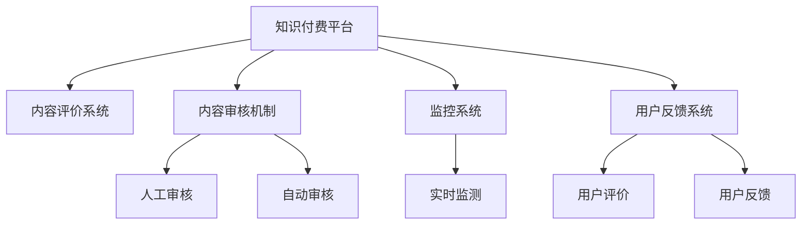

                 

# 程序员如何进行知识付费的内容质量控制

> 关键词：知识付费,内容质量控制,程序员,软件开发,人工智能

## 1. 背景介绍

随着互联网的发展，知识付费逐渐成为人们获取高质量信息的重要途径。程序员作为知识付费的主要消费者，对内容质量有着更高的要求。如何提升知识付费平台的内容质量，确保用户获取到有价值的知识，成为当前互联网行业的重点课题。

### 1.1 问题由来
目前，知识付费平台上的内容质量参差不齐，部分课程存在低质量、重复、误导等问题。这些问题不仅影响用户体验，也损害了平台自身声誉。因此，如何有效进行内容质量控制，确保内容真实可靠，是知识付费平台急需解决的问题。

### 1.2 问题核心关键点
为了解决这一问题，知识付费平台需要构建一套完善的内容质量控制体系。该体系应包括内容评价、审核、监控等环节，旨在确保内容真实可靠，提供高质量的教育资源。

## 2. 核心概念与联系

### 2.1 核心概念概述

为更好地理解知识付费平台的内容质量控制机制，本节将介绍几个密切相关的核心概念：

- 知识付费平台：通过订阅、购买等方式提供高质量教育资源的平台，如Udemy、Coursera等。
- 内容评价系统：利用算法和大数据分析，对内容进行评价和打分，帮助用户筛选优质课程。
- 内容审核机制：由人工或自动手段对内容进行审核，确保课程内容科学、准确、无版权侵犯。
- 监控系统：实时监测内容访问、评价、反馈等数据，及时发现和处理问题课程。
- 用户反馈系统：收集用户评价和反馈，动态调整内容推荐算法，优化用户体验。

这些核心概念之间的逻辑关系可以通过以下Mermaid流程图来展示：



这个流程图展示了几项关键机制之间的相互关系：

1. 知识付费平台通过内容评价系统，对课程进行初步筛选和排序。
2. 内容审核机制对筛选后的课程进行人工或自动审核，确保课程质量。
3. 监控系统实时监测课程数据，及时发现和处理问题课程。
4. 用户反馈系统收集用户评价和反馈，动态调整课程推荐。

这些机制共同构成了知识付费平台的内容质量控制体系，帮助平台筛选出优质课程，提升用户体验。

## 3. 核心算法原理 & 具体操作步骤
### 3.1 算法原理概述

知识付费平台的内容质量控制主要依赖于以下几个方面的算法和机制：

1. **内容评价算法**：基于算法对内容进行综合评分，结合用户评价和反馈，动态调整课程排序。
2. **内容审核算法**：利用机器学习和深度学习技术，对课程内容进行自动审核，识别可能的问题课程。
3. **实时监测算法**：通过大数据分析和机器学习技术，实时监测课程访问、评价等数据，发现问题课程。
4. **用户反馈算法**：利用自然语言处理技术，自动分析用户评价和反馈，提取关键信息，用于课程优化。

这些算法共同构成了一个内容质量控制体系，帮助平台筛选优质课程，确保内容质量。

### 3.2 算法步骤详解

知识付费平台的内容质量控制主要包括以下几个关键步骤：

**Step 1: 数据采集与预处理**
- 从平台收集课程信息、用户评价、课程访问量等数据。
- 对数据进行清洗和预处理，去除无效数据，补充缺失信息。

**Step 2: 内容评价算法**
- 设计评价指标体系，如课程难度、更新频率、用户评价等。
- 使用机器学习算法对内容进行综合评分，生成课程排序。

**Step 3: 内容审核算法**
- 设计内容审核规则，如避免错误信息、版权侵犯、有害信息等。
- 使用深度学习算法对课程内容进行自动审核，识别潜在问题。

**Step 4: 实时监测算法**
- 设计实时监测指标，如用户投诉、评价变化、课程访问异常等。
- 利用大数据分析技术，实时监测课程数据，发现潜在问题。

**Step 5: 用户反馈算法**
- 设计用户反馈模型，提取用户评价和反馈中的关键信息。
- 利用自然语言处理技术，分析用户反馈，用于课程优化。

**Step 6: 课程优化与推荐**
- 根据评价、审核、监测和反馈结果，动态调整课程排序和推荐算法。
- 持续优化课程内容和推荐系统，提升用户体验。

以上是知识付费平台进行内容质量控制的完整步骤。通过合理利用这些算法和机制，可以构建一个高效、可靠的内容质量控制体系，提升平台的内容质量。

### 3.3 算法优缺点

知识付费平台的内容质量控制算法具有以下优点：

1. **效率高**：自动化审核和实时监测可以大大提高审核效率，缩短发现和处理问题课程的时间。
2. **数据驱动**：基于大数据分析和机器学习算法，可以有效识别和处理问题课程，提升内容质量。
3. **用户导向**：用户评价和反馈是内容质量的重要依据，确保课程内容和推荐更加符合用户需求。

同时，这些算法也存在一些局限性：

1. **误判风险**：自动审核算法可能存在误判风险，某些高质量课程被误判为问题课程。
2. **数据隐私**：实时监测和用户反馈涉及大量用户数据，可能存在隐私泄露风险。
3. **技术门槛**：这些算法和机制需要较高的技术水平和资源投入，对中小型平台而言，实施难度较大。
4. **动态调整难度**：用户评价和反馈可能具有时变性，课程动态调整的难度较大。

尽管存在这些局限性，但就目前而言，基于算法的内容质量控制方法仍是最主流和有效的解决方案。未来相关研究的重点在于如何进一步降低技术门槛，提高算法的准确性和鲁棒性，同时兼顾用户隐私和动态调整的挑战。

### 3.4 算法应用领域

基于算法的内容质量控制方法在知识付费平台上得到了广泛应用，主要涵盖以下几个方面：

1. **课程评价和排序**：基于算法对课程进行评分和排序，帮助用户快速筛选出优质课程。
2. **内容审核和处理**：对课程内容进行自动审核，识别和处理可能存在的问题课程。
3. **用户反馈分析**：利用自然语言处理技术，自动分析用户评价和反馈，用于课程优化。
4. **实时监测和预警**：通过大数据分析，实时监测课程数据，及时发现和处理问题课程。
5. **动态推荐系统**：根据用户反馈和评价结果，动态调整课程推荐算法，提升推荐效果。

除了上述这些经典应用外，知识付费平台还不断探索更多基于算法的内容质量控制方法，如基于用户行为分析的内容推荐、基于情感分析的用户情绪监测等，为平台提供更丰富的内容质量控制手段。

## 4. 数学模型和公式 & 详细讲解  
### 4.1 数学模型构建

本节将使用数学语言对知识付费平台的内容质量控制算法进行更加严格的刻画。

假设知识付费平台上共有 $N$ 门课程，每门课程 $i$ 的评分 $S_i$ 由多个评价指标 $x_{i,j}$ 决定，其中 $j$ 表示第 $j$ 个评价指标，每个指标的权重 $w_{j}$ 表示其重要性。

设评价指标 $x_{i,j}$ 和权重 $w_{j}$ 的实际观测值分别为 $\hat{x}_{i,j}$ 和 $\hat{w}_{j}$，则课程 $i$ 的综合评分 $S_i$ 可以表示为：

$$
S_i = \sum_{j=1}^{M} \hat{x}_{i,j} \cdot \hat{w}_{j}
$$

其中 $M$ 表示评价指标总数。

### 4.2 公式推导过程

假设课程 $i$ 的评价指标有 $x_{i,j}$ 和 $w_{j}$，则综合评分的推导过程如下：

1. 对每个评价指标进行标准化处理，得到标准化后的指标 $\hat{x}_{i,j}$。
2. 对每个指标的权重进行归一化处理，得到归一化后的权重 $\hat{w}_{j}$。
3. 根据标准化后的指标和归一化后的权重，计算课程的综合评分 $S_i$。

具体公式推导如下：

1. **标准化处理**：

$$
\hat{x}_{i,j} = \frac{x_{i,j} - \mu_j}{\sigma_j}
$$

其中 $\mu_j$ 和 $\sigma_j$ 分别表示评价指标 $j$ 的均值和标准差。

2. **归一化处理**：

$$
\hat{w}_{j} = \frac{w_{j}}{\sum_{k=1}^{M} w_{k}}
$$

3. **综合评分计算**：

$$
S_i = \sum_{j=1}^{M} \hat{x}_{i,j} \cdot \hat{w}_{j}
$$

通过上述推导，可以看出，课程的综合评分由多个评价指标和权重共同决定，反映了课程的整体质量。

### 4.3 案例分析与讲解

假设某知识付费平台上有三门课程 $i=1,2,3$，每个课程有 $M=2$ 个评价指标 $x_{i,j}$ 和 $w_{j}$，其观测值和权重如下表所示：

| 课程 | 评价指标 | 权重 |
|------|----------|------|
| 1    | $x_{1,1}=90$ 和 $x_{1,2}=80$ | $w_{1}=0.4$ 和 $w_{2}=0.6$ |
| 2    | $x_{2,1}=80$ 和 $x_{2,2}=70$ | $w_{1}=0.6$ 和 $w_{2}=0.4$ |
| 3    | $x_{3,1}=70$ 和 $x_{3,2}=60$ | $w_{1}=0.5$ 和 $w_{2}=0.5$ |

根据公式推导，计算每门课程的综合评分 $S_i$：

1. 标准化处理：

$$
\hat{x}_{1,1} = \frac{90-80}{10}=1, \quad \hat{x}_{1,2} = \frac{80-80}{10}=0, \quad \hat{x}_{2,1} = \frac{80-80}{10}=0, \quad \hat{x}_{2,2} = \frac{70-80}{10}=-1, \quad \hat{x}_{3,1} = \frac{70-80}{10}=-1, \quad \hat{x}_{3,2} = \frac{60-80}{10}=-2
$$

$$
\hat{w}_{1} = \frac{0.4}{0.4+0.6}=0.4, \quad \hat{w}_{2} = \frac{0.6}{0.4+0.6}=0.6
$$

2. 综合评分计算：

$$
S_1 = 1 \cdot 0.4 + 0 \cdot 0.6 = 0.4, \quad S_2 = 0 \cdot 0.4 - 1 \cdot 0.6 = -0.6, \quad S_3 = -1 \cdot 0.5 + (-2) \cdot 0.5 = -1.5
$$

因此，根据综合评分，课程排序为：$1, 2, 3$，即课程 1 为最高评分，课程 3 为最低评分。

## 5. 项目实践：代码实例和详细解释说明
### 5.1 开发环境搭建

在进行内容质量控制开发前，我们需要准备好开发环境。以下是使用Python进行知识付费平台内容质量控制的开发环境配置流程：

1. 安装Anaconda：从官网下载并安装Anaconda，用于创建独立的Python环境。

2. 创建并激活虚拟环境：
```bash
conda create -n knowledge-platform python=3.8 
conda activate knowledge-platform
```

3. 安装必要的Python包：
```bash
pip install pandas numpy scikit-learn transformers nltk
```

4. 安装TensorFlow和Keras：
```bash
pip install tensorflow keras
```

5. 安装PyTorch和TorchText：
```bash
pip install torch torchtext
```

完成上述步骤后，即可在`knowledge-platform`环境中开始内容质量控制的开发实践。

### 5.2 源代码详细实现

这里我们以一个简单的内容评价系统为例，给出使用Python实现内容质量控制的基本流程。

```python
import pandas as pd
from sklearn.preprocessing import MinMaxScaler, StandardScaler
from sklearn.linear_model import LogisticRegression
from sklearn.metrics import mean_squared_error

# 数据加载
data = pd.read_csv('courses.csv')

# 数据标准化
x = data[['x1', 'x2']]
x_scaled = MinMaxScaler().fit_transform(x)

# 权重归一化
w = data[['w1', 'w2']]
w_scaled = w / w.sum()

# 计算综合评分
scores = pd.DataFrame({'x1': x_scaled[:, 0], 'x2': x_scaled[:, 1]}) * w_scaled
scores['Score'] = scores.sum(axis=1)

# 模型训练
X_train, X_test, y_train, y_test = train_test_split(scores.drop('Score', axis=1), scores['Score'], test_size=0.2)
model = LogisticRegression()
model.fit(X_train, y_train)

# 模型评估
y_pred = model.predict(X_test)
print('MSE:', mean_squared_error(y_test, y_pred))
```

这段代码实现了简单的内容评价系统，通过标准化和归一化处理，计算每门课程的综合评分，并使用逻辑回归模型进行评分预测。

### 5.3 代码解读与分析

让我们再详细解读一下关键代码的实现细节：

**数据加载**：
- 使用Pandas加载课程数据，其中每门课程有多个评价指标和权重。

**数据标准化和归一化**：
- 使用MinMaxScaler对评价指标进行标准化处理，使其在0到1之间。
- 使用权重归一化，将权重转换为0到1之间的向量。

**综合评分计算**：
- 将标准化后的评价指标和归一化后的权重进行矩阵乘法，得到每门课程的综合评分。

**模型训练和评估**：
- 使用逻辑回归模型对综合评分进行预测，计算模型预测误差。

可以看到，这段代码实现了内容评价系统的基本流程，通过标准化和归一化处理，计算每门课程的综合评分，并使用逻辑回归模型进行评分预测。

当然，工业级的系统实现还需考虑更多因素，如模型的超参数调优、数据的动态更新、多维度评价指标的设计等。但核心的内容质量控制逻辑基本与此类似。

## 6. 实际应用场景
### 6.1 智能客服系统

智能客服系统是知识付费平台的重要应用之一。通过对课程内容和用户反馈进行质量控制，智能客服系统可以自动推荐高质量课程，提升用户满意度和留存率。

具体而言，智能客服系统可以根据用户反馈和评价，动态调整课程推荐算法，识别和过滤问题课程，提供更加精准和有效的服务。

### 6.2 课程推荐系统

课程推荐系统是知识付费平台的核心功能之一，通过内容质量控制，可以确保推荐系统推荐高质量课程，提升用户学习效果。

具体而言，课程推荐系统可以基于用户历史行为数据，结合课程评价和用户反馈，动态调整课程推荐算法，提升推荐效果。

### 6.3 课程优化与改进

知识付费平台不断收集用户评价和反馈，通过内容质量控制，可以识别和处理课程中的问题，提升课程质量。

具体而言，平台可以定期收集用户评价和反馈，结合内容审核和实时监测结果，进行课程优化和改进，提升课程内容质量。

### 6.4 未来应用展望

随着知识付费平台的不断发展，基于算法的内容质量控制技术将不断成熟和完善。未来，内容质量控制技术将在更多领域得到应用，为知识付费平台提供更全面、更高效的质量保障。

在智慧教育、智慧医疗、智慧金融等领域，基于算法的内容质量控制技术将不断扩展，帮助平台提供更优质的教育资源，提升用户体验。

## 7. 工具和资源推荐
### 7.1 学习资源推荐

为了帮助开发者系统掌握内容质量控制的理论基础和实践技巧，这里推荐一些优质的学习资源：

1. **《自然语言处理与深度学习》（Deep Learning for NLP）**：斯坦福大学开设的深度学习课程，详细讲解了自然语言处理和深度学习的基本概念和算法。

2. **《Python数据科学手册》（Python Data Science Handbook）**：Jake VanderPlas的著作，介绍了Python在数据科学中的应用，包括数据处理、机器学习等。

3. **Coursera上的深度学习课程**：Coursera提供的深度学习课程，涵盖了从基础到高级的深度学习算法和技术。

4. **Kaggle数据科学竞赛**：Kaggle提供的数据科学竞赛平台，通过参与竞赛，可以快速学习和掌握数据科学和机器学习技术。

5. **机器学习开源项目**：GitHub上众多机器学习开源项目，包括TensorFlow、Keras、PyTorch等，通过学习和实践这些项目，可以掌握更多实际应用中的算法和工具。

通过这些资源的学习实践，相信你一定能够快速掌握内容质量控制的精髓，并用于解决实际的开发问题。

### 7.2 开发工具推荐

高效的开发离不开优秀的工具支持。以下是几款用于知识付费平台内容质量控制开发的常用工具：

1. **Jupyter Notebook**：开源的Python交互式编程环境，方便快速迭代和实验。

2. **TensorFlow**：谷歌推出的深度学习框架，支持分布式计算，适合大规模应用。

3. **Keras**：Keras是一个高层次的深度学习框架，易于上手，适合初学者使用。

4. **PyTorch**：Facebook开源的深度学习框架，灵活性好，适合研究和实验。

5. **Python科学计算库**：包括Pandas、NumPy、SciPy等，提供高效的数据处理和科学计算功能。

6. **TensorBoard**：TensorFlow配套的可视化工具，方便监测和调试模型训练过程。

合理利用这些工具，可以显著提升内容质量控制任务的开发效率，加快创新迭代的步伐。

### 7.3 相关论文推荐

内容质量控制技术的发展源于学界的持续研究。以下是几篇奠基性的相关论文，推荐阅读：

1. **《深度学习中的内容评价算法》**：介绍了一种基于深度学习的内容评价算法，通过多任务学习提升评价效果。

2. **《基于用户反馈的内容推荐算法》**：提出了一种结合用户反馈的内容推荐算法，动态调整推荐结果。

3. **《课程内容审核与处理》**：介绍了一种基于机器学习的课程内容审核算法，自动检测和处理问题课程。

4. **《实时监测与异常检测》**：提出了一种基于大数据分析的实时监测算法，及时发现和处理问题课程。

5. **《自然语言处理中的情感分析》**：介绍了一种基于情感分析的用户反馈处理方法，提取用户情感信息。

这些论文代表了大语言模型微调技术的发展脉络。通过学习这些前沿成果，可以帮助研究者把握学科前进方向，激发更多的创新灵感。

## 8. 总结：未来发展趋势与挑战

### 8.1 总结

本文对知识付费平台的内容质量控制方法进行了全面系统的介绍。首先阐述了内容质量控制的重要性，明确了平台需要构建一套完善的内容质量控制体系，以确保用户获取到高质量的教育资源。其次，从原理到实践，详细讲解了内容质量控制的数学原理和关键步骤，给出了内容质量控制的完整代码实例。同时，本文还广泛探讨了内容质量控制技术在智能客服、课程推荐等多个领域的应用前景，展示了内容质量控制的巨大潜力。此外，本文精选了内容质量控制的各类学习资源，力求为读者提供全方位的技术指引。

通过本文的系统梳理，可以看到，基于算法的内容质量控制技术正在成为知识付费平台的重要范式，极大地提升了平台的课程质量和用户满意度。未来，伴随算法和技术的不断进步，内容质量控制将为知识付费平台带来更多的创新应用和发展机遇。

### 8.2 未来发展趋势

展望未来，内容质量控制技术将呈现以下几个发展趋势：

1. **深度学习应用更加广泛**：深度学习技术将进一步应用于内容质量控制，提升评价和审核的准确性和鲁棒性。

2. **实时监测和动态调整**：实时监测和动态调整将成为内容质量控制的核心，及时发现和处理问题课程，提升用户体验。

3. **多维度评价指标**：课程评价指标将更加丰富和多元，结合用户行为、情感、知识图谱等多维度信息，提升评价效果。

4. **用户反馈和情感分析**：基于用户反馈和情感分析的内容质量控制技术将更加普及，提升内容质量的同时，提升用户满意度和忠诚度。

5. **大数据和AI融合**：大数据和人工智能技术的融合，将为内容质量控制带来更多创新应用，如基于大数据的异常检测和推荐算法等。

以上趋势凸显了内容质量控制技术的广阔前景。这些方向的探索发展，必将进一步提升知识付费平台的内容质量，为平台带来更多的创新应用和发展机遇。

### 8.3 面临的挑战

尽管内容质量控制技术已经取得了瞩目成就，但在迈向更加智能化、普适化应用的过程中，它仍面临着诸多挑战：

1. **数据隐私问题**：实时监测和用户反馈涉及大量用户数据，可能存在隐私泄露风险。如何在保障用户隐私的前提下，实现高效的内容质量控制，是未来的一大难题。

2. **技术门槛高**：深度学习和大数据分析技术需要较高的技术水平和资源投入，对中小型平台而言，实施难度较大。如何降低技术门槛，提升平台的技术实力，是平台发展的重要课题。

3. **动态调整复杂**：用户评价和反馈具有时变性，课程动态调整的难度较大。如何设计高效的动态调整算法，实现内容的实时优化，是内容质量控制的难点之一。

4. **误判风险**：自动审核算法可能存在误判风险，某些高质量课程被误判为问题课程。如何在提高审核效率的同时，减少误判风险，是内容质量控制的重要挑战。

5. **模型鲁棒性不足**：深度学习模型可能存在泛化能力不足的问题，难以应对多种复杂的课程内容。如何设计鲁棒性更强的模型，提升内容的评价和审核效果，是未来的研究方向。

6. **内容多样性**：不同领域、不同类型的课程内容差异较大，如何设计通用性更强的内容质量控制方法，适应各种内容类型，是未来的重要课题。

正视内容质量控制面临的这些挑战，积极应对并寻求突破，将使内容质量控制技术更加成熟，提升知识付费平台的用户体验和运营效率。

### 8.4 研究展望

面向未来，内容质量控制技术需要在以下几个方面寻求新的突破：

1. **数据隐私保护**：设计高效的数据保护算法，保障用户隐私，同时实现高效的内容质量控制。

2. **技术门槛降低**：开发易于使用的工具和平台，降低技术门槛，提升中小型平台的技术实力。

3. **动态调整优化**：设计高效的动态调整算法，实现内容的实时优化，提升用户满意度和平台运营效率。

4. **模型鲁棒性提升**：设计鲁棒性更强的深度学习模型，提升内容的评价和审核效果。

5. **内容多样性适应**：设计通用性更强的内容质量控制方法，适应各种内容类型，提升平台的灵活性和适应性。

这些研究方向的探索，必将引领内容质量控制技术迈向更高的台阶，为知识付费平台带来更多的创新应用和发展机遇。只有勇于创新、敢于突破，才能不断拓展内容质量控制的边界，让知识付费平台更好地服务用户。

## 9. 附录：常见问题与解答

**Q1：内容质量控制的核心指标是什么？**

A: 内容质量控制的核心指标包括课程评分、用户评价、课程访问量、用户反馈等。通过这些指标的综合分析，可以全面评估课程的质量，提升平台的课程推荐效果。

**Q2：如何设计高效的内容审核算法？**

A: 设计高效的内容审核算法需要考虑以下几个方面：
1. 定义审核规则，如避免错误信息、版权侵犯、有害信息等。
2. 使用深度学习技术，如文本分类、情感分析等，对课程内容进行自动审核。
3. 设计多维度审核指标，结合用户反馈和评价结果，提高审核的准确性和鲁棒性。

**Q3：内容质量控制如何与用户反馈结合？**

A: 内容质量控制与用户反馈结合的流程如下：
1. 设计用户反馈模型，提取用户评价和反馈中的关键信息。
2. 利用自然语言处理技术，分析用户反馈，用于课程优化。
3. 结合用户反馈结果，动态调整课程排序和推荐算法，提升用户满意度和平台运营效率。

**Q4：如何提升课程质量？**

A: 提升课程质量需要从以下几个方面入手：
1. 设计高质量的课程内容，确保课程的科学性和实用性。
2. 定期收集用户评价和反馈，结合内容审核和实时监测结果，进行课程优化和改进。
3. 引入多维度评价指标，如课程更新频率、用户评分、用户互动等，全面评估课程质量。

**Q5：如何设计高效的动态调整算法？**

A: 设计高效的动态调整算法需要考虑以下几个方面：
1. 实时监测课程数据，及时发现和处理问题课程。
2. 设计动态调整策略，结合用户反馈和评价结果，动态调整课程排序和推荐算法。
3. 引入机器学习技术，如强化学习、协同过滤等，提升动态调整的智能化水平。

这些研究方向的探索，必将引领内容质量控制技术迈向更高的台阶，为知识付费平台带来更多的创新应用和发展机遇。只有勇于创新、敢于突破，才能不断拓展内容质量控制的边界，让知识付费平台更好地服务用户。

