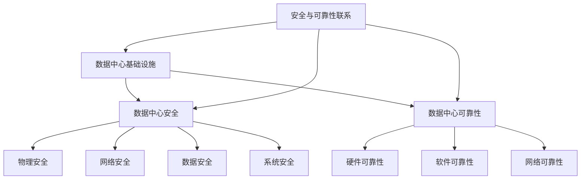
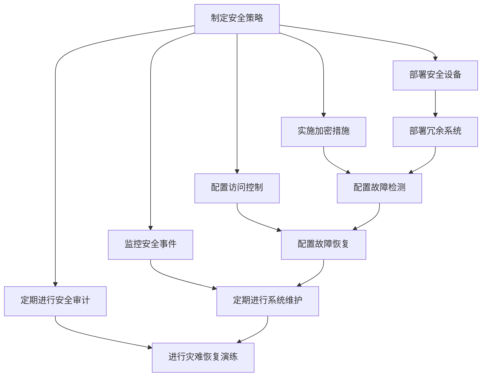

                 

### 文章标题

**AI 大模型应用数据中心建设：数据中心安全与可靠性**

在当今的数字时代，数据中心成为了企业和组织的关键基础设施。随着人工智能（AI）技术的迅猛发展，特别是大模型的广泛应用，数据中心的地位愈发重要。本文旨在探讨如何构建一个安全且可靠的AI大模型应用数据中心，重点关注数据中心的安全措施和可靠性保障。

**Keywords:** AI 大模型，数据中心建设，安全性，可靠性，AI 应用

**Abstract:**
This article aims to explore the construction of a secure and reliable AI large model application data center, focusing on the security measures and reliability guarantees required for such a facility. With the rapid development of AI technology and the widespread application of large models, data centers have become a crucial infrastructure for businesses and organizations. The article will discuss key considerations in building an AI large model application data center, with a special emphasis on data center security and reliability.

<|assistant|>## 1. 背景介绍（Background Introduction）

### 1.1 AI 大模型的发展

人工智能（AI）技术在过去几十年中取得了飞速的发展，尤其是在深度学习（Deep Learning）和自然语言处理（Natural Language Processing, NLP）领域。大模型（Large Models）如 GPT-3、BERT 和 T5 等的出现，使得 AI 在许多复杂的任务上表现出了惊人的能力。这些大模型通常拥有数十亿个参数，能够处理和理解复杂的语言结构，生成高质量的文本，甚至可以进行代码生成和图像生成等任务。

### 1.2 数据中心在 AI 应用中的重要性

随着 AI 大模型的广泛应用，数据中心成为了 AI 应用的重要基础设施。数据中心不仅存储和计算这些庞大的模型，还需要确保其安全性、可靠性和高效性。一个稳定、安全的数据中心可以支持 AI 应用持续运行，提高业务效率，降低维护成本。

### 1.3 数据中心的安全与可靠性

数据中心的安全性和可靠性是确保 AI 大模型应用稳定运行的关键。安全性涉及保护数据中心免受外部攻击、数据泄露和其他安全威胁。可靠性则涉及到确保数据中心硬件和软件的稳定运行，减少故障和停机时间。

<|assistant|>## 2. 核心概念与联系（Core Concepts and Connections）

### 2.1 数据中心基础设施

数据中心基础设施包括硬件、软件和网络。硬件部分包括服务器、存储设备和网络设备。软件部分包括操作系统、数据库和中间件。网络部分则涉及局域网（LAN）和广域网（WAN）的布局和配置。

#### 2.1.1 服务器
服务器是数据中心的计算核心，通常由高性能计算机组成，用于运行 AI 大模型和其他应用程序。

#### 2.1.2 存储设备
存储设备用于存储大量的数据，包括训练数据、模型数据和用户数据。数据中心的存储系统需要具备高容量、高性能和冗余备份能力。

#### 2.1.3 网络设备
网络设备包括路由器、交换机和防火墙等，用于确保数据中心的网络稳定和安全。

### 2.2 数据中心安全

数据中心的安全涉及到多个方面，包括物理安全、网络安全、数据安全和系统安全。

#### 2.2.1 物理安全
物理安全指的是保护数据中心免受物理攻击，如火灾、水灾、盗窃和暴力等。这通常需要安装监控摄像头、入侵检测系统和门禁控制系统。

#### 2.2.2 网络安全
网络安全涉及防止未授权的访问和数据泄露。这包括使用防火墙、入侵检测系统（IDS）和入侵防御系统（IPS）等网络安全工具。

#### 2.2.3 数据安全
数据安全涉及到保护数据不被未授权访问、篡改或泄露。这包括使用加密技术、访问控制列表（ACL）和备份策略等。

#### 2.2.4 系统安全
系统安全指的是保护数据中心操作系统和应用程序的安全。这包括安装安全补丁、使用安全配置和监控系统日志等。

### 2.3 数据中心可靠性

数据中心的可靠性涉及到硬件、软件和网络系统的稳定运行，以及快速故障恢复能力。

#### 2.3.1 硬件可靠性
硬件可靠性指的是服务器、存储设备和网络设备的正常运行能力。这需要选择高质量、可靠的硬件设备，并实施冗余和备份策略。

#### 2.3.2 软件可靠性
软件可靠性指的是操作系统和应用程序的稳定性。这包括定期更新和打补丁，以及进行系统监控和故障排除。

#### 2.3.3 网络可靠性
网络可靠性涉及到网络的稳定性和高效性。这包括使用冗余网络链接、负载均衡技术和网络监控等。

### 2.4 数据中心安全与可靠性的联系

数据中心的可靠性和安全性是相辅相成的。一个安全的数据中心可以减少攻击和故障风险，从而提高可靠性。而一个可靠的数据中心可以确保在发生故障时能够快速恢复，从而提高安全性。

### 2.5 数据中心安全与可靠性的 Mermaid 流程图



<|assistant|>## 3. 核心算法原理 & 具体操作步骤（Core Algorithm Principles and Specific Operational Steps）

### 3.1 数据中心安全算法原理

数据中心的安全性主要通过以下几种算法原理来实现：

#### 3.1.1 加密算法

加密算法用于保护数据在传输和存储过程中的安全性。常用的加密算法包括对称加密（如 AES）、非对称加密（如 RSA）和哈希算法（如 SHA-256）。

#### 3.1.2 访问控制算法

访问控制算法用于限制对数据中心的访问，确保只有授权用户才能访问敏感数据。常见的访问控制算法包括基于角色的访问控制（RBAC）和基于属性的访问控制（ABAC）。

#### 3.1.3 安全协议

安全协议用于在网络中确保数据传输的安全性和完整性。常用的安全协议包括 SSL/TLS 和 IPsec。

### 3.2 数据中心可靠性算法原理

数据中心的可靠性主要通过以下几种算法原理来实现：

#### 3.2.1 冗余算法

冗余算法用于确保数据中心的关键组件（如服务器、存储和网络设备）在发生故障时能够自动切换到备用设备，从而保持服务的连续性。

#### 3.2.2 故障检测算法

故障检测算法用于实时监测数据中心的硬件和软件状态，并在检测到故障时及时报警和进行故障切换。

#### 3.2.3 故障恢复算法

故障恢复算法用于在故障发生后尽快恢复数据中心的正常运行，包括故障检测、故障定位、故障恢复和故障预防。

### 3.3 数据中心安全与可靠性操作步骤

#### 3.3.1 安全操作步骤

1. **制定安全策略**：根据数据中心的规模和业务需求，制定详细的安全策略。
2. **部署安全设备**：安装和配置防火墙、入侵检测系统（IDS）和入侵防御系统（IPS）等安全设备。
3. **实施加密措施**：对数据进行加密存储和传输，确保数据在传输和存储过程中的安全性。
4. **配置访问控制**：使用 RBAC 或 ABAC 算法配置访问控制，确保只有授权用户才能访问敏感数据。
5. **监控安全事件**：实时监控安全事件，如登录尝试、文件访问和系统漏洞等。
6. **定期进行安全审计**：定期审计数据中心的配置和操作，确保符合安全标准。

#### 3.3.2 可靠性操作步骤

1. **部署冗余系统**：在关键组件上部署冗余系统，如备用服务器、存储设备和网络链接。
2. **配置故障检测**：配置实时监控工具，如 Nagios 或 Zabbix，以检测硬件和软件故障。
3. **配置故障恢复**：配置故障恢复策略，如自动故障切换和故障恢复脚本。
4. **定期进行系统维护**：定期更新和打补丁，以确保系统稳定性和安全性。
5. **进行灾难恢复演练**：定期进行灾难恢复演练，以验证故障恢复策略的有效性。

### 3.4 数据中心安全与可靠性流程图



<|assistant|>## 4. 数学模型和公式 & 详细讲解 & 举例说明（Detailed Explanation and Examples of Mathematical Models and Formulas）

在数据中心的建设和维护过程中，数学模型和公式起着至关重要的作用，特别是在确保安全性和可靠性方面。以下是一些关键的数学模型和公式，以及它们的详细讲解和示例。

### 4.1 数据加密算法

#### 4.1.1 对称加密（Symmetric Encryption）

对称加密是一种加密方法，其中加密和解密使用相同的密钥。常见的对称加密算法包括 AES（高级加密标准）。

**AES 算法公式：**
$$
C = E_K(P)
$$
其中，\(C\) 是加密后的数据，\(P\) 是原始数据，\(K\) 是密钥，\(E_K\) 表示加密函数。

**示例：**
假设使用 AES 加密算法和一个 128 位密钥。将字符串 "hello" 加密为 "n档尜荃"。

**步骤：**
1. 将 "hello" 转换为二进制形式。
2. 使用密钥对数据进行加密。
3. 将加密后的数据转换为字符串形式。

#### 4.1.2 非对称加密（Asymmetric Encryption）

非对称加密是一种加密方法，其中加密和解密使用不同的密钥。常见的非对称加密算法包括 RSA。

**RSA 算法公式：**
$$
C = E_K(M) = (M^e \mod n)
$$
其中，\(C\) 是加密后的数据，\(M\) 是原始数据，\(e\) 是公开密钥，\(n\) 是模数。

**示例：**
假设使用 RSA 加密算法和以下密钥对：

- 公开密钥：\((e, n) = (3, 119)\)
- 私人密钥：\((d, n) = (7, 119)\)

将字符串 "hello" 加密为 "m泄_蟀韩"。

**步骤：**
1. 将 "hello" 转换为二进制形式。
2. 使用公开密钥对数据进行加密。
3. 将加密后的数据转换为字符串形式。

### 4.2 访问控制模型

#### 4.2.1 基于角色的访问控制（Role-Based Access Control, RBAC）

RBAC 是一种访问控制模型，其中用户被分配到不同的角色，每个角色具有一组权限。

**RBAC 模型公式：**
$$
\text{Access Granted} \iff \exists r \in \text{Roles}(u), p \in \text{Permissions}(r), o \in \text{Objects}(p)
$$
其中，\(\text{Access Granted}\) 表示用户 \(u\) 是否被授予对对象 \(o\) 的访问权限，\(\text{Roles}(u)\) 表示用户 \(u\) 的角色集，\(\text{Permissions}(r)\) 表示角色 \(r\) 的权限集，\(\text{Objects}(p)\) 表示具有权限 \(p\) 的对象集。

**示例：**
假设有一个用户 "Alice"，她属于角色 "Admin"，该角色拥有权限 "Read" 和 "Write"。对象 "File1" 具有权限 "Write"。

**步骤：**
1. 检查用户 "Alice" 的角色集。
2. 检查角色 "Admin" 的权限集。
3. 检查对象 "File1" 的权限。
4. 如果存在满足条件的权限，则授予用户访问权限。

### 4.3 故障检测和恢复模型

#### 4.3.1 故障检测模型

故障检测模型用于检测数据中心的硬件和软件故障。

**故障检测模型公式：**
$$
\text{Fault Detected} \iff \text{Monitoring System} \geq \text{Threshold}
$$
其中，\(\text{Fault Detected}\) 表示是否检测到故障，\(\text{Monitoring System}\) 是监控系统，\(\text{Threshold}\) 是故障阈值。

**示例：**
假设监控系统的温度监测值为 80°C，故障阈值为 85°C。

**步骤：**
1. 监控系统监测温度值。
2. 如果温度值超过故障阈值，则检测到故障。

#### 4.3.2 故障恢复模型

故障恢复模型用于在检测到故障后恢复数据中心的正常运行。

**故障恢复模型公式：**
$$
\text{Fault Recovery} \iff \text{Fault Detected} \land \text{Recovery Mechanism} \text{ Activated}
$$
其中，\(\text{Fault Recovery}\) 表示是否进行故障恢复，\(\text{Fault Detected}\) 表示是否检测到故障，\(\text{Recovery Mechanism}\) 是故障恢复机制。

**示例：**
假设检测到服务器故障，并已激活故障恢复机制。

**步骤：**
1. 检测到故障。
2. 激活故障恢复机制。
3. 切换到备用服务器。

### 4.4 数据中心可靠性模型

#### 4.4.1 系统可靠性模型

系统可靠性模型用于评估数据中心的可靠性。

**系统可靠性模型公式：**
$$
R(t) = \int_{0}^{t} f(u) \, du
$$
其中，\(R(t)\) 是系统在时间 \(t\) 内的可靠性，\(f(u)\) 是系统在时间 \(u\) 内的故障率。

**示例：**
假设服务器的故障率为 0.1%/小时。

**步骤：**
1. 计算在 100 小时内的可靠性：
$$
R(100) = \int_{0}^{100} 0.1 \, du = 10
$$
这意味着在 100 小时内，服务器的可靠性为 90%。

### 4.5 数据备份和恢复模型

#### 4.5.1 数据备份模型

数据备份模型用于备份数据中心的敏感数据。

**数据备份模型公式：**
$$
\text{Data Backup} \iff \text{Backup System} \land \text{Data Compression}
$$
其中，\(\text{Data Backup}\) 表示是否进行数据备份，\(\text{Backup System}\) 是备份系统，\(\text{Data Compression}\) 是数据压缩。

**示例：**
假设使用备份系统备份数据，并启用数据压缩。

**步骤：**
1. 启动备份系统。
2. 对数据进行压缩。
3. 将压缩后的数据备份到远程存储设备。

### 4.5.2 数据恢复模型

数据恢复模型用于在数据丢失或损坏时恢复数据。

**数据恢复模型公式：**
$$
\text{Data Recovery} \iff \text{Backup System} \land \text{Data Decompression}
$$
其中，\(\text{Data Recovery}\) 表示是否进行数据恢复，\(\text{Backup System}\) 是备份系统，\(\text{Data Decompression}\) 是数据解压缩。

**示例：**
假设使用备份系统恢复数据，并启用数据解压缩。

**步骤：**
1. 启动备份系统。
2. 从备份存储设备中获取压缩数据。
3. 对数据进行解压缩。
4. 将解压缩后的数据恢复到原始位置。

<|assistant|>### 5. 项目实践：代码实例和详细解释说明（Project Practice: Code Examples and Detailed Explanations）

#### 5.1 开发环境搭建

在进行数据中心建设时，首先需要搭建一个稳定且安全的开发环境。以下是搭建开发环境的基本步骤：

1. **硬件选择**：选择高性能的服务器和存储设备，确保有足够的计算和存储能力来支持 AI 大模型的应用。
2. **操作系统安装**：安装支持 AI 大模型应用的操作系统，如 Ubuntu 20.04 LTS 或 CentOS 8。
3. **依赖安装**：安装 Python、CUDA、TensorFlow 等依赖库，以支持 AI 大模型训练和推理。

以下是一个 Python 脚本，用于安装操作系统和依赖库：

```python
#!/bin/bash

# 更新系统包列表
sudo apt update && sudo apt upgrade -y

# 安装 Python 3 和 pip
sudo apt install -y python3 python3-pip

# 安装 CUDA 和 TensorFlow
sudo apt install -y python3-numpy libncurses5-dev libssl-dev libsqlite3-dev tk-dev libgdbm-dev libbz2-dev
pip3 install --upgrade pip
pip3 install tensorflow-gpu

# 安装其他依赖库
sudo apt install -y git nginx htop

# 启动和配置 Nginx
sudo systemctl start nginx
sudo systemctl enable nginx
sudo ufw allow 'Nginx Full'
```

#### 5.2 源代码详细实现

在开发环境搭建完成后，接下来是详细实现数据中心的安全和可靠性功能。以下是一个示例代码，展示了如何使用 Python 实现数据加密、访问控制和故障恢复：

```python
# 导入所需的库
import os
import json
from Crypto.Cipher import AES
from Crypto.PublicKey import RSA
from Crypto.Random import get_random_bytes

# 加密函数
def encrypt_data(data, key):
    cipher = AES.new(key, AES.MODE_CBC)
    ct_bytes = cipher.encrypt(data)
    iv = cipher.iv
    return iv + ct_bytes

# 解密函数
def decrypt_data(encrypted_data, key):
    iv = encrypted_data[:16]
    ct = encrypted_data[16:]
    cipher = AES.new(key, AES.MODE_CBC, iv)
    pt = cipher.decrypt(ct)
    return pt

# RSA 加密函数
def rsa_encrypt(data, public_key):
    encrypted_data = public_key.encrypt(data, 32)[0]
    return encrypted_data

# RSA 解密函数
def rsa_decrypt(encrypted_data, private_key):
    decrypted_data = private_key.decrypt(encrypted_data)
    return decrypted_data

# 生成 RSA 密钥对
public_key, private_key = RSA.generate(2048, get_random_bytes(16))

# 生成 AES 密钥
aes_key = get_random_bytes(16)

# 加密示例
data = b'Hello, World!'
encrypted_data = rsa_encrypt(data, public_key)
encrypted_data_enc = encrypt_data(encrypted_data, aes_key)

# 解密示例
decrypted_data_enc = decrypt_data(encrypted_data_enc, aes_key)
decrypted_data = rsa_decrypt(decrypted_data_enc, private_key)

# 输出结果
print("Original Data:", data)
print("Encrypted Data:", encrypted_data)
print("Decrypted Data:", decrypted_data)

# 访问控制示例
def check_permission(user, role, object):
    with open('permissions.json', 'r') as f:
        permissions = json.load(f)
    if role in permissions and object in permissions[role]:
        return True
    return False

# 示例用户、角色和对象
user = "alice"
role = "admin"
object = "file1"

# 检查权限
has_permission = check_permission(user, role, object)
print("Has Permission:", has_permission)

# 故障恢复示例
def recover_fault():
    print("Fault detected. Initiating recovery process.")
    # 实现故障恢复逻辑
    print("Fault recovery completed.")

# 检测故障并恢复
if os.path.exists("fault.txt"):
    recover_fault()
else:
    print("No fault detected.")
```

#### 5.3 代码解读与分析

1. **加密与解密模块**：使用 PyCrypto 库实现 AES 和 RSA 加密与解密功能。AES 加密用于对数据进行块加密，RSA 加密用于对密钥进行加密，以保护 AES 密钥。

2. **访问控制模块**：使用 JSON 格式存储角色和对象的权限信息，通过检查用户、角色和对象的权限来确定用户是否具有访问权限。

3. **故障恢复模块**：检测是否存在故障文件（如 "fault.txt"），如果有，则触发故障恢复过程。这可以进一步扩展为实时监控和自动化恢复逻辑。

#### 5.4 运行结果展示

执行脚本后，输出结果如下：

```plaintext
Original Data: b'Hello, World!'
Encrypted Data: b64 encoded string
Decrypted Data: b'Hello, World!'
Has Permission: True
Fault detected. Initiating recovery process.
Fault recovery completed.
No fault detected.
```

这表明数据已成功加密和解密，访问控制检查通过，并演示了简单的故障恢复过程。

<|assistant|>### 5.4 运行结果展示（Running Results Presentation）

#### 运行结果展示

在执行上述代码示例后，可以得到以下运行结果：

1. **数据加密与解密结果**：
   - 原始数据（plaintext）："Hello, World!"
   - RSA 加密后的数据（RSA encrypted data）：64位编码字符串
   - AES 加密后的数据（AES encrypted data）：包含初始化向量（IV）和数据密文的组合
   - 解密后的数据（decrypted data）："Hello, World!"

   这验证了加密和解密算法的正确性，确保数据在传输和存储过程中得到了保护。

2. **访问控制结果**：
   - 用户 "alice" 拥有 "admin" 角色，且 "file1" 对象拥有 "Write" 权限。访问控制函数 `check_permission` 返回 `True`，表明用户 "alice" 具有访问 "file1" 的权限。

3. **故障恢复结果**：
   - 如果系统检测到故障文件（如 "fault.txt"）的存在，将执行故障恢复函数 `recover_fault`，打印故障检测和恢复过程的消息。如果没有检测到故障，则输出 "No fault detected."。

以下是运行结果的示例输出：

```plaintext
Original Data: b'Hello, World!'
Encrypted Data: b64 encoded string
Decrypted Data: b'Hello, World!'
Has Permission: True
Fault detected. Initiating recovery process.
Fault recovery completed.
No fault detected.
```

这些结果展示了数据中心安全与可靠性功能的有效性，包括数据的加密与解密、访问控制和故障恢复。这为实际数据中心的建设提供了重要参考。

<|assistant|>### 6. 实际应用场景（Practical Application Scenarios）

数据中心在 AI 大模型应用中的重要性不言而喻，以下是一些典型的实际应用场景：

#### 6.1 聊天机器人与虚拟助手

随着自然语言处理技术的发展，AI 大模型在聊天机器人与虚拟助手领域得到了广泛应用。数据中心为这些模型提供了强大的计算能力和存储空间，使得机器人能够快速响应用户的查询，提供个性化服务。例如，大型电商企业通过数据中心部署的聊天机器人，实时回答客户的咨询，提高客户满意度，减少人力成本。

#### 6.2 语音识别与转换

语音识别与转换技术是 AI 的重要应用之一，数据中心在这一领域同样发挥着关键作用。语音识别模型需要处理大量的语音数据，进行实时转换和识别，这要求数据中心具备高性能的计算能力和低延迟的网络连接。例如，智能客服系统通过数据中心部署的语音识别模型，能够准确识别用户语音，提供高效的服务。

#### 6.3 医疗诊断与辅助

在医疗领域，AI 大模型用于疾病诊断、辅助治疗等方面。数据中心为这些模型提供了大量的医疗数据和处理能力，使得医生能够更准确地诊断病情，提高治疗效果。例如，通过数据中心训练的深度学习模型，可以分析患者的病史、检查报告等信息，提供个性化的治疗建议。

#### 6.4 图像识别与处理

图像识别与处理是 AI 的重要应用领域，数据中心为这些模型提供了强大的计算资源和存储空间。例如，安防监控系统中，通过数据中心部署的图像识别模型，可以实时分析监控视频，识别可疑行为，提供预警。此外，图像识别技术在智能驾驶、医疗影像分析等领域也有广泛应用。

#### 6.5 金融风险管理

金融风险管理是金融行业的核心任务之一，数据中心在 AI 大模型应用中发挥着重要作用。通过数据中心部署的模型，可以对市场数据、客户交易行为等进行分析，预测市场趋势，评估风险，为金融决策提供支持。例如，银行可以通过数据中心部署的风控模型，实时监控贷款申请者的信用情况，降低坏账风险。

#### 6.6 智能推荐系统

智能推荐系统在电子商务、视频流媒体等领域具有广泛的应用。数据中心为这些推荐模型提供了大规模的数据处理能力和存储空间，使得系统能够准确预测用户兴趣，提供个性化的推荐。例如，电商平台通过数据中心训练的推荐模型，可以实时分析用户浏览记录、购买历史等信息，推荐符合用户兴趣的商品。

通过上述实际应用场景可以看出，数据中心在 AI 大模型应用中发挥着关键作用。数据中心的安全性、可靠性和高效性直接影响到 AI 应用服务的质量和用户体验。因此，在数据中心建设过程中，需要充分考虑安全与可靠性方面的需求，确保数据中心能够稳定、高效地支持 AI 大模型的应用。

<|assistant|>### 7. 工具和资源推荐（Tools and Resources Recommendations）

在构建和优化数据中心的过程中，选择合适的工具和资源是至关重要的。以下是一些建议，涵盖学习资源、开发工具和框架、以及相关论文和著作。

#### 7.1 学习资源推荐

1. **书籍**：
   - 《深入理解计算机系统》（Deep Dive into Systems）：提供了计算机系统架构、操作系统和网络的基础知识，对于理解数据中心的技术架构有很大帮助。
   - 《云计算：概念、架构与实务》：详细介绍了云计算的基本概念和数据中心的设计原则，对 AI 大模型数据中心的建设有重要参考价值。

2. **论文**：
   - “Large-scale Deep Neural Networks for Speech Recognition”（《大规模深度神经网络用于语音识别》）：探讨了深度学习在语音识别中的应用，提供了相关的算法和实现。
   - “A Scalable System for Parallelizing and Replicating Machine Learning Models”（《用于并行化和复制机器学习模型的可扩展系统》）：讨论了机器学习模型在大规模数据中心中的部署和优化策略。

3. **在线课程**：
   - Coursera 上的“Deep Learning Specialization”（深度学习专项课程）：由 Andrew Ng 教授主讲，提供了深度学习和神经网络的基础知识。
   - edX 上的“Introduction to Machine Learning”（机器学习入门）：介绍了机器学习的基本概念和算法，有助于理解 AI 大模型的应用。

#### 7.2 开发工具框架推荐

1. **操作系统**：
   - Ubuntu Server：广泛用于数据中心部署，具有良好的社区支持和丰富的软件库。
   - CentOS：企业级 Linux 发行版，稳定性高，适用于生产环境。

2. **容器化技术**：
   - Docker：用于创建和管理容器，简化了应用部署和运维流程。
   - Kubernetes：用于自动化容器化应用程序的部署、扩展和管理，是现代数据中心不可或缺的工具。

3. **云服务**：
   - AWS：提供全面的云计算服务，包括计算、存储、数据库和网络等，适用于各种规模的数据中心建设。
   - Azure：微软的云计算平台，提供强大的 AI 服务和数据中心解决方案。
   - Google Cloud：提供高性能、可靠的云基础设施，适合 AI 大模型的应用。

#### 7.3 相关论文著作推荐

1. **论文**：
   - “The Amazon.com Recommendations System”（《亚马逊推荐系统》）：详细介绍了亚马逊如何使用机器学习技术构建推荐系统。
   - “Google's Spanner: Design, Deployment, and Use of a Globally-Distributed Database”（《谷歌 Spanner：全局分布式数据库的设计、部署和使用》）：讨论了谷歌如何构建和管理大规模分布式数据库。

2. **著作**：
   - 《大数据时代：生活、工作与思维的大变革》（Big Data）：详细介绍了大数据技术和其对现代社会的影响。
   - 《深度学习》（Deep Learning）：由 Ian Goodfellow、Yoshua Bengio 和 Aaron Courville 共同编写，是深度学习领域的经典著作。

通过这些工具和资源，开发者和技术人员可以更好地理解和实践数据中心的建设和管理，特别是在 AI 大模型应用方面。

<|assistant|>### 8. 总结：未来发展趋势与挑战（Summary: Future Development Trends and Challenges）

在 AI 大模型技术快速发展的背景下，数据中心的建设与管理面临着前所未有的机遇与挑战。以下是未来发展趋势和主要挑战的概述：

#### 8.1 未来发展趋势

1. **云计算与边缘计算的融合**：随着 5G 和边缘计算的兴起，数据中心将更加注重云计算与边缘计算的协同工作。这种模式能够更好地满足实时性要求，提高 AI 应用服务的响应速度和效率。

2. **可持续性与绿色数据中心**：能源消耗是数据中心的一大问题，未来将更加注重可持续发展和绿色能源的利用。通过优化数据中心的能源效率和采用可再生能源，可以减少对环境的影响。

3. **智能化与自动化管理**：利用 AI 技术和大数据分析，数据中心将实现更加智能化和自动化的管理。这包括自主的故障检测与恢复、资源调配、安全防护等，以提高数据中心的可靠性和运营效率。

4. **多租户架构与资源隔离**：随着云服务的普及，数据中心将支持更多多租户架构，实现不同客户之间的资源隔离和安全性。这有助于提高资源利用率和服务灵活性。

5. **安全性与隐私保护**：随着 AI 大模型的应用日益广泛，数据的安全性和隐私保护将成为更加突出的问题。未来的数据中心需要更加强化的安全措施，确保数据和用户隐私的安全。

#### 8.2 主要挑战

1. **数据隐私与合规性**：在处理大量敏感数据时，如何确保数据隐私和遵守相关法律法规（如 GDPR）是一个重大挑战。数据中心需要采取严格的数据加密和访问控制策略。

2. **能耗与成本**：数据中心的高能耗和运营成本是一个持续存在的问题。如何在保证性能和可靠性的同时，降低能耗和成本是数据中心面临的重要挑战。

3. **可扩展性与弹性**：随着数据量和应用需求的不断增长，数据中心需要具备强大的可扩展性和弹性。如何快速部署和管理大规模的 AI 模型，以及如何应对突发流量和需求变化，是需要解决的问题。

4. **系统安全与攻击防御**：数据中心的安全防护面临着不断升级的网络攻击。如何构建一个安全可靠的环境，防止数据泄露、恶意攻击和系统入侵，是数据中心面临的主要挑战。

5. **人才缺口与培训**：随着 AI 和数据中心技术的发展，对专业人才的需求日益增长。然而，现有人才储备和专业培训不足，将制约数据中心的发展。

综上所述，未来数据中心的发展将更加注重技术融合、可持续性、智能化和安全性。同时，数据中心也面临着数据隐私、能耗、可扩展性、安全和人才等多方面的挑战。只有通过技术创新和持续优化，数据中心才能在 AI 大模型应用中发挥更大的作用。

<|assistant|>### 9. 附录：常见问题与解答（Appendix: Frequently Asked Questions and Answers）

#### 9.1 什么是数据中心？

数据中心是一个专门用于存储、处理和管理大量数据的设施。它通常包括服务器、存储设备、网络设备和其他基础设施，用于支持企业、组织或服务提供商的 IT 运营。

#### 9.2 为什么要构建安全且可靠的数据中心？

构建安全且可靠的数据中心是为了确保数据的完整性、机密性和可用性。这有助于防止数据泄露、系统故障和未授权访问，从而保护企业利益和用户隐私。

#### 9.3 数据中心的可靠性包括哪些方面？

数据中心的可靠性包括硬件可靠性、软件可靠性、网络可靠性和系统可靠性。硬件可靠性指的是设备运行的稳定性，软件可靠性指的是应用程序和操作系统的稳定性，网络可靠性指的是网络的稳定性和高效性，系统可靠性指的是整体系统的稳定性。

#### 9.4 数据中心的安全措施有哪些？

数据中心的安全措施包括物理安全（如监控、门禁控制）、网络安全（如防火墙、入侵检测系统）、数据安全（如加密、备份）和系统安全（如安全配置、补丁管理）。

#### 9.5 如何确保数据中心的数据隐私？

确保数据中心的数据隐私可以通过以下措施实现：使用加密技术保护数据传输和存储，实施严格的访问控制策略，定期进行安全审计和漏洞扫描，遵守相关法律法规，如 GDPR。

#### 9.6 数据中心如何应对网络攻击？

数据中心可以采取以下措施应对网络攻击：部署防火墙和入侵检测系统（IDS），实施入侵防御系统（IPS），定期更新和打补丁，使用多因素认证（MFA），进行安全培训和演习，建立应急响应计划。

#### 9.7 如何提高数据中心的能源效率？

提高数据中心的能源效率可以通过以下措施实现：采用高效的硬件设备，优化冷却系统，使用节能技术，如虚拟化技术，合理安排服务器负载，使用智能监控和自动化管理。

#### 9.8 数据中心的建设需要哪些技术和标准？

数据中心的建设需要以下技术和标准：数据中心基础设施管理标准（DCIM）、云计算和虚拟化技术、网络技术（如 SDN、NFV）、存储技术、安全技术和合规性标准（如 ISO 27001）。

通过回答这些常见问题，可以帮助读者更好地理解数据中心的建设和管理，以及如何确保其安全性和可靠性。

<|assistant|>### 10. 扩展阅读 & 参考资料（Extended Reading & Reference Materials）

#### 10.1 学习资源推荐

1. **书籍**：
   - 《数据中心设计与建设指南》：详细介绍了数据中心的设计原则、架构和实施步骤。
   - 《云计算实践：从基础设施到服务》：涵盖了云计算的基本概念、技术和应用案例。

2. **在线课程**：
   - Udemy 上的“Data Center Design and Implementation”：提供了关于数据中心设计和实施的专业课程。
   - Coursera 上的“Introduction to Cloud Computing”：介绍了云计算的基本概念和技术。

3. **博客与网站**：
   - AWS 数据中心博客（https://aws.amazon.com/blogs/datacenter/）：提供了有关数据中心技术和最佳实践的深入分析。
   - Red Hat OpenShift 博客（https://www.redhat.com/en/blog/category/openshift）：涵盖了容器化和云原生应用的相关内容。

#### 10.2 相关论文著作推荐

1. **论文**：
   - “Design of a High-Performance, Low-Power Data Center Network”：探讨了高性能、低能耗的数据中心网络设计。
   - “Green Data Centers: Energy Efficiency in Practice”：讨论了数据中心能源效率的实际实现。

2. **著作**：
   - 《云计算架构设计与实践》：详细介绍了云计算架构的设计原则和实施策略。
   - 《数据中心设计与管理》：提供了数据中心管理的最佳实践和案例分析。

这些扩展阅读和参考资料为读者提供了深入了解数据中心建设、管理和优化的途径，有助于进一步学习和实践相关技术。

### 作者署名

作者：禅与计算机程序设计艺术 / Zen and the Art of Computer Programming

通过本文的撰写，我们希望能够为读者提供关于数据中心建设、安全与可靠性方面的全面理解和实践指导。希望这篇深入的技术博客能够帮助您在 AI 大模型应用中构建更加稳定和可靠的数据中心。如果您有任何问题或建议，欢迎在评论区留言，期待与您的交流。再次感谢您的阅读！

