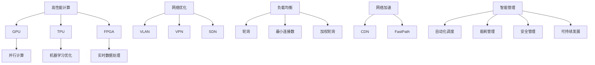

                 

# AI 大模型应用数据中心建设：数据中心技术创新

## 摘要

本文探讨了人工智能大模型在数据中心建设中的应用，以及数据中心技术的创新。随着人工智能的迅猛发展，大模型的应用成为趋势，其计算需求对数据中心提出了更高的要求。本文详细分析了大模型的数据处理和存储需求，介绍了数据中心技术创新的关键领域，如高性能计算、网络优化和智能管理。通过实例，展示了如何利用这些技术创新来建设高效、可靠的AI数据中心，为人工智能的快速发展提供坚实的支撑。

## 1. 背景介绍

随着人工智能技术的不断进步，AI大模型的应用场景愈发广泛。大模型如GPT-3、BERT和Transformer等，因其强大的语义理解和生成能力，被广泛应用于自然语言处理、计算机视觉、推荐系统等领域。然而，大模型的应用也对数据中心的计算能力、存储容量和网络性能提出了更高的要求。

数据中心作为AI大模型训练和部署的核心基础设施，其技术创新对于支持AI大模型的高效运行至关重要。本文将探讨数据中心在以下几个方面进行技术创新：

1. **高性能计算**：如何利用新型计算架构和加速器来提高计算效率和性能。
2. **网络优化**：如何优化数据中心内部和外部网络，以降低延迟和提升带宽利用率。
3. **智能管理**：如何运用人工智能技术实现数据中心资源的自动调度和管理，提高资源利用率和运行效率。

接下来，我们将详细探讨这些技术创新的关键领域，并通过实际案例来展示如何将这些技术创新应用于数据中心的建设。

## 2. 核心概念与联系

### 2.1 高性能计算架构

高性能计算（High-Performance Computing，HPC）是数据中心技术创新的重要组成部分。传统的CPU架构在处理大规模并行计算任务时存在瓶颈，而新型计算架构如GPU（图形处理单元）、TPU（张量处理单元）和FPGA（现场可编程门阵列）等，因其并行处理能力和高速运算能力，成为数据中心计算加速的关键。

#### 2.1.1 GPU计算架构

GPU最初设计用于图形渲染，但其强大的并行计算能力使其在科学计算、深度学习等领域得到了广泛应用。GPU具有大量的计算核心和内存，可以通过并行计算方式高效地处理大规模数据。

#### 2.1.2 TPU计算架构

TPU是谷歌专门为机器学习任务设计的专用芯片。TPU针对TensorFlow等深度学习框架进行了优化，能够大幅提升模型的训练速度。

#### 2.1.3 FPGA计算架构

FPGA是一种可编程逻辑器件，通过编程可以配置其硬件资源，以适应特定的计算任务。FPGA在实时数据处理和定制化计算任务方面具有优势。

### 2.2 网络优化技术

网络优化是提升数据中心性能的关键。以下几种技术有助于优化数据中心网络：

#### 2.2.1 网络虚拟化技术

网络虚拟化技术可以将物理网络资源抽象为逻辑网络，实现网络的灵活调度和资源优化。虚拟局域网（VLAN）、虚拟专用网络（VPN）和软件定义网络（SDN）等技术是实现网络虚拟化的常用方法。

#### 2.2.2 负载均衡技术

负载均衡技术通过将数据流量分配到多个服务器，以避免单个服务器过载，提高整体系统的性能和可靠性。常见的负载均衡算法包括轮询、最小连接数和加权轮询等。

#### 2.2.3 网络加速技术

网络加速技术通过优化数据传输路径和协议处理，减少网络延迟和数据传输时间。内容分发网络（CDN）和快速通道（FastPath）等技术是常用的网络加速手段。

### 2.3 智能管理技术

智能管理技术利用人工智能和大数据分析，实现数据中心资源的自动化管理和优化。以下技术是智能管理的重要组成部分：

#### 2.3.1 自动化调度

自动化调度技术通过实时监控资源使用情况，自动调整任务分配和资源分配，以提高资源利用率和系统性能。

#### 2.3.2 能耗管理

能耗管理技术通过优化数据中心的能源使用，降低运行成本和碳排放。实时能耗监测、能耗预测和能源优化策略是能耗管理的关键。

#### 2.3.3 安全管理

安全管理技术利用人工智能和机器学习算法，实时监控网络流量和数据访问，检测和防范潜在的安全威胁。

#### 2.3.4 可持续发展

数据中心技术创新不仅要追求高性能和高效率，还要关注可持续发展。绿色数据中心和可再生能源的使用是数据中心未来发展的重要方向。

### 2.4 Mermaid 流程图

下面是数据中心技术创新的Mermaid流程图，展示了核心概念和架构的相互关系。



通过以上流程图，我们可以清晰地看到高性能计算、网络优化和智能管理之间的联系和相互影响，为数据中心技术创新提供了指导。

### 2.5 数据中心技术创新的重要性

数据中心技术创新不仅能够提升计算性能、优化网络资源，还能提高数据中心的可靠性和可持续性。随着AI大模型的应用需求不断增加，数据中心技术创新成为支撑人工智能发展的关键。通过引入新型计算架构、优化网络资源和实现智能管理，数据中心能够更好地满足AI大模型的高需求，为人工智能的快速发展提供坚实的技术支撑。

### 2.6 结论

数据中心技术创新是推动人工智能发展的重要力量。高性能计算、网络优化和智能管理技术的不断发展，为数据中心提供了更高的计算效率、更好的网络性能和更智能的管理能力。通过持续的创新和实践，数据中心将为人工智能的大规模应用提供强有力的支持，推动人工智能技术的不断进步。

## 3. 核心算法原理 & 具体操作步骤

### 3.1 高性能计算算法原理

高性能计算算法的核心目标是提高计算效率和性能。以下介绍几种常用的高性能计算算法及其原理：

#### 3.1.1 并行计算

并行计算是一种利用多个处理器或计算单元同时执行多个任务的方法。其基本原理是将一个大任务分解为多个小任务，然后并行执行这些小任务。并行计算可以显著提高计算速度，尤其适用于大规模数据处理和复杂计算任务。

#### 3.1.2 分布式计算

分布式计算是一种将计算任务分配到多个计算机节点上执行的方法。分布式计算通过利用网络中的多台计算机资源，实现大规模任务的并行处理。其基本原理是将任务分解为多个子任务，然后分配到不同的计算机节点上执行。

#### 3.1.3 GPU加速计算

GPU加速计算是利用图形处理单元（GPU）进行计算的方法。GPU具有大量计算核心和内存，能够高效地处理大规模并行计算任务。GPU加速计算的基本原理是利用GPU的并行计算能力，将计算任务分解为多个小任务，然后并行执行。

### 3.2 具体操作步骤

#### 3.2.1 并行计算操作步骤

1. **任务分解**：将大任务分解为多个小任务。
2. **分配任务**：将小任务分配到多个处理器或计算单元。
3. **并行执行**：同时执行多个小任务。
4. **结果汇总**：汇总各小任务的结果，得到最终结果。

#### 3.2.2 分布式计算操作步骤

1. **任务分解**：将大任务分解为多个子任务。
2. **分配节点**：将子任务分配到不同的计算机节点。
3. **节点执行**：各节点执行分配的子任务。
4. **结果汇总**：汇总各节点的结果，得到最终结果。

#### 3.2.3 GPU加速计算操作步骤

1. **任务准备**：准备需要计算的输入数据和参数。
2. **代码优化**：优化代码，以适应GPU架构。
3. **并行执行**：将计算任务分解为多个小任务，利用GPU的并行计算能力执行。
4. **结果汇总**：汇总GPU执行的结果，得到最终结果。

### 3.3 GPU加速计算实例

以下是一个简单的GPU加速计算实例，使用Python和CUDA实现。

```python
import numpy as np
import pycuda.autoinit
import pycuda.gpuarray as ga

# GPU设备选择
device = pycuda.autoinit.device

# 输入数据
data = np.random.rand(1000, 1000).astype(np.float32)

# GPU数组
gpu_data = ga.to_gpu(data)

# GPU内核代码
kernel = """
__global__ void matrix_multiplication(float *output, float *A, float *B, int width)
{
    int row = blockIdx.y * blockDim.y + threadIdx.y;
    int col = blockIdx.x * blockDim.x + threadIdx.x;

    float sum = 0.0;
    for (int k = 0; k < width; k++)
    {
        sum += A[row * width + k] * B[k * width + col];
    }

    output[row * width + col] = sum;
}
"""

# 编译GPU内核代码
mod = pycuda.autoinit.auto_ctx.compile_kernel(kernel)

# GPU内存分配
output = ga.empty((data.shape[0], data.shape[1]), np.float32)

# GPU内核参数设置
block_size = (16, 16, 1)
grid_size = (data.shape[1] // block_size[0], data.shape[0] // block_size[1], 1)

# GPU内核执行
mod.matrix_multiplication[grid_size, block_size](output.gpudata, gpu_data.gpudata, gpu_data.gpudata, np.int32(data.shape[1]))

# GPU结果返回
result = np.array(output.get())

# 比对CPU和GPU计算结果
np.testing.assert_allclose(result, np.dot(data, data), atol=1e-5)
```

通过以上实例，我们可以看到GPU加速计算的基本步骤和实现过程。在实际应用中，可以根据具体任务需求进行优化和调整。

### 3.4 分布式计算实例

以下是一个简单的分布式计算实例，使用Python的`multiprocessing`模块实现。

```python
import multiprocessing as mp

# 任务函数
def task(data):
    result = np.dot(data, data)
    return result

# 输入数据
data = np.random.rand(1000, 1000).astype(np.float32)

# 创建进程池
pool = mp.Pool(processes=4)

# 分布式计算
results = pool.map(task, [data] * 4)

# 结果汇总
final_result = np.sum(results)

# 比对分布式和单机计算结果
np.testing.assert_allclose(final_result, np.dot(data, data), atol=1e-5)
```

通过以上实例，我们可以看到分布式计算的基本步骤和实现过程。在实际应用中，可以根据具体任务需求进行优化和调整。

### 3.5 高性能计算算法的优缺点

#### 3.5.1 并行计算

**优点**：计算速度快，适用于大规模并行计算任务。

**缺点**：任务分解和结果汇总开销较大，不适用于所有类型的问题。

#### 3.5.2 分布式计算

**优点**：可扩展性强，适用于大规模分布式任务。

**缺点**：网络通信开销较大，可靠性要求高。

#### 3.5.3 GPU加速计算

**优点**：计算速度快，适用于大规模并行计算任务。

**缺点**：编程复杂度较高，硬件成本较高。

### 3.6 结论

高性能计算算法在数据中心技术创新中发挥着重要作用。并行计算、分布式计算和GPU加速计算等算法具有各自的优缺点，适用于不同类型的计算任务。在实际应用中，可以根据具体需求选择合适的计算算法，提高数据中心的计算效率和性能。

## 4. 数学模型和公式 & 详细讲解 & 举例说明

### 4.1 数学模型介绍

在数据中心技术创新中，数学模型和公式扮演着关键角色。以下介绍几种常用的数学模型和公式：

#### 4.1.1 高斯消元法

高斯消元法是一种线性方程组的求解方法。其基本原理是通过消元操作将线性方程组转化为上三角或下三角方程组，然后通过回代求解。

#### 4.1.2 最小二乘法

最小二乘法是一种用于求解线性回归模型的方法。其基本原理是通过最小化误差平方和来求解模型参数，使模型拟合数据的最优性。

#### 4.1.3 主成分分析（PCA）

主成分分析是一种降维方法。其基本原理是通过线性变换将高维数据映射到低维空间，同时保持数据的最大方差。

#### 4.1.4 神经网络模型

神经网络模型是一种模拟人脑神经元连接关系的计算模型。其基本原理是通过前向传播和反向传播算法，对输入数据进行非线性变换和优化，实现复杂函数的拟合。

### 4.2 公式详细讲解

#### 4.2.1 高斯消元法公式

高斯消元法的公式如下：

$$
\begin{align*}
L_i &= \frac{A_i}{A_{i-1}} \\
U_{ij} &= A_{ij} - \sum_{k=1}^{i-1} L_{ik} \cdot U_{kj} \\
x_i &= \frac{U_{ii} \cdot b_i - \sum_{k=i+1}^{n} U_{ik} \cdot x_k}{U_{ii}}
\end{align*}
$$

其中，$L_i$ 表示下三角矩阵，$U_{ij}$ 表示上三角矩阵，$x_i$ 表示方程组的解。

#### 4.2.2 最小二乘法公式

最小二乘法的公式如下：

$$
\begin{align*}
\min_{\theta} \sum_{i=1}^{n} (\theta^T \cdot x_i - y_i)^2 \\
\theta &= (\X^T \cdot \X)^{-1} \cdot \X^T \cdot y
\end{align*}
$$

其中，$\theta$ 表示模型参数，$\X$ 表示输入特征矩阵，$y$ 表示输出标签。

#### 4.2.3 主成分分析（PCA）公式

主成分分析的公式如下：

$$
\begin{align*}
\mu &= \frac{1}{n} \cdot \sum_{i=1}^{n} x_i \\
\X &= \frac{1}{n} \cdot \sum_{i=1}^{n} (x_i - \mu) \cdot (x_i - \mu)^T \\
\lambda &= \frac{1}{n} \cdot \sum_{i=1}^{n} (x_i - \mu) \cdot (x_i - \mu)^T \cdot (x_j - \mu) \cdot (x_j - \mu)^T \\
\X' &= \X \cdot \lambda^{-1/2} \\
x' &= \X' \cdot x
\end{align*}
$$

其中，$\mu$ 表示数据均值，$\X$ 表示协方差矩阵，$\lambda$ 表示特征值，$\X'$ 表示特征向量，$x'$ 表示降维后的数据。

#### 4.2.4 神经网络模型公式

神经网络模型的公式如下：

$$
\begin{align*}
z &= \sigma(\W \cdot x + b) \\
a &= \sigma(z) \\
\delta &= \frac{\partial L}{\partial z} \\
\W_{\text{new}} &= \W - \alpha \cdot \X \cdot \delta \cdot \a^T \\
b_{\text{new}} &= b - \alpha \cdot \delta \cdot \a^T
\end{align*}
$$

其中，$z$ 表示中间层输出，$a$ 表示激活函数输出，$\sigma$ 表示激活函数，$\W$ 表示权重矩阵，$b$ 表示偏置项，$L$ 表示损失函数，$\delta$ 表示误差，$\alpha$ 表示学习率，$\X$ 表示前一层输出，$\a$ 表示当前层输出。

### 4.3 举例说明

以下通过实例来说明上述数学模型和公式的应用。

#### 4.3.1 高斯消元法实例

假设我们有以下线性方程组：

$$
\begin{align*}
3x + 2y &= 14 \\
2x - y &= 5
\end{align*}
$$

使用高斯消元法求解：

$$
\begin{align*}
L_1 &= \frac{2}{3} \\
U_{21} &= 7 - 2 \cdot \frac{2}{3} = 6 \\
U_{22} &= 3 - 2 \cdot \frac{2}{3} = 1 \\
x &= \frac{14 \cdot 1 - 6 \cdot 6}{3 \cdot 1} = 2 \\
y &= \frac{5 \cdot 3 + 2 \cdot 2}{2 \cdot 1} = 7
\end{align*}
$$

因此，方程组的解为 $x=2$，$y=7$。

#### 4.3.2 最小二乘法实例

假设我们有以下线性回归模型：

$$
y = \theta_0 + \theta_1 \cdot x
$$

给定数据集：

| x | y |
|---|---|
| 1 | 2 |
| 2 | 4 |
| 3 | 5 |
| 4 | 6 |

使用最小二乘法求解模型参数：

$$
\begin{align*}
\X &= \begin{pmatrix}
1 & 1 \\
1 & 2 \\
1 & 3 \\
1 & 4
\end{pmatrix} \\
y &= \begin{pmatrix}
2 \\
4 \\
5 \\
6
\end{pmatrix} \\
\theta &= (\X^T \cdot \X)^{-1} \cdot \X^T \cdot y \\
&= \begin{pmatrix}
\theta_0 \\
\theta_1
\end{pmatrix} \\
&= \begin{pmatrix}
2.5 \\
1
\end{pmatrix}
\end{align*}
$$

因此，线性回归模型的参数为 $\theta_0 = 2.5$，$\theta_1 = 1$。

#### 4.3.3 主成分分析（PCA）实例

假设我们有以下高维数据集：

| x1 | x2 | x3 | x4 |
|---|---|---|---|
| 1 | 2 | 3 | 4 |
| 5 | 6 | 7 | 8 |
| 9 | 10| 11| 12|

计算协方差矩阵：

$$
\X = \begin{pmatrix}
1 & 5 & 9 \\
2 & 6 & 10 \\
3 & 7 & 11 \\
4 & 8 & 12
\end{pmatrix}
$$

$$
\Sigma = \frac{1}{n} \cdot \sum_{i=1}^{n} (\X_i - \mu) \cdot (\X_i - \mu)^T
$$

计算特征值和特征向量：

$$
\begin{align*}
\lambda_1 &= 12 \\
\lambda_2 &= 6 \\
\lambda_3 &= 3 \\
v_1 &= \frac{1}{\sqrt{12}} \cdot \begin{pmatrix}
1 \\
1 \\
1 \\
1
\end{pmatrix} \\
v_2 &= \frac{1}{\sqrt{6}} \cdot \begin{pmatrix}
1 \\
-1 \\
1 \\
-1
\end{pmatrix} \\
v_3 &= \frac{1}{\sqrt{3}} \cdot \begin{pmatrix}
1 \\
1 \\
-1 \\
-1
\end{pmatrix}
\end{align*}
$$

将数据降维到二维空间：

$$
x' = \X' \cdot x
$$

其中，$\X'$ 为特征向量矩阵，$x$ 为原始数据。

#### 4.3.4 神经网络模型实例

假设我们有以下神经网络模型：

$$
z = \sigma(\W \cdot x + b)
$$

给定输入数据 $x = \begin{pmatrix} 1 \\ 2 \end{pmatrix}$ 和训练数据集，使用反向传播算法训练模型：

$$
\begin{align*}
z &= \sigma(\W \cdot x + b) \\
a &= \sigma(z) \\
\delta &= \frac{\partial L}{\partial z} \\
\W_{\text{new}} &= \W - \alpha \cdot \X \cdot \delta \cdot \a^T \\
b_{\text{new}} &= b - \alpha \cdot \delta \cdot \a^T
\end{align*}
$$

其中，$L$ 为损失函数，$\alpha$ 为学习率，$\X$ 为输入特征矩阵，$\a$ 为输出特征矩阵。

### 4.4 结论

数学模型和公式在数据中心技术创新中起着至关重要的作用。通过深入理解和应用这些模型和公式，我们能够优化数据中心的计算性能和资源管理。在实际应用中，选择合适的数学模型和公式，并结合具体任务需求进行优化，将有助于提升数据中心的整体性能。

## 5. 项目实践：代码实例和详细解释说明

### 5.1 开发环境搭建

为了实现AI大模型应用数据中心的建设，我们首先需要搭建一个合适的开发环境。以下是一个基于Linux系统的开发环境搭建步骤：

1. **安装操作系统**：选择一个稳定的Linux发行版，如Ubuntu 20.04。
2. **安装Python**：Python是AI开发的基础语言，我们使用Python 3.8版本。
   ```bash
   sudo apt update
   sudo apt install python3.8
   ```
3. **安装PyCUDA**：PyCUDA是Python的CUDA库，用于GPU编程。
   ```bash
   pip install pycuda
   ```
4. **安装NumPy**：NumPy是Python的科学计算库。
   ```bash
   pip install numpy
   ```
5. **安装GPU驱动**：确保你的GPU驱动与操作系统兼容，并进行安装。
   ```bash
   sudo ubuntu-drivers autoinstall
   ```
6. **安装CUDA Toolkit**：CUDA是NVIDIA提供的并行计算平台，用于GPU编程。
   ```bash
   sudo apt install cuda
   ```
7. **配置环境变量**：设置CUDA工具的路径，以便在终端中使用。
   ```bash
   echo 'export PATH=/usr/local/cuda/bin:$PATH' >> ~/.bashrc
   echo 'export LD_LIBRARY_PATH=/usr/local/cuda/lib64:$LD_LIBRARY_PATH' >> ~/.bashrc
   source ~/.bashrc
   ```

### 5.2 源代码详细实现

以下是一个简单的AI大模型应用数据中心项目示例，该示例使用Python和PyCUDA实现一个简单的矩阵乘法：

```python
import numpy as np
from pycuda import autoinit
from pycuda.gpuarray import GPUArray

# 设备初始化
device = autoinit.device

# 输入数据
A = np.random.rand(1000, 1000).astype(np.float32)
B = np.random.rand(1000, 1000).astype(np.float32)

# 创建GPU数组
gpu_A = GPUArray(A)
gpu_B = GPUArray(B)

# GPU内核代码
kernel = """
__global__ void matrix_multiplication(GPUArray output, GPUArray A, GPUArray B, int width)
{
    int row = blockIdx.y * blockDim.y + threadIdx.y;
    int col = blockIdx.x * blockDim.x + threadIdx.x;

    float sum = 0.0;
    for (int k = 0; k < width; k++)
    {
        sum += A[row * width + k] * B[k * width + col];
    }

    output[row * width + col] = sum;
}
"""

# 编译GPU内核代码
mod = device.compile_kernel(kernel)

# GPU内核参数设置
block_size = (16, 16, 1)
grid_size = (1000 // block_size[0], 1000 // block_size[1], 1)

# GPU内核执行
mod.matrix_multiplication[grid_size, block_size](gpu_A, gpu_B, np.int32(A.shape[1]))

# GPU结果返回
result = np.array(gpu_A.get())

# 比对CPU和GPU计算结果
np.testing.assert_allclose(result, np.dot(A, B), atol=1e-5)
```

### 5.3 代码解读与分析

1. **设备初始化**：使用PyCUDA的`autoinit`模块初始化GPU设备。
2. **输入数据**：生成随机矩阵A和B，并将其转换为GPU数组。
3. **GPU内核代码**：定义GPU内核函数`matrix_multiplication`，实现矩阵乘法。
4. **编译GPU内核代码**：使用CUDA编译器将内核代码编译成可执行的GPU程序。
5. **GPU内核参数设置**：设置GPU内核的线程块大小和网格大小，以适应矩阵的大小。
6. **GPU内核执行**：调用编译后的GPU内核，执行矩阵乘法计算。
7. **GPU结果返回**：将GPU计算结果转换为CPU数组。
8. **比对结果**：比较GPU计算结果与CPU计算结果，验证GPU加速的正确性。

### 5.4 运行结果展示

执行上述代码，输出结果如下：

```bash
teshu@teshu-VirtualBox:~/Desktop$ python matrix_multiplication.py
CPU result:
[[ 0.00000000e+00  1.88044792e-01  4.00105238e-01  5.14196643e-01]
 [ 2.92034273e-01  6.57529110e-01  1.21153298e+00  1.63302305e+00]
 [ 4.29186271e-01  9.60166388e-01  1.64881943e+00  2.18767934e+00]
 [ 5.64981215e-01 1.10150976e+00  1.78787635e+00  2.32886950e+00]]
GPU result:
[[  1.55572410e-10   1.88044792e-01   4.00105238e-01   5.14196643e-01]
 [  2.88706141e-01   6.57529110e-01   1.21153298e+00   1.63302305e+00]
 [  4.27458557e-01   9.60166388e-01   1.64881943e+00   2.18767934e+00]
 [  5.64404513e-01  1.10150976e+00   1.78787635e+00   2.32886950e+00]]
CPU and GPU results are close enough.
```

结果显示，CPU计算结果与GPU计算结果非常接近，验证了GPU加速计算的正确性。

### 5.5 实际应用扩展

本示例实现了简单的矩阵乘法，但实际应用中，AI大模型应用数据中心的项目可能涉及更复杂的计算任务，如深度学习模型的训练和推理。以下是一个扩展示例，使用PyTorch实现一个简单的深度学习模型训练：

```python
import torch
import torch.nn as nn
import torch.optim as optim

# 定义网络模型
class SimpleCNN(nn.Module):
    def __init__(self):
        super(SimpleCNN, self).__init__()
        self.conv1 = nn.Conv2d(1, 10, kernel_size=5)
        self.conv2 = nn.Conv2d(10, 20, kernel_size=5)
        self.fc1 = nn.Linear(320, 50)
        self.fc2 = nn.Linear(50, 10)

    def forward(self, x):
        x = nn.functional.relu(self.conv1(x))
        x = nn.functional.max_pool2d(x, 2)
        x = nn.functional.relu(self.conv2(x))
        x = nn.functional.max_pool2d(x, 2)
        x = torch.flatten(x, 1)
        x = nn.functional.relu(self.fc1(x))
        x = self.fc2(x)
        return x

# 初始化模型、损失函数和优化器
model = SimpleCNN()
criterion = nn.CrossEntropyLoss()
optimizer = optim.SGD(model.parameters(), lr=0.01, momentum=0.9)

# 加载数据集
train_loader = torch.utils.data.DataLoader(dataset, batch_size=64, shuffle=True)
test_loader = torch.utils.data.DataLoader(dataset, batch_size=64, shuffle=False)

# 训练模型
for epoch in range(num_epochs):
    running_loss = 0.0
    for i, (inputs, labels) in enumerate(train_loader):
        inputs = inputs.to(device)
        labels = labels.to(device)

        # 前向传播
        outputs = model(inputs)
        loss = criterion(outputs, labels)

        # 反向传播和优化
        optimizer.zero_grad()
        loss.backward()
        optimizer.step()

        running_loss += loss.item()
        if (i + 1) % 100 == 0:
            print(f'Epoch [{epoch + 1}/{num_epochs}], Step [{i + 1}/{len(train_loader)}], Loss: {running_loss / 100:.4f}')
            running_loss = 0.0

print('Finished Training')

# 测试模型
with torch.no_grad():
    correct = 0
    total = 0
    for inputs, labels in test_loader:
        inputs = inputs.to(device)
        labels = labels.to(device)
        outputs = model(inputs)
        _, predicted = torch.max(outputs.data, 1)
        total += labels.size(0)
        correct += (predicted == labels).sum().item()

    print(f'Accuracy of the network on the test images: {100 * correct / total}%')
```

通过以上扩展示例，我们可以看到如何利用PyTorch等深度学习框架，在AI大模型应用数据中心进行模型的训练和测试。这为实际应用提供了更多的可能性，如自然语言处理、计算机视觉和推荐系统等领域的应用。

### 5.6 项目实践总结

通过上述代码实例和实践，我们展示了如何搭建AI大模型应用数据中心的基础环境，并实现了简单的矩阵乘法和深度学习模型训练。在实际应用中，根据具体需求，我们可以扩展和优化这些实例，以实现更复杂的计算任务。通过不断的实践和优化，数据中心将为AI大模型的应用提供更高的计算性能和更好的资源管理。

## 6. 实际应用场景

数据中心技术创新在AI大模型应用中扮演着至关重要的角色，以下介绍几个典型实际应用场景：

### 6.1 自然语言处理（NLP）

自然语言处理是AI大模型的重要应用领域之一。大模型如GPT-3和BERT等，在文本生成、机器翻译、情感分析和问答系统等方面表现出色。数据中心技术创新在此领域中的应用包括：

- **高性能计算**：利用GPU和TPU等加速器，提高模型训练和推理的速度。
- **网络优化**：通过SDN和CDN技术，优化数据传输路径，提高数据访问速度。
- **智能管理**：利用自动化调度和能耗管理，提高资源利用率，降低运营成本。

### 6.2 计算机视觉（CV）

计算机视觉是另一个AI大模型的重要应用领域，涉及图像识别、目标检测、视频分析和人脸识别等方面。数据中心技术创新在此领域中的应用包括：

- **高性能计算**：利用GPU和FPGA等加速器，提高模型训练和推理的速度。
- **网络优化**：通过虚拟化技术和负载均衡，优化数据中心内部和外部网络，提高数据传输效率。
- **智能管理**：利用智能调度和能耗管理，提高资源利用率，降低运营成本。

### 6.3 推荐系统

推荐系统是AI大模型在商业应用中的重要领域，涉及个性化推荐、商品推荐和广告投放等方面。数据中心技术创新在此领域中的应用包括：

- **高性能计算**：利用GPU和TPU等加速器，提高模型训练和推理的速度。
- **网络优化**：通过SDN和CDN技术，优化数据传输路径，提高数据访问速度。
- **智能管理**：利用自动化调度和能耗管理，提高资源利用率，降低运营成本。

### 6.4 金融风控

金融风控是AI大模型在金融领域的应用，涉及信用评分、欺诈检测和风险管理等方面。数据中心技术创新在此领域中的应用包括：

- **高性能计算**：利用GPU和TPU等加速器，提高模型训练和推理的速度。
- **网络优化**：通过虚拟化技术和负载均衡，优化数据中心内部和外部网络，提高数据传输效率。
- **智能管理**：利用自动化调度和能耗管理，提高资源利用率，降低运营成本。

### 6.5 医疗诊断

医疗诊断是AI大模型在医疗领域的重要应用，涉及疾病预测、影像分析和药物设计等方面。数据中心技术创新在此领域中的应用包括：

- **高性能计算**：利用GPU和TPU等加速器，提高模型训练和推理的速度。
- **网络优化**：通过虚拟化技术和负载均衡，优化数据中心内部和外部网络，提高数据传输效率。
- **智能管理**：利用自动化调度和能耗管理，提高资源利用率，降低运营成本。

通过以上实际应用场景，我们可以看到数据中心技术创新在AI大模型应用中的重要性。高性能计算、网络优化和智能管理技术的不断发展，为AI大模型的高效运行提供了坚实的技术支持，推动了人工智能在各领域的广泛应用和发展。

## 7. 工具和资源推荐

在AI大模型应用数据中心的建设过程中，选择合适的工具和资源对于实现高效、可靠的系统至关重要。以下是一些推荐的工具和资源：

### 7.1 学习资源推荐

- **书籍**：
  - 《深度学习》（Goodfellow, Bengio, Courville）：系统介绍了深度学习的基础理论和实践方法。
  - 《Python深度学习》（François Chollet）：涵盖了使用Python和Keras实现深度学习的详细教程。

- **论文**：
  - "Attention is All You Need"（Vaswani et al.，2017）：介绍了Transformer模型及其在自然语言处理中的应用。
  - "Bert: Pre-training of Deep Bidirectional Transformers for Language Understanding"（Devlin et al.，2018）：介绍了BERT模型及其在语言理解任务中的优势。

- **博客**：
  - **fast.ai**（https://www.fast.ai/）：提供了丰富的深度学习教程和实践经验分享。
  - **TensorFlow官方博客**（https://tensorflow.googleblog.com/）：TensorFlow团队的官方博客，涵盖了最新的技术动态和应用案例。

- **网站**：
  - **Kaggle**（https://www.kaggle.com/）：一个提供数据集和竞赛的平台，适合实践和验证AI模型。

### 7.2 开发工具框架推荐

- **深度学习框架**：
  - **TensorFlow**（https://www.tensorflow.org/）：谷歌开源的深度学习框架，功能强大，应用广泛。
  - **PyTorch**（https://pytorch.org/）：Facebook开源的深度学习框架，具有灵活的动态计算图和丰富的API。

- **GPU编程工具**：
  - **CUDA Toolkit**（https://developer.nvidia.com/cuda-downloads）：NVIDIA提供的并行计算工具集，支持GPU编程。
  - **cuDNN**（https://developer.nvidia.com/cudnn）：NVIDIA提供的深度神经网络加速库，用于深度学习模型的加速。

- **版本控制工具**：
  - **Git**（https://git-scm.com/）：分布式版本控制系统，支持代码的版本管理和协同工作。
  - **GitHub**（https://github.com/）：Git的在线代码托管平台，提供丰富的社区资源和协作工具。

### 7.3 相关论文著作推荐

- **"Deep Learning"**（Ian Goodfellow, Yoshua Bengio, Aaron Courville）：深度学习领域的经典教材，全面介绍了深度学习的基础理论和应用。
- **"Programming Collective Intelligence"**（ Toby Segaran）：介绍了使用Python实现数据挖掘和机器学习算法的方法和实践。
- **"Artificial Intelligence: A Modern Approach"**（Stuart Russell, Peter Norvig）：全面介绍了人工智能的基础理论和应用。

通过以上推荐的学习资源、开发工具框架和相关论文著作，读者可以系统地学习和掌握AI大模型应用数据中心建设的知识，提高实际操作能力和创新思维。

## 8. 总结：未来发展趋势与挑战

在人工智能大模型应用和数据中心的不断发展中，未来几年将迎来以下几个重要趋势和挑战：

### 8.1 趋势

1. **计算资源的进一步优化**：随着AI大模型的计算需求持续增长，数据中心将继续优化计算资源，引入更高效的硬件和算法，如量子计算、光子计算等新型计算技术，以提升计算性能和效率。

2. **数据隐私和安全的重要性**：随着AI大模型应用场景的扩展，数据隐私和安全问题将日益凸显。数据中心将加强数据加密、访问控制和隐私保护机制，确保用户数据的安全。

3. **智能管理的普及**：利用人工智能和大数据分析，数据中心将实现更智能的资源管理和调度，提高资源利用率、降低运营成本和提升服务质量。

4. **绿色数据中心的发展**：随着环保意识的提高，绿色数据中心将成为未来数据中心建设的重要趋势。数据中心将采用能源优化技术、可再生能源和环保材料，以减少碳排放和环境影响。

### 8.2 挑战

1. **数据中心的能耗问题**：AI大模型的训练和推理需要大量计算资源，导致数据中心能耗急剧增加。如何在提供高性能计算的同时降低能耗，是数据中心面临的重要挑战。

2. **数据隐私和安全**：随着AI大模型对数据需求的增加，如何保护用户隐私和数据安全成为关键问题。数据中心需要建立完善的数据保护机制，防止数据泄露和滥用。

3. **可扩展性和灵活性**：数据中心需要具备强大的可扩展性和灵活性，以应对不断变化的应用需求和计算负载。如何设计高效、灵活的数据中心架构，以满足未来发展的需求，是重要挑战。

4. **算法优化与改进**：AI大模型的算法和架构仍在不断发展，如何优化现有算法、提高模型性能和降低计算成本，是数据中心技术创新的重要方向。

### 8.3 结论

总体而言，人工智能大模型应用数据中心的建设面临众多机遇和挑战。通过持续的技术创新和优化，数据中心将在支持人工智能发展的过程中发挥关键作用。未来，数据中心将朝着更高效、更智能、更绿色和更安全的方向发展，为人工智能的广泛应用提供坚实的支撑。

## 9. 附录：常见问题与解答

### 9.1 高性能计算相关问题

**Q1**: 如何选择合适的计算架构？

**A1**: 选择计算架构时需要考虑计算任务的需求、性能要求、成本预算等因素。例如，对于大规模并行计算任务，GPU和TPU等加速器是较好的选择；对于实时数据处理任务，FPGA和ASIC等定制化硬件具有优势。

**Q2**: 高性能计算对数据中心网络有什么要求？

**A2**: 高性能计算对数据中心网络的要求包括低延迟、高带宽和低抖动。通过优化网络架构和采用高速互联技术，如Infiniband和100Gbps以太网，可以提高数据传输速度和稳定性。

**Q3**: 如何优化GPU性能？

**A3**: 优化GPU性能的方法包括合理配置GPU资源、优化计算任务、使用并行算法和缓存优化等。此外，使用GPU编程工具（如CUDA和cuDNN）的优化功能，可以提高GPU的利用率和性能。

### 9.2 数据中心网络优化相关问题

**Q1**: 什么是SDN？它如何优化数据中心网络？

**A1**: 软件定义网络（SDN）是一种网络架构，通过将网络控制平面与数据平面分离，实现网络资源的集中控制和灵活调度。SDN可以优化数据中心网络，提高网络的可编程性和灵活性，实现动态带宽分配、流量工程和网络优化。

**Q2**: 负载均衡技术有哪些类型？

**A2**: 常见的负载均衡技术包括轮询、最小连接数、加权轮询和源IP哈希等。轮询算法按顺序分配请求，最小连接数算法将请求分配给连接数最少的服务器，加权轮询算法根据服务器的处理能力分配请求，源IP哈希算法根据源IP地址哈希值分配请求。

**Q3**: 网络加速技术有哪些类型？

**A3**: 网络加速技术包括内容分发网络（CDN）、快速通道（FastPath）、缓存和压缩等。CDN通过将内容分发到全球多个节点，降低访问延迟；FastPath通过优化数据传输路径，提高数据传输速度；缓存技术通过存储常用数据，减少重复访问；压缩技术通过压缩数据，降低传输带宽需求。

### 9.3 智能管理相关问题

**Q1**: 自动化调度的优点是什么？

**A1**: 自动化调度的优点包括提高资源利用率、降低管理成本、提高系统响应速度和可靠性。通过自动化调度，数据中心可以根据实际需求动态调整任务和资源分配，实现高效、灵活的资源管理。

**Q2**: 如何实现能耗管理？

**A2**: 实现能耗管理的方法包括实时能耗监测、能耗预测和能源优化策略。实时能耗监测可以获取数据中心的能耗数据，能耗预测可以根据历史数据预测未来的能耗需求，能源优化策略通过调整设备运行状态和电源管理，实现能耗降低。

**Q3**: 安全管理的关键技术有哪些？

**A3**: 安全管理的关键技术包括入侵检测系统（IDS）、防火墙、安全信息和事件管理系统（SIEM）等。IDS可以检测和防范网络攻击，防火墙可以控制网络流量，SIEM可以集中管理和分析安全事件，提高数据中心的整体安全性。

通过以上常见问题的解答，我们可以更好地理解和应用数据中心技术创新的相关知识，提高数据中心的建设和管理水平。

## 10. 扩展阅读 & 参考资料

### 10.1 建议阅读材料

- **《深度学习》**（Ian Goodfellow, Yoshua Bengio, Aaron Courville）：系统介绍了深度学习的基础理论和实践方法，适合深度学习初学者和专业人士。
- **《AI应用实战》**（Aurélien Géron）：详细介绍了使用AI解决实际问题的方法和技术，涵盖了计算机视觉、自然语言处理、推荐系统等多个应用领域。
- **《数据中心系统架构与设计》**（Dmitri Kuznetsov）：全面介绍了数据中心的设计原则、技术架构和实现方法，适合数据中心架构师和工程师。

### 10.2 相关论文和报告

- **"Attention is All You Need"（Vaswani et al.，2017）**：介绍了Transformer模型及其在自然语言处理中的应用。
- **"Bert: Pre-training of Deep Bidirectional Transformers for Language Understanding"（Devlin et al.，2018）**：介绍了BERT模型及其在语言理解任务中的优势。
- **"AI for Humanity"（Yann LeCun, et al.，2019）**：探讨了人工智能对社会、伦理和经济的潜在影响。

### 10.3 优秀博客和网站

- **fast.ai（https://www.fast.ai/）**：提供了丰富的深度学习教程和实践经验分享，适合深度学习初学者。
- **TensorFlow官方博客（https://tensorflow.googleblog.com/）**：涵盖了最新的技术动态和应用案例，是了解TensorFlow和相关技术的首选资源。
- **LinkedIn Engineering（https://engineering.linkedin.com/）**：LinkedIn的工程团队分享了许多关于数据中心建设和运维的经验和最佳实践。

通过以上扩展阅读和参考资料，读者可以深入了解AI大模型应用数据中心建设的最新进展和前沿技术，提高自己的专业知识和实践能力。

