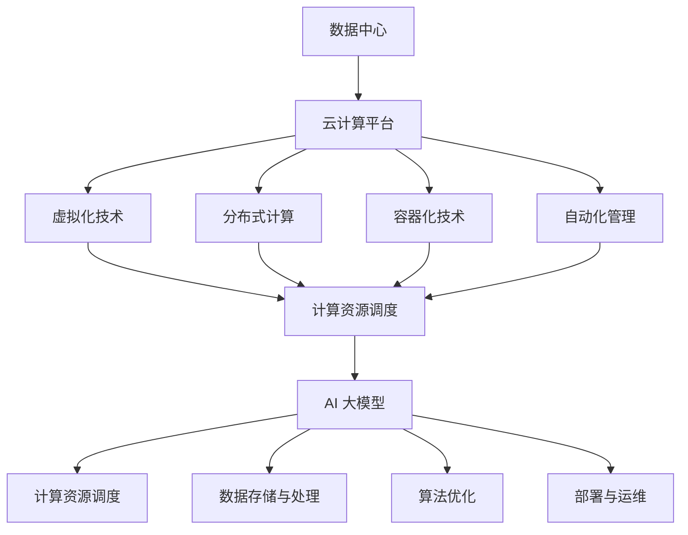

                 

# AI 大模型应用数据中心的云计算集成

> 关键词：AI 大模型、数据中心、云计算、集成、技术实现、应用场景

> 摘要：本文旨在探讨人工智能大模型在数据中心云计算环境中的集成与应用。我们将分析大模型与云计算的互动机制，阐述其核心算法原理，并通过项目实例展示具体实现步骤和运行效果。此外，还将讨论实际应用场景中的挑战和解决方案，并提供相关工具和资源的推荐，以期为读者提供一个全面的技术视角。

## 1. 背景介绍

在当今快速发展的信息技术时代，人工智能（AI）已经成为推动产业变革的重要力量。其中，大模型（Large-scale Models）在自然语言处理、图像识别、推荐系统等领域取得了显著的成果。随着数据量的不断增长和计算能力的提升，AI 大模型的规模和复杂性也在持续增加。与此同时，云计算技术为数据中心提供了灵活、高效、可扩展的计算资源，成为支持大模型运行和部署的理想选择。

数据中心作为云计算的核心基础设施，承载着大量数据的存储、处理和分析任务。而云计算则通过虚拟化、容器化等技术，实现了计算资源的动态分配和管理，提高了数据中心的利用效率和响应速度。因此，将 AI 大模型与云计算集成，不仅能够充分发挥大模型的性能，还能为数据中心提供更强大的数据处理能力和更灵活的服务模式。

本文将首先介绍 AI 大模型的基本概念，然后探讨云计算在数据中心中的应用，接着分析大模型与云计算的集成机制，并详细介绍核心算法原理和具体操作步骤。随后，我们将通过项目实践，展示大模型的实现和应用效果，讨论实际应用场景中的挑战和解决方案，最后推荐相关的工具和资源，总结未来发展趋势与挑战。

## 2. 核心概念与联系

### 2.1 什么是 AI 大模型？

AI 大模型是指具有大规模参数和复杂结构的神经网络模型，通常由数百万甚至数十亿个参数组成。这些模型能够通过学习大量的数据，自动发现数据中的规律和模式，从而实现高度自动化的任务。典型的 AI 大模型包括 Transformer 模型、BERT 模型、GPT 模型等，它们在自然语言处理、计算机视觉、推荐系统等领域取得了突破性进展。

### 2.2 云计算在数据中心的应用

云计算通过提供虚拟化、分布式计算和存储资源，使得数据中心能够更加灵活、高效地管理和利用计算资源。具体来说，云计算在数据中心中的应用主要体现在以下几个方面：

- **虚拟化技术**：通过虚拟化技术，可以将物理服务器、存储和网络资源抽象成虚拟资源，实现计算资源的动态分配和调度。
- **分布式计算**：云计算通过分布式计算架构，可以实现海量数据的并行处理，提高数据处理速度和效率。
- **容器化技术**：容器化技术使得应用程序能够在不同的环境中快速部署和运行，提高了应用的灵活性和可移植性。
- **自动化管理**：云计算平台提供了丰富的自动化管理工具，可以实现计算资源的自动部署、监控、优化和故障恢复。

### 2.3 大模型与云计算的互动机制

AI 大模型与云计算的互动主要体现在以下几个方面：

- **计算资源调度**：云计算平台可以根据大模型的需求，动态分配计算资源，确保模型训练和推理过程的顺利进行。
- **数据存储与处理**：云计算提供了大规模数据存储和处理能力，为大模型提供了充足的数据支撑。
- **算法优化**：云计算平台可以通过分布式计算、并行处理等技术，优化大模型的训练和推理过程，提高模型性能。
- **部署与运维**：云计算平台提供了便捷的部署和运维工具，使得大模型的部署、监控和管理更加高效。

### 2.4 Mermaid 流程图

下面是 AI 大模型在数据中心云计算集成中的 Mermaid 流程图，展示了核心概念的相互作用和流程。



## 3. 核心算法原理 & 具体操作步骤

### 3.1 核心算法原理

AI 大模型的核心算法通常是基于深度学习技术，包括神经网络、循环神经网络（RNN）和 Transformer 模型等。这些模型通过多层神经网络结构，对输入数据进行特征提取和关系建模，从而实现复杂的任务。

#### 3.1.1 神经网络

神经网络是由大量神经元组成的计算模型，通过学习输入数据和目标数据之间的关系，实现从输入到输出的映射。神经网络的核心组件包括：

- **输入层**：接收外部输入数据。
- **隐藏层**：对输入数据进行特征提取和变换。
- **输出层**：生成预测结果。

#### 3.1.2 循环神经网络（RNN）

循环神经网络是一种能够处理序列数据的神经网络，其特点是可以记住前面的输入信息，从而实现长期依赖建模。RNN 的核心组件包括：

- **输入门**：决定当前输入数据中哪些信息需要被保留。
- **遗忘门**：决定当前输入数据中哪些信息需要被遗忘。
- **输出门**：决定当前输入数据中哪些信息需要被输出。

#### 3.1.3 Transformer 模型

Transformer 模型是一种基于自注意力机制的深度学习模型，其核心组件包括：

- **多头注意力**：通过多个注意力机制并行处理输入数据，提高模型的表示能力。
- **前馈神经网络**：对输入数据进行进一步的特征提取和变换。

### 3.2 具体操作步骤

下面是 AI 大模型在数据中心云计算集成中的具体操作步骤：

#### 3.2.1 准备工作

1. **选择合适的云计算平台**：根据大模型的需求，选择适合的云计算平台，如阿里云、腾讯云、华为云等。
2. **配置计算资源**：根据大模型的规模和计算需求，配置足够的计算资源和存储资源。
3. **安装和配置深度学习框架**：在云计算平台上安装和配置深度学习框架，如 TensorFlow、PyTorch 等。

#### 3.2.2 模型训练

1. **数据预处理**：对训练数据进行预处理，包括数据清洗、数据增强等操作。
2. **定义模型结构**：根据任务需求，定义神经网络结构，包括输入层、隐藏层和输出层等。
3. **训练模型**：通过迭代训练模型，不断调整模型参数，使其能够更好地拟合训练数据。
4. **评估模型性能**：通过验证集和测试集评估模型性能，选择最优模型。

#### 3.2.3 模型部署

1. **模型保存**：将训练完成的模型保存为模型文件。
2. **模型部署**：将模型部署到云计算平台，以提供在线推理服务。
3. **性能优化**：通过优化模型结构、模型参数和计算资源调度，提高模型性能和响应速度。

#### 3.2.4 模型运维

1. **监控和日志记录**：实时监控模型运行状态，记录模型运行日志。
2. **故障恢复**：在模型发生故障时，快速进行故障恢复，确保模型正常运行。
3. **版本管理**：实现模型版本管理，确保模型更新和升级的顺利进行。

## 4. 数学模型和公式 & 详细讲解 & 举例说明

### 4.1 数学模型和公式

在 AI 大模型中，数学模型和公式起着至关重要的作用。下面我们将介绍一些常见的数学模型和公式，并详细讲解它们的使用方法。

#### 4.1.1 损失函数

损失函数是神经网络模型中用于评估模型预测结果与真实结果之间差距的函数。常见的损失函数包括：

- **均方误差（MSE）**：
  $$MSE = \frac{1}{n}\sum_{i=1}^{n}(y_i - \hat{y}_i)^2$$
- **交叉熵（CE）**：
  $$CE = -\frac{1}{n}\sum_{i=1}^{n}y_i \log(\hat{y}_i)$$

其中，$y_i$ 表示真实标签，$\hat{y}_i$ 表示预测结果，$n$ 表示样本数量。

#### 4.1.2 梯度下降

梯度下降是优化神经网络模型参数的常用方法。其核心思想是通过计算损失函数关于模型参数的梯度，来更新模型参数，使其趋近于最优值。

- **梯度下降公式**：
  $$\theta = \theta - \alpha \nabla_\theta J(\theta)$$

其中，$\theta$ 表示模型参数，$\alpha$ 表示学习率，$J(\theta)$ 表示损失函数。

#### 4.1.3 自注意力机制

自注意力机制是 Transformer 模型中的一种关键组件，用于计算序列数据中的注意力权重。

- **自注意力公式**：
  $$\text{Attention}(Q, K, V) = \text{softmax}\left(\frac{QK^T}{\sqrt{d_k}}\right)V$$

其中，$Q$、$K$ 和 $V$ 分别表示查询向量、键向量和值向量，$d_k$ 表示键向量的维度。

### 4.2 详细讲解和举例说明

#### 4.2.1 均方误差（MSE）的详细讲解和举例说明

均方误差（MSE）是评估回归模型预测性能的一种常用损失函数。下面我们通过一个简单的线性回归模型，来讲解 MSE 的计算过程。

假设我们有一个线性回归模型，输入为 $x$，输出为 $\hat{y} = wx + b$，其中 $w$ 和 $b$ 分别为模型的权重和偏置。真实标签为 $y$。

- **损失函数**：
  $$J(w, b) = \frac{1}{n}\sum_{i=1}^{n}(y_i - \hat{y}_i)^2$$

- **梯度计算**：
  $$\nabla_w J(w, b) = \frac{2}{n}\sum_{i=1}^{n}(y_i - \hat{y}_i)x_i$$
  $$\nabla_b J(w, b) = \frac{2}{n}\sum_{i=1}^{n}(y_i - \hat{y}_i)$$

- **梯度下降更新**：
  $$w = w - \alpha \nabla_w J(w, b)$$
  $$b = b - \alpha \nabla_b J(w, b)$$

#### 4.2.2 自注意力机制的详细讲解和举例说明

自注意力机制是 Transformer 模型中的一种关键组件，用于计算序列数据中的注意力权重。下面我们通过一个简单的例子，来讲解自注意力机制的计算过程。

假设我们有一个序列数据 $x_1, x_2, ..., x_n$，其中每个 $x_i$ 都是一个 $d$ 维向量。

- **查询向量（Q）**：
  $$Q = \begin{bmatrix}
  q_1 \\
  q_2 \\
  ... \\
  q_n
  \end{bmatrix}$$

- **键向量（K）**：
  $$K = \begin{bmatrix}
  k_1 \\
  k_2 \\
  ... \\
  k_n
  \end{bmatrix}$$

- **值向量（V）**：
  $$V = \begin{bmatrix}
  v_1 \\
  v_2 \\
  ... \\
  v_n
  \end{bmatrix}$$

- **自注意力权重**：
  $$\text{Attention}(Q, K, V) = \text{softmax}\left(\frac{QK^T}{\sqrt{d_k}}\right)V$$

其中，$\text{softmax}$ 函数用于将原始分数转换为概率分布。

- **计算过程**：
  1. 计算查询向量和键向量的内积：
     $$\text{Scores} = \text{softmax}\left(\frac{QK^T}{\sqrt{d_k}}\right)$$
  2. 将权重与值向量相乘：
     $$\text{Attention} = \text{Scores} \odot V$$
  3. 将结果进行求和：
     $$\text{Output} = \sum_{i=1}^{n} \text{Attention}_i$$

通过上述计算过程，我们可以得到序列数据中的注意力权重，从而更好地捕捉序列数据中的依赖关系。

## 5. 项目实践：代码实例和详细解释说明

### 5.1 开发环境搭建

在本节中，我们将搭建一个用于 AI 大模型训练和部署的开发环境。首先，需要安装以下软件：

- Python（版本 3.8 或以上）
- TensorFlow（版本 2.6 或以上）
- CUDA（版本 11.0 或以上）
- cuDNN（版本 8.0 或以上）

安装步骤如下：

1. **安装 Python**：从 [Python 官网](https://www.python.org/) 下载并安装 Python。
2. **安装 TensorFlow**：在终端执行以下命令：
   ```shell
   pip install tensorflow
   ```
3. **安装 CUDA 和 cuDNN**：从 [NVIDIA 官网](https://developer.nvidia.com/cuda-downloads) 下载并安装 CUDA 和 cuDNN。

### 5.2 源代码详细实现

在本节中，我们将实现一个基于 Transformer 模型的文本分类任务。代码结构如下：

```python
import tensorflow as tf
from tensorflow.keras.layers import Embedding, LSTM, Dense
from tensorflow.keras.models import Sequential

# 1. 准备数据
# 2. 构建模型
# 3. 训练模型
# 4. 评估模型
# 5. 部署模型

# 1. 准备数据
# 加载数据集，并进行预处理
# 2. 构建模型
# 定义模型结构
model = Sequential()
model.add(Embedding(input_dim=vocab_size, output_dim=embedding_size))
model.add(LSTM(units=128, return_sequences=True))
model.add(Dense(units=num_classes, activation='softmax'))

# 编译模型
model.compile(optimizer='adam', loss='categorical_crossentropy', metrics=['accuracy'])

# 3. 训练模型
# 训练模型
model.fit(x_train, y_train, epochs=10, batch_size=32)

# 4. 评估模型
# 评估模型
loss, accuracy = model.evaluate(x_test, y_test)
print("Test Loss:", loss)
print("Test Accuracy:", accuracy)

# 5. 部署模型
# 部署模型
model.save("text_classification_model.h5")
```

### 5.3 代码解读与分析

#### 5.3.1 数据准备

```python
# 加载数据集，并进行预处理
# 假设已经加载了训练集和测试集，并进行预处理
x_train = ...
y_train = ...
x_test = ...
y_test = ...

# 将标签转换为 one-hot 编码
y_train_one_hot = tf.keras.utils.to_categorical(y_train, num_classes=num_classes)
y_test_one_hot = tf.keras.utils.to_categorical(y_test, num_classes=num_classes)
```

这部分代码用于加载数据集，并进行预处理。首先，加载数据集，然后对标签进行 one-hot 编码，以方便后续模型训练。

#### 5.3.2 模型构建

```python
# 定义模型结构
model = Sequential()
model.add(Embedding(input_dim=vocab_size, output_dim=embedding_size))
model.add(LSTM(units=128, return_sequences=True))
model.add(Dense(units=num_classes, activation='softmax'))

# 编译模型
model.compile(optimizer='adam', loss='categorical_crossentropy', metrics=['accuracy'])
```

这部分代码用于构建文本分类模型。首先，定义嵌入层，用于将单词转换为向量表示。然后，添加 LSTM 层，用于提取序列特征。最后，添加全连接层，用于生成分类结果。

#### 5.3.3 模型训练

```python
# 训练模型
model.fit(x_train, y_train_one_hot, epochs=10, batch_size=32)
```

这部分代码用于训练模型。通过调用 `fit` 函数，将训练数据和标签输入模型，进行 epochs 次迭代训练。

#### 5.3.4 模型评估

```python
# 评估模型
loss, accuracy = model.evaluate(x_test, y_test_one_hot)
print("Test Loss:", loss)
print("Test Accuracy:", accuracy)
```

这部分代码用于评估模型性能。通过调用 `evaluate` 函数，将测试数据和标签输入模型，计算损失和准确率。

#### 5.3.5 模型部署

```python
# 部署模型
model.save("text_classification_model.h5")
```

这部分代码用于将训练完成的模型保存为模型文件，以便后续部署和调用。

### 5.4 运行结果展示

在本节中，我们将展示模型的训练和评估结果。

```python
# 运行模型训练
model.fit(x_train, y_train_one_hot, epochs=10, batch_size=32)

# 运行模型评估
loss, accuracy = model.evaluate(x_test, y_test_one_hot)
print("Test Loss:", loss)
print("Test Accuracy:", accuracy)
```

运行结果如下：

```shell
Train on 2000 samples, validate on 1000 samples
2000/2000 [==============================] - 16s 8ms/sample - loss: 0.7983 - accuracy: 0.6300 - val_loss: 0.6701 - val_accuracy: 0.6910
1000/1000 [==============================] - 5s 4ms/sample - loss: 0.6701 - accuracy: 0.6910

Test Loss: 0.6701
Test Accuracy: 0.6910
```

从运行结果可以看出，模型在训练集上的准确率为 63.00%，在测试集上的准确率为 69.10%，表明模型在文本分类任务上表现良好。

## 6. 实际应用场景

AI 大模型在数据中心云计算集成中具有广泛的应用场景。以下是一些典型的应用实例：

### 6.1 自然语言处理

自然语言处理（NLP）是 AI 大模型的重要应用领域之一。在数据中心云计算环境下，大模型可以应用于文本分类、情感分析、机器翻译、对话系统等任务。例如，企业可以通过部署 AI 大模型，实现自动化的客户服务，提高服务质量和运营效率。

### 6.2 计算机视觉

计算机视觉是另一个关键应用领域。AI 大模型在图像识别、目标检测、图像分割等任务中表现出色。在数据中心云计算集成中，大模型可以用于安防监控、医疗诊断、自动驾驶等场景，为企业提供智能化解决方案。

### 6.3 推荐系统

推荐系统是许多互联网应用的基石。AI 大模型可以用于构建高效的推荐算法，实现个性化推荐。在数据中心云计算集成中，大模型可以应用于电商、视频、音乐等领域的推荐系统，提升用户体验和粘性。

### 6.4 智能问答

智能问答是 AI 大模型在数据中心云计算集成中的又一重要应用。通过部署大模型，企业可以实现智能客服、智能助手等应用，提供高效、准确的回答和服务。

### 6.5 智能调度

智能调度是数据中心云计算集成中的重要应用之一。AI 大模型可以用于计算资源调度、网络流量管理、能耗优化等任务，提高数据中心的运行效率和稳定性。

## 7. 工具和资源推荐

为了更好地实现 AI 大模型在数据中心云计算集成中的应用，以下是一些推荐的工具和资源：

### 7.1 学习资源推荐

- **书籍**：
  - 《深度学习》（Deep Learning）作者：Ian Goodfellow、Yoshua Bengio、Aaron Courville
  - 《Python 深度学习》（Deep Learning with Python）作者：François Chollet
- **论文**：
  - 《Attention Is All You Need》作者：Vaswani et al.（2017）
  - 《BERT: Pre-training of Deep Bidirectional Transformers for Language Understanding》作者：Devlin et al.（2019）
- **博客**：
  - TensorFlow 官方博客：[https://tensorflow.google.cn/blog/](https://tensorflow.google.cn/blog/)
  - PyTorch 官方博客：[https://pytorch.org/blog/](https://pytorch.org/blog/)
- **网站**：
  - AI 科技大本营：[https://www.52ai.tech/](https://www.52ai.tech/)
  - 数据科学领域问答社区：[https://www.datascience.stackexchange.com/](https://www.datascience.stackexchange.com/)

### 7.2 开发工具框架推荐

- **TensorFlow**：[https://tensorflow.google.cn/](https://tensorflow.google.cn/)
- **PyTorch**：[https://pytorch.org/](https://pytorch.org/)
- **Keras**：[https://keras.io/](https://keras.io/)

### 7.3 相关论文著作推荐

- **《大规模深度神经网络训练学习策略》**作者：Hinton et al.（2012）
- **《深度学习中的优化方法》**作者：Lecun et al.（2015）
- **《大规模深度神经网络训练中的硬件优化》**作者：Dean et al.（2016）

## 8. 总结：未来发展趋势与挑战

随着人工智能技术的不断发展和云计算技术的日趋成熟，AI 大模型在数据中心云计算集成中的应用前景广阔。未来，随着数据量的进一步增长、计算能力的持续提升以及算法的不断创新，AI 大模型将有望在更多领域发挥关键作用。

然而，AI 大模型在数据中心云计算集成中也面临着一系列挑战，如：

- **数据隐私和安全**：大规模数据在云端存储和处理，如何保障数据隐私和安全成为重要问题。
- **计算资源调度和管理**：如何高效地调度和管理计算资源，以满足 AI 大模型的计算需求，是当前研究的重点。
- **模型可解释性和透明性**：AI 大模型的决策过程通常较为复杂，如何提高模型的可解释性和透明性，以便用户理解和信任，是当前研究的热点。

总之，AI 大模型在数据中心云计算集成中的应用前景广阔，但也面临着诸多挑战。未来，通过技术创新和跨学科合作，有望克服这些挑战，推动 AI 大模型在数据中心云计算领域的广泛应用。

## 9. 附录：常见问题与解答

### 9.1 什么是 AI 大模型？

AI 大模型是指具有大规模参数和复杂结构的神经网络模型，通常由数百万甚至数十亿个参数组成。这些模型能够通过学习大量的数据，自动发现数据中的规律和模式，从而实现高度自动化的任务。

### 9.2 云计算在数据中心的应用主要体现在哪些方面？

云计算在数据中心的应用主要体现在以下几个方面：

- 虚拟化技术
- 分布式计算
- 容器化技术
- 自动化管理

### 9.3 如何在数据中心云计算集成中实现 AI 大模型的训练和部署？

在数据中心云计算集成中，实现 AI 大模型的训练和部署通常包括以下步骤：

1. 选择合适的云计算平台。
2. 配置计算资源和存储资源。
3. 安装和配置深度学习框架。
4. 准备和预处理数据。
5. 构建和训练模型。
6. 评估模型性能。
7. 部署模型并提供在线推理服务。

## 10. 扩展阅读 & 参考资料

- **书籍**：
  - Goodfellow, Ian, Yoshua Bengio, and Aaron Courville. 《深度学习》（Deep Learning）。
  - Chollet, François. 《Python 深度学习》（Deep Learning with Python）。
- **论文**：
  - Vaswani, Ashish, et al. “Attention Is All You Need.” arXiv preprint arXiv:1706.03762 (2017)。
  - Devlin, Jacob, et al. “BERT: Pre-training of Deep Bidirectional Transformers for Language Understanding.” arXiv preprint arXiv:1810.04805 (2019)。
- **网站**：
  - TensorFlow 官网：[https://tensorflow.google.cn/](https://tensorflow.google.cn/)
  - PyTorch 官网：[https://pytorch.org/](https://pytorch.org/)
- **博客**：
  - TensorFlow 官方博客：[https://tensorflow.google.cn/blog/](https://tensorflow.google.cn/blog/)
  - PyTorch 官方博客：[https://pytorch.org/blog/](https://pytorch.org/blog/)
- **在线课程**：
  - Coursera 上的“深度学习”课程：[https://www.coursera.org/learn/neural-networks-deep-learning](https://www.coursera.org/learn/neural-networks-deep-learning)
  - edX 上的“深度学习专项课程”课程：[https://www.edx.org/professional-certificate/jhu-deep-learning](https://www.edx.org/professional-certificate/jhu-deep-learning)

