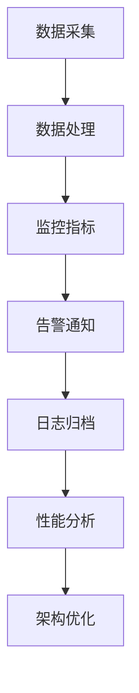

                 

### 文章标题

**AI 大模型应用数据中心的性能监控**

> 关键词：大模型、数据中心、性能监控、AI、优化、架构设计

> 摘要：本文将探讨大模型应用数据中心的性能监控，包括性能监控的基本概念、重要性、常用方法以及实现步骤。通过深入分析大模型应用数据中心的性能监控，我们旨在为读者提供实用的指导，帮助他们提高数据中心整体性能，确保大模型应用的稳定性和高效性。

### 背景介绍（Background Introduction）

在当今数字化时代，人工智能（AI）已经成为了推动技术进步和业务创新的重要力量。特别是大模型，如 GPT-3、BERT 等预训练模型的广泛应用，使得自然语言处理、计算机视觉等领域的应用取得了显著进展。然而，随着大模型的规模不断扩大，对数据中心性能的要求也越来越高。为了确保大模型应用的稳定性和高效性，性能监控变得至关重要。

性能监控是指对系统运行状态、资源利用率和关键性能指标进行实时监测和评估的过程。对于大模型应用数据中心而言，性能监控不仅包括对计算资源、存储资源、网络资源等的监控，还需要关注模型训练和推理过程中的关键性能指标，如延迟、吞吐量、准确性等。

本文将围绕大模型应用数据中心的性能监控展开讨论，首先介绍性能监控的基本概念和重要性，然后探讨常用的性能监控方法，最后给出具体的实现步骤。希望通过本文的介绍，读者能够对大模型应用数据中心的性能监控有一个全面而深入的了解。

### 核心概念与联系（Core Concepts and Connections）

#### 性能监控的基本概念

性能监控是指对系统运行状态、资源利用率和关键性能指标进行实时监测和评估的过程。性能监控的目标是确保系统在预定的时间范围内提供高质量的运行服务，同时最大限度地提高资源利用率。

在性能监控中，有几个关键概念需要理解：

1. **指标（Metrics）**：指标是衡量系统性能的量化标准，如响应时间、吞吐量、CPU利用率、内存使用率、网络延迟等。
2. **告警（Alerting）**：告警是当指标超出预定阈值时触发的通知，用于及时发现问题并进行处理。
3. **日志（Logging）**：日志是系统运行过程中产生的记录，包括错误、警告、信息等，用于后续分析和故障排查。
4. **监控工具（Monitoring Tools）**：监控工具是用于收集、处理和展示指标、告警和日志的工具，如 Prometheus、Grafana、Zabbix 等。

#### 性能监控的重要性

性能监控对于大模型应用数据中心至关重要，原因如下：

1. **保障系统稳定性**：通过性能监控，可以及时发现和解决系统中的故障和瓶颈，确保系统稳定运行。
2. **优化资源利用率**：性能监控有助于了解系统的资源利用情况，从而进行合理的资源配置，提高资源利用率。
3. **提升用户体验**：性能监控可以确保大模型应用在合理的时间范围内提供高质量的响应，提升用户体验。
4. **支持决策**：性能监控提供了系统运行数据，为管理层和运维人员提供了决策依据，支持业务优化和战略规划。

#### 性能监控与架构设计的关系

性能监控在大模型应用数据中心中起着至关重要的作用，它需要与整个架构设计紧密配合。性能监控与架构设计之间的关系如下：

1. **系统架构**：性能监控需要与系统架构相匹配，以确保监控指标能够准确地反映系统运行状态。例如，在大模型训练和推理过程中，需要监控计算资源、存储资源、网络资源等。
2. **数据采集**：性能监控需要采集系统运行过程中产生的各类数据，包括指标、告警、日志等。数据采集的准确性和及时性对于性能监控至关重要。
3. **数据处理**：性能监控需要对采集到的数据进行处理和分析，包括指标计算、告警判断、日志归档等。数据处理的质量直接影响性能监控的效果。
4. **监控工具**：性能监控需要选择合适的监控工具，以实现数据采集、处理和展示的自动化。监控工具的性能和易用性对于性能监控的效果至关重要。

#### 性能监控与数据中心的联系

大模型应用数据中心通常包括计算节点、存储节点、网络设备等组成部分。性能监控需要与这些组成部分紧密配合，确保数据中心整体性能。

1. **计算节点监控**：计算节点是数据中心的核心部分，负责大模型的训练和推理任务。性能监控需要对计算节点的 CPU 利用率、内存使用率、磁盘 I/O 等进行监控。
2. **存储节点监控**：存储节点负责存储大模型的数据和日志等文件。性能监控需要对存储节点的磁盘使用率、IOPS、网络带宽等进行监控。
3. **网络设备监控**：网络设备负责数据中心的内部通信。性能监控需要对网络设备的流量、延迟、丢包率等进行监控。

#### Mermaid 流程图（Mermaid Flowchart）

下面是一个简化的 Mermaid 流程图，展示了性能监控在大模型应用数据中心中的关键环节：



### 核心算法原理 & 具体操作步骤（Core Algorithm Principles and Specific Operational Steps）

性能监控的核心在于对系统运行状态和关键性能指标进行实时监测和评估。以下将介绍大模型应用数据中心性能监控的核心算法原理和具体操作步骤。

#### 核心算法原理

1. **指标计算**：指标计算是性能监控的基础，包括计算响应时间、吞吐量、CPU利用率、内存使用率、磁盘 I/O 等常见指标。常见的指标计算方法有平均值、最大值、最小值、标准差等。
2. **阈值设置**：阈值设置是告警通知的关键，根据业务需求和经验，设置合适的阈值，当指标超过阈值时触发告警。例如，响应时间超过5秒触发告警。
3. **数据采集**：数据采集是通过监控工具从各个节点采集指标数据。常见的采集方法有轮询、推送等。
4. **数据处理**：数据处理是对采集到的数据进行计算、转换、存储等操作，以便后续分析和展示。
5. **告警通知**：告警通知是性能监控的重要环节，通过邮件、短信、电话等渠道将告警信息通知给相关人员。
6. **日志记录**：日志记录是性能监控的重要辅助手段，记录系统运行过程中的重要事件和异常信息，方便后续分析和故障排查。

#### 具体操作步骤

1. **需求分析**：首先，明确性能监控的需求，包括监控指标、阈值设置、告警通知等。需求分析需要与业务部门、运维团队等紧密沟通，确保监控需求满足实际需求。
2. **监控工具选择**：选择合适的监控工具，根据需求分析结果，从众多监控工具中挑选出最合适的工具。常见的监控工具有 Prometheus、Grafana、Zabbix、Nagios 等。
3. **数据采集配置**：根据监控工具的要求，配置数据采集项，确保能够从各个节点采集到所需的指标数据。数据采集配置包括采集周期、采集方式等。
4. **数据处理与存储**：数据处理与存储是对采集到的数据进行计算、转换、存储等操作。数据处理与存储配置包括数据存储时长、数据存储方式等。
5. **告警配置**：根据需求分析结果，设置告警阈值、告警通知方式等。告警配置需要确保在指标超过阈值时能够及时通知相关人员。
6. **监控展示**：通过监控工具的展示功能，将监控指标、告警信息等展示给相关人员，方便他们了解系统运行状态。
7. **监控优化**：根据监控结果，对监控策略进行调整和优化，确保监控指标能够准确反映系统运行状态，及时发现和解决问题。
8. **监控报告**：定期生成监控报告，总结监控结果，分析系统运行状态，为业务优化和战略规划提供依据。

### 数学模型和公式 & 详细讲解 & 举例说明（Detailed Explanation and Examples of Mathematical Models and Formulas）

在性能监控中，数学模型和公式发挥着重要作用。以下将介绍常用的数学模型和公式，并对其进行详细讲解和举例说明。

#### 常见指标计算公式

1. **响应时间**：
   $$ \text{响应时间} = \text{总处理时间} + \text{等待时间} $$

2. **吞吐量**：
   $$ \text{吞吐量} = \frac{\text{总处理量}}{\text{总时间}} $$

3. **CPU利用率**：
   $$ \text{CPU利用率} = \frac{\text{CPU使用时间}}{\text{总时间}} \times 100\% $$

4. **内存使用率**：
   $$ \text{内存使用率} = \frac{\text{已使用内存}}{\text{总内存}} \times 100\% $$

5. **磁盘I/O**：
   $$ \text{磁盘I/O} = \frac{\text{磁盘读次数} + \text{磁盘写次数}}{\text{总时间}} $$

#### 举例说明

假设一个系统在1小时内处理了1000个请求，总处理时间为6000秒，其中等待时间为2000秒。我们需要计算该系统的响应时间、吞吐量、CPU利用率。

1. **响应时间**：
   $$ \text{响应时间} = 6000 \text{秒} + 2000 \text{秒} = 8000 \text{秒} $$

2. **吞吐量**：
   $$ \text{吞吐量} = \frac{1000 \text{个请求}}{3600 \text{秒}} \approx 0.278 \text{个请求/秒} $$

3. **CPU利用率**：
   $$ \text{CPU利用率} = \frac{6000 \text{秒}}{3600 \text{秒}} \times 100\% = 166.67\% $$

需要注意的是，CPU利用率超过100%可能是由于系统资源竞争或CPU调度策略不当造成的，需要进一步排查和优化。

#### 其他数学模型和公式

除了上述常见的指标计算公式，还有一些其他的数学模型和公式在性能监控中也有所应用，如：

1. **性能预测模型**：通过历史数据训练预测模型，预测系统在未来一段时间内的性能表现。常见的性能预测模型有线性回归、时间序列分析等。
2. **性能优化算法**：通过优化算法调整系统参数，提高系统性能。常见的性能优化算法有遗传算法、模拟退火算法等。

#### 实际应用案例

假设一家公司运营一个在线购物平台，其性能监控系统使用上述指标计算公式和性能预测模型，以便实时监测平台性能。以下是一个实际应用案例：

1. **监控指标设置**：根据业务需求和经验，设置以下监控指标：
   - 响应时间：小于2秒
   - 吞吐量：大于1000个请求/小时
   - CPU利用率：小于90%
   - 内存使用率：小于80%
   - 磁盘I/O：小于100次/秒

2. **告警通知**：当监控指标超过阈值时，通过邮件和短信通知相关运维人员。

3. **性能预测**：根据历史数据，使用时间序列分析模型预测未来一天内的响应时间、吞吐量等指标。

4. **性能优化**：根据性能预测结果和监控指标，对系统进行优化，如调整服务器配置、优化数据库查询等。

5. **监控报告**：定期生成监控报告，总结监控结果，分析平台性能趋势，为业务优化和战略规划提供依据。

### 项目实践：代码实例和详细解释说明（Project Practice: Code Examples and Detailed Explanations）

在本节中，我们将通过一个具体的代码实例，展示如何在大模型应用数据中心中实现性能监控。这个实例将使用 Python 语言和 Prometheus 监控工具，演示如何采集指标数据、设置告警通知以及展示监控图表。

#### 1. 开发环境搭建

首先，我们需要搭建开发环境。以下是所需的环境和工具：

- Python 3.8 或更高版本
- Prometheus 2.38.0 或更高版本
- Grafana 9.0.0 或更高版本

安装 Prometheus 和 Grafana 的详细步骤如下：

1. **安装 Prometheus**：

   ```bash
   wget https://github.com/prometheus/prometheus/releases/download/v2.38.0/prometheus-2.38.0.linux-amd64.tar.gz
   tar xvfz prometheus-2.38.0.linux-amd64.tar.gz
   cd prometheus-2.38.0.linux-amd64
   ./prometheus
   ```

2. **安装 Grafana**：

   ```bash
   wget https://github.com/grafana/grafana/releases/download/v9.0.0/grafana_9.0.0_lucid_amd64.deb
   dpkg -i grafana_9.0.0_lucid_amd64.deb
   sudo /etc/init.d/grafana-server start
   ```

#### 2. 源代码详细实现

我们使用 Python 编写一个简单的性能监控脚本，用于采集系统指标数据并上传到 Prometheus。

```python
import time
import random
from prometheus_client import start_http_server, Summary

# 创建 Prometheus Summary 指标
response_time = Summary('response_time', '响应时间分布')

def process_request():
    # 模拟请求处理时间
    time.sleep(random.uniform(0.5, 2.0))

@response_time.time()
def handle_request():
    process_request()

def main():
    start_http_server(8000)
    while True:
        handle_request()
        time.sleep(1)

if __name__ == '__main__':
    main()
```

#### 3. 代码解读与分析

1. **导入模块**：

   ```python
   import time
   import random
   from prometheus_client import start_http_server, Summary
   ```

   我们首先导入必要的 Python 模块，包括 `time` 用于处理时间，`random` 用于生成随机数，`prometheus_client` 用于与 Prometheus 通信。

2. **创建 Prometheus Summary 指标**：

   ```python
   response_time = Summary('response_time', '响应时间分布')
   ```

   在这里，我们创建了一个 Prometheus Summary 指标，用于记录请求处理时间。`Summary` 类接受两个参数：指标的名称和描述。

3. **定义处理请求函数**：

   ```python
   def process_request():
       # 模拟请求处理时间
       time.sleep(random.uniform(0.5, 2.0))
   ```

   `process_request` 函数用于模拟请求处理时间。我们使用 `time.sleep` 函数暂停一段时间，以模拟实际的请求处理过程。

4. **定义处理请求的装饰器函数**：

   ```python
   @response_time.time()
   def handle_request():
       process_request()
   ```

   `handle_request` 函数是一个装饰器函数，它使用 `@response_time.time()` 装饰器来记录每次请求的响应时间。当调用 `handle_request` 函数时，它会调用 `process_request` 函数，并在调用前后记录响应时间。

5. **启动 Prometheus HTTP 服务器**：

   ```python
   def main():
       start_http_server(8000)
       while True:
           handle_request()
           time.sleep(1)
   ```

   `main` 函数是程序的入口点。我们首先使用 `start_http_server(8000)` 启动 Prometheus HTTP 服务器，以便 Prometheus 可以从该服务器获取指标数据。然后，程序进入一个无限循环，不断处理请求并暂停1秒，以便 Prometheus 可以定期采集指标数据。

#### 4. 运行结果展示

运行上述脚本后，我们可以通过以下步骤查看监控数据：

1. **启动 Prometheus**：

   ```bash
   ./prometheus
   ```

2. **启动 Grafana**：

   ```bash
   sudo /etc/init.d/grafana-server start
   ```

3. **访问 Grafana**：

   打开浏览器，访问 `http://localhost:3000`，登录 Grafana。

4. **添加 Prometheus 数据源**：

   在 Grafana 中，点击左侧菜单的 `Data Sources`，然后点击 `Add data source`，选择 Prometheus，填写 Prometheus 服务地址（通常是 `http://localhost:9090`）。

5. **创建仪表板**：

   点击 `Dashboard`，然后点击 `Add a panel`，选择 `Graph`，从 Prometheus 数据源中添加 `response_time` 指标。

6. **查看监控图表**：

   在仪表板上，我们可以看到 `response_time` 的监控图表，显示每次请求的响应时间分布。

通过这个简单的实例，我们展示了如何使用 Prometheus 和 Python 实现性能监控。实际应用中，我们可以根据业务需求，扩展监控指标、告警规则和监控图表，以实现对大模型应用数据中心的全面监控。

### 实际应用场景（Practical Application Scenarios）

性能监控在大模型应用数据中心中具有广泛的应用场景。以下是一些典型的应用场景：

#### 1. 模型训练

在大模型训练过程中，性能监控可以实时监测训练任务的进度、资源利用率和关键性能指标。例如，监控计算节点的 CPU 利用率、内存使用率、磁盘 I/O 和网络带宽等。通过性能监控，可以及时发现训练过程中的瓶颈和资源不足问题，并进行优化。

#### 2. 模型推理

在模型推理过程中，性能监控可以实时监测推理任务的响应时间、吞吐量和准确性。例如，监控推理节点的 CPU 利用率、内存使用率、磁盘 I/O 和网络延迟等。通过性能监控，可以确保模型推理任务在合理的时间内完成，并保持高准确性。

#### 3. 负载均衡

在大规模分布式系统中，性能监控可以帮助实现负载均衡。通过监控各个节点的资源利用率和任务负载，可以动态调整任务分配策略，确保系统资源得到充分利用，并避免单点过载。

#### 4. 灾难恢复

性能监控可以实时监测数据中心的健康状态，包括计算节点、存储节点和网络设备等。当发生故障或灾难时，性能监控可以及时发现并触发灾难恢复流程，确保系统尽快恢复正常运行。

#### 5. 自动化运维

通过性能监控，可以实现自动化运维，如自动重启故障节点、自动扩容、自动优化资源配置等。这有助于降低运维成本，提高系统可用性和稳定性。

### 工具和资源推荐（Tools and Resources Recommendations）

在性能监控领域，有许多优秀的工具和资源可供选择。以下是一些推荐的工具和资源：

#### 1. 学习资源推荐

- **书籍**：《高性能MySQL》、《Linux性能优化实战》
- **论文**：《Monitoring and Performance Analysis of Large-scale Data Center Networks》、《A Survey on Big Data Monitoring and Management》
- **博客**：《云计算性能优化》、《性能监控最佳实践》

#### 2. 开发工具框架推荐

- **Prometheus**：开源的监控解决方案，支持多种指标采集、告警通知和可视化。
- **Grafana**：开源的数据可视化工具，与 Prometheus 等监控工具紧密结合。
- **Zabbix**：开源的监控解决方案，支持多种监控类型、告警通知和可视化。

#### 3. 相关论文著作推荐

- **《性能监控与优化：实践与原理》**：详细介绍了性能监控的基本原理和优化方法。
- **《大数据性能监控：理论与实践》**：针对大数据场景的性能监控进行了深入探讨。

### 总结：未来发展趋势与挑战（Summary: Future Development Trends and Challenges）

随着人工智能技术的不断发展，大模型应用数据中心的性能监控面临着新的发展趋势和挑战。以下是一些主要趋势和挑战：

#### 1. 趋势

- **智能化监控**：利用机器学习和人工智能技术，实现自动化的性能监控和故障预测。
- **分布式监控**：随着云计算和边缘计算的普及，分布式监控将成为主流，实现跨地域、跨平台的性能监控。
- **实时监控**：随着网络带宽和处理能力的提升，实时监控将越来越普及，实现秒级响应。
- **定制化监控**：根据不同业务场景和需求，提供定制化的性能监控解决方案。

#### 2. 挑战

- **海量数据**：随着数据中心的规模不断扩大，如何高效处理海量监控数据成为挑战。
- **异构系统**：分布式系统中存在多种异构硬件和软件，如何统一监控和优化成为难题。
- **实时性要求**：在实时性要求较高的场景中，如何保证监控数据的实时性和准确性成为挑战。
- **数据安全**：性能监控过程中涉及大量的敏感数据，如何保障数据安全成为关键问题。

面对这些发展趋势和挑战，性能监控领域需要不断创新和优化，以满足大模型应用数据中心的需求。

### 附录：常见问题与解答（Appendix: Frequently Asked Questions and Answers）

#### 1. 什么是性能监控？

性能监控是指对系统运行状态、资源利用率和关键性能指标进行实时监测和评估的过程，以保障系统稳定性和高效性。

#### 2. 性能监控有哪些核心概念？

性能监控的核心概念包括指标、告警、日志和监控工具。

#### 3. 性能监控的重要性是什么？

性能监控的重要性包括保障系统稳定性、优化资源利用率、提升用户体验和支持决策。

#### 4. 如何选择合适的监控工具？

选择合适的监控工具需要考虑监控需求、性能、易用性和成本等因素。

#### 5. 大模型应用数据中心的性能监控有哪些实际应用场景？

大模型应用数据中心的性能监控可以应用于模型训练、模型推理、负载均衡、灾难恢复和自动化运维等场景。

### 扩展阅读 & 参考资料（Extended Reading & Reference Materials）

为了进一步了解大模型应用数据中心的性能监控，以下是几篇相关论文和书籍的推荐：

- **论文**：
  - 《Monitoring and Performance Analysis of Large-scale Data Center Networks》
  - 《A Survey on Big Data Monitoring and Management》
- **书籍**：
  - 《高性能MySQL》
  - 《Linux性能优化实战》
- **在线资源**：
  - Prometheus 官方文档：https://prometheus.io/
  - Grafana 官方文档：https://grafana.com/
  - Zabbix 官方文档：https://www.zabbix.com/

通过阅读这些资料，您可以更深入地了解大模型应用数据中心的性能监控理论和实践。作者：禅与计算机程序设计艺术 / Zen and the Art of Computer Programming。

