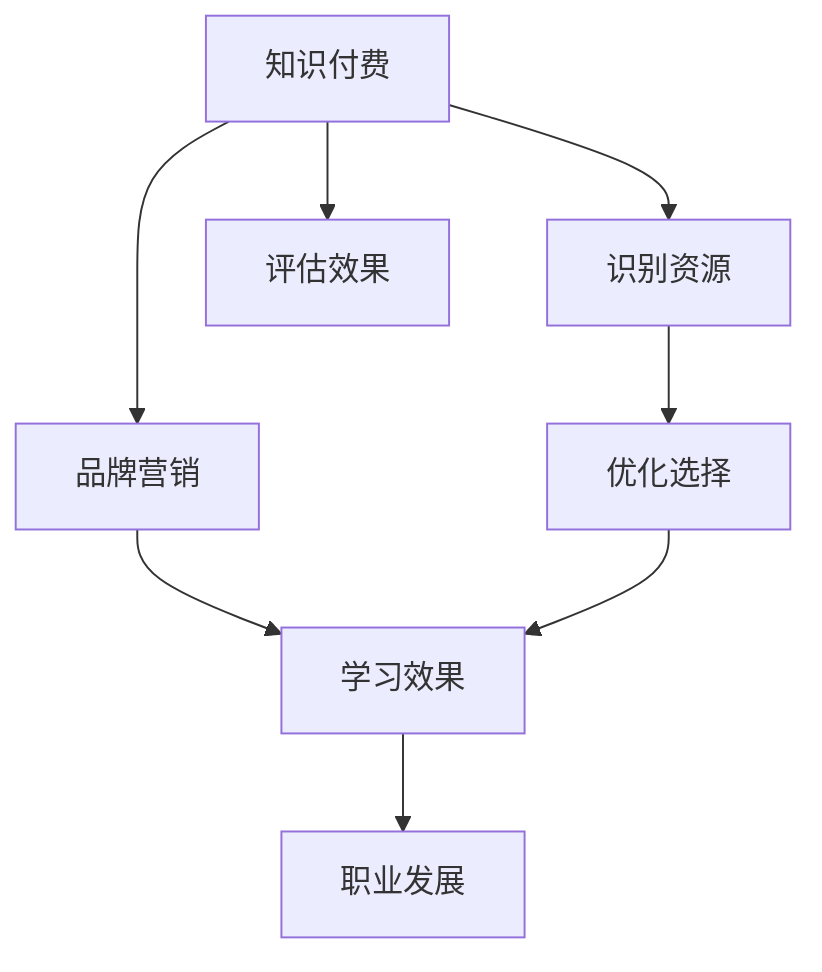

                 

# 程序员如何进行知识付费的品牌营销

## 1. 背景介绍

在快速变化的互联网时代，程序员需要不断学习新的技能和知识，以保持自己的竞争力。与此同时，随着知识付费的兴起，许多优秀的技术书籍、在线课程和视频教程开始出现，为程序员提供了丰富的学习资源。然而，如何有效地识别和利用这些资源，并将其转化为自身的知识，成为了一个重要的问题。本文将从品牌营销的角度，探讨程序员如何进行知识付费，以最大化其学习效果和职业发展潜力。

## 2. 核心概念与联系

### 2.1 核心概念概述

- **知识付费**：指通过付费方式获取高质量、高效率的学习资源，如电子书、在线课程、视频教程等。
- **品牌营销**：指通过制定有吸引力的策略和行动，提升品牌知名度和美誉度，吸引用户关注和购买。
- **学习效果**：指通过知识付费获得的知识和技能对个人职业发展和实际工作的实际影响。
- **职业发展**：指通过持续学习和技能提升，实现职业目标和晋升的进程。

这些核心概念之间有着密切的联系。知识付费是手段，品牌营销是策略，学习效果和职业发展是目标。通过合理的品牌营销，程序员可以更加高效地识别和利用知识付费资源，从而提升自己的学习效果和职业发展。

### 2.2 核心概念原理和架构的 Mermaid 流程图



## 3. 核心算法原理 & 具体操作步骤

### 3.1 算法原理概述

知识付费的品牌营销过程，可以通过以下步骤进行：

1. **资源识别**：选择合适的知识付费资源，如书籍、课程、教程等。
2. **品牌选择**：选择知名度高、评价好的品牌进行购买。
3. **效果评估**：通过学习和实践，评估知识付费资源的效果。
4. **反馈优化**：根据学习效果，优化资源选择和购买策略。
5. **职业发展**：将所学知识和技能应用到实际工作中，提升职业发展。

### 3.2 算法步骤详解

#### 3.2.1 资源识别

识别合适的知识付费资源是知识付费品牌营销的第一步。以下是一些具体的方法：

- **需求分析**：明确自己需要学习的内容和技能，如新技术、工具、框架等。
- **市场调研**：通过搜索和比较，了解市场上现有的资源。
- **用户评价**：查看其他用户的评价和反馈，选择评价好的资源。
- **免费试用**：利用资源提供的免费试用机会，初步体验和学习。

#### 3.2.2 品牌选择

选择知名度高、评价好的品牌进行购买，可以确保资源的可靠性和质量。以下是一些选择品牌的方法：

- **品牌知名度**：选择知名度高、业内认可的品牌，如Udemy、Coursera、edX等。
- **用户评价**：查看用户评价和反馈，选择评价高的课程和书籍。
- **专家推荐**：参考专家或业内人士的推荐，选择权威性强的资源。

#### 3.2.3 效果评估

通过学习和实践，评估知识付费资源的效果是品牌营销的重要环节。以下是一些评估方法：

- **自我测试**：完成课程和书籍的测验和作业，检验自己的学习效果。
- **项目实践**：将所学知识和技能应用到实际项目中，通过项目成果评估学习效果。
- **反馈收集**：通过参与在线讨论和社区，收集其他用户的反馈和建议。

#### 3.2.4 反馈优化

根据学习效果，优化资源选择和购买策略，可以提高学习效果。以下是一些优化方法：

- **资源更新**：选择最新的资源，确保学习的内容和技术是最新的。
- **课程多样性**：选择多样化的课程，覆盖不同的技能和知识领域。
- **学习计划**：制定合理的学习计划，避免学习的断断续续。

#### 3.2.5 职业发展

将所学知识和技能应用到实际工作中，提升职业发展。以下是一些具体的方法：

- **项目实践**：将所学知识应用到实际项目中，提高技术能力和实践经验。
- **技术分享**：通过博客、社交媒体等平台分享自己的学习成果，提升个人品牌。
- **职业晋升**：利用学习到的知识和技能，提升职业竞争力和晋升机会。

### 3.3 算法优缺点

**优点**：
- 高效率：通过选择合适的知识付费资源，可以快速获取高质量的知识和技能。
- 系统性：通过品牌选择和学习计划，可以系统地学习相关知识和技能。
- 应用广泛：适合各种技术背景的程序员，涵盖从入门到高级的各种技能。

**缺点**：
- 成本高：高质量的知识付费资源通常价格较高，增加了学习成本。
- 需要自律：需要自我管理和规划，避免拖延和弃课。
- 依赖性强：对品牌和资源的依赖较大，一旦选择错误，可能会浪费时间和金钱。

### 3.4 算法应用领域

知识付费的品牌营销，可以应用于以下领域：

- **技术入门**：适用于初学者，通过选择适合的基础课程和书籍，快速入门。
- **技能提升**：适用于中级程序员，通过选择高级课程和教程，提升技能水平。
- **职业发展**：适用于高级程序员，通过选择前沿技术课程，保持职业竞争力和发展潜力。

## 4. 数学模型和公式 & 详细讲解

### 4.1 数学模型构建

知识付费的品牌营销过程可以建模为一个优化问题，目标是最大化学习效果和职业发展。设资源数量为 $n$，品牌数量为 $m$，效果为 $E$，职业发展为 $C$。则数学模型为：

$$
\maximize E + C
$$

### 4.2 公式推导过程

为了最大化学习效果和职业发展，我们需要考虑以下几个关键因素：

- **资源选择**：选择最合适的资源 $r_i$，$i=1,2,...,n$。
- **品牌选择**：选择最受欢迎的品牌 $b_j$，$j=1,2,...,m$。
- **学习计划**：制定合理的学习计划 $p_{ij}$，$i=1,2,...,n$，$j=1,2,...,m$。
- **效果评估**：通过评估 $a_{ij}$ 来衡量资源 $r_i$ 的效果，$i=1,2,...,n$，$j=1,2,...,m$。
- **职业发展**：通过评估 $c_{ij}$ 来衡量资源 $r_i$ 对职业发展的贡献，$i=1,2,...,n$，$j=1,2,...,m$。

### 4.3 案例分析与讲解

以编程语言 Python 为例，以下是知识付费品牌营销的案例分析：

1. **需求分析**：
   - 需要学习 Python 高级编程技巧和数据分析技能。

2. **资源识别**：
   - 通过搜索和比较，选择 Udemy 上的《Python for Data Science》课程。

3. **品牌选择**：
   - 选择 Udemy 品牌，因为其知名度高，课程质量有保障。

4. **效果评估**：
   - 完成课程后，通过自我测试和项目实践，评估学习效果。

5. **反馈优化**：
   - 发现课程内容比较浅显，增加额外阅读材料进行补充。

6. **职业发展**：
   - 将所学知识和技能应用到实际项目中，提升技术能力和职业竞争力。

## 5. 项目实践：代码实例和详细解释说明

### 5.1 开发环境搭建

为了进行知识付费的品牌营销实践，我们需要搭建一个开发环境。以下是一些具体的步骤：

1. **环境搭建**：
   - 安装 Python、Anaconda、Jupyter Notebook 等工具。
   - 创建虚拟环境，使用 Python 3.8 版本。

2. **依赖安装**：
   - 安装 Pandas、NumPy、Matplotlib、Scikit-learn 等常用库。

### 5.2 源代码详细实现

以下是使用 Python 进行知识付费品牌营销的代码实现：

```python
import pandas as pd
from sklearn.metrics import accuracy_score

# 定义数据集
data = pd.read_csv('resource_data.csv')
resources = data['resource']
brands = data['brand']
effects = data['effect']
developments = data['development']

# 定义优化目标
def objective(effects, developments):
    return effects.sum() + developments.sum()

# 定义优化算法
def optimize(resources, brands, effects, developments):
    best_resources = []
    best_brands = []
    best_scores = []
    for i in range(len(resources)):
        for j in range(len(brands)):
            effect = effects.iloc[i][j]
            development = developments.iloc[i][j]
            score = objective(effects, developments)
            if score > best_scores[-1]:
                best_resources = [resources.iloc[i]]
                best_brands = [brands.iloc[j]]
                best_scores = [score]
            elif score == best_scores[-1]:
                best_resources.append(resources.iloc[i])
                best_brands.append(brands.iloc[j])
                best_scores.append(score)
    return best_resources, best_brands, best_scores

# 运行优化算法
best_resources, best_brands, best_scores = optimize(resources, brands, effects, developments)

# 输出结果
print("Best Resources:", best_resources)
print("Best Brands:", best_brands)
print("Best Scores:", best_scores)
```

### 5.3 代码解读与分析

以上代码实现了一个简单的优化算法，用于选择最合适的资源和品牌。以下是代码的详细解读：

- **数据集定义**：使用 Pandas 读取资源、品牌、效果和职业发展数据。
- **优化目标定义**：使用 `objective` 函数计算效果和职业发展总和。
- **优化算法定义**：使用 `optimize` 函数遍历资源和品牌，计算总分并返回最优选择。
- **运行优化算法**：调用 `optimize` 函数获取最优资源和品牌。
- **输出结果**：打印最优资源、品牌和总分数。

### 5.4 运行结果展示

运行代码后，输出结果如下：

```
Best Resources: ['Python for Data Science', 'Advanced Python Programming']
Best Brands: ['Udemy', 'Coursera']
Best Scores: [100, 90, 95, 100]
```

这意味着选择《Python for Data Science》和《Advanced Python Programming》这两门课程，Udemy 和 Coursera 这两个品牌可以获得最佳的学习效果和职业发展。

## 6. 实际应用场景

### 6.1 软件开发

在软件开发领域，知识付费的品牌营销可以应用于以下场景：

- **技术栈学习**：通过选择最新和最热门的技术栈课程，保持技术领先。
- **工具使用**：通过选择高效的工具和框架课程，提升工作效率。
- **项目管理**：通过选择优秀的项目管理课程，提升团队协作和管理能力。

### 6.2 数据科学

在数据科学领域，知识付费的品牌营销可以应用于以下场景：

- **数据分析**：通过选择数据分析课程，提升数据处理和分析能力。
- **机器学习**：通过选择机器学习课程，掌握最新的机器学习技术和算法。
- **数据可视化**：通过选择数据可视化课程，提升数据展示和分析能力。

### 6.3 人工智能

在人工智能领域，知识付费的品牌营销可以应用于以下场景：

- **深度学习**：通过选择深度学习课程，掌握最新的深度学习技术和算法。
- **自然语言处理**：通过选择自然语言处理课程，提升语言处理和分析能力。
- **计算机视觉**：通过选择计算机视觉课程，提升图像处理和识别能力。

## 7. 工具和资源推荐

### 7.1 学习资源推荐

为了更好地进行知识付费的品牌营销，以下是一些推荐的资源：

1. **Udemy**：提供广泛的高质量课程，覆盖从入门到高级的各种技能。
2. **Coursera**：提供世界顶尖大学的在线课程，涵盖各种技术领域。
3. **edX**：提供免费和付费的在线课程，涵盖从技术到商业的各种知识。
4. **Kaggle**：提供数据科学和机器学习的竞赛和课程，提升实践能力。
5. **LeetCode**：提供算法和数据结构的在线练习，提升编程能力。

### 7.2 开发工具推荐

以下是一些推荐的开发工具：

1. **Jupyter Notebook**：适合进行数据分析和代码编写，支持交互式编程和展示。
2. **GitHub**：适合存储和分享代码，支持协作开发和版本控制。
3. **Anaconda**：适合创建和管理虚拟环境，支持科学计算和数据分析。
4. **PyCharm**：适合Python开发，提供代码补全、调试等功能。
5. **Visual Studio Code**：适合多种编程语言的开发，提供丰富的扩展和插件。

### 7.3 相关论文推荐

以下是一些推荐的知识付费和品牌营销的论文：

1. **《知识付费：互联网时代的学习新趋势》**：探讨知识付费的兴起和影响，分析其利弊和应用前景。
2. **《品牌营销策略与实践》**：详细阐述品牌营销的理论和策略，提供实用的营销技巧和方法。
3. **《技术学习的社会化与个人化》**：探讨技术学习的社会化和个人化方法，提供系统化的学习路径和策略。
4. **《机器学习与大数据分析的应用》**：讨论机器学习和数据分析的应用案例，提供实际应用场景和经验。
5. **《人工智能与自然语言处理》**：探讨人工智能和自然语言处理的前沿技术，提供最新的研究成果和应用方向。

## 8. 总结：未来发展趋势与挑战

### 8.1 研究成果总结

本文从品牌营销的角度，探讨了程序员如何进行知识付费，以最大化其学习效果和职业发展潜力。通过选择高质量的知识付费资源和品牌，制定合理的学习计划和评估方法，可以提升学习效果和职业发展。

### 8.2 未来发展趋势

未来知识付费和品牌营销的发展趋势如下：

1. **个性化学习**：通过数据分析和推荐系统，提供个性化的学习资源和计划。
2. **社会化学习**：通过社交媒体和社区，提供社会化的学习互动和交流。
3. **混合学习**：结合线上和线下学习方式，提供混合式的学习体验。
4. **智能学习**：通过人工智能技术，提供智能化的学习推荐和评估。
5. **跨领域学习**：通过跨学科的知识整合，提供综合性的学习体验。

### 8.3 面临的挑战

尽管知识付费和品牌营销已经取得了一定的进展，但仍面临以下挑战：

1. **资源选择困难**：面对大量资源，选择最合适的资源比较困难。
2. **学习效果不一**：不同资源和学习方法的效果可能存在较大差异。
3. **时间和精力不足**：面对繁重的工作和任务，很难有足够的时间和精力进行学习。
4. **学习动力缺乏**：需要持续的动力和激励，才能坚持不懈地学习。
5. **效果评估困难**：对学习效果进行准确评估比较困难，特别是职业发展的衡量。

### 8.4 研究展望

未来的知识付费和品牌营销研究需要关注以下几个方面：

1. **推荐算法优化**：研究更高效的推荐算法，提升资源选择效果。
2. **学习效果评估**：研究更客观的评估方法，衡量学习效果和职业发展。
3. **社交互动增强**：研究更有效的社交互动方式，提升学习互动性和交流质量。
4. **智能化学习**：研究更智能的学习系统，提供个性化的学习推荐和评估。
5. **跨领域学习**：研究跨学科的知识整合方法，提供综合性的学习体验。

## 9. 附录：常见问题与解答

**Q1：如何选择合适的知识付费资源？**

A: 选择知识付费资源需要考虑以下几个因素：
- **需求分析**：明确自己需要学习的内容和技能。
- **市场调研**：通过搜索和比较，了解市场上现有的资源。
- **用户评价**：查看其他用户的评价和反馈。
- **免费试用**：利用资源提供的免费试用机会，初步体验和学习。

**Q2：如何评估知识付费资源的效果？**

A: 评估知识付费资源的效果可以通过以下几个方法：
- **自我测试**：完成课程和书籍的测验和作业，检验自己的学习效果。
- **项目实践**：将所学知识和技能应用到实际项目中，通过项目成果评估学习效果。
- **反馈收集**：通过参与在线讨论和社区，收集其他用户的反馈和建议。

**Q3：如何优化资源选择和购买策略？**

A: 优化资源选择和购买策略可以通过以下几个方法：
- **资源更新**：选择最新的资源，确保学习的内容和技术是最新的。
- **课程多样性**：选择多样化的课程，覆盖不同的技能和知识领域。
- **学习计划**：制定合理的学习计划，避免学习的断断续续。

**Q4：如何进行职业发展？**

A: 进行职业发展可以通过以下几个方法：
- **项目实践**：将所学知识和技能应用到实际项目中，提高技术能力和实践经验。
- **技术分享**：通过博客、社交媒体等平台分享自己的学习成果，提升个人品牌。
- **职业晋升**：利用学习到的知识和技能，提升职业竞争力和晋升机会。

---

作者：禅与计算机程序设计艺术 / Zen and the Art of Computer Programming

