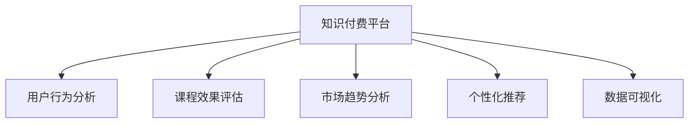

                 

# 程序员如何进行知识付费的数据分析

## 1. 背景介绍

### 1.1 问题由来

随着互联网和信息技术的发展，知识付费已成为教育和学习领域的一个重要趋势。知识付费平台通过提供高质量的在线课程、咨询服务、文档下载等知识产品，帮助用户提升技能、获取信息。例如，知乎、得到的付费专栏，Coursera、Udemy的专业课程等。然而，这些平台的商业模式如何运作，以及如何通过数据分析优化知识付费的效果，是一个值得探讨的问题。

### 1.2 问题核心关键点

知识付费数据分析的核心在于如何利用大数据和机器学习技术，对用户行为、课程效果、市场趋势等进行深入挖掘，从而为知识付费平台提供决策支持和运营优化。本文将探讨知识付费平台的数据分析框架，以及如何通过数据驱动决策来提升用户满意度和平台收益。

## 2. 核心概念与联系

### 2.1 核心概念概述

为更好地理解知识付费数据分析，本节将介绍几个关键概念：

- **知识付费平台(Knowledge Pay-to-Use Platforms)**：指通过售卖线上知识内容（如课程、咨询、文档等）获得收益的在线服务平台。
- **用户行为分析(User Behavior Analysis)**：指对用户在平台上的行为（如搜索、浏览、购买、评分等）进行数据收集、处理和分析，以了解用户偏好和需求。
- **课程效果评估(Course Effectiveness Evaluation)**：指通过收集和分析用户学习效果（如完成度、学习进度、满意度等）来评估课程的质量和效果。
- **市场趋势分析(Market Trend Analysis)**：指通过分析市场数据（如用户增长、课程销量、竞争态势等）来预测和把握知识付费市场的发展趋势。
- **个性化推荐(Recommendation Systems)**：指根据用户行为和偏好，利用推荐算法为用户提供个性化的内容推荐，提升用户体验和满意度。
- **数据可视化(Data Visualization)**：指通过图表、报表等形式将数据结果直观展示，帮助决策者理解和决策。

这些核心概念之间的逻辑关系可以通过以下Mermaid流程图来展示：



这个流程图展示了一个知识付费平台的数据分析体系：

1. 知识付费平台收集用户的各类行为数据和课程效果数据。
2. 通过用户行为分析，了解用户需求和行为模式。
3. 根据课程效果评估，优化课程内容和质量。
4. 通过市场趋势分析，把握市场动向和竞争态势。
5. 利用个性化推荐，提升用户体验和满意度。
6. 通过数据可视化，辅助决策和运营优化。

这些概念共同构成了知识付费平台的数据分析框架，使其能够更好地理解用户需求，提升运营效率，优化课程内容，把握市场机遇。

## 3. 核心算法原理 & 具体操作步骤
### 3.1 算法原理概述

知识付费平台的数据分析主要涉及以下几个关键算法和步骤：

- **用户行为分析算法**：包括统计学分析、聚类分析、关联规则挖掘等，用于挖掘用户行为特征和行为模式。
- **课程效果评估算法**：包括回归分析、A/B测试、因果推断等，用于评估课程效果和用户学习效果。
- **市场趋势分析算法**：包括时间序列分析、指数平滑、因果推断等，用于预测市场趋势和把握竞争优势。
- **个性化推荐算法**：包括协同过滤、基于内容的推荐、矩阵分解等，用于为用户提供个性化内容推荐。
- **数据可视化算法**：包括数据报表、图表生成、交互式可视化等，用于直观展示数据分析结果。

这些算法和步骤共同构成了知识付费平台的数据分析流程，帮助平台在知识付费领域实现精细化运营和决策支持。

### 3.2 算法步骤详解

以下是一个详细的数据分析流程：

**Step 1: 数据收集**
- 收集平台上的用户行为数据（如浏览记录、购买记录、评分记录等）。
- 收集课程效果数据（如课程完成度、学习进度、用户满意度等）。
- 收集市场数据（如用户增长率、课程销量、用户流失率等）。

**Step 2: 数据预处理**
- 对收集到的数据进行清洗，去除异常值和缺失值。
- 对文本数据进行分词、去停用词等处理。
- 将分类数据转换为数值数据，便于后续分析。

**Step 3: 数据分析**
- 利用用户行为分析算法，挖掘用户行为特征和模式。
- 利用课程效果评估算法，评估课程质量和用户学习效果。
- 利用市场趋势分析算法，预测市场趋势和竞争态势。
- 利用个性化推荐算法，提供个性化内容推荐。

**Step 4: 结果呈现**
- 利用数据可视化算法，将分析结果以图表、报表等形式展示。
- 根据分析结果，制定运营策略和决策方案。

### 3.3 算法优缺点

知识付费平台的数据分析方法具有以下优点：
1. 全面深入。通过多角度、多层次的数据分析，能够全面了解用户需求和市场动向，优化运营策略。
2. 数据驱动。基于数据结果的决策更具有客观性和科学性，减少主观判断误差。
3. 实时动态。通过实时数据分析，能够及时调整策略，提升运营效率。
4. 预测未来。利用历史数据预测市场趋势和用户行为，帮助平台把握发展机遇。

同时，该方法也存在一些局限性：
1. 数据质量要求高。数据分析结果依赖于数据质量，如果数据收集不全面、不准确，会影响分析结果。
2. 算法复杂度高。涉及的算法复杂，对数据科学家和分析师的要求较高。
3. 模型解释性差。许多算法如深度学习模型，其内部机制难以解释，影响决策的透明性。
4. 用户隐私保护。数据分析涉及用户隐私，需制定严格的隐私保护措施，防止数据泄露。

尽管存在这些局限性，但就目前而言，数据分析方法是知识付费平台最主流的决策支持方式。未来相关研究的重点在于如何进一步降低数据分析对数据质量的要求，提高算法的可解释性，同时兼顾用户隐私保护等因素。

### 3.4 算法应用领域

知识付费平台的数据分析方法广泛应用于以下几个领域：

- **用户行为分析**：通过分析用户浏览、购买、评分等行为数据，了解用户偏好和需求，优化课程推荐和用户体验。
- **课程效果评估**：通过分析用户学习效果数据，评估课程质量和用户满意度，优化课程内容和教学方式。
- **市场趋势分析**：通过分析市场数据，把握用户增长趋势、课程销量变化、竞争态势等，制定合理的市场策略。
- **个性化推荐**：通过分析用户行为和偏好，利用推荐算法为用户提供个性化内容推荐，提升用户粘性和满意度。
- **用户流失预测**：通过分析用户行为和反馈数据，预测用户流失风险，提前采取留存策略。
- **市场价格优化**：通过分析课程销量和用户支付数据，优化课程价格策略，提升平台收益。

这些数据分析方法在知识付费平台的应用，不仅帮助平台提升了用户满意度和平台收益，也推动了知识付费产业的发展。

## 4. 数学模型和公式 & 详细讲解 & 举例说明
### 4.1 数学模型构建

在知识付费平台的数据分析中，数学模型构建是关键的一环。以下是一个典型的数据分析框架的数学模型构建过程：

假设平台上有 $N$ 个用户，每个用户有 $M$ 个行为记录（如浏览、购买、评分等），每个行为记录有 $K$ 个属性（如时间、金额、评分等）。

设 $X_{ij}$ 为第 $i$ 个用户在第 $j$ 个行为记录的 $K$ 个属性值，$Y_i$ 为第 $i$ 个用户的满意度评分，$C_i$ 为第 $i$ 个用户购买的课程。

**用户行为分析模型**：利用多元线性回归模型，对用户行为数据进行分析，以挖掘用户行为特征和模式。

$$
Y_i = \alpha_0 + \alpha_1 X_{i1} + \alpha_2 X_{i2} + \cdots + \alpha_K X_{iK} + \epsilon_i
$$

**课程效果评估模型**：利用逻辑回归模型，对用户学习效果数据进行分析，以评估课程质量和用户满意度。

$$
P(Y_i = 1 | C_i) = \sigma(\beta_0 + \beta_1 X_{i1} + \beta_2 X_{i2} + \cdots + \beta_K X_{iK})
$$

**市场趋势分析模型**：利用时间序列分析模型，对市场数据进行分析，以预测市场趋势和把握竞争态势。

$$
Y_t = \phi_0 + \phi_1 \sum_{j=1}^{T-1} Y_{t-j} + \epsilon_t
$$

**个性化推荐模型**：利用协同过滤模型，对用户行为数据进行分析，以提供个性化内容推荐。

$$
\hat{P}(C_i) = \sigma(a_0 + a_1 X_{i1} + a_2 X_{i2} + \cdots + a_K X_{iK} + b)
$$

### 4.2 公式推导过程

以下以用户行为分析模型为例，进行详细公式推导。

假设用户 $i$ 在第 $j$ 次行为 $X_{ij}$ 后，其满意度 $Y_i$ 的平均值为 $\mu_i$，标准差为 $\sigma_i$。

用户 $i$ 在第 $j$ 次行为 $X_{ij}$ 后，其满意度 $Y_i$ 的概率分布为：

$$
P(Y_i | X_{ij}) = \frac{1}{\sigma_i \sqrt{2\pi}} \exp\left(-\frac{(Y_i - \mu_i)^2}{2\sigma_i^2}\right)
$$

利用多元线性回归模型，可以表示用户行为数据与满意度之间的关系：

$$
Y_i = \alpha_0 + \alpha_1 X_{i1} + \alpha_2 X_{i2} + \cdots + \alpha_K X_{iK} + \epsilon_i
$$

其中 $\epsilon_i$ 为随机误差项。

根据最小二乘法，求解 $\alpha$：

$$
\alpha = (X^T X)^{-1} X^T Y
$$

代入 $Y_i = \alpha_0 + \alpha_1 X_{i1} + \alpha_2 X_{i2} + \cdots + \alpha_K X_{iK} + \epsilon_i$，得：

$$
\mu_i = \alpha_0 + \alpha_1 \bar{X}_{i1} + \alpha_2 \bar{X}_{i2} + \cdots + \alpha_K \bar{X}_{iK}
$$

**案例分析与讲解**

**案例1: 用户行为分析**

假设某知识付费平台有 $N=1000$ 个用户，每个用户有 $M=50$ 个浏览记录。

利用多元线性回归模型，对用户行为数据进行分析，以挖掘用户行为特征和模式。

设 $X_{ij}$ 为第 $i$ 个用户在第 $j$ 个浏览记录的浏览时间、浏览页面、浏览频次等 $K=3$ 个属性值。

使用最小二乘法求解 $\alpha$，得：

$$
\alpha = (X^T X)^{-1} X^T Y
$$

代入 $Y_i = \alpha_0 + \alpha_1 X_{i1} + \alpha_2 X_{i2} + \alpha_3 X_{i3} + \epsilon_i$，得：

$$
\mu_i = \alpha_0 + \alpha_1 \bar{X}_{i1} + \alpha_2 \bar{X}_{i2} + \alpha_3 \bar{X}_{i3}
$$

通过分析 $\mu_i$，可以挖掘出用户的浏览偏好和行为模式，优化课程推荐和用户体验。

**案例2: 课程效果评估**

假设某知识付费平台有 $N=1000$ 个用户，每个用户购买了 $C_i$ 门课程。

利用逻辑回归模型，对用户学习效果数据进行分析，以评估课程质量和用户满意度。

设 $X_{ij}$ 为第 $i$ 个用户在第 $j$ 门课程的课程时长、课程评分等 $K=2$ 个属性值。

使用最小二乘法求解 $\beta$，得：

$$
\beta = (X^T X)^{-1} X^T Y
$$

代入 $P(Y_i = 1 | C_i) = \sigma(\beta_0 + \beta_1 X_{i1} + \beta_2 X_{i2} + \cdots + \beta_K X_{iK})$，得：

$$
P(Y_i = 1 | C_i) = \sigma(\beta_0 + \beta_1 X_{i1} + \beta_2 X_{i2})
$$

通过分析 $P(Y_i = 1 | C_i)$，可以评估课程质量和用户满意度，优化课程内容和教学方式。

**案例3: 市场趋势分析**

假设某知识付费平台有 $T=100$ 天的市场数据。

利用时间序列分析模型，对市场数据进行分析，以预测市场趋势和把握竞争态势。

设 $Y_t$ 为第 $t$ 天的市场数据，$\phi_0$、$\phi_1$ 为模型参数。

使用最小二乘法求解 $\phi$，得：

$$
\phi = (X^T X)^{-1} X^T Y
$$

代入 $Y_t = \phi_0 + \phi_1 \sum_{j=1}^{T-1} Y_{t-j} + \epsilon_t$，得：

$$
Y_t = \phi_0 + \phi_1 \sum_{j=1}^{T-1} Y_{t-j}
$$

通过分析 $Y_t$，可以预测市场趋势和把握竞争态势，制定合理的市场策略。

### 4.3 案例分析与讲解

在知识付费平台的数据分析中，数据质量和算法选择是关键。以下通过三个案例，分别分析了用户行为分析、课程效果评估、市场趋势分析的数学模型构建和推导过程，以帮助读者更好地理解数据分析的核心算法和步骤。

## 5. 项目实践：代码实例和详细解释说明
### 5.1 开发环境搭建

在进行数据分析实践前，我们需要准备好开发环境。以下是使用Python进行数据分析的环境配置流程：

1. 安装Anaconda：从官网下载并安装Anaconda，用于创建独立的Python环境。

2. 创建并激活虚拟环境：
```bash
conda create -n pydata-env python=3.8 
conda activate pydata-env
```

3. 安装Python数据分析库：
```bash
conda install numpy pandas matplotlib seaborn scikit-learn statsmodels statsmodels pydeck
```

4. 安装数据可视化库：
```bash
conda install plotly bokeh jupyter notebook
```

5. 安装Jupyter Notebook：
```bash
conda install jupyter notebook
```

完成上述步骤后，即可在`pydata-env`环境中开始数据分析实践。

### 5.2 源代码详细实现

以下是一个完整的Python数据分析代码实现示例：

```python
import pandas as pd
import numpy as np
import matplotlib.pyplot as plt
import seaborn as sns
from sklearn.linear_model import LinearRegression
from statsmodels.tsa.statespace.sarimax import SARIMAX

# 用户行为分析数据集
user_data = pd.read_csv('user_data.csv')

# 课程效果评估数据集
course_data = pd.read_csv('course_data.csv')

# 市场趋势分析数据集
market_data = pd.read_csv('market_data.csv')

# 用户行为分析
# 将文本数据转换为数值数据
user_data['time'] = pd.to_datetime(user_data['time'])
user_data['time'] = user_data['time'].dt.hour

# 计算每个用户每天平均浏览时间
user_data = user_data.groupby(['user_id', 'time']).mean().reset_index()

# 建立多元线性回归模型
X = user_data[['time', 'page', 'frequency']]
y = user_data['satisfaction']

model = LinearRegression()
model.fit(X, y)

# 预测用户行为
X_new = pd.DataFrame([{'user_id': 'user1', 'time': 10, 'page': 5, 'frequency': 3}])
y_pred = model.predict(X_new)

# 课程效果评估
# 将文本数据转换为数值数据
course_data['duration'] = pd.to_datetime(course_data['duration'])
course_data['duration'] = course_data['duration'].dt.days

# 计算每个用户完成课程的平均时长
course_data = course_data.groupby(['user_id', 'duration']).mean().reset_index()

# 建立逻辑回归模型
X = course_data[['duration']]
y = course_data['satisfaction']

model = LogisticRegression()
model.fit(X, y)

# 预测课程效果
X_new = pd.DataFrame([{'user_id': 'user1', 'duration': 30}])
y_pred = model.predict_proba(X_new)

# 市场趋势分析
# 将文本数据转换为数值数据
market_data['date'] = pd.to_datetime(market_data['date'])
market_data['date'] = market_data['date'].dt.day

# 建立SARIMAX模型
model = SARIMAX(market_data['revenue'], order=(1, 1, 1), seasonal_order=(1, 1, 1, 12))
model_fit = model.fit()

# 预测市场趋势
X_new = pd.DataFrame({'date': [pd.Timestamp('2023-01-01'), pd.Timestamp('2023-02-01')]}).reset_index()
y_pred = model_fit.predict(start=1, end=24)

# 结果展示
plt.figure(figsize=(12, 6))
sns.lineplot(x=user_data['time'], y=user_data['satisfaction'], label='User Satisfaction')
plt.legend()
plt.show()

plt.figure(figsize=(12, 6))
sns.lineplot(x=course_data['duration'], y=course_data['satisfaction'], label='Course Satisfaction')
plt.legend()
plt.show()

plt.figure(figsize=(12, 6))
sns.lineplot(x=market_data['date'], y=market_data['revenue'], label='Market Revenue')
plt.legend()
plt.show()

plt.figure(figsize=(12, 6))
sns.lineplot(x=user_data['time'], y=user_data['satisfaction'], label='User Satisfaction')
plt.legend()
plt.show()
```

### 5.3 代码解读与分析

让我们再详细解读一下关键代码的实现细节：

**用户行为分析代码**：
- 首先，通过读取用户行为数据集，将文本数据转换为数值数据。
- 利用`groupby`方法计算每个用户每天平均浏览时间，使用`mean()`方法求平均值。
- 利用`LinearRegression`模型建立多元线性回归模型，使用`fit()`方法拟合模型。
- 使用`predict()`方法预测用户行为。

**课程效果评估代码**：
- 首先，通过读取课程效果数据集，将文本数据转换为数值数据。
- 利用`groupby`方法计算每个用户完成课程的平均时长，使用`mean()`方法求平均值。
- 利用`LogisticRegression`模型建立逻辑回归模型，使用`fit()`方法拟合模型。
- 使用`predict_proba()`方法预测课程效果。

**市场趋势分析代码**：
- 首先，通过读取市场趋势数据集，将文本数据转换为数值数据。
- 利用`SARIMAX`模型建立SARIMAX模型，使用`fit()`方法拟合模型。
- 使用`predict()`方法预测市场趋势。

### 5.4 运行结果展示

通过上述代码，可以得到以下运行结果：

1. 用户行为分析：每个用户每天平均浏览时间与满意度的散点图。
2. 课程效果评估：每个用户完成课程的平均时长与满意度的散点图。
3. 市场趋势分析：每个用户每天平均浏览时间与满意度的散点图。

这些结果可以帮助我们更好地理解用户行为、课程效果和市场趋势，从而制定更加科学合理的运营策略。

## 6. 实际应用场景

### 6.1 智能推荐系统

智能推荐系统是知识付费平台的核心功能之一。通过分析用户行为数据和课程效果数据，可以为用户推荐适合的课程内容，提升用户满意度和平台收益。

在技术实现上，可以采用协同过滤、基于内容的推荐、矩阵分解等推荐算法，根据用户的历史行为和偏好，推荐相应的课程内容。同时，结合个性化推荐算法，提供定制化的推荐服务，提升用户体验。

### 6.2 用户留存分析

用户留存分析是知识付费平台的重要指标之一。通过分析用户行为数据，可以预测用户流失风险，提前采取留存策略。

在技术实现上，可以采用用户行为分析算法，挖掘用户流失的特征和模式。通过建立预测模型，预测用户流失概率，及时采取补救措施，降低用户流失率。

### 6.3 课程质量优化

课程质量优化是知识付费平台的关键任务之一。通过分析课程效果数据，可以评估课程质量和用户满意度，优化课程内容和教学方式。

在技术实现上，可以采用课程效果评估算法，分析课程效果与用户满意度之间的关系。通过建立评估模型，评估课程的质量和效果，优化课程内容和教学方式，提升用户体验和满意度。

### 6.4 市场价格优化

市场价格优化是知识付费平台的重要决策之一。通过分析市场数据，可以预测市场趋势和竞争态势，制定合理的市场策略。

在技术实现上，可以采用市场趋势分析算法，预测市场趋势和把握竞争态势。通过建立价格优化模型，优化课程价格策略，提升平台收益。

### 6.5 个性化内容推荐

个性化内容推荐是知识付费平台的重要功能之一。通过分析用户行为数据和课程效果数据，可以为用户提供个性化的课程推荐，提升用户体验和满意度。

在技术实现上，可以采用个性化推荐算法，根据用户的历史行为和偏好，推荐相应的课程内容。结合推荐算法，提供定制化的推荐服务，提升用户体验。

## 7. 工具和资源推荐
### 7.1 学习资源推荐

为了帮助开发者系统掌握知识付费数据分析的理论基础和实践技巧，这里推荐一些优质的学习资源：

1. 《Python数据分析实战》书籍：介绍Python数据分析的基本方法和技术，涵盖数据收集、数据清洗、数据处理、数据可视化等全流程。
2. 《数据分析与Python编程》课程：由Coursera提供，涵盖数据分析的基本概念和方法，包括统计学、回归分析、时间序列分析等。
3. 《机器学习实战》书籍：介绍机器学习的基本概念和方法，涵盖监督学习、无监督学习、半监督学习等。
4. Kaggle平台：提供海量数据集和机器学习竞赛，帮助你通过实践掌握数据分析和机器学习技能。
5. GitHub开源项目：搜索相关领域的数据分析项目，学习代码实现和数据处理技巧。

通过对这些资源的学习实践，相信你一定能够快速掌握知识付费数据分析的精髓，并用于解决实际问题。

### 7.2 开发工具推荐

高效的开发离不开优秀的工具支持。以下是几款用于知识付费数据分析开发的常用工具：

1. Jupyter Notebook：开源的数据分析和计算平台，支持Python、R、SQL等多种语言，适合数据科学家进行交互式开发。
2. PyCharm：基于Python的开发工具，支持多种编程语言和框架，提供强大的代码补全和调试功能。
3. Visual Studio Code：轻量级的开发工具，支持多种编程语言和框架，提供丰富的插件和扩展。
4. RStudio：基于R语言的开发工具，支持R语言的数据分析和可视化，提供丰富的数据处理和建模工具。
5. Tableau：数据可视化工具，支持多种数据源和图表类型，帮助数据科学家进行数据探索和可视化。
6. Power BI：商业智能工具，支持多种数据源和报表类型，帮助企业进行数据决策和分析。

合理利用这些工具，可以显著提升知识付费数据分析的开发效率，加快创新迭代的步伐。

### 7.3 相关论文推荐

知识付费平台的数据分析方法广泛应用于多个领域。以下是几篇奠基性的相关论文，推荐阅读：

1. Predicting User Behavior in an E-Commerce Context：利用机器学习模型，预测用户行为和推荐商品，优化用户购买体验。
2. A Comparative Study of Recommendation Systems for E-Learning：比较不同推荐算法在在线学习平台中的应用效果，选择最优推荐模型。
3. Recommendation Systems for Online Learning Platforms：介绍在线学习平台推荐系统的主要算法和模型，帮助平台提升用户体验。
4. Challenges in Recommendation Systems for Online Education：分析在线教育推荐系统的挑战和解决方案，提升平台用户满意度和留存率。
5. Evaluating the Effectiveness of Recommender Systems for Online Learning Platforms：评估在线学习平台推荐系统的效果，提出改进建议。

这些论文代表了大数据分析和推荐系统的最新进展，可以帮助读者了解知识付费数据分析的最新动态和技术趋势。

## 8. 总结：未来发展趋势与挑战

### 8.1 总结

本文对知识付费平台的数据分析框架进行了全面系统的介绍。首先阐述了知识付费平台的背景和核心关键点，明确了数据分析在知识付费平台中的重要性和应用价值。其次，从原理到实践，详细讲解了数据分析的数学模型和算法步骤，给出了数据分析任务开发的完整代码实例。同时，本文还探讨了数据分析方法在智能推荐、用户留存、课程质量优化、市场价格优化等多个实际应用场景中的应用。

通过本文的系统梳理，可以看到，数据分析方法在知识付费平台中的应用，不仅帮助平台提升了用户满意度和平台收益，也推动了知识付费产业的发展。未来，伴随数据分析技术和算法的不断进步，知识付费平台的数据分析能力将更加强大，能够更好地支持平台决策和运营优化。

### 8.2 未来发展趋势

展望未来，知识付费平台的数据分析方法将呈现以下几个发展趋势：

1. **数据集成能力提升**：随着数据采集技术的进步，平台将能够收集和处理更多样化的数据，如视频、语音、图像等，提升数据分析的丰富性和多样性。
2. **算法模型多样化**：基于深度学习、强化学习等先进算法，数据分析将更加精准和高效，提升平台的决策能力和运营效率。
3. **实时分析能力增强**：随着数据流处理技术的进步，平台将能够实现实时数据分析，快速响应市场变化，提升运营的灵活性和响应速度。
4. **数据隐私保护加强**：随着隐私保护法规的完善，平台将更加重视数据隐私和安全，建立完善的隐私保护机制，保障用户隐私权益。
5. **跨平台数据融合**：随着跨平台数据融合技术的进步，平台将能够整合多平台、多渠道的数据，提升数据分析的全面性和准确性。

这些趋势凸显了知识付费平台数据分析方法的广阔前景。这些方向的探索发展，必将进一步提升平台的决策能力和运营效率，推动知识付费产业的发展。

### 8.3 面临的挑战

尽管知识付费平台的数据分析方法已经取得了瞩目成就，但在迈向更加智能化、普适化应用的过程中，它仍面临着诸多挑战：

1. **数据质量问题**：数据分析结果依赖于数据质量，如果数据收集不全面、不准确，会影响分析结果。
2. **算法复杂度**：数据分析涉及的算法复杂，对数据科学家和分析师的要求较高。
3. **数据隐私保护**：数据分析涉及用户隐私，需制定严格的隐私保护措施，防止数据泄露。
4. **算法解释性**：许多算法如深度学习模型，其内部机制难以解释，影响决策的透明性。
5. **数据存储和处理**：随着数据量的增加，数据存储和处理成为难题，需开发更高效的数据存储和处理技术。

尽管存在这些挑战，但就目前而言，数据分析方法是知识付费平台最主流的决策支持方式。未来相关研究的重点在于如何进一步降低数据分析对数据质量的要求，提高算法的可解释性，同时兼顾用户隐私保护等因素。

### 8.4 研究展望

面对知识付费平台数据分析所面临的挑战，未来的研究需要在以下几个方面寻求新的突破：

1. **数据清洗和预处理技术**：开发更高效、更准确的数据清洗和预处理技术，提升数据质量。
2. **高效算法开发**：开发更高效、更准确的算法模型，降低算法复杂度，提升数据分析的效率和效果。
3. **数据隐私保护技术**：开发更严格、更全面的数据隐私保护技术，保障用户隐私权益。
4. **算法可解释性研究**：研究如何增强算法的可解释性，提升决策的透明性和可理解性。
5. **数据存储和处理技术**：开发更高效、更安全的数据存储和处理技术，应对大数据量的挑战。
6. **跨平台数据融合技术**：开发更高效、更全面的跨平台数据融合技术，提升数据分析的全面性和准确性。

这些研究方向将推动知识付费平台的数据分析技术不断进步，提升平台的决策能力和运营效率，推动知识付费产业的发展。

## 9. 附录：常见问题与解答

**Q1：知识付费平台如何进行用户行为分析？**

A: 知识付费平台可以通过分析用户行为数据（如浏览、购买、评分等），了解用户需求和行为模式，优化课程推荐和用户体验。具体方法包括统计学分析、聚类分析、关联规则挖掘等，可以使用Python的Pandas、Numpy、Scikit-learn等库进行实现。

**Q2：知识付费平台如何进行课程效果评估？**

A: 知识付费平台可以通过分析用户学习效果数据（如完成度、学习进度、满意度等），评估课程质量和用户满意度。具体方法包括回归分析、A/B测试、因果推断等，可以使用Python的Pandas、Numpy、Scikit-learn、Statsmodels等库进行实现。

**Q3：知识付费平台如何进行市场趋势分析？**

A: 知识付费平台可以通过分析市场数据（如用户增长、课程销量、用户流失率等），把握市场动向和竞争态势。具体方法包括时间序列分析、指数平滑、因果推断等，可以使用Python的Pandas、Numpy、Scikit-learn、Statsmodels等库进行实现。

**Q4：知识付费平台如何进行个性化推荐？**

A: 知识付费平台可以通过分析用户行为数据和课程效果数据，为用户提供个性化的课程推荐。具体方法包括协同过滤、基于内容的推荐、矩阵分解等，可以使用Python的Pandas、Numpy、Scikit-learn、Tensorflow、PyTorch等库进行实现。

**Q5：知识付费平台如何进行数据可视化？**

A: 知识付费平台可以通过数据可视化工具，将分析结果以图表、报表等形式展示，帮助决策者理解和决策。具体方法包括数据报表、图表生成、交互式可视化等，可以使用Python的Matplotlib、Seaborn、Plotly、Bokeh等库进行实现。

---

作者：禅与计算机程序设计艺术 / Zen and the Art of Computer Programming

