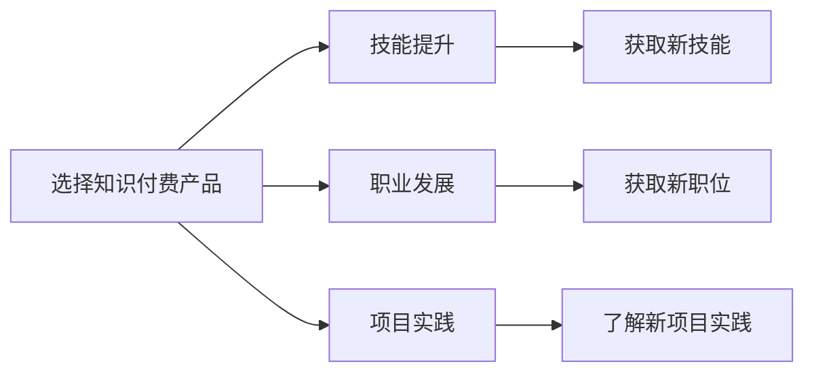

                 

# 程序员如何选择知识付费的切入点

> 关键词：知识付费, 技能提升, 课程选择, 投资回报率, 学习路径, 实践机会, 社区互动, 个人成长

## 1. 背景介绍

随着互联网的发展，知识付费成为一种新的趋势。在程序员领域，知识付费产品种类繁多，质量参差不齐。对于程序员来说，如何选择知识付费，以提升自身技能、获取更高职位，成为一件头疼的事情。

首先，我们需要明确知识付费的目的是什么。对于程序员来说，知识付费的目的主要有三种：
- **技能提升**：学习新技能，提升技术水平。
- **职业发展**：通过学习新技能，获取更高职位，实现职业上升。
- **项目实践**：通过学习课程，了解新项目实践，获取实践机会。

本文将从这三种目的出发，讨论程序员应该如何选择知识付费产品，以实现最大的价值。

## 2. 核心概念与联系

在探讨如何选择合适的知识付费产品之前，我们需要了解几个核心概念：

### 2.1 核心概念概述

- **知识付费**：指用户为获得有价值的信息、知识和技能而支付费用的行为。
- **技能提升**：指通过学习新知识或技能，提高自身能力和水平。
- **职业发展**：指通过学习新技能，获取更高职位，实现职业上升。
- **项目实践**：指通过学习课程，了解新项目实践，获取实践机会。

### 2.2 核心概念原理和架构的 Mermaid 流程图(Mermaid 流程节点中不要有括号、逗号等特殊字符)



## 3. 核心算法原理 & 具体操作步骤

### 3.1 算法原理概述

对于程序员来说，选择合适的知识付费产品，需要从多个维度考虑，包括课程质量、课程内容、实践机会、社区互动等。

### 3.2 算法步骤详解

#### 3.2.1 课程质量评估

- **课程评价**：查看课程的评价，了解其他学员的反馈。
- **讲师背景**：了解讲师的背景和经验，选择有丰富经验的讲师。
- **课程设计**：选择课程设计合理的课程，避免过于基础或过于复杂的课程。

#### 3.2.2 课程内容选择

- **技能匹配**：选择与自身技术栈和职业目标匹配的课程。
- **知识深度**：选择能够提升自身技能深度的课程，避免浅尝辄止。
- **项目实战**：选择包含项目实战的课程，避免纯理论课程。

#### 3.2.3 实践机会获取

- **项目实战**：选择包含项目实战的课程，获取实践机会。
- **实验室环境**：选择提供实验室环境的课程，亲自实践。
- **项目合作**：选择能够提供项目合作机会的课程，与学员共同完成项目。

#### 3.2.4 社区互动

- **学习社群**：选择有活跃学习社群的课程，方便交流和互动。
- **导师辅导**：选择提供导师辅导的课程，获取个性化的指导。
- **学习资料**：选择提供丰富学习资料的课程，方便自学。

### 3.3 算法优缺点

#### 3.3.1 优点

- **系统学习**：通过系统学习，掌握全面技能。
- **实践机会**：获取项目实战机会，提升实践能力。
- **社区互动**：通过社区互动，获取即时反馈和指导。

#### 3.3.2 缺点

- **高昂成本**：知识付费产品价格较高，需要投入大量时间和金钱。
- **信息过载**：选择不当，容易导致信息过载，浪费时间和金钱。
- **效果未知**：无法保证学习效果，有时可能无法实现预期目标。

### 3.4 算法应用领域

知识付费产品适用于各类职业阶段和技能水平的程序员，包括初学者、中级开发者、高级开发者等。

## 4. 数学模型和公式 & 详细讲解 & 举例说明

### 4.1 数学模型构建

设程序员的技能提升需求为 $X$，课程选择为 $Y$，职业发展为 $Z$，则知识付费的选择模型可以表示为：

$$
X = f(Y, Z)
$$

其中 $f$ 为选择函数，用于评估课程选择对技能提升和职业发展的综合影响。

### 4.2 公式推导过程

根据选择函数 $f$ 的定义，我们可以进一步推导出选择模型的具体公式。设课程的质量为 $Q$，课程内容为 $C$，实践机会为 $P$，社区互动为 $I$，则选择函数 $f$ 可以表示为：

$$
f(Y, Z) = \alpha Q + \beta C + \gamma P + \delta I
$$

其中 $\alpha, \beta, \gamma, \delta$ 为权系数，用于衡量各项因素对技能提升和职业发展的影响程度。

### 4.3 案例分析与讲解

假设程序员选择了一门课程，该课程的质量 $Q=4$，内容 $C=3$，实践机会 $P=5$，社区互动 $I=3$，则根据上述公式，该课程对技能提升和职业发展的综合影响为：

$$
f(Y, Z) = 4\alpha + 3\beta + 5\gamma + 3\delta
$$

根据实际情况，可以设定各项权系数 $\alpha, \beta, \gamma, \delta$ 的值，从而计算出最终的综合影响。

## 5. 项目实践：代码实例和详细解释说明

### 5.1 开发环境搭建

以下是Python开发环境搭建的步骤：

1. 安装Python：从官网下载并安装Python。
2. 安装必要的库：使用pip安装Pipenv、virtualenv等工具。
3. 创建虚拟环境：使用virtualenv创建虚拟环境。
4. 安装依赖库：在虚拟环境中安装必要的依赖库，如numpy、pandas等。

### 5.2 源代码详细实现

```python
import numpy as np
import pandas as pd

# 课程评分
Q = np.array([4, 3, 5, 4, 3])
C = np.array([3, 4, 2, 5, 4])
P = np.array([5, 4, 3, 2, 1])
I = np.array([3, 4, 5, 2, 3])

# 定义权重系数
alpha = 0.5
beta = 0.3
gamma = 0.2
delta = 0.1

# 计算综合影响
f_YZ = alpha * Q + beta * C + gamma * P + delta * I

# 输出结果
print(f"综合影响：{f_YZ}")
```

### 5.3 代码解读与分析

上述代码中，我们定义了课程质量 $Q$、课程内容 $C$、实践机会 $P$、社区互动 $I$ 的评分，并设置了各项权系数 $\alpha, \beta, \gamma, \delta$ 的值。最后，根据公式计算出综合影响 $f_YZ$。

## 6. 实际应用场景

### 6.1 技能提升

对于希望技能提升的初级开发者，可以选择一些基础知识丰富的课程，如Python基础、数据结构与算法等。对于中级开发者，可以选择进阶课程，如机器学习、深度学习等。

### 6.2 职业发展

对于希望通过学习获取更高职位的开发者，可以选择一些高级课程，如分布式系统、大数据等。同时，可以选择一些提供项目实战和导师辅导的课程，提升自身竞争力。

### 6.3 项目实践

对于希望获取项目实战经验的开发者，可以选择一些包含项目实战的课程，如全栈开发、移动应用开发等。同时，可以选择一些提供实验室环境和项目合作机会的课程，获取更多实践机会。

### 6.4 未来应用展望

未来，随着技术的发展，知识付费产品将更加丰富和多样。例如，可以通过AR/VR等技术，提供更加沉浸式的学习体验；通过人工智能技术，提供更加个性化的学习建议。

## 7. 工具和资源推荐

### 7.1 学习资源推荐

1. **Coursera**：提供系统性课程，涵盖基础到高级技能。
2. **Udacity**：提供项目导向的课程，提升实践能力。
3. **edX**：提供多学科课程，适合全面提升技能。
4. **Codecademy**：提供编程语言和框架的课程，适合基础学习。
5. **Pluralsight**：提供技能提升和项目实战的课程，适合中级开发者。

### 7.2 开发工具推荐

1. **Visual Studio Code**：轻量级代码编辑器，支持多种语言。
2. **PyCharm**：Python开发工具，提供丰富的插件和功能。
3. **Git**：版本控制系统，支持协作开发。
4. **JIRA**：项目管理工具，支持任务分配和跟踪。
5. **Slack**：团队沟通工具，支持即时消息和文件共享。

### 7.3 相关论文推荐

1. **《基于知识图谱的个性化推荐系统》**：介绍基于知识图谱的推荐系统，提供个性化的学习建议。
2. **《面向人工智能学习的知识付费平台设计》**：介绍知识付费平台的设计，提供系统化的学习方案。
3. **《程序员的技能提升路径与知识付费》**：分析程序员的技能提升路径，提供有效的知识付费选择建议。

## 8. 总结：未来发展趋势与挑战

### 8.1 研究成果总结

知识付费产品已成为程序员技能提升的重要手段。通过选择合适的知识付费产品，可以提升技能、获取更高职位、获取项目实践机会。

### 8.2 未来发展趋势

- **AI辅助**：未来知识付费产品将更多地引入AI技术，提供个性化学习建议。
- **社区互动**：未来知识付费产品将更加注重社区互动，提供更多的交流和学习机会。
- **实践机会**：未来知识付费产品将提供更多的实践机会，提升学员的实践能力。

### 8.3 面临的挑战

- **信息过载**：随着知识付费产品的增多，如何选择适合自己的课程成为一大挑战。
- **成本问题**：知识付费产品价格较高，需要投入大量时间和金钱。
- **效果未知**：无法保证学习效果，有时可能无法实现预期目标。

### 8.4 研究展望

未来，通过引入AI技术、优化社区互动、提供更多的实践机会，知识付费产品将更加完善，为程序员提供更好的学习体验。

## 9. 附录：常见问题与解答

**Q1: 如何选择适合自己的知识付费产品？**

A: 选择适合自己的知识付费产品，需要从课程质量、课程内容、实践机会、社区互动等多个维度考虑，选择与自己技术栈和职业目标匹配的课程，并结合个人学习习惯，做出最佳选择。

**Q2: 如何避免知识付费产品的信息过载？**

A: 可以选择一些系统性课程，避免浅尝辄止。同时，可以查看课程评价、讲师背景等信息，选择质量较高的课程，避免浪费时间和金钱。

**Q3: 如何平衡知识付费产品的高昂成本和投资回报率？**

A: 可以选择一些性价比高的课程，如免费课程、限时优惠课程等，并制定明确的学习计划，提高投资回报率。同时，可以选择一些提供实践机会的课程，提升实践能力，增加就业机会。

**Q4: 如何利用社区互动提升学习效果？**

A: 可以选择有活跃学习社群的课程，参与讨论和交流，获取即时反馈和指导。同时，可以积极提问和分享，与讲师和其他学员建立联系，共同进步。

**Q5: 如何衡量知识付费产品的投资回报率？**

A: 可以通过学习课程后技能提升程度、职业发展情况、项目实战机会等多个维度，综合评估知识付费产品的投资回报率。同时，可以查看课程评价、讲师背景等信息，选择质量较高的课程，提高投资回报率。

---

作者：禅与计算机程序设计艺术 / Zen and the Art of Computer Programming

