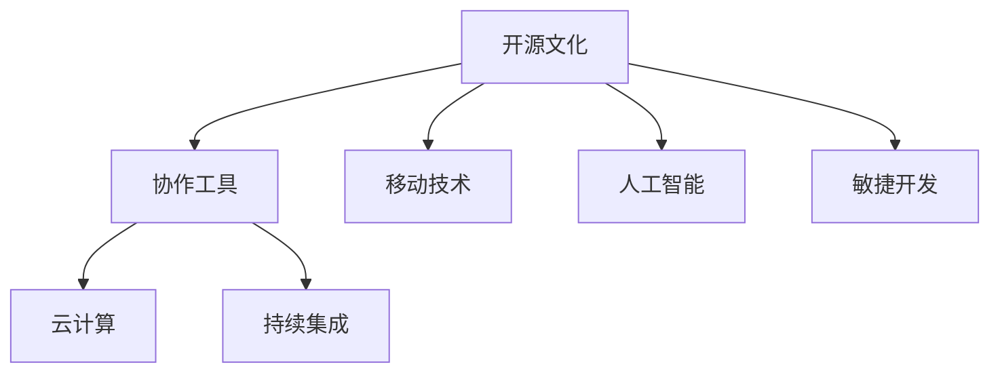

                 

# 程序员的全球化视野：机遇与挑战

> 关键词：全球化，软件开发，技术创新，互联网时代，人工智能

## 1. 背景介绍

### 1.1 问题由来
随着全球化的浪潮，信息技术正在以前所未有的速度和规模渗透到全球各个角落。这一进程极大地推动了技术创新和应用，同时也给全球程序员带来了前所未有的机遇与挑战。过去二十年间，程序员的工作内容、工作方式、职业前景都发生了深刻的变化。

### 1.2 问题核心关键点
程序员的全球化视野，指的是在全球化背景下，程序员在技术选择、项目协作、市场竞争、职业发展等方面的考量与应对。尤其是在互联网时代和人工智能浪潮下，全球化的影响更加深远。

1. **技术选择**：如何根据全球市场需求和技术趋势，选择最适合的开发语言、框架、工具等。
2. **项目协作**：如何跨越地域、时区、文化等障碍，高效协同完成跨国的软件开发项目。
3. **市场竞争**：如何在全球化的市场竞争中，提升自身竞争力，开拓国际市场。
4. **职业发展**：如何在国际化的职业环境中，积累经验，提升能力，实现职业成长。

### 1.3 问题研究意义
研究程序员全球化视野，对于推动信息技术在全球的广泛应用，促进国际技术交流，培养国际化技术人才，具有重要的意义：

1. **提升技术全球竞争力**：通过全球化视野，选择和应用最先进的技术，提升本国技术的全球竞争力。
2. **促进技术创新与传播**：全球化视野有助于程序员了解和借鉴国际上最前沿的技术创新，加速技术在全球范围内的传播与落地。
3. **推动产业发展**：技术全球化视野有助于程序员在国际化环境中更好地参与全球产业分工，推动本国IT产业的发展。
4. **培养国际化人才**：提升程序员的全球化视野，有助于培养具有国际视野和跨文化能力的技术人才。

## 2. 核心概念与联系

### 2.1 核心概念概述

在全球化背景下，程序员需要具备多个关键概念：

1. **开源文化**：开源文化倡导共享、协作、开放的精神，是全球化技术交流的基础。
2. **云计算与分布式开发**：云计算与分布式开发技术打破了地域限制，使得全球团队能够高效协作。
3. **移动技术**：移动技术推动了全球化应用的发展，程序员需要掌握移动开发的相关技能。
4. **人工智能与机器学习**：人工智能和机器学习技术的应用正在全球范围内迅速扩展，程序员需要了解和掌握相关知识。
5. **敏捷开发与持续集成**：敏捷开发与持续集成技术，提升了全球化项目管理的效率和灵活性。

### 2.2 核心概念原理和架构的 Mermaid 流程图



以上流程图展示了全球化背景下程序员所需具备的关键概念及其相互联系。

## 3. 核心算法原理 & 具体操作步骤

### 3.1 算法原理概述

全球化视野下的程序员开发工作，往往需要跨越国界、时区、文化等限制，高效协同完成任务。为了实现这一目标，程序员需要具备以下核心算法原理：

1. **分布式开发**：通过云计算平台，程序员可以在全球范围内组建跨地域的开发团队，高效协同完成任务。
2. **持续集成与持续部署**：采用持续集成和持续部署(CI/CD)技术，快速迭代软件开发，缩短产品上市时间。
3. **版本控制与协同工作**：使用版本控制工具（如Git），保证代码的可靠性和可追溯性，支持多人协作。
4. **开源协作**：利用开源社区的资源，加速技术迭代，提升代码质量和开发效率。

### 3.2 算法步骤详解

以下是基于全球化视野的程序员开发工作的详细步骤：

**Step 1: 选择合适的开发环境**
- 评估不同的开发环境（如云环境、本地环境），选择最适合的解决方案。

**Step 2: 构建分布式开发团队**
- 组建跨地域的开发团队，选择合适的协作工具和平台（如GitHub、GitLab）。
- 设置清晰的项目沟通流程，确保信息流畅传递。

**Step 3: 设计分布式版本控制**
- 使用版本控制工具（如Git）管理代码变更，确保多人协作时的代码一致性。
- 设置分支管理策略，明确代码审查流程，保证代码质量。

**Step 4: 实施持续集成与持续部署**
- 采用CI/CD工具（如Jenkins、Travis CI）自动化构建、测试和部署流程。
- 设置自动化测试和代码质量检查，确保代码稳定性。

**Step 5: 利用开源社区资源**
- 参与开源社区的项目，借鉴和分享代码、工具、最佳实践。
- 通过开源社区获取技术支持，提升自身技术水平。

**Step 6: 部署全球化应用**
- 利用云计算平台（如AWS、Azure、Google Cloud）部署应用，支持全球用户访问。
- 采用容灾备份策略，确保系统的高可用性和稳定性。

### 3.3 算法优缺点

全球化视野下的程序员开发方法具有以下优点：

1. **高效协作**：跨地域的分布式开发团队，可以充分利用全球的人才资源，提升项目开发效率。
2. **灵活迭代**：持续集成与持续部署技术，可以加速技术迭代，快速响应市场变化。
3. **质量保障**：版本控制和代码审查流程，可以保证代码质量和可靠性。
4. **技术创新**：开源社区的资源，可以促进技术交流和创新，提升整体技术水平。

同时，也存在一些缺点：

1. **时区差异**：跨时区协作可能带来沟通成本和效率问题。
2. **文化差异**：跨文化协作可能存在沟通障碍和理解问题。
3. **技术标准化**：不同国家的技术标准和规范可能存在差异，需要额外协调。

### 3.4 算法应用领域

基于全球化视野的程序员开发方法，已经在多个领域得到了广泛的应用：

1. **互联网产品开发**：全球化互联网产品的开发和部署，如社交媒体、电商平台、在线教育等。
2. **软件外包**：利用全球的人才资源，进行软件开发外包，提升开发效率和成本效益。
3. **企业IT系统**：全球化企业IT系统的建设和运维，如ERP、CRM、数据中心等。
4. **移动应用开发**：跨平台移动应用的开发和部署，支持全球用户使用。
5. **大数据分析**：全球化大数据分析平台的构建，支持多国数据集成和分析。

## 4. 数学模型和公式 & 详细讲解 & 举例说明

### 4.1 数学模型构建

本节将介绍基于全球化视野的程序员开发工作所需的数学模型构建方法。

以分布式协同开发为例，假设全球有两个团队（Team A和Team B），分布在不同时区。设Team A的任务量为$T_A$，Team B的任务量为$T_B$，总任务量为$T$，每个团队的工作效率为$e_A$和$e_B$，则总任务完成的数学模型为：

$$
T = T_A + T_B
$$

其中：

- $T_A = e_A \times t_A$
- $T_B = e_B \times t_B$
- $t_A$和$t_B$分别为Team A和Team B的工作时间。

### 4.2 公式推导过程

为了保证项目按时完成，需要根据各团队的工作效率和工作时间，计算总任务量：

$$
T = T_A + T_B = e_A \times t_A + e_B \times t_B
$$

假设两个团队的工作效率相同，即$e_A = e_B = e$，则公式简化为：

$$
T = e \times (t_A + t_B)
$$

根据实际项目需求，合理分配各团队的工作时间和任务量，可以保证项目按时完成。

### 4.3 案例分析与讲解

**案例分析**：假设一个全球化软件开发项目，需要两个团队共同完成。Team A位于纽约（时区-4），Team B位于北京（时区+8）。Team A的工作效率为$e_A = 1.2$（即1小时完成1.2个任务），Team B的工作效率为$e_B = 1.3$。假设Team A每天工作8小时，Team B每天工作6小时，求完成项目所需的总天数。

**讲解**：

- 首先将Team A的工作时间转换为北京时间，即$8 \times 3 = 24$小时。
- 根据公式$T = e \times (t_A + t_B)$，代入$e = 1.2$，$t_A = 24$，$t_B = 6$，计算得：

$$
T = 1.2 \times (24 + 6) = 42
$$

因此，完成项目所需总天数为：

$$
\frac{T}{(e_A + e_B)} = \frac{42}{1.2 + 1.3} = 15
$$

**总结**：合理分配各团队的工作时间和任务量，可以保证项目按时完成，提高全球化开发效率。

## 5. 项目实践：代码实例和详细解释说明

### 5.1 开发环境搭建

在进行全球化视野下的程序员开发实践前，需要准备合适的开发环境：

1. **选择合适的开发语言和框架**：根据项目需求和团队技术栈，选择适合的开发语言和框架。
2. **设置开发环境**：安装相应的开发工具（如IDE、文本编辑器），配置版本控制工具（如Git）。
3. **选择云平台**：选择合适的云平台（如AWS、Azure、Google Cloud），搭建分布式开发环境。
4. **配置CI/CD工具**：安装和配置持续集成与持续部署工具（如Jenkins、Travis CI），设置自动化测试流程。

### 5.2 源代码详细实现

以下是一个分布式开发项目的示例代码，展示了如何使用Git和Jenkins实现持续集成与持续部署：

```python
# 示例代码
# 使用Python和Flask开发一个简单的Web应用
from flask import Flask, request

app = Flask(__name__)

@app.route('/')
def hello_world():
    return 'Hello, World!'

if __name__ == '__main__':
    app.run(debug=True)
```

**代码解释**：

1. **创建项目仓库**：在GitHub上创建项目仓库，将代码推送到仓库中。
2. **配置Jenkins**：在Jenkins上配置项目构建，设置CI/CD流程。
3. **运行Jenkins**：启动Jenkins，自动构建和测试代码，生成部署包。
4. **部署应用**：将部署包上传到云平台，部署Web应用。

### 5.3 代码解读与分析

**代码解读**：

- `Flask`是一个轻量级的Python Web框架，用于快速开发Web应用。
- `@app.route('/')` 定义了一个路由，用于处理根路径的请求。
- `return 'Hello, World!'` 返回一个简单的HTTP响应，显示"Hello, World!"。

**代码分析**：

- 使用Python和Flask可以快速开发和部署Web应用，适合分布式开发环境。
- 代码简单直观，易于维护和扩展。
- 结合Git和Jenkins，可以实现持续集成与持续部署，提升开发效率和质量。

**运行结果展示**：

- 在本地运行代码，访问`http://localhost:5000`，会显示"Hello, World!"。
- 部署到云平台后，可以通过公网访问Web应用，实现全球用户访问。

## 6. 实际应用场景

### 6.1 互联网产品开发

基于全球化视野的程序员开发方法，广泛应用于互联网产品开发中。通过跨地域、跨时区的分布式开发，可以迅速迭代产品，满足全球用户需求。

**示例**：一家跨国互联网公司开发一款社交媒体应用，需要分布在纽约和北京的开发团队协同工作。纽约团队负责前端开发和UI设计，北京团队负责后端开发和服务器部署。通过Jenkins自动化构建和部署，可以实时更新应用，提升用户体验。

### 6.2 软件外包

全球化视野下的程序员开发方法，也广泛应用于软件外包项目中。外包公司可以组建跨国的开发团队，充分利用全球人才资源，降低开发成本，提升开发效率。

**示例**：一家外包公司承接一个电商平台的后端开发项目，需要组建包含印度、中国、菲律宾的跨国开发团队。通过使用Git和Jenkins，实现高效协同和持续集成，按时完成项目交付。

### 6.3 企业IT系统

全球化视野下的程序员开发方法，在企业IT系统建设中同样具有重要应用。通过分布式开发和云平台部署，可以构建跨地域的企业IT系统，支持全球业务。

**示例**：一家跨国企业需要构建全球化的ERP系统，分布在纽约、伦敦和东京的开发团队协同工作。通过AWS云平台部署，实现全球数据同步和应用协同。

### 6.4 未来应用展望

全球化视野下的程序员开发方法，未来将广泛应用于更多领域，带来更多的创新和变革：

1. **智能城市建设**：通过全球化开发，构建跨地域的智能城市管理系统，提升城市运行效率和管理水平。
2. **物联网应用**：通过全球化开发，构建跨地域的物联网应用，实现全球设备互联和数据共享。
3. **全球化电商平台**：通过全球化开发，构建支持全球用户访问的电商平台，提升跨境电商的体验和效率。
4. **全球化数据分析**：通过全球化开发，构建全球化的大数据分析平台，支持多国数据集成和分析。

## 7. 工具和资源推荐

### 7.1 学习资源推荐

为了帮助程序员提升全球化视野，以下是一些优质的学习资源：

1. **《全球化软件工程》系列课程**：涵盖全球化软件开发、分布式开发、持续集成等主题，适合初学者和进阶开发者。
2. **《云计算基础》系列课程**：介绍云计算平台、云安全、云架构等相关知识，提升全球化开发能力。
3. **《人工智能与机器学习》系列课程**：涵盖人工智能和机器学习的基础知识、前沿技术和实际应用，提升全球化开发中的技术能力。
4. **GitHub官方文档**：GitHub作为全球最大的开源社区，提供丰富的学习资源和开发工具，适合全球化开发实践。
5. **《分布式系统设计》系列书籍**：介绍分布式系统架构、设计原则、案例分析等，提升全球化开发中的系统设计能力。

### 7.2 开发工具推荐

以下是几款用于全球化开发推荐的工具：

1. **Git**：版本控制工具，支持多人协作和版本管理，是全球化开发的基础。
2. **Jenkins**：持续集成和持续部署工具，支持自动化构建、测试和部署流程，提升全球化开发效率。
3. **AWS、Azure、Google Cloud**：云平台，提供全球化的计算、存储和网络资源，支持全球化应用部署。
4. **Docker**：容器化技术，支持跨平台应用部署，提升全球化开发中的可移植性。
5. **Kubernetes**：容器编排技术，支持大规模集群管理，提升全球化开发中的资源管理能力。

### 7.3 相关论文推荐

以下是一些相关的论文，推荐阅读：

1. **《分布式软件开发实践》**：介绍了分布式软件开发的最佳实践，涵盖版本控制、协作工具、持续集成等方面。
2. **《云计算平台设计与实现》**：介绍了云计算平台的设计与实现技术，涵盖弹性计算、存储、网络等核心功能。
3. **《人工智能与机器学习在软件开发中的应用》**：介绍了人工智能和机器学习在软件开发中的应用，涵盖模型训练、推理引擎、应用场景等。
4. **《全球化软件工程挑战与应对》**：介绍了全球化软件开发中的挑战和应对策略，涵盖时区差异、文化差异、技术标准化等方面。
5. **《全球化IT系统设计与实现》**：介绍了全球化IT系统设计与实现技术，涵盖分布式架构、跨地域数据同步、应用协同等方面。

## 8. 总结：未来发展趋势与挑战

### 8.1 研究成果总结

全球化视野下的程序员开发方法，已经在多个领域取得了显著成果，提升了开发效率和产品质量。未来，随着全球化进程的加速，该方法将发挥更大的作用。

### 8.2 未来发展趋势

1. **全球化云计算**：云计算平台将更加全球化，支持更多国家和地区的业务需求。
2. **分布式软件开发**：分布式开发技术将更加成熟，支持更多的协作模式和工具。
3. **持续集成与持续部署**：CI/CD技术将更加普及，提升全球化开发中的迭代速度和质量。
4. **开源社区的全球化**：开源社区将更加全球化，促进全球技术交流与创新。

### 8.3 面临的挑战

尽管全球化视野下的程序员开发方法已经取得了显著成果，但仍然面临一些挑战：

1. **时区和文化差异**：跨时区和文化协作可能带来沟通成本和效率问题。
2. **技术标准化**：不同国家的技术标准和规范可能存在差异，需要额外协调。
3. **数据安全和隐私**：全球化开发中的数据安全和隐私问题需要特别注意。

### 8.4 研究展望

未来，全球化视野下的程序员开发方法需要进一步探索和优化，以应对上述挑战：

1. **自动化工具的提升**：开发更加高效的自动化工具，减少人工干预，提升协作效率。
2. **跨文化交流的加强**：加强跨文化交流和培训，提升团队的文化适应能力。
3. **技术标准的统一**：推动国际技术标准的统一，减少技术协作的障碍。
4. **数据安全和隐私的保护**：加强数据安全和隐私保护技术，确保数据的安全性。

总之，全球化视野下的程序员开发方法将推动信息技术在全球范围内的广泛应用，带来更多的创新和变革。面对未来的挑战，需要全球技术社区共同努力，不断优化和提升该方法，实现全球化技术的可持续发展。

## 9. 附录：常见问题与解答

**Q1：全球化开发中的时区和文化差异如何应对？**

A: 全球化开发中的时区和文化差异可以通过以下方法应对：

1. **灵活的工作时间**：根据各团队的时区，灵活安排工作时间，避免高峰时段的集中工作。
2. **异步沟通**：采用异步沟通工具（如Slack、Teams），减少跨时区的同步沟通。
3. **文化培训**：加强跨文化培训，提升团队的文化适应能力和沟通技巧。

**Q2：全球化开发中的技术标准化如何处理？**

A: 全球化开发中的技术标准化可以通过以下方法处理：

1. **采用国际化规范**：采用国际通用的技术规范和标准，如ISO、IEC等。
2. **技术标准的统一**：推动技术标准的统一，减少技术协作的障碍。
3. **引入第三方标准**：引入国际知名的技术标准和认证，提升全球化开发中的技术水平。

**Q3：全球化开发中的数据安全和隐私问题如何应对？**

A: 全球化开发中的数据安全和隐私问题可以通过以下方法应对：

1. **数据加密和脱敏**：采用数据加密和脱敏技术，保护数据的安全性。
2. **访问控制和审计**：加强访问控制和审计，确保数据的合法访问和使用。
3. **合规性保障**：确保全球化开发中的数据处理符合各国家和地区的法律法规，保障数据隐私。

总之，全球化视野下的程序员开发方法，需要面对时区和文化差异、技术标准化、数据安全和隐私等问题。通过合理的策略和工具，可以克服这些挑战，实现全球化开发的高效协同和质量保障。

---

作者：禅与计算机程序设计艺术 / Zen and the Art of Computer Programming

