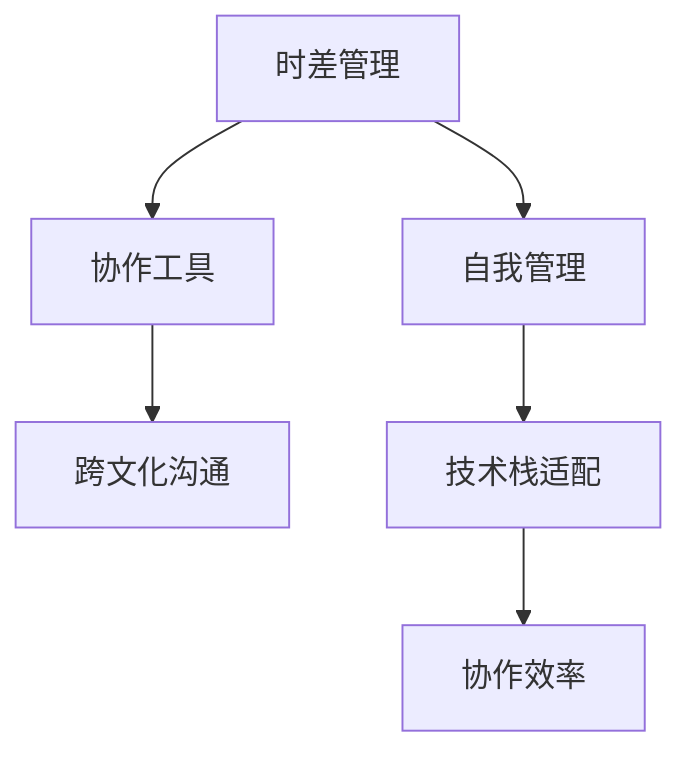

                 

# 程序员的国际远程工作生存指南

## 1. 背景介绍

### 1.1 问题由来

随着全球化的加速和互联网技术的发展，国际远程工作（Remote Work）已成为一种越来越普遍的工作模式。特别是在过去几年新冠疫情的影响下，远程工作已成为许多公司的主流选择。对于程序员而言，如何在新的工作环境中保持高效、舒适的工作状态，成为一项重要的挑战。本文旨在为国际远程工作的程序员提供一份实用的生存指南，帮助他们在新的工作环境中更好地适应和表现。

### 1.2 问题核心关键点

国际远程工作面临的主要挑战包括：
- **时差问题**：不同时区的同事之间难以协调工作时间，导致沟通困难。
- **文化差异**：不同文化背景下的沟通风格、工作习惯可能有所不同，需要适应。
- **技术差异**：不同国家和地区使用的技术栈和工具可能存在差异，需要快速学习。
- **协作效率**：缺乏面对面的交流，团队协作效率可能降低。
- **自我管理**：自主工作环境容易导致自律性差，缺乏同事间的激励。

### 1.3 问题研究意义

在全球化趋势下，国际远程工作将成为未来工作的主流模式。对于程序员而言，掌握国际远程工作的生存技巧，不仅能够提升工作效率，还能开拓更多职业发展机会。同时，国际远程工作也为企业提供了一种更灵活、成本更低的人才招聘方式，有利于企业的全球化发展。因此，深入研究国际远程工作的生存指南，对于程序员和企业都具有重要意义。

## 2. 核心概念与联系

### 2.1 核心概念概述

- **国际远程工作（International Remote Work）**：指程序员在不同国家、不同时区通过互联网进行工作的模式。
- **跨文化沟通（Cross-Cultural Communication）**：指在不同文化背景下进行有效沟通的技术和策略。
- **协作工具（Collaboration Tools）**：指用于远程协作的软件工具，如Slack、Trello、Zoom等。
- **自我管理（Self-Management）**：指在工作中自主设定目标、自我监督和评估的技巧。
- **时差管理（Time Zone Management）**：指在不同时区之间协调工作和会议的技巧。
- **技术栈适配（Stack Adoption）**：指在不同国家和地区选择和使用合适的技术栈和工具。

这些核心概念通过一系列技术手段和组织策略，共同构成了国际远程工作的生存框架，帮助程序员在新环境中更好地工作。

### 2.2 核心概念原理和架构的 Mermaid 流程图(Mermaid 流程节点中不要有括号、逗号等特殊字符)



## 3. 核心算法原理 & 具体操作步骤

### 3.1 算法原理概述

国际远程工作的生存指南，主要涉及以下几个核心算法和操作步骤：

- **时差管理算法**：通过计算不同时区的工作时间，制定合理的工作时间表。
- **协作工具算法**：选择合适的协作工具，建立有效的远程协作流程。
- **自我管理算法**：制定明确的工作目标和计划，进行自我监督和评估。
- **跨文化沟通算法**：学习不同文化背景下的沟通技巧，提高沟通效率。
- **技术栈适配算法**：评估不同地区技术栈的优劣，选择适合的开发工具和框架。

### 3.2 算法步骤详解

#### 3.2.1 时差管理

1. **计算时差**：使用在线工具或手动计算，确定不同时区的同事的工作时间。
2. **制定工作时间表**：根据自身和同事的时间差异，制定合理的工作时间表，尽量保证工作时间的重叠。
3. **灵活调整**：根据实际工作需要，灵活调整工作时间，避免加班过多。

#### 3.2.2 协作工具

1. **选择合适的协作工具**：根据团队规模和工作需求，选择合适的协作工具，如Slack、Trello、Zoom等。
2. **建立协作流程**：使用协作工具，建立清晰的远程协作流程，包括任务分配、进度跟踪和会议安排。
3. **定期更新**：定期更新协作工具中的信息，确保团队成员对工作进展有清晰的了解。

#### 3.2.3 自我管理

1. **设定工作目标**：根据团队和公司的目标，设定明确的工作目标和计划。
2. **制定时间计划**：使用时间管理工具，如Google Calendar、Todoist等，制定详细的时间计划。
3. **自我监督和评估**：定期自我评估工作进展，进行反馈和调整。

#### 3.2.4 跨文化沟通

1. **学习文化差异**：了解不同文化背景下的沟通风格和工作习惯。
2. **调整沟通方式**：根据文化差异，调整沟通方式和措辞，避免误解。
3. **保持开放心态**：保持开放和包容的心态，尊重不同文化背景的同事。

#### 3.2.5 技术栈适配

1. **评估技术栈**：评估不同国家和地区使用的技术栈和工具，包括编程语言、框架、工具等。
2. **选择合适技术**：根据项目需求和个人偏好，选择合适的技术栈和工具。
3. **持续学习**：不断学习和掌握新技能，适应不同技术栈的需求。

### 3.3 算法优缺点

国际远程工作生存指南的主要优点包括：
- **灵活性**：根据自身和团队的需求，灵活调整工作时间和方式。
- **成本低**：节省通勤时间、办公场地等成本。
- **多样性**：接触不同国家和地区的同事，拓展视野和知识面。

缺点则包括：
- **沟通成本高**：不同时区和文化的沟通难度大，需要更多的时间和精力。
- **协作效率低**：缺乏面对面的交流，团队协作效率可能降低。
- **自律性要求高**：自主工作环境容易导致自律性差，需要较强的自我管理能力。

### 3.4 算法应用领域

国际远程工作生存指南在多个领域都有广泛的应用，包括：
- **软件开发**：跨国企业、开源社区和自由职业者的日常工作。
- **产品管理**：全球化产品团队的需求和挑战。
- **设计工作**：远程设计的协作和沟通。
- **项目运维**：全球化项目的管理和协调。

## 4. 数学模型和公式 & 详细讲解 & 举例说明

### 4.1 数学模型构建

假设某公司有A、B两个地区，A地区的工作时间为本地时间9:00-17:00，B地区的工作时间为本地时间16:00-24:00。我们需要计算他们之间的工作时间重叠部分，并制定合理的工作时间表。

设 $T_A = 9:00-17:00$，$T_B = 16:00-24:00$，计算它们的工作时间重叠部分 $T_{overlap}$。

### 4.2 公式推导过程

将工作时间转换为24小时制，并计算重叠部分。
- $T_A = [9:00, 17:00]$
- $T_B = [16:00, 24:00]$

$T_{overlap}$ 的计算公式如下：
$$
T_{overlap} = \begin{cases}
16:00 - 17:00, & \text{if } 9:00 < 16:00 \\
24:00 - 17:00, & \text{if } 9:00 \geq 16:00
\end{cases}
$$

### 4.3 案例分析与讲解

假设A地区工作时间为9:00-17:00，B地区工作时间为16:00-24:00，我们可以计算出重叠部分为5小时（16:00-17:00），并制定如下时间表：

| A地区 | B地区 |
| --- | --- |
| 9:00-17:00 | 16:00-21:00 |
| 18:00-17:00 | 21:00-24:00 |
| 20:00-17:00 | 0:00-24:00 |

通过这种方式，可以有效利用不同时区的工作时间，确保协作效率。

## 5. 项目实践：代码实例和详细解释说明

### 5.1 开发环境搭建

#### 5.1.1 工具和资源推荐

1. **IDE**：Visual Studio Code、Atom、PyCharm等
2. **版本控制**：Git、GitHub、GitLab等
3. **协作工具**：Slack、Trello、Zoom等
4. **时间管理**：Google Calendar、Todoist等
5. **文档管理**：Confluence、Notion等

#### 5.1.2 开发环境搭建

1. **安装IDE和版本控制工具**：根据个人偏好选择IDE和版本控制工具，并配置好本地仓库和远程仓库。
2. **配置协作工具**：在协作工具中创建项目、任务和日程，配置通知和提醒。
3. **安装和配置远程工作所需的工具**：如VPN、远程桌面、视频会议工具等。

### 5.2 源代码详细实现

#### 5.2.1 时差管理

```python
from datetime import datetime, timedelta

def calculate_overlap(time_A_start, time_A_end, time_B_start, time_B_end):
    start_time = max(time_A_start, time_B_start)
    end_time = min(time_A_end, time_B_end)
    overlap = end_time - start_time
    return overlap

time_A_start = datetime.strptime('09:00', '%H:%M')
time_A_end = datetime.strptime('17:00', '%H:%M')
time_B_start = datetime.strptime('16:00', '%H:%M')
time_B_end = datetime.strptime('24:00', '%H:%M')

overlap_time = calculate_overlap(time_A_start, time_A_end, time_B_start, time_B_end)
print(f"Overlap time: {overlap_time}")
```

#### 5.2.2 协作工具

##### 使用Slack进行协作

1. **创建团队和频道**：创建项目团队和相应的频道，如#general、#dev等。
2. **共享文件和代码**：使用Slack的文件共享功能，方便团队成员查看和编辑代码。
3. **实时沟通**：使用Slack的即时消息功能，保持实时沟通。

##### 使用Trello进行任务管理

1. **创建看板和卡片**：创建看板和卡片，标记任务的状态和进展。
2. **分配任务和设置截止日期**：使用Trello的任务分配功能，设置任务的截止日期和负责人。
3. **跟踪进度**：定期更新卡片状态，确保任务按时完成。

##### 使用Zoom进行视频会议

1. **创建会议和邀请**：创建会议并邀请团队成员参加，确保会议时间合理。
2. **设置会议议程**：提前设定会议议程和目标，确保会议高效。
3. **记录和总结**：使用Zoom的会议记录功能，会后整理会议纪要并共享。

### 5.3 代码解读与分析

时差管理和协作工具的代码实现主要通过Python语言进行。时差管理算法通过计算两个时间段的重叠部分，帮助制定合理的工作时间表。协作工具的代码实现则通过选择合适的工具和功能，帮助团队高效协作。

### 5.4 运行结果展示

通过上述代码实现，我们可以得到不同时区的工作时间重叠部分，并制定合理的工作时间表。同时，通过协作工具，团队成员可以实时沟通和协作，确保工作顺利进行。

## 6. 实际应用场景

### 6.1 跨国企业

跨国企业中，程序员需要跨越不同的国家和地区工作，面临时差、文化、技术等多方面的挑战。通过国际远程工作生存指南，跨国企业可以更好地协调和管理全球团队，提升工作效率和合作效果。

### 6.2 开源社区

开源社区中，许多成员来自世界各地，通过国际远程工作生存指南，成员可以高效协作，共同推进项目进展，实现更广泛的技术交流和共享。

### 6.3 自由职业者

自由职业者需要在不同国家和地区进行工作，通过国际远程工作生存指南，可以更好地管理时间和任务，提高工作灵活性和效率。

### 6.4 未来应用展望

随着全球化的深入，国际远程工作将成为一种常态化的工作模式。未来，国际远程工作生存指南将不断演进，适应更多复杂的工作场景，帮助程序员在新的工作环境中保持高效和舒适。

## 7. 工具和资源推荐

### 7.1 学习资源推荐

1. **《Remote Work Guide》书籍**：系统介绍远程工作的各种技巧和策略。
2. **《The 4-Hour Work Week》书籍**：介绍如何通过高效工作和自我管理实现自由职业和远程工作。
3. **Coursera远程工作课程**：提供远程工作的各种课程和视频，涵盖时差管理、协作工具、自我管理等多个方面。
4. **Udemy远程工作课程**：提供实用的远程工作技巧和工具，帮助提升远程工作的效率和质量。

### 7.2 开发工具推荐

1. **Visual Studio Code**：轻量级且功能强大的IDE，支持丰富的插件和扩展。
2. **GitHub**：最流行的代码托管平台，提供版本控制、协作和社区支持。
3. **Slack**：强大的即时通讯和协作工具，支持多频道和文件共享。
4. **Trello**：灵活的项目管理和协作工具，支持看板和卡片操作。
5. **Zoom**：高效的视频会议工具，支持多人会议、记录和分享。

### 7.3 相关论文推荐

1. **《Remote Work: A Survey and Future Directions》**：系统综述远程工作相关文献，提出未来研究方向。
2. **《The Impact of Remote Work on Productivity: A Review and Synthesis of Evidence》**：分析远程工作对生产力的影响，提出提升远程工作效率的策略。
3. **《Collaborative Work in Remote Teams: A Literature Review and Synthesis of Evidence》**：综述远程团队协作的相关文献，提出提升协作效率的方法。

## 8. 总结：未来发展趋势与挑战

### 8.1 总结

国际远程工作生存指南为程序员提供了全面的指导，帮助他们在新的工作环境中保持高效和舒适。通过时差管理、协作工具、自我管理和跨文化沟通等方面的技巧，程序员可以更好地适应国际远程工作的挑战，提升工作效率和合作效果。未来，随着全球化的深入，国际远程工作将成为一种常态化的工作模式，相关指南将不断演进，适应更多复杂的工作场景。

### 8.2 未来发展趋势

1. **技术工具的普及**：随着技术的不断发展，更多的协作工具和技术将出现，为国际远程工作提供更多支持。
2. **全球化的深入**：随着全球化的深入，国际远程工作将成为一种常态化的工作模式，相关指南将不断演进，适应更多复杂的工作场景。
3. **企业管理的变革**：企业将更加重视远程工作管理，通过灵活的远程工作政策，提升员工满意度和生产效率。
4. **跨文化交流的促进**：国际远程工作将促进不同文化背景的交流和合作，拓展全球视野和知识面。

### 8.3 面临的挑战

国际远程工作仍面临许多挑战，包括：
1. **文化差异**：不同文化背景下的沟通和协作可能存在障碍，需要更多的时间和精力。
2. **技术差异**：不同国家和地区使用的技术栈和工具可能存在差异，需要快速学习。
3. **自律性要求高**：自主工作环境容易导致自律性差，需要较强的自我管理能力。
4. **协作效率低**：缺乏面对面的交流，团队协作效率可能降低。

### 8.4 研究展望

未来，国际远程工作相关的研究将集中在以下几个方向：
1. **技术工具的优化**：开发更加灵活和高效的协作工具，提升远程工作的便利性和效率。
2. **管理策略的创新**：通过灵活的管理策略，提升远程工作的协作效果和员工满意度。
3. **跨文化沟通的提升**：提升跨文化沟通的效率和质量，促进不同文化背景的交流和合作。
4. **自我管理能力的培养**：通过培训和工具，提升自我管理能力，提高远程工作的自律性和工作效率。

## 9. 附录：常见问题与解答

### 9.1 常见问题

**Q1: 如何处理时差问题？**

A: 使用在线时差转换工具，计算不同时区的同事的工作时间，制定合理的工作时间表，尽量保持工作时间的重叠。

**Q2: 如何提升跨文化沟通效率？**

A: 学习不同文化背景下的沟通风格和工作习惯，调整沟通方式和措辞，保持开放和包容的心态，尊重不同文化背景的同事。

**Q3: 如何选择合适的协作工具？**

A: 根据团队规模和工作需求，选择合适的协作工具，如Slack、Trello、Zoom等。建立清晰的远程协作流程，定期更新协作工具中的信息。

**Q4: 如何保持自我管理？**

A: 设定明确的工作目标和计划，使用时间管理工具，如Google Calendar、Todoist等，制定详细的时间计划，定期自我评估工作进展，进行反馈和调整。

通过这些常见问题的解答，希望能够帮助程序员更好地适应和应对国际远程工作中的各种挑战，提升工作效率和合作效果。

