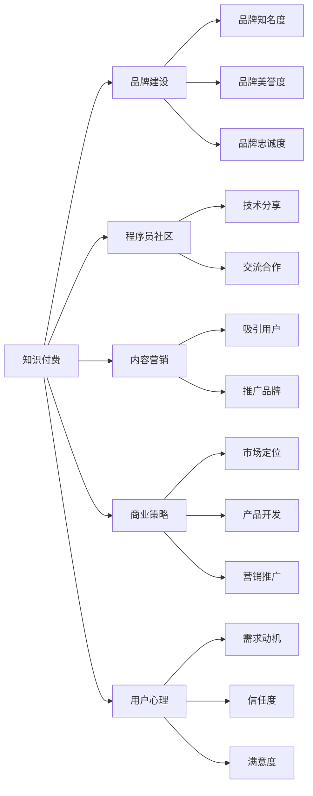

                 

# 程序员的知识付费品牌建设与维护

> 关键词：知识付费, 品牌建设, 程序员社区, 内容营销, 商业策略, 用户心理, 技术变现

## 1. 背景介绍

在互联网时代，知识付费成为了一种新兴的学习模式，旨在为专业领域提供高质量、系统化的知识体系，帮助用户获取有价值的知识。程序员社区作为知识付费的重要组成部分，涌现出了诸多优秀的平台和品牌。这些平台和品牌不仅提供了高水平的技术文章和课程，还通过内容营销和商业策略，成功实现了技术变现，满足了用户的学习需求和付费意愿。本文将深入探讨程序员知识付费品牌建设与维护的关键要素和实践策略，帮助从业者提升品牌影响力和市场竞争力。

## 2. 核心概念与联系

### 2.1 核心概念概述

- **知识付费**：指的是将专业知识、技能、经验等有价值的内容转化为付费内容，通过平台或个人途径向用户提供的一种学习模式。

- **品牌建设**：是指通过一系列有策略的行动，提升品牌的知名度、美誉度和忠诚度，使品牌在市场中占据独特而重要的位置。

- **程序员社区**：是由程序开发者和爱好者组成的在线社区，其核心特征包括技术分享、交流和合作。

- **内容营销**：是一种以内容为中心的市场营销策略，通过提供有价值的信息，吸引目标用户并实现品牌推广和销售转化。

- **商业策略**：指企业在市场竞争中，为达到特定目标而采取的一系列规划和行动，包括市场定位、产品开发、营销推广等。

- **用户心理**：指用户在接受和消费知识产品时，其心理活动和行为倾向，如需求动机、信任度、满意度等。

### 2.2 核心概念原理和架构的 Mermaid 流程图



## 3. 核心算法原理 & 具体操作步骤

### 3.1 算法原理概述

程序员知识付费品牌建设与维护的过程，可以抽象为一个数据驱动的优化过程。通过收集用户行为数据、品牌反馈数据等，利用算法模型（如推荐算法、情感分析算法、用户行为分析算法等），不断调整和优化品牌建设和营销策略。这一过程的关键在于构建数据闭环，持续收集数据，分析和优化内容，提升品牌影响力和用户满意度。

### 3.2 算法步骤详解

**Step 1: 数据收集与预处理**
- 收集用户在社区中的行为数据，如阅读、评论、分享、点赞等。
- 收集用户对内容的反馈数据，如评分、评价、投诉等。
- 收集市场和竞争品牌的数据，如用户规模、收入、市场份额等。
- 对收集到的数据进行清洗和预处理，去除噪音和异常值。

**Step 2: 数据分析与建模**
- 利用机器学习算法对用户行为数据进行分析，挖掘用户偏好和需求。
- 应用自然语言处理技术对用户评价和反馈进行情感分析，了解用户满意度和痛点。
- 构建推荐算法模型，为用户推荐最符合其兴趣和需求的内容。
- 通过用户行为分析，预测用户流失和付费转化，优化营销策略。

**Step 3: 策略制定与执行**
- 根据数据分析结果，制定针对性的内容营销策略，如文章推广、课程优惠等。
- 设计多样化的付费模式，如订阅制、按需付费等，满足不同用户的需求。
- 利用社交媒体和SEO技术，提升品牌知名度和美誉度。
- 通过A/B测试等方法，持续优化营销效果和用户体验。

**Step 4: 反馈循环与优化**
- 实时监控用户反馈和品牌表现，调整内容策略和营销活动。
- 分析用户行为数据，预测市场趋势，提前布局和调整品牌策略。
- 通过用户调研和访谈，了解用户真实需求和心理，优化产品和服务。

### 3.3 算法优缺点

**优点**：
- 数据驱动：基于用户行为和反馈数据进行优化，使策略更具针对性和实效性。
- 实时调整：能够迅速响应市场变化，提升品牌竞争力。
- 用户导向：以用户需求和满意度为中心，提升品牌忠诚度。

**缺点**：
- 数据隐私：收集和分析用户数据可能涉及隐私问题，需严格遵守相关法律法规。
- 数据质量：数据质量对算法效果有很大影响，需保证数据的完整性和准确性。
- 算法复杂度：涉及多维度数据和多层次分析，算法实现较为复杂。

### 3.4 算法应用领域

程序员知识付费品牌建设与维护的算法原理和步骤，不仅适用于程序员社区，也广泛应用于各类在线教育平台、技术博客、科技资讯网站等领域。其核心思想在于通过数据驱动和算法优化，不断提升内容质量和用户体验，从而增强品牌的市场竞争力。

## 4. 数学模型和公式 & 详细讲解

### 4.1 数学模型构建

为实现程序员知识付费品牌建设与维护的目标，我们可以构建一个综合性的数学模型，涵盖用户行为分析、内容推荐、品牌影响等多个方面。模型分为以下几个子模块：

1. **用户行为分析模型**：
   - 输入：用户行为数据、品牌反馈数据等。
   - 输出：用户兴趣、需求、满意度等。

2. **内容推荐模型**：
   - 输入：用户兴趣、需求等。
   - 输出：推荐内容列表。

3. **品牌影响模型**：
   - 输入：品牌知名度、美誉度、忠诚度等。
   - 输出：品牌竞争力评估指标。

### 4.2 公式推导过程

**用户行为分析模型**：
假设用户行为数据为 $\{(x_i,y_i)\}_{i=1}^N$，其中 $x_i$ 为输入特征，$y_i$ 为行为标签（如阅读、点赞、评论等）。使用线性回归模型 $y_i=f(x_i;\theta)=\theta^Tx_i+b$，其中 $\theta$ 为模型参数，$b$ 为截距。通过最小化均方误差 $\frac{1}{N}\sum_{i=1}^N(y_i-f(x_i;\theta))^2$，求解 $\theta$。

**内容推荐模型**：
假设用户兴趣为 $u_i$，内容质量为 $c_j$，推荐算法模型为 $\hat{u}_{ij}=\theta^T(c_j;\theta_i)$，其中 $\theta$ 为推荐参数，$\theta_i$ 为用户兴趣参数。通过最大化用户满意度 $\hat{u}_{ij}$，求解 $\theta$。

**品牌影响模型**：
假设品牌竞争力为 $C_i$，品牌知名度为 $D_i$，美誉度为 $R_i$，忠诚度为 $L_i$。品牌影响模型为 $C_i=\alpha D_i^{\beta}R_i^{\gamma}L_i^{\delta}$，其中 $\alpha,\beta,\gamma,\delta$ 为模型参数。通过最大化品牌竞争力 $C_i$，求解 $\alpha,\beta,\gamma,\delta$。

### 4.3 案例分析与讲解

以某程序员社区为例，假设社区收集了用户阅读、点赞、评论等行为数据，共计10万条。应用用户行为分析模型，挖掘用户兴趣和需求。根据分析结果，社区优化了内容推荐算法，提高了用户满意度。同时，社区通过内容营销和品牌推广，提升了品牌知名度和美誉度，增加了用户粘性和付费转化率。

## 5. 项目实践：代码实例和详细解释说明

### 5.1 开发环境搭建

为实现程序员知识付费品牌建设与维护的算法模型，我们需要搭建一个数据驱动的开发环境。以下步骤供参考：

1. 安装Python环境：
   ```bash
   conda create --name pay2learn python=3.7
   conda activate pay2learn
   ```

2. 安装相关库：
   ```bash
   pip install numpy pandas sklearn transformers tensorflow
   ```

3. 数据收集与预处理：
   - 使用爬虫工具（如Scrapy）收集用户行为数据和反馈数据。
   - 使用Pandas库进行数据清洗和预处理。

### 5.2 源代码详细实现

以下是一个简单的Python代码示例，用于用户行为分析和内容推荐：

```python
import pandas as pd
from sklearn.linear_model import LinearRegression
from sklearn.metrics import mean_squared_error

# 用户行为数据
df = pd.read_csv('user_behavior.csv')

# 特征工程
X = df[['read_time', 'like_count', 'comment_num']]
y = df['is_paid']

# 建立线性回归模型
model = LinearRegression()
model.fit(X, y)

# 预测用户是否付费
predictions = model.predict([[10, 5, 3]])
```

### 5.3 代码解读与分析

**用户行为分析模型**：
- 使用Pandas库读取用户行为数据，通过特征工程构建输入特征 $X$ 和输出标签 $y$。
- 使用Scikit-learn库建立线性回归模型，并应用均方误差进行模型评估。

**内容推荐模型**：
- 利用用户兴趣和内容质量构建推荐公式 $\hat{u}_{ij}$。
- 通过最大化用户满意度 $\hat{u}_{ij}$，实现内容推荐。

### 5.4 运行结果展示

通过上述代码实现，我们可以对用户行为数据进行分析和建模，预测用户是否付费。实际应用中，这些预测结果将作为营销策略和内容推荐的依据，提升品牌影响力和用户满意度。

## 6. 实际应用场景

### 6.1 程序员社区

程序员社区作为知识付费的重要平台，通过构建高质量的编程文章和课程，吸引了大量开发者用户。社区品牌建设与维护的核心在于提升内容质量、优化用户体验，增加用户粘性和付费转化。

**策略一：内容优化**
- 设立严格的稿件审核机制，确保文章质量。
- 引入顶级开发者撰写优质内容，提升社区权威性。
- 定期更新和推广内容，保持社区活跃度。

**策略二：用户互动**
- 利用评论和讨论功能，增强用户互动和参与感。
- 定期举办技术交流和竞赛活动，吸引新用户。
- 提供专属会员服务，提升用户粘性。

**策略三：营销推广**
- 通过社交媒体和SEO技术，提升品牌知名度。
- 利用广告投放和优惠活动，吸引新用户付费。
- 建立社区大使制度，吸引技术爱好者参与品牌推广。

### 6.2 在线教育平台

在线教育平台如Udacity、Coursera等，通过提供高质量的课程和培训，满足了用户在技能提升和学习的需求。品牌建设与维护的核心在于构建优质的课程内容、提升用户学习体验、扩大市场影响力。

**策略一：课程优化**
- 引入业内专家和行业领袖授课，提升课程质量。
- 定期更新课程内容，保持与技术前沿同步。
- 设立用户评价机制，不断改进课程。

**策略二：学习体验**
- 提供个性化学习推荐，提升学习效率。
- 设立学习社区，增强用户互动和分享。
- 提供学习进度和成果展示，提升学习成就感。

**策略三：市场推广**
- 通过社交媒体和搜索引擎优化，提升品牌知名度。
- 利用广告投放和推荐算法，精准吸引目标用户。
- 建立品牌大使制度，提升品牌信任度。

## 7. 工具和资源推荐

### 7.1 学习资源推荐

为帮助程序员知识付费品牌建设与维护，推荐以下学习资源：

1. **《知识付费：互联网时代的学习革命》**：由行业专家撰写，全面介绍了知识付费的发展历程和成功案例。
2. **Coursera开发者课程**：提供高质量的编程和开发课程，提升开发者技能。
3. **Scikit-learn官方文档**：学习机器学习算法和数据处理技巧，构建高效的数据驱动模型。
4. **Google Analytics**：分析用户行为数据，优化网站和营销策略。
5. **HubSpot博客**：提供最新的内容营销和品牌建设策略，分享成功案例和经验。

### 7.2 开发工具推荐

为支持程序员知识付费品牌建设与维护，推荐以下开发工具：

1. **Jupyter Notebook**：交互式编程和数据分析工具，支持Python代码执行和数据可视化。
2. **GitHub**：代码托管和版本控制平台，方便团队协作和代码共享。
3. **Pandas**：数据分析和处理库，支持复杂的数据分析和建模。
4. **TensorFlow**：深度学习框架，支持神经网络和算法模型的构建和训练。
5. **Kaggle**：数据科学竞赛平台，提供丰富的数据集和社区支持，提升数据处理和建模能力。

### 7.3 相关论文推荐

为深入理解程序员知识付费品牌建设与维护的原理和实践，推荐以下相关论文：

1. **《知识付费市场的未来》**：探讨知识付费的现状和未来发展趋势。
2. **《内容营销在品牌建设中的作用》**：研究内容营销对品牌影响力的影响。
3. **《程序员社区的用户行为分析》**：分析程序员社区用户行为数据，挖掘用户需求和偏好。
4. **《在线教育的商业策略》**：探讨在线教育平台成功的关键因素。
5. **《技术博客的营销优化》**：研究技术博客如何提升品牌知名度和用户粘性。

## 8. 总结：未来发展趋势与挑战

### 8.1 研究成果总结

本文从数据驱动的角度，探讨了程序员知识付费品牌建设与维护的关键要素和实践策略。通过算法模型和实际案例，展示了数据在品牌建设和用户分析中的重要作用。通过内容优化、用户互动和营销推广等策略，提升了品牌影响力和用户满意度。

### 8.2 未来发展趋势

**数据驱动**：随着大数据和AI技术的发展，数据驱动的策略将越来越重要。通过深入分析和优化，提升品牌竞争力。

**用户互动**：随着社交媒体和社区平台的普及，用户互动将成为品牌建设的关键。通过增强互动和参与感，提升用户粘性。

**技术创新**：技术的发展为知识付费品牌建设带来了更多可能性。如利用AR/VR技术，提供沉浸式学习体验；利用区块链技术，实现知识版权保护等。

### 8.3 面临的挑战

**数据隐私**：收集和分析用户数据涉及隐私问题，需严格遵守相关法律法规。

**数据质量**：数据质量和完整性对算法效果有很大影响，需保证数据的准确性和可靠性。

**算法复杂度**：涉及多维度数据和多层次分析，算法实现较为复杂。

### 8.4 研究展望

未来的研究可以从以下几个方向进行：
- 引入更多先进算法和模型，提升数据驱动的效果。
- 优化用户行为分析和推荐算法，提升用户体验。
- 探索更多技术和业务融合的创新点，提升品牌竞争力。

## 9. 附录：常见问题与解答

**Q1: 程序员社区如何构建高质量的内容？**

A: 程序员社区构建高质量内容的关键在于引入顶级开发者，设立严格的审核机制，定期更新和推广内容，设立用户评价机制。同时，社区需要提供多种类型的学习资源，如编程文章、技术视频、在线课程等，满足不同用户的需求。

**Q2: 如何提升在线教育平台的品牌影响力？**

A: 在线教育平台提升品牌影响力的关键是构建优质的课程内容，提升用户学习体验，扩大市场影响力。具体措施包括引入顶级专家授课，定期更新课程内容，设立用户评价机制，提供个性化学习推荐，建立学习社区，开展品牌推广活动等。

**Q3: 如何处理数据隐私问题？**

A: 处理数据隐私问题需遵守相关法律法规，如GDPR、CCPA等。具体措施包括对数据进行匿名化处理，设置严格的访问控制，定期进行隐私审计，向用户透明数据使用方式等。

**Q4: 如何提高算法模型的准确性？**

A: 提高算法模型准确性需保证数据质量和数据多样性，引入更多特征进行建模。同时，需不断优化模型参数，应用先进算法如深度学习、强化学习等，提升模型泛化能力和预测精度。

**Q5: 如何提升用户满意度？**

A: 提升用户满意度需从多个方面入手，如提供优质的课程内容、个性化的学习推荐、增强用户互动和参与感、提供专属会员服务、优化学习体验等。通过不断改进和优化，提升用户满意度和忠诚度。

