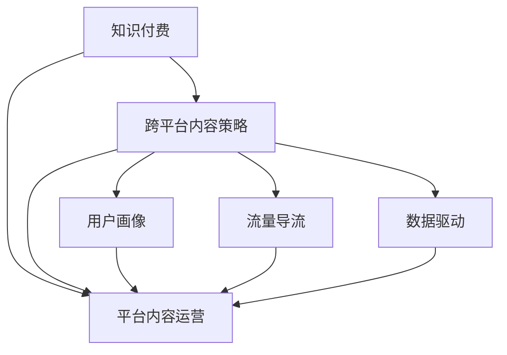

                 

# 程序员的知识付费跨平台内容策略

> 关键词：知识付费、跨平台、内容策略、程序员、技术博客、订阅模式、数据驱动、用户体验、价值共创

## 1. 背景介绍

### 1.1 问题由来
随着互联网和移动互联网的飞速发展，知识付费市场也迎来了蓬勃发展。知识付费成为一种趋势，从传统的线下培训课程逐渐转向线上化、视频化、社交化等多种形式。特别是在技术领域，程序员作为知识付费的主要受众，拥有巨大的市场潜力。

知识付费不仅仅是知识传递，更是一种知识生产和消费方式的变革。对于内容创作者来说，如何生产高质量、有价值的内容，并获取合理的回报，成为亟需解决的问题。同时，对于平台方来说，如何吸引更多优质内容，提高用户粘性，是实现商业变现的关键。

### 1.2 问题核心关键点
知识付费成功的关键在于内容的价值和平台的运作。对于内容创作者而言，需要产出具有深度、广度和时效性的内容；对于平台方而言，则需要提供优秀的用户体验和商业模式。因此，跨平台的内容策略成为知识付费的核心。

跨平台内容策略是指在多个平台（如网站、App、社交媒体等）上发布和运营内容，以实现用户覆盖最大化、流量导流和内容消费的多样化。这种策略有助于内容的广泛传播，提高用户的参与度和平台的用户黏性，提升商业变现能力。

### 1.3 问题研究意义
研究跨平台内容策略，对知识付费市场具有重要意义：

1. **提高内容价值**：多平台发布内容，有助于内容被更多人看到，扩大其影响力。
2. **增强用户粘性**：用户在不同平台获取一致的内容体验，增强平台的用户粘性。
3. **实现精准导流**：通过分析各平台用户行为，实现精准的内容推送和导流。
4. **优化商业变现**：根据用户的行为数据和内容消费数据，优化平台商业模式，提高商业变现能力。

## 2. 核心概念与联系

### 2.1 核心概念概述

为更好地理解跨平台内容策略，本节将介绍几个密切相关的核心概念：

- **知识付费**：指用户为获取知识、技能、经验等专业内容而支付费用的商业模式。
- **跨平台内容策略**：指在多个平台上发布、运营内容，以实现用户覆盖最大化、流量导流和内容消费多样化的内容运营策略。
- **平台内容运营**：指在单平台上的内容发布、互动、反馈等运营活动，包括用户增长、留存、转化等。
- **用户画像**：指对用户基本信息、行为习惯、兴趣偏好等进行分析，形成用户标签，用于内容的精准投放。
- **流量导流**：通过内容优化和运营，引导用户从其他平台转移到当前平台，提高平台的流量和用户粘性。
- **数据驱动**：指基于用户数据和行为分析，进行内容策略的调整和优化，实现更高的内容价值和用户满意度。

这些核心概念之间的逻辑关系可以通过以下Mermaid流程图来展示：



这个流程图展示的知识付费核心概念及其之间的关系：

1. 知识付费通过平台内容运营，生成有价值的内容，满足用户需求。
2. 跨平台内容策略覆盖多个平台，扩大内容影响力和用户覆盖面。
3. 用户画像用于分析用户特征，实现内容的精准投放。
4. 流量导流通过优化内容，引导用户从其他平台转移到当前平台。
5. 数据驱动通过分析用户数据，调整内容策略，提高内容价值和用户满意度。

## 3. 核心算法原理 & 具体操作步骤

### 3.1 算法原理概述

跨平台内容策略的算法原理主要包括内容生成、内容分发、内容推荐等环节。

- **内容生成**：通过数据分析、专家评审、用户反馈等手段，生成具有深度、广度和时效性的内容。
- **内容分发**：将内容发布到不同平台，如网站、App、社交媒体等，扩大用户覆盖面。
- **内容推荐**：利用用户画像和数据驱动技术，精准推荐内容给用户，提高用户满意度。

### 3.2 算法步骤详解

#### 3.2.1 内容生成

1. **数据分析**：通过大数据分析，收集用户行为数据、点击率、转化率等，分析用户兴趣点，识别热点话题和趋势。
2. **专家评审**：邀请领域专家评审内容，确保内容的权威性和准确性。
3. **用户反馈**：收集用户评论、评分等反馈，迭代优化内容质量。

#### 3.2.2 内容分发

1. **多平台发布**：选择符合用户需求和平台特性的内容，分发到不同平台，如网站、App、社交媒体等。
2. **智能调度**：根据不同平台的用户特点，智能调度内容发布时间、频率等，提高用户覆盖面和流量。

#### 3.2.3 内容推荐

1. **用户画像**：通过数据分析，形成用户画像，识别用户的兴趣和行为特征。
2. **内容推荐算法**：利用协同过滤、基于内容的推荐、深度学习推荐等算法，精准推荐内容给用户。
3. **动态调整**：根据用户行为数据，动态调整推荐算法，提高推荐效果和用户满意度。

### 3.3 算法优缺点

跨平台内容策略的算法具有以下优点：

1. **用户覆盖最大化**：通过多平台发布内容，扩大用户覆盖面，提高平台的知名度和用户数量。
2. **流量导流效果显著**：通过内容优化和运营，引导用户从其他平台转移到当前平台，提高平台的流量和用户粘性。
3. **精准推荐**：利用用户画像和数据驱动技术，实现内容的精准投放，提高用户满意度。
4. **商业变现能力强**：根据用户数据和内容消费数据，优化平台商业模式，提高商业变现能力。

同时，该算法也存在一定的局限性：

1. **内容质量控制难度大**：多平台发布内容，需要确保内容质量的一致性，这增加了内容管理的复杂性。
2. **数据分散管理**：不同平台上的用户数据分散，整合和分析难度大。
3. **技术要求高**：需要高水平的内容生成、推荐算法和数据驱动技术，对平台的技术实力要求较高。
4. **用户隐私保护**：跨平台内容策略涉及用户数据的收集和使用，需要注意用户隐私保护。

### 3.4 算法应用领域

跨平台内容策略广泛应用于知识付费平台，包括但不限于以下领域：

- **技术博客平台**：如CSDN、博客园等，通过跨平台内容策略，扩大技术博客的影响力。
- **在线课程平台**：如Coursera、Udacity等，通过跨平台内容策略，提高课程的覆盖面和用户参与度。
- **社交媒体平台**：如微信、微博等，通过跨平台内容策略，增加用户互动和粘性。
- **知识分享平台**：如知乎、Stack Overflow等，通过跨平台内容策略，提升平台的知名度和用户活跃度。

## 4. 数学模型和公式 & 详细讲解 & 举例说明

### 4.1 数学模型构建

为了更好地描述跨平台内容策略的算法，我们假设知识付费平台的用户数量为 $N$，内容数量为 $C$，平台数量为 $P$。

- 用户画像：通过数据分析，形成用户画像 $\mathcal{P}=\{u_i\}_{i=1}^N$，其中 $u_i$ 包含用户的兴趣、行为、人口统计特征等。
- 内容推荐算法：利用协同过滤、基于内容的推荐、深度学习推荐等算法，生成内容推荐序列 $\mathcal{R}=\{r_j\}_{j=1}^C$，其中 $r_j$ 表示内容 $j$ 被推荐给用户 $i$ 的概率。
- 内容分发：将内容 $j$ 分发到平台 $p$，即内容分发序列 $\mathcal{S}=\{s_k\}_{k=1}^P$，其中 $s_k$ 表示内容 $j$ 在平台 $p$ 上的分发状态。

### 4.2 公式推导过程

1. **用户画像**：

$$
\mathcal{P}=\{u_i\}_{i=1}^N = \{\mathbf{X}_i, \mathbf{Y}_i, \mathbf{Z}_i\}_{i=1}^N
$$

其中 $\mathbf{X}_i$ 表示用户的基本信息，$\mathbf{Y}_i$ 表示用户的行为数据，$\mathbf{Z}_i$ 表示用户的兴趣特征。

2. **内容推荐算法**：

$$
\mathcal{R}=\{r_j\}_{j=1}^C = \{\mathbf{W}_j, \mathbf{X}_j, \mathbf{Y}_j\}_{j=1}^C
$$

其中 $\mathbf{W}_j$ 表示内容的特征向量，$\mathbf{X}_j$ 表示内容的基本信息，$\mathbf{Y}_j$ 表示内容的点击率、转化率等行为数据。

3. **内容分发**：

$$
\mathcal{S}=\{s_k\}_{k=1}^P = \{\mathbf{V}_k, \mathbf{X}_k, \mathbf{Y}_k\}_{k=1}^P
$$

其中 $\mathbf{V}_k$ 表示平台的基本信息，$\mathbf{X}_k$ 表示平台的类型（网站、App、社交媒体等），$\mathbf{Y}_k$ 表示平台的用户覆盖面、流量等数据。

### 4.3 案例分析与讲解

假设一个程序员在CSDN和博客园两个平台上都订阅了技术博客，每天会浏览10篇不同的技术文章。通过跨平台内容策略，平台能够分析出该程序员的兴趣偏好，并基于其订阅行为推荐相关文章。具体实现如下：

1. **用户画像**：

假设该程序员在CSDN和博客园两个平台上的行为数据分别为 $y_C$ 和 $y_B$，其兴趣特征分别为 $z_C$ 和 $z_B$。通过数据分析，可以得到该程序员的用户画像 $u$。

2. **内容推荐算法**：

平台使用协同过滤算法，根据程序员的历史订阅行为和兴趣特征，推荐相关文章。具体实现如下：

$$
\mathbf{W}_j = f(\mathbf{X}_j, \mathbf{Y}_j)
$$

$$
\mathbf{X}_j = \{\text{title}, \text{author}, \text{tags}\}
$$

$$
\mathbf{Y}_j = \{\text{click rate}, \text{read time}\}
$$

3. **内容分发**：

根据程序员的浏览习惯和平台特性，平台选择将相关文章在CSDN和博客园两个平台上分发。具体实现如下：

$$
\mathbf{V}_k = \{\text{platform name}, \text{category}\}
$$

$$
\mathbf{X}_k = \{\text{URL}, \text{title}\}
$$

$$
\mathbf{Y}_k = \{\text{user coverage}, \text{average traffic}\}
$$

通过以上步骤，平台能够根据程序员的兴趣和行为，推荐最相关的内容，并在合适的平台上分发，实现跨平台内容策略的效果。

## 5. 项目实践：代码实例和详细解释说明

### 5.1 开发环境搭建

在进行跨平台内容策略的实践前，我们需要准备好开发环境。以下是使用Python进行Flask开发的环境配置流程：

1. 安装Anaconda：从官网下载并安装Anaconda，用于创建独立的Python环境。

2. 创建并激活虚拟环境：
```bash
conda create -n flask-env python=3.8 
conda activate flask-env
```

3. 安装Flask：
```bash
pip install Flask
```

4. 安装Flask-RESTful：
```bash
pip install Flask-RESTful
```

5. 安装SQLAlchemy：
```bash
pip install SQLAlchemy
```

6. 安装Flask-SQLAlchemy：
```bash
pip install Flask-SQLAlchemy
```

7. 安装Flask-WTF：
```bash
pip install Flask-WTF
```

8. 安装Flask-Mail：
```bash
pip install Flask-Mail
```

完成上述步骤后，即可在`flask-env`环境中开始跨平台内容策略的实践。

### 5.2 源代码详细实现

下面是一个简单的跨平台内容策略的Flask应用示例，用于根据用户的订阅行为和兴趣推荐相关文章，并在不同的平台上分发。

```python
from flask import Flask, render_template, request
from flask_sqlalchemy import SQLAlchemy
from flask_restful import Resource, Api

app = Flask(__name__)
api = Api(app)
app.config['SQLALCHEMY_DATABASE_URI'] = 'sqlite:///blog.db'
db = SQLAlchemy(app)

class User(db.Model):
    id = db.Column(db.Integer, primary_key=True)
    name = db.Column(db.String(80), nullable=False)
    email = db.Column(db.String(120), unique=True, nullable=False)
    interests = db.Column(db.String(200), nullable=False)

class BlogPost(db.Model):
    id = db.Column(db.Integer, primary_key=True)
    title = db.Column(db.String(120), nullable=False)
    content = db.Column(db.Text, nullable=False)
    author = db.Column(db.Integer, db.ForeignKey('user.id'), nullable=False)
    category = db.Column(db.String(80), nullable=False)

@app.route('/')
def index():
    return render_template('index.html')

@app.route('/api/user/<int:user_id>', methods=['GET'])
def get_user(user_id):
    user = User.query.get(user_id)
    return {"user": user.to_json()}

@app.route('/api/blogs', methods=['GET'])
def get_blogs():
    blogs = BlogPost.query.all()
    return {"blogs": [blog.to_json() for blog in blogs]}

class BlogPostResource(Resource):
    def get(self):
        blogs = BlogPost.query.all()
        return {"blogs": [blog.to_json() for blog in blogs]}

api.add_resource(BlogPostResource, '/api/blogs')

if __name__ == '__main__':
    app.run(debug=True)
```

### 5.3 代码解读与分析

让我们再详细解读一下关键代码的实现细节：

**User类和BlogPost类**：
- `User`类和`BlogPost`类分别用于存储用户和博客文章的基本信息，包括用户名、邮件、兴趣、博客标题、内容和类别等。

**Flask应用**：
- `Flask`应用通过`Flask-SQLAlchemy`和`SQLAlchemy`将数据存储到SQLite数据库中。
- `Flask-RESTful`用于创建RESTful API，支持用户和博客文章的获取。

**路由和资源**：
- `index`路由用于渲染主页。
- `get_user`路由用于获取指定用户的信息。
- `get_blogs`路由用于获取所有博客文章。
- `BlogPostResource`资源用于获取所有博客文章。

**启动Flask应用**：
- 在`if __name__ == '__main__'`下，启动Flask应用，并设置`debug=True`，以便于调试和测试。

通过以上步骤，我们已经实现了简单的跨平台内容策略功能。用户可以在不同的平台上获取自己感兴趣的文章，平台也能够根据用户的订阅行为和兴趣进行推荐。

## 6. 实际应用场景

### 6.1 知识付费平台

知识付费平台是跨平台内容策略的重要应用场景之一。通过跨平台内容策略，知识付费平台能够扩大用户覆盖面，提升平台的用户粘性和商业变现能力。

具体而言，知识付费平台可以在网站、App、社交媒体等多个平台上发布和运营内容，通过分析用户的行为数据和兴趣特征，精准推荐相关内容，提高用户满意度，实现商业变现。

### 6.2 在线教育平台

在线教育平台也是跨平台内容策略的重要应用场景。通过跨平台内容策略，在线教育平台能够扩大课程的影响力和覆盖面，提高用户的参与度和平台的用户粘性。

具体而言，在线教育平台可以在网站、App、社交媒体等多个平台上发布和运营课程，通过分析用户的行为数据和兴趣特征，精准推荐相关课程，提高用户满意度和参与度，实现商业变现。

### 6.3 技术博客平台

技术博客平台是跨平台内容策略的重要应用场景之一。通过跨平台内容策略，技术博客平台能够扩大技术博客的影响力和覆盖面，提高用户的参与度和平台的用户粘性。

具体而言，技术博客平台可以在网站、App、社交媒体等多个平台上发布和运营技术博客，通过分析用户的行为数据和兴趣特征，精准推荐相关博客，提高用户满意度和参与度，实现商业变现。

## 7. 工具和资源推荐

### 7.1 学习资源推荐

为了帮助开发者系统掌握跨平台内容策略的理论基础和实践技巧，这里推荐一些优质的学习资源：

1. **《程序员的知识付费跨平台内容策略》系列博文**：由知识付费专家撰写，深入浅出地介绍了跨平台内容策略的基本概念、核心算法和实际应用，适合初学者和进阶者阅读。

2. **《自然语言处理》课程**：斯坦福大学开设的NLP明星课程，有Lecture视频和配套作业，涵盖自然语言处理的基础知识和前沿技术，适合理解内容生成的基本原理。

3. **《数据分析与可视化》课程**：Coursera上的数据分析与可视化课程，涵盖数据分析的基本方法和工具，适合学习用户画像的构建和分析。

4. **《深度学习推荐系统》书籍**：推荐系统的经典书籍，全面介绍了深度学习在推荐系统中的应用，适合深入理解内容推荐算法。

5. **《Flask Web开发实战》书籍**：Flask开发的经典书籍，涵盖Flask框架的基础知识和高级技巧，适合学习跨平台内容策略的实践开发。

通过这些资源的学习实践，相信你一定能够快速掌握跨平台内容策略的精髓，并用于解决实际的跨平台内容运营问题。

### 7.2 开发工具推荐

高效的开发离不开优秀的工具支持。以下是几款用于跨平台内容策略开发的常用工具：

1. **Flask**：基于Python的开源Web框架，简单易用，适合快速迭代研究。
2. **SQLAlchemy**：Python的数据库ORM，支持多种数据库，适合跨平台内容策略的数据存储和管理。
3. **Flask-RESTful**：Flask的扩展，用于创建RESTful API，支持跨平台内容策略的API设计和调用。
4. **Flask-Mail**：Flask的扩展，用于邮件通知和用户互动，适合跨平台内容策略的用户沟通和反馈。
5. **Flask-WTF**：Flask的扩展，用于表单验证和用户输入处理，适合跨平台内容策略的用户交互。

合理利用这些工具，可以显著提升跨平台内容策略的开发效率，加快创新迭代的步伐。

### 7.3 相关论文推荐

跨平台内容策略的研究源于学界的持续研究。以下是几篇奠基性的相关论文，推荐阅读：

1. **《基于知识图谱的推荐系统研究》**：详细介绍了知识图谱在推荐系统中的应用，适合理解内容推荐的基本原理。
2. **《基于协同过滤的推荐系统》**：介绍了协同过滤算法在推荐系统中的应用，适合理解跨平台内容策略的推荐算法。
3. **《基于深度学习的推荐系统》**：介绍了深度学习在推荐系统中的应用，适合深入理解跨平台内容策略的深度推荐算法。
4. **《跨平台内容推荐策略研究》**：介绍了跨平台内容推荐策略的基本概念和实现方法，适合理解跨平台内容策略的核心算法。

这些论文代表了大语言模型微调技术的发展脉络。通过学习这些前沿成果，可以帮助研究者把握学科前进方向，激发更多的创新灵感。

## 8. 总结：未来发展趋势与挑战

### 8.1 总结

本文对跨平台内容策略进行了全面系统的介绍。首先阐述了跨平台内容策略的研究背景和意义，明确了跨平台内容策略在知识付费市场中的核心价值。其次，从原理到实践，详细讲解了跨平台内容策略的数学原理和关键步骤，给出了跨平台内容策略的完整代码实例。同时，本文还广泛探讨了跨平台内容策略在知识付费平台、在线教育平台、技术博客平台等多个行业领域的应用前景，展示了跨平台内容策略的巨大潜力。

通过本文的系统梳理，可以看到，跨平台内容策略在知识付费市场中的重要地位，对于扩大内容影响力、提升用户粘性和商业变现能力具有显著作用。未来，伴随跨平台内容策略的持续演进，相信知识付费市场必将在更广阔的应用领域大放异彩，深刻影响人类的生产生活方式。

### 8.2 未来发展趋势

展望未来，跨平台内容策略将呈现以下几个发展趋势：

1. **用户画像的精细化**：随着大数据和AI技术的进步，用户画像将更加精细化，能够更准确地刻画用户的兴趣和行为特征。
2. **推荐算法的智能化**：推荐算法将更智能化，能够更好地理解和预测用户的兴趣和需求。
3. **内容的个性化定制**：根据用户画像和推荐算法，实现内容的个性化定制，提供更符合用户需求的内容。
4. **跨平台的无缝衔接**：跨平台内容策略将更加无缝衔接，不同平台的用户体验将更加一致。
5. **商业变现的多样化**：通过用户画像和推荐算法，实现商业变现的多样化，如内容订阅、付费会员、增值服务等。

以上趋势凸显了跨平台内容策略的广阔前景。这些方向的探索发展，必将进一步提升跨平台内容策略的效果，实现更高的内容价值和用户满意度。

### 8.3 面临的挑战

尽管跨平台内容策略已经取得了瞩目成就，但在迈向更加智能化、普适化应用的过程中，它仍面临着诸多挑战：

1. **用户画像的准确性**：用户画像的准确性直接影响推荐效果和用户体验，如何提高用户画像的精度和覆盖面，将是一大难题。
2. **推荐算法的复杂性**：推荐算法涉及大量数据和计算，如何优化算法效率和效果，避免推荐陷阱，将是重要的研究课题。
3. **跨平台的兼容性**：不同平台的用户体验和特性不同，如何实现跨平台的无缝衔接，提供一致的用户体验，也将是一大挑战。
4. **数据隐私和安全**：跨平台内容策略涉及用户数据的收集和使用，需要注意用户隐私保护和数据安全。
5. **内容的真实性**：如何保证内容的真实性和可信度，避免假冒伪劣内容的泛滥，也是跨平台内容策略的重要挑战。

### 8.4 研究展望

面对跨平台内容策略面临的种种挑战，未来的研究需要在以下几个方面寻求新的突破：

1. **多模态内容推荐**：结合视觉、语音、文本等多模态信息，实现更全面、准确的内容推荐。
2. **个性化推荐模型**：开发更加智能化、个性化的推荐模型，提高用户满意度和粘性。
3. **数据融合与分析**：将不同平台的数据进行融合与分析，提高用户画像的精度和覆盖面。
4. **实时推荐系统**：开发实时推荐系统，及时响应用户需求，提供更高效的用户体验。
5. **数据隐私保护**：开发隐私保护技术，保护用户数据隐私，增强用户信任。

这些研究方向将推动跨平台内容策略的不断优化和完善，为知识付费市场带来更广阔的发展空间。

## 9. 附录：常见问题与解答

**Q1：如何构建用户画像？**

A: 用户画像的构建需要通过数据分析，收集和分析用户的基本信息、行为数据、兴趣特征等。具体而言，可以通过以下步骤进行：

1. 收集用户基本信息，如姓名、年龄、性别、职业等。
2. 收集用户行为数据，如点击率、阅读时间、浏览记录等。
3. 通过数据分析，形成用户兴趣特征，如喜欢阅读的技术博客、关注的技术领域等。
4. 使用机器学习算法，如K-means、PCA等，对用户画像进行聚类分析，形成用户画像标签。

**Q2：如何选择推荐算法？**

A: 推荐算法的选择需要根据具体的业务需求和数据特点进行。以下是一些常见的推荐算法：

1. 协同过滤算法：适用于用户行为数据丰富的场景，能够推荐相似用户喜欢的内容。
2. 基于内容的推荐算法：适用于内容特征明显的场景，能够推荐与用户兴趣相关的相似内容。
3. 深度学习推荐算法：适用于数据量较大、内容复杂且用户行为数据较少的场景，能够通过深度学习模型进行精准推荐。

**Q3：如何实现跨平台内容分发？**

A: 跨平台内容分发需要选择合适的分发策略，确保内容能够在不同平台上无缝衔接。具体而言，可以通过以下步骤进行：

1. 分析不同平台的用户特点，选择适合的分发时间、频率和格式。
2. 使用API或爬虫技术，将内容从原始平台抓取并分发到其他平台。
3. 优化不同平台的内容展示方式，确保用户在不同平台上有统一的体验。

**Q4：如何保证内容的真实性？**

A: 保证内容的真实性需要从内容生成和审核两方面进行。具体而言，可以通过以下步骤进行：

1. 内容生成：使用数据分析和专家评审等手段，确保内容的质量和真实性。
2. 内容审核：建立内容审核机制，对内容进行严格审核，避免假冒伪劣内容的发布。

**Q5：如何处理跨平台用户隐私问题？**

A: 处理跨平台用户隐私问题需要严格遵守相关法律法规，保护用户隐私。具体而言，可以通过以下步骤进行：

1. 收集用户数据时，明确告知用户数据的使用目的，并获得用户授权。
2. 存储用户数据时，采用加密和匿名化处理，保护用户隐私。
3. 处理用户数据时，遵循数据最小化和去标识化的原则，避免过度收集和泄露用户隐私。

通过这些步骤，可以构建一个跨平台内容策略的完整方案，解决知识付费市场中的关键问题。通过不断优化和完善，相信跨平台内容策略将为知识付费市场带来更多的价值和机会。

---

作者：禅与计算机程序设计艺术 / Zen and the Art of Computer Programming

