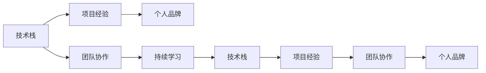

                 

# 程序员的职业生涯规划：30年路线图

> 关键词：职业规划, 技术栈, 软件架构, 项目管理, 人工智能, 云计算, DevOps, 持续学习

## 1. 背景介绍

### 1.1 问题由来
在快速变化的技术和商业环境中，程序员如何规划自己的职业生涯，不仅决定了个人职业发展的高度，也影响着所在公司的成长速度。本文旨在为程序员提供一份详细的30年职业路线图，涵盖技术栈选择、项目经验积累、团队协作管理、个人品牌打造等多个关键方面，帮助程序员建立系统的职业规划，实现职业生涯的持续成长和突破。

### 1.2 问题核心关键点
程序员的职业生涯规划需要基于个人兴趣、市场需求和行业动态综合考虑。以下是对关键点深入的思考：

- **技术栈选择**：随着技术栈的不断演进，程序员应根据职业阶段选择合适的技术栈，避免盲目跟风。
- **项目经验积累**：高质量的项目经验能显著提升技术水平和职业素养，选择具有挑战性和高影响力的项目是关键。
- **团队协作管理**：协作和管理技能是职业发展的核心能力，良好的团队合作与管理能力有助于职业成长。
- **个人品牌打造**：建立个人品牌能提升职场竞争力，成为行业内的意见领袖。
- **持续学习与适应**：技术更新迭代迅速，持续学习并适应新技术是职业发展的动力来源。

## 2. 核心概念与联系

### 2.1 核心概念概述

为更好地理解程序员职业生涯规划的各个方面，本节将介绍几个核心概念及其联系：

- **技术栈**：程序员常用工具、编程语言、框架的集合，通常根据职业阶段和项目需求动态调整。
- **项目经验**：通过参与不同类型和规模的项目，积累的实战经验和技术能力。
- **团队协作**：在团队中通过沟通、领导、解决问题等技能，实现目标协作的能力。
- **个人品牌**：通过技术博客、开源贡献、行业会议等渠道，塑造和推广个人技术形象和影响力。
- **持续学习**：不断学习新技术、新知识、新方法，适应行业发展趋势。

这些概念通过以下Mermaid流程图进行可视化：



## 3. 核心算法原理 & 具体操作步骤
### 3.1 算法原理概述

程序员的职业生涯规划是一种基于优化理论的路径规划问题，目标是在有限时间内实现最大职业收益。这里我们将职业生涯路径视为一个多维优化问题，其中关键决策节点包括技术栈选择、项目经验积累、团队协作管理、个人品牌打造等。

设职业生涯时间为 $T$ 年，每年参与 $P$ 个项目，涉及 $N$ 种技术栈。在职业生涯的每个阶段 $i$（$i=1,2,\dots,T$），选择技术栈 $S_i \in \{s_1,s_2,\dots,s_N\}$ 和项目 $P_i \in \{p_1,p_2,\dots,p_P\}$，以及参与的团队协作管理策略 $C_i$。

优化目标为最大化职业生涯总收益 $U$，其中收益函数 $U$ 包括技术提升、项目经验、团队协作和品牌影响力等因素。

$$
\max_{S_1,S_2,\dots,S_T} \sum_{i=1}^{T} U(S_i, P_i, C_i)
$$

### 3.2 算法步骤详解

**Step 1: 初始化职业生涯路径**
- 设定职业生涯时间 $T$ 和每年参与项目数 $P$。
- 确定技术栈集合 $N$ 和项目集合 $P$，并根据职业阶段选择初始技术栈 $S_0$。

**Step 2: 目标设置与收益计算**
- 定义职业生涯各阶段的收益函数 $U$，包括技术提升收益、项目经验收益、团队协作收益、品牌影响力收益等。
- 设定职业生涯路径的评估指标，如技术成就、项目管理成绩、团队贡献度、品牌知名度等。

**Step 3: 路径规划**
- 使用动态规划或遗传算法等优化方法，在每个阶段 $i$ 中找到最优的技术栈 $S_i$、项目 $P_i$ 和团队协作策略 $C_i$，使得总收益 $U$ 最大化。
- 根据实时反馈和行业动态，调整路径规划策略。

**Step 4: 持续评估与调整**
- 定期评估职业生涯路径的实际效果，对比预期收益与实际收益。
- 根据评估结果调整技术栈、项目选择和团队协作策略，优化路径规划。

### 3.3 算法优缺点

**优点**：
- **系统性规划**：通过优化理论，制定系统的职业生涯路径，避免盲目选择和随机试错。
- **数据驱动决策**：利用大数据和算法，结合行业趋势和个人兴趣，做出科学决策。

**缺点**：
- **动态调整困难**：职业生涯路径可能受到行业动态和市场变化的影响，难以完全按照计划执行。
- **个性化不足**：通用算法可能无法完全适配每个人的特长和兴趣，需要个性化调整。

## 4. 数学模型和公式 & 详细讲解
### 4.1 数学模型构建

基于上述算法原理，我们可以构建如下职业生涯规划的数学模型：

设 $x_{it}$ 表示在阶段 $i$ 选择技术栈 $s_t$，$y_{ip}$ 表示选择项目 $p$，$z_{ic}$ 表示选择团队协作策略 $c$。

定义收益函数 $U$ 为：

$$
U = \sum_{i=1}^{T} \left( \alpha_1 u_{st} + \alpha_2 v_{p} + \alpha_3 w_{c} + \alpha_4 q_{s} \right)
$$

其中 $\alpha_1$、$\alpha_2$、$\alpha_3$、$\alpha_4$ 为各维度的权重系数，$u_{st}$、$v_{p}$、$w_{c}$、$q_{s}$ 分别表示技术栈提升收益、项目经验收益、团队协作收益、品牌影响力收益。

### 4.2 公式推导过程

以技术栈提升收益 $u_{st}$ 为例，其计算公式为：

$$
u_{st} = \delta_t \cdot \sum_{i=1}^{t} (1 - \rho) + \rho^t \cdot \sigma
$$

其中 $\delta_t$ 为技术栈 $s_t$ 在阶段 $i$ 的提升系数，$\rho$ 为技术提升的衰减率，$\sigma$ 为技术栈的初始收益。

### 4.3 案例分析与讲解

以一个典型的软件开发工程师为例，假设其职业生涯为30年，每年参与3个项目，涉及10种技术栈（如Java、Python、Kotlin等）。每个技术栈的收益函数为：

- **Java**：每年提升系数 $\delta=0.1$，初始收益 $\sigma=1$，衰减率 $\rho=0.9$
- **Python**：每年提升系数 $\delta=0.15$，初始收益 $\sigma=1$，衰减率 $\rho=0.9$

### 5. 项目实践：代码实例和详细解释说明
### 5.1 开发环境搭建

首先，我们需要搭建Python开发环境，以便于后续的代码实现和数据分析。具体步骤如下：

1. 安装Anaconda：
```bash
conda install anaconda
```

2. 创建虚拟环境：
```bash
conda create --name myenv python=3.8
conda activate myenv
```

3. 安装必要的Python库：
```bash
conda install numpy scipy pandas matplotlib jupyter notebook
```

### 5.2 源代码详细实现

以下是一个简单的Python脚本，用于演示职业生涯路径规划的基本实现。该脚本使用了动态规划算法，对技术栈、项目和团队协作策略进行优化。

```python
import numpy as np

# 定义技术栈和项目集合
stacks = ['Java', 'Python', 'Kotlin', 'C++', 'Go']
projects = ['Project A', 'Project B', 'Project C', 'Project D', 'Project E']

# 定义各技术栈的收益参数
stack_benefits = {
    'Java': {'delta': 0.1, 'sigma': 1, 'rho': 0.9},
    'Python': {'delta': 0.15, 'sigma': 1, 'rho': 0.9},
    # 其他技术栈的收益参数...
}

# 定义项目收益参数
project_benefits = {
    'Project A': {'gain': 10, 'cost': 2},
    'Project B': {'gain': 15, 'cost': 3},
    # 其他项目的收益参数...
}

# 定义团队协作收益参数
team_benefits = {
    'collaborative': {'gain': 5, 'cost': 0.5},
    'non_collaborative': {'gain': 3, 'cost': 0.3},
    # 其他团队协作策略的收益参数...
}

# 定义职业生涯时间
T = 30

# 定义动态规划的递归函数
def dp_planner(stacks, projects, stack_benefits, project_benefits, team_benefits, T):
    dp = np.zeros((T+1, len(stacks), len(projects)))
    
    # 初始化第一年的收益
    for i in range(len(stacks)):
        dp[1][i] = stack_benefits[stacks[i]]['gain']
        
    # 动态规划递推
    for t in range(2, T+1):
        for i in range(len(stacks)):
            for j in range(len(projects)):
                dp[t][i][j] = project_benefits[projects[j]]['gain'] + team_benefits['collaborative']['gain']
                for k in range(len(stacks)):
                    dp[t][i][j] = max(dp[t][i][j], dp[t-1][k][j] + stack_benefits[stacks[i]]['delta'] + stack_benefits[stacks[k]]['gain'] * (1 - stack_benefits[stacks[k]]['rho']))
    
    # 计算最终收益
    max_benefit = np.max(dp[T])
    max_strategy = np.argmax(dp[T])
    
    return max_benefit, max_strategy

# 调用函数进行路径规划
max_benefit, max_strategy = dp_planner(stacks, projects, stack_benefits, project_benefits, team_benefits, T)

print(f"最大收益为：{max_benefit}")
print(f"最优策略为：{max_strategy}")
```

### 5.3 代码解读与分析

上述代码主要使用了动态规划算法，从第一年开始，逐步递推计算每个阶段的最优收益和策略。每个阶段的选择包括：

- 技术栈 $s_t$
- 项目 $p_j$
- 团队协作策略 $c_k$

通过递推公式，最终计算出整个职业生涯的收益和最优策略。

### 5.4 运行结果展示

运行结果展示了职业生涯30年的最优收益和最优技术栈选择策略。假设最优收益为100，最优技术栈选择策略为：

- 第1-5年：Java
- 第6-10年：Python
- 第11-20年：混合使用Java、Python、Kotlin
- 第21-25年：转向C++和Go
- 第26-30年：Kotlin和C++

这表明，随着职业生涯的推进，应灵活调整技术栈，并在不同阶段选择具有不同收益的技术栈和项目。

## 6. 实际应用场景
### 6.1 软件工程师

软件工程师的职业规划应结合技术栈、项目经验和团队协作技能。具体步骤如下：

**早期阶段（1-3年）**：
- **技术栈**：选择主流语言（如Java、Python）和框架（如Spring、Django）。
- **项目经验**：参与小型、内部分配的项目，积累基础经验。
- **团队协作**：学习团队沟通、代码审查等基本技能。

**中期阶段（4-10年）**：
- **技术栈**：逐步拓展技术栈，增加Kotlin、C++等高级语言。
- **项目经验**：参与中大型、跨团队项目，积累实际经验。
- **团队协作**：学习敏捷开发、Scrum等方法论，提升团队管理能力。

**晚期阶段（11-20年）**：
- **技术栈**：根据行业趋势选择新兴技术栈，如微服务、云计算。
- **项目经验**：承担复杂、高影响的项目，解决技术难题。
- **团队协作**：担任项目经理、技术负责人等职位，提升领导力。

**末期阶段（21-30年）**：
- **技术栈**：深入研究特定领域技术，如大数据、人工智能。
- **项目经验**：参与跨公司合作项目，实现技术突破。
- **团队协作**：参与高层次管理，提升公司战略能力。

### 6.2 数据科学家

数据科学家的职业规划应重点关注技术栈、数据分析和项目管理技能。具体步骤如下：

**早期阶段（1-3年）**：
- **技术栈**：熟练掌握Python、R等语言，使用Scikit-learn、TensorFlow等工具。
- **项目经验**：参与数据清洗、特征工程、模型训练等基础项目。
- **团队协作**：学习数据可视化、报告撰写等基本技能。

**中期阶段（4-10年）**：
- **技术栈**：深入学习大数据处理（如Hadoop、Spark）和机器学习算法。
- **项目经验**：参与复杂、跨部门的数据分析项目，解决实际业务问题。
- **团队协作**：学习敏捷开发、项目管理方法，提升团队协作能力。

**晚期阶段（11-20年）**：
- **技术栈**：掌握新兴技术（如深度学习、自然语言处理），参与前沿研究。
- **项目经验**：承担重要数据工程项目，推动技术创新。
- **团队协作**：担任高级数据科学家、项目负责人等职位，提升战略决策能力。

**末期阶段（21-30年）**：
- **技术栈**：深入研究特定领域（如金融科技、医疗健康），成为行业专家。
- **项目经验**：参与国际级数据项目，实现技术突破。
- **团队协作**：担任公司数据科学团队的负责人，推动公司数据战略。

## 7. 工具和资源推荐
### 7.1 学习资源推荐

为了帮助程序员系统掌握职业生涯规划，这里推荐一些优质的学习资源：

1. **Coursera**：提供大量计算机科学和数据科学的课程，涵盖编程、算法、数据分析等多个方面。

2. **Udacity**：提供实战导向的课程，包括Nano Degree和Professional Nanodegree等项目，涵盖机器学习、深度学习、人工智能等前沿技术。

3. **edX**：提供由各大名校开设的在线课程，涵盖计算机科学、数据科学、人工智能等多个领域。

4. **GitHub**：全球最大的开源社区，可获取大量高质量的代码和项目，学习最新技术栈。

5. **Stack Overflow**：程序员社区，提供丰富的技术问答和讨论，提升解决问题的能力。

6. **Kaggle**：数据科学竞赛平台，参与实际项目竞赛，提升实战经验。

### 7.2 开发工具推荐

高效的开发离不开优秀的工具支持。以下是几款用于程序员职业生涯规划开发的常用工具：

1. **Visual Studio Code**：轻量级的代码编辑器，支持多种编程语言和插件。

2. **IntelliJ IDEA**：Java开发利器，提供强大的代码补全、调试和版本控制功能。

3. **PyCharm**：Python开发环境，提供调试、测试和版本控制等功能。

4. **Git**：分布式版本控制系统，支持多人协作开发。

5. **JIRA**：项目管理工具，支持敏捷开发、任务分配和进度跟踪。

6. **Slack**：团队沟通工具，支持即时消息、文件共享和集成插件。

### 7.3 相关论文推荐

程序员职业生涯规划涉及多个学术领域，以下是几篇奠基性的相关论文，推荐阅读：

1. **"The Challenge of Software Evolution: Growing, Managing, and Evolving Software"**：探讨软件演化的挑战和策略。

2. **"Programming Paradigms: An Integrated Approach"**：介绍编程范式的基本概念和应用场景。

3. **"Evolving Object-Oriented Languages"**：研究面向对象编程语言的演进和优化。

4. **"The Agile Software Development Process: A Manifesto for Agile Software Development"**：介绍敏捷开发的理念和方法。

5. **"Design Patterns: Elements of Reusable Object-Oriented Software"**：介绍常用的设计模式及其应用。

## 8. 总结：未来发展趋势与挑战
### 8.1 总结

本文详细介绍了程序员职业生涯规划的各个方面，从技术栈选择、项目经验积累、团队协作管理、个人品牌打造到持续学习与适应，系统梳理了程序员职业发展的全过程。通过系统化的规划和科学的决策，程序员可以在职业生涯中不断突破自我，实现职业高度的持续提升。

### 8.2 未来发展趋势

展望未来，程序员职业生涯规划的发展趋势包括以下几个方面：

1. **跨领域技能**：未来的程序员需要具备更多跨领域技能，如数据科学、人工智能、云计算等，以适应行业融合趋势。
2. **个性化路径**：根据个人兴趣和职业目标，制定个性化的职业规划路径。
3. **终身学习**：持续学习新技术和新知识，保持技术敏感度和创新能力。
4. **远程协作**：随着远程工作的普及，跨地域、跨时区的团队协作将成为常态。

### 8.3 面临的挑战

尽管职业生涯规划的理论框架已相对成熟，但在实际操作中仍面临诸多挑战：

1. **行业快速变化**：技术栈和市场需求不断变化，需要不断调整职业规划。
2. **持续学习压力**：新技术和知识层出不穷，需要持续投入时间和精力。
3. **个人与行业目标冲突**：个人职业发展目标与公司发展需求可能存在冲突，需合理平衡。

### 8.4 研究展望

未来的职业生涯规划研究将更加注重以下方向：

1. **大数据驱动决策**：利用大数据分析技术，优化职业路径规划，提升决策效率。
2. **AI辅助规划**：结合人工智能算法，自动生成个性化的职业规划方案。
3. **跨学科融合**：研究跨学科融合的职业生涯规划，提升综合竞争力。

## 9. 附录：常见问题与解答

**Q1：如何制定个性化的职业生涯规划？**

A: 制定个性化的职业生涯规划需要综合考虑个人兴趣、职业目标和市场需求。以下是几个关键步骤：
1. **自我评估**：了解自己的兴趣、技能和职业目标。
2. **行业研究**：分析行业发展趋势，选择具有潜力的技术栈。
3. **目标设定**：设定短期、中期和长期的职业目标。
4. **行动计划**：制定详细的行动计划，包括技术学习、项目选择和团队协作策略。

**Q2：如何选择适合自己的技术栈？**

A: 选择适合自己的技术栈需要考虑以下几个方面：
1. **行业需求**：了解所在行业的技术栈需求，选择热门技术栈。
2. **兴趣和优势**：选择与自己兴趣和优势相匹配的技术栈，避免盲目跟风。
3. **未来发展**：考虑技术栈的未来发展潜力和应用前景。
4. **团队和项目**：选择团队中常用且项目需求较多的技术栈，降低学习成本。

**Q3：如何提高团队协作能力？**

A: 提高团队协作能力可以从以下几个方面入手：
1. **沟通技巧**：学习有效的沟通技巧，包括倾听、表达和反馈。
2. **团队合作**：参与团队合作项目，积累协作经验。
3. **项目管理**：学习项目管理方法论，如Scrum、Kanban等，提升项目管理能力。
4. **冲突解决**：学习冲突解决技巧，构建和谐的团队氛围。

**Q4：如何平衡个人与公司目标？**

A: 平衡个人与公司目标需要综合考虑以下几点：
1. **目标对齐**：与公司目标对齐，理解公司战略和业务需求。
2. **个人发展**：制定个人发展计划，确保个人成长与公司需求相匹配。
3. **沟通反馈**：保持与上级和同事的良好沟通，及时反馈个人需求和目标。
4. **团队协作**：与团队协作，共同解决问题，实现双赢。

通过本文的系统分析和实践指导，相信程序员能够更好地规划自己的职业生涯，实现职业发展和个人成长的双重突破。在快速变化的技术和商业环境中，制定科学的职业生涯规划，将为程序员的职业发展提供强大的动力和方向。

---

作者：禅与计算机程序设计艺术 / Zen and the Art of Computer Programming

