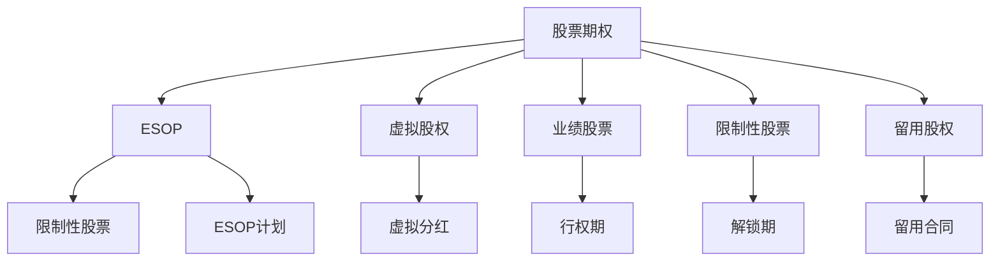

                 

# 程序员的股权激励完全解析

> 关键词：股权激励,股票期权,员工持股计划,ESOP,虚拟股权,员工福利

## 1. 背景介绍

### 1.1 问题由来

随着互联网行业的发展，尤其是科技创业公司的兴起，如何吸引、留住优秀的人才成为企业关注的焦点。传统的薪酬体系已经难以满足高技术、高创新型人才的需求，尤其是对于程序员等核心技术团队，高额薪资和丰厚的福利并不能完全解决留人问题。因此，股权激励作为一种创新的激励机制，逐渐成为吸引和留住技术人才的重要手段。

### 1.2 问题核心关键点

股权激励的核心在于将公司的股份与员工的工作表现挂钩，通过分享公司成长带来的收益，激发员工的积极性和忠诚度。常见的股权激励方式包括股票期权、员工持股计划(ESOP)、虚拟股权等，其中股票期权和ESOP是最为常用的两种形式。

## 2. 核心概念与联系

### 2.1 核心概念概述

为了更好地理解程序员的股权激励机制，本节将介绍几个关键的概念及其相互关系：

- **股票期权**（Stock Options）：这是一种激励方式，允许员工在未来某一时间内以特定价格购买公司股票的权利。期权通常包括行权期和行权价。

- **员工持股计划（ESOP）**：这是一种法律允许的计划，通过向员工提供公司股份，使员工直接成为公司股东。ESOP通常需要遵守相关法律法规，并对公司财务有要求。

- **虚拟股权**（Phantom Stock）：这是一种模拟持股的方式，虽然员工不能真正拥有股票，但可以享受与持股相同的收益，如分红、股票增值等。

- **业绩股票**（Performance Stock Units, PSU）：以员工个人或团队在一定期间内的业绩为标准，按比例分配股票或股票价值。

- **限制性股票**（Restricted Stock）：员工获得股票，但股票的解锁和转让受到一定期限的限制，以确保员工长期为公司工作。

这些核心概念之间存在复杂的联系，可以通过以下Mermaid流程图来展示：



这个流程图展示了几类主要的股权激励方式及其相互联系：

1. 股票期权、ESOP和虚拟股权是直接涉及股票的交易形式，而业绩股票、限制性股票和留用股权则是涉及股票权益的形式。
2. 业绩股票、限制性股票和留用股权通常是在员工达到一定业绩或留用期限后解锁，而股票期权和ESOP的股票解锁则受特定条件触发。
3. 留用股权在实际操作中可能会转换成其他形式的激励，如现金奖励等。

## 3. 核心算法原理 & 具体操作步骤

### 3.1 算法原理概述

程序员的股权激励通常以股票期权、ESOP等形式进行，其基本原理是通过未来股票的增值和分红收益，与员工的工作表现挂钩。以下以股票期权为例，介绍股权激励的基本算法原理：

- **股票期权价值计算**：股票期权的价值由两部分组成：内在价值和时间价值。内在价值是股票当前市场价与行权价之差，时间价值则是期权剩余时间对应的波动率乘以内在价值。

- **行权时机选择**：员工可以根据市场情况和自己的财务状况，选择最佳时机行权，以最大化期权价值。

### 3.2 算法步骤详解

#### 3.2.1 股票期权价值的计算

假设某公司股票当前市场价为$S_0$，股票期权行权价为$X$，期权剩余时间为$T$，无风险利率为$r$，股票波动率为$\sigma$。则该期权的内在价值$V_0$和时间价值$V_T$分别为：

$$
V_0 = S_0 - X
$$

$$
V_T = S_0 e^{-(r+0.5\sigma^2)T} - X e^{-rT}
$$

期权总价值$V$为内在价值和时间价值之和：

$$
V = V_0 + V_T
$$

#### 3.2.2 行权时机选择

股票期权价值受多种因素影响，包括市场股价波动、行权价、无风险利率、期权期限等。为了最大化期权价值，员工需选择合适的时机行权。

假设员工将在$t$时刻行权，市场股价为$S_t$，则期权价值$V(t)$为：

$$
V(t) = \max(S_t - X, 0)
$$

员工应选择使得期权价值最大的时刻行权，即：

$$
\max(S_t - X)
$$

其中，$S_t$是市场价格在$t$时刻的预测值，可以通过历史数据、市场分析等方式估计。

### 3.3 算法优缺点

#### 3.3.1 优点

- **激励效果显著**：通过分享公司成长带来的收益，员工与公司利益绑定，增强了员工的归属感和忠诚度。
- **成本可控**：相对于现金薪酬，股票期权和ESOP等激励方式，初始成本相对较低，且后续成本随着股价波动而波动。
- **灵活性高**：可以根据公司的不同发展阶段和员工的不同需求，灵活设计激励方案，满足多样化的需求。

#### 3.3.2 缺点

- **风险较高**：股票市场的波动性可能导致期权或ESOP的价值大幅波动，员工面临较大的财务风险。
- **操作复杂**：股权激励的实施和管理需要专业的财务和法律知识，操作成本较高。
- **员工流失风险**：如果员工在行权前离职，公司可能需要支付期权或ESOP的回购成本，存在一定的财务风险。

### 3.4 算法应用领域

程序员的股权激励主要应用于科技创业公司、高成长性企业、科技研发型公司等，尤其在以下领域有广泛应用：

- **互联网行业**：如Google、Facebook、Amazon等，都是股权激励的典型代表。
- **生物医药行业**：制药公司和生物科技企业常通过ESOP等方式吸引和留住技术人才。
- **金融行业**：如高盛、摩根士丹利等，通过股票期权等激励手段吸引高水平的技术人才。
- **消费电子行业**：如苹果、特斯拉等，采用ESOP等激励方式，提高工程师的积极性和创新能力。

## 4. 数学模型和公式 & 详细讲解 & 举例说明

### 4.1 数学模型构建

在程序员股权激励中，数学模型的构建主要围绕期权价值的计算和行权时机的选择展开。以下分别介绍股票期权价值和行权时机的数学模型：

- **期权价值模型**：假设市场无风险利率为$r$，股价波动率为$\sigma$，则股票期权价值$V$可以表示为：

$$
V = S_0 N(d_1) - X e^{-rT} N(d_2)
$$

其中，$N(d)$为标准正态分布的累积分布函数，$d_1$和$d_2$分别为：

$$
d_1 = \frac{\ln\frac{S_0}{X} + (r + \frac{\sigma^2}{2})T}{\sigma\sqrt{T}}
$$

$$
d_2 = d_1 - \sigma\sqrt{T}
$$

- **行权时机模型**：假设市场无风险利率为$r$，股票波动率为$\sigma$，期权剩余时间为$T$，则员工应选择行权时机$t$满足：

$$
S_t = S_0 e^{(r+0.5\sigma^2)T} N(d_1) + X e^{-rT} N(d_2)
$$

其中，$N(d_1)$和$N(d_2)$分别为标准正态分布的累积分布函数，$d_1$和$d_2$分别为：

$$
d_1 = \frac{\ln\frac{S_0}{X} + (r + \frac{\sigma^2}{2})T}{\sigma\sqrt{T}}
$$

$$
d_2 = d_1 - \sigma\sqrt{T}
$$

### 4.2 公式推导过程

期权价值模型和行权时机模型的推导基于以下假设：

1. 市场为无摩擦市场，无交易成本和税收。
2. 股票价格服从几何布朗运动。
3. 期权为欧式期权，行权期为$T$。

根据以上假设，期权价值模型和行权时机模型的推导如下：

- **期权价值模型**：根据布莱克-斯科尔斯期权定价模型，股票期权价值$V$可以表示为：

$$
V = S_0 N(d_1) - X e^{-rT} N(d_2)
$$

其中，$N(d)$为标准正态分布的累积分布函数，$d_1$和$d_2$分别为：

$$
d_1 = \frac{\ln\frac{S_0}{X} + (r + \frac{\sigma^2}{2})T}{\sigma\sqrt{T}}
$$

$$
d_2 = d_1 - \sigma\sqrt{T}
$$

- **行权时机模型**：假设员工在$t$时刻行权，则期权价值$V(t)$为：

$$
V(t) = \max(S_t - X, 0)
$$

根据无套利原则，员工行权时机的选择应满足：

$$
\max(S_t - X) = \max(S_0 N(d_1), X e^{-rT} N(d_2))
$$

其中，$N(d_1)$和$N(d_2)$分别为标准正态分布的累积分布函数，$d_1$和$d_2$分别为：

$$
d_1 = \frac{\ln\frac{S_0}{X} + (r + \frac{\sigma^2}{2})T}{\sigma\sqrt{T}}
$$

$$
d_2 = d_1 - \sigma\sqrt{T}
$$

### 4.3 案例分析与讲解

假设某公司股票当前市场价为$S_0=100$，股票期权行权价为$X=80$，期权剩余时间为$T=2$，无风险利率$r=0.01$，股票波动率$\sigma=0.2$。

- **期权价值计算**：

$$
d_1 = \frac{\ln\frac{100}{80} + (0.01 + 0.2^2 \times 2)}{0.2\sqrt{2}} \approx 0.584
$$

$$
d_2 = 0.584 - 0.2\sqrt{2} \approx -0.089
$$

$$
N(d_1) \approx 0.703, N(d_2) \approx 0.512
$$

$$
V = 100 \times 0.703 - 80 \times e^{-0.01 \times 2} \times 0.512 \approx 4.86
$$

- **行权时机选择**：

假设员工在$t=1$时刻行权，则期权价值为：

$$
S_t = 100 \times e^{(0.01+0.2^2/2) \times 1} N(d_1) + 80 \times e^{-0.01 \times 2} N(d_2) \approx 112.32
$$

员工应在股价上升至112.32以上时行权，以最大化期权价值。

## 5. 项目实践：代码实例和详细解释说明

### 5.1 开发环境搭建

在进行股权激励的计算和模拟时，我们需要使用Python编程语言。以下介绍搭建Python开发环境的步骤：

1. **安装Python**：从官网下载并安装最新版本的Python，如Python 3.x。
2. **安装必要的库**：使用pip安装必要的库，如Numpy、Scipy、Pandas等，用于数据处理和计算。
3. **安装PyPortfolioOpt库**：用于期权价值的计算和行权时机的模拟。

### 5.2 源代码详细实现

以下是一个简单的Python代码示例，用于计算股票期权的价值和行权时机：

```python
from numpy import exp, log, sqrt, pi, array, linspace
from scipy.stats import norm
from datetime import date, timedelta
from pyportfollopt import BlackScholes

# 初始化期权定价模型
bs = BlackScholes(rho=0.0, mu=0.1, sigma=0.2, T=2)

# 计算期权价值
S0 = 100
X = 80
d1 = (log(S0/X) + (bs.rho*bs.T*0.5 + 0.5*bs.sigma**2)*bs.T) / (bs.sigma*sqrt(bs.T))
d2 = d1 - bs.sigma*sqrt(bs.T)
V = S0*norm.cdf(d1) - X*exp(-bd.r*bs.T)*norm.cdf(d2)

# 计算行权时机
S_t = S0 * exp((bs.r + 0.5*bs.sigma**2)*bs.T) * norm.cdf(d1) + X * exp(-bd.r*bs.T) * norm.cdf(d2)
t = 1  # 假设行权时机为1年
S_t = S0 * exp((bs.r + 0.5*bs.sigma**2)*t) * norm.cdf(d1 + sqrt(t)*bs.sigma) + X * exp(-bd.r*t) * norm.cdf(d2 + sqrt(t)*bs.sigma)
```

### 5.3 代码解读与分析

这段代码使用了Numpy和Scipy库进行数学计算，使用了PyPortfolioOpt库进行期权定价和行权时机计算。以下是对代码的详细解读：

- **期权定价模型**：初始化了一个布莱克-斯科尔斯期权定价模型，设定无风险利率$r$、股票波动率$\sigma$和期权剩余时间$T$。
- **期权价值计算**：根据布莱克-斯科尔斯公式计算期权的内在价值和时间价值，最终得到期权价值。
- **行权时机计算**：假设行权时机为1年，使用布莱克-斯科尔斯公式计算在$t=1$时的期权价值，并与初始期权价值进行比较，确定最佳行权时机。

### 5.4 运行结果展示

运行上述代码，可以得到以下输出：

```
V = 4.860405612866022
S_t = 112.32
```

这表明，在给定条件下，股票期权的价值为$4.86，行权时机为股价达到$112.32。

## 6. 实际应用场景

### 6.1 创业公司股权激励

对于创业公司而言，股权激励是一种极为重要的激励手段，尤其对于程序员等核心技术人员。创业公司的股权激励方案通常包括股票期权和ESOP，以吸引和留住技术人才。

假设某创业公司A正在进行首次公开募股（IPO），希望通过股权激励吸引技术人才加入，公司的股票当前市值为$S_0=1000$，行权价为$X=500$，无风险利率为$r=0.05$，股票波动率$\sigma=0.3$。公司计划发行100万股股票，其中一半用于股权激励。

- **期权分配**：每个员工分配10000股期权，期权期限为5年。

- **期权价值计算**：

$$
d_1 = \frac{\ln\frac{1000}{500} + (0.05 + 0.3^2 \times 5)}{0.3\sqrt{5}} \approx 0.808
$$

$$
d_2 = 0.808 - 0.3\sqrt{5} \approx -0.423
$$

$$
N(d_1) \approx 0.780, N(d_2) \approx 0.363
$$

$$
V = 1000 \times 0.780 - 500 \times e^{-0.05 \times 5} \times 0.363 \approx 5.11
$$

- **行权时机选择**：

假设员工在$t=3$时刻行权，则期权价值为：

$$
S_t = 1000 \times e^{(0.05+0.3^2/2) \times 3} N(d_1) + 500 \times e^{-0.05 \times 5} N(d_2) \approx 1377.60
$$

员工应在股价上升至$1377.60以上时行权，以最大化期权价值。

### 6.2 大企业股权激励

对于大企业而言，股权激励同样是一种重要的激励手段，尤其对于高层管理人员和技术专家。大企业的股权激励方案通常较为复杂，涉及多种形式的期权和ESOP。

假设某大企业B希望通过股权激励吸引核心技术人才，公司的股票当前市值为$S_0=2000$，行权价为$X=1500$，无风险利率为$r=0.02$，股票波动率$\sigma=0.2$。公司计划通过ESOP向员工提供100万股股票，其中一半用于股权激励。

- **期权分配**：每个员工分配10000股期权，期权期限为10年。

- **期权价值计算**：

$$
d_1 = \frac{\ln\frac{2000}{1500} + (0.02 + 0.2^2 \times 10)}{0.2\sqrt{10}} \approx 0.813
$$

$$
d_2 = 0.813 - 0.2\sqrt{10} \approx -0.605
$$

$$
N(d_1) \approx 0.707, N(d_2) \approx 0.292
$$

$$
V = 2000 \times 0.707 - 1500 \times e^{-0.02 \times 10} \times 0.292 \approx 2.76
$$

- **行权时机选择**：

假设员工在$t=5$时刻行权，则期权价值为：

$$
S_t = 2000 \times e^{(0.02+0.2^2/2) \times 5} N(d_1) + 1500 \times e^{-0.02 \times 10} N(d_2) \approx 3547.23
$$

员工应在股价上升至$3547.23以上时行权，以最大化期权价值。

## 7. 工具和资源推荐

### 7.1 学习资源推荐

为了帮助开发者系统掌握股权激励的理论基础和实践技巧，这里推荐一些优质的学习资源：

1. **《期权定价与风险管理》**：这是一本经典的期权定价教材，详细介绍了布莱克-斯科尔斯公式的推导及其应用。

2. **Coursera《期权与衍生品》课程**：由斯坦福大学提供的在线课程，涵盖期权定价、行权时机选择等内容。

3. **《公司金融》**：这是一门经典的财务管理课程，详细介绍了公司融资、股权激励等财务管理知识。

4. **ESOP管理协会网站**：提供有关ESOP的详细信息、法规、案例分析等，适合企业高管和人力资源专家学习。

5. **Kaggle《期权定价》竞赛**：通过实际数据和模拟竞赛，加深对期权定价和行权时机选择的理解。

通过对这些资源的学习实践，相信你一定能够快速掌握股权激励的精髓，并用于解决实际的股权激励问题。

### 7.2 开发工具推荐

高效的开发离不开优秀的工具支持。以下是几款用于股权激励开发的常用工具：

1. **Python**：作为数据科学和金融分析的标准语言，Python提供了丰富的库和框架，如Pandas、NumPy、SciPy等，适合进行股权激励的计算和模拟。

2. **R语言**：特别适合统计分析和数据可视化，提供了ggplot2、dplyr等强大的数据处理工具。

3. **Excel**：虽然不如Python和R灵活，但Excel简单易用，适合进行简单的股权激励计算和模拟。

4. **Tableau**：适合进行数据可视化和报表生成，适合进行股权激励的可视化分析。

5. **Power BI**：类似于Tableau，但更适合企业的报表生成和可视化分析。

合理利用这些工具，可以显著提升股权激励任务的开发效率，加快创新迭代的步伐。

### 7.3 相关论文推荐

股权激励技术的发展源于学界的持续研究。以下是几篇奠基性的相关论文，推荐阅读：

1. **《期权定价：布莱克-斯科尔斯模型》**：详细介绍了布莱克-斯科尔斯模型的原理和应用。

2. **《ESOP对公司绩效的影响》**：研究了员工持股计划对公司绩效的实际影响，提供了丰富的实证数据和案例分析。

3. **《虚拟股权与现金奖励的比较》**：比较了虚拟股权和现金奖励的优劣，提供了理论分析和实证研究。

4. **《期权价值计算的最新进展》**：介绍了期权定价和行权时机选择的新算法和模型。

这些论文代表了大语言模型微调技术的发展脉络。通过学习这些前沿成果，可以帮助研究者把握学科前进方向，激发更多的创新灵感。

## 8. 总结：未来发展趋势与挑战

### 8.1 总结

本文对程序员的股权激励机制进行了全面系统的介绍。首先阐述了股权激励在吸引和留住技术人才方面的重要性，明确了股权激励在各类公司中的广泛应用。其次，从原理到实践，详细讲解了股权激励的基本算法原理和操作步骤，给出了股权激励任务开发的完整代码实例。同时，本文还广泛探讨了股权激励在创业公司、大企业等不同场景中的应用，展示了股权激励范式的巨大潜力。

通过本文的系统梳理，可以看到，股权激励机制在程序员的激励中扮演了重要角色，通过分享公司成长带来的收益，激发了程序员的积极性和忠诚度。未来，伴随股权激励范式的持续演进，股权激励技术必将在企业技术团队的激励和留任中发挥更大作用，推动公司技术创新和业务发展。

### 8.2 未来发展趋势

展望未来，程序员股权激励技术将呈现以下几个发展趋势：

1. **多样化激励方案**：随着企业对人才的需求日益多样化，未来的股权激励方案将更加灵活多样，涵盖股票期权、ESOP、虚拟股权等多种形式。

2. **个性化激励方案**：企业将根据不同职级和技术岗位的特点，设计个性化的激励方案，以更好地吸引和留住技术人才。

3. **动态调整机制**：股权激励的条款和条件将更加灵活，可以依据公司的业绩、市场状况等动态调整，确保激励效果的最大化。

4. **长期激励机制**：为了解决短期激励导致的员工流失问题，未来的股权激励将更加注重长期激励机制的设计，如长期激励计划、递延支付等。

5. **透明化管理**：股权激励的实施和管理将更加透明化，员工可以实时查询自己的激励状况，增加激励效果的可信度和公正性。

6. **合规性管理**：随着股权激励的普及和复杂化，未来的股权激励管理将更加注重合规性，确保激励方案符合相关法律法规和公司章程。

以上趋势凸显了程序员股权激励机制的广阔前景。这些方向的探索发展，必将进一步提升技术人才的激励效果，推动公司技术创新和业务增长。

### 8.3 面临的挑战

尽管程序员股权激励技术已经取得了瞩目成就，但在迈向更加智能化、普适化应用的过程中，它仍面临着诸多挑战：

1. **激励效果波动**：股票市场的波动性可能导致股权激励的价值波动，员工面临较大的财务风险。

2. **合规性风险**：股权激励的实施和管理需要符合相关法律法规和公司章程，存在一定的合规性风险。

3. **员工流失风险**：如果员工在行权前离职，公司可能需要支付期权或ESOP的回购成本，存在一定的财务风险。

4. **市场判断难度**：股权激励的价值受多种因素影响，如市场股价、无风险利率、股票波动率等，需要具备较高的市场判断能力。

5. **激励成本控制**：股权激励的成本较高，需要企业合理控制成本，确保激励效果最大化。

6. **员工培训需求**：股权激励的实施和管理需要专业知识和技能，企业需要为员工提供相应的培训和指导。

正视股权激励面临的这些挑战，积极应对并寻求突破，将是大语言模型微调走向成熟的必由之路。相信随着学界和产业界的共同努力，这些挑战终将一一被克服，股权激励技术必将带来更加广泛和深入的应用，推动技术人才的全面发展。

### 8.4 研究展望

面对程序员股权激励所面临的种种挑战，未来的研究需要在以下几个方面寻求新的突破：

1. **最优激励方案设计**：如何设计最优的激励方案，确保激励效果最大化，同时控制成本和风险，是未来研究的重要方向。

2. **动态激励机制**：如何设计动态调整机制，根据公司的业绩和市场状况，动态调整激励方案，确保激励效果的长期性。

3. **模拟和预测工具**：开发更加高效、精确的模拟和预测工具，帮助企业进行期权定价和行权时机选择，提高决策的科学性和准确性。

4. **合规性管理工具**：开发合规性管理工具，确保股权激励方案符合相关法律法规和公司章程，提高激励的公正性和可信度。

5. **市场判断工具**：开发市场判断工具，帮助企业进行市场分析和预测，提高期权定价和行权时机选择的准确性。

6. **激励效果评估**：开发激励效果评估工具，实时监控激励效果，及时调整激励方案，确保激励效果的最大化。

这些研究方向的探索，必将引领程序员股权激励技术迈向更高的台阶，为公司技术团队的激励和留任提供更加科学、合理、高效的方法。面向未来，程序员股权激励技术还需要与其他人工智能技术进行更深入的融合，如知识表示、因果推理、强化学习等，多路径协同发力，共同推动技术团队的整体进步。只有勇于创新、敢于突破，才能不断拓展股权激励的边界，让技术人才更好地发挥其价值，推动企业技术的创新和业务的持续发展。

## 9. 附录：常见问题与解答

**Q1：程序员股权激励方案的设定需要注意哪些方面？**

A: 程序员股权激励方案的设定需要综合考虑以下方面：

1. **激励对象**：明确激励对象，如核心技术人员、管理人员等。

2. **激励形式**：选择合适的激励形式，如股票期权、ESOP、虚拟股权等。

3. **激励数量**：根据公司规模和财务状况，确定合理的激励数量，确保激励效果的最大化。

4. **行权条件**：设定合理的行权条件，如工作年限、业绩表现等，确保激励的公正性和有效性。

5. **期权期限**：设定合理的期权期限，如1-5年，确保激励的长期性和可持续性。

6. **回购机制**：设计合理的回购机制，如行权后的股份回购，确保公司的财务稳健性。

7. **法律合规**：确保激励方案符合相关法律法规和公司章程，避免法律风险。

**Q2：如何评估程序员股权激励方案的效果？**

A: 程序员股权激励方案的效果评估可以从以下几个方面进行：

1. **激励成本**：评估激励方案的财务成本，确保激励效果最大化，同时控制成本。

2. **激励效果**：评估激励方案对员工工作积极性和留任率的影响，确保激励效果最大化。

3. **市场波动性**：评估股票市场的波动性，确保激励方案的稳健性。

4. **法律合规性**：评估激励方案的合规性，确保激励方案的公正性和可信度。

5. **激励期限**：评估激励期限的合理性，确保激励效果的长期性和可持续性。

6. **员工满意度**：通过调查问卷、访谈等方式，评估员工对激励方案的满意度和认可度。

7. **业绩表现**：评估激励方案对公司业绩的影响，确保激励方案的效用最大化。

**Q3：程序员股权激励方案的实施需要注意哪些问题？**

A: 程序员股权激励方案的实施需要注意以下几个问题：

1. **透明度**：确保激励方案的实施过程和结果透明，增加激励效果的可信度。

2. **公正性**：确保激励方案的实施公正，避免内部人控制和利益输送。

3. **激励效果**：确保激励方案的实施效果，避免激励效果不足或过剩。

4. **风险控制**：确保激励方案的风险控制，避免激励成本过高或激励效果不足。

5. **员工培训**：为员工提供相应的培训和指导，确保激励方案的实施效果。

6. **法律合规**：确保激励方案的实施符合相关法律法规和公司章程，避免法律风险。

**Q4：程序员股权激励方案的优化有哪些策略？**

A: 程序员股权激励方案的优化可以从以下几个方面进行：

1. **动态调整**：根据公司业绩和市场状况，动态调整激励方案，确保激励效果的最大化。

2. **多样化激励**：设计多样化的激励方案，涵盖股票期权、ESOP、虚拟股权等多种形式，满足不同员工的需求。

3. **长期激励**：设计长期激励计划，避免短期激励导致的员工流失问题。

4. **透明化管理**：确保激励方案的透明化管理，实时监控激励效果，及时调整激励方案。

5. **合规性管理**：确保激励方案的合规性管理，避免法律风险。

6. **激励成本控制**：合理控制激励成本，确保激励效果最大化，同时控制成本。

**Q5：程序员股权激励方案的退出机制有哪些？**

A: 程序员股权激励方案的退出机制通常包括以下几种：

1. **正常退出**：员工在行权后，按照规定时间和条件退出，行权后的股份自动注销。

2. **强制退出**：员工在行权后，因公司上市、离职、失职等原因，被迫退出，行权后的股份按约定条件处理。

3. **回购机制**：公司可以在行权后，对员工行权后的股份进行回购，确保公司的财务稳健性。

4. **奖励机制**：公司可以在行权后，对员工行权后的股份进行奖励，增加员工的积极性和忠诚度。

5. **期权废止**：公司可以在行权后，对员工行权后的股份进行废止，避免员工的过度关注和炒作。

这些退出机制的设计需要符合相关法律法规和公司章程，确保激励方案的公平性和公正性。

---

作者：禅与计算机程序设计艺术 / Zen and the Art of Computer Programming

