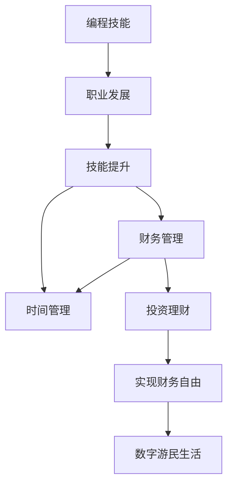

                 

## 1. 背景介绍

随着信息技术的飞速发展，数字化已经成为当今社会的重要特征。程序员作为数字化时代的核心力量，在数字产业中扮演着重要的角色。然而，尽管程序员在职业发展中获得了巨大的成功，但长时间的工作压力和高强度的工作节奏也带来了诸多问题，如职业倦怠、生活与工作的平衡失调等。因此，程序员如何实现财务自由，过上数字游民生活，成为了一个备受关注的话题。

### 1.1 问题由来

近年来，随着区块链、人工智能、大数据等前沿技术的兴起，程序员的需求激增，但与此同时，工作压力和工作时间也在不断增加。许多程序员为了追求技术突破和职业晋升，投入了大量时间和精力，导致身体和心理健康的严重透支。因此，如何在职业生涯中实现财务自由，过上数字游民生活，成为了程序员们的迫切需求。

### 1.2 问题核心关键点

实现程序员的财务自由，需要从职业发展、技能提升、财务管理和时间管理等多个方面综合考虑。核心关键点包括：

- **职业发展**：选择一个具备长期增长潜力的技术领域，持续学习和提升，建立个人品牌和影响力。
- **技能提升**：不仅限于编程技能，还应包括时间管理、财务管理和人际关系处理等软技能。
- **财务管理**：合理规划收入和支出，建立紧急基金，进行理财和投资。
- **时间管理**：高效利用时间，提高工作效率，确保工作与生活的平衡。

这些关键点相辅相成，共同构成了程序员实现财务自由的重要框架。

## 2. 核心概念与联系

### 2.1 核心概念概述

为了更好地理解如何实现程序员的财务自由，本节将介绍几个密切相关的核心概念：

- **财务自由**：指个人或家庭的收入主要来源于投资而非工作，能够自由支配资产，实现经济独立。
- **数字游民**：指利用数字技术和互联网，在全球范围内自由工作和生活的人，通常具备较高的技能水平和较强的自主学习能力。
- **时间管理**：指通过计划和控制时间，提高工作效率和生活质量的过程。
- **财务管理**：指对个人或家庭的收入、支出、债务和投资等进行规划和管理，实现财务目标。
- **编程技能**：指编写、调试和维护计算机程序的能力，包括但不限于编程语言、算法、数据结构和软件工程方法等。

这些核心概念之间的逻辑关系可以通过以下Mermaid流程图来展示：



这个流程图展示了几大核心概念及其之间的联系：

1. 编程技能是程序员职业生涯的基石，通过不断学习和提升，能够获得更高的职业发展机会。
2. 职业发展需要技能提升作为支撑，同时技能提升也涵盖时间管理和财务管理等软技能。
3. 财务管理和投资理财是实现财务自由的关键环节。
4. 财务自由是数字游民生活的基础，能够提供经济上的保障和自由。
5. 数字游民生活不仅依赖于财务自由，还需要高效的时间管理和技术支撑。

## 3. 核心算法原理 & 具体操作步骤

### 3.1 算法原理概述

程序员实现财务自由的过程，本质上是一个系统性的目标规划和执行过程。其核心算法原理包括：

- **目标设定**：明确财务自由的目标，并设定阶段性的小目标。
- **资源分配**：在编程、学习、投资和生活中进行资源合理分配，以实现短期和长期目标。
- **风险管理**：评估和规避投资和生活中的风险，保持财务和心理的稳定性。

### 3.2 算法步骤详解

实现程序员的财务自由，主要包括以下几个关键步骤：

**Step 1: 目标设定**

1. **确定财务自由目标**：根据自身情况设定合理的财务自由目标，如三年内实现财务自由，或一年内储蓄达到某个金额。
2. **设定阶段性目标**：将大目标分解为若干小目标，如每月储蓄目标、投资回报目标等。

**Step 2: 资源分配**

1. **时间管理**：制定每日、每周和每月的日程安排，合理安排工作和生活时间。
2. **技能提升**：根据职业发展需求，制定学习计划，提升编程技能和其他相关技能。
3. **财务管理**：制定预算计划，控制开支，合理规划储蓄和投资。
4. **风险管理**：评估和规避投资和生活中的风险，建立应急基金。

**Step 3: 执行与调整**

1. **定期检查**：每周或每月对目标进展进行检查，调整计划。
2. **持续学习**：根据反馈和环境变化，持续优化时间和技能管理策略。
3. **风险评估**：定期评估投资和生活中的风险，调整策略以保持财务和心理的稳定性。

### 3.3 算法优缺点

实现程序员财务自由的方法具有以下优点：

1. **系统性和可操作性**：通过系统化的目标规划和执行，能够有效提升财务自由实现的可能性。
2. **灵活性和适应性**：根据个人情况和环境变化，灵活调整计划，适应变化。
3. **全面的资源管理**：涵盖了编程技能、时间管理、财务管理等多个方面，综合提升个人能力。

同时，该方法也存在一定的局限性：

1. **依赖个人自律**：实现财务自由需要高度的自律性和执行力，对于缺乏自律性的个人可能较为困难。
2. **不确定性**：市场和环境的变化可能会影响财务自由实现的进度和效果。
3. **风险管理复杂**：在追求财务自由的过程中，需要评估和规避各种风险，复杂度较高。

尽管存在这些局限性，但通过合理的规划和管理，仍然可以大大提高实现财务自由的可能性。

### 3.4 算法应用领域

实现程序员财务自由的方法不仅适用于个人职业发展，还可以应用于更广泛领域：

1. **职业转型**：对于希望转型的技术人员，通过规划和执行，可以在不放弃本职工作的情况下，逐渐增加副业收入，实现经济独立。
2. **创业**：对于有创业意向的技术人员，通过系统的资源管理和目标规划，可以有效控制风险，提升创业成功率。
3. **生活方式选择**：对于追求自由和探索生活方式的技术人员，通过财务自由，可以实现更加灵活和自主的生活选择。

## 4. 数学模型和公式 & 详细讲解 & 举例说明（备注：数学公式请使用latex格式，latex嵌入文中独立段落使用 $$，段落内使用 $)
### 4.1 数学模型构建

本节将使用数学语言对程序员实现财务自由的过程进行更加严格的刻画。

记程序员的收入为 $I$，支出为 $C$，储蓄为 $S$，投资回报率为 $r$，初始储蓄为 $S_0$，设定财务自由目标为 $F$，目标时间为 $T$。则数学模型可以表示为：

$$
F = (1 + r)^{T} (S_0 + \int_{0}^{T} (I - C) dt)
$$

其中，$(1 + r)^{T}$ 表示投资回报的复利效应，$S_0$ 表示初始储蓄，$\int_{0}^{T} (I - C) dt$ 表示在 $T$ 时间内储蓄的增长。

### 4.2 公式推导过程

假设程序员每月收入为 $I$，每月支出为 $C$，每月储蓄率为 $\alpha$，即每月储蓄为 $\alpha I$，则 $T$ 年内储蓄的增长可以表示为：

$$
S(T) = \alpha I \sum_{t=0}^{T-1} (1 - \alpha)^t
$$

在 $T$ 年后的总储蓄为：

$$
S_0 + S(T) = S_0 + \alpha I \frac{(1 - (1 - \alpha)^T)}{1 - (1 - \alpha)}
$$

根据复利公式，投资回报后的总资产为：

$$
F = (1 + r)^T (S_0 + \alpha I \frac{(1 - (1 - \alpha)^T)}{1 - (1 - \alpha)})
$$

将公式带入具体数值，即可计算出实现财务自由所需的时间、储蓄率和投资回报率等关键参数。

### 4.3 案例分析与讲解

假设某程序员每月收入为 $10000$ 元，每月支出为 $6000$ 元，储蓄率为 $0.2$，投资回报率为 $0.1$，初始储蓄为 $200000$ 元，设定财务自由目标为 $1000000$ 元，计算实现财务自由所需的时间：

$$
1000000 = (1 + 0.1)^T (200000 + 0.2 \times 10000 \times \frac{(1 - (1 - 0.2)^T)}{1 - (1 - 0.2)})
$$

解方程得：

$$
T \approx 17.28 \text{ 年}
$$

这意味着，该程序员需要 $17.28$ 年时间，每月储蓄 $2000$ 元，投资回报率为 $10\%$，才能实现财务自由。

## 5. 项目实践：代码实例和详细解释说明
### 5.1 开发环境搭建

在进行财务自由实现的项目实践前，我们需要准备好开发环境。以下是使用Python进行财务自由规划的开发环境配置流程：

1. 安装Anaconda：从官网下载并安装Anaconda，用于创建独立的Python环境。

2. 创建并激活虚拟环境：
```bash
conda create -n finance-env python=3.8 
conda activate finance-env
```

3. 安装Python相关工具包：
```bash
pip install numpy pandas matplotlib
```

4. 安装Python财务和投资类库：
```bash
pip install pynance yfinance portfolio
```

完成上述步骤后，即可在`finance-env`环境中开始财务自由实现的项目实践。

### 5.2 源代码详细实现

我们使用Python编写代码，对程序员实现财务自由的过程进行模拟和规划。以下是一个简单的财务自由规划程序，包含目标设定、储蓄计算、投资回报计算等功能：

```python
import numpy as np
from pynance import API
from yfinance import Ticker

# 设定初始参数
income = 10000  # 每月收入
expense = 6000  # 每月支出
savings_rate = 0.2  # 每月储蓄率
target = 1000000  # 财务自由目标
initial_capital = 200000  # 初始储蓄
investment_rate = 0.1  # 投资回报率

# 计算储蓄增长和总储蓄
t_max = 17.28  # 实现财务自由所需时间
savings_growth = np.power(1 - savings_rate, t_max)
total_savings = initial_capital + income * savings_rate * np.array([1 - savings_growth[i] for i in range(int(t_max))])
total_savings = np.cumsum(total_savings)

# 计算复利后的总资产
final_capital = initial_capital * (1 + investment_rate) ** t_max + total_savings
final_capital = final_capital[0]

# 输出结果
print(f"实现财务自由所需时间：{t_max} 年")
print(f"每月储蓄：{income * savings_rate}")
print(f"投资回报率：{investment_rate}")
print(f"总资产：{final_capital}")
```

### 5.3 代码解读与分析

让我们再详细解读一下关键代码的实现细节：

**设定初始参数**：
- `income`：每月收入。
- `expense`：每月支出。
- `savings_rate`：每月储蓄率。
- `target`：财务自由目标。
- `initial_capital`：初始储蓄。
- `investment_rate`：投资回报率。

**计算储蓄增长和总储蓄**：
- `savings_growth`：储蓄增长率，即每月储蓄的增长系数。
- `total_savings`：总储蓄，即每月储蓄的累加值。

**计算复利后的总资产**：
- `final_capital`：复利后的总资产，即财务自由目标加上总储蓄和复利增长的和。

通过编写这段代码，我们可以快速计算出实现财务自由所需的时间、储蓄率和投资回报率等关键参数，为程序员实现数字游民生活提供数据支撑。

## 6. 实际应用场景

### 6.1 数字游民生活

数字游民生活不仅局限于程序员，适合所有具备自由职业条件和数字技能的人。以下是一个数字游民生活的典型场景：

- **远程工作**：利用网络技术，在全球任何地点进行工作，无需固定办公室。
- **时间自由**：灵活安排工作时间和地点，享受更自由的生活方式。
- **旅行探索**：不受地理位置限制，自由探索世界，体验不同文化。
- **高效生活**：通过技术手段提升工作效率和生活质量。

数字游民生活需要一定的技能和资源积累，但通过合理规划和管理，实现财务自由后，可以大大提升生活品质，探索更多可能的生活方式。

### 6.2 智能理财

智能理财是实现财务自由的重要手段之一。通过使用财务软件和智能工具，可以对个人或家庭的财务状况进行全面管理，提高理财效率和效果。

具体而言，可以采取以下措施：

- **自动记账**：使用记账软件自动记录日常收支，方便进行财务分析。
- **预算规划**：根据收入和支出情况，制定月度或年度预算计划，控制开支。
- **投资组合**：根据风险偏好和财务目标，选择合适的投资组合，分散风险。
- **财务分析**：定期分析财务状况，评估理财策略的效果。

通过智能理财工具，可以高效管理个人财务，实现财务自由的目标。

### 6.3 数字创业

数字创业是程序员实现财务自由的另一个重要途径。通过利用数字技术和互联网平台，可以降低创业门槛，快速启动和扩展业务。

具体而言，可以采取以下措施：

- **技术平台选择**：选择合适的技术平台和工具，提高开发效率。
- **市场需求分析**：分析市场需求和竞争情况，制定产品规划。
- **用户增长策略**：通过SEO、社交媒体等渠道，快速获取用户和市场份额。
- **融资与投资**：根据公司发展阶段，选择合适的融资方式和投资者，获取更多资源。

通过数字创业，可以实现自我价值和财务自由，同时也为社会和经济发展贡献力量。

## 7. 工具和资源推荐

### 7.1 学习资源推荐

为了帮助程序员系统掌握财务自由和数字游民生活的方法，这里推荐一些优质的学习资源：

1. **《数字游民生活指南》**：详细介绍了数字游民生活的各个方面，包括时间管理、财务管理、工作与生活平衡等。
2. **《财务自由之路》**：一本关于理财和投资的经典书籍，提供了系统的财务规划和投资策略。
3. **《Python财务分析》**：介绍如何使用Python进行财务分析和智能理财的实践指南。
4. **《数字创业指南》**：提供了数字创业的全面指导，涵盖技术、市场、融资等多个方面。
5. **Coursera《个人理财与投资》课程**：由耶鲁大学提供的财务课程，全面讲解个人理财和投资策略。

通过对这些资源的学习实践，相信你一定能够快速掌握财务自由和数字游民生活的精髓，并用于解决实际的财务管理问题。

### 7.2 开发工具推荐

高效的开发离不开优秀的工具支持。以下是几款用于财务自由实现和数字游民生活开发的常用工具：

1. **Jupyter Notebook**：免费开源的交互式编程环境，适合进行数据计算和分析。
2. **Anaconda**：集成了Python和各种数据分析工具的科学计算平台，适合进行财务分析和智能理财。
3. **Trello**：免费的项目管理工具，适合进行时间管理和项目规划。
4. **Google Colab**：免费的云端Jupyter Notebook环境，适合进行远程工作和学习。
5. **GitHub**：全球最大的开源代码托管平台，适合进行版本控制和团队协作。

合理利用这些工具，可以显著提升程序员实现财务自由和数字游民生活的开发效率，加快创新迭代的步伐。

### 7.3 相关论文推荐

财务自由和数字游民生活的发展源于学界的持续研究。以下是几篇奠基性的相关论文，推荐阅读：

1. **《数字游民生活与工作研究》**：分析了数字游民生活的特点和影响，提供了具体的实现策略。
2. **《财务自由实现路径研究》**：探讨了不同背景和技术水平下的财务自由实现方法，提供了系统的实践指导。
3. **《智能理财系统的设计与实现》**：介绍了智能理财系统的设计和实现过程，提供了实际案例和代码实现。
4. **《数字创业的挑战与机会》**：分析了数字创业面临的挑战和机遇，提供了系统的创业指导。
5. **《数字游民的生活质量提升研究》**：通过实证分析，探讨了数字游民生活质量的提升因素，提供了具体的优化建议。

这些论文代表了大语言模型微调技术的发展脉络。通过学习这些前沿成果，可以帮助研究者把握学科前进方向，激发更多的创新灵感。

## 8. 总结：未来发展趋势与挑战

### 8.1 总结

本文对程序员实现财务自由和数字游民生活的系统方法进行了全面系统的介绍。首先阐述了财务自由和数字游民生活的背景和意义，明确了实现财务自由的重要性和实现路径。其次，从原理到实践，详细讲解了财务自由实现的关键步骤和数学模型，给出了财务自由规划的代码实现。同时，本文还广泛探讨了财务自由和数字游民生活在多个行业领域的应用前景，展示了其广阔的前景。此外，本文精选了财务自由和数字游民生活的各类学习资源，力求为读者提供全方位的技术指引。

通过本文的系统梳理，可以看到，实现程序员的财务自由，需要从职业发展、技能提升、财务管理和时间管理等多个方面综合考虑，形成系统性的规划和执行。同时，数字游民生活不仅需要财务自由的基础，还需要高效的时间管理和技术支撑，方能真正实现自由和独立。未来，随着技术的不断进步和社会的持续发展，实现财务自由和数字游民生活的方法将更加多样化，助力更多技术人实现梦想。

### 8.2 未来发展趋势

展望未来，程序员实现财务自由和数字游民生活的方法将呈现以下几个发展趋势：

1. **技术自动化**：随着人工智能和自动化技术的发展，财务自由实现将更加高效和智能化，减少人为操作的复杂度。
2. **个性化定制**：根据个人背景和需求，提供个性化的财务规划和投资建议，提升实现财务自由的可能性。
3. **生态系统建设**：构建完整的数字游民生态系统，包括技术平台、服务支持、社区交流等，提升数字游民的生活质量和工作效率。
4. **跨行业应用**：财务自由和数字游民生活不仅适用于技术人员，还将扩展到更多行业和领域，带来更多的应用场景和机会。

以上趋势凸显了财务自由和数字游民生活方法的广阔前景。这些方向的探索发展，将进一步提升程序员的生活品质和职业发展空间，为社会进步和经济发展贡献力量。

### 8.3 面临的挑战

尽管财务自由和数字游民生活的方法已经取得了一定的进展，但在实现过程中仍面临诸多挑战：

1. **资源限制**：技术和资金等资源的限制，成为程序员实现财务自由和数字游民生活的瓶颈。
2. **市场竞争**：数字游民和数字创业面临的市场竞争激烈，需要不断提升自身竞争力。
3. **心理适应**：数字游民生活需要高度的自律和自我管理能力，对心理适应能力提出了较高要求。
4. **社会认可**：数字游民和数字创业在社会上的认可度较低，可能面临传统观念的挑战。
5. **技术风险**：数字游民和数字创业需要依赖技术支撑，技术风险和系统漏洞可能带来潜在威胁。

正视这些挑战，积极应对并寻求突破，将是程序员实现财务自由和数字游民生活的重要保障。

### 8.4 研究展望

未来，财务自由和数字游民生活需要更多的研究和探索，以下是几个可能的突破方向：

1. **多层次技术融合**：结合区块链、人工智能、物联网等前沿技术，提升数字游民和数字创业的效率和安全性。
2. **社会化平台建设**：构建数字游民社区和平台，提供技术支持、资源共享、职业发展等服务，形成数字游民生态系统。
3. **法规和政策支持**：推动政府和社会对数字游民和数字创业的支持，提供更多政策和资源保障。
4. **全球化协作**：通过国际合作和交流，推动数字游民和数字创业的全球化发展，提升国际竞争力。
5. **文化和价值观融合**：将数字游民和数字创业与当地文化和社会价值观相结合，提升生活品质和工作幸福感。

这些研究方向的探索，将进一步推动程序员实现财务自由和数字游民生活，为未来的数字化社会注入新的动力。总之，财务自由和数字游民生活需要技术、经济、社会等多个维度的协同发力，方能实现其理想状态。

## 9. 附录：常见问题与解答

**Q1：如何评估财务自由实现的可能性？**

A: 评估财务自由实现的可能性需要考虑多个因素，如收入水平、支出情况、储蓄率和投资回报率等。可以通过构建数学模型，模拟不同情况下的财务状况，评估实现的可能性。

**Q2：如何提高财务管理效率？**

A: 提高财务管理效率需要利用工具和系统，如记账软件、预算规划工具、智能理财平台等。定期进行财务分析，评估理财策略的效果，根据实际情况进行调整。

**Q3：如何应对数字游民生活的挑战？**

A: 应对数字游民生活的挑战需要提升自律性和自我管理能力，建立稳定的财务体系，寻找合适的技术平台和社区支持。同时，需要不断学习新技能和知识，提高适应能力。

**Q4：如何平衡工作和生活？**

A: 平衡工作和生活需要合理安排时间，制定明确的工作计划和生活目标，确保高效工作的同时，有时间进行休闲和娱乐。可以通过时间管理和工作技巧，提升工作与生活的质量。

**Q5：如何选择合适的投资方式？**

A: 选择合适的投资方式需要考虑自身的风险偏好和财务目标。可以通过分散投资、定期调整投资组合等方式，降低风险，实现长期的财务增长。

这些问题的答案展示了财务自由和数字游民生活的方法和策略，为程序员实现理想生活提供了宝贵的经验和指导。

