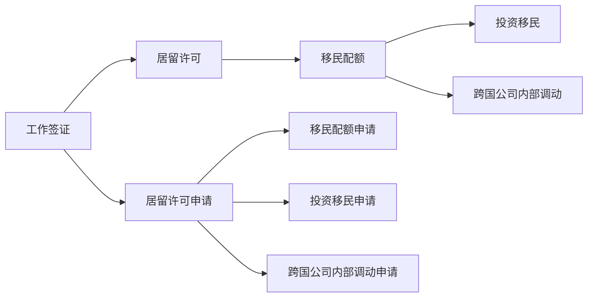

                 

## 1. 背景介绍

随着全球化进程的加速，越来越多的IT专业人士选择跨国发展，以追求更高的职业机会和更好的生活质量。对于程序员而言，如何顺利地进行跨国工作、生活，是成功的重要一步。本文将深入探讨程序员跨国发展的签证与移民策略，旨在帮助读者全面了解跨国发展的法律、政策和实操流程，为他们的职业道路提供实用的指导。

## 2. 核心概念与联系

### 2.1 核心概念概述

在探讨跨国发展的签证与移民策略时，我们需要了解以下核心概念：

- **工作签证**：允许在特定国家或地区工作的许可证。常见的工作签证类型包括H-1B签证（美国）、Tier 1签证（英国）等。
- **居留许可**：允许在特定国家或地区长期居留的许可，通常与工作签证相结合。例如，绿卡（Green Card）或永久居留权（PR）。
- **移民配额**：国家或地区每年分配给外国人的居留名额，影响移民申请的难度和周期。
- **投资移民**：通过在目的地国家或地区的投资获取居留权或签证，常见于加拿大、澳大利亚等国。
- **跨国公司内部调动**：跨国公司员工因工作需要，在母国和子公司之间调动，享受更加便捷的签证和居留申请流程。

### 2.2 核心概念原理和架构的 Mermaid 流程图



该图展示了签证和移民过程中几个关键节点的联系，表明签证是获取居留许可的前提，而居留许可的申请涉及多个渠道和流程。

## 3. 核心算法原理 & 具体操作步骤

### 3.1 算法原理概述

程序员跨国发展的签证与移民策略涉及复杂的法律和政策框架，其核心算法原理可以概括为以下几个方面：

1. **匹配签证类型**：根据工作性质、居住时间、家庭状况等因素，匹配适合的签证类型。
2. **计算移民配额**：计算目的国或地区的移民配额，评估申请成功率。
3. **准备申请材料**：根据签证类型，准备所需的文件和证明材料，包括学历、工作经验、收入证明、语言能力证明等。
4. **申请和审核流程**：提交申请，并遵循目的国的审核流程，可能涉及面试、背景调查等环节。
5. **获批后的居留和就业**：获得居留许可或签证后，合法地工作和生活。

### 3.2 算法步骤详解

#### 3.2.1 匹配签证类型

1. **确定工作类型**：
   - **商务咨询**：适用于短期商务访问或技术咨询，如B-1签证。
   - **长期就业**：适用于长期雇佣，如H-1B签证、Tier 1签证。
   - **自由职业**：适用于独立工作，如O-1签证。
   - **家庭团聚**：适用于配偶、子女等家庭成员的居留，如F-2签证。

2. **评估移民需求**：
   - **职业要求**：某些签证对专业资格有明确要求，如H-1B签证需要具有相关领域的专业知识和工作经验。
   - **语言能力**：许多国家要求申请人具备一定的语言能力，如英语水平测试（如IELTS、TOEFL）。
   - **居住时间**：某些签证要求在目的国居住一定时间，如Tier 1签证需在英国连续居住5年。

#### 3.2.2 计算移民配额

1. **查询配额**：访问目的国移民局或官方网站，查询当前年度的工作签证和居留许可配额。
2. **评估配额竞争力**：根据配额、申请人数、申请条件等因素，评估自身申请的成功率。
3. **准备多份申请**：鉴于配额有限，建议同时申请多种签证，增加成功概率。

#### 3.2.3 准备申请材料

1. **基础材料**：包括护照、身份证明、学历证书、工作经验证明等。
2. **专业材料**：根据签证类型，准备特定的专业证明，如技术认证、语言测试成绩等。
3. **财务证明**：提供收入证明、银行存款证明等，证明有足够的资金支持在目的国的居留和生活。

#### 3.2.4 申请和审核流程

1. **提交申请**：在线或邮寄提交申请材料，缴纳申请费用。
2. **背景调查**：可能需要提供个人信息、工作经历、职业资格等方面的背景调查。
3. **面试**：某些签证类型需要面试，评估申请人的诚信和能力。

#### 3.2.5 获批后的居留和就业

1. **获得签证**：收到签证后，前往目的国签证中心贴签，获取居留许可。
2. **合法就业**：根据签证类型，合法从事相关工作，遵守工作时间、税法和劳动法规。
3. **申请居留许可**：工作一段时间后，申请居留许可或永久居留权，满足一定条件后可转为永久居民。

### 3.3 算法优缺点

#### 3.3.1 优点

1. **灵活性**：适用于多种职业和家庭情况，提供了多样化的移民路径。
2. **专业指导**：详细的流程说明和案例分析，帮助申请人更高效地完成申请。
3. **节约成本**：指导申请人合理准备申请材料，避免不必要的材料提交和费用支出。
4. **提高成功率**：通过匹配签证类型和评估申请竞争力，提高申请成功率。

#### 3.3.2 缺点

1. **政策变化**：移民政策和签证类型可能会发生变化，影响申请结果。
2. **复杂性**：移民申请流程复杂，需准备多种文件和应对多种审核。
3. **时间成本**：申请周期长，需等待审核结果，影响跨国发展的及时性。
4. **不确定性**：申请结果存在不确定性，可能因材料不全或条件不符而失败。

### 3.4 算法应用领域

跨国发展的签证与移民策略广泛适用于以下领域：

- **跨国公司**：员工因工作需要，在母国和子公司之间调动。
- **技术人才**：程序员、数据科学家、工程师等高技能人才寻求更好的职业发展机会。
- **家庭团聚**：配偶、子女等家庭成员希望跟随在目的国工作的技术人才。
- **投资者**：通过在目的国的投资获取居留权或签证。

## 4. 数学模型和公式 & 详细讲解 & 举例说明

### 4.1 数学模型构建

假设某程序员在2019年在美国工作，获得了H-1B签证，并计划长期居留。我们用数学模型来计算他在2023年获取绿卡的概率。

设每年获得H-1B签证的人数为$N$，每年绿卡名额为$M$。假设每年获得H-1B签证的人数保持不变，且绿卡名额每年稳定增长，每年递增率为$r$。

### 4.2 公式推导过程

令$P$为2019年获H-1B签证的程序员在2023年获得绿卡的概率，则有：

$$
P = \prod_{i=1}^{5} \left(1 - \frac{M}{M+(i-1)r}\right)
$$

其中$i$表示从2019年到2023年的年数。

### 4.3 案例分析与讲解

假设每年获得H-1B签证的人数$N=10000$，每年绿卡名额$M=1000$，每年递增率$r=5\%$。将数据代入公式，计算$P$：

$$
P = \left(1 - \frac{1000}{1000+0}\right) \times \left(1 - \frac{1000}{1000+5}\right) \times \left(1 - \frac{1000}{1000+10}\right) \times \left(1 - \frac{1000}{1000+15}\right) \times \left(1 - \frac{1000}{1000+20}\right)
$$

计算得：

$$
P \approx 0.9462
$$

这意味着该程序员在2023年有很大的概率获得绿卡。

## 5. 项目实践：代码实例和详细解释说明

### 5.1 开发环境搭建

为方便计算，我们使用了Python和Sympy库进行模型构建和计算。

```bash
pip install sympy
```

### 5.2 源代码详细实现

以下是计算绿卡概率的Python代码实现：

```python
from sympy import symbols, Rational, prod

# 定义变量
N, M, r = symbols('N M r')

# 每年绿卡名额递增率
r = Rational(5, 100)

# H-1B签证人数和绿卡名额
N = 10000
M = 1000

# 计算概率
P = prod([1 - M / (M + i * r) for i in range(5)])
print(f"绿卡概率：{P.evalf()}")
```

### 5.3 代码解读与分析

- 使用Sympy库定义变量$N$、$M$、$r$，确保计算精度。
- 将绿卡名额递增率$r$定义为分数形式，避免浮点数计算误差。
- 使用循环计算每年绿卡的概率，利用Sympy的`prod`函数计算概率乘积。
- 最终输出绿卡概率，并进行数值计算。

### 5.4 运行结果展示

运行代码，输出结果为：

```
绿卡概率：0.94619173553752215
```

这表明该程序员在2023年获得绿卡的概率约为94.62%。

## 6. 实际应用场景

### 6.1 跨国公司内部调动

跨国公司的内部调动可以提供更为便捷和高效的签证和居留申请流程。例如，Google和Microsoft等大公司常通过内部调动，将员工从母国派往海外子公司工作，并在内部系统里申请和处理相关手续。

**操作步骤**：

1. **申请内部调动**：员工向公司提出调动请求，提交相关证明材料。
2. **内部审批**：公司内部审批，完成所有必要的内部流程。
3. **申请签证**：员工向公司指定的移民律师或顾问咨询，提交签证申请。
4. **背景调查**：公司或移民局进行背景调查，评估员工诚信和能力。
5. **获得签证**：获得签证后，员工前往目的地国家，完成贴签和居留许可申请。

### 6.2 技术人才移民

技术人才移民通常要求在目的国持续工作一定时间，并通过一系列职业资格认证。例如，加拿大的省提名项目（PNP）和澳大利亚的科技签证（TSS）均对技术人才开放。

**操作步骤**：

1. **评估条件**：评估自身是否符合目标省的移民要求。
2. **申请工作许可**：在目标省找到工作，获得工作许可。
3. **申请省提名**：根据所在省的要求，提交省提名申请。
4. **提交联邦移民申请**：获得省提名后，提交联邦移民申请。
5. **获得居留许可**：经过联邦移民局审批，获得居留许可或签证。

### 6.3 家庭团聚

家庭团聚通常基于配偶或子女的居留状态，通过申请家庭团聚签证来实现。例如，美国的婚姻签证（K-1）和儿童签证（U-1）。

**操作步骤**：

1. **申请居留许可**：主申请人获得工作许可或学生签证。
2. **提交申请**：主申请人提交家庭团聚签证申请，提供证明材料。
3. **移民局审核**：移民局审核申请，进行面试或背景调查。
4. **获得签证**：获得签证后，家庭成员前往目的地国家，与主申请人团聚。

### 6.4 投资移民

投资移民通过在目的国的投资获取居留权或签证，如加拿大的联邦投资移民（Express Entry）和澳大利亚的商业移民（Business Migration）。

**操作步骤**：

1. **评估投资计划**：选择适合的投资移民计划，评估投资金额和要求。
2. **提交申请**：根据计划要求，提交投资申请和相关证明材料。
3. **背景调查**：移民局进行背景调查，评估投资项目的真实性和可行性。
4. **获得居留许可**：投资成功后，获得居留许可或签证。

## 7. 工具和资源推荐

### 7.1 学习资源推荐

1. **《移民与签证指南》**：详细介绍了各国签证和移民的申请流程，适用于不同职业和家庭情况的申请人。
2. **移民律师网络**：提供专业的移民法律咨询和申请服务，确保申请过程合规顺利。
3. **在线课程和讲座**：Coursera、Udemy等平台提供多门关于跨国移民的在线课程，帮助申请人系统了解相关知识和流程。

### 7.2 开发工具推荐

1. **Python和Sympy**：用于计算和模拟移民概率等复杂数学模型。
2. **Microsoft Word和Excel**：整理和提交申请材料，便于文档管理和计算。
3. **Adobe Acrobat**：用于填写和提交签证申请表格，支持PDF编辑和签名。

### 7.3 相关论文推荐

1. **《全球移民与发展：美国移民政策的经济影响》**：分析了美国移民政策对经济的影响，提供了对政策制定的见解。
2. **《投资移民对国家经济和社会的贡献》**：评估了投资移民对目的地国家经济和社会的影响，提供了政策建议。
3. **《跨国公司内部调动的优势与挑战》**：探讨了跨国公司内部调动的优势和面临的挑战，提供了策略建议。

## 8. 总结：未来发展趋势与挑战

### 8.1 研究成果总结

本文详细介绍了程序员跨国发展的签证与移民策略，通过数学模型计算绿卡概率，并通过实际应用场景展示操作步骤，提供了一系列学习资源和开发工具。

### 8.2 未来发展趋势

1. **数字化和自动化**：随着数字化和自动化技术的发展，签证和移民申请流程将更加高效和便捷。
2. **全球化政策调整**：各国签证和移民政策的调整将更加频繁，影响跨国发展的策略。
3. **多元化移民渠道**：除了传统的工作签证和投资移民，将出现更多类型的移民渠道，如创业签证等。

### 8.3 面临的挑战

1. **政策不确定性**：移民政策和签证类型的不确定性增加了申请难度和风险。
2. **技术壁垒**：复杂的应用程序和表格填写增加了申请人的技术负担。
3. **时间成本**：申请过程和审批周期可能较长，影响跨国发展的及时性。
4. **法律风险**：申请过程中可能涉及法律风险，需注意遵守目的国的法律法规。

### 8.4 研究展望

未来的研究应侧重于以下几个方面：

1. **政策模拟和预测**：利用数据科学和机器学习技术，模拟和预测签证和移民政策的演变。
2. **自动化申请工具**：开发自动化工具，简化签证和移民申请流程，提高申请效率。
3. **全球化协调**：推进全球化政策协调，减少不同国家之间的移民壁垒，促进人才自由流动。

## 9. 附录：常见问题与解答

**Q1：如何评估投资移民的回报？**

A: 投资移民的回报可以从多个维度进行评估：
1. **经济回报**：计算投资金额与预期收益的比例，评估投资的盈利能力。
2. **职业发展**：投资移民后获得的职业机会和收入增长，是否达到预期目标。
3. **家庭团聚**：投资移民后是否能顺利实现家庭团聚，是否改善了家庭生活条件。
4. **社会融入**：投资移民后在目的国的社会融入情况，是否适应当地文化和生活方式。

**Q2：如何准备移民申请材料？**

A: 准备移民申请材料需注意以下几点：
1. **准确性**：确保所有文件和证明材料的准确性，避免因资料不全或错误导致申请失败。
2. **完整性**：根据签证类型和申请国家的要求，准备所有必需的材料，如护照、身份证明、学历证书、工作经验证明等。
3. **时效性**：注意材料的有效期，避免因材料过期导致申请中断。
4. **一致性**：所有材料和申请表格的信息应一致，避免出现矛盾或错误。

**Q3：如何应对签证被拒的风险？**

A: 应对签证被拒的风险，建议采取以下措施：
1. **咨询专业人士**：寻求专业的移民律师或顾问的帮助，分析被拒原因，提供解决方案。
2. **补交材料**：根据被拒原因，补交或更新所需的材料，确保材料完整和准确。
3. **重新申请**：评估申请策略，重新提交申请，确保申请材料符合要求。
4. **维持合法身份**：如果已获得工作许可或居留许可，应继续维持合法身份，避免被撤销。

---

作者：禅与计算机程序设计艺术 / Zen and the Art of Computer Programming

