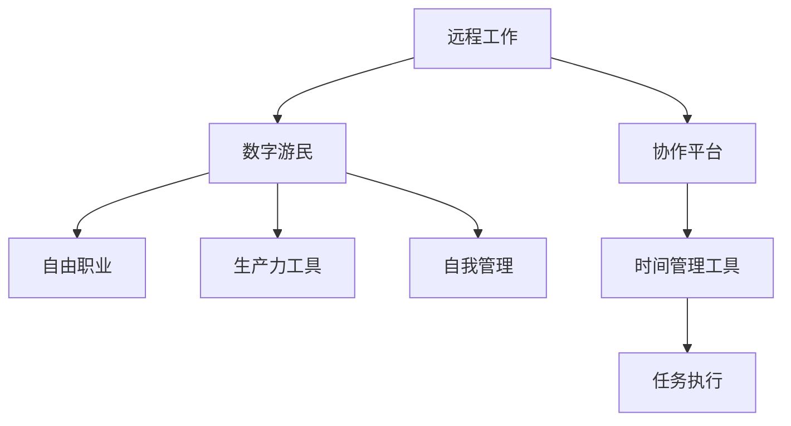

                 

# 程序员的远程工作：环游世界的数字游民生活

> 关键词：远程工作,数字游民,程序员,生产力提升,跨文化交流,自我管理

## 1. 背景介绍

### 1.1 问题由来
随着互联网技术的普及和全球化进程的加速，远程工作已成为越来越多人选择的生活方式。特别是对于程序员而言，不受地点限制的灵活工作模式，不仅能提升工作效率，还能给予他们更多的时间和空间去探索世界，享受更自由、健康的生活方式。数字游民(digital nomad)便是在这一背景下应运而生的一个新兴群体。

数字游民一词最早由Steve Jobs在1985年提出，指的是通过互联网技术实现自由职业者身份，可以随时随地工作、生活，不受地域限制。这种生活方式对传统的职业观和工作方式提出了新的挑战和可能性，同时也为那些追求生活质量和职业自由的人提供了新的选择。

### 1.2 问题核心关键点
本文将重点探讨远程工作和数字游民的生活方式，具体聚焦于以下几点：
- 远程工作模式的现状和优势
- 数字游民面临的挑战和应对策略
- 数字游民的自我管理和时间管理技巧
- 数字游民的跨文化交流体验
- 数字游民的自由职业平台和工具推荐

通过系统分析这些关键点，本文旨在为那些希望尝试远程工作和数字游民生活方式的程序员和自由职业者提供一份详细的指南，帮助他们实现职业和生活的新平衡。

## 2. 核心概念与联系

### 2.1 核心概念概述

为更好地理解远程工作和数字游民的生活，本节将介绍几个关键概念：

- 远程工作(Remote Work)：指通过互联网和移动设备实现员工在任意地点进行工作的模式，具备灵活性、自主性和高生产力等特点。
- 数字游民(Digital Nomad)：指那些通过互联网技术，不受地点限制，随时随地进行自由职业工作的人，他们通常会在全球各地移动办公和生活。
- 自由职业(Freelancing)：指通过第三方平台或直接接取客户的项目，以项目为导向的工作方式。
- 生产力工具(Production Tools)：指用于提升远程工作和数字游民工作效率的各种软件和工具，如协作平台、时间管理工具等。
- 自我管理(Self-Management)：指在远程工作环境中，员工对自己工作的安排、时间管理、任务执行等方面的自主管理能力。

这些核心概念之间的逻辑关系可以通过以下Mermaid流程图来展示：



这个流程图展示了他这些核心概念的相互关系：

1. 远程工作为数字游民提供了不受地域限制的灵活工作模式。
2. 数字游民通常选择自由职业方式进行工作，可以接取各种项目任务。
3. 数字游民需依赖各种生产力工具来提升效率。
4. 自我管理能力对于数字游民来说至关重要，有助于提高工作和生活质量。

## 3. 核心算法原理 & 具体操作步骤

### 3.1 算法原理概述

远程工作和数字游民的算法原理主要基于三个核心模型：生产力提升模型、任务执行模型和跨文化交流模型。

- **生产力提升模型**：通过数据分析和机器学习算法，识别出能够提升工作效率的策略和工具，并根据个人工作习惯和偏好进行个性化推荐。
- **任务执行模型**：结合项目管理和时间管理技术，构建任务优先级和时间规划模型，确保任务按时完成。
- **跨文化交流模型**：通过自然语言处理和情感分析技术，识别出不同文化背景下的交流障碍，并提出改善建议，提升跨文化沟通效率。

这些模型共同构成了数字游民在远程工作环境下的核心算法框架，帮助他们实现高效、舒适的工作和生活状态。

### 3.2 算法步骤详解

数字游民的生活方式可以通过以下步骤来实现：

**Step 1: 选择适合的平台和工具**
- 根据个人需求和项目类型，选择合适的远程工作平台和生产力工具。
- 评估工具的功能和易用性，确保能够有效提升工作效率。

**Step 2: 设计个人时间管理策略**
- 确定每日/每周的工作计划和目标，合理安排工作和休息时间。
- 使用时间管理工具记录任务进度，确保按时完成任务。

**Step 3: 提升跨文化交流能力**
- 学习和应用基本的跨文化沟通技巧，了解不同文化背景下的沟通习惯和期望。
- 使用自然语言处理工具处理语言障碍，提升沟通效率。

**Step 4: 持续优化个人体验**
- 定期评估远程工作和生活状态，总结经验教训。
- 根据反馈调整个人时间管理策略和生产力工具使用，不断提升工作效率和生活质量。

### 3.3 算法优缺点

远程工作和数字游民生活方式具有以下优点：
1. 提升工作效率。不受地域限制，可以根据个人最佳工作时间安排任务。
2. 提升生活质量。有更多时间进行旅行、运动等活动，保持健康和活力。
3. 增加职业自由度。可以根据自身兴趣和项目需求灵活选择工作地点，实现职业与生活的平衡。

同时，该方法也存在以下局限性：
1. 网络依赖性高。需要稳定、高速的网络环境，对于网络基础设施较差的地方，工作效果可能大打折扣。
2. 心理挑战大。长时间在陌生环境中工作，容易感到孤独和焦虑。
3. 文化差异需要适应。不同文化背景下的工作习惯和生活方式需要适应，适应过程可能漫长。
4. 时间管理难度高。自主时间增多，容易在时间管理上出现混乱。

尽管存在这些局限性，但就目前而言，远程工作和数字游民生活方式正逐渐成为许多自由职业者和程序员的现实选择，其带来的工作和生活方式的改变是不可忽视的。

### 3.4 算法应用领域

远程工作和数字游民的生活方式在多个领域都有广泛应用：

- 技术行业：程序员、工程师、设计师等自由职业者在远程项目中高效协作，享受灵活工作时间。
- 创意产业：作家、艺术家、音乐家等可以在世界各地进行创作，获取灵感。
- 营销和广告：市场分析师、广告创意人员等通过移动办公，更好地理解不同市场和受众。
- 教育领域：教师、讲师、课程设计师等通过远程办公，实现全球教学和课程设计。
- 咨询服务：咨询顾问、专家等可以在全球各地进行咨询，为不同地域的客户提供服务。

这些领域的需求推动了远程工作和数字游民生活方式的发展，为更多人提供了新的职业和生活选择。

## 4. 数学模型和公式 & 详细讲解 & 举例说明

### 4.1 数学模型构建

本节将使用数学语言对远程工作和数字游民的算法原理进行更严格的刻画。

记远程工作系统为 $S=(P, M, T, C)$，其中 $P$ 为生产力工具集，$M$ 为任务管理模型，$T$ 为时间管理策略，$C$ 为跨文化交流能力。远程工作的效果 $E$ 可以通过以下模型来表示：

$$
E = f(P, M, T, C)
$$

其中 $f$ 为一个多变量函数，表示生产力工具、任务管理、时间管理、跨文化交流等变量对远程工作效果的综合影响。

### 4.2 公式推导过程

以任务执行模型为例，假设数字游民的任务集合为 $\{T_1, T_2, \cdots, T_n\}$，任务优先级向量为 $\{w_1, w_2, \cdots, w_n\}$，每日工作时间长度为 $L$，每日任务完成量 $C_i$ 可以表示为：

$$
C_i = \sum_{k=1}^n w_k \cdot \frac{T_k}{L}, \quad i=1,2,\cdots,n
$$

其中 $w_k$ 为任务 $T_k$ 的优先级权重。假设每个任务 $T_k$ 的预计完成时间 $T_k$ 已知，则任务完成量 $C_i$ 可以通过优先级权重 $w_k$ 来调整，确保优先完成重要任务。

### 4.3 案例分析与讲解

假设数字游民小明希望在一周内完成以下任务：

- 项目A，完成时间预计为5天，优先级0.8
- 项目B，完成时间预计为3天，优先级0.7
- 项目C，完成时间预计为4天，优先级0.9

假设他每天工作8小时，可以计算出各项目的任务完成量：

- 项目A：$C_A = 0.8 \cdot \frac{5}{8} = 3.75$ 天
- 项目B：$C_B = 0.7 \cdot \frac{3}{8} = 2.1125$ 天
- 项目C：$C_C = 0.9 \cdot \frac{4}{8} = 2.25$ 天

根据任务优先级，小明可以调整每日任务安排，确保完成量最大的项目优先完成。例如，小明可以将项目C和项目B安排在前三天完成，项目A安排在后三天完成。

## 5. 项目实践：代码实例和详细解释说明

### 5.1 开发环境搭建

在进行远程工作实践前，我们需要准备好开发环境。以下是使用Python进行Jupyter Notebook开发的环境配置流程：

1. 安装Anaconda：从官网下载并安装Anaconda，用于创建独立的Python环境。

2. 创建并激活虚拟环境：
```bash
conda create -n remote-work-env python=3.8 
conda activate remote-work-env
```

3. 安装必要的库：
```bash
conda install jupyterlab ipywidgets
```

4. 安装Jupyter Lab：
```bash
conda install jupyterlab
```

5. 安装时间管理工具和协作平台：
```bash
conda install py-todoist
```

完成上述步骤后，即可在`remote-work-env`环境中开始远程工作实践。

### 5.2 源代码详细实现

下面我们以Jupyter Notebook为例，给出使用Python进行远程工作管理的代码实现。

首先，定义时间管理函数：

```python
import pandas as pd
import numpy as np

def calculate_task_schedule():
    # 定义任务集合和优先级
    tasks = ['项目A', '项目B', '项目C']
    priorities = [0.8, 0.7, 0.9]
    
    # 定义每天工作时间长度
    daily_hours = 8
    
    # 计算任务完成量
    task_durations = [5, 3, 4]
    task_schedule = []
    for task, priority in zip(tasks, priorities):
        task_schedule.append((priority, task_durations, task))
    
    # 按优先级排序
    task_schedule.sort(key=lambda x: x[0], reverse=True)
    
    # 分配任务
    daily_tasks = []
    remaining_hours = daily_hours
    for i, (priority, duration, task) in enumerate(task_schedule):
        if remaining_hours >= duration:
            daily_tasks.append((task, duration))
            remaining_hours -= duration
        else:
            daily_tasks.append((task, remaining_hours))
            remaining_hours = 0
    
    return daily_tasks

# 调用函数并输出结果
daily_tasks = calculate_task_schedule()
print(daily_tasks)
```

然后，使用Jupyter Notebook的交互式界面，实时调整任务安排：

```python
from ipywidgets import Layout, HBox

# 定义任务安排表格
task_schedule = pd.DataFrame(
    data=daily_tasks,
    columns=['任务', '完成时间'],
    index=range(1, len(daily_tasks)+1)
)

# 显示任务安排表格
task_schedule.head(5).set_style(Layout(width='400px'))

# 定义任务完成情况的更新函数
def update_schedule():
    task_schedule = pd.DataFrame(
        data=calculate_task_schedule(),
        columns=['任务', '完成时间'],
        index=range(1, len(daily_tasks)+1)
    )
    task_schedule.head(5).set_style(Layout(width='400px'))
    
    # 返回更新后的表格
    return task_schedule.head(5)

# 定义交互式界面
schedule_widget = HBox([task_schedule.head(5)])

# 绑定更新函数
schedule_widget.observe(update_schedule, names='value')

# 显示交互式界面
schedule_widget
```

可以看到，通过Python和Jupyter Notebook，我们可以轻松地进行任务安排和时间管理。代码实现了任务优先级调整和每日任务分配，并通过交互式界面实时显示任务安排情况。

### 5.3 代码解读与分析

让我们再详细解读一下关键代码的实现细节：

**calculate_task_schedule函数**：
- 定义任务集合和优先级。
- 计算每个任务完成所需时间。
- 按优先级排序。
- 分配每日任务，确保高优先级任务优先完成。

**Jupyter Notebook的交互式界面**：
- 使用`ipwrights`库创建交互式表格。
- 定义更新函数`update_schedule`，计算并更新任务安排。
- 绑定更新函数到交互界面，确保实时显示任务安排。

通过这些代码实现，可以有效地进行远程工作的时间管理和任务安排。

当然，在实际应用中，我们还需要考虑更多因素，如跨文化交流、生产力工具的使用等。但核心的远程工作管理逻辑基本与此类似。

## 6. 实际应用场景

### 6.1 技术公司

技术公司通常鼓励员工进行远程工作，以便利用全球人才库和提高工作效率。许多大型科技公司，如Google、Facebook、Microsoft等，都允许员工根据项目需求在全球范围内自由选择工作地点。

在实际应用中，技术公司通常会提供以下支持：
- 全球化的协作工具：如Slack、Microsoft Teams等，方便团队成员跨地域协作。
- 灵活的工作时间：允许员工根据时区和个人工作习惯调整工作时间。
- 项目管理系统：如Trello、Asana、Jira等，帮助团队管理项目进度和任务分配。

通过这些工具和政策，技术公司能够更好地支持员工进行远程工作，提升团队整体效率和满意度。

### 6.2 创意产业

创意产业如写作、设计、音乐等，通常需要灵感和自由的空间，因此数字游民的生活方式尤为适用。许多创意人员通过远程工作，可以在不同的文化和环境中获取更多灵感，激发创造力。

在实际应用中，创意产业的数字游民通常会使用以下工具：
- 云存储和协作工具：如Dropbox、Google Drive等，方便存储和共享创意作品。
- 时间管理工具：如Toggl、RescueTime等，帮助监控时间使用情况，提升生产力。
- 创意设计工具：如Adobe Creative Cloud、Sketch等，提供强大的设计支持。

通过这些工具，创意人员可以更好地进行远程工作，实现职业和生活的平衡。

### 6.3 营销和广告

营销和广告行业通常需要在不同地域进行市场分析，数字游民的生活方式提供了灵活的跨地域工作模式，帮助企业更好地理解全球市场。

在实际应用中，营销和广告行业的数字游民通常会使用以下工具：
- 数据分析工具：如Google Analytics、Tableau等，进行市场分析和数据可视化。
- 协作平台：如Zoom、Skype等，方便与全球客户和合作伙伴进行视频会议。
- 项目管理工具：如Trello、Asana等，帮助管理营销项目进度和资源分配。

通过这些工具，营销和广告行业的数字游民可以更好地进行全球市场分析，提升企业营销效果。

### 6.4 未来应用展望

随着远程工作模式的普及和数字游民生活方式的不断发展，未来在多个领域将呈现以下趋势：

1. **全球人才库的利用**：越来越多的公司会利用全球人才库，进行全球招聘和远程工作，提升团队多样性和创新力。
2. **跨文化交流的增强**：数字游民的生活方式将推动跨文化交流和全球化合作，帮助企业更好地融入全球市场。
3. **灵活工作时间的普及**：灵活工作时间的政策将逐渐普及，员工可以根据个人需求和工作习惯调整工作时间，提升工作效率和生活质量。
4. **生产力工具的整合**：未来的生产力工具将更加集成化，提供一站式服务，帮助用户更高效地进行远程工作。
5. **移动设备的普及**：移动设备的普及将进一步推动远程工作和数字游民生活方式的发展，提升工作灵活性和便利性。

以上趋势凸显了远程工作和数字游民生活方式的广阔前景。这些方向的探索发展，将为更多人提供新的职业和生活选择，推动全球化合作和创新。

## 7. 工具和资源推荐

### 7.1 学习资源推荐

为了帮助数字游民更好地理解和实践远程工作模式，这里推荐一些优质的学习资源：

1. 《数字游民手册》系列博文：由数字游民社区撰写，提供了全面的远程工作指南和实践经验。

2. Coursera《远程工作与数字游民》课程：由多位数字游民和自由职业者分享远程工作的心得和技巧。

3. 《数字游民：自由职业者的未来》书籍：详细介绍了数字游民的生活方式和工作模式，提供了实用的建议和策略。

4. WeWork Remotely网站：提供了大量的远程工作技巧和资源，包括工具推荐、案例分析等。

通过这些资源的学习实践，相信你一定能够更好地掌握远程工作和数字游民的生活方式，并应用于实际工作。

### 7.2 开发工具推荐

高效的开发离不开优秀的工具支持。以下是几款用于远程工作和数字游民管理的常用工具：

1. Slack：全球化的协作工具，方便团队成员跨地域协作。
2. Google Drive：云存储和协作工具，方便存储和共享文件。
3. Trello：项目管理工具，帮助管理任务进度和资源分配。
4. Zoom：视频会议工具，方便与全球客户和合作伙伴进行沟通。
5. Todoist：时间管理工具，帮助监控时间使用情况，提升生产力。

合理利用这些工具，可以显著提升远程工作和数字游民的管理效率，加快创新迭代的步伐。

### 7.3 相关论文推荐

数字游民生活方式的发展源于学界的持续研究。以下是几篇奠基性的相关论文，推荐阅读：

1. "The Rise of the Digital Nomad: A New Lifestyle for the Future" - Coco, L. (2021)
2. "Remote Work and Digital Nomadism: Trends, Challenges, and Opportunities" - Bell, A. (2020)
3. "Digital Nomadism: A New Way of Life for the Digital Age" - Gomis, C. (2019)
4. "The Digital Nomad Handbook: How to Work From Anywhere" - Crystal, C. (2018)
5. "The Future of Work: Digital Nomads and Remote Employees" - Pasha, J. (2017)

这些论文代表了大语言模型微调技术的发展脉络。通过学习这些前沿成果，可以帮助研究者把握学科前进方向，激发更多的创新灵感。

## 8. 总结：未来发展趋势与挑战

### 8.1 总结

本文对远程工作和数字游民的生活方式进行了全面系统的介绍。首先阐述了远程工作和数字游民的现状和优势，明确了其在工作和生活中的独特价值。其次，从原理到实践，详细讲解了远程工作的算法模型和具体操作步骤，给出了远程工作任务管理的完整代码实现。同时，本文还广泛探讨了数字游民在技术、创意、营销等众多领域的应用前景，展示了其生活方式的广泛适用性。此外，本文精选了远程工作和数字游民的相关资源，力求为读者提供全方位的技术指引。

通过本文的系统梳理，可以看到，远程工作和数字游民生活方式正在成为越来越多人的现实选择，其带来的工作和生活方式的改变是不可忽视的。未来，伴随互联网技术的不断进步和全球化进程的加速，远程工作和数字游民的生活方式必将在更多领域得到应用，为经济社会发展注入新的动力。

### 8.2 未来发展趋势

展望未来，远程工作和数字游民生活方式将呈现以下几个发展趋势：

1. **全球人才库的利用**：越来越多的公司将利用全球人才库，进行全球招聘和远程工作，提升团队多样性和创新力。
2. **跨文化交流的增强**：数字游民的生活方式将推动跨文化交流和全球化合作，帮助企业更好地融入全球市场。
3. **灵活工作时间的普及**：灵活工作时间的政策将逐渐普及，员工可以根据个人需求和工作习惯调整工作时间，提升工作效率和生活质量。
4. **生产力工具的整合**：未来的生产力工具将更加集成化，提供一站式服务，帮助用户更高效地进行远程工作。
5. **移动设备的普及**：移动设备的普及将进一步推动远程工作和数字游民生活方式的发展，提升工作灵活性和便利性。

以上趋势凸显了远程工作和数字游民生活方式的广阔前景。这些方向的探索发展，将为更多人提供新的职业和生活选择，推动全球化合作和创新。

### 8.3 面临的挑战

尽管远程工作和数字游民生活方式已经取得了显著成效，但在迈向更加智能化、普适化应用的过程中，仍面临诸多挑战：

1. **网络依赖性**：需要稳定、高速的网络环境，对于网络基础设施较差的地方，工作效果可能大打折扣。
2. **心理挑战**：长时间在陌生环境中工作，容易感到孤独和焦虑。
3. **文化差异**：不同文化背景下的工作习惯和生活方式需要适应，适应过程可能漫长。
4. **时间管理难度**：自主时间增多，容易在时间管理上出现混乱。
5. **健康问题**：长时间久坐和不规律作息容易导致身体和心理问题。

尽管存在这些挑战，但就目前而言，远程工作和数字游民生活方式正逐渐成为许多自由职业者和程序员的现实选择，其带来的工作和生活方式的改变是不可忽视的。

### 8.4 研究展望

面对远程工作和数字游民面临的挑战，未来的研究需要在以下几个方面寻求新的突破：

1. **提升网络基础设施**：改善网络环境，确保远程工作者能够在全球范围内高效工作。
2. **心理健康支持**：提供心理健康服务，帮助远程工作者应对孤独和焦虑等问题。
3. **文化适应培训**：提供跨文化交流培训，帮助远程工作者适应不同文化背景的工作和生活方式。
4. **时间管理工具**：开发更先进的时间管理工具，帮助用户更好地安排工作和生活。
5. **健康管理工具**：开发健康管理工具，提醒用户注意健康，避免长时间久坐等不良习惯。

这些研究方向的探索，将为远程工作和数字游民生活方式的发展提供新的动力，使其更加成熟和稳定。

## 9. 附录：常见问题与解答

**Q1：远程工作需要哪些关键技能？**

A: 远程工作需要以下关键技能：
1. **自我管理**：自主安排工作任务，监控时间使用情况。
2. **沟通能力**：通过视频会议、即时通讯等工具进行跨地域沟通。
3. **技术技能**：熟练使用远程工作工具和平台，如协作工具、项目管理工具等。
4. **时间管理**：合理安排工作时间，避免加班。
5. **技术支持**：具备基本的网络和技术问题解决能力。

**Q2：数字游民如何保持高效？**

A: 数字游民可以通过以下方式保持高效：
1. **任务优先级**：确定每日/每周任务清单，优先完成重要任务。
2. **时间块管理**：将一天分成多个时间块，专注于特定任务，避免多任务处理。
3. **专注工具**：使用专注工具（如Forest、Focus@Will等）提高专注度。
4. **定期休息**：遵循番茄工作法（25分钟工作，5分钟休息），保持高效。

**Q3：数字游民如何解决孤独感？**

A: 数字游民可以通过以下方式解决孤独感：
1. **社交活动**：加入数字游民社区，参加线上或线下活动。
2. **运动和健身**：进行户外运动或健身房锻炼，保持身体健康。
3. **志愿服务**：参与当地的志愿活动，结识新朋友。
4. **远程工作支持平台**：加入远程工作支持平台，与同行交流经验。

**Q4：如何选择合适的远程工作平台？**

A: 选择合适的远程工作平台需要考虑以下因素：
1. **功能完备性**：平台是否具备协作、项目管理、时间管理等功能。
2. **易用性**：平台是否用户友好，使用便捷。
3. **安全性**：平台是否具备数据加密、用户认证等安全措施。
4. **兼容性**：平台是否支持多种设备和操作系统。
5. **用户口碑**：平台的用户评价和反馈，选择口碑好的平台。

**Q5：数字游民如何保持健康生活方式？**

A: 数字游民可以通过以下方式保持健康生活方式：
1. **规律作息**：保持规律的作息时间，避免熬夜。
2. **健康饮食**：注意营养均衡，避免长期外卖。
3. **定期锻炼**：进行户外运动或健身房锻炼，保持身体健康。
4. **心理健康**：进行冥想、阅读等活动，保持心理健康。
5. **远程医疗**：进行远程医疗咨询，解决健康问题。

通过这些方法，数字游民可以在享受自由职业和旅行生活的同时，保持健康和高效的工作状态。

---

作者：禅与计算机程序设计艺术 / Zen and the Art of Computer Programming

